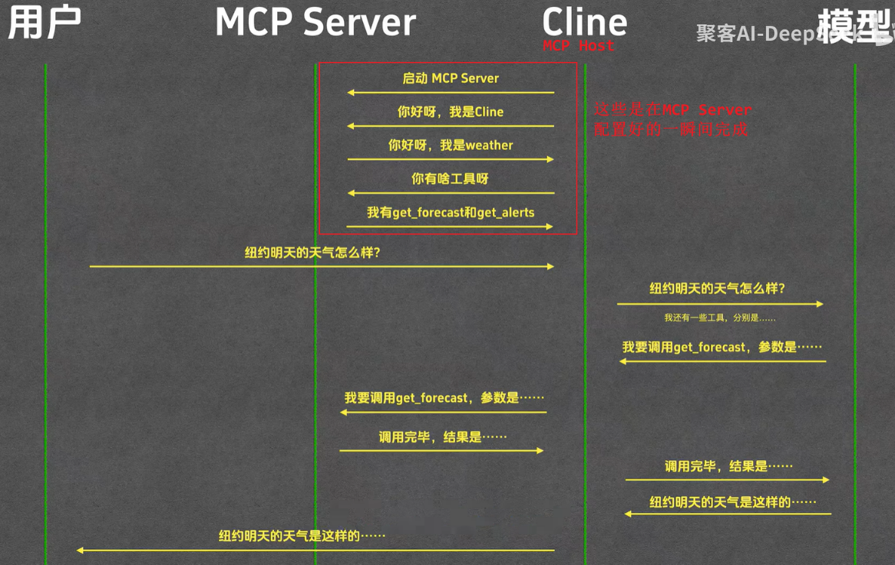
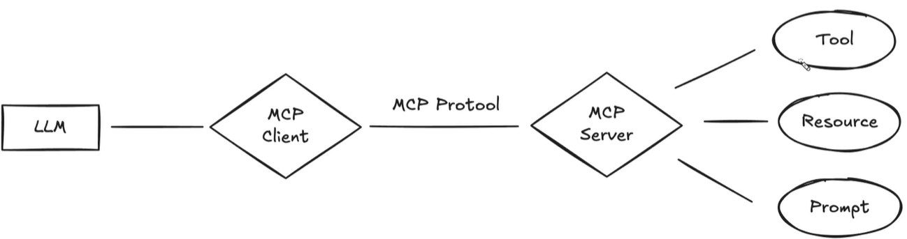
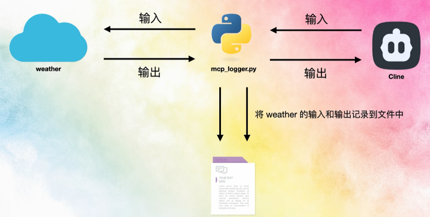
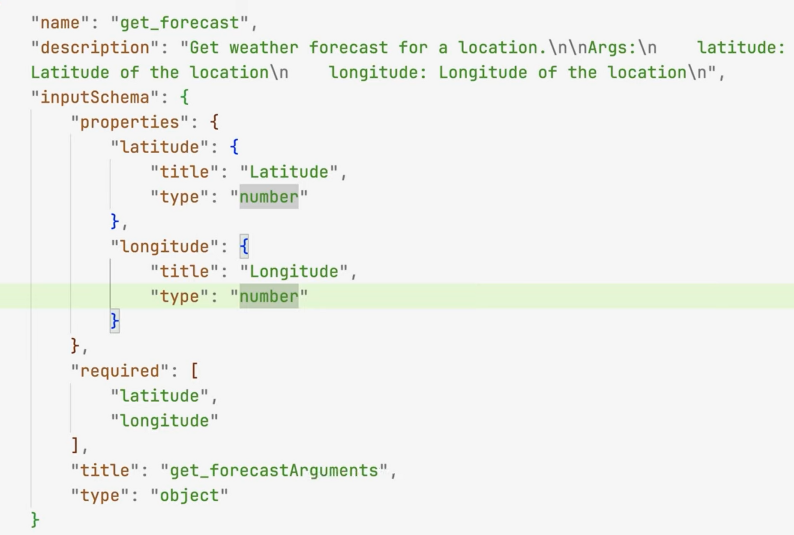

# MCP

- [MCP](#mcp)
  - [MCP基础与使用](#mcp基础与使用)
  - [Write a MCP Server](#write-a-mcp-server)
    - [python MCP Server](#python-mcp-server)
  - [MCP底层协议解析](#mcp底层协议解析)

## MCP基础与使用

Model Context Protocol是Anthropic在2024/11/25发布的一个新协议，旨在解决LLM和工具之间的交互问题。

简单来说就是LLM的**标准化工具箱**。

* MCP Host: Claude Desktop, Cursor, Cline, Cherry studio
* MCP Server: 大部分MCP server都是本地通过nodejs或python提供的，只不过使用的时候可能会联网，但也可能仅本地就ok。（区别于传统的server）
  * > 所以MCP Server带个Server是有些容易误解的，其实就是一个程序应用，有各自的功能模块，也即MCP Server中的**tool**（其实也就是一个function

* 有些MCP Host会自动安装MCP server，有些只能手动
* LLM自己会阅读MCP server的github readme中的安装说明来自动安装server，但我不希望LLM乱搞，就是不太放心，所以还是自己装


<!--    -->


MCP server市场

* mcp.so
* mcpmarket.com

---

==MCP Server大多是使用**python和nodejs**进行编写，对应的**启动程序**分别是**uvx和npx**==

* uvx是`uv tool run`的缩写
* uv简单来说是一个包管理工具，类似pip，uvx可以直接用于启动python程序

```json
// uvx示例 (fetch):
"mcpServers": {
  "fetch": {
    "command": "uvx",
    "args": ["mcp-server-fetch"]
  }
}
```
fetch是一个基于python的MCP server，uvx会自动安装并启动它。prompt示例：`请抓取这个网页的内容，并转为markdown，存到文件test.md中：https://www.anthropic.com/news/model-context-protocol`

* npx类似于uvx，不过uvx安装的是python程序，npx安装的是node程序

```json
// npx示例 (mcp-server-hotnews):
"mcp-server-hotnews": {
    "command": "npx",
    "args": [
    "-y",
    "@wopal/mcp-server-hotnews"
    ]
} 

// npx可能报错，可以用cmd包一层
// "mcp-server-hotnews": {
//     "command": "cmd",
//     "args": [
//     "/c",
//     "npx -y @wopal/mcp-server-hotnews"
//     ]
// }
```

除此之外还有其他的安装方式...自己探索吧
<!-- 
---

> * 如果A项目使用python的LangGraph写了一个tool，然后项目B想用该tool，但是是用js写的，此时就得新写一个同样功能的tool，这时候我们就会想，如果将tool**抽象为独立的服务**，使得不同语言和平台的应用程序可以通过统一的方式调用这些工具，类似于调用 API。于是MCP架构诞生了
> * 服务：一个可以独立部署、远程调用、提供标准接口的程序模块。运行在服务器上，可以提供标准化接口（eg http, grpc）以供调用


由于tools缺乏统一性，不好复用。所以Anthropic提出了MCP协议

MCP: Model Context Protocol, 一个社区共建的开放协议，提供一个通用的开放标准，用于连接LLM和外部数据、工具或者行为。

MCP的主要特点：

* 统一的工具调用格式：不同的工具都遵循相同的调用格式，方便复用和维护
* 上下文管理：提供统一的上下文管理机制，让模型更好地理解和使用工具
* 可扩展性：可以方便地添加新的工具和功能
* 跨平台兼容：不同的LLM平台都可以使用相同的协议

---

MCP架构：

* 同样是C/S架构：我们的CS架构是client和server通过http协议通信
* 而MCP架构同样有client和server，是通过MCP Protocol通信
  * 除了Client和server，还有Host（主机），负责启动连接，管理client，起到协调作用吧大概
* client负责和LLm和user交互，server负责和tool, resource交互

   -->


## Write a MCP Server

> 1. wirte a MCP server
> 2. 截获MCP的输入和输出并逐行分析MCP底层协议原理
> 3. 回顾MCP的含义和地位

* MCP与language无关。可以用多种语言或框架来实现MCP Server, 比如Python, Node.js, Java, C#等；了解了MCP底层原理后，你甚至可以用bash script来写MCP Server。

### python MCP Server

1. `uv init weather`: 借助uv工具创建一个名为weather的项目
2. `uv venv`: 创建一个虚拟环境，防止影响到系统环境
3. `source .venv/scripts/activate`: 激活/进入虚拟环境
4. `uv install "mcp[cli]" httpx`: 安装MCP核心依赖 和 httpx库(用于http请求)
5. 编码
6. 配置到MCP Host
7. 即可开始提问：`纽约明天天气如何`（只会调用get_forecast这个tool）

```python
from typing import Any
import httpx
from mcp.server.fastmcp import FastMCP

# Initialize the FastMCP server
mcp = FastMCP("weather", log_level="ERROR") # 用于快速构建MCP服务，返回一个MCP对象；ERROR为了避免干扰

# Constants
NWS_API_BASE = "https://api.weather.gov"
USER_AGENT = "weather-app/1.0" # 请求数据的标识，告诉这个网站我们是谁


# 工具类函数：用于请求天气数据
async def make_nws_request(url: str) -> dict[str, Any] | None:
    """Make a request to the NWS API with proper error handling."""
    headers = {
        "User-Agent": USER_AGENT,
        "Accept": "application/geo+json"
    }
    async with httpx.AsyncClient() as client: # 使用http库调用指定url
        try:
            response = await client.get(url, headers=headers, timeout=30.0)
            response.raise_for_status()
            return response.json() # 返回http响应
        except Exception:
            return None

# 工具类函数：对alert数据做格式化
def format_alert(feature: dict) -> str:
    """Format an alert feature into a readable string."""
    props = feature["properties"]
    return f"""
Event: {props.get('event', 'Unknown')}
Area: {props.get('areaDesc', 'Unknown')}
Severity: {props.get('severity', 'Unknown')}
Description: {props.get('description', 'No description available')}
Instructions: {props.get('instruction', 'No specific instructions provided')}
"""

# MCP Server的第一个tool
@mcp.tool()
async def get_alerts(state: str) -> str:
    """Get weather alerts for a US state.

    Args:
        state: Two-letter US state code (e.g. CA, NY)
    """
    url = f"{NWS_API_BASE}/alerts/active/area/{state}"
    data = await make_nws_request(url)

    if not data or "features" not in data:
        return "Unable to fetch alerts or no alerts found."

    if not data["features"]: # 不存在预警
        return "No active alerts for this state."

    alerts = [format_alert(feature) for feature in data["features"]] # 对预警格式化
    return "\n---\n".join(alerts)

# MCP Server的第二个tool
# 该装饰器用于将函数注册为tool，它会从函数的注释用提取这个函数的用途，以及每个参数的含义，以便LLM调用
# 包括函数名、参数名、函数功能、参数功能
@mcp.tool() 
async def get_forecast(latitude: float, longitude: float) -> str:
    """Get weather forecast for a location.

    Args:
        latitude: Latitude of the location
        longitude: Longitude of the location
    """
    # First get the forecast grid endpoint
    points_url = f"{NWS_API_BASE}/points/{latitude},{longitude}"
    points_data = await make_nws_request(points_url)

    if not points_data:
        return "Unable to fetch forecast data for this location."

    # Get the forecast URL from the points response
    forecast_url = points_data["properties"]["forecast"]
    forecast_data = await make_nws_request(forecast_url)

    if not forecast_data:
        return "Unable to fetch detailed forecast."

    # Format the periods into a readable forecast
    periods = forecast_data["properties"]["periods"]
    forecasts = []
    for period in periods[:5]:  # Only show next 5 periods
        forecast = f"""
                    {period['name']}:
                    Temperature: {period['temperature']}°{period['temperatureUnit']}
                    Wind: {period['windSpeed']} {period['windDirection']}
                    Forecast: {period['detailedForecast']}
                    """
        forecasts.append(forecast)

    return "\n---\n".join(forecasts)

if __name__ == "__main__":
    mcp.run(transport="stdio") # 运行MCP服务，使用stdio作为传输方式
```

```json
// vscode copilot
"my-weather": {
    "type": "stdio",
    "command": "uv",
    "args": [
        "--directory",
        "E:\\Desktop\\weather",
        "run",
        "weather.py"
    ]
}
```

## MCP底层协议解析

上述手写的MCP server中利用了mcp.server.fastmcp这个库，提供了一个快速构建MCP服务的工具，这个库底层帮我们做了那些事情呢？

* 大部分MCP Server都是通过输入和输出与Host沟通的

利用gpt写了个脚本，**在MCP host和MCP server之间**，获取二者的输入和输出数据，存到文件中，便于分析

  

分析流程如下：

1. MCP Host(eg Cline)向MCP Server打招呼，通知MCP协议版本、Host名称、版本号等
2. MCP Server接收打招呼的消息，也返回一些信息，包括MCP协议版本、Server名称、版本号等
3. Host收到，Host发送消息，**想要知道Server支持的tool**列表
5. Server返回tool列表
   1. 每个tool包括：name, description, **inputSchema**(输入参数、入参规范), （这些都是从我们的python代码中自动提取出来的，借助docstring，装饰器啥的自动提取的
6. 上述都是我们在注册工具的一瞬间做好的，后续就该使用了
7. Host发送消息，想要调用tool，包括tool名称、输入参数
   1. 这里的参数是LLM根据tool的输入规范来处理的
8. Server接收消息，调用tool，返回结果
9. Host接收结果，就结束了，返回给LLM，然后LLM总结完成答案，返回给用户


  

  

核心：**MCP协议只规定了Server与Host之间的交互，并没有规定如何与LLM模型进行交互**

reference link: [link](https://www.youtube.com/watch?v=zrs_HWkZS5w)
