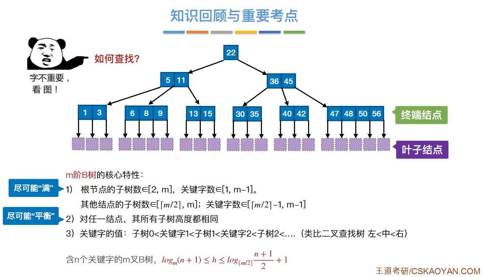
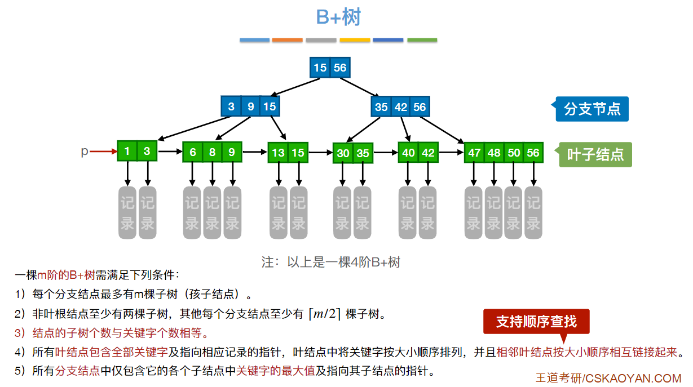

# 算法复试笔记

[toc]

## 基础

- 数据的逻辑结构
  - 线性结构：linear list；stack；queue；array；string
  - 非线性结构：tree；graph；
- 数据的物理（存储）结构：顺序存储、链式存储、**索引**存储、**散列** (Hash) 存储
- 顺序表和链表的区别
  - 顺序表的元素存在连续的内存，链表元素存在离散的内存；
  - 顺序表的增加、删除时间复杂度为O(N)，链表为O(1)；
  - 顺序表支持**随机存取**，查找O1，链表只能顺序存取，O(N)
  - 顺序表的**空间不易扩充**（动态分配内存也不便），链表便于扩充
- ==栈应用==：递归函数调用时会创建系统栈；函数调用；表达式求值；桶里装米（先进后出）；
- ==队列应用==：处理机调度中多级反馈队列算法；假脱机技术Spooling；现实排队
- various trees
  - 二叉排序树BST:左<中<右
  - 平衡二叉树AVL:左<中<右 && |所有节点左子树高度 - 右子树高度| <= 1
  - B树、B+树、折半查找判定树均是AVL；

## Linked List

- singly-linked list (std::forward_list)
- doubly-linked list
- circular-linked list
- circular-doubly-linked list (std::list)

singly-linked list definition

```cpp
struct ListNode {
    int val;
    ListNode* next;
    ListNode(int x) : val(x), next(nullptr) (); // initialization list
}
```

通过自定义构造函数初始化节点：

```cpp
ListNode* head = new ListNode(5);
```

如果不自定义构造函数，C++生成一个默认构造函数(无须任何实参)，在初始化的时候就不能直接给变量赋值。
使用默认构造函数初始化节点：

```cpp
ListNode* head = new ListNode();
head->val = 5;
```

## Tree

### 种类

满二叉树(full binary tree)：结点数$2^k - 1$；
完全二叉树(complete binary tree)：除底层以外的其它层是满的，且底层自左而右必须连续；
平衡二叉树：**每个**节点的左右子树高度差的绝对值都不超过1；
二叉搜索树(Binary Search Tree)：左子树所有节点 < 中间节点 < 右子树所有结点即可（有序）；搜索时间复杂度为logn;
平衡二叉搜索树(balanced BST)：abs(左子树高度 - 右子树高度) <= 1; map, set, multimap, multiset的底层; 插入和查询都是logn级别；

> 又名AVL树（Adelson-Velsky and Landis）；
> unordered_map, unordered_set底层是哈希表；

==B树==：多路平衡查找树（平衡因子为0）
阶：所有结点的孩子个数的最大值
  

一棵m阶B树，应满足以下条件（或为空树）：

1. 每个节点最多m棵子树，即最多有m-1个关键字（结点的孩子个数=关键字数+1）
2. 根节点最少有两棵子树
3. 除根节点外的所有**非叶**节点至少有⌈m/2⌉棵子树，即最少⌈m/2⌉-1个关键字
4. 所有非叶节点关键字从小到大排序，下层结点关键字总是落在由上层结点关键字划分的区间内
5. 所有**叶**节点都出现在同一层

B树高度（磁盘存取次数）：
$h>=log_m(n+1)$
$h<=log_{⌈m/2⌉}((n+1)/2)+1$

B树的查找需要两个操作：在B树中找结点(磁盘内)->在节点内找关键字(内存内顺序或折半查找)

==B+树==：同等规模下，树高小于B树；数据库常用
  

一棵B阶B+树满足以下条件：

1. 每个分支结点最多有m个孩子
2. 非叶**根**节点最少两颗子树
3. **节点孩子个数 = 结点关键字个数** （B树差一个）
4. 所有叶节点包含==全部关键字==（即非叶节点出现的关键字也出现在叶节点），及**指向相应记录的指针**
5. 叶节点内的关键字从小到大排序，且**相邻叶节点使用指针相连**，形成链表
6. 所有分支节点仅包含他的各个子节点中**关键字的最大值**，及指向子节点的指针（B树中分支结点也是唯一关键字，不会重复出现在叶节点）

### 存储方式

链式存储：即二叉链表；
线性存储：按0,1,2...对二叉树从上到下，从左到右编码，便可得到一个节点数组；（很少出现）

二叉链表定义：

```cpp
struct TreeNode{
    int val;
    TreeNode* left;
    TreeNode* right;
    TreeNode(int x): val(x), left(nullptr), right(nullptr) {};
};
```

```java
public class TreeNode {
    private int val;
    private TreeNode left;
    private TreeNode right;

    TreeNode() {}
    TreeNode(int val) {this.val = val;}
    TreeNode(int val, TreeNode left, TreeNode right) {
        this.val = val;
        this.left = left;
        this.right = right;
    }
}
```

> struct 的成员默认访问权限是public，class 的成员默认访问权限是private;

### 遍历方式

深度优先遍历(DFS)：前序(中左右)，中序(左中右)，后序(左右中)（递归或者迭代法-栈实现）
leetcode144,145,84;
广度优先遍历(BFS)：层序（迭代法-队列）

### 注意事项

某节点的高度：从该节点到最远叶子节点的距离；
某节点的深度：从根节点到当前节点的路径上的节点数；

**树**的高度和深度是相同的；深度是从上往下（先序遍历），高度是从下往上（后序遍历）；
同一层的节点的深度是相同的，但**高度不一定相同**；

### problem

---

- 遍历算法
  - 递归：pre；in；post
  - 非递归：pro；in；post
    - 前序利用栈：入栈；while(非空)；出栈；==右==孩子入栈；左孩子入栈。
    - 中序利用栈：入栈；while非空；一直将左孩子入栈到底；出栈；visit中；右孩子入栈
  - 层序遍历：队列
- 线索二叉树：pre；in；post；TNode节点中加ltag,rtag线索，tag=0表示lchild指向节点左孩子，tag=1表示指向线索（即前驱）
- 翻转二叉树226：递归后序遍历（后序visit的操作是交换左右孩子节点）；也可用非递归先序
- 二叉树层序遍历（见下）
  - 二叉树右视图199：只需存储每个vector的末尾元素。
  - 返回每个树行中的max515；
  - 二叉树从下往上层序遍历107：reverse即可；
  - N叉树层序遍历429：继续bfs就完事儿；
  - **填充**二叉树每个节点的右指针116：层序遍历；头结点用prenode记下，然后遍历让前一节点指向后一节点，最后让末尾指向null；
  - 获取最大树深：104：层序遍历加个cnt；递归亦可；
  - **获取最小树深**：111：最小深度是从根节点到**最近叶子节点**的最短路径上的节点数量。递归时不能加入一个孩子为NULL，另一个非空，那得继续下降，不能理解为该NULL处为最小深度；层序法（左右孩子为空时即return 不用遍历完）。

```cpp
//二叉树层序遍历(借助队列)
//将二叉树每一层作为一个vector 集中到vector<vector<int>> result里返回。
//核心在于size变量，记录该父节点的所有孩子数目
vector<vector<int>> levelOrder(TreeNode* root) {
    vector<vector<int>> ret; queue<TreeNode*> que;
    if(root) que.push(root);
    while(!que.empty()){
        int size = que.size();//core
        vector<int> temp;
        for(int i=0;i<size;++i) {
            TreeNode *t = que.front();
            temp.push_back(t->val);
            que.pop();
            if(t->left) que.push(t->left);
            if(t->right) que.push(t->right);
        }
        ret.push_back(temp);
    }
    return ret;
}  
```

- 统计二叉树中度为1、0、2的节点个数

```c++
//统计所以要累加，符合的节点+1，不符合直接向下递归即可。
int cntOne(BTNode* p)
{
    if (p == NULL) return 0;
    else if ((!p->left && p->right) || (p->left && !p->right))//满足条件度为1
    {
        return 1 + cntOne(p->left) + cntOne(p->right);
    }
    else return cntOne(p->left) + cntOne(p->right);
}
```

## 二、双指针(数组&链表)

**双指针包括 普通双指针 快慢指针 及 左右指针 （自命名）**  

- **普通双指针**
  - 合并两升序链表（创建dummy节点，然后不断将两链表的最小值接到按序dummy链表，最后接入非空链表）
  - 合并k个升序链表（dummy，利用 优先级队列容器，把链表放入最小堆，每次得到k个节点中的最小值，接入dummy
  - **求链表相交节点**：双指针，p1指针A链表走完继续走B，p2指针B走完继续走A，直到二者相等（若没有相交节点时，同时指向NULL）（核心是这样走 总路程相同 能同时到达相交处或null）||也可让长的链表先走abs(len1-len2)步。
- **快慢指针**
  - 移除数组中的指定元素；
  - 删除链表指定值元素203：迭代：利用dummyNode，不断判断p->next值的情况（即删除节点一定要寻找其前置节点）；**递归**：先递归到表尾，再弹栈进行匹配，若匹配，返回head->next，若不匹配，返回head；
  - 检测链表是否带环（fast走两步，slow一步）哈希表亦可；
  - 一次遍历找到中间节点（原理同上）；
  - 找到倒数第k个元素；

- **左右指针**
  - 数组常常会从两侧向中间逼近（eg 反转数组）
  - **881题**：求装下所有人的船的个数(排序后 左右双指针组合)）
  - 回文相关
    - 判断回文字符串（用两侧指针遍历字符数组即可）
    - 判断回文数字（用数学方法 nowNum = nowNum*10 + pastNum%10; pastNum/=10;或转换为回文字符串)
    - 判断回文单链表（1.将值复制到数组后在用两侧指针；2.直接反转 再比较；3递归 还不会）

### 滑动窗口

- 定长子串中元音字母的最大数目1456：维持长度为k的滑动窗口，先算最开始的k个字符，然后双指针指向窗口下一元素和窗口末尾元素，比较这两端的元素，判别是否要更新count
- 求长度最小的≥target的连续子数组209：定义一个滑动窗口，当窗口内sum不足target时++fast，足了时--slow使窗口尺寸最小（所以得维持一个窗口长度变量）

## 三、递归

**递归三部曲：确定递归函数的参数和返回值；确定终止条件；确定单层递归逻辑**

- 反转链表：迭代法亦可

```cpp
ListNode* reverseList(ListNode* head) {
    if(!head || !head->next) return head;
    ListNode *cur = reverseList(head->next);//指向末尾结点
    head->next->next=head;//当前节点A下一节点B的next指向A
    //核心是 一直让cur的next的元素指向前，那么cur元素的next指针就没用了
    head->next=NULL;
    return cur;
}
```

## 四、哈希表：快速判断一个元素是否出现在集合中

译为哈希表/散列表（牺牲空间换时间）

1. 哈希表是根据关键码的值而直接进行访问的数据结构。
2. 哈希表是用来快速判断一个元素是否出现在集合中。

哈希碰撞 (hash collisions): 多个元素映射到哈希表同一个索引下标的位置。

- 拉链法：（接一个链表）
  - 需要选择适当的哈希表大小，使得既不会因为数组空值太多浪费内存，也不会因为链表太长而在查找时浪费太多时间。
- 线性探测法：（向下一个位置探测）
  - tableSize > dataSize; 依靠哈希表中的空位解决碰撞为题。

1. 借助数组创建hashmap：如将26个字母映射到vector< int> hashmap(26,0)中；判断两个str字符个数关系时可考虑；

2. 借助集合unordered_set：无需映射的题目，set只能存储key，而无value，只需利用unordered_set内置的哈希函数，将val存在映射出的addr上。

3. 借助unordered_map：数组的大小是受限制的，如果元素很少，而哈希值太大会造成内存空间的浪费；set是一个集合，里面放的元素只能是一个key；

    若需存储key & value 则考虑map

​注：set和multiset底层是红黑树，有序，set元素不可重复，查找和增删效率O(logN);
unordered_set底层是哈希表，无序，元素不可重复,查找和增删效率O(1)；

## 五、分治Divide & Conquer

思想：将复杂问题分解为若干规模更小的**相同**问题，小规模问题易解。
分治法是很多高效算法的基础，如排序算法（归并排序，快速排序）、傅里叶变换（快速傅里叶变换）

1. 169：多数元素：整个区间存在多数元素，那么两边至少有一侧有多数元素（反证），分区间，两侧众数相同时直接返回，不同时，需比较这两个元素在“**整个**”区间内的数目。（hashTable亦可）
2. 53：求最大子数组和：核心是将问题分开两侧和中间贯穿侧，其中两侧直接分治（递归），中间连续段应当从mid开始先往左求最大连续和，再用**此时最大值**往右求最大连续和，再进行合并。**
    - n2解法，第一层for循环中设置thissum，第二层for循环从i+1开始，然后thissum累加，maxval变量不断寻找最大值。
    - ==动态规划版未看==

## backtracing（组合-排列-子集-分割回文串-棋盘）

- 回溯常常出现在递归函数下面
- 回溯法是纯暴力搜索(穷举)，并不是啥高效的算法；因为有些问题能暴力搜出来已经很不错了
- 回溯法都可以抽象成N叉树，叉数就是元素个数，深度方向使用递归处理
- 常常通过剪枝减少搜索空间

回溯适合需要遍历出所有组合、排列的问题及 子集、切割、棋盘（N皇后，解数独）
**回溯三部曲：确定参数和返回值类型；确定终止条件；确定单层搜索（递归）逻辑**

```cpp
// 回溯框架
void backtracing(参数){ // 没返回值
    if (满足终止条件){
    // 终止条件处一般是用来收集结果的
        result.add(path);// 存放结果，通常在叶子节点处；
        return; // why? 大概有时候算作一个剪枝操作
    }
    // 单层搜索逻辑
    for (元素 : 选择集合(本层元素)){ // 一般遍历集合元素集
        处理节点;
        递归;
        回溯，撤销处理结果; // 弹出去（回溯）
    }
    return;
}
```
> 建议不要使用++方式传值，使用i+1或者i吧
> 常常需要预测一下未来是否是不可能有正确结果了（剪枝）

## graph

**DFS**：借助递归，不断从该节点深入直到NULL，然后回溯，再深入。

```CPP
vector<bool> visited(MAXSIZE, false);//初始化为未访问
void DFS(AGraph* G, int v)//从v节点开始遍历
{
    visited[v] = true;
    //dfs的for用于访问到该节点的所有相邻节点（递归回来的时候可能会使用）
    for (ArcNode* q = G->adjList[v].firstArc; q != NULL; q = q->nextArc)
      //G->adjList[v].firstArc;//顶点v的第一条临边
      if (visited[q->adjVec] == false)//q.adjVec是边连接的顶点
        DFS(G, q->adjVec);
}
```

- **经典海岛问题**200：dfs是感染函数，将点[x,y]周围的1全部感染成0；主函数中可用双层for循环，也可用一层for循环，通过/和%的方法取到结点坐标。

```cpp
void dfs(vector<vector<char>>& grid, int x, int y, int row, int column)
    {
        if(x<0 || y<0 || x>=row || y>=column || grid[x][y]=='0') return;
        grid[x][y] = '0';
        dfs(grid, x-1, y, row, column); dfs(grid, x+1, y, row, column);
        dfs(grid, x, y-1, row, column); dfs(grid, x, y+1, row, column);
    }
```

**BFS**：借助队列，入队，while(队不空)，出队，对出队节点的所有相邻节点入队。

BFS: 两点间最短路径

<!-- - 海岛问题200：与dfs同理，只不过不用递归，利用队列即可。 -->

### 拓扑排序

- 先选一个没有前驱的节点(入度为0)并输出 -> 从网中删除该顶点和所有以该顶点为起点的有向边 -> 不断重复上述过程，直到没有无前驱的顶点为止。

### 最小生成树Minimum Spanning Tree

- Kruscal算法：需要对权重从小到大进行排序。将排序好的权重边依次加入到最小生成树中（如果加入时产生回路就跳过这条边，加入下一条边），当所有的结点都加入到最小生成树中后，就找到了这个连通图的最小生成树～；O(ElogE)；适合边稀疏，顶点多
- Prim算法：先选任一顶点，然后不断将已选树最近的节点并入树；O(V2)；适合边稠密
- 应用：规划去n个景点的路径使总体路径最短；国家电网、公路网的路径规划，使每个位置都接通的总体最短路径长。

### 路径算法

- **单源**最短路径：从结点v到所有其它节点的最短路径
  - **无权**图
    - **BFS**：制造距离数组distance[]，路径数组path[]，记录直接前驱；每向下一层(pop(u))，dist[w]=dis[u]+1，path[w]=u;
  - 带权图（适用于无权图）
    - **Dijkstra算法**：不断选距离单源点v0最近的点（dis[]最小）并入路径，并更新**源点**到其他结点的最短距离。O(V2)
- **多源**最短路径：整个图中所有结点到其他结点的最短路径
  - 带权图（适用于无权图）
    - **Floyd算法**：逐步尝试在原路径 < i , j >中加入顶点K作为**中间节点**，比较路径是否减少。
            若加入k结点后：A^k^[ i ] [ j ] > A^k^[ i ] [ k ] + A^k^[ k ] [ j ]，则将路径替换为新路径。O(V3)

## 八、贪心 greedy

贪心的本质是选择**每一阶段的局部最优**，从而达到全局最优。
> 贪心无套路；不像二叉树，回溯那样有模板，不要想套路，你做过就会，没做过就很难。

找到一个你认为的局部最优，他可以推出全局最优。然后找不到明显的反例。别想着数学证明了...

重点在于：如何通过局部最优得到全局最优，不同的贪心选择会有不同的结果
要求：可行，局部最优，不可取消

贪心算法不能对所有问题都得到全局最优解，但对许多问题能够产生全局最优解

应用：哈弗曼编码、prim、kruskal、Dijkstra

分数背包问题：其目标是在容器（“背包”）中填充一定比例的不同材料，以最大程度地提高所选材料的价值。与 0-1 背包问题不同，分数背包问题中的物品可以被分割成任意大小的部分，以便能够填满容器。
贪心策略：先计算每种物品单位重量的价值，然后降序排列，按平均最大价值优先，

<!-- 如何证明按平均最大价值优先的贪心策略可以得到最优解？

首先假设我们不用这个贪心策略得到了最优解集合A1，那么我们找到A1里面平均价值最高的物品am，然后我用平均价值最高的物品a1把am进行全部替换或者部分替换，得到解A2，又因为
$$
\dfrac{V_1}{W_1} ≥ \dfrac{V_m}{W_m} (单位价值)
$$
所以A2的总价值高于A1的总价值，这与我们的假设矛盾，所以我们说的贪心策略就是最优解。
> 就是说我们要证明说平均价值最高的物品a1一定需要在最优解集合中，那么我们的最优策略就得证 -->

## Dynamic Programming

如果某一问题有很多重叠子问题，使用动态规划是最有效的。
动规是由前一个状态推导出来的，而贪心是局部直接选最优的。

动规五部曲

1. 确定dp数组以及下标的含义
2. 确定递推公式
3. dp数组如何初始化
4. 确定dp数组遍历顺序
5. 打印dp数组debug

### 背包问题

- 01背包：有n种物体，每种只有一个
  - 二维dp: 遍历顺序无所谓
  - 一维dp: 先顺序遍历物品，再逆序遍历背包
- 完全背包：有n种物体，每种有无限个
  - 一维dp: 顺序遍历物品，顺序变量背包（在纯完全背包问题下遍历顺序无所谓）
- 多重背包（不需要）：有n种物体，每种物体个数各不相同

## 十、排序

### 选择排序

```cpp
//选择排序：每次从无序序列中选一个最小元素与无序序列开头元素交换（放到有序序列后面）
void selectSort(vector<int>& vec)
{
      for (int i = 0; i < vec.size() - 1; ++i)//优化1 只需n-1趟、
    {
      int min = i;
      for (int j = i + 1; j < vec.size(); ++j)
        if (vec[j] < vec[min]) min = j;
      if (min != i)//优化2
        swap(vec[i], vec[min]);
    }
}
```

### 插入排序

```cpp
//插入排序：将无序关键字插入到有序序列中（有序序列自后而前向后移动）
void insertSort(vector<int>& vec)
{
    for (int i = 1; i < vec.size(); ++i)
    {
      int temp = vec[i];
      int j;
      for (j = i - 1; j >= 0 && temp < vec[j]; --j)
        vec[j + 1] = vec[j];
      vec[j + 1] = temp;
    }
}
```

### 冒泡排序

```cpp
//冒泡排序:一趟排序（从前往后，两两比较，若左> 右，交换）使得最大的元素沉底。
//若欲使小元素冒到前面，则需从后往前遍历；外循环始终表示躺数
void bubbleSort(vector<int>& vec)
{
    for (int i = 0; i < vec.size() - 1; ++i)//n-1趟
    {
      bool flag = false;//优化
      for (int j = 0; j < vec.size()-1-i; ++j)//每次从前往后，使末尾有序序列增长
      {
        if (vec[j] > vec[j + 1])
        { 
          swap(vec[j], vec[j + 1]);//不断将大元素沉底
          flag = true;//交换了
        }
      }
      if (!flag) return;//说明本趟遍历未交换
    }
}
```

### 归并排序

```c
//归并排序
void merge(vector<int>& vec, int left, int mid, int right)
{
    vector<int> newVec(vec);
    int k = left;//别写成0
    int i = left, j = mid + 1;
    while (i <= mid && j <= right)
    {
      if (newVec[i] < newVec[j]) vec[k++] = newVec[i++];
      if (newVec[i] >= newVec[j]) vec[k++] = newVec[j++];
    }
    while (j <= right) vec[k++] = newVec[j++];
    while (i <= mid) vec[k++] = newVec[i++];
}
void mergeSort(vector<int>& vec, int left,int right)
{
    //分治思想：每次让规模减半
    if (left < right) {
      int mid = (left + right) / 2;
      mergeSort(vec, left, mid);//递归排序左子序列
      mergeSort(vec, mid + 1, right);
      merge(vec, left, mid, right);//归并 “核心”
    }
}
```

### 快速排序

```cpp
//每次选个枢纽，让左侧小于该枢纽
int Partion(vector<int>& nums, int low, int high){
    int pivot = nums[low];
    while (low < high){
      while (low < high && nums[high] >= pivot)	--high;//一直找到<pivot的值
      nums[low] = nums[high];
      while (low < high && nums[low] <= pivot) ++low;
      nums[high] = nums[low];
    }
    nums[low] = pivot;
    return low;
  }
  void quickSort(vector<int>& nums, int low, int high){
    if (low < high) {
      int pivot = Partion(nums, low, high);//Core sentence
      quickSort(nums, low, pivot - 1);
      quickSort(nums, pivot + 1, high);
    }
}
```

### 堆排序

```cpp
//数组储存二叉树
void HeapAdjust(vector<int>& nums, int k)
//对以k节点为根节点的子树进行调整;不断让小节点下坠
{
    int n = nums.size();
    //i先指向左孩子2k
    for (int i = 2 * k; i <= n; i *= 2)//树从1开始存储
    {
      if (i < n && nums[i] < nums[i + 1])//用更大的和父节点交换
        i = i + 1;
      if (nums[k] > nums[i]) break;//父节点比孩子都大
      else {
        nums[0] = nums[k];//用上nums[0]
        nums[k] = nums[i];//大的孩子给父节点，
        k = i;//精华！对以i为根节点的子树进行调整
      }
    }
    nums[k] = nums[0];//k在叶子节点处
}

void HeapSort(vector<int>& nums){
    int n = nums.size();
    //先建立大根堆（核心）
    for (int i = n / 2; i >= 1; --i)
      HeapAdjust(nums, i);
    //建完后 将堆顶元素与末尾元素进行交换，最大元素沉底；
    //重新调整结构，使其满足堆定义，继续交换堆顶与当前末尾元素，直到有序。
    for (int i = n; i > 1; i--)//n-1趟交换和建堆过程
    {
      swap(nums[i], nums[1]);
      HeapAdjust(nums, n - 1);
    }
}
```

### main()

```c++
int main()
{

    srand((unsigned int)time(NULL));

    //vector<int> vec = { 4,2,6,3 };
    vector<int> vec;
    for (int i = 0; i < 200; ++i)
      vec.push_back(i);
    random_shuffle(vec.begin(), vec.end());
    for (auto x : vec)
      cout << x << " ";
    bubbleSort(vec);
    cout << endl << endl << endl;
    for (auto x : vec)
      cout << x << " ";
}
```
