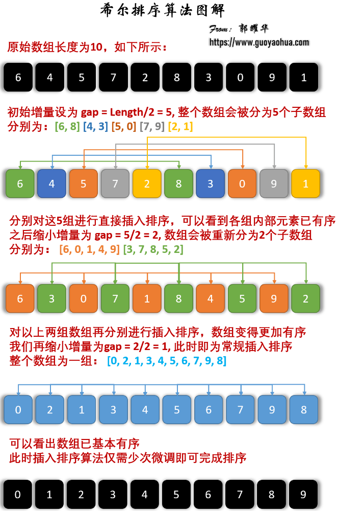

# Data Structure

please arrange this: [link](https://xiaolincoding.com/interview/data.html#%E6%95%B0%E6%8D%AE%E7%BB%93%E6%9E%84)

- [Data Structure](#data-structure)
  - [ACM模板](#acm模板)
  - [排序算法](#排序算法)
    - [冒泡排序](#冒泡排序)
    - [选择排序](#选择排序)
    - [插入排序](#插入排序)
    - [希尔排序](#希尔排序)
    - [快速排序](#快速排序)
      - [为什么快排最差是O(n^2)](#为什么快排最差是on2)
      - [快排这么强，那冒泡排序还有必要吗？](#快排这么强那冒泡排序还有必要吗)
    - [外部排序](#外部排序)
    - [归并排序](#归并排序)

## ACM模板

```java
public class Solution {
    public int func(int x) {
        return 0;
    }
    public static void main(String[] args) {
        Solution solution = new Solution();
        int res = solution.func(10);
        System.out.println(res);
    }
}
```

## 排序算法

稳定性：多个具有**相同关键字**的元素时，这些元素在排序后的序列中保持它们原有的相对顺序。
这样的话这些关键字的value就还按原顺序

### 冒泡排序

冒泡排序: n趟排序（每趟排序：从前往后，两两比较，若左>右，交换）使得最大的元素沉底

* 稳定
* 最佳O(n); 最差/平均O(n^2)
* 排序方式：in-place

```java
import java.util.Arrays;

public class BubbleSort {
    public static void bubbleSort(int[] nums) {
        for (int i=0; i<nums.length - 1; ++i) {
            boolean hasSwap = false;
            for (int j=0; j<nums.length-1-i; ++j) { // 每一轮都从最左侧开始都最后有序的为止
                if (nums[j] > nums[j+1]) {
                    int tmp = nums[j];
                    nums[j] = nums[j+1];
                    nums[j+1] = tmp;
                    hasSwap = true;
                }
                // 相邻没交换 后面还可能交换的
            }
            if (!hasSwap) return; // 本轮从头到尾都没发生交换
        }
    }

    public static void main(String[] args) {
        int[] nums = {10,3,8,5,4};
        bubbleSort(nums);
        System.out.println(Arrays.toString(nums));
    }
}
```

### 选择排序

最直觉:选择排序：每次从未排序序列中选择最小元素放到已排序序列末尾即可

* 不稳定: `{5,8,5,2,9}` 5会和2交换
* 最差/最佳/平均O(n^2)
* in-place

```java
public static void selectionSort(int[] nums) {
    int n = nums.length;
    for (int i=0; i<n-1; ++i) {
        int min = i; // 记录下标而非nums[i] 下标作为key会有更多的信息
        for (int j=i+1; j<n; ++j) // 找到未排序序列的最小元素
            if (nums[j] < nums[min])
                min = j;
        if (min != i) { // 如果i并非最小
            int tmp = nums[i]; // 和末尾交换即为放至末尾
            nums[i] = nums[min];
            nums[min] = tmp;
        }
    }
}
```

### 插入排序

插入排序：将无序关键字插入到有序序列中（即把有序序列不断往后移动

* 稳定
* 最佳O(n), 最差/平均O(n^2)
* in-place

```java
public static void insertionSort(int[] nums) {
    int n = nums.length;
    for (int i = 1; i < n; ++i) { // 遍历无序列表
        int tmp = nums[i];
        int j;
        for (j = i-1; j >= 0 && tmp < nums[j]; --j) // 注意这个判断条件得写这儿, 写下面的话j会被多减
            nums[j+1] = nums[j];
        nums[j+1] = tmp; // j在不断左移 (可以画图看看
    }
}
```

### 希尔排序

Shell Sort/增量递减排序算法: 进阶版插入排序
思想：先将整个待排序序列分割为若干子序列分别进行直接插入排序，待整个序列“基本有序”时，再对全体序列进行一次直接插入排序

* 不稳定
* 最佳/平均 O(nlogn), 最差O(n^2)
* 空间复杂度依然O(1)

{width=70%}

### 快速排序

* 不稳定
* 最佳/平均 O(nlogn), 最差O(n^2)
* 空间复杂度 **O(nlogn)**

**分治思想**

1. 每次用right作为pivot，遍历[l,r]，将<=pivot的swap到左侧维护的有序区间，最后将p_idx和swap到有序区间最后

> 若选择最左元素作为基准，对几乎已经有序的序列，并不是最好的选择，它将会导致算法的最坏表现。可以考虑选择中间的数或通过Math.random()；（**我们采用最后元素**

```java
// **该方法的partition是都从左侧出发，i维护已符合规则的最右边界，j负责遍历元素找到符合规则的和i交换**
// 以后用这个吧
public class QuickSort2 {
    public static void swap(int[] nums, int i, int j) {
        int tmp = nums[i];
        nums[i] = nums[j];
        nums[j] = tmp;
    }

    public static int partition(int[] nums, int left, int right) {
        // note 以right作为pivot:小的交换到左边 大的自动就到右边了
        int pivot = nums[right];
        int k = left; // note 记录下一个小于pivot的元素应该放的idx：最开始在最左段
        for (int i=left; i<right; ++i) {
            if (nums[i] <= pivot) {
                swap(nums, k, i);
                k++;
            }
        }
        // 分完之后k的位置大于pivot
        swap(nums, k, right);
        return k;
    }
    public static void quickSort(int[] nums, int left, int right) {
        if (left < right) {
            int pi = partition(nums, left, right); // pivot index
            quickSort(nums, left, pi-1);
            quickSort(nums, pi+1, right);
        }
    }

    public static void main(String[] args) {
        int[] nums = {10, 3, 8, 5, 4, 22};
        System.out.println(Arrays.toString(nums));
        quickSort(nums, 0, nums.length-1);
        System.out.println(Arrays.toString(nums));
    }
}

```

方法二
```java
// 该方法partion是从左右出发，分别找到大于和小于pivot的数值，然后交换
public class QuickSort {
    public static int partition(int[] nums, int low, int high) { // 左闭右闭
        int pivot = nums[low];
        while (low < high) {
            while (low < high && nums[high] >= pivot) --high; // 一直找到 < pivot的值
            nums[low] = nums[high];
            while (low < high && nums[low] <= pivot) ++low; // 一直找到 > pivot的值
            nums[high] = nums[low];
        }
        nums[low] = pivot;
        return low; // 最终应该返回pivot的位置 而非其值
    }
    // 其它代码一样
}
```

#### 为什么快排最差是O(n^2)

当每次选择的基准元素都是当前子数组中的**最大或最小元素时**，就会导致**每次划分只能减少一个元素**，而不是均匀地分成两部分，从而造成时间复杂度达到O(n^2)

这种情况通常发生在数组**已经有序或基本有序**的情况下。为了避免最坏情况发生，可以通过**随机选择基准元素**或者使用三数取中法等策略来提高快速排序的性能。

#### 快排这么强，那冒泡排序还有必要吗？

冒泡排序在一些特定场景下仍然有其优势，比如：

* 对于**小规模数据或基本有序**的数据，冒泡排序可能比快速排序更**简单**、更直观
* 冒泡排序是**稳定排序**算法，相对于快速排序的不稳定性，在某些情况下可能更适合要求稳定性的场景
* 冒泡排序是**原地排序算法**，不需要额外的空间，适合空间复杂度要求严格的场景（快排递归调用栈/空间复杂度O(logn)


### 外部排序

如果要对一个很大的数据集，进行排序，而没办法一次性在内存排序，这时候怎么办？
[暂略](https://xiaolincoding.com/interview/data.html#%E5%A6%82%E6%9E%9C%E8%A6%81%E5%AF%B9%E4%B8%80%E4%B8%AA%E5%BE%88%E5%A4%A7%E7%9A%84%E6%95%B0%E6%8D%AE%E9%9B%86-%E8%BF%9B%E8%A1%8C%E6%8E%92%E5%BA%8F-%E8%80%8C%E6%B2%A1%E5%8A%9E%E6%B3%95%E4%B8%80%E6%AC%A1%E6%80%A7%E5%9C%A8%E5%86%85%E5%AD%98%E6%8E%92%E5%BA%8F-%E8%BF%99%E6%97%B6%E5%80%99%E6%80%8E%E4%B9%88%E5%8A%9E)

### 归并排序

* 归并排序是稳定的，快排不稳定
<!-- * 如果输入内只有一个元素，则直接返回，否则将长度为n的输入序列分成两个长度为 n/2 的子序列 -->
* 分别对这两个子序列进行归并排序，使子序列变为有序状态
* **设定两个指针，分别指向两个已经排序子序列的起始位置；比较两个指针所指向的元素，选择相对小的元素放入到合并空间**

```java
// 改为new Solution()格式以后
public class MergeSort {
    public static void merge(int[] nums, int left, int mid, int right) {
        // 将两个有序的子数组合并为一个有序数组 (左数组: [left, mid], 右数组[mid+1, right]
        int[] tmp = new int[right - left + 1];
        int i = left, j = mid + 1;
        int k = 0;
        // note 核心思想其实很简单：两个数组都从头遍历，每次拿出小的存入临时数组
        while (i <= mid && j <= right) {
            if (nums[i] <= nums[j]) tmp[k++] = nums[i++];
            else tmp[k++] = nums[j++];
        }
        while (i <= mid) tmp[k++] = nums[i++]; // 说明右数组走完了 把左数组复制过来即可
        while (j <= right) tmp[k++] = nums[j++];
        // note: 把临时数组中的k个数字 复制到原数组对应的区间
        for (int m=0; m<k; ++m) {
            nums[left+m] = tmp[m];
        }
        tmp = null;
    }

    public static void mergeSort(int[] nums, int left, int right) {
        if (left < right) {
            int mid = (left + right) / 2;
            mergeSort(nums, left, mid); // 左闭右闭: 对左半部分进行递归排序
            mergeSort(nums, mid+1, right);
            merge(nums, left, mid, right); // 核心：合并两部分
        }
    }
    public static void main(String[] args) {
        int[] nums = {10, 3, 8, 5, 4, 12, 10};
        System.out.println(Arrays.toString(nums));
        mergeSort(nums, 0, nums.length-1);
        System.out.println(Arrays.toString(nums));
    }
}
```