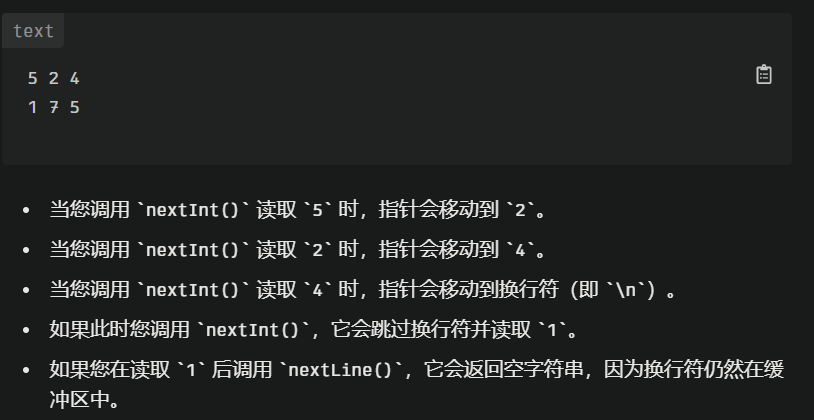
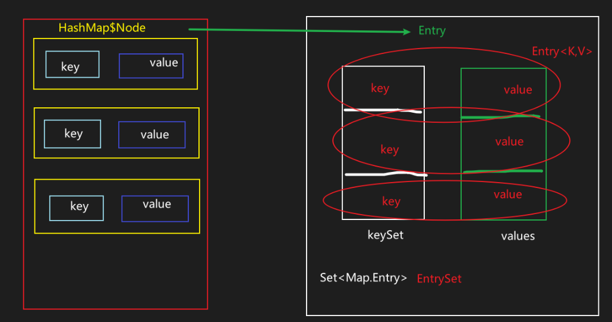

# Java API

- [Java API](#java-api)
  - [ACM template](#acm-template)
  - [Arrays](#arrays)
  - [ArrayList](#arraylist)
  - [LinkedList](#linkedlist)
  - [HashSet](#hashset)
  - [HashMap](#hashmap)
    - [遍历HashMap](#遍历hashmap)
  - [String](#string)
  - [StringBuilder](#stringbuilder)
  - [Character](#character)
  - [Stack-about](#stack-about)
  - [Queue-about](#queue-about)
    - [PriorityQueue / Heap](#priorityqueue--heap)


  

<!-- ==How to choose?==

* 判断是单列还是键值对
  * 单列 -> Collection接口实现类
    * 允许重复 -> List接口实现类
      * 增删多 -> LinkedList (双向链表)
      * 改查多 -> ArrayList (可变数组)
    * 不允许重复 -> Set接口实现类
      * 无序数据 -> HashSet (使用HashMap维护一个哈希表(数组+链表/红黑树))
      * 有序数据 -> TreeSet
      * 插入取出顺序一致 -> LinkedHashSet (数组+双向链表)
  * 键值对 -> Map接口实现子类
    * 无序key -> HashMap
    * 有序key -> TreeMap
    * key插入取出顺序一致 -> LinkedHashMap
    * 读取文件 -> Properties -->

注意：

* ArrayDeque不可存放null(底层是数组，数组元素存储一个对象的引用，不可存放null)，LinkedList可以存放(底层是双向链表，链表可以存放null)

## ACM template

常用库

```java
import java.util.*; // 导入常用的集合类，eg ArrayList, LinkedList, HashSet, HashMap, PriorityQueue...
// import java.lang.*; // JAVA语言的核心部分，eg Object, String, Math, System, Thread, Exception...
// 这个一般是无需显式导入的，编译器应该自带的有
```

常用API

```java
sc.hasNext() // 检查输入流中是否有下一个token(可以是任意类型)
sc.hasNextInt() // 检查输入流中是否有下一个整数, 返回true/false
sc.nextInt() // 注意 有时候需要使用sc.extLine()手动消费掉换行符；它会跳过空格和换行符 但不会跳过int后面的那个隐藏的换行符奥！
sc.hasNextLine()
sc.nextLine()
```
记着has不会消费，只会检查；next会消费，有时候会消费少了有时候多了

nextInt工作原理：

* 读取整数：当调用nextInt()时，Scanner**会跳过空格和换行符，直到找到一个有效的整数**。它会将这个整数读取出来，**并将输入流指针移动到下一个非空白字符的位置**
* ==**留存换行符**==：如果在调用nextInt()之后还有其他输入（如nextLine()），可能会遇到问题。**nextInt()不会消耗换行符（\n），这意味着在下次读取时，nextLine()会立即返回一个空字符串**，因为缓冲区中仍然有换行符

  


```java
import java.util.Scanner;
public class Main { // 1. 记得加public; 2.Main后无();
    public static void main(String[] args) { // .别忘了String[] args
        Scanner scanner = new Scanner(System.in);
        while (scanner.hasNext()) {
            int a = scanner.nextInt();
            int b = scanner.nextInt();
            if (a == 0 && b == 0) break;
            System.out.println(a + b);
        }
    }
}
```

```cpp
#include <iostream>
using namespace std;
int main() {
    int a, b;
    while (cin >> a >> b) {
        if (a == 0 && b == 0) break;
        cout << a + b << endl;
    }
}
```

```java
// Definition for singly-linked list.
public class ListNode {
    int val;
    ListNode next;
    ListNode() {}
    ListNode(int val) {this.val = val;}
    ListNode(int val, ListNode next) {this.val = val; this.next = next;}
} 
```

## Arrays

* `Arrays.toString(nums);`: 打印输出
* `Arrays.stream(nums).sum();`: 求和
  * 不是`Arrays.sum(nums);`
  * 也不是`nums.stream().sum()`
* `Arrays.fill(nums, number);`: 将nums数组中所有元素填充为number
* `int index = Arrays.binarySearch(nums, val);`: **二分查找**之前需要是**有序数组**
* `Arrays.sort(nums)`: 顺序排序
* `Arrays.sort(nums, (a, b) -> b - a)`: 逆序排序
* `Arrays.copyOf(nums, newLen)`: ==☆== 深拷贝，可以指定了复制长度newLen
* `Arrays.copyOfRange(nums, from, to)`: 指定区间拷贝
* 不允许 `return {};` 建议改为 `return new int[0];`


```java
// **Integer[]排序**
Integer[] arr = {1,3,4,2,9,7};
// 顺序排序
Arrays.sort(arr);
// 逆序排序（方法一）
Arrays.sort(arr, Comparator.reverseOrder());
// 逆序排序（方法二：简写）
Arrays.sort(arr, (a, b) -> b - a);
// 逆序排序（匿名内部类并实现compare方法）
// Arrays.sort(arr, new Comparator<Integer>() {
//     @Override
//     public int compare(Integer a, Integer b) {
//       return b - a;
//     }
// });


// **int[]排序**
int[] arr = {1,3,4,2,9,7};
Arrays.sort(arr);
// 逆序一： sort + 手动reverse
// 逆序二
IntStream.of(arr)
          .boxed() // int转Integer
          .sorted((a, b) -> b - a) // 逆序
          .mapToInt(Integer::intValue) // 转回int[]
          .toArray();
```

---

```java
// int[]按照绝对值大小排序（由于Comparator只能与对象类型而非原始类型工作，所以必须转为Integer（很烦
int[] nums = {3, -1, 4, -1, 5, -9, 2, -6, 5, 3, -5};
        nums = IntStream.of(nums)
                .boxed()
                .sorted((o1, o2) -> Math.abs(o2) - Math.abs(o1))
                .mapToInt(Integer::intValue)
                .toArray()
```

```java
// Arrays.sort()用于二维数组排序（掌握！）
int[][] arr;
Arrays.sort(arr, new Comparator<int[]>() {
    @Override
    public int compare(int[] o1, int[] o2) { // note: 竟然是int
      return o1[0] - o2[0]; // 按第一列排序
    }
});

// lambda表达式简化
Arrays.sort(arr, (int[] o1, int[] o2) -> {return o1[0] - o2[0];});
// 进一步简化
Arrays.sort(arr, (o1, o2) -> o1[0] - o2[0];);

// 按第一列升序，如果第一列相同按第二列降序
Arrays.sort(arr, (int[] o1, int[] o2) -> {
    if (o1[0] != o2[0]) {
      return o1[0] - o2[0]; // 首先按第一列升序
    }
    return o2[1] - o1[1]; // 然后再按第二列降序
});
```

## ArrayList

* `List<Integer> list = new ArrayList<>();`
* `list.add(ele)`==☆==
* `list.add(idx, ele)`
* `addFirst()`, `addLast()`: since Java 21
* `list.get(idx)` ==没有[]==，不是charAt()
* `getFirst()`, `getLast()`: since Java 21
* `list.set(idx, ele)`: update
* `list.remove(idx)`
* `removeFirst()`, `removeLast()`: since Java 21
* `list.size()` ==没有length==
* `list.isEmpty()`
* `list.contains()`
* `list.indexOf(val)`: 返回val对应的index，==搜索==; 等价于c++的find
  * 返回-1代表没找到，0是第一个元素
* `list.clear()`

```java
// ArrayList<Integer> -> int[] (Leetcode中很多题目需要return int[])
// 法一：循环遍历 有点呆
int[] array = new int[list.size()];
for (int i=0; i<list.size(); ++i)
  array[i] = list.get(i);

// 法二：基于java8的Stream API简化
int[] array = list.stream().mapToInt(Integer::intValue).toArray();
// 从ArrayList生成一个Stream<Integer>类型的流, 然后对stream中的每个元素应用mapToInt函数返回一个新流(IntStream类型), 然后使用toArray将IntStream转为int[]
// 主要是要将Integer拆箱为int 如果是List<String> list = new ArrayList<String>(); 直接Object[] obj = list.toArray();即可

// 或者
// int[] arr = list.stream().mapToInt(i -> i).toArray();
```

* Stream API
  * 生成一个新的数据源，不改变原始数据源
  * 可以从各种数类型(集合、数组等)创建流

## LinkedList

目前感觉主要是提供了一些ArrayList没有的方法
(不过java21之后这几个API ArrayList都有了...)

* addFirst(), addLast()
* removeFirst(), removeLast()
* getFirst(), getLast()

## HashSet

哈希表用来快速判断(O(1))一个元素是否出现在集合中

* `Set<String> set = new HashSet<>();`
  * 通常使用接口定义，而非`HashSet<String> set = new HashSet<>()`
* 下面的方法都是实现的Collection Interface
* `set.add("element")` ==☆==
* `set.contains("element")`: 对应cpp中find ==☆==
  * `set.find("element") != set.end()`
* `set.size()`
* `set.isEmpty()`
* `set.remove("element")`
* `set.clear()`

```java
// traverse
for (String ele : set) {
    sout(ele);
}
```

## HashMap

> 注意：
> `Map<Integer, List<Integer>> map = new HashMap<>();`正确
> `Map<Integer, List<>> map = new HashMap<>();`错误 你指定泛型类型的时候 不能再整个泛型了吧

* `Map<String, Integer> map = new HashMap<>();`
* `map.put(key, value)` ==☆==
* `map.get(key)` ==☆==
* `map.getOrDefault(key, 0): 获取key的value，如果不存在返回0` ==☆==
  * `map.containsKey(key) ? : map.get(key) : 0;`
* `map.put(key, map.getOrDefault(key, 0))`: 不存在置为0，存在用当前值更新
  * `map.computeIfAbsent(key, key->0)`: 不存在置为0，存在不动
* `map.containsKey(key)` ==☆==
* `map.remove(key)`
* `map.size()` ==☆==
* `map.isEmpty()` ==☆==
* `map.containsValue(value)`
* `map.clear()`
* `map.computIfAbsent(key, k -> new ArrayList<>())`: 判断key是否存在，存在则返回对应value，不存在就new一个新的ArrayList
  * `int shirtPrice = prices.computeIfAbsent("Shirt", key -> 280);`
* `Set<String> keys = map.keySet()`
* `Collection<Integer> values = map.values()`
* `Set<Map.Entry<String, Integer>> entries = map.entrySet()`

```java
// traverse
for (Map.Entry<String, Integer> entry : map.entrySet()) {
    String key = entry.getKey();
    String value = entry.getValue();
}
```

```cpp
unordered_map<int,int> map;
for (auto c:nums) 
  map[c]++;
```

上述cpp版本等价于：

```java
Map<Integer, Integer> map = new HashMap<Integer, Integer>;
for (int c: nums)
  map.put(c, map.getOrDefault(c, 0)+1);
```

### 遍历HashMap

* Node实现了`Map.Entry<K,V>`接口（实现了`getKey(), getValue()`）;
* 底层会自动创建一个存储了Entry对象的entrySet集合`Set<Map.Entry<K,V>>`，这个Set就支持使用iterator遍历了
* `Map.Entry`中存储的key和value实际是Node中key和value的**引用**，因为Node实现了Map.Entry接口，所以可以将Node对象赋给该接口（多态）
* 为了方便操作，除了`Set<Map.Entry<K,V>> entrySet()`外还有`Set<K> keySet()`和`Collection<V> values()`

  

---

* 不同视角: 灵活；
  * entrySet()返回一个包含所有Map.Entry<K,V>对象的**Set** (`Set<Map.Entry<K,V>> entrySet()`)，可以通过.entrySet().iterator()来遍历Map；即it.getKey(), it.getValue();
  * keySet()返回一个包含所有key的**Set** (`Set<K> keySet()`)，可以通过.keySet().iterator()来遍历获取key;
  * values()返回一个包含所有value的**Collection** (`Collection<V> values()`)，可以通过.values().iterator()来遍历value;
    * 由于允许重复，所以不使用Set
* 我们知道Set和Collection接口都实现了Iterable，所以都支持.iterator()，而Map接口并未实现Iterable.

---

遍历（6种）

* entrySet(): 获取所有k-v
* keySet(): 获取所有key
* values(): 获取所有value
* 基于enhanced-for或者iterator(basic-for) 各有三种
* 基于**entrySet最高效**，因为使用keySet会多一次哈希查找操作

```java
HashMap<String, String> map = new HashMap<>();
    map.put("key1", "value1");
    map.put("key2", "value2");

    // 第一组(最简单): 基于keySet: .get()
    ////////////////推荐////////////////
    // (1) enhanced for
    for (String key : map.keySet()) {
        System.out.println("key: " + key + " value: " + map.get(key));
    }
    ////////////////////////////////
    // (2) original for (based on iterator)
    Iterator<String> keyIt = map.keySet().iterator();
    while (keyIt.hasNext()) {
        String key =  keyIt.next();
        String value = map.get(key);
    }

    // 第二组(最高效)：基于entrySet: getKey(), getValue()
    /////////////最推荐/////////////////
    // (1) enhanced for (TODO 推荐)
    for (Map.Entry<String, String> entry : map.entrySet()) {
        System.out.println("key: " + entry.getKey() + " value: " + entry.getValue());
    }
    ////////////////////////////////////
    // (2) original for (based on iterator)
    Iterator<Map.Entry<String, String>> it = map.entrySet().iterator();
    while (it.hasNext()) {
        Map.Entry<String, String> entry =  it.next();
        System.out.println("key: " + entry.getKey() + " value: " + entry.getValue());
    }

    // 第三组: 基于values
    // (1) enhanced for
    for (String v : map.values()) {
        System.out.println("value: " + v);
    }
    // (2) original for (based on iterator)
    Iterator<String> valueIt = map.values().iterator();
    while (valueIt.hasNext()) {
        String value =  valueIt.next();
    }
```

## String

* 初始化
  * `String str = "hello";` 直接赋值
  * `String str = new String("hello");` 使用构造函数
  * `char[] charArr = {'h', 'e'}; String str = new String(charArr);` 使用字符数组
* `str.length()` ==☆==
* `str.charAt(idx)` ==☆==
* `str.toCharArray()` ==☆==: String不可修改，char[]可以; String没有实现Iterable接口不可forEach，char[]可以
* `new String(charArray)`: 将char[]转为String
* `Integer.parseInt(str)`: String -> int, 不能解析则抛出异常
* `Integer.toString(num)`: int -> String
* `Integer.valueOf(str)`: String -> Integer对象
* `String.valueOf(num)`: int/long/float/double -> String
* `num + ""`: int/long/float/double ->String
* `str.substring(begin, end)`: 截取子串，可以删除头部几个字符
  * ==左闭右开==
* 拼接字符串: + 或者concat(返回拼接后的字符串，可以继续concat)

## StringBuilder

* `StringBuilder str = new StringBuilder("hello");` **创建**
* `str.length()` ==☆==
* `str.append()` ==☆== **拼接**字符串。。。不可以使用+和concat
  * string的+和concat每次都会创建新的string对象
* `str.toString()`: StringBuilder->String
* `char[] strChar = str.toString().toCharArray();// 服啦`
* `str.charAt(idx)`
* `str.setCharAt(idx, value)`
* `str.deleteCharAt(idx)` ==☆==
* `str.delete(begin, end); // [)` ==☆==
* `str.delete(begin, begin+cnt); // [)`
* `str.reverse()`: 整体反转
* `str.substring(begin, end); //[)` ==☆== 返回一个**string**

cpp中的`reverse(str.begin(), str.end());`在java中竟然没有对应函数：

```java
// 翻转start-end之间的字符串（法二）
StringBuilder sb = new StringBuilder("Hello, World!");
String partToReverse = sb.substring(2, 8);
StringBuilder partReversed = new StringBuilder(partToReverse).reverse();
sb.replace(2, 8, partReversed.toString());
System.out.println(sb.toString()); // 输出 "HeW ,olleHorld!"
```

```java
// 真不如转为char[]后翻转（法一）
public void reverse(char[] str, int left, int right) { // [)
    right--;
    while (left < right) {
        char tmp = str[left];
        str[left++] = str[right];
        str[right--] = tmp;
    }
}

// based on StringBuilder
public void reverse(StringBuilder sd, int left, int right) { // [)
    right--;
    while (left < right) {
        char tmp = str.charAt(left);
        sb.setCharAt(left++, sb.charAt(right));
        sb.setCharAt(right--, tmp);
    }
}
```

## Character

* `Character.isLetter()`: 'a-z, A-Z'
* `Character.isDigit()`: '0-9'
* `Character.isLetterOrDigit()`
* `Character.isLowerCase()`
* `Character.isUpperCase()`
* `Character.toLowerCase()`: 如果输入是数字字符，不受影响，即转换前后ASCII不变
* `Character.toUpperCase()`

## Stack-about

Stack (官方不推荐, 滥用了继承)

* 继承自Vector（线程安全类synchronized），性能低
* 此外Stack还可以使用List接口的`get(idx), set(idx, e), add(idx, e)`等方法，这样会**破坏栈的数据结构**，因为栈不应该有在任何位置添加删除元素的能力。
* 推荐使用`ArrayDeque`代替
  * 速度快
  * 符合stack/queue的特性 主要是不能使用idx相关方法


> peek()是偷偷看一眼，并不会取走或改变什么。即只看不拿

Deque中stack相关的方法和Deque中的一般方法的对应关系：
  

* **由于cpp的pop不会返回，所以如果需要栈顶元素需要先调用top，而java中pop会返回，所以之前无需peek**

---

## Queue-about

* **Queue接口**按照FIFO管理元素，只支持队尾输入对头输出（需要用queue的题用这个就足够了吧应该，没必要上Deque的api）
  

  

> **虽然我们只想使用Queue接口的方法，但是并不能实例化一个接口，所以我们还是要去new一个ArrayDeque，但我们只用其中的Queue部分的方法。（因为接口中并不包含方法的实现）**

好好好 stack和queue都用这一句`Deque<Integer> st/que = new ArrayDeque<>();`


---

* **Deque接口**支持同时**从两端添加或移除元素**，Deque接口的实现类可以被当做队列FIFO使用也可以当做栈LIFO使用
* Deque有一堆方法：
  * addFirst()/Last()
  * removeFirst()/Last()
  * getFirst()/Last() 足矣

---
  

Deque中queue相关的方法和Queue中的一般方法的对应关系：
  

有时候也是需要用一下双端队列的，当你既想两头出入的时候

### PriorityQueue / Heap

* 和Queue区别于：总是优先级最高的元素先出队，不是直接FIFO了
* 底层数据结构是**堆**，底层是可变长数组，默认是**小顶堆**
* 通过堆元素的上浮和下沉，插入和删除堆顶元素为O(logn)

---

* 创建**小根堆**：`Queue<Integer> heap = new PriorityQueue<>();`
* 创建**大根堆**：`Queue<Integer> heap = new PriorityQueue<>(Collections.reverseOrder());`
  * `Collections.reverseOrder()`返回一个`Comparator`，用于逆序比较元素
* api和Queue一致
* 添加元素，自动排序：`offer() / add()`
* 获取并移除头部元素： `poll()`
* 获取不移除头部元素：`peek()`
* `size(), isEmpty(), contains(), remove()`