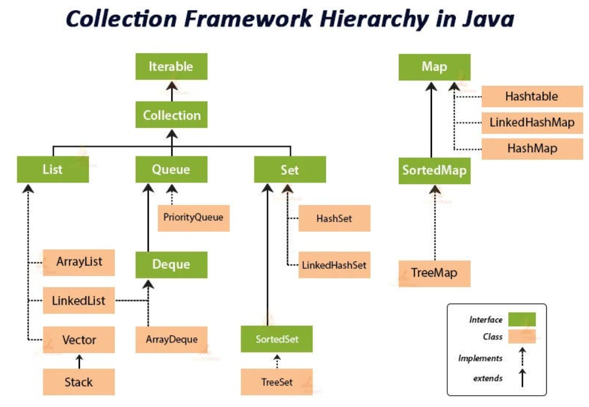
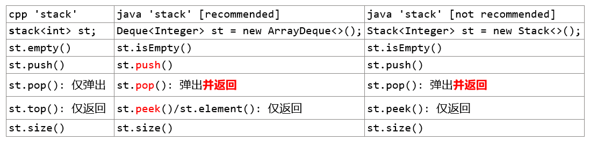
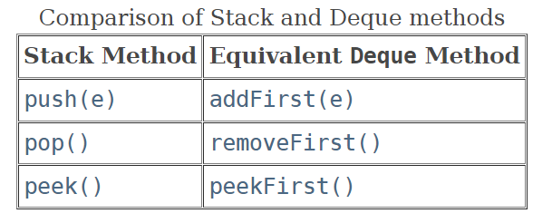
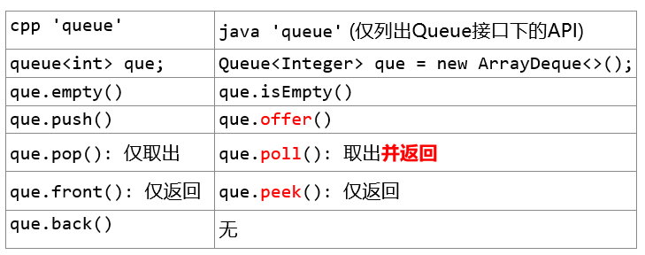
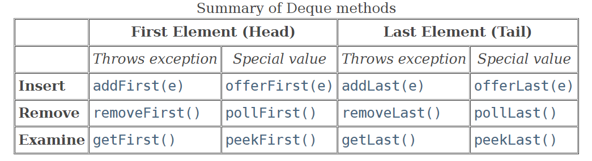
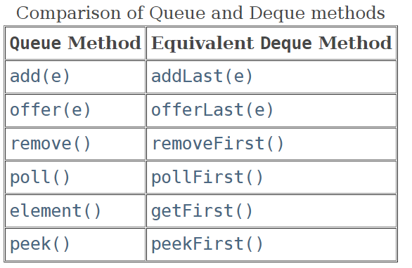

# Java API

[toc]

  

==How to choose?==

* 判断是单列还是键值对
  * 单列 -> Collection接口实现类
    * 允许重复 -> List接口实现类
      * 增删多 -> LinkedList (双向链表)
      * 改查多 -> ArrayList (可变数组)
    * 不允许重复 -> Set接口实现类
      * 无序数据 -> HashSet (使用HashMap维护一个哈希表(数组+链表/红黑树))
      * 有序数据 -> TreeSet
      * 插入取出顺序一致 -> LinkedHashSet (数组+双向链表)
  * 键值对 -> Map接口实现子类
    * 无序key -> HashMap
    * 有序key -> TreeMap
    * key插入取出顺序一致 -> LinkedHashMap
    * 读取文件 -> Properties

注意：

* ArrayDeque不可存放null(底层是数组，数组元素存储一个对象的引用，不可存放null)，LinkedList可以存放(底层是双向链表，链表可以存放null)

## ACM template

```java
import java.util.Scanner;
public class Main {
    public static void main(String[] args) {
        Scanner scanner = new Scanner(System.in);
        while (scanner.hasNext()) {
            int a = scanner.nextInt();
            int b = scanner.nextInt();
            if (a == 0 && b == 0) break;
            System.out.println(a + b);
        }
    }
}
```

```cpp
#include <iostream>
using namespace std;
int main() {
    int a, b;
    while (cin >> a >> b) {
        if (a == 0 && b == 0) break;
        cout << a + b << endl;
    }
}
```

```java
// Definition for singly-linked list.
public class ListNode {
    int val;
    ListNode next;
    ListNode() {}
    ListNode(int val) {this.val = val;}
    ListNode(int val, ListNode next) {this.val = val; this.next = next;}
} 
```

## ArrayList

* `List<Integer> list = new ArrayList<>();`
* `list.add(ele)`
* `list.add(idx, ele)`
* `list.get(idx)` ==没有[]==
* `list.set(idx, ele)`: update
* `list.remove(idx)`
* `list.size()` ==没有length()==
* `list.isEmpty()`
* `list.contains()`

## Arrays

```java
int[] arr = {1,3,4,2,9,7};
// 顺序排序
Arrays.sort(arr);

// 逆序排序（方法一）
Arrays.sort(arr, Comparable.reverseOrder()); // 适用类型还不明确

// 逆序排序（方法二：匿名内部类并实现compare方法）
Arrays.sort(arr, new Comparator<Integer>() {
    @Override
    public int compare(Integer a, Integer b) {
      return b - a;
    }
});

// 逆序排序（方法三：lambda表达式）
Arrays.sort(arr, (a, b) -> b - a);

```

## HashSet / unordered_set

哈希表用来快速判断(O(1))一个元素是否出现在集合中

* `Set<String> set = new HashSet<>();`
  * 通常使用接口定义，而非`HashSet<String> set = new HashSet<>()`
* 下面的方法都是实现的Collection Interface
* `set.add("element")`
* `set.contains("element")`: 对应cpp中find
  * `set.find("element") != set.end()`
* `set.size()`
* `set.isEmpty()`
* `set.remove("element")`
* `set.clear()`

```java
// traverse
for (String ele : set) {
    sout(ele);
}
```

## HashMap / unordered_map

* `Map<String, Integer> map = new HashMap<>();`
* `map.put(key, 1)`
* `map.get(key)`
* `map.getOrDefault(key, 0): 获取key的value，如果不存在返回0`
* `map.containsKey(key)`
* `map.remove(key)`
* `map.size()`
* `map.isEmpty()`
* `map.containsValue(1)`
* `map.clear()`
* `Set<String> keys = map.keySet()`
* `Collection<Integer> values = map.values()`
* `Set<Map.Entry<String, Integer>> entries = map.entrySet()`

```java
// traverse
for (Map.Entry<String, Integer> entry : map.entrySet()) {
    String key = entry.getKey();
    String value = entry.getValue();
}
```

```cpp
unordered_map<int,int> map;
for (auto c:nums) 
  map[c]++;
```

上述cpp版本等价于：

```java
Map<Integer, Integer> map = new HashMap<Integer, Integer>;
for (int c: nums)
  map.input(c, map.getOrDefault(c, 0)+1);
```

## String

* 初始化
  * `String str = "hello";` 直接赋值
  * `String str = new String("hello");` 使用构造函数
  * `char[] charArr = {'h', 'e'}; String str = new String(charArr);` 使用字符数组
* `str.length()`
* `str.charAt(idx)`
* `str.toCharArray()`: String不可修改，char[]可以; String没有实现Iterable接口不可forEach，char[]可以
* `new String(charArray)`: 将char[]转为String
* `Integer.parseInt(str)`: String -> int, 不能解析则抛出异常
* `Integer.toString(num)`: int -> String
* `Integer.valueOf(str)`: String -> Integer对象
* `String.valueOf(num)`: int/long/float/double -> String
* `num + ""`: int/long/float/double ->String

## StringBuilder

* `StringBuilder str = new StringBuilder("hello");`
* `str.length()`
* `char[] strChar = str.toString().toCharArray();// 服啦`
* `str.charAt(idx)`
* `str.setCharAt(idx, value)`
* `str.deleteCharAt(idx)`
* `str.delete(begin, end); // [)`
* `str.delete(begin, begin+cnt); // [)`
* `str.reverse()`: 整体反转
* `str.subString(begin, end); //[)`

cpp中的`reverse(str.begin(), str.end());`在java中竟然没有对应函数：

```java
// 翻转start-end之间的字符串（法二）
StringBuilder sb = new StringBuilder("Hello, World!");
String partToReverse = sb.substring(2, 8);
StringBuilder partReversed = new StringBuilder(partToReverse).reverse();
sb.replace(2, 8, partReversed.toString());
System.out.println(sb.toString()); // 输出 "HeW ,olleHorld!"
```

```java
// 真不如转为char[]后翻转（法一）
public void reverse(char[] str, int left, int right) { // [)
    right--;
    while (left < right) {
        char tmp = str[left];
        str[left++] = str[right];
        str[right--] = tmp;
    }
}

// based on StringBuilder
public void reverse(StringBuilder sd, int left, int right) { // [)
    right--;
    while (left < right) {
        char tmp = str.charAt(left);
        sb.setCharAt(left++, sb.charAt(right));
        sb.setCharAt(right--, tmp);
    }
}
```

## Stack-about

Stack (官方不推荐, 滥用了继承)

* 继承自Vector（线程安全类synchronized），性能低
* 此外Stack还可以使用List接口的`get(idx), set(idx, e), add(idx, e)`等方法，这样会**破坏栈的数据结构**，因为栈不应该有在任何位置添加删除元素的能力。
* 推荐使用`ArrayDeque`代替
  * 速度快
  * 符合stack/queue的特性 主要是不能使用idx相关方法


> peek()是偷偷看一眼，并不会取走或改变什么。即只看不拿

Deque中stack相关的方法和Deque中的一般方法的对应关系：
  

* **由于cpp的pop不会返回，所以如果需要栈顶元素需要先调用top，而java中pop会返回，所以之前无需peek**

---

## Queue-about

* **Queue接口**按照FIFO管理元素，只支持队尾输入对头输出（需要用queue的题用这个就足够了吧应该，没必要上Deque的api）
  

  

> **虽然我们只想使用Queue接口的方法，但是并不能实例化一个接口，所以我们还是要去new一个ArrayDeque，但我们只用其中的Queue部分的方法。（因为接口中并不包含方法的实现）**

好好好 stack和queue都用这一句`Deque<Integer> st/que = new ArrayDeque<>();`

### PriorityQueue

使用Queue接口中的常见api就行了: `offer(), poll(), peek(), size()`

前k个高频元素：[link](https://leetcode.cn/problems/top-k-frequent-elements/description/)

---

* **Deque接口**支持同时**从两端添加或移除元素**，Deque接口的实现类可以被当做队列FIFO使用也可以当做栈LIFO使用
* Deque有一堆方法：
  

Deque中queue相关的方法和Deque中的一般方法的对应关系：
  
