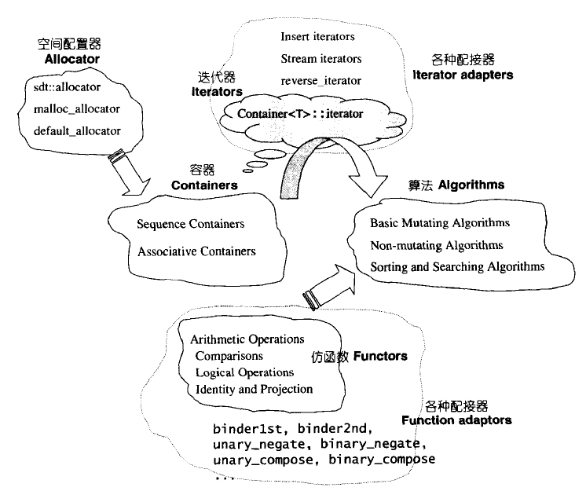
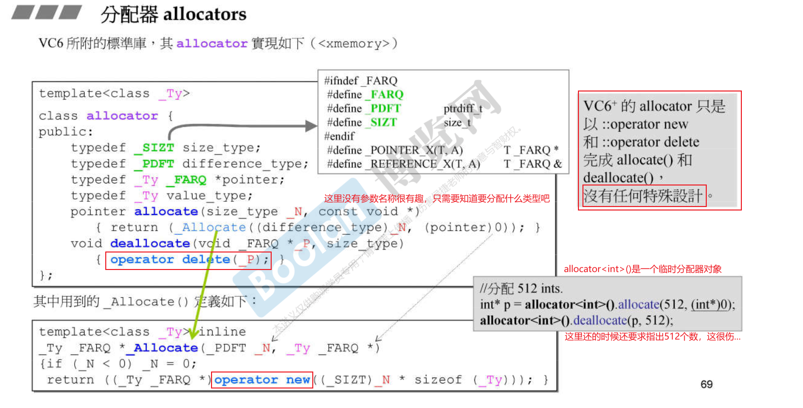
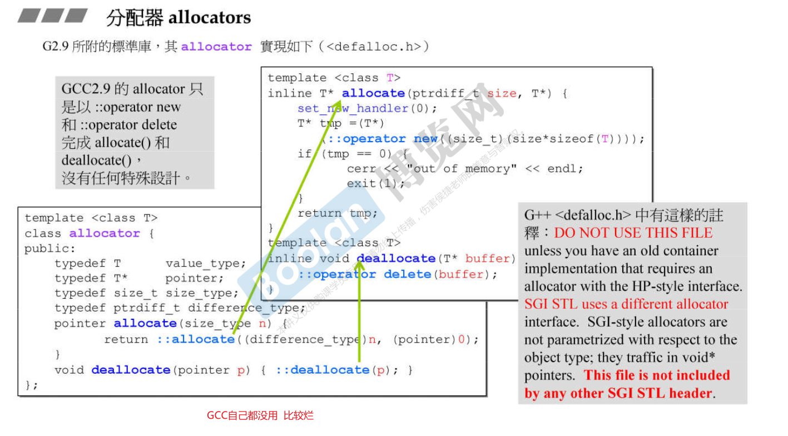
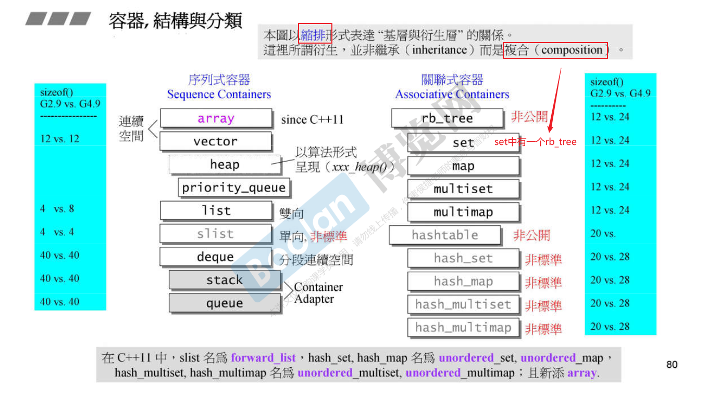
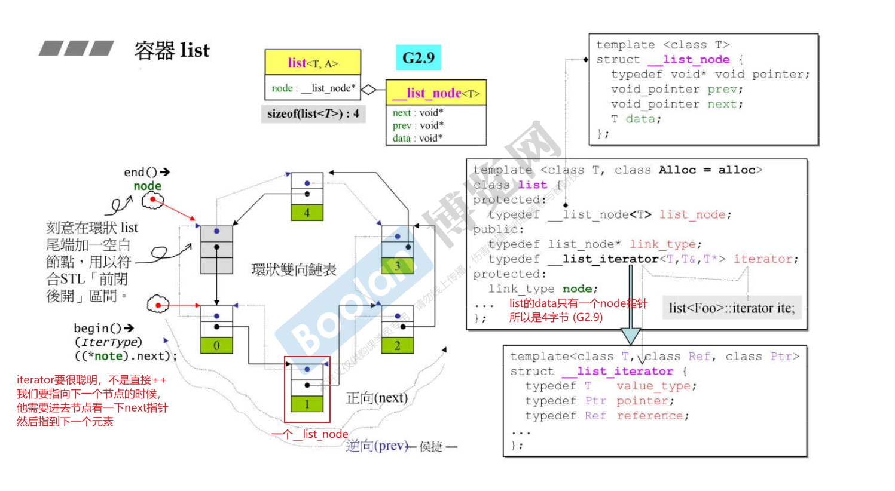
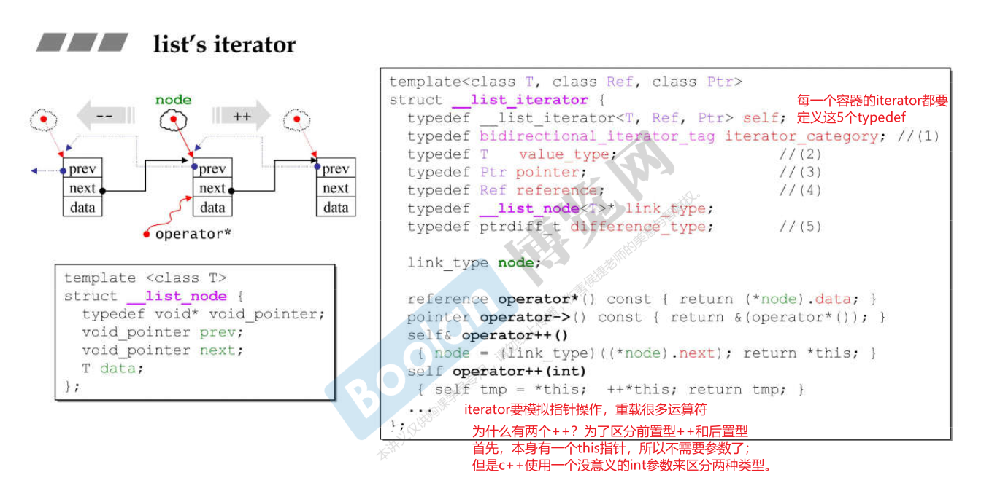
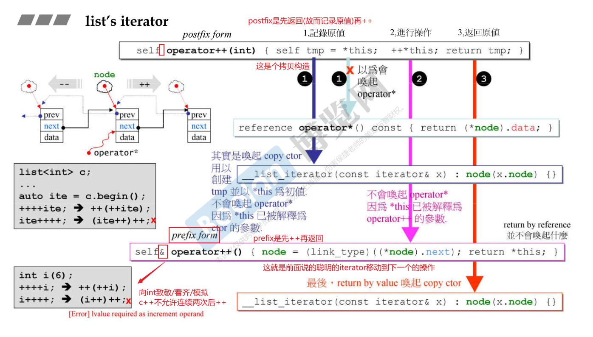

# Notes

- [Notes](#notes)
  - [1. Allocator](#1-allocator)
  - [2. Container](#2-container)
    - [2.1 list](#21-list)

STL: Standard Template Library 标准模板库
C++标准库包括STL，之外还有其它部件

  

## 1. Allocator

所有的分配动作最终都是到C-level的malloc()，这个函数再去调用操作系统的api；

  

> 我们不直接使用allocate接口，一般是使用容器自动分配。

  
> gcc的容器没使用allocator分配器，用的是alloc分配器；gcc的allocator和前面的vc6的allocator分配多个元素的vector时候，每个元素都会有一个cookie(真的吗)，每次malloc都会得到一对cookie，开销比较大。alloc用于减少这个开销，不去每一个元素都分配cookie。cookie数量大大减少。(版本G2.9)
> G4.9又没用alloc了，换成new_allocator了（换回去了，老师也不懂为什么）；alloc名字改成__pool_alloc

## 2. Container

  

> 这个sizeof是控制容器所需要的大小，不是实际元素的大小，不论实际有多少元素。

**Sequence Container 序列式容器**
array: 无法扩充；
vector: 尾部可扩充；
deque(double-ended queue): 头尾均可扩充；
list: 双向(环状)链表；
forward-list: 单向链表；
> stack 和 queue 技术上叫做container adapter；叫做容器也没啥毛病了；注意二者没有iterator；

---

**Associative Container 关联式容器**
set/multiset, map/multimap: 底层是红黑树；multi允许元素重复；
unordered set/multiset, unordered map/multimap: 底层HashTable(链地址法separate chaining)
> multimap不可以使用[]赋值，map可以；
> unordered: 不定序

### 2.1 list

  
> “不是直接++”意思是不是直接物理地址++，实际上也是++，只不过是重载过的智能的++；
> 最后一个元素的下一个元素不属于容器本身（前闭后开）：所以搞了个空节点

  

  
