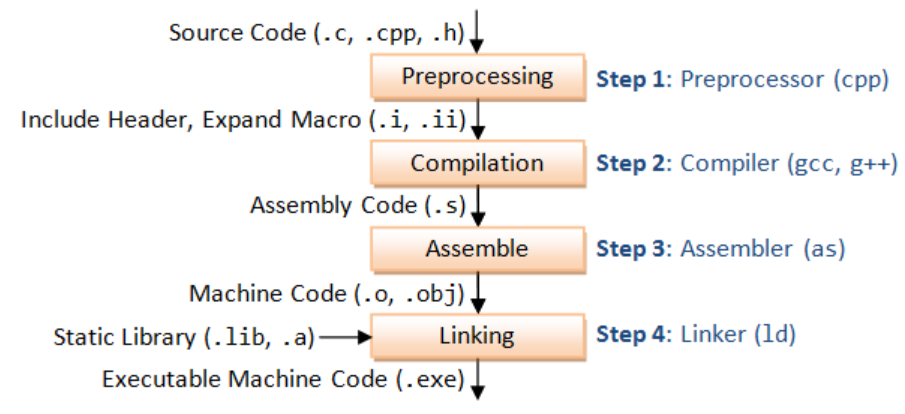
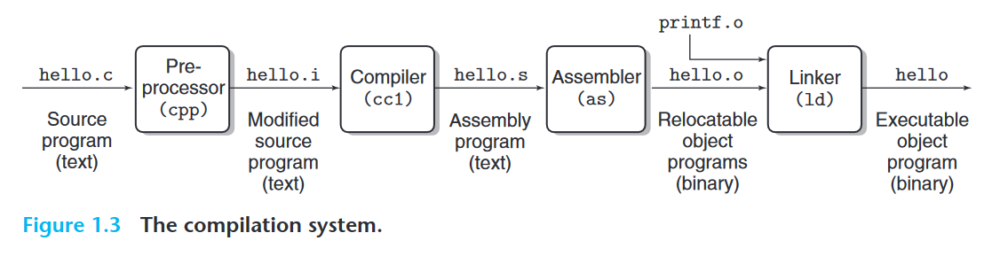

# cpp run progress

**描述一下c/cpp程序的运行过程？**

**source program**: hello.c, hello.cpp, hello.h

step 1: **预处理阶段preprocessing**: 预处理器根据#开头的命令，修改原始的c程序。include header, expand macro.
> 预处理器preprocessor(cpp)
> gcc -E hello.c -> hello.i (**modified source program**(.i, .ii))

step 2: **编译阶段compilation**：翻译成汇编语言程序；
> 编译器compiler(ccl), 如gcc, g++.
> gcc -S hello.c -> hello.s (**assembly program**(.s))

```c
0000000000000000 <main>:
0:   f3 0f 1e fa             endbr64
4:   55                      push   %rbp
5:   48 89 e5                mov    %rsp,%rbp
8:   48 8d 3d 00 00 00 00    lea    0x0(%rip),%rdi        # f <main+0xf>
f:   b8 00 00 00 00          mov    $0x0,%eax
14:   e8 00 00 00 00          callq  19 <main+0x19>
19:   b8 00 00 00 00          mov    $0x0,%eax
1e:   5d                      pop    %rbp
1f:   c3                      retq
```

step 3: **汇编阶段assemble**: 翻译成机器语言指令(machine code)，然后把指令打包成一个可重定位目标程序(relocatable object program); ELF文件吧。
> 汇编器assembler(as)
> gcc -c hello.c -> hello.o (**relocatable object program**(.o, .obj))
> objdump -d hello.o: ==disassembler==: generate a format similar to assembly code from machine code；(见上)

step 4: **链接阶段linking**: 将多个可重定位文件和标准库函数**打包**为一个可执行目标文件(executable object program)
> 链接器linker(ld)
> gcc -o hello hello.c -> hello(**executable object program**(.exe))
> 生成实际可执行的代码需要对一组目标代码文件运行链接器,而这一组目标代码文件中必须含有一个main函数。所以说链接之前不需要main函数，链接阶段需要一个main函数作为函数入口

  

  
