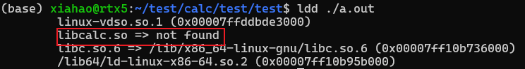

# cpp run progress

**描述一下c/cpp程序的运行过程？**

**source program**: hello.c, hello.cpp, hello.h

step 1: **预处理阶段preprocessing**: 预处理器根据#开头的命令，修改原始的c程序。include header, expand macro.
> 预处理器preprocessor(cpp)
> gcc -E hello.c -> hello.i (**modified source program**(.i, .ii))

step 2: **编译阶段compilation**：翻译成汇编语言程序；
> 编译器compiler(ccl), 如gcc, g++.
> gcc -S hello.c -> hello.s (**assembly program**(.s))

```c
0000000000000000 <main>:
0:   f3 0f 1e fa             endbr64
4:   55                      push   %rbp
5:   48 89 e5                mov    %rsp,%rbp
8:   48 8d 3d 00 00 00 00    lea    0x0(%rip),%rdi        # f <main+0xf>
f:   b8 00 00 00 00          mov    $0x0,%eax
14:   e8 00 00 00 00          callq  19 <main+0x19>
19:   b8 00 00 00 00          mov    $0x0,%eax
1e:   5d                      pop    %rbp
1f:   c3                      retq
```

step 3: **汇编阶段assemble**: 翻译成机器语言指令(machine code)，然后把指令打包成一个可重定位目标程序(relocatable object program); ELF文件吧。
> 汇编器assembler(as)
> gcc -c hello.c -> hello.o (**relocatable object program**(.o, .obj))
> objdump -d hello.o: ==disassembler==: generate a format similar to assembly code from machine code；(见上)

step 4: **链接阶段linking**: 将多个可重定位文件和标准库函数**打包**为一个可执行目标文件(executable object program)
> 链接器linker(ld)
> gcc -o hello hello.c -> hello(**executable object program**(.exe))
> 生成实际可执行的代码需要对一组目标代码文件运行链接器,而这一组目标代码文件中必须含有一个main函数。所以说链接之前不需要main函数，链接阶段需要一个main函数作为函数入口

  

  

  

---

gcc与g++ (都可以用于c和cpp)
编译阶段：
g++会调用gcc，即g++和gcc都可以编译c/cpp代码

链接阶段：
gcc和g++都可以自动链接到标准c库
g++可以自动链接到标准c++库
**gcc如果要链接到标准c++库需要加参数`-lstdc++`**(自己不会自动链接，所以一般gcc编译cpp报错)

---

静态库和动态库（二进制文件）
为什么要在项目中使用库？
1.简洁起见，不需要在项目中维持太多的源文件
2.保密起见（就不给你看我源代码，我不想开源）

库是二进制文件，非文本文件，所以提供者还需要提供一套API函数声明（即头文件）给使用者。

制作静态库
命名：Linux: `libxxx.a`, Windows: `libxxx.lib`
1.预处理编译汇编: `gcc -c *.c`生成`*.o`
2.打包: `ar rcs libxxx.a *.o`生成`libxxx.a`
  

使用静态库：
`gcc -L lib_path -l lib_name`: `lib_name`需要掐头去尾得到xxx
> -L -l后面可以不加空格

```c
- Include libraries from a different path:
gcc {{path/to/source.c}} -o {{path/to/output_executable}} -I{{path/to/header}} -L{{path/to/library}} -l{{library_name}}
```

---

制作动态库（共享库）
命名: Linux: `libxxx.so`, windows: `libxxx.dll` (dynamic link library)
静态库会直接打包到可执行程序中，因此直接放置在代码区。（位置相关的绝对地址）
动态库不会放在代码区，在动态库加载区，随着程序运行动态加载。（位置无关的相对地址）
1.`gcc -c *.o -fpic`
2.`gcc -shared *.c -o libxxx.so`

  

使用方法同于静态库

---
库的加载原理
静态库：
**链接阶段会将静态库打包到可执行程序。当可执行程序被执行，静态库中的代码会被一并加载到内存。所以不存在静态库无法被加载的问题。**

动态库：
链接阶段并**不会将动态库打包到可执行程序，仅仅是记录了库名**。当可执行文件被执行，会先检测需要的动态库**是否可以被加载**，没有的话就报错。
当动态库中的函数在程序中被调用时才会被加载到内存，不调用就不会加载。

linux提供了一个**动态链接器**
  

**ldd检测是否可以成功加载动态库**
  

---

优缺点对比：
静态库
优点：
1.静态库被打包到应用程序中加载，**速度快**
2.发布程序无需提供静态库，**移植方便**
缺点：
1.**相同的库文件数据可能在内存中被加载多份, 消耗系统资源，浪费内存**
2.**库文件更新需要重新编译项目文件, 生成新的可执行程序, 浪费时间**。

动态库
优点：
1.可实现不同进程间的**资源共享**
2.动态库**升级简单**, 只需要替换库文件, **无需重新编译应用程序**
缺点：
1.加载速度比静态库慢, 以现在计算机的性能可以忽略
2.**发布程序需要提供依赖的动态库**

如果源文件比较少就干成静态库，如果很大就搞成动态库。