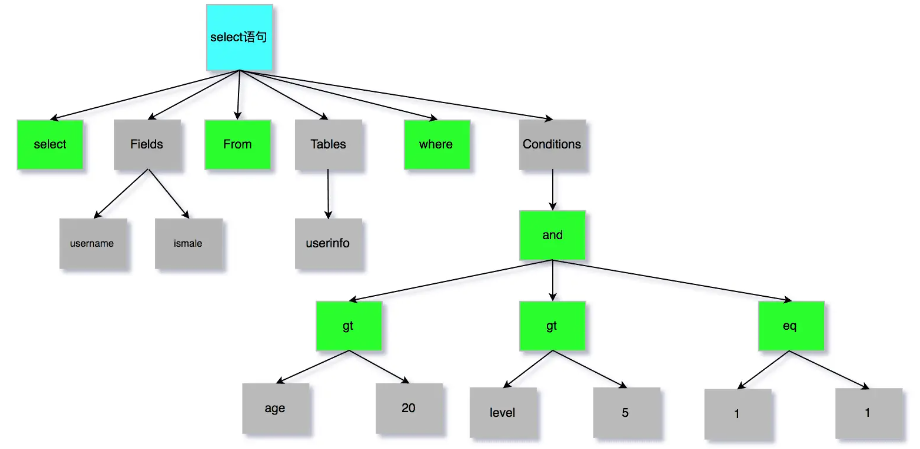
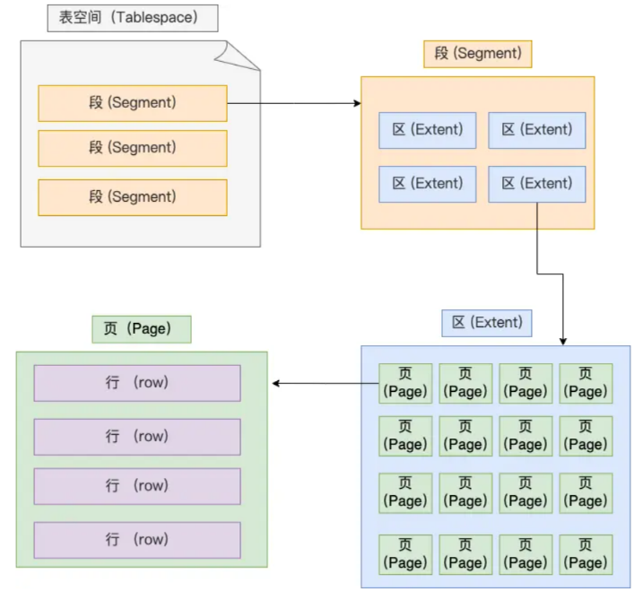

# Database

## 基础

### 执行select语句，期间发生了什么

`select * from product where id = 1;`

  

MySQL架构分为两层：Server层和存储引擎层

Server层：负责**建立连接、分析和执行SQL**。MySQL大多数的核心功能模块都在这实现，主要包括连接器，查询缓存、解析器、预处理器、优化器、执行器等。另外，还包括所有的内置函数（如日期、时间、数学和加密函数等）和所有跨存储引擎的功能（如存储过程、触发器、视图等。）。
存储引擎层：负责**数据的存储和提取**。支持 InnoDB、MyISAM、Memory 等多个存储引擎，不同的存储引擎共用一个Server层。现在最常用的存储引擎是InnoDB，从MySQL5.5版本开始，InnoDB成为了MySQL的默认存储引擎。我们常说的索引数据结构，就是由存储引擎层实现的，不同的存储引擎支持的索引类型也不相同，比如InnoDB默认使用索引类型是B+树，即数据表中创建的主键索引和二级索引默认使用的是B+树索引。

#### 连接器

使用mysql，首先要连接mysql服务：

```bash
mysql -h$ip -u$user -p
# -h: mysql服务器的ip地址，如果连接本地mysql服务可省略
```

**MySQL基于TCP，连接mysql服务需要经过TCP三次握手**，服务开启并握手完毕后，连接器会验证用户名和密码，如果错误，报错；如果正确，连接器会获取该用户的权限，后续在此连接中的操作会基于该权限。（连接器的工作仅此而已）

`show processlist;`: 查看有多少客户端连接了mysql服务
`kill connect +id`: kill客户端连接
`show variables like 'max_connections';`: 查询客户端连接数，默认151个

#### 查找缓存

连接完毕后，客户端可以发送sql语句，mysql首先会解析SQL语句的第一个字段来判断语句类型。如果是select语句，mysql会先去**查询缓存(query cache)**中查找缓存数据。（查询缓存以key-value形式存在**内存**中），**key为SQL查询语句，value会查询结果**。
> 所谓transform的key value query来源

但其实查询缓存很**鸡肋**，mysql8.0之后**删掉**了查询缓存。
对于更新频繁的表，查询缓存的命中率很低，因为只要一个表有更新操作，那么这个表的查询缓存就会被清空。

#### 解析器解析SQL

解析器做两件事情：词法分析和语法分析

  
  

#### 执行SQL

每条SELECT查询语句流程主要可以分为三个阶段：预处理、优化、执行

##### 预处理器

- 检查SQL语句中的表和字段是否存在
- 将`select *`中的`*`扩展为表上的所有列(ok 有点像C语言的预处理指令)

##### 优化器

负责将 SQL 查询语句的执行方案确定下来，比如在表里面有多个索引的时候，优化器会基于查询成本的考虑，来决定选择使用哪个索引。

##### 执行器

pass

### MySQL一行记录是怎么存储的

MySQL默认使用InnoDB存储引擎
`show variables like 'datadir;'`: 查询数据库文件存在哪儿;`/var/lib/mysql/`，表结构存在.frm中，表数据存在.ibd文件中。

表空间由段（segment）、区（extent）、页（page）、行（row）组成，InnoDB存储引擎的逻辑存储结构大致如下图：
  

行：数据库表的**记录**是以行进行存放的
页：InnoDB的数据是以页为基本单位来**读写**的（需要读一条记录时，会将一页数据从磁盘读到内存，类似于页式存储管理）。默认每页大小为**16KB**（即只能保证16KB的连续存储）
区：