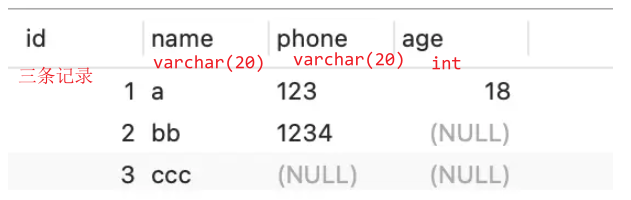
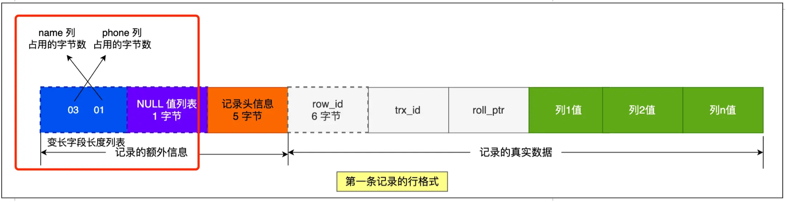
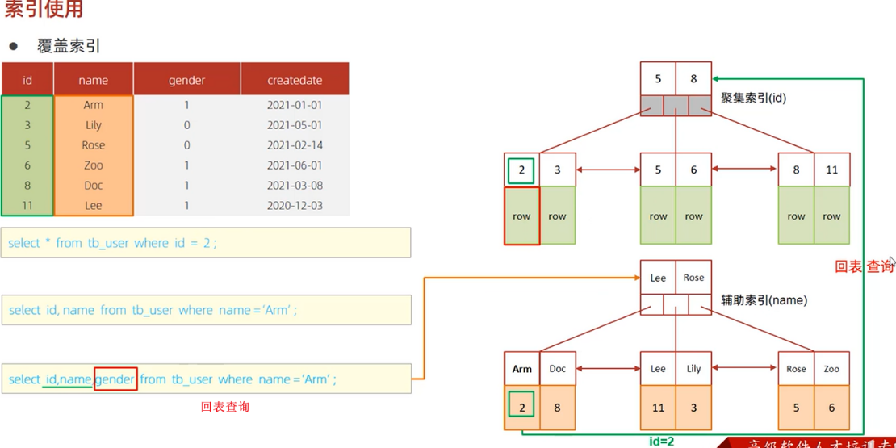
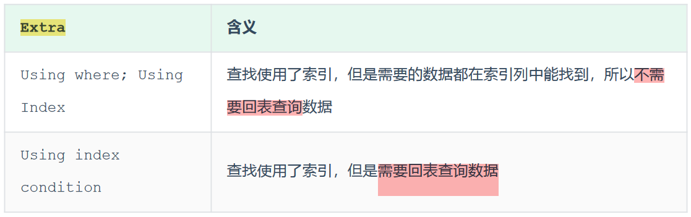
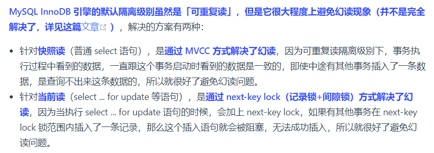

# MySQL八股

[toc]

## 一、基础

### 执行select语句，期间发生了什么

`select * from product where id = 1;`

  

MySQL架构分为两层：Server层和存储引擎层

Server层：负责**建立连接、分析和执行SQL**。MySQL大多数的核心功能模块都在这实现，主要包括连接器，查询缓存、解析器、预处理器、优化器、执行器等。另外，还包括所有的内置函数（如日期、时间、数学和加密函数等）和所有跨存储引擎的功能（如存储过程、触发器、视图等）。
存储引擎层：负责**数据的存储和提取**。支持 InnoDB、MyISAM、Memory 等多个存储引擎，不同的存储引擎共用一个Server层。从MySQL5.5版本开始，InnoDB成为了MySQL的默认存储引擎。我们常说的**索引**数据结构，就是由存储引擎层实现的，不同的存储引擎支持的索引类型也不相同，比如InnoDB默认使用索引类型是B+树，即数据表中创建的主键索引和二级索引默认使用的是B+树索引。

#### 连接器

使用mysql，首先要连接mysql服务：

```bash
mysql -h$ip -u$user -p
# -h: mysql服务器的ip地址，如果连接本地mysql服务可省略
```

**MySQL基于TCP，连接mysql服务需要经过TCP三次握手**，服务开启并握手完毕后，连接器会验证用户名和密码，如果错误，报错；如果正确，连接器会获取该用户的权限，后续在此连接中的操作会基于该权限。（连接器的工作仅此而已）

`show processlist;`: 查看有多少客户端连接了mysql服务
`kill connect +id`: kill客户端连接
`show variables like 'max_connections';`: 查询客户端连接数，默认151个

#### 查找缓存

连接完毕后，客户端可以发送sql语句，mysql首先会解析SQL语句的第一个字段来判断语句类型。如果是select语句，mysql会先去**查询缓存(query cache)**中查找缓存数据。（查询缓存以key-value形式存在**内存**中），**key为SQL查询语句，value会查询结果**。
> 所谓transformer的key value query来源

但其实查询缓存很**鸡肋**，mysql8.0之后**删掉**了查询缓存。
对于更新频繁的表，查询缓存的命中率很低，因为只要一个表有更新操作，那么这个表的查询缓存就会被清空。

#### 解析器解析SQL

解析器做两件事情：词法分析和语法分析

  
  

#### 执行SQL

每条SELECT查询语句流程主要可以分为三个阶段：预处理、优化、执行

##### 预处理器

* 检查SQL语句中的表和字段是否存在
* 将`select *`中的`*`扩展为表上的所有列(ok 有点像C语言的预处理指令)

##### 优化器

负责将 SQL 查询语句的**执行方案**确定下来，比如在表里面有多个索引的时候，优化器会基于查询成本的考虑，来决定选择使用哪个索引。
> 通过explain命令查询SQL语句的执行计划

##### 执行器

执行器与存储引擎以记录为单位交互完成
具体过程暂略

### MySQL一行记录是怎么存储的 (额外信息 + 真实数据)

存储行为由存储引擎定义，我们以InnoDB讲解：
MySQL默认使用InnoDB存储引擎
`show variables like 'datadir;'`: 查询数据库文件存在哪儿;`/var/lib/mysql/`，表结构存在.frm中，表数据存在.ibd文件中。

.frm: 存储表的元数据信息，比如列信息、索引信息、存储结构类型等。
.ibd: 存储数据和**索引**等。

---

InnoDB存储引擎的**逻辑存储结构**：
  

> first: 记录是按照row行存储在磁盘中的，数据库的读取是按照page页为单位读取的(不然总不能每读一行一次磁盘io吧，和分页存储原理一致)，一页16KB，即一次**最少**从磁盘读取16KB内容到内存，或者**最少**把16KB刷新到磁盘。
> > 基本单位是页，但没说一次只能读取一页奥...

* tablespace表空间(.idb): 包含多个segment段，如**数据**段(存放B+树非叶子节点的区的集合)、**索引**段(存放叶子节点的区的集合)、回滚段(存放回滚数据的区的集合(事务隔离))等。
* segment段：包含多个extent区
* extent区：每个区1MB。InnoBD页大小默认为==16KB==，即一个区有64个page
  * 默认存储引擎按照page分配空间，但为了**顺序io**，还是将链表中相邻页放到一个区中比较好
* page页：存储引擎管理的最小(基本)单元，即InnoDB以页为基本单位来**读写**的（需要读一条记录时，会将一页数据从磁盘读到内存，类似于页式存储管理）。默认每页大小为**16KB**（即只能保证16KB的连续存储，为了保证连续性，存储引擎每次向磁盘申请4-5个区）
* 行：数据库表的**记录**是以行进行存放的

---

**InnoDB行格式row_format**：一条记录的存储结构
  

我们讲讲Compact:
  

#### 记录的额外信息

* **变长字段长度列表**：存储变长字段(eg varchar类型字段)的实际数据**长度**
  * 因为varchar(n)中的n是最大长度嘛 所以需要这么个字段
  * 如果数据表中没有变长字段，则记录航中无需变长字段长度列表

举个例子：

> 字符集是ascii，一个字符占据一字节



> * 注意变长字段长度列表是**逆序**存放的，第二条记录`04 02`，but why>
>   * **记录头信息**中有一个指向下一记录的指针，指向**记录头信息**和**真实数据**之间的位置，这样的话向左读就是记录头，向右就是真实数据，很方便。故而逆序存放的目的室：使得**位置靠前的记录的真实数据和数据对应的字段长度信息可以同时在同一个cpu cache line中**，提高cache命中率。（高低有点细节了）

  

---

* **NULL值列表**：每一个允许为NULL的列对应着一个bit，1表示该列为null，0非null，同样是**逆序**排列。
  * NULL值列表长度为8bit的整数倍，不足高位padding zero
  * 对于not null的字段，不需要这玩意儿。如果所有字段都not null, 就没有NULL值列表, 那就可以剩下至少1字节空间
  * 故而第一条数据NULL值列表为`00000000`(0x00), 第二条`00000100`(0x04), 第三条`00000110`(0x06)

* **记录头信息**
  * **delete_mask**：标识此条数据是否被删除。从这里可以知道，我们执行detele删除记录的时候，并不会真正的删除记录，只是将这个记录的delete_mask标记为1
  * **next_record**：下一条记录的位置。从这里可以知道，记录与记录之间是通过链表组织的。在前面我也提到了，指向的是下一条记录的「记录头信息」和「真实数据」之间的位置，这样的好处是向左读就是记录头信息，向右读就是真实数据，比较方便
  * record_type：表示当前记录的类型，0表示普通记录，1表示B+树非叶子节点记录，2表示最小记录，3表示最大记录

---

#### 记录的真实数据

三个隐藏字段：

* row_id: 如果我们建表的时候指定了主键或者唯一约束列，那么就没有row_id隐藏字段。如果既没有指定主键，又没有唯一约束，那么InnoDB就会为记录添加row_id隐藏字段作为**主键约束**; (非必需，6B)
* trx_id: 事务id(transaction_id)，表示这个数据是由哪个事务生成的; (必需，6B)
* roll_pointer: 这条记录上一个版本的指针；roll_pointer 是必需的，占用 7 个字节。（？？？等到MVCC机制回看）

#### 一行长度

mysql规定，除了text, blobs这种大对象类型之外，其他所有列占用的字节长度加起来不能超过65535字节。（即一行记录最大只能存65535B）

如果表中只有一个varchar(n)字段且字符集是ascii，那么varchar(n)的最大取值是多少(ascii下1字符=1B)
刨去null值列表占用1B，变长字段长度列表占用2B(如果变长字段占用字节数>255B, 就用2B表示，否则1B)，故而这种情况下，n=65535-3=**65532**

---

而mysql磁盘和内存通过page交互(16KB)，所以一个页可能存不了一条记录(比如大blob对象，或者很长的varchar)，发生行溢出，多出的数据会存到另外的**溢出页**中。
{width=700}

---

#### 总结

**1.mysql的null值是如何存放的？**
MySQL 的 Compact 行格式中会用**NULL值列表**来**标记**值为NULL的列，NULL值并**不会存储在行格式中的真实数据部分**。

NULL值列表会占用整数个字节空间，当表中所有字段都定义成 NOT NULL，行格式中就不会有NULL值列表，可节省空间。

2.如何知道varchar(n)实际占用的数据大小
compact行格式中的变长字段长度列表可以看出每个varchar字段的大小

## 二、索引篇

索引就是数据的目录，帮助存储引擎快速获取数据，空间换时间。
索引是一种有序数据结构。

* 优点
  * 提高查询效率，降低数据库IO成本
  * 提升排序效率
* 缺点（问题不大）
  * 索引占用磁盘存储空间 (数据和索引都存在磁盘文件.idb中)
  * 虽然大大提升了查询效率(占据90%的频次)，但是**降低了增删改的效率**

> 存储引擎：是如何存储数据、如何为存储的数据建立索引、如何查询、更新数据等技术的实现方法。

  

### 分类

**索引分类**：
按「数据结构」分类：B+tree索引、Hash索引、Full-text索引。
按「**物理存储**」分类：聚集索引（主键索引）、二级索引（辅助索引）。
按「**字段特性**」分类：主键索引、唯一索引、普通索引、前缀索引。
按「字段个数」分类：单列索引、联合索引。

#### 按物理存储分类

按照索引的物理存储形式分为：

* 聚集索引(主键索引)Clustered Index: 将数据和索引放在一起，索引结构的叶子节点存放的是**实际数据**。（有且唯一）
* 二级索引(辅助索引)Secondary Index: 将数据和索引分开存储，索引结构的叶子结点存放的是**主键值**(看好奥，放的是主键，可供回表使用(比如常见的id这个key))。（可不唯一，除了逐主键索引外的其他索引应该就是二级索引了）

聚集索引选取规则：

* 如果存在主键，主键索引就是聚集索引（一般来说聚集索引就是主键）
* 如果不存在主键，将使用第一个唯一（UNIQUE）索引作为聚集索引
* 如果表没有主键，或没有合适的唯一索引，则InnoDB会自动生成一个自增的row_id作为隐藏的聚集索引

所以，在查询时使用了二级索引，如果查询的数据能在二级索引里查询的到，那么就不需要回表，这个过程就是**覆盖索引**。如果查询的数据不在二级索引里，就会先检索二级索引，**找到对应的叶子节点，获取到主键值后，然后再检索主键索引**，就能查询到数据了，这个过程就是**回表查询**。

  
  

  

#### 按数据结构分类

B+树
数据库的**索引和数据都是存储在硬盘**的，所以每次读取一个索引节点需要一次磁盘io。B+Tree 相比于B树和二叉树来说，最大的优势在于查询效率很高，因为即使在数据量很大的情况，查询一个数据的磁盘I/O依然维持在3-4次(包括读数据那一次)。
> 树高为2大概可以存储18000条记录，树高为3大概是2200w条。

* B+树（多路平衡搜索树）特点：
  * 一个节点有多个子节点（多路）-> 所以树比较**矮胖**
  * 非叶子不保存数据，只作为索引；所有key都会出现在叶子中
  * 叶子按照从小到大排序，形成双向链表

底层结构：
我们知道数据库以page为单位读写，每个数据页有一个文件头，里面有两个指针，分别指向上下一个数据页，形成双向链表。
B+树种每个节点都是一个数据页，只有叶子才存放了数据，非叶子值存放目录项作为索引。

**为什么MySQL InnoDB选择B+tree作为索引的数据结构？**

* B+Tree vs. B Tree
  * B+树非叶子只存储索引而B树存索引和数据。所以B+能存储的索引数目也就更多，所以B+树更加矮胖，进而磁盘io次数就比较少。
  * B+Tree叶子采用双向链表连接，适合mysql中的基于范围的查找，B Tree做不到。
* B+Tree vs. 二叉树
  * n个节点m叉树树高是$O(log_m^n)$，二叉树m=2，B+树一般m>100, 所以显然B+树是更加矮胖的，树高就代表着磁盘io次数。(==索引和数据存在磁盘中==)
* B+Tree vs. Hash表
  * Hash非常适合等值查询(O(1)搜索复杂度)，但并不适合范围查询。
  * 无法利用索引进行排序操作

#### 按字段顺序分类

* 主键索引：建立在主键字段上的索引，唯一非空，默认创建 (PRIMARY)
* 唯一索引：建立在unique字段上的索引，唯一，可为null (UNIQUE)
* 普通索引：建立在普通字段上的索引，可不唯一，可为null
* 前缀索引：对字符类型字段的前几个前缀字符建立的索引，而不是在整个字段上建立的索引，可以缩小索引占据的磁盘空间

```sql
-- 创建普通索引
create index index_name on table_name(column_name) 
-- 创建唯一索引
create unique index index_name on table_name(column_name) 
-- 创建复合索引
create index index_name on table_name(column1, column2) 
-- 创建全文索引
create fulltext index index_name on table_name(column_name) 
-- 创建前缀索引 (提取前n个字符构建索引)
create index index_name on table_name (column_name(n))
```

#### 按字段个数分类

* 单列索引
* 联合索引：通过将多个字段组合成一个索引。即在B+树中采用多个字段的值作为key值，比较时**先后比较**多个key。（前面的key是全局有序的，后面的key是在前面key相同时才有序，即局部相对有序）

> 在业务场景中，如果存在多个查询条件，考虑针对于查询字段建立索引时，建议建立联合索引， 而非单列索引。

---

**索引使用原则：**

1.联合索引遵循**最左前缀法则**：查询从索引的最左列开始(必须存在，但未必需要放在第一位)，并且不跳过索引中的字段。

* 如果不从最左列开始，联合索引完全失效
* 如果从最左开始，但跳过中间某列，则后面的字段失效（部分失效）
* 多个字段顺序是可以改变的

2.联合索引**范围查询**中规则：出现范围查询(> or <)，范围查询右侧的列索引失效。
> 改成>=就行了（如果业务允许的话
> `>=, <=, between, like`不会停止匹配

3.其他**索引失效**情况

* 不要在索引列上进行函数操作或者表达式计算，索引将失效（如substring, length, +1）
  * 因为索引存的是索引字段的原始值，而非计算后的值，故而.
* 模糊匹配中，如果仅仅是尾部模糊匹配，索引不失效，但如果是头部模糊，索引失效(`like %xxx`, `like %xx%`会失效)
* 用or连接条件时，只有两侧都使用索引时才有效，一侧没有就失效
* 如果mysql认为使用索引比全表更慢，则不用索引；（受该字段的数据分布影响，很智能）

4.**覆盖索引**:数据库可以**只通过索引**而**不需要查找表中的行数据**就能获取查询所需的所有信息 (需要返回的列在索引中已经全部能够找到)
尽量使用覆盖索引，减少使用select *

  

有什么优化索引的方法：（我简写了，详见xiaolin）

* 前缀索引优化
* 覆盖索引优化
* 主键索引最好是自增的
* 防止索引失效

### count(*) / count(1)

当我们对一张数据表中的记录进行统计的时候，可以使用count(1)、count(*)、count(字段) 等。
按照性能排序：
`count(*) > count(1) > count(主键字段) > count(字段)`
count()聚合函数会统计函数指定的参数**不为null**的记录个数。
  
> 所以注意啊，count(1)不会排除null字段

## 三、事务篇

事务是一组操作的集合，它是一个不可分割的工作单位，事务会把所有的操作作为一个整体一起向系 统提交或撤销操作请求，即这些操作**要么同时成功，要么同时失败**。（原子性）

```sql
# 手动控制事务方法一（关闭事务自动提交）
select @@autocommit; -- 查看事务提交方式，1表示自动提交
set @@autocommit = 0; -- 设置为手动（session参数，只针对当前窗口有效）
# 设置为手动之后就需要使用commit手动提交事务到数据库
commit;     -- 提交事务
# 设置手动之后 如果执行出错需要回滚（why
rollback;   -- 回滚事务
```

```sql
# 手动控制事务方法二（显式开启事务）[推荐]
start transaction; -- 开启事务 或者begin
-- 事务操作
commit; -- 提交
rollback; -- 回滚
```

### ACID

**实现事务必需遵守四个特性** (ACID)

* **原子性**（Atomicity）：事务是不可分割的最小操作单元，即一个事物中的所有操作要么全部完成，要么全部不完成，不会结束在中间某个环节。
* **一致性**（Consistency）：事务完成时，必须使所有的数据都保持一致状态。（？？？）
* **隔离性**（Isolation）：数据库系统提供的隔离机制，保证事务在不受外部**并发**操作影响的独立环境下运行。（隔离级别越高越安全但也越低效）
* **持久性**（Durability）：事务一旦提交或回滚，它**对数据库中的数据的改变就是永久**的 (因为存在磁盘中)。

**InnoDB引擎通过什么技术保证这四个特性的？**

* 原子性：undo log (回滚日志)
* 持久性：redo log (重做日志)
* 隔离性：MVCC (多版本并发控制) 或 锁机制
* 一致性：持久性 + 原子性 + 隔离性

---

### 并行(发)事务会引发什么问题

多个并发事务同时操作某数据库/表所引发的问题
> 并发会产生并行的幻觉

* **赃读 (dirty read)**：A事务读到B事务还未提交的(修改过的)数据
  * “脏读”指读到了未提交的数据，然后基于这个数据做了一些事情，结果做完发现数据被回滚了。可以理解为领导还没下达正式任务你就凭着自己的揣摩开始干活，结果活干完了，任务的内容被改了。
* **不可重复读 (non-repeatable read)**：同一事务先后读取同一个数据结果不一致的问题;（前后读取的数据不一致）
  * “不可重复读”好一点，读到的是**已提交**的数据，比如某个读事务持续时间比较长，期间多次读取==某个元组==，每次读到的都是被别人**改过并已提交**的不同数据。可以理解为在执行任务的过程中，领导的指令一直在变。。但好歹是正式下达的指令。
* **幻读 (phantom read)**：“幻读”是指读的过程中，==某些元组被增加或删除==，这样进行一些集合操作，比如算总数，平均值等等，就会每次算出不一样的数。（前后读取的记录**数量**不一致）

所以“不可重复读”和“幻读”都是读的过程中**数据前后不一致**，只是**前者侧重于修改，后者侧重于增删**（数据操作不同）。前者侧重于**单个数据项**，后者侧重于**一批数据**（影响范围不同）。
个人认为，严格来讲“幻读”可以被称为“不可重复读”的一种特殊情况，没错的。但是从数据库管理的角度来看二者是有区别的。解决“不可重复读”只要加行级锁就可以了。而解决“幻读”则需要加表级锁，或者采用其他更复杂的技术，总之代价要大许多。这是搞数据库的那帮家伙非要把这两者区分开的动机吧。
[reference](https://www.zhihu.com/question/392569386/answer/1434210648)

严重程度：脏读 > 不可重复读 > 幻读

### 事务隔离级别

**读未提交(read uncommitted)**: 一个事务还没提交时，它做出的变更就能被其他事务看到（即A事务可以读到B事务修改了未提交的内容，即引起脏读）
**读提交(read committed)**: 一个事务提交之后，该变更才能被其他事务看到
**可重复读(repeatable read)**: 一个事务执行中看到的数据，一直跟这个事务启动时看到的数据是一致的
**串行化(serializable)**: 对记录加上读写锁，多个事务对这条记录进行读写操作时，如果发生了读写冲突的时候，后访问的事务必须等前一个事务执行完成，才能继续执行；

  

```sql
SELECT @@TRANSACTION_ISOLATION; -- 查看事务隔离级别
SET [ SESSION | GLOBAL ] TRANSACTION ISOLATION LEVEL { READ UNCOMMITTED | READ COMMITTED | REPEATABLE READ | SERIALIZABLE } -- 设置事务隔离级别
```

比如，read uncommitted不可规避脏读问题，A事务**可以**读到B事务还未提交的数据；而read committed可以规避脏读问题，A事务读到B事务还未提交的数据时**会读取之前的数据**，并不会读取uncommitted data，当B事务提交之后select可以读到commited data。但read comitted会出现不可重复读问题。
repeatable read会保证一个事务中查询的数据一致，即使另一个事物commit数据。但会出现幻读问题，去查没有，更新又有，妈的见鬼。
serializable可解决幻读问题：A事务查询数据没有，B事务去insert**会被阻塞**，直到A事务commmit之后。

serializable串行化可以解决所有并发事物问题；我们一般使用默认repeatable read不做修改。

---

所以，要解决脏读现象，就要升级到「读提交」以上的隔离级别；要解决不可重复读现象，就要升级到「可重复读」的隔离级别，要**解决幻读现象不建议将隔离级别升级到「串行化」**，因为MySQL 在「可重复读」隔离级别下，可以**很大程度上**(不是完全解决)避免幻读现象的发生。

  

## 四、锁篇

### 全局锁

```sql
-- 创建全局锁
flush tables with read lock;
-- 释放全局锁
unlock tables;
```

创建全局锁后，**整个数据库就处于只读状态了**(只可以使用DQL语句)，这时其他线程执行以下操作，都会被**阻塞**：
DML语句:对数据的增删改操作，比如 insert、delete、update等语句；
DDL语句:对表结构的更改操作，比如 alter table、drop table 等语句。

* 全局锁：锁定整个数据库(所有表)
  * 应用：全库的逻辑备份，全局锁后，可以获得一致性视图，保证数据的完整性。
    * `mysqldump -uroot -pxiahao table_name > tmp.sql;` (逻辑备份即导出为一些sql语句(创建表+insert语句))
  * 缺点
    * 回去重看

### 表级锁

标级锁分为：表锁、元数据锁、意向锁

#### 表锁

表锁分为：读锁（共享锁）和写锁（独占锁），跟操作系统一样，只不过os中读写锁是一把锁，mysql这里是两把锁

读锁允许多个事务并发读取同一数据，但不允许写入(DDL/DML)（**包括自己**） （都可以读 都不可以写）
写锁是独占的，同一时间只有持有写锁的事务可以读**写**，其他事物读写均被阻塞。（只有自己可读写，其他都不可以）

> 思想上和os提供的线程同步机制中的读写锁(c语言)是一样的，mysql的读写锁是数据库系统内部实现的。
> 本质上还是读者写者问题：允许读读，互斥读写，互斥写写 (针对共享资源所以需要互斥)

不过尽量避免在使用 InnoDB 引擎的表使用表锁，因为**表锁的颗粒度太大**，会**影响并发性能**，**InnoDB**牛逼的地方在于实现了**颗粒度更细的行级锁**。

```sql
-- 表级别的共享锁（读锁）
lock tables t_student read;
-- 表级别的独占锁（写锁）
lock tables t_student write;
-- 释放当前会话的所有表锁
unlock tables;
```

#### 元数据锁

> **元数据**是指有关数据库结构和定义的信息：比如数据库、表、列的定义，索引信息，触发器和存储过程等对象的定义 （简单理解为**元数据就是表结构**）

元数据锁(MDL)**无需显式使用**，系统自动控制。MDL锁用于维护表中元数据的一致性，当表上有活动事务的时候，不可以对元数据进行写入操作。**避免DML和DDL冲突**。

* 对一张数据表进行增删改查时，会自动加上**MDL读锁(共享)**
  * 这里对表内容可以同时读写，因为都是MDL读锁（共享），别管那个什么shared_write
* 对一张表结构做变更操作时，会自动加上**MDL写锁(排他)**

  

```sql
查看元数据锁: 
select object_type, object_schema, object_name, lock_type, lock_duration from performance_schema.metadata_locks;
```

MDL 是为了保证当用户对表执行 CRUD 操作时，防止其他线程对这个**表结构**做了变更。
当有线程在执行select语句（加MDL读锁）的期间，如果有其他线程要更改该表的结构（申请MDL写锁），那么将会被**阻塞**，直到执行完select语句（释放MDL读锁）。 (互斥读写)

反之，当有线程对表结构进行变更（加MDL写锁）的期间，如果有其他线程执行了CRUD操作（申请MDL读锁），也被阻塞，直到表结构变更完成（释放MDL写锁）。


#### 意向锁

#### AUTO-INC锁

### 行级锁

行级锁，每次操作**锁住对应的行数据**。==锁定粒度最小，发生锁冲突的概率最低，并发度最高==.

InnoDB引擎支持行级锁，MyISAM不支持。

InnoDB的行锁是**基于索引**的，即通过对索引上的索引项加锁来实现，**而非基于记录**。

行锁主要分为三类：

* Record Lock (行锁)
* Gap Lock (间隙锁)
* Next-Key Lock (临键锁)

---

普通的select语句不会对记录加行级锁，因为它属于快照读(MVCC)。不过也可以使用下面的方式加锁（这种给查询加锁称作**锁定读**）

```sql
-- 对读取的记录加共享锁
select ... lock in share mode;
-- 对读取的记录加独占锁
select ... for update;
```