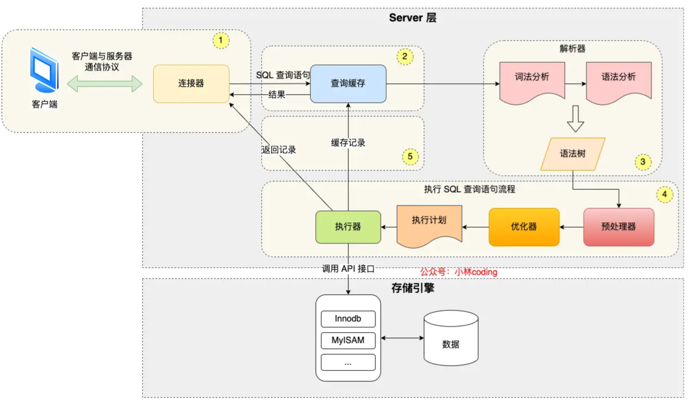
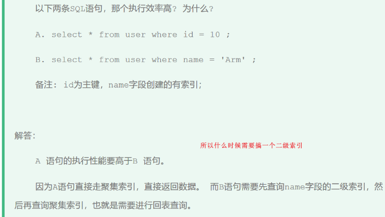

# MySQL八股

[toc]

## 一、基础

### 执行select语句，期间发生了什么

`select * from product where id = 1;`

  

MySQL架构分为两层：Server层和存储引擎层

Server层：负责**建立连接、分析和执行SQL**。MySQL大多数的核心功能模块都在这实现，主要包括连接器，查询缓存、解析器、预处理器、优化器、执行器等。另外，还包括所有的内置函数（如日期、时间、数学和加密函数等）和所有跨存储引擎的功能（如存储过程、触发器、视图等。）。
存储引擎层：负责**数据的存储和提取**。支持 InnoDB、MyISAM、Memory 等多个存储引擎，不同的存储引擎共用一个Server层。现在最常用的存储引擎是InnoDB，从MySQL5.5版本开始，InnoDB成为了MySQL的默认存储引擎。我们常说的索引数据结构，就是由存储引擎层实现的，不同的存储引擎支持的索引类型也不相同，比如InnoDB默认使用索引类型是B+树，即数据表中创建的主键索引和二级索引默认使用的是B+树索引。

#### 连接器

使用mysql，首先要连接mysql服务：

```bash
mysql -h$ip -u$user -p
# -h: mysql服务器的ip地址，如果连接本地mysql服务可省略
```

**MySQL基于TCP，连接mysql服务需要经过TCP三次握手**，服务开启并握手完毕后，连接器会验证用户名和密码，如果错误，报错；如果正确，连接器会获取该用户的权限，后续在此连接中的操作会基于该权限。（连接器的工作仅此而已）

`show processlist;`: 查看有多少客户端连接了mysql服务
`kill connect +id`: kill客户端连接
`show variables like 'max_connections';`: 查询客户端连接数，默认151个

#### 查找缓存

连接完毕后，客户端可以发送sql语句，mysql首先会解析SQL语句的第一个字段来判断语句类型。如果是select语句，mysql会先去**查询缓存(query cache)**中查找缓存数据。（查询缓存以key-value形式存在**内存**中），**key为SQL查询语句，value会查询结果**。
> 所谓transform的key value query来源

但其实查询缓存很**鸡肋**，mysql8.0之后**删掉**了查询缓存。
对于更新频繁的表，查询缓存的命中率很低，因为只要一个表有更新操作，那么这个表的查询缓存就会被清空。

#### 解析器解析SQL

解析器做两件事情：词法分析和语法分析

  
  

#### 执行SQL

每条SELECT查询语句流程主要可以分为三个阶段：预处理、优化、执行

##### 预处理器

* 检查SQL语句中的表和字段是否存在
* 将`select *`中的`*`扩展为表上的所有列(ok 有点像C语言的预处理指令)

##### 优化器

负责将 SQL 查询语句的执行方案确定下来，比如在表里面有多个索引的时候，优化器会基于查询成本的考虑，来决定选择使用哪个索引。

##### 执行器

pass

### MySQL一行记录是怎么存储的

MySQL默认使用InnoDB存储引擎
`show variables like 'datadir;'`: 查询数据库文件存在哪儿;`/var/lib/mysql/`，表结构存在.frm中，表数据存在.ibd文件中。

InnoDB存储引擎的**逻辑存储结构**：
  

* tablespace表空间(.idb): 包含多个segment段，如**数据**段、**索引**段、回滚段等。
* segment段：包含多个extent区
* extent区：每个区1MB。InnoBD页大小默认为16KB，即一个区有64个page
* page页：存储引擎管理的最小(基本)单元，即InnoDB以页为基本单位来**读写**的（需要读一条记录时，会将一页数据从磁盘读到内存，类似于页式存储管理）。默认每页大小为**16KB**（即只能保证16KB的连续存储，为了保证连续性，存储引擎每次向磁盘申请4-5个区）
* 行：数据库表的**记录**是以行进行存放的

## 二、索引篇

索引就是数据的目录，帮助存储引擎快速获取数据，空间换时间。
索引是一种有序数据结构。

* 优点
  * 提高查询效率，降低数据库IO成本
  * 提升排序效率
* 缺点（问题不大）
  * 索引占用磁盘存储空间 (数据和索引都存在磁盘文件.idb中)
  * 虽然大大提升了查询效率(占据90%的频次)，但是**降低了增删改的效率**

> 存储引擎：是如何存储数据、如何为存储的数据建立索引、如何查询、更新数据等技术的实现方法。

  

### 分类

**索引分类**：
按「数据结构」分类：B+tree索引、Hash索引、Full-text索引。
按「**物理存储**」分类：聚簇索引（主键索引）、二级索引（辅助索引）。
按「**字段特性**」分类：主键索引、唯一索引、普通索引、前缀索引。
按「字段个数」分类：单列索引、联合索引。

#### 按物理存储分类

按照索引的物理存储形式分为：

* 聚集索引(主键索引)Clustered Index: 将数据和索引放在一起，索引结构的叶子节点存放的是**实际数据**。（有且唯一）
* 二级索引(辅助索引)Secondary Index: 将数据和索引分开存储，索引结构的叶子结点存放的是**主键值**(看好奥，放的是主键，可供回表使用(比如常见的id这个key))。（可不唯一，除了逐主键索引外的其他索引应该就是二级索引了）

聚集索引选取规则：

* 如果存在主键，主键索引就是聚集索引（一般来说聚集索引就是主键）
* 如果不存在主键，将使用第一个唯一（UNIQUE）索引作为聚集索引
* 如果表没有主键，或没有合适的唯一索引，则InnoDB会自动生成一个自增的rowid作为隐藏的聚集索引

所以，在查询时使用了二级索引，如果查询的数据能在二级索引里查询的到，那么就不需要回表，这个过程就是**覆盖索引**。如果查询的数据不在二级索引里，就会先检索二级索引，**找到对应的叶子节点，获取到主键值后，然后再检索主键索引**，就能查询到数据了，这个过程就是**回表查询**。

  
  


  

#### 按数据结构分类

B+树
数据库的**索引和数据都是存储在硬盘**的，所以每次读取一个索引节点需要一次磁盘io。B+Tree 相比于B树和二叉树来说，最大的优势在于查询效率很高，因为即使在数据量很大的情况，查询一个数据的磁盘I/O依然维持在3-4次(包括读数据那一次)。
> 树高为2大概可以存储18000条记录，树高为3大概是2200w条。

* B+树（多路平衡搜索树）特点：
  * 一个节点有多个子节点（多路）-> 所以树比较**矮胖**
  * 非叶子不保存数据，只作为索引；所有key都会出现在叶子中
  * 叶子按照从小到大排序，形成双向链表

**为什么MySQL InnoDB选择B+tree作为索引的数据结构？**

* B+Tree vs. B Tree
  * B+树非叶子只存储索引而B树存索引和数据。所以B+能存储的索引数目也就更多，所以B+树树高比较低，进而磁盘io次数就比较少。
  * B+Tree叶子采用双向链表连接，适合mysql中的基于范围的查找，B Tree做不到。
* B+Tree vs. 二叉树
  * n个节点m叉树树高是$O(log_m^n)$，二叉树m=2，B+树一般m>100, 所以显然B+树是更加矮胖的，树高就代表着磁盘io次数。(==索引和数据存在磁盘中==)
* B+Tree vs. Hash表
  * Hash非常适合等值查询(O(1)搜索复杂度)，但并不适合范围查询。
  * 无法利用索引进行排序操作

#### 按字段顺序分类

* 主键索引：建立在主键字段上的索引，唯一非空，默认创建 (PRIMARY)
* 唯一索引：建立在unique字段上的索引，唯一，可为null (UNIQUE)
* 普通索引：建立在普通字段上的索引，可不唯一，可为null
* 前缀索引：对字符类型字段的前几个前缀字符建立的索引，而不是在整个字段上建立的索引，可以缩小索引占据的磁盘空间

```sql
-- 创建普通索引
create index index_name on table_name(column_name) 
-- 创建唯一索引
create unique index index_name on table_name(column_name) 
-- 创建复合索引
create index index_name on table_name(column1, column2) 
-- 创建全文索引
create fulltext index index_name on table_name(column_name) 
-- 创建前缀索引 (提取前n个字符构建索引)
create index index_name on table_name (column_name(n))
```

#### 按字段个数分类

* 单列索引
* 联合索引：通过将多个字段组合成一个索引。即在B+树中采用多个字段的值作为key值，比较时**先后比较**多个key。（前面的key是全局有序的，后面的key是在前面key相同时才有序，即局部相对有序）

> 在业务场景中，如果存在多个查询条件，考虑针对于查询字段建立索引时，建议建立联合索引， 而非单列索引。

---

**索引使用原则：**

1.联合索引遵循**最左前缀法则**：查询从索引的最左列开始(必须存在，但未必需要放在第一位)，并且不跳过索引中的字段。

* 如果不从最左列开始，联合索引完全失效
* 如果从最左开始，但跳过中间某列，则后面的字段失效（部分失效）
* 多个字段顺序是可以改变的

2.联合索引**范围查询**中规则：出现范围查询(> or <)，范围查询右侧的列索引失效。
> 改成>=就行了（如果业务允许的话
> `>=, <=, between, like`不会停止匹配

3.其他失效情况

* 不要在索引列上进行运算操作，索引将失效（如substring）
* 模糊匹配中，如果仅仅是尾部模糊匹配，索引不失效，但如果是头部模糊，索引失效
* 用or连接条件时，只有两侧都使用索引时才有效，一侧没有就失效
* 如果mysql认为使用索引比全表更慢，则不用索引；（受该字段的数据分布影响，很智能）

4.**覆盖索引**:数据库可以**只通过索引**而**不需要查找表中的行数据**就能获取查询所需的所有信息 (需要返回的列在索引中已经全部能够找到)
尽量使用覆盖索引，减少使用select *

  

有什么优化索引的方法：（我简写了，详见xiaolin）

* 前缀索引优化
* 覆盖索引优化
* 主键索引最好是自增的
* 防止索引失效