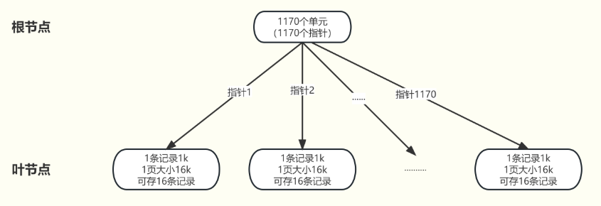

# MySQL

- [MySQL](#mysql)
  - [基础](#基础)
    - [SQL vs. NoSQL](#sql-vs-nosql)
      - [ACID vs. BASE](#acid-vs-base)
    - [数据库的三大范式](#数据库的三大范式)
    - [char vs. varchar](#char-vs-varchar)
    - [常用函数](#常用函数)
    - [一条select语句是如何执行的 ☆](#一条select语句是如何执行的-)
    - [一条update是怎么执行的](#一条update是怎么执行的)
    - [讲讲mysql的存储引擎](#讲讲mysql的存储引擎)
      - [InnoDB vs. MyISAM](#innodb-vs-myisam)
  - [索引](#索引)
    - [索引是什么 有什么优缺点 ☆](#索引是什么-有什么优缺点-)
      - [按物理存储分类](#按物理存储分类)
      - [按数据结构分类](#按数据结构分类)
        - [为什么MySQL InnoDB选择B+tree作为索引的数据结构？ ☆](#为什么mysql-innodb选择btree作为索引的数据结构-)
      - [从字段特特性分类](#从字段特特性分类)
      - [按字段个数分类](#按字段个数分类)
        - [联合索引使用原则](#联合索引使用原则)
    - [索引下推优化 (Index Condition Pushdown)](#索引下推优化-index-condition-pushdown)
    - [什么时候需要创建索引 ☆](#什么时候需要创建索引-)
    - [什么时候不需要创建索引 ☆](#什么时候不需要创建索引-)
    - [什么时候索引失效 ☆](#什么时候索引失效-)
    - [有什么优化索引的方法](#有什么优化索引的方法)
  - [事务](#事务)
    - [事务的四大特性 ACID ☆](#事务的四大特性-acid-)
      - [InnoDB引擎通过什么技术保证这四个特性的？](#innodb引擎通过什么技术保证这四个特性的)
    - [并行(发)事务会引发什么问题 ☆](#并行发事务会引发什么问题-)
    - [事务隔离级别 ☆](#事务隔离级别-)
      - [事务隔离级别是如何实现的](#事务隔离级别是如何实现的)
    - [MySQL是如何解决并发问题的](#mysql是如何解决并发问题的)
    - [MVCC实现原理](#mvcc实现原理)
      - [什么是版本链](#什么是版本链)
      - [什么是readview](#什么是readview)
      - [版本链数据访问规则](#版本链数据访问规则)
  - [日志](#日志)
    - [日志文件分类](#日志文件分类)
    - [undo log作用](#undo-log作用)
      - [实现事务回滚, 保障事务原子性](#实现事务回滚-保障事务原子性)
      - [实现MVCC的关键因素](#实现mvcc的关键因素)
    - [BufferPool是什么](#bufferpool是什么)
    - [Redo log作用](#redo-log作用)
      - [undo log vs. redo log](#undo-log-vs-redo-log)
      - [binlog作用](#binlog作用)
        - [binlog vs. redolog](#binlog-vs-redolog)
      - [两阶段提交](#两阶段提交)
  - [SQL优化](#sql优化)
    - [慢SQL](#慢sql)
      - [先定位慢SQL](#先定位慢sql)
    - [explain执行计划](#explain执行计划)
    - [SQL调优](#sql调优)
    - [SQL注入](#sql注入)
  - [架构](#架构)
    - [分库和分表是什么](#分库和分表是什么)
  - [锁](#锁)
    - [锁分类](#锁分类)
      - [InnoDB行级锁的实现](#innodb行级锁的实现)
      - [乐观锁 vs. 悲观锁](#乐观锁-vs-悲观锁)

TODO: https://xiaolincoding.com/interview/mysql.html#sql%E5%9F%BA%E7%A1%80
* 读写分离
* 一条update语句是如何执行的（各种log看看，xiaolin
* sql优化（join

MySQL核心：

* 索引（聚簇, 非聚簇, B+ Tree, 最左匹配）
* 事务（MVCC, ReadView, 隔离级别, 间隙锁）
* 日志（undo, redo, binlog）

## 基础

### SQL vs. NoSQL

SQL(structured query language): 关系型数据库, 存储结构化数据, 这些数据逻辑上以行列二维表的形式存在，每一列代表数据的一种属性，每一行代表一个数据实体, eg SQL Server, Oracle, MySQL, PostgreSQL

NoSQL (Non-SQL): 非关系型数据库, 存储方式可以是JSON文档、哈希表或者其他方式, eg Redis, MongoDB

#### ACID vs. BASE

**选择SQL还是NoSQL?**

关系型数据库支持ACID (原子性，一致性，隔离性和持续性)。相对而言，NoSQL采用更宽松的模型BASE， 即基本可用(Basically Available)，软状态(Soft stat)和最终一致性(Eventual Consistency)
> BASE详见`microService.md`

* 选择哪种模型取决于应用的具体需求。**ACID适合需要严格数据一致性的场景**，而**BASE则适合需要高可用性和扩展性的场景**。
  * **NoSQL数据之间无关系，所以很容易扩展**，比如redis自带主从复制模式、哨兵模式、切片集群模式
  * 相反关系型数据库的数据之间存在关联性，水平扩展较难，需要解决跨服务器JOIN，分布式事务等问题
* 比如银行应用就必须保证ACID，否则一笔钱可能被使用两次；又比如社交软件不必保证ACID，因为一条状态的更新对于所有用户读取先后时间有数秒不同并不影响使用。

BASE理论:

核心思想：即使无法做到强一致性Strong Consistency，也可以根据应用特点采用适当的方式来达到最终一致性Eventual consistency的效果（即损失

* **Basically Available(基本可用)**：分布式系统出现故障时，不会完全停止服务，而是**尽量保持核心功能可用**，哪怕是功能降级
* **Soft state(软状态)**：在一定时间内，允许出现中间状态，出现临时的数据不一致状态（差异是暂时的，系统会通过后续操作逐步修正
* **Eventually Consistency (最终一致性)**：虽然无法保证强一致性，但软状态结束之后，最终达成数据一致性（eg 你在朋友圈给人点赞，可能几秒后别人才能看到这个更新

### 数据库的三大范式

<!-- 数据库的三大范式是用于设计**关系型**数据库的规范，旨在**减少数据冗余，提高数据一致性和避免数据异常** -->

* 第一范式 (1NF) ：**数据库表的每一列都是不可分割的原子数据项**
  * eg 用户地址应该拆分成省、市、区、详细信息4个字段
* 第二范式 (2NF): 在满足1NF的条件下，**确保表格的每一列(非主键列)都和主键相关，而不能只与主键的某一部分相关**（主要针对**联合主键**而言）
  * {width=80%}
  * 所以需要分为俩表格
* 第三范式 (3NF): 满足1NF和2NF条件下，**确保表格每一列(非主键列)直接依赖主键，不应依赖于其他非主键列**
  * {width=80%}

> 实际开发过程中，三大范式有时候反而成为了老太婆的裹脚布，让表的设计变得复杂而又啰嗦

### char vs. varchar

* char: 固定长度字符串，定义时需指定固定长度，**存储时会在末尾补足空格**。适合存储长度固定的数据，对于短字符串效率较高
  * 因为长度固定，所以存取速度要比varchar快很多，甚至能快50%，但会占据多余的空间，空间换时间
  * 最多能存放255个字符，和编码无关
* varchar: 可变长度字符串，定义时需要指定**最大长度**，**实际存储时根据实际长度占用存储空间**。适合存储长度可变的数据，节约存储空间
  * 存取慢，不占据多余的空间，时间换空间
  * 最多能存放65532个字符

<!-- ### 关键字 in vs. exists

IN和EXISTS都是用来处理子查询的关键词

* in用于检查左边的表达式**是否存在于**右边的**列表**或**子查询的结果集**中。返回true/false
* exists用于**判断子查询是否至少能返回一行数据**。它不关心子查询返回什么数据，**只关心是否有结果**。如果子查询有结果，返回TRUE

区别与选择：

* **性能差异**：在很多情况下，EXISTS的性能优于IN，特别是**当子查询的表很大时**。这是因为**EXISTS一旦找到匹配项就会立即停止查询，而IN可能会扫描整个子查询结果集**
* **使用场景**：**如果子查询结果集较小且不频繁变动，IN可能更直观易懂**。而当子查询涉及外部查询的每一行判断，并且子查询的效率较高时，EXISTS更为合适 -->

### 常用函数

* 字符串函数
  * concat(s1,s2)
  * length(s)
  * lower(s), upper(s)
  * trim(s): 去掉头尾的空格
  * substring(s, start, len)
* 数值函数
  * ceil(x), floor(x)
  * rand(): return random value in 0-1
  * round(x,y): 四舍五入 y位小数
  * abs(x)
* 日期函数
  * curdate(): 返回date
  * curtime()
  * now(): 返回date和time
  * year(date), month(date), day(date)
  * datediff(date1, date2)
* 聚合函数
  * count(column): 计算指定列的非null值个数
  * sum(column), avg(c), max(c), min(c)

### 一条select语句是如何执行的 ☆

`select * from product where id = 1;`

{width=80%}

MySQL架构可分：Server层和存储引擎层两部分

* Server层：负责**建立连接、分析和执行SQL**。MySQL大多数的核心功能模块都在这实现
* 存储引擎层：负责**数据的存储和提取**。支持 InnoDB、MyISAM、Memory等多个存储引擎，**不同存储引擎共用一个Server层**。MySQL5.5开始，InnoDB成为了MySQL的默认存储引擎
  * 存储引擎层既包括位于内存中的BufferPool，又涉及到位于磁盘上的实际数据

---

<!-- 0. 客户端发送查询: eg `select * from user;`，该语句发送到mysql服务器 -->
1. **连接器**：负责和客户端建立连接、权限验证(验证用户名和密码)、维持和管理连接
   1. mysql基于TCP，需要三次握手，客户端通过ip+port(3306)来连接mysql服务器：`mysql -h $ip -u $user -p`
2. **查询缓存**：mysql拿到一个查询select请求后，会先到查询缓存(query cache)看看是否执行过这条语句，命中的话直接返回结果。之前执行过的select语句及其结果会以key-value的形式缓存在**内存**中，key为SQL查询语句，value为查询结果。
   1. > 所谓transformer的key value query来源
   2. 但其实查询缓存很**鸡肋**，命中率很低，mysql8.0之后**删掉**了查询缓存。
3. **解析器**：你输入的是字符串+空格组成的sql，mysql需要识别出里面的字符串分别是什么，代表什么；**词法分析**会识别出字符串中的关键字(eg, select, from...)（拆成token）；**语法分析**会判断sql语句是否满足mysql语法，然后形成**解析树**
4. **预处理器**：检查表和字段是否存在，以及将`select *`中的`*`扩展为表上的所有列(ok 有点像C语言的预处理指令)
5. **优化器**：基于查询成本的考虑，选择查询成本最小的**执行方案**；比如在表里面有多个索引的时候，优化器会基于查询成本的考虑，来决定选择使用哪个索引。或者在一个语句中有多表关联(join)时，决定各表的连接顺序
   1. > 通过explain命令查询SQL语句的**执行计划**
6. **执行器**：根据执行计划执行SQL查询语句，从存储引擎读取记录，返回给客户端

### 一条update是怎么执行的

1. 客户端发送查询: `update user set age = 18 where id = 1;`，该string通过tcp/ip发送到mysql服务器的3306端口
2. 连接器：验证用户身份
3. 解析器：解析sql为token，生成解析树
4. 预处理器：检查表和字段是否存在
5. 优化器：查询优化
6. **进入存储引擎(innoDB)**
   1. 通过主键索引找到`id=1`的行
   2. wal(redo log->undolog)
   3. 改内存
   4. ...

> 很不完备的答案，回头再看看

### 讲讲mysql的存储引擎

* InnoDB：MySQL的默认存储引擎，提供了**对事务ACID的支持**、**行级锁、外键约束**等特性。它适用于高并发的读写操作，支持较好的数据完整性和并发控制
* MyISAM：老默认存储引擎，具有**较低的存储空间和内存消耗**。MyISAM**不支持事务、行级锁和外键约束**，因此在并发写入和数据完整性方面有一定的限制
* Memory：将数据**存储在内存中**，适用于对性能要求较高的读操作，但是在服务器重启或崩溃时数据会丢失。它也不支持事务、行级锁和外键约束

#### InnoDB vs. MyISAM

> 早期mysql用的是MyISAM，现改为InnoDB

* **事务**：InnoDB支持事务，符合ACID特性，MyISAM不支持事务
* **锁粒度**：InnoDB最小的锁粒度是**行锁**，并发性能更高，MyISAM最小的锁粒度是**表锁**
* **外键支持**：MyISAM不支持外键
* **索引结构**：InnoDB采用聚集索引，数据和索引存在一起，主键索引的叶子节点包含数据行，查询效率高；MyISAM采用非聚集索引，**数据和索引分开存储**，叶子结点仅保存数据文件的指针，需要额外的查找
* **表的行数**：InnoDB不保存表的具体行数，执行`select count(*) from table`时需要全表扫描。**MyISAM保存表的行数**，执行上述语句时只需要读出该变量即可直接返回，速度**很快**

<!-- ### MySQL一行记录是怎么存储的 (额外信息 + 真实数据)

> first: 记录是按照row行存储在磁盘中的，数据库的读取是按照page页为单位读取的(不然总不能每读一行一次磁盘io吧，和分页存储原理一致)，一页16KB，即一次**最少**从磁盘读取16KB内容到内存，或者**最少**把16KB刷新到磁盘。
> > 基本单位是页，但没说一次只能读取一页奥...

   -->

<!-- #### 记录的额外信息

* **变长字段长度列表**：存储变长字段(eg varchar类型字段)的实际数据**长度**
* **NULL值列表**：每一个允许为NULL的列对应着一个bit，1表示该列为null，0非null
* **记录头信息**
  * **delete_mask**：标识此条数据是否被删除。我们执行detele删除记录的时候，并不会真正的删除记录，只是将这个记录的delete_mask标记为1
  * **next_record**：下一条记录的位置。记录与记录之间是通过链表组织的
  * record_type：当前记录的类型

#### 记录的真实数据

三个隐藏字段：

* row_id: 如果既没有指定主键，又没有唯一约束，那么InnoDB就会为记录添加row_id隐藏字段作为**主键约束**; (非必需，6B)
* trx_id: 表示最近操作该记录的事务id(transaction_id); (必需，6B)
* roll_pointer: 这条记录上一个版本的指针；每次修改某条记录时，都会把旧的版本写入到undolog中，然后这个隐藏列相当于一个指针，可以通过它找到该记录修改前的信息；roll_pointer是必需的，占用7个字节。（见MVCC） -->

## 索引

### 索引是什么 有什么优缺点 ☆

索引就是数据的目录，帮助存储引擎快速获取数据，空间换时间。

没有索引的话，数据库会进行**全表扫描(Sequential Scan)**，也即必须读取表中每一行数据来查找匹配的行(O(n))，上B+树索引之后是O(log(n))

> eg `select * from user where age = 18;` 全表扫描就是自顶向下逐一扫描age列，B+Tree是我们给age列建立一个B+Tree，然后你搜索18就快的多了 

* 优点
  * 提高查询效率以及排序效率
* 缺点（问题不大）
  * 索引占用磁盘存储空间 (数据和索引都存在磁盘文件.idb中)
  * 虽然大大提升了查询效率，但是**降低了增删改的效率**
    * > 因为除了更新数据外还要更新索引嘛，还有索引节点页分裂等问题（即**维护成本**


---

**总论：**

* 每个表都**必须有且只有**一个**主键索引/聚集索引**(clustered index), (选取规则：主键-> 第一个唯一(unique)且非空的索引 -> 自动生成一个隐式自增row_id列作为索引键)
* 其他索引都叫做**辅助索引/二级索引**(secondary index)。
* InnoDB所有索引都默认使用B+Tree索引。

==**核心**==：**聚簇索引的叶子结点的值是主键对应的这一整行数据，而辅助索引的叶子节点的值是主键，便于下一次回表查询**。
> 你也可以在辅助索引中添加更多字段来避免回表查询：借助**联合索引**，在索引处加上你需要的字段，注意叶子结点的值仍然是主键，这个是不能更改的。（此即**覆盖索引优化**(参考索引优化方法章节)

比如有这么一张表格：
{width=60%}

  
如果执行: `select * from product where id = 5;`, 通过主键索引查询id=5的商品信息，会从B+Tree自顶而下查询，先对比5和(1,10,20)，遂进入二层1列，与(1,4,7)对比，遂进入三层二列，然后在叶子结点中继续遍历找到5，即可拿到id=5的员工的所有信息

  

如果执行: `select * from product where product_no = 0002`, 通过二级索引查询商品信息，类似地，一路对比非叶子找到叶子结点，然后**只能拿到主键值**，此时需要**通过主键索引的B+Tree**查询主键值对应的完整用户信息(整行数据)，此过程谓之**回表查询**，即需要查**两个B+Tree**才拿到结果。

但如果你查询: `select id from product where product_no = 0002`, 通过二级索引查用户id，这可以直接从二级索引的叶子拿到结果，就无需回表查询了，此过程谓之**覆盖索引**，即**通过二级B+Tree就能查到结果**。

> 总结：所以查询一般有三种情况：直接走聚集索引B+Tree(根据主键查询 where id = *)；直接走二级索引B+Tree(覆盖索引 / 查询**只在**二级索引存储的字段)；先走二级索引B+Tree再走聚集索引B+Tree(回表查询 / 查询的字段**不完全在**二级索引中)

#### 按物理存储分类

* 聚集索引(主键索引)
* 二级索引(辅助索引)

#### 按数据结构分类

B+树索引：
数据库的**索引和数据都是存储在硬盘**的，所以每次读取一个索引节点需要一次磁盘io。B+Tree相比于B树和二叉树来说，最大的优势在于查询效率很高，因为即使在数据量很大的情况，查询一个数据的磁盘I/O依然维持在3-4次(包括读数据那一次)。
> 一个索引节点对应磁盘中的一个数据页(about 16KB)，意味着上下层索引节点位于两个数据页，意味着需要两次磁盘IO
> 主键索引中索引节点存放的是主键，按递增顺序存放，其他非主键字段索引的索引节点存的就是对应字段的数据，同样按序存放
> 树高为2大概可以存储1.8条记录，树高为3大概是2200w条。

推理过程：
> 磁盘一个数据页16KB -> 指针大小6B, 索引key大小8B -> 16KB/14B=1170个指针（**==故一个非叶节点可以容纳大约1170个指针==**） -> 假设两层B+树，叶子结点16KB,假设每行**数据记录**1KB，那每个叶子可以存16条记录 -> 两层B+树能存 1170*16 = ~1.8w条记录
>   


* B+树（多路平衡搜索树）特点：
  * 一个节点有多个子节点（多路）-> 所以树比较**矮胖**
  * 非叶子不保存数据，只作为索引；所有key都会出现在叶子中
  * 叶子按照从小到大排序，形成双向链表

B+树中**每个节点都是一个数据页**，只有叶子才存放了数据，非叶子值存放目录项作为索引。

##### 为什么MySQL InnoDB选择B+tree作为索引的数据结构？ ☆

* B+Tree vs. B Tree
  * B+树非叶子只存储索引而B树存索引和数据。所以B+能存储的索引数目也就更多，所以B+树更加**矮胖**，进而磁盘io次数就比较少。
  * B+Tree叶子采用双向链表连接，适合mysql中的**范围查找**，B Tree做不到
  * B+树增删效率更高：**B+树有大量冗余节点**，删除一个节点的时候，**可以直接从叶子节点中删除**，甚至可以不动非叶子节点，删除非常快。B+树的插入也是一样，有冗余节点，插入可能存在节点的分裂（如果节点饱和），但是最多只涉及树的一条路径。B树没有冗余节点，删除节点的时候非常复杂，可能涉及复杂的树的变形。（一言以蔽之：**B+树的分裂与合并相比B树更为简单**
* B+Tree vs. 二叉树
  * n个节点m叉树树高是$O(log_m^n)$，二叉树m=2，B+树一般m>100, 所以显然B+树是更加矮胖的，树高就代表着磁盘io次数。(==索引和数据存在磁盘中==)
* B+Tree vs. Hash表
  * Hash非常适合等值查询(O(1)搜索复杂度)，但并不适合范围查询。
  * 无法利用索引进行排序操作
* B+Tree vs. 红黑树
  * B+Tree每个节点可以存多个**关键字**，而RBTree每个节点只能存一个关键字，故而RBTree太tm高了，故而pass
    * **RBTree是一种二叉树**(设计上就是如此)，所以每个节点只能有2个孩子最多，故而一个节点只能存一个关键字；B+Tree是m叉，故而可以存m个吧

#### 从字段特特性分类

* **主键索引**：建立在主键字段上的索引，唯一非空，默认创建 (PRIMARY)
* **唯一索引**：建立在unique字段上的索引，唯一，可为null (UNIQUE)
* **普通索引**：建立在普通字段上的索引，可不唯一，可为null
* **前缀索引**：对字符类型字段的前几个前缀字符建立的索引，而不是在整个字段上建立的索引，可以缩小索引占据的磁盘空间，提高查询效率
* **全文索引**：跟elasticsearch类似吧，基于**倒排索引**实现。目的是在大量文本数据中快速查找信息
  * ie Ful-Text Index: 针对文本搜索 （eg `LIKE '%keyword'`'`

```sql
-- 创建普通索引
create index index_name on table_name(column_name) 
-- 创建唯一索引
create unique index index_name on table_name(column_name) 
-- 创建全文索引
create fulltext index index_name on table_name(column_name) 
-- 创建前缀索引 (提取前n个字符构建索引)
create index index_name on table_name (column_name(n))
```

#### 按字段个数分类

* 单列索引
* **联合索引**：通过将多个字段组合成一个索引。即在B+树中采用多个字段的值作为key值，比较时**先后比较**多个key。（**前面的key是全局有序的**，后面的key是在前面key相同时才有序，即**局部相对有序**）

```sql
-- 创建联合索引：索引字段(product_no, name)
CREATE INDEX index_product_no_name ON product(product_no, name)
```

> 在业务场景中，如果存在多个查询条件，考虑针对于查询字段建立索引时，建议建立联合索引， 而非单列索引。

{width=80%}

{width=80%}

---

##### 联合索引使用原则

1.联合索引遵循**最左前缀法则**：查询从索引的最左列开始(必须存在，但未必需要放在第一位)，并且不跳过索引中的字段。

* **如果不从最左列开始，联合索引完全失效**
* 如果从最左开始，但**跳过中间某列，则后面的字段失效**（部分失效）
* 多个字段顺序是可以改变的

2.联合索引**范围查询**中规则：出现范围查询(> or <)，范围查询右侧的列索引失效。
> * 改成>=就行了（如果业务允许的话
> * `>=, <=, between and(>= <=), like(也存在闭区间)`不会停止匹配
> * `select * from t_table where a > 1 and b = 2`: 符合a>1的记录肯定是相邻的(因为先按a排序嘛)，然后找到a>1的所有记录范围之后，b字段的值是无序的，所以不能b=2这个b字段就没用到联合索引
> * `select * from t_table where a >= 1 and b = 2`: 虽然在符合a>=1条件的二级索引记录的范围里，b字段的值是无序的，但是对于符合a=1的二级索引记录的范围里，b字段的值是。所以a=1时b字段可以用到联合索引。
>   * 但不鸡肋吗，大部分情况(>=1)仍然没用

### 索引下推优化 (Index Condition Pushdown)

* 传统索引扫描：在没有ICP的情况下，MySQL存储引擎**使用索引**查找满足索引条件的记录，然后**从表中读取完整的行数据**返回给MySQL Server，MySQL Server **==再对==其他非索引条件进行过滤**。这意味着MySQL可能需要从表中读取大量数据，即使其中有很多不满足查询条件
* 启用 ICP：当ICP被启用时，MySQL存储引擎会**在使用索引扫描数据的同时，尽可能地应用额外的查询条件（非索引条件(即联合索引中索引失效的字段)）(由MySQL Server==下推==给存储引擎的部分条件)**。即在索引扫描阶段，MySQL就可以排除不满足非索引条件的记录，从而减少需要从磁盘中读取的数据量。这种方式减少了不必要的I/O操作，提高了查询效率

  

{width=70%}


### 什么时候需要创建索引 ☆

* **表的主键**：自动建立索引
* **频繁作为查询条件的字段**：经常出现在WHERE子句中的字段，创建索引可加快查询
* **排序和分组字段**：如果查询中经常对某些字段进行排序（ORDER BY）或分组（GROUP BY），为这些字段创建索引可以大大提高排序速度（因为建立索引之后在B+树中的记录已经排好序，查询的时候不用再次排序）
* **查询中与其他表关联的字段**：在多表连接查询中，外键关系的字段应该创建索引，以提高连接查询的效率
<!-- * **大表中的关键列**：在大表中，如果查询的效率变得很低，可以考虑在关键列上创建索引 -->

### 什么时候不需要创建索引 ☆

* **不用于查询条件的字段**：WHERE 条件，GROUP BY，ORDER BY 里用不到的字段，索引的价值是快速定位，如果起不到定位的字段通常是不需要创建索引的，因为索引是会占用物理空间的
* **小表**：对小表创建索引可能会带来额外的开销，因为**在小数据集中扫描整个表可能比使用索引更快**
* **高频更新表**：如果表中数据频繁更新、插入或删除，维护索引会带来额外的开销。这些操作需要额外的资源来保持索引结构的更新和完整。
* **低选择性列 / 重复值较高列**：选择性低的列（即具有大量重复值的列），如性别、布尔值等，使用索引通常无助于性能提升，因为索引**树的深度很浅**，查找效率接近于全表扫描

### 什么时候索引失效 ☆

* 不要在索引列上进行**使用函数**或者**表达式计算**，索引将失效（如substring, length, +1, -1）
  * **因为索引存的是索引字段的原始值**，而非经函数计算后的值，故而.
* **最左前缀法则**：对于联合索引，查询条件必须遵循最左前缀原则。如果查询条件未使用联合索引的最左侧字段，则索引将失效
* **使用LIKE关键字**：模糊匹配中，如果仅仅是尾部模糊匹配，索引不失效，但如果是头部模糊，索引失效(`like %xxx`, `like %xx%`会失效)
  * 因为%代表任意长度的字符串，以%开头时，mysql必须从第一条记录逐个进行匹配，无法利用索引的有序性。而以%结尾时，可以利用索引找到%前面的字符串
* **用or连接条件时，只有两侧都使用索引时才有效，一侧没有就失效**
* **隐式类型转换**：MySQL 在遇到字符串和数字比较的时候，会自动把字符串转为数字，然后再进行比较。如果字符串是索引列，而条件语句中的输入参数是数字的话，那么索引列会发生隐式类型转换，由于隐式类型转换是通过**CAST函数**实现的，等同于对索引列使用了函数，所以就会导致索引失效
* 如果mysql认为使用索引比全表更慢，则不用索引；（受该字段的数据分布影响，很智能）

### 有什么优化索引的方法

* **前缀索引优化**：减小索引字段大小，可以增加一个索引页中存储的索引值，有效提高索引的查询速度
* **覆盖索引优化**：覆盖索引是指SQL中 query 的所有字段，在索引B+Tree的叶子节点上都能找得到的那些索引，从二级索引中查询得到记录，而不需要通过聚簇索引查询获得，可以避免回表的操作
  * **实际上是通过联合索引来实现的**，是将你需要的字段放到联合索引内，而非放到叶子结点的值（值只存主键）
* **主键索引最好是自增的(auto_increment)**：如果使用自增主键，那么每次插入的新数据就**会按顺序添加**到当前索引节点的位置，**不需要移动已有的数据**（如果逐渐是uuid或者随机数这种非递增数字，那插入数据的时候就要重新组织结果（eg 分裂页面）
<!-- * ，当页面写满，就会自动开辟一个新页面 -->
* **防止索引失效**


## 事务

事务是**一组操作的集合**，它是一个不可分割的工作单位，事务会把所有的操作作为一个整体一起向系统提交或撤销操作请求，即这些操作要么同时成功，要么同时失败

```sql
# 手动控制事务方法（显式开启事务）[推荐]
start transaction; -- 开启事务 或者begin
-- 事务操作
commit; -- 提交
rollback; -- 回滚
```

  

为什么要有事务这玩意儿？
主要可以说是：为了保证一串操作命令要么同成功同失败，确保不会部分成功部分失败；确保错误或崩溃时，可以恢复数据

### 事务的四大特性 ACID ☆

实现事务必需遵守ACID四个特性

* **原子性**（Atomicity`[ˌætəˈmɪsəti]`）：事务是不可分割的最小操作单元，一个事务中的所有操作要么全部完成，要么全部不完成，不会结束在中间某个环节，如出现错误就回滚(undo log)
* **(强)一致性**（Consistency）：一个事务执行之前和执行之后都始终处于一致性状态。比如a与b账户共有1000块，两人之间转账过程中可能暂时处于不一致状态，但事务提交时必须保证它们的账户总和还是1000
  * BASE要求最终一致性：尽管系统可能在某些时刻不一致，但经过一段时间后，所有结点的数据将达到一致性。（允许系统在网络延迟或故障时仍能正常运行）
* **隔离性**（Isolation）：允许多个并发的事务同时对数据修改和读取，执行互不干扰，防止多个事务并发执行时造成数据不一致的情况。(事务隔离级别/MVCC/锁机制)
* **持久性**（Durability`[ˌdjʊərəˈbɪləti]`）：事务一旦提交或回滚，它**对数据库中的数据的改变就是永久**的，确保了即使在系统崩溃或故障的情况下，已提交的事务所做的修改也不会丢失(redo log)
  * undo log是在事务提交之前存储更新前的数据的，用于回滚；redolog用于保证持久性

#### InnoDB引擎通过什么技术保证这四个特性的？

* 原子性：undo log (回滚日志)
* 持久性：redo log (重做日志)
* 隔离性：**事务隔离级别** 和 锁机制 (行级锁 / MVCC) 
  <!-- * (行锁允许多个事务并发执行而不会相互干扰) -->
* 一致性：持久性 + 原子性 + 隔离性

### 并行(发)事务会引发什么问题 ☆

多个并发事务同时操作某数据库/表所引发的问题

* **赃读 (dirty read)/问题最严重**：一个事务A读到另一个事务B还**未提交**的数据；如果事务B后来回滚，事务A读到的数据就是无效的脏数据，这可能导致事务A基于不存在的数据做出错误的决策。
* **不可重复读 (non-repeatable read)**：**同一事务**先后读取同一个数据结果不一致*或被删除了*;
  * 事务A多次读取同一数据，在A读取过程中，事务B修改并提交了该数据
  * update或**delete**引起
* **幻读 (phantom read`[ˈfæntəm]`)**：在同一事务中执行相同的查询时，结果集出现了**原本不存在的数据**；原因是另一事务在查询范围内insert了新纪录
  * 幻读与insert相关，**delete是不可重复读**
  * 即幻读的重点在于新增操作,而不是修改或删除现有数据


<!-- >忽略：所以“不可重复读”和“幻读”都是读的过程中**数据前后不一致**，只是**前者侧重于修改和删除，后者侧重于添加**（数据操作不同）。前者侧重于**单个数据项**，后者侧重于**一批数据**（影响范围不同）。所以可以说严格来讲“幻读”可以被称为“不可重复读”的一种特殊情况。但是从数据库管理的角度来看二者是有区别的。解决“不可重复读”只要加行级锁就可以了。而解决“幻读”则需要加表级锁，或者采用其他更复杂的技术，总之代价要大许多。这是搞数据库的那帮家伙非要把这两者区分开的动机吧。
[reference](https://www.zhihu.com/question/392569386/answer/1434210648) -->

### 事务隔离级别 ☆

> 事务隔离级别的实现依赖于锁机制和MVCC

由于多个事务并发执行可能出现脏读、不可重复读、幻读的问题，为了解决这些问题，就诞生了隔离级别的概念

* **读未提交RU(Read Uncommitted)**: 一个事务还没提交时，它做出的变更就能被其他事务看到，即引起脏读
  * 可能出现脏读、不可重复读、幻读
* **读已提交RC(Read Committed)**: 一个事务提交之后，该变更才能被其他事务看到
  * 避免了脏读，可能出现不可重复读和幻读
* **可重复读RR(Repeatable Read) (default)**: 确保在同一个事务中多次读取相同记录的结果是一致的，即使其他事务对修改了该条记录，也不影响当前事务
  * 避免了脏读和不可重复读，可能幻读
* **串行化S(Serializable)**: 读操作在数据上加**共享锁**，写操作在数据上加**排他锁**
  * 简而言之：读的时候拿一个共享锁，要知道**锁都是在事务结束时才释放**，所以这个事务内就不允许写，因为读写互斥，但是你可以在该事务内多次查询，结果当然一样了
  * **隔离水平最高，最安全，效率最低(大量的锁竞争以及超时问题)**
  <!-- * > mysql中表锁和行锁都支持读写锁 -->

#### 事务隔离级别是如何实现的

* 读未提交：因为可以读到未提交事务修改的数据，所以直接读取最新的数据就好了，不加任何锁
* 读已提交：**在每次select读时**都生成一个新的**readview**, 可以 **==确保事务只读到已经提交的数据==**，所以可以解决脏读，但同一事务内可能读到不同结果，所以还有不可重复读问题
* 可重复读：==**在启动事务时**生成一个readview，然后**整个事务期间都用这个readview**==
* 串行化：加**读写锁**（见上文

### MySQL是如何解决并发问题的

* **事务隔离级别**：通过设置合适的事务隔离级别，可以在多个事务并发执行时，**控制事务之间的隔离程度**，以避免数据不一致的问题
* **锁机制**：Mysql提供了多种锁机制来保证数据的一致性，包括行级锁、表级锁、页级锁等。通过锁机制，可以在读写操作时对数据进行加锁，**确保同时只有一个操作能够访问或修改数据**
* **MVCC**：通过**保存不同版本的数据来实现不同事务之间的隔离**。在读取数据时，Mysql会根据事务的隔离级别来选择合适的数据版本，从而保证数据的一致性

### MVCC实现原理

**基本原理：**

MVCC即多版本并发控制（Multi-Version Concurrency Control）

* **MVCC目的在于减少锁的使用，提高并发性能**
  * 传统的锁机制：**当一个事务正在写数据时，其他事务必须等待其完成才能读数据**（eg 串行化
* MVCC核心思想：**为每个数据行维护多个版本**。当数据被修改时，**保存该数据的旧版本，并创建一个新的版本**。这样，读操作就可以访问到某特定时间点的数据快照，而**无需等待写操作完成**
* **MVCC依赖的组件：undo log, readview, 隐藏字段/版本链**

**Q: MVCC解决了什么问题?**

* **无锁并发读取**：读不用加锁
  * **==mysql默认的select操作是快照读==**，即select在不加锁的情况下，会读快照，而非当前正在被其他事务修改的数据；**==显著提升并发性能，因为读写不会互相阻塞嘛==**
* **==读写不会相互阻塞，显著提升并发性能==**（读写锁那可就不行了
* **解决一些常见的事务隔离问题**，如脏读、不可重复读等，但它不能解决幻读问题（需要读写锁

#### 什么是版本链

我们之前有说mysql一条记录 = 记录的额外信息 + 记录的真实数据（数据 + row_id + trx_id + roll_ptr）

* **trx_id**: 当一个事务改动某记录时，就会把该事务的事务id记录在trx_id隐藏列里
* **roll_ptr**: 每次改动某记录时，都会**把旧版本的记录写入到undo log中**，然后将这个**roll_ptr指针指向每一个旧版本记录**，于是就可以通过它找到修改前的记录

> 这俩隐藏列构成**版本链**

{width=70%}

版本链 [image visualization link](https://cdn.tobebetterjavaer.com/tobebetterjavaer/images/sidebar/sanfene/mysql-765b3d83-14eb-4b56-8940-9d60bfaf1737.jpg)


#### 什么是readview

答：**数据快照**

> readview是实现MVCC的关键组件

readview主要用来处理 读已提交 和 可重复读 隔离级别，为了实现一致性读而创建的数据结构

{width=60%}
> 可以理解为：横轴上这么多事务id，都是对某一字段的

**当事务开始执行时，InnoDB会为该事务创建一个readview**，这个readview会记录四个重要信息：

* `creator_trx_id`：创建该ReadView的事务id
* `m_ids`：在创建Read View时，数据库中**活跃事务的id列表**，“活跃事务”指开始了但还没提交的事务
* `min_trx_id`：**最小活跃事务id**，表示最早的活跃事务id
* `max_trx_id`：**下一个事务将要使用的id**，即当前最大事务id+1（**事务id是自增的**）

#### 版本链数据访问规则

当一个事务(trx_id)去访问某条数据时，InnoDB会根据**readview中的信息**来判断该数据的**某个版本**是否可见：

<!-- * `if trx_id == creator_trx_id`: 说明该版本是当前事务自己创建的，当然可以访问咯   -->
* `if trx_id < min_trx_id`: 说明该版本是在创建ReadView前**已经提交**的事务生成的，可以访问
  * 即如果某个数据版本的DB_TRX_ID小于readview的min_trx_id
* `if trx_id >= max_trx_id`: 说明该版本是在当前事务创建之后才开始的，不可访问
* `if (min_trx_id < trx_id < max_trx_id)`: 需要判断trx_id是否在活跃事务列表m_ids列表中，如不在，说明该版本已经提交可以访问。如在，说明该事务还活跃（启动了还没提交），不可访问

## 日志

### 日志文件分类

* **undo log (回滚日志)**，Innodb存储引擎层生成的日志，实现了事务中的**原子性**，主要 **==用于事务回滚和MVCC==**。
* **redo log (重做日志)**，Innodb存储引擎层生成的日志，用于实现事务的**持久性**，ie 事务提交之后到数据持久化到磁盘期间，如果mysql服务挂掉，可以通过redolog进行恢复，**确保你事务提交的数据一定会持久化到磁盘中**（WAL技术）
* **bin log (二进制日志/归档日志)**，**Server层**生成的日志，一般记录的是逻辑修改，主要用于**数据备份和主从复制**；
<!-- * relay log (中继日志)：略 -->

### undo log作用

> 执行一条update语句时会涉及到undo log, redo log, bin log三种日志

#### 实现事务回滚, 保障事务原子性

* undo log用于撤销回退，它保证了事务的**原子性（Atomicity**）：一串操作要么全部执行成功要么全部失败
* 执行事务中的**增删改**操作时，会同时把回滚需要的信息记录到undo log中，如果需要回滚事务，就可以基于undo log进行
  * 在**插入**一条记录时，记录这条**记录的主键**，回滚时只需要把这个主键值对应的**记录删掉**
  * 在**删除**一条记录时，把这条**记录中的内容都记下来**，回滚时把这条记录插入回去
  * 在**更新**一条记录时，把**被更新的列的旧值记下来**，回滚时再把这些列**更新为旧值**


{width=30%}


#### 实现MVCC的关键因素

undo log还有一个作用，**通过ReadView + undo log实现 MVCC（多版本并发控制）**

### BufferPool是什么

* mysql数据存在磁盘上，从磁盘读数据很慢。所以mysql**将经常访问的数据缓存在内存中的BufferPool中**（这很redis...
  * 读更快：如果数据在BufferPool中，客户端直接从中读取；否则，从磁盘读取。
  * **==写更快==**：如果数据在BufferPool中，直接**修改该页并将其标记为脏页**（表示内存数据与磁盘数据不一致）。为减少磁盘I/O，**脏页不会立即写入磁盘**，而是由后台线程在合适时机异步地进行刷盘

<!-- > BufferPool和Query Cache不同：虽然二者都是mysql的缓存机制。Query Cache则缓存解析后的SQL语句及其结果集(位于server层, **没啥用**)。Buffer Pool主要缓存InnoDB存储引擎的表和索引数据页(**位于存储引擎层, 内存中**, 很重要)。 -->

### Redo log作用

* BufferPool提高了MySQL的读写效率，但可能**数据丢失**，比如在断电或重启时，**未写入磁盘的脏页数据可能会丢失**，所以我们需要WAL技术，在将脏页刷盘之前先写入redo log，并将log刷盘
* **提交事务时，先提交/持久化redo log，不用等脏页的持久化，如果系统崩溃，脏页可能还没持久化，但redo log持久化了**，故言：redo log保证事务持久化。
  * **在事务提交时，只需将Redolog持久化到磁盘**(当然也有一个redo log buffer, 不是每次都写)，而**不必等待脏页数据的持久化**。这种机制**使得事务可以快速提交**，提升了数据库的响应速度
  * 如果系统崩溃，**未持久化的脏页数据可能会丢失，但由于Redo Log已经持久化**，MySQL在重启后可以根据Redo Log的内容将所有数据恢复到最新状态

注意本质：redolog和数据都是要写到磁盘的，何必多此一举？
1. redo log内容比数据页内容少很多
2. redo log是追加写，数据页是随机写，慢得多

<!-- **Redo Log与存入磁盘的实际数据不同**：Redo Log记录的是对单个数据页的具体修改（如某个页的某个偏移量的值被修改为某个值），而实际存入磁盘的数据是完整的数据页。这样，在系统重启或崩溃后，MySQL可以根据Redo Log重建数据，使数据库恢复到崩溃前的状态。 -->
<!-- 而且，写入**redolog是追加，顺序写**，然后写入数据是**随机写**，顺序写比随机写可高效多了，故开销更小 -->

<!-- {width=70%} -->

---

详解WAL技术：

解决办法：==**WAL（Write-Ahead Logging）技术**(写前log，写到Redo log中)==
<!-- > A-head B: 在B操作之前，操作A；即write-ahead: 写前（**强调顺序**） -->
<!-- > A-On B: 在操作B时，操作A；eg CopyOnWrite (**强调触发条件**) -->

1. **更新内存**：当需要更新一条记录时，mysql首先在内存bufferpool中进行修改，并将该页标记为脏页
2. **记录日志**：更新操作以Redo Log的形式记录下来，**==这时更新操作就算完成了==**。Redo Log记录了具体的修改操作，**包括对某个数据页的具体更新位置和内容**(*所谓 物理日志*)
3. **后台刷新**：InnoDB会在适当的时候，由后台线程将BufferPool中的脏页刷新到磁盘，这就是WAL：**先记录日志，再延迟将实际数据写入磁盘**

#### undo log vs. redo log

这两种日志是属于InnoDB存储引擎的日志，它们的区别在于：

* redo log 记录了此次事务**完成后**的数据状态，记录的是**更新之后**的值
* undo log 记录了此次事务**开始前**的数据状态，记录的是**更新之前**的值

**事务提交之前发生了崩溃，重启后会通过undo log回滚事务，事务提交之后发生了崩溃，重启后会通过redo log恢复事务**，故而redo log保证了ACID的持久性

#### binlog作用

* binlog是server层实现的，redo log是innodb存储引擎层实现的
* binlog记录的是逻辑操作（比如statement格式直接记录增删改的**sql语句**），用于**数据备份和主从复制**

---

##### binlog vs. redolog

* 定于/作用不同
  * binlog**记录**对数据库的**逻辑操作**，如增删改等。主要用于**数据恢复、主从复制**。**关注逻辑层面，高层次的数据操作**
  * redo Log：**记录对数据页的物理修改**，确保在系统崩溃时能够恢复未持久化的数据，主要用于**崩溃恢复**。**关注物理层面，具体的页的修改**
* 文件格式不同：`eg: update student set c = 1 where id = 2`
  * binlog有三种格式，statement(default), row, mixed(混合二者)
    * **statement: 记录修改数据的SQL语句（so 逻辑日志）**,即直接记录`update stu...`
    * row: 记录行数据最终被修改成什么样了, 记录`id=2的行在更新后的完整数据`
  * redo log是**物理日志**，记录的是在某个数据页做了什么修改, 比如记录`在页5的偏移10处将值从0更新为1`
* 写入方式不同：
  * binlog 是**追加写**，不会覆盖以前的日志，redo log是**循环写**，日志空间大小是固定，全部写满就擦除从头开始，**保存未被刷入磁盘的脏页日志**

#### 两阶段提交

暂略

## SQL优化

根据慢查询日志定位慢SQL -> 使用explain查看执行计划 -> sql调优

### 慢SQL

#### 先定位慢SQL

**方法一：**
慢SQL：MySQL中`long_query_time`**默认值是10秒**，即执行时间超过10秒的**SQL语句文本**会被记录到**慢查询日志**中(.log文件)
> 默认不开启，在配置文件中手动开启，以及自定义阈值
> **生产环境下超过1s就能算慢的了**

**方法二：**
通过`show profiles`命令查询当前会话中**所有的sql语句的执行耗时情况**，可以分析所有的语句，更强大
此外，通过`show profile for query queryId`命令可以查看指定sql的各个阶段的详细耗时时间（了解一下

### explain执行计划

explain: 查看**查询计划**，可用于分析查询语句的性能瓶颈，找出慢SQL的原因

用法：`explain select * from table where id = 10;`

关注字段：

* `id`: 序列号，表示查询中执行select子句或操作表的顺序（id不同，值越大越先执行；id相同，执行顺序从上到下）（子查询、多表查询场景
* `select_type`: 查询类型
* ==type==: mysql在表中找到所需列的方式（连接类型
  * `NULL`: 性能最高，不查询表格时（笑
  * `system`: 访问系统表
  * `const`: 根据主键或唯一索引进行查询，一般是const
  * `ref`: 根据非唯一性索引查询进行查询时
  * `range`: 用了索引，只检索指定范围的行
  * `index`: **用了索引**，但要扫描遍历整个索引树
  * `all`: **全表扫描**，最慢
* key：实际用到的索引
* `extra`: **附加信息**
  * `using index`: 表示**覆盖索引**，查询的所有列都在索引中，避免了回表查询
  * `using index condition`: **使用索引下推**：server会将额外条件下推给存储引擎，减少磁盘io
  * `using where`: 表示mysql从存储引擎检索数据后，对结果进行了后续过滤（即**没用索引下推**

### SQL调优

1. **避免不必要的列/字段**：不要用`select *`，而是直接指定所需字段，以减少数据传输量
2. 减少子查询：将子查询改为Join，因为子查询
6. **尽量避免全表扫描、排序消耗、分组消耗**，首先应考虑在`where`及`order by`, `group by`涉及的字段列上建立索引
   1. order by的字段如果你创建了索引，ie 搞了棵B+树，树中索引就已经把该字段的数据进行了排序，当你后续order by的时候，直接从B+树索引上读取就行了
   2. 没索引的话，group by需要扫描所有行，然后根据group by字段的值将相同值聚集在一起，还要用到临时表（复杂
7. 进行**索引优化**：前缀索引、**覆盖索引**(减少回表)、主键自增
8. 防止索引失效：eg 避免在索引上做表达式或函数计算，
   1. 当然索引也不是越多越好的（eg 高频更新表）
9. 进行**Join优化**：
   1. **尽量使用JOIN替代子查询**：因为JOIN通常效率更高（子查询往往需要创建临时表）
   2. **小表在前，大表在后**：底层原因：前表的每一行需要加载到内存的join_buffer，io耗时，所以前标越少越好
   <!-- 3. **增加冗余字段**：通过在表中适当增加冗余字段来避免频繁JOIN操作 -->
   <!-- 4. 避免使用JOIN关联太多的表：不超过3张表 -->
10. 进行**分页优化**：（不懂了）
   <!-- 1. 传统分页的问题：首先我们使用`limit`指定返回行数，`offset`指定从哪一行开始查询；当数据量巨大时，数据库需要扫描`offset + limit`数量的行，性能较差 -->
   <!-- 2. 延迟关联和书签可以优化分页...TODO -->
<!-- 8. 进行UNION优化 -->

### SQL注入

* 如果你通过网页获取用户输入的数据，并将其插入到一个mysql数据库，就可能发生sql注入的问题。
* 永远不要信任用户的输入，必须认定用户输入的数据都是不安全的
* 假如有一个简单的登录表单，用户输入用户名和密码：`SELECT * FROM users WHERE username = 'user' AND password = 'pass';`，如果攻击者在用户名字段输入`' OR '1'='1'; --`，则会生成`SELECT * FROM users WHERE username = '' OR '1'='1'; -- AND password = 'pass';`，这直接密码都不用了

**如何防止sql注入？**

1. 使用**参数化查询**：将用户输入**作为参数传递**，而非直接拼接到sql语句中(`PreparedStatement`)
2. 验证用户输入，确保符合预期格式：eg 通过正则表达式检查输入内容
3. 限制数据库用户的权限，确保每个用户只能访问到所需的数据，减少潜在损害

## 架构

<!-- ### 基于binlog实现主从复制

复制的过程就是将 binlog 中的数据从主库传输到从库上（**异步**，不影响主库的操作）
  

具体详细过程如下：

* 主库master在收到客户端提交事务的请求之后，会**先写入binlog**，**再更新数据提交事务**，返回给客户端**操作成功**的响应。
* 从库slave会创建一个专门的**I/O线程**，连接主库的**log dump线程**，来接收主库的binlog日志，再把binlog信息写入**relay log**中继日志里，再返回给主库**复制成功**的响应。
* 从库会创建一个用于**回放binlog**的线程，去读relay log中继日志，然后回放binlog更新存储引擎中的数据，最终实现主从的数据一致性

在完成主从复制之后，你就可以**在写数据时只写主库，在读数据时只读从库**，这样即使写请求会锁表或者锁记录，也不会影响读请求的执行 -->

### 分库和分表是什么

> 阿里Java开发手册建议，当**单表行数超过500万**时，应考虑实施分库分表

分库分表是两个技术：

* **分库**：将**一个数据库中的多个表拆分到不同的数据库**中。分为两种：
  * 垂直分库：按照**业务模块**将不同表拆分到不同的库中，eg 将用户表和订单表分别放在不同的数据库中，以减少单个数据库的负担
  * 水平分库：以列为依据，按照一定的策略（eg hash, range），将**一个库**中的数据拆分到多个库中
* **分表**：在一个数据库中，将一张表拆分为多张表。分为两种：
  * **水平拆分**：按行划分，eg 根据用户ID进行拆分到多个子表。（行就是水平嘛
  * **垂直拆分**：按列划分，eg 将用户表中(**一个表哦**)的用户的基本信息和扩展信息分别存储在不同的表中（不同列字段就是垂直嘛


## 锁

### 锁分类

  

MySQL InnoDB按**锁粒度**可分为：

* **全局锁**：锁定整个数据库的所有表，通常用于**全库逻辑备份**等操作，因为我们想保证备份期间数据不被修改，要能让这个备份可以真实反映这一时刻的真实状态
  * 通过`flush tables with read lock`会将整个数据库设置为**只读**，这时**其他线程如果增删改(DML)或修改表结构(DDL)都会阻塞**
  * `mysqldump -uroot -pxiahao table_name > tmp.sql;` (逻辑备份即**导出为一些sql语句**(创建表+insert语句))
* **表级锁**：锁粒度大，发生**锁冲突概率高**，**并发度最低**，不会出现死锁；`lock tables`
  * **表锁**：`lock tables name read/write;`
    * **读锁**/共享: 读锁会阻塞自己和其他客户端的写，但不阻塞读
    * **写锁**/独占: 写锁会阻塞自己和其他客户端的写和读
  * **元数据锁(MDL)**：对数据库表进行操作时，会**自动**给这个表加上元数据锁，是为了保证当用户对表执行**CRUD操作时，防止其他线程对这个表结构做了变更**
    * 即为了避免DML(增删改)和DDL(定义语言,修改表结构 eg alter)的冲突
    * **原理**：DML会自动对表加共享MDL，DDL会自动加独占MDL，故而DML之间兼容，和DDL就不兼容了
  * **意向锁**：为了避免**行锁与表锁冲突**，**加行锁时会自动顺道加个意向锁，后续加表锁时就可以快速判断了**，使得表锁不用检查每行数据是否加锁，
    * 具体的意向锁也分为意向共享锁和意向排他锁，共享锁和表锁共享锁兼容，和表锁排他锁互斥...
  * ~~**AUTO-INC锁**：用来实现主键自动自增(AUTO_INCREMENT)~~
* **行级锁**：锁定粒度小，发生锁冲突的概率低，**并发度高**
  * InnoDB支持 MyISAM不支持
  * **行锁基于索引**，即对索引上的索引项加锁，而非基于记录；**如果不通过索引字段检索数据**，InnoDB将对表中所有记录加锁，即**升级为表锁**
  * **行级锁分为记录锁、间隙锁和临键锁**
    * 记录锁：直接针对索引记录加锁
    * 间隙锁：防止其他事务在两个记录之间插入新纪录
    * 临键锁：结合二者，用于保护特定记录及其相邻间隙

#### InnoDB行级锁的实现

* **Record Lock 记录锁/行锁**：直接锁定某行记录。当我们使用唯一性的索引(包括唯一索引和聚簇索引)进行等值查询且精准匹配到一条记录时，此时就会直接将这条记录锁定。
  * 例如`select * from t where id =6 for update;`就会将id=6的记录锁定
  * 
  * 行锁也分为共享锁S和排他锁X
  * **常见CRUD上的行锁**： 
  * > 默认select不加锁，是快照读
* **Gap Lock 间隙锁**：指的是两个记录之间逻辑上尚未填入数据的**左开右开区间**；
  * **唯一**索引上的等值查询，给不存在的记录加锁时会优化为间隙锁
  * 例如`select * from t where id =3 for update;` 或者`select * from t where id > 1 and id < 6 for update`;就会将(1,6)区间锁定。
  * 
  * **间隙锁的唯一目的是防止其他事务插入间隙，==避免幻读==**；（**在可重复读事务隔离级别下**）
* **Next-Key Lock 邻键锁**(默认行锁类型)：间隙加上它右边的记录组成的**左开右闭区间**；也即记录锁+间隙锁
  * `select * from t where id between 1 and 10 for update;`
  * **唯一**索引上的范围查询会加临键锁
* ~~**Insert Intention Lock 插入意向锁**~~
<!-- * 一个事务在插入一条记录时需要判断一下插入位置是不是被别的事务加了意向锁，如果有的话，插入操作需要等待，直到拥有gap锁的那个事务提交。但是事务在等待的时候也需要在内存中生成一个锁结构，表明有事务想在某个 间隙 中插入新记录，但是现在在等待。这种类型的锁命名为 Insert Intention Locks ，也就是插入意向锁 。（不同于意向锁）~~ -->


在InnoDB中，**普通的SELECT语句不加锁(属于快照读(MVCC))**。对于使用`FOR UPDATE`或`LOCK IN SHARE MODE`的SELECT语句，InnoDB会**根据查询条件自动加上相应的行级锁**(是否精确匹配到一行，是否范围匹配等)。

#### 乐观锁 vs. 悲观锁

按**加锁机制**/锁的特性划分：

* **乐观锁**：假设冲突是罕见的，不加锁，而是在提交时检查数据是否被其他事务修改。通常通过版本号或时间戳来实现
* **悲观锁**：假设冲突是常见的，主动加锁以防止其他事务修改数据；通常使用`select ... for update`在读数据时加锁，**直到事务提交或回滚时释放**(而非select执行完毕就释放奥)
  * 数据库中的行锁，表锁，读锁，写锁均为悲观锁。

解决超卖问题：

```sql
# 乐观锁
UPDATE inventory SET count = count - 1, version = version + 1
WHERE product_id = 1 AND version = current_version;

# 悲观锁
START TRANSACTION; # 开启事务
SELECT * FROM inventory WHERE product_id = 1 FOR UPDATE; # 加锁
UPDATE inventory SET count = count - 1 WHERE product_id = 1;
COMMIT; # commit时才释放锁，也即锁定了整个事务
```

<!-- ### mysql死锁排查

1. 查看死锁日志 `show engine innodb status;`
2. 找出死锁sql
3. 分析sql加锁情况
4. 模拟死锁案发
5. 分析死锁日志
6. 分析死锁结果 -->
