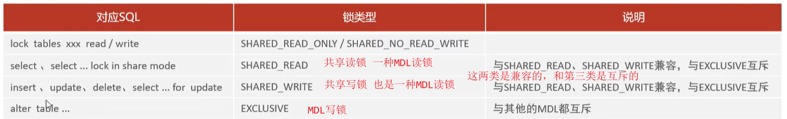

# MySQL八股

[toc]

TODO: 索引下推

## 一、基础

### 一条select语句是如何执行的 ☆

`select * from product where id = 1;`

{width=80%}

MySQL架构可分：Server层和存储引擎层两部分

* Server层：负责**建立连接、分析和执行SQL**。MySQL大多数的核心功能模块都在这实现
* 存储引擎层：负责**数据的存储和提取**。支持 InnoDB、MyISAM、Memory 等多个存储引擎，**不同的存储引擎共用一个Server层**。从MySQL5.5版本开始，InnoDB成为了MySQL的默认存储引擎。我们常说的**索引**数据结构也是由存储引擎层实现的

---

1. **连接器**：负责和客户端建立连接、权限验证(验证用户名和密码)、维持和管理连接
   1. mysql基于TCP，需要三次握手，客户端通过ip+port(3306)来连接mysql服务器：`mysql -h $ip -u $user -p`
2. **查询缓存**：mysql拿到一个查询select请求后，会先到查询缓存(query ccache)看看是否执行过这条语句，命中的话直接返回结果。之前执行过的select语句及其结果会以key-value的形式缓存在**内存**中，key为SQL查询语句，value为查询结果。
   1. > 所谓transformer的key value query来源
   2. 但其实查询缓存很**鸡肋**，命中率很低，mysql8.0之后**删掉**了查询缓存。
3. **解析器**：你输入的是字符串+空格组成的sql，mysql需要识别出里面的字符串分别是什么，代表什么；**词法分析**会识别出字符串中的关键字(eg, select, from...)；**语法分析**会判断sql语句是否满足mysql语法
4. **预处理器**：检查表和字段是否存在，以及将`select *`中的`*`扩展为表上的所有列(ok 有点像C语言的预处理指令)
5. **优化器**：基于查询成本的考虑，选择查询成本最小的**执行方案**；比如在表里面有多个索引的时候，优化器会基于查询成本的考虑，来决定选择使用哪个索引。或者在一个语句中有多表关联(join)时，决定各表的连接顺序
   1. > 通过explain命令查询SQL语句的执行计划
6. **执行器**：执行器与存储引擎以记录为单位交互执行查询操作，然后返回结果即可

### MySQL一行记录是怎么存储的 (额外信息 + 真实数据)

存储行为由存储引擎定义，我们以InnoDB讲解：
MySQL默认使用InnoDB存储引擎
`show variables like 'datadir;'`: 查询数据库文件存在哪儿;`/var/lib/mysql/`，表结构存在.frm中，表数据存在.ibd文件中。

.frm: 存储表的元数据信息，比如列信息、索引信息、存储结构类型等。
.ibd: 存储数据和**索引**等。

---

InnoDB存储引擎的**逻辑存储结构**：
  

> first: 记录是按照row行存储在磁盘中的，数据库的读取是按照page页为单位读取的(不然总不能每读一行一次磁盘io吧，和分页存储原理一致)，一页16KB，即一次**最少**从磁盘读取16KB内容到内存，或者**最少**把16KB刷新到磁盘。
> > 基本单位是页，但没说一次只能读取一页奥...

* tablespace表空间(.idb): 包含多个segment段，如**数据**段(存放B+树非叶子节点的区的集合)、**索引**段(存放叶子节点的区的集合)、回滚段(存放回滚数据的区的集合(事务隔离))等。
  * 默认每个表对应一个表空间
* segment段：包含多个extent区
* extent区：每个区1MB。InnoBD页大小默认为==16KB==，即一个区有64个page
  * 默认存储引擎按照page分配空间，但为了**顺序io**，还是将链表中相邻页放到一个区中比较好
* page页：存储引擎管理的最小(基本)单元，即InnoDB以页为基本单位来**读写**的（需要读一条记录时，会将一页数据从磁盘读到内存，类似于页式存储管理）。默认每页大小为**16KB**（即只能保证16KB的连续存储，为了保证连续性，存储引擎每次向磁盘申请4-5个**区**）
  * 即InnoDB以页为最小基本单位进行读写，申请空间时基本单位是区
* 行：数据库表的**记录**是以行进行存放的

---

**InnoDB行格式row_format**：一条记录的存储结构
  

我们讲讲Compact:
  

#### 记录的额外信息

* **变长字段长度列表**：存储变长字段(eg varchar类型字段)的实际数据**长度**
  * 因为varchar(n)中的n是最大长度嘛 所以需要这么个字段
  * 如果数据表中没有变长字段，则记录航中无需变长字段长度列表

举个例子：

> 字符集是ascii，一个字符占据一字节


> * 注意变长字段长度列表是**逆序**存放的，第二条记录`04 02`，but why>
>   * **记录头信息**中有一个指向下一记录的指针，指向**记录头信息**和**真实数据**之间的位置，这样的话向左读就是记录头，向右就是真实数据，很方便。故而逆序存放的目的室：使得**位置靠前的记录的真实数据和数据对应的字段长度信息可以同时在同一个cpu cache line中**，提高cache命中率。（高低有点细节了）

  

---

* **NULL值列表**：每一个允许为NULL的列对应着一个bit，1表示该列为null，0非null，同样是**逆序**排列。
  * NULL值列表长度为8bit的整数倍，不足高位padding zero
  * 对于not null的字段，不需要这玩意儿。如果所有字段都not null, 就没有NULL值列表, 那就可以剩下至少1字节空间
  * 故而第一条数据NULL值列表为`00000000`(0x00), 第二条`00000100`(0x04), 第三条`00000110`(0x06)

* **记录头信息**
  * **delete_mask**：标识此条数据是否被删除。从这里可以知道，我们执行detele删除记录的时候，并不会真正的删除记录，只是将这个记录的delete_mask标记为1
  * **next_record**：下一条记录的位置。从这里可以知道，记录与记录之间是通过链表组织的。在前面我也提到了，指向的是下一条记录的「记录头信息」和「真实数据」之间的位置，这样的好处是向左读就是记录头信息，向右读就是真实数据，比较方便
  * record_type：表示当前记录的类型，0表示普通记录，1表示B+树非叶子节点记录，2表示最小记录，3表示最大记录

---

#### 记录的真实数据

三个隐藏字段：

* row_id: 如果我们建表的时候指定了主键或者唯一约束列，那么就没有row_id隐藏字段。如果既没有指定主键，又没有唯一约束，那么InnoDB就会为记录添加row_id隐藏字段作为**主键约束**; (非必需，6B)
* trx_id: 表示最近操作该记录的事务id(transaction_id); (必需，6B)
* roll_pointer: 这条记录上一个版本的指针；每次修改某条记录时，都会把旧的版本写入到undo日志中，然后这个隐藏列相当于一个指针，可以通过它找到该记录修改前的信息；roll_pointer 是必需的，占用7个字节。（？？？等到MVCC机制回看）

#### 一行长度

mysql规定，除了text, blobs这种大对象类型之外，其他所有列占用的字节长度加起来不能超过65535字节。（即一行记录最大只能存65535B）

如果表中只有一个varchar(n)字段且字符集是ascii，那么varchar(n)的最大取值是多少(ascii下1字符=1B)
刨去null值列表占用1B，变长字段长度列表占用2B(如果变长字段占用字节数>255B, 就用2B表示，否则1B)，故而这种情况下，n=65535-3=**65532**

---

而mysql磁盘和内存通过page交互(16KB)，所以一个页可能存不了一条记录(比如大blob对象，或者很长的varchar)，发生行溢出，多出的数据会存到另外的**溢出页**中。
{width=700}

### 内存结构和磁盘结构

  

---

#### 总结

**1.mysql的null值是如何存放的？**
MySQL 的 Compact 行格式中会用**NULL值列表**来**标记**值为NULL的列，NULL值并**不会存储在行格式中的真实数据部分**。

NULL值列表会占用整数个字节空间，当表中所有字段都定义成 NOT NULL，行格式中就不会有NULL值列表，可节省空间。

2.如何知道varchar(n)实际占用的数据大小
compact行格式中的变长字段长度列表可以看出每个varchar字段的大小

## 二、索引篇

### 索引是什么 有什么优缺点

索引就是数据的目录，帮助存储引擎快速获取数据，空间换时间。
索引是一种有序数据结构。

> 示例：将记录的某一字段拿出来，将其内容存到树上，这样我们就不需要从头到尾去遍历查找age=45的结果，可以通过树的结构快速寻找
> {width=70%}

* 优点
  * 提高查询效率，降低数据库IO成本
  * 提升排序效率
* 缺点（问题不大）
  * 索引占用磁盘存储空间 (数据和索引都存在磁盘文件.idb中)
  * 虽然大大提升了查询效率，但是**降低了增删改的效率**

> 存储引擎：是如何存储数据、如何为存储的数据建立索引、如何查询、更新数据等技术的实现方法。

### 分类

**索引分类**：
按「数据结构」分类：B+树索引、Hash索引、Full-text全文索引。
按「**物理存储**」分类：聚集索引（主键索引）、二级索引（辅助索引）。
按「**字段特性**」分类：主键索引、唯一索引、普通索引、前缀索引。
按「字段个数」分类：单列索引、联合索引。

#### 按数据结构分类

B+树索引：
数据库的**索引和数据都是存储在硬盘**的，所以每次读取一个索引节点需要一次磁盘io。B+Tree 相比于B树和二叉树来说，最大的优势在于查询效率很高，因为即使在数据量很大的情况，查询一个数据的磁盘I/O依然维持在3-4次(包括读数据那一次)。
> 树高为2大概可以存储18000条记录，树高为3大概是2200w条。

* B+树（多路平衡搜索树）特点：
  * 一个节点有多个子节点（多路）-> 所以树比较**矮胖**
  * 非叶子不保存数据，只作为索引；所有key都会出现在叶子中
  * 叶子按照从小到大排序，形成双向链表

底层结构：
我们知道数据库以page为单位读写，每个数据页有一个文件头，里面有两个指针，分别指向上下一个数据页，形成双向链表。
B+树种每个节点都是一个数据页，只有叶子才存放了数据，非叶子值存放目录项作为索引。

##### 为什么MySQL InnoDB选择B+tree作为索引的数据结构？

* B+Tree vs. B Tree
  * B+树非叶子只存储索引而B树存索引和数据。所以B+能存储的索引数目也就更多，所以B+树更加矮胖，进而磁盘io次数就比较少。
  * B+Tree叶子采用双向链表连接，适合mysql中的基于范围的查找，B Tree做不到。
* B+Tree vs. 二叉树
  * n个节点m叉树树高是$O(log_m^n)$，二叉树m=2，B+树一般m>100, 所以显然B+树是更加矮胖的，树高就代表着磁盘io次数。(==索引和数据存在磁盘中==)
* B+Tree vs. Hash表
  * Hash非常适合等值查询(O(1)搜索复杂度)，但并不适合范围查询。
  * 无法利用索引进行排序操作

#### 按物理存储分类

按照索引的物理存储形式分为：

* **聚集索引**(主键索引)Clustered Index: 将数据和索引放在一起，索引结构的叶子节点存放的是**实际数据**。（有且唯一）
* **二级索引**(辅助索引)Secondary Index: 将数据和索引分开存储，索引结构的叶子结点存放的是**主键值**(看好奥，放的是主键，可供回表使用(比如常见的id这个key))。（可不唯一，除了逐主键索引外的其他索引应该就是二级索引了）

> 聚集索引选取规则：
>
> * 如果存在主键，主键索引就是聚集索引（一般来说聚集索引就是主键）
> * 如果不存在主键，将使用第一个唯一（UNIQUE）索引作为聚集索引
> * 如果表没有主键，或没有合适的唯一索引，则InnoDB会自动生成一个自增的row_id作为隐藏的聚集索引

所以，在查询时使用了二级索引，如果查询的数据能在二级索引里查询的到，那么就不需要回表，这个过程就是**覆盖索引**。如果查询的数据不在二级索引里，就会先检索二级索引，**找到对应的叶子节点，获取到主键值后，然后再检索主键索引**，就能查询到数据了，这个过程就是**回表查询**。


#### 从字段特特性分类

* **主键索引**：建立在主键字段上的索引，唯一非空，默认创建 (PRIMARY)
* **唯一索引**：建立在unique字段上的索引，唯一，可为null (UNIQUE)
* **普通索引**：建立在普通字段上的索引，可不唯一，可为null
* 前缀索引：对字符类型字段的前几个前缀字符建立的索引，而不是在整个字段上建立的索引，可以缩小索引占据的磁盘空间

```sql
-- 创建普通索引
create index index_name on table_name(column_name) 
-- 创建唯一索引
create unique index index_name on table_name(column_name) 
-- 创建复合索引
create index index_name on table_name(column1, column2) 
-- 创建全文索引
create fulltext index index_name on table_name(column_name) 
-- 创建前缀索引 (提取前n个字符构建索引)
create index index_name on table_name (column_name(n))
```

#### 按字段个数分类

* 单列索引
* **联合索引**：通过将多个字段组合成一个索引。即在B+树中采用多个字段的值作为key值，比较时**先后比较**多个key。（前面的key是全局有序的，后面的key是在前面key相同时才有序，即局部相对有序）

> 在业务场景中，如果存在多个查询条件，考虑针对于查询字段建立索引时，建议建立联合索引， 而非单列索引。

---

**索引使用原则：**

1.联合索引遵循**最左前缀法则**：查询从索引的最左列开始(必须存在，但未必需要放在第一位)，并且不跳过索引中的字段。

* 如果不从最左列开始，联合索引完全失效
* 如果从最左开始，但跳过中间某列，则后面的字段失效（部分失效）
* 多个字段顺序是可以改变的

2.联合索引**范围查询**中规则：出现范围查询(> or <)，范围查询右侧的列索引失效。
> 改成>=就行了（如果业务允许的话
> `>=, <=, between, like`不会停止匹配

3.其他**索引失效**情况

* 不要在索引列上进行函数操作或者表达式计算，索引将失效（如substring, length, +1）
  * 因为索引存的是索引字段的原始值，而非计算后的值，故而.
* 模糊匹配中，如果仅仅是尾部模糊匹配，索引不失效，但如果是头部模糊，索引失效(`like %xxx`, `like %xx%`会失效)
* 用or连接条件时，只有两侧都使用索引时才有效，一侧没有就失效
* 如果mysql认为使用索引比全表更慢，则不用索引；（受该字段的数据分布影响，很智能）

4.**覆盖索引**:数据库可以**只通过索引**而**不需要查找表中的行数据**就能获取查询所需的所有信息 (需要返回的列在索引中已经全部能够找到)
尽量使用覆盖索引，减少使用select *

  

有什么优化索引的方法：（我简写了，详见xiaolin）

* 前缀索引优化
* 覆盖索引优化
* 主键索引最好是自增的
* 防止索引失效

### 什么时候需要创建索引 ☆

* **表的主键**通常会自动建立索引
* **频繁作为查询条件的字段**：经常出现在WHERE子句中的字段，创建索引可加快查询
* **排序和分组字段**：如果查询中经常对某些字段进行排序（ORDER BY）或分组（GROUP BY），为这些字段创建索引可以提高性能（因为建立索引之后在B+树中的记录已经排好序，查询的时候不用再次排序）
* **用于表连接的字段**：在多表连接查询中，外键关系的字段应该创建索引，以提高连接查询的效率

### 什么时候不需要创建索引 ☆

* 表记录很少：没必要，扫描整个表可能比使用索引更快

### count(*) / count(1)

当我们对一张数据表中的记录进行统计的时候，可以使用count(1)、count(*)、count(字段) 等。
按照性能排序：
`count(*) > count(1) > count(主键字段) > count(字段)`
count()聚合函数会统计函数指定的参数**不为null**的记录个数。
  
> 所以注意啊，count(1)不会排除null字段

## 三、事务篇

事务是一组操作的集合，它是一个不可分割的工作单位，事务会把所有的操作作为一个整体一起向系 统提交或撤销操作请求，即这些操作**要么同时成功，要么同时失败**。（原子性）

```sql
# 手动控制事务方法一（关闭事务自动提交）
select @@autocommit; -- 查看事务提交方式，1表示自动提交
set @@autocommit = 0; -- 设置为手动（session参数，只针对当前窗口有效）
# 设置为手动之后就需要使用commit手动提交事务到数据库
commit;     -- 提交事务
# 设置手动之后 如果执行出错需要回滚（why
rollback;   -- 回滚事务
```

```sql
# 手动控制事务方法二（显式开启事务）[推荐]
start transaction; -- 开启事务 或者begin
-- 事务操作
commit; -- 提交
rollback; -- 回滚
```

### 事务的四大特性 ACID ☆

实现事务必需遵守ACID四个特性

* **原子性**（Atomicity）：事务是不可分割的最小操作单元，即一个事物中的所有操作要么全部完成，要么全部不完成，不会结束在中间某个环节，如出现错误就回滚。
* **一致性**（Consistency）：一个事务执行之前和执行之后都必须处于一致性状态。比如a与b账户共有1000块，两人之间转账过程中可能暂时处于不一致状态，但事务提交时必须保证它们的账户总和还是1000。
* **隔离性**（Isolation）：允许多个并发的事务同时对数据修改和读取，执行互不干扰，防止多个事务并发执行由于交叉执行造成数据不一致的情况。（隔离级别越高，越安全但也越低效）
* **持久性**（Durability）：事务一旦提交或回滚，它**对数据库中的数据的改变就是永久**的 (因为存在磁盘中)。

#### InnoDB引擎通过什么技术保证这四个特性的？

* 原子性：undo log (回滚日志)
* 持久性：redo log (重做日志)
* 一致性：持久性 + 原子性 + 隔离性
* 隔离性：MVCC (多版本并发控制) 或 锁机制

### 并行(发)事务会引发什么问题 ☆

多个并发事务同时操作某数据库/表所引发的问题

* **赃读 (dirty read)/问题最严重**：一个事务A读到另一个事务B还未提交的数据；如果事务B后来回滚，事务A读到的数据就是无效的脏数据，这可能导致事务A给予不存在的数据做出错误的决策。
  * 例如,一个事务读取了另一个事务未提交的工资更新,但该更新后来被回滚了。
  * 可以理解为领导还没下达正式任务你就凭着自己的揣摩开始干活，结果活干完了，任务的内容被改了。
* **不可重复读 (non-repeatable read)**：同一事务先后读取同一个数据结果不一致;
  * 事务A多次读取同一数据，在事务A读取过程中，事务B修改并提交了该数据，导致事务A多次读取的结果不一致
  * 例如,事务A第一次读取某用户余额为100元,但第二次读取时,由于事务B的更新,余额变为120元。
<!-- 
  * “不可重复读”好一点，读到的是**已提交**的数据，比如某个读事务持续时间比较长，期间多次读取==某个元组==，每次读到的都是被别人**改过并已提交**的不同数据。可以理解为在执行任务的过程中，领导的指令一直在变。。但好歹是正式下达的指令。 -->
* **幻读 (phantom read)**：主要与插入或删除操作有关；在同一事务中执行相同的查询时，**返回的结果集中出现了之前没有的数据行**。
  * 事务A在读取某个范围的记录时,事务B在该范围内插入了新记录；当事务A再次读取该范围的记录时,会发现有新的"幻影"记录出现；
  * 幻读的重点在于新增或删除操作,而不是修改现有数据。（不可重复读是修改）

区别：

* 脏读涉及未提交的数据
* 不可重复读涉及已提交的数据修改
* 幻读涉及已提交的插入或删除操作

>所以“不可重复读”和“幻读”都是读的过程中**数据前后不一致**，只是**前者侧重于修改，后者侧重于增删**（数据操作不同）。前者侧重于**单个数据项**，后者侧重于**一批数据**（影响范围不同）。所以可以说严格来讲“幻读”可以被称为“不可重复读”的一种特殊情况。但是从数据库管理的角度来看二者是有区别的。解决“不可重复读”只要加行级锁就可以了。而解决“幻读”则需要加表级锁，或者采用其他更复杂的技术，总之代价要大许多。这是搞数据库的那帮家伙非要把这两者区分开的动机吧。
[reference](https://www.zhihu.com/question/392569386/answer/1434210648)

### 事务隔离级别 ☆

由于多个事务并发执行可能出现脏读、不可重复读、幻读的问题，**为了解决这些问题，就诞生了隔离级别的概念**

* **读未提交RU(Read Uncommitted)**: 一个事务还没提交时，它做出的变更就能被其他事务看到（即A事务可以读到B事务修改了未提交的内容，即引起脏读）
  * 可能出现脏读、不可重复读、幻读
* **读已提交RC(Read Committed)**: 一个事务提交之后，该变更才能被其他事务看到
  * 避免了脏读，可能出现不可重复读和幻读
* **可重复读RR(Repeatable Read) (default)**: 确保在同一个事务中多次读取相同记录的结果是一致的，即使其他事物对修改了该条记录，也不影响当前事务
  * 避免了脏读和不可重复读，可能幻读
* **串行化S(Serializable)**: 顾名思义，对同一行记录，**写会加上写锁，读会加读锁**。当出现读写锁冲突的时候，后访问的事务必须等待前一事务执行完毕，才可继续执行
  * 这个串行化可不是字节流序列化奥，就是单纯的串行
  * 解决了所有问题
  * **串行化隔离水平最高，安全水平也最高，效率最低(大量的锁竞争以及超时问题)**
    * 挺狠的，读写竟然都加锁

> 比如，read uncommitted不可规避脏读问题，A事务**可以**读到B事务还未提交的数据；而read committed可以规避脏读问题，A事务读到B事务还未提交的数据时**会读取之前的数据**，并不会读取uncommitted data，当B事务提交之后select可以读到commited data。但read comitted会出现不可重复读问题。
> repeatable read会保证一个事务中查询的数据一致，即使另一个事物commit数据。但会出现幻读问题，多次查询结果集不同，妈的见鬼。
> serializable可解决幻读问题：A事务查询数据没有，B事务去insert**会被阻塞**，直到A事务commmit之后。

<!-- ---

所以，要解决脏读现象，就要升级到「读提交」以上的隔离级别；要解决不可重复读现象，就要升级到「可重复读」的隔离级别，要**解决幻读现象不建议将隔离级别升级到「串行化」**，因为MySQL 在「可重复读」隔离级别下，可以**很大程度上**(不是完全解决)避免幻读现象的发生。

   -->

## 四、锁篇

### 锁分类

#### 全局锁

```sql
-- 创建全局锁
flush tables with read lock;
-- 释放全局锁
unlock tables;
```

创建全局锁后，**整个数据库就处于只读状态了**(只可以使用DQL语句)，这时其他线程执行以下操作，都会被**阻塞**：
DML语句:对数据的增删改操作，比如 insert、delete、update等语句；
DDL语句:对表结构的更改操作，比如 alter table、drop table 等语句。

* 全局锁：锁定整个数据库(所有表)
  * 应用：全库的逻辑备份，全局锁后，可以获得一致性视图，保证数据的完整性。
    * `mysqldump -uroot -pxiahao table_name > tmp.sql;` (逻辑备份即导出为一些sql语句(创建表+insert语句))
  * 缺点
    * 如果在主库上备份，**备份期间不能执行更新操作，业务停滞**
    * 如果在从库上备份，备份期间不能执行主库同步过来的二进制日志(binlog)，导致主从延迟（了解）

{width=80%}

#### 表级锁

标级锁分为：表锁、元数据锁MDL、意向锁、AUTO-INC锁

##### 表锁

```sql
-- 表级别的共享锁（读锁）
lock tables t_student read;
-- 表级别的独占锁（写锁）
lock tables t_student write;
-- 释放当前会话的所有表锁
unlock tables;
```

表锁分为：读锁（共享锁）和写锁（独占锁），跟操作系统很类似，只不过os中读写锁是一把锁，mysql这里是两把锁

读锁允许多个事务并发读取同一数据，但不允许写入(DDL/DML)（**包括自己**） （都可以读 都不可以写(读共享，写独占)）
写锁是独占的，同一时间只有持有写锁的事务可以读**写**，其他事务读写均被阻塞。（注意自己是可以读的哦）

> 思想上和os提供的线程同步机制中的读写锁(c语言)是一样的，mysql的读写锁是数据库系统内部实现的。
> 本质上还是读者写者问题：允许读读，互斥读写，互斥写写 (针对共享资源所以需要互斥)

不过尽量避免在使用 InnoDB 引擎的表使用表锁，因为**表锁的粒度太大**，**影响并发性能**，**InnoDB**牛逼的地方在于实现了**颗粒度更细的行级锁**。

##### 元数据锁

> **元数据**是指有关数据库结构和定义的信息：比如数据库、表、列的定义，索引信息，触发器和存储过程等对象的定义 （简单理解为**元数据就是表结构**）

元数据锁(MDL)**无需显式使用**，系统自动控制。MDL锁用于维护表中元数据的一致性，当表上有活动事务的时候，不可以对元数据进行写入操作。**避免DML和DDL冲突**。

* 对一张数据表进行增删改查时，会自动加上**MDL读锁(共享)**
  * 这里对表内容可以同时读写，因为都是MDL读锁（共享），别管那个什么shared_write
* 对一张表结构做变更操作时，会自动加上**MDL写锁(独占)**

  

```sql
查看元数据锁: 
select object_type, object_schema, object_name, lock_type, lock_duration from performance_schema.metadata_locks;
```

MDL 是为了保证当用户对表执行 CRUD 操作时，防止其他线程对这个**表结构**做了变更。
当有线程在执行select语句（加MDL读锁）的期间，如果有其他线程要更改该表的结构（申请MDL写锁），那么将会被**阻塞**，直到执行完select语句（释放MDL读锁）。 (互斥读写)

反之，当有线程对表结构进行变更（加MDL写锁）的期间，如果有其他线程执行了CRUD操作（申请MDL读锁），也被阻塞，直到表结构变更完成（释放MDL写锁）。


> 写优先锁是指：一个线程在读，一个线程想要写被阻塞，后续再来的读线程被阻塞（即有限服务写线程）。读优先是后续再来的读线程不被阻塞。(**mysql默认写优先**)

##### 意向锁

* 在使用InnoDB引擎的表里**对某些记录加上共享锁（行级别）**之前，需要先在**表级别**加上一个**意向共享锁**；
* 在使用InnoDB引擎的表里对某些纪录加上独占锁之前，需要先在表级别加上一个**意向独占锁**；
* 也就是，当执行插入、更新、删除操作，需要先对表加上「意向独占锁」，然后对该记录加独占锁。

  

##### AUTO-INC锁

表中主键自动自增(AUTO_INCREMENT)是基于AUTO-INC锁实现的。
AUTO-INC 锁是特殊的**表锁**机制，锁不是再一个事务提交后才释放，而是在**执行完插入语句后就会立即释放**。

  

#### 行级锁

行级锁，每次操作**锁住对应的行数据**。==锁定粒度最小，发生锁冲突的概率最低，并发度最高==.

InnoDB引擎支持行级锁，MyISAM不支持。

InnoDB的行锁是**基于索引**的，即通过对索引上的索引项加锁来实现，**而非基于记录**。

---

快照读 vs. 当前读

  
{width=80%}

---

行锁主要分为三类：

* Record Lock (行锁)
* Gap Lock (间隙锁)
* Next-Key Lock (临键锁)

普通的select语句不会对记录加行级锁，因为它属于快照读(MVCC)。不过也可以使用下面的方式加锁（这种给查询加锁称作**锁定读**）

```sql
-- 对读取的记录加共享锁
select ... lock in share mode;
-- 对读取的记录加独占/排他锁
select ... for update;
```

##### Record Lock

锁住一条记录；分为**S记录锁（Shared共享锁）**和**X记录锁（Excusive排他锁）**

* 当一个事务对一条记录加了S锁后，其他事务也可以继续对该记录加 S锁（SS兼容），但是不可以对该记录加X锁（SX不兼容）
  * `select ... lock in share mode;`
* 当一个事务对一条记录加了X锁后，其他事务既不可以对该记录加S锁（SX不兼容），也不可以对该记录加X锁（XX不兼容）
  * `select ... for update;`

##### Gap Lock

间隙锁只存在于可重复读隔离RR级别，目的是为了解决RR级别下幻读的现象.

前文说了repeatable read隔离级别可能产生幻读，但mysql可以很大程度上避免幻读现象。

* 针对快照读（普通select语句），通过MVCC方式解决幻读
* 针对当前读（select ... for update），是通过next-key lock（记录锁+间隙锁）解决幻读

  

##### Next-key Lock

  

##### 插入意向锁

暂略

### 锁原理

