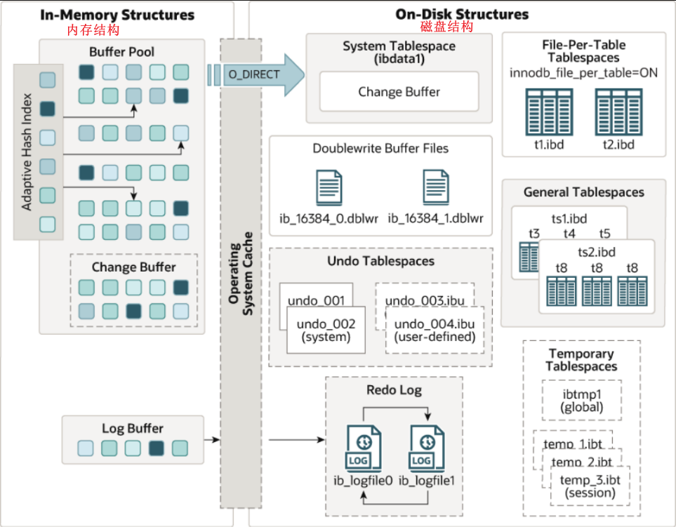
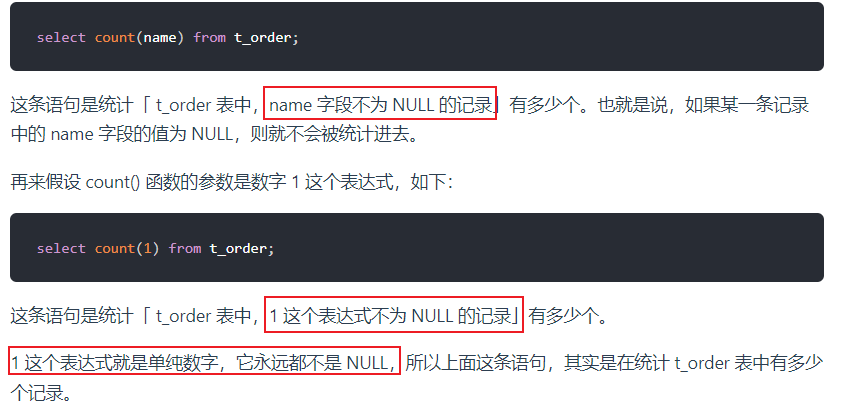
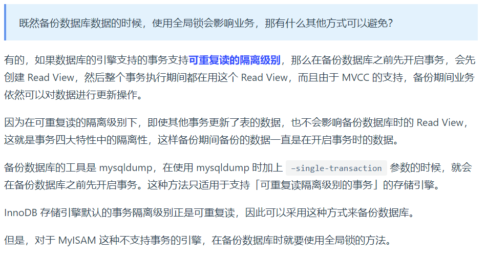
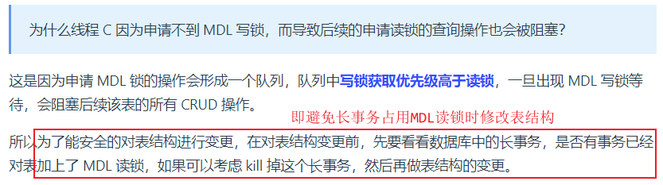

# MySQL

- [MySQL](#mysql)
  - [一、基础](#一基础)
    - [一条select语句是如何执行的 ☆](#一条select语句是如何执行的-)
    - [MySQL一行记录是怎么存储的 (额外信息 + 真实数据)](#mysql一行记录是怎么存储的-额外信息--真实数据)
      - [记录的额外信息](#记录的额外信息)
      - [记录的真实数据](#记录的真实数据)
      - [一行长度](#一行长度)
    - [内存结构和磁盘结构](#内存结构和磁盘结构)
      - [总结](#总结)
  - [二、索引篇](#二索引篇)
    - [索引是什么 有什么优缺点 ☆](#索引是什么-有什么优缺点-)
      - [按(叶子结点)物理存储分类](#按叶子结点物理存储分类)
      - [按数据结构分类](#按数据结构分类)
        - [为什么MySQL InnoDB选择B+tree作为索引的数据结构？ ☆](#为什么mysql-innodb选择btree作为索引的数据结构-)
      - [从字段特特性分类](#从字段特特性分类)
      - [按字段个数分类](#按字段个数分类)
        - [联合索引使用原则](#联合索引使用原则)
    - [什么是**索引下推** (Index Condition Pushdown)](#什么是索引下推-index-condition-pushdown)
    - [什么时候需要创建索引 ☆](#什么时候需要创建索引-)
    - [什么时候不需要创建索引 ☆](#什么时候不需要创建索引-)
    - [什么时候索引失效 ☆](#什么时候索引失效-)
    - [有什么优化索引的方法](#有什么优化索引的方法)
    - [count(\*) / count(1)](#count--count1)
  - [三、事务篇](#三事务篇)
    - [事务的四大特性 ACID ☆](#事务的四大特性-acid-)
      - [InnoDB引擎通过什么技术保证这四个特性的？](#innodb引擎通过什么技术保证这四个特性的)
    - [并行(发)事务会引发什么问题 ☆](#并行发事务会引发什么问题-)
    - [事务隔离级别 ☆](#事务隔离级别-)
  - [四、锁篇](#四锁篇)
    - [锁分类](#锁分类)
      - [全局锁](#全局锁)
      - [表级锁](#表级锁)
        - [表锁](#表锁)
        - [元数据锁](#元数据锁)
        - [意向锁](#意向锁)
        - [AUTO-INC锁](#auto-inc锁)
      - [行级锁](#行级锁)
        - [Record Lock](#record-lock)
        - [Gap Lock](#gap-lock)
        - [Next-key Lock](#next-key-lock)
        - [插入意向锁](#插入意向锁)
    - [锁原理](#锁原理)
  - [五、日志篇](#五日志篇)
    - [日志文件分为几种](#日志文件分为几种)
    - [为何需要undo log](#为何需要undo-log)
      - [实现事务回滚, 保障事务原子性](#实现事务回滚-保障事务原子性)
      - [实现MVCC的关键因素](#实现mvcc的关键因素)
    - [BufferPool](#bufferpool)
    - [有了undolog为啥还需要redolog](#有了undolog为啥还需要redolog)
      - [undo log vs. redo log](#undo-log-vs-redo-log)
      - [为何需要binlog](#为何需要binlog)
        - [binlog vs. redolog](#binlog-vs-redolog)
      - [两阶段提交](#两阶段提交)
  - [架构](#架构)
    - [基于binlog实现主从复制](#基于binlog实现主从复制)
    - [分库和分表是什么](#分库和分表是什么)

## 一、基础

### 一条select语句是如何执行的 ☆

`select * from product where id = 1;`

{width=80%}

MySQL架构可分：Server层和存储引擎层两部分

* Server层：负责**建立连接、分析和执行SQL**。MySQL大多数的核心功能模块都在这实现
* 存储引擎层：负责**数据的存储和提取**。支持 InnoDB、MyISAM、Memory 等多个存储引擎，**不同的存储引擎共用一个Server层**。从MySQL5.5版本开始，InnoDB成为了MySQL的默认存储引擎。我们常说的**索引**数据结构也是由存储引擎层实现的
  * 存储引擎层既包括位于内存中的BufferPool，又涉及到位于磁盘上的实际数据

---

1. **连接器**：负责和客户端建立连接、权限验证(验证用户名和密码)、维持和管理连接
   1. mysql基于TCP，需要三次握手，客户端通过ip+port(3306)来连接mysql服务器：`mysql -h $ip -u $user -p`
2. **查询缓存**：mysql拿到一个查询select请求后，会先到查询缓存(query ccache)看看是否执行过这条语句，命中的话直接返回结果。之前执行过的select语句及其结果会以key-value的形式缓存在**内存**中，key为SQL查询语句，value为查询结果。
   1. > 所谓transformer的key value query来源
   2. 但其实查询缓存很**鸡肋**，命中率很低，mysql8.0之后**删掉**了查询缓存。
3. **解析器**：你输入的是字符串+空格组成的sql，mysql需要识别出里面的字符串分别是什么，代表什么；**词法分析**会识别出字符串中的关键字(eg, select, from...)；**语法分析**会判断sql语句是否满足mysql语法
4. **预处理器**：检查表和字段是否存在，以及将`select *`中的`*`扩展为表上的所有列(ok 有点像C语言的预处理指令)
5. **优化器**：基于查询成本的考虑，选择查询成本最小的**执行方案**；比如在表里面有多个索引的时候，优化器会基于查询成本的考虑，来决定选择使用哪个索引。或者在一个语句中有多表关联(join)时，决定各表的连接顺序
   1. > 通过explain命令查询SQL语句的执行计划
6. **执行器**：执行器与存储引擎以记录为单位交互执行查询操作，然后返回结果即可

### MySQL一行记录是怎么存储的 (额外信息 + 真实数据)

存储行为由存储引擎定义，我们以InnoDB讲解：
MySQL默认使用InnoDB存储引擎
`show variables like 'datadir;'`: 查询数据库文件存在哪儿;`/var/lib/mysql/`，表结构存在.frm中，表数据存在.ibd文件中。

.frm: 存储表的元数据信息，比如列信息、索引信息、存储结构类型等。
.ibd: 存储数据和**索引**等。

---

InnoDB存储引擎的**逻辑存储结构**：
  

> first: 记录是按照row行存储在磁盘中的，数据库的读取是按照page页为单位读取的(不然总不能每读一行一次磁盘io吧，和分页存储原理一致)，一页16KB，即一次**最少**从磁盘读取16KB内容到内存，或者**最少**把16KB刷新到磁盘。
> > 基本单位是页，但没说一次只能读取一页奥...

* tablespace表空间(.idb): 包含多个segment段，如**数据**段(存放B+树非叶子节点的区的集合)、**索引**段(存放叶子节点的区的集合)、回滚段(存放回滚数据的区的集合(事务隔离))等。
  * 默认每个表对应一个表空间
* segment段：包含多个extent区
* extent区：每个区1MB。InnoBD页大小默认为==16KB==，即一个区有64个page
  * 默认存储引擎按照page分配空间，但为了**顺序io**，还是将链表中相邻页放到一个区中比较好
* page页：存储引擎管理的最小(基本)单元，即InnoDB以页为基本单位来**读写**的（需要读一条记录时，会将一页数据从磁盘读到内存，类似于页式存储管理）。默认每页大小为**16KB**（即只能保证16KB的连续存储，为了保证连续性，存储引擎每次向磁盘申请4-5个**区**）
  * 即InnoDB以页为最小基本单位进行读写，申请空间时基本单位是区
* 行：数据库表的**记录**是以行进行存放的

---

**InnoDB行格式row_format**：一条记录的存储结构
  

我们讲讲Compact:
  

#### 记录的额外信息

* **变长字段长度列表**：存储变长字段(eg varchar类型字段)的实际数据**长度**
  * 因为varchar(n)中的n是最大长度嘛 所以需要这么个字段
  * 如果数据表中没有变长字段，则记录航中无需变长字段长度列表

举个例子：

> 字符集是ascii，一个字符占据一字节


> * 注意变长字段长度列表是**逆序**存放的，第二条记录`04 02`，but why>
>   * **记录头信息**中有一个指向下一记录的指针，指向**记录头信息**和**真实数据**之间的位置，这样的话向左读就是记录头，向右就是真实数据，很方便。故而逆序存放的目的室：使得**位置靠前的记录的真实数据和数据对应的字段长度信息可以同时在同一个cpu cache line中**，提高cache命中率。（高低有点细节了）

  

---

* **NULL值列表**：每一个允许为NULL的列对应着一个bit，1表示该列为null，0非null，同样是**逆序**排列。
  * NULL值列表长度为8bit的整数倍，不足高位padding zero
  * 对于not null的字段，不需要这玩意儿。如果所有字段都not null, 就没有NULL值列表, 那就可以剩下至少1字节空间
  * 故而第一条数据NULL值列表为`00000000`(0x00), 第二条`00000100`(0x04), 第三条`00000110`(0x06)

* **记录头信息**
  * **delete_mask**：标识此条数据是否被删除。从这里可以知道，我们执行detele删除记录的时候，并不会真正的删除记录，只是将这个记录的delete_mask标记为1
  * **next_record**：下一条记录的位置。从这里可以知道，记录与记录之间是通过链表组织的。在前面我也提到了，指向的是下一条记录的「记录头信息」和「真实数据」之间的位置，这样的好处是向左读就是记录头信息，向右读就是真实数据，比较方便
  * record_type：表示当前记录的类型，0表示普通记录，1表示B+树非叶子节点记录，2表示最小记录，3表示最大记录

---

#### 记录的真实数据

三个隐藏字段：

* row_id: 如果我们建表的时候指定了主键或者唯一约束列，那么就没有row_id隐藏字段。如果既没有指定主键，又没有唯一约束，那么InnoDB就会为记录添加row_id隐藏字段作为**主键约束**; (非必需，6B)
* trx_id: 表示最近操作该记录的事务id(transaction_id); (必需，6B)
* roll_pointer: 这条记录上一个版本的指针；每次修改某条记录时，都会把旧的版本写入到undo日志中，然后这个隐藏列相当于一个指针，可以通过它找到该记录修改前的信息；roll_pointer 是必需的，占用7个字节。（？？？等到MVCC机制回看）

#### 一行长度

mysql规定，除了text, blobs这种大对象类型之外，其他所有列占用的字节长度加起来不能超过65535字节。（即一行记录最大只能存65535B）

如果表中只有一个varchar(n)字段且字符集是ascii，那么varchar(n)的最大取值是多少(ascii下1字符=1B)
刨去null值列表占用1B，变长字段长度列表占用2B(如果变长字段占用字节数>255B, 就用2B表示，否则1B)，故而这种情况下，n=65535-3=**65532**

---

而mysql磁盘和内存通过page交互(16KB)，所以一个页可能存不了一条记录(比如大blob对象，或者很长的varchar)，发生行溢出，多出的数据会存到另外的**溢出页**中。
{width=700}

### 内存结构和磁盘结构

  

---

#### 总结

**1.mysql的null值是如何存放的？**
MySQL 的 Compact 行格式中会用**NULL值列表**来**标记**值为NULL的列，NULL值并**不会存储在行格式中的真实数据部分**。

NULL值列表会占用整数个字节空间，当表中所有字段都定义成 NOT NULL，行格式中就不会有NULL值列表，可节省空间。

2.如何知道varchar(n)实际占用的数据大小
compact行格式中的变长字段长度列表可以看出每个varchar字段的大小

## 二、索引篇

### 索引是什么 有什么优缺点 ☆

索引就是数据的目录，帮助存储引擎快速获取数据，空间换时间。
索引是一种有序数据结构。
索引就类似于我们书籍的目录。

> 示例：将记录的某一字段拿出来，将其内容存到树上，这样我们就不需要从头到尾去遍历查找age=45的结果，可以通过树的结构快速寻找
> {width=70%}

* 优点
  * 提高查询效率，降低数据库IO成本
  * 提升排序效率
* 缺点（问题不大）
  * 索引占用磁盘存储空间 (数据和索引都存在磁盘文件.idb中)
  * 虽然大大提升了查询效率，但是**降低了增删改的效率**
    * > 因为除了更新数据外还要更新索引嘛，还有索引节点页分裂等问题

---

**总论：**

每个表都**必须有且只有**一个**聚集索引**(clustered index), (选取规则：一般是主键作为聚簇索引的索引键，如没主键则选第一个唯一(unique)且非空的索引，再者自动生成一个隐式自增row_id列作为索引键)

其他索引都叫做**辅助索引/二级索引**(secondary index)。聚集索引和二级索引默认使用B+ Tree索引。

比如有这么一张表格：
{width=60%}

  
如果执行: `select * from product where id = 5;`, 通过主键索引查询id=5的商品信息，会从B+Tree自顶而下查询，先对比5和(1,10,20)，遂进入二层1列，与(1,4,7)对比，遂进入三层二列，然后在叶子结点中继续遍历找到5，即可拿到id=5的员工的所有信息

  

如果执行: `select * from product where product_no = 0002`, 通过二级索引查询商品信息，类似地，一路对比非叶子找到叶子结点，然后**只能拿到主键值**，此时需要**通过主键索引的B+Tree**查询主键值对应的完整用户信息(整行数据)，此过程谓之**回表查询**，即需要查**两个B+Tree**才拿到结果。

但如果你查询: `select id from product where product_no = 0002`, 通过二级索引查用户id，这可以直接从二级索引的叶子拿到结果，就无需回表查询了，此过程谓之**覆盖索引**，即**通过二级B+Tree就能查到结果**。

> 总结：所以查询一般有三种情况：直接走聚集索引B+Tree(根据主键查询)；直接走二级索引B+Tree(覆盖索引)；先走二级索引B+Tree再走聚集索引B+Tree(回表查询)

#### 按(叶子结点)物理存储分类

按照索引的物理存储形式分为：

* **聚集索引**(主键索引)Clustered Index: B+Tree叶子节点存放的是实际数据，所有**完整的用户记录**都存放在主键索引的B+Tree的叶子节点里。（有且唯一）
* **二级索引**(辅助索引)Secondary Index: B+Tree 的叶子节点存放的是**主键值**，而不是实际数据。（可不唯一，主键索引以外的索引都叫辅助）

#### 按数据结构分类

B+树索引：
数据库的**索引和数据都是存储在硬盘**的，所以每次读取一个索引节点需要一次磁盘io。B+Tree 相比于B树和二叉树来说，最大的优势在于查询效率很高，因为即使在数据量很大的情况，查询一个数据的磁盘I/O依然维持在3-4次(包括读数据那一次)。
> 一个索引节点对应磁盘中的一个数据页(about 16KB)，意味着上下层索引节点位于两个数据页，意味着需要两次磁盘IO
> 主键索引中索引节点存放的是主键，按递增顺序存放，其他非主键字段索引的索引节点存的就是对应字段的数据，同样按序存放
> 树高为2大概可以存储18000条记录，树高为3大概是2200w条。

* B+树（多路平衡搜索树）特点：
  * 一个节点有多个子节点（多路）-> 所以树比较**矮胖**
  * 非叶子不保存数据，只作为索引；所有key都会出现在叶子中
  * 叶子按照从小到大排序，形成双向链表

底层结构：
我们知道数据库以page为单位读写，每个数据页有一个文件头，里面有两个指针，分别指向上下一个数据页，形成双向链表。
B+树种每个节点都是一个数据页，只有叶子才存放了数据，非叶子值存放目录项作为索引。

##### 为什么MySQL InnoDB选择B+tree作为索引的数据结构？ ☆

* B+Tree vs. B Tree
  * B+树非叶子只存储索引而B树存索引和数据。所以B+能存储的索引数目也就更多，所以B+树更加矮胖，进而磁盘io次数就比较少。
  * B+Tree叶子采用双向链表连接，适合mysql中的基于范围的查找，B Tree做不到。
* B+Tree vs. 二叉树
  * n个节点m叉树树高是$O(log_m^n)$，二叉树m=2，B+树一般m>100, 所以显然B+树是更加矮胖的，树高就代表着磁盘io次数。(==索引和数据存在磁盘中==)
* B+Tree vs. Hash表
  * Hash非常适合等值查询(O(1)搜索复杂度)，但并不适合范围查询。
  * 无法利用索引进行排序操作

#### 从字段特特性分类

* **主键索引**：建立在主键字段上的索引，唯一非空，默认创建 (PRIMARY)
* **唯一索引**：建立在unique字段上的索引，唯一，可为null (UNIQUE)
* **普通索引**：建立在普通字段上的索引，可不唯一，可为null
* **前缀索引**：对字符类型字段的前几个前缀字符建立的索引，而不是在整个字段上建立的索引，可以缩小索引占据的磁盘空间，提高查询效率

```sql
-- 创建普通索引
create index index_name on table_name(column_name) 
-- 创建唯一索引
create unique index index_name on table_name(column_name) 
-- 创建全文索引
create fulltext index index_name on table_name(column_name) 
-- 创建前缀索引 (提取前n个字符构建索引)
create index index_name on table_name (column_name(n))
```

#### 按字段个数分类

* 单列索引
* **联合索引**：通过将多个字段组合成一个索引。即在B+树中采用多个字段的值作为key值，比较时**先后比较**多个key。（**前面的key是全局有序的**，后面的key是在前面key相同时才有序，即**局部相对有序**）

```sql
-- 创建联合索引：索引字段(product_no, name)
CREATE INDEX index_product_no_name ON product(product_no, name)
```

> 在业务场景中，如果存在多个查询条件，考虑针对于查询字段建立索引时，建议建立联合索引， 而非单列索引。

{width=80%}

{width=80%}

---

##### 联合索引使用原则

1.联合索引遵循**最左前缀法则**：查询从索引的最左列开始(必须存在，但未必需要放在第一位)，并且不跳过索引中的字段。

* **如果不从最左列开始，联合索引完全失效**
* 如果从最左开始，但**跳过中间某列，则后面的字段失效**（部分失效）
* 多个字段顺序是可以改变的

2.联合索引**范围查询**中规则：出现范围查询(> or <)，范围查询右侧的列索引失效。
> * 改成>=就行了（如果业务允许的话
> * `>=, <=, between and(>= <=), like(也存在闭区间)`不会停止匹配
> * `select * from t_table where a > 1 and b = 2`: 符合a>1的记录肯定是相邻的(因为先按a排序嘛)，然后找到a>1的所有记录范围之后，b字段的值是无序的，所以不能b=2这个b字段就没用到联合索引
> * `select * from t_table where a >= 1 and b = 2`: 虽然在符合a>=1条件的二级索引记录的范围里，b字段的值是无序的，但是对于符合a=1的二级索引记录的范围里，b字段的值是。所以a=1时b字段可以用到联合索引。
>   * 但不鸡肋吗，大部分情况(>=1)仍然没用

### 什么是**索引下推** (Index Condition Pushdown)

* 传统索引扫描：在没有ICP的情况下，MySQL**使用索引**查找满足索引条件的记录，然后**从表中读取完整的行数据**，**==再对==其他非索引条件进行过滤**。这意味着MySQL可能需要从表中读取大量数据，即使其中有很多不满足查询条件
* 启用 ICP：当ICP被启用时，MySQL会**在使用索引扫描数据的同时，尽可能地应用额外的查询条件（非索引条件）**。这意味着在索引扫描阶段，MySQL就可以排除不满足非索引条件的记录，从而减少需要从磁盘中读取的数据量。这种方式减少了不必要的I/O操作，提高了查询效率

  

{width=70%}


### 什么时候需要创建索引 ☆

* **表的主键**：自动建立索引
* **频繁作为查询条件的字段**：经常出现在WHERE子句中的字段，创建索引可加快查询
* **排序和分组字段**：如果查询中经常对某些字段进行排序（ORDER BY）或分组（GROUP BY），为这些字段创建索引可以大大提高排序速度（因为建立索引之后在B+树中的记录已经排好序，查询的时候不用再次排序）
* **查询中与其他表关联的字段**：在多表连接查询中，外键关系的字段应该创建索引，以提高连接查询的效率
* **大表中的关键列**：在大表中，如果查询的效率变得很低，可以考虑在关键列上创建索引

### 什么时候不需要创建索引 ☆

* **不用于查询条件的字段**：WHERE 条件，GROUP BY，ORDER BY 里用不到的字段，索引的价值是快速定位，如果起不到定位的字段通常是不需要创建索引的，因为索引是会占用物理空间的
* **小表**：对小表创建索引可能会带来额外的开销，因为**在小数据集中扫描整个表可能比使用索引更快**
* **高频更新表**：如果表中数据频繁更新、插入或删除，维护索引会带来额外的开销。这些操作需要额外的资源来保持索引结构的更新和完整。
* **低选择性列 / 重复值较高列**：选择性低的列（即具有大量重复值的列），如性别、布尔值等，使用索引通常无助于性能提升，因为索引**树的深度很浅**，查找效率接近于全表扫描

### 什么时候索引失效 ☆

* 不要在索引列上进行**使用函数**或者**表达式计算**，索引将失效（如substring, length, +1, -1）
  * **因为索引存的是索引字段的原始值**，而非经函数计算后的值，故而.
* **最左前缀法则**：对于联合索引，查询条件必须遵循最左前缀原则。如果查询条件未使用联合索引的最左侧字段，则索引将失效
* **使用LIKE关键字**：模糊匹配中，如果仅仅是尾部模糊匹配，索引不失效，但如果是头部模糊，索引失效(`like %xxx`, `like %xx%`会失效)
  * 因为%代表任意长度的字符串，以%开头时，mysql必须从第一条记录逐个进行匹配，无法利用索引的有序性。而以%结尾时，可以利用索引找到%前面的字符串
* **用or连接条件时，只有两侧都使用索引时才有效，一侧没有就失效**
* **隐式类型转换**：MySQL 在遇到字符串和数字比较的时候，会自动把字符串转为数字，然后再进行比较。如果字符串是索引列，而条件语句中的输入参数是数字的话，那么索引列会发生隐式类型转换，由于隐式类型转换是通过 CAST 函数实现的，等同于对索引列使用了函数，所以就会导致索引失效
* 如果mysql认为使用索引比全表更慢，则不用索引；（受该字段的数据分布影响，很智能）

### 有什么优化索引的方法

* **前缀索引优化**：减小索引字段大小，可以增加一个索引页中存储的索引值，有效提高索引的查询速度
* **覆盖索引优化**：覆盖索引是指 SQL 中 query 的所有字段，在索引 B+Tree 的叶子节点上都能找得到的那些索引，从二级索引中查询得到记录，而不需要通过聚簇索引查询获得，可以避免回表的操作
* **主键索引最好是自增的**：如果使用自增主键，那么每次插入的新数据就**会按顺序添加**到当前索引节点的位置，**不需要移动已有的数据**，当页面写满，就会自动开辟一个新页面
* **防止索引失效**

### count(*) / count(1)

当我们对一张数据表中的记录进行统计的时候，可以使用count(1)、count(*)、count(字段) 等。
按照性能排序：
`count(*) > count(1) > count(主键字段) > count(字段)`
count()聚合函数会统计函数指定的参数**不为null**的记录个数。
  
> 所以注意啊，count(1)不会排除null字段

## 三、事务篇

事务是一组操作的集合，它是一个不可分割的工作单位，事务会把所有的操作作为一个整体一起向系 统提交或撤销操作请求，即这些操作**要么同时成功，要么同时失败**。（原子性）

```sql
# 手动控制事务方法一（关闭事务自动提交）
select @@autocommit; -- 查看事务提交方式，1表示自动提交
set @@autocommit = 0; -- 设置为手动（session参数，只针对当前窗口有效）
# 设置为手动之后就需要使用commit手动提交事务到数据库
commit;     -- 提交事务
# 设置手动之后 如果执行出错需要回滚（why
rollback;   -- 回滚事务
```

```sql
# 手动控制事务方法二（显式开启事务）[推荐]
start transaction; -- 开启事务 或者begin
-- 事务操作
commit; -- 提交
rollback; -- 回滚
```

### 事务的四大特性 ACID ☆

实现事务必需遵守ACID四个特性

* **原子性**（Atomicity）：事务是不可分割的最小操作单元，即一个事物中的所有操作要么全部完成，要么全部不完成，不会结束在中间某个环节，如出现错误就回滚。
* **一致性**（Consistency）：一个事务执行之前和执行之后都必须处于一致性状态。比如a与b账户共有1000块，两人之间转账过程中可能暂时处于不一致状态，但事务提交时必须保证它们的账户总和还是1000。
* **隔离性**（Isolation）：允许多个并发的事务同时对数据修改和读取，执行互不干扰，防止多个事务并发执行由于交叉执行造成数据不一致的情况。（隔离级别越高，越安全但也越低效）
* **持久性**（Durability）：事务一旦提交或回滚，它**对数据库中的数据的改变就是永久**的 (因为存在磁盘中)。

#### InnoDB引擎通过什么技术保证这四个特性的？

* 原子性：undo log (回滚日志)
* 持久性：redo log (重做日志)
* 一致性：持久性 + 原子性 + 隔离性
* 隔离性：MVCC (多版本并发控制) 或 锁机制

### 并行(发)事务会引发什么问题 ☆

多个并发事务同时操作某数据库/表所引发的问题

* **赃读 (dirty read)/问题最严重**：一个事务A读到另一个事务B还未提交的数据；如果事务B后来回滚，事务A读到的数据就是无效的脏数据，这可能导致事务A给予不存在的数据做出错误的决策。
  * 例如,一个事务读取了另一个事务未提交的工资更新,但该更新后来被回滚了。
  * 可以理解为领导还没下达正式任务你就凭着自己的揣摩开始干活，结果活干完了，任务的内容被改了。
* **不可重复读 (non-repeatable read)**：同一事务先后读取同一个数据结果不一致;
  * 事务A多次读取同一数据，在事务A读取过程中，事务B修改并提交了该数据，导致事务A多次读取的结果不一致
  * 例如,事务A第一次读取某用户余额为100元,但第二次读取时,由于事务B的更新,余额变为120元。
<!-- 
  * “不可重复读”好一点，读到的是**已提交**的数据，比如某个读事务持续时间比较长，期间多次读取==某个元组==，每次读到的都是被别人**改过并已提交**的不同数据。可以理解为在执行任务的过程中，领导的指令一直在变。。但好歹是正式下达的指令。 -->
* **幻读 (phantom read)**：主要与插入或删除操作有关；在同一事务中执行相同的查询时，**返回的结果集中出现了之前没有的数据行**。
  * 事务A在读取某个范围的记录时,事务B在该范围内插入了新记录；当事务A再次读取该范围的记录时,会发现有新的"幻影"记录出现；
  * 幻读的重点在于新增或删除操作,而不是修改现有数据。（不可重复读是修改）

区别：

* 脏读涉及未提交的数据
* 不可重复读涉及已提交的数据修改
* 幻读涉及已提交的插入或删除操作

>所以“不可重复读”和“幻读”都是读的过程中**数据前后不一致**，只是**前者侧重于修改，后者侧重于增删**（数据操作不同）。前者侧重于**单个数据项**，后者侧重于**一批数据**（影响范围不同）。所以可以说严格来讲“幻读”可以被称为“不可重复读”的一种特殊情况。但是从数据库管理的角度来看二者是有区别的。解决“不可重复读”只要加行级锁就可以了。而解决“幻读”则需要加表级锁，或者采用其他更复杂的技术，总之代价要大许多。这是搞数据库的那帮家伙非要把这两者区分开的动机吧。
[reference](https://www.zhihu.com/question/392569386/answer/1434210648)

### 事务隔离级别 ☆

由于多个事务并发执行可能出现脏读、不可重复读、幻读的问题，**为了解决这些问题，就诞生了隔离级别的概念**

* **读未提交RU(Read Uncommitted)**: 一个事务还没提交时，它做出的变更就能被其他事务看到（即A事务可以读到B事务修改了未提交的内容，即引起脏读）
  * 可能出现脏读、不可重复读、幻读
* **读已提交RC(Read Committed)**: 一个事务提交之后，该变更才能被其他事务看到
  * 避免了脏读，可能出现不可重复读和幻读
* **可重复读RR(Repeatable Read) (default)**: 确保在同一个事务中多次读取相同记录的结果是一致的，即使其他事物对修改了该条记录，也不影响当前事务
  * 避免了脏读和不可重复读，可能幻读
* **串行化S(Serializable)**: 顾名思义，对同一行记录，**写会加上写锁，读会加读锁**。当出现读写锁冲突的时候，后访问的事务必须等待前一事务执行完毕，才可继续执行
  * 这个串行化可不是字节流序列化奥，就是单纯的串行
  * 解决了所有问题
  * **串行化隔离水平最高，安全水平也最高，效率最低(大量的锁竞争以及超时问题)**
    * 挺狠的，读写竟然都加锁

> 比如，read uncommitted不可规避脏读问题，A事务**可以**读到B事务还未提交的数据；而read committed可以规避脏读问题，A事务读到B事务还未提交的数据时**会读取之前的数据**，并不会读取uncommitted data，当B事务提交之后select可以读到commited data。但read comitted会出现不可重复读问题。
> repeatable read会保证一个事务中查询的数据一致，即使另一个事物commit数据。但会出现幻读问题，多次查询结果集不同，妈的见鬼。
> serializable可解决幻读问题：A事务查询数据没有，B事务去insert**会被阻塞**，直到A事务commmit之后。

<!-- ---

所以，要解决脏读现象，就要升级到「读提交」以上的隔离级别；要解决不可重复读现象，就要升级到「可重复读」的隔离级别，要**解决幻读现象不建议将隔离级别升级到「串行化」**，因为MySQL 在「可重复读」隔离级别下，可以**很大程度上**(不是完全解决)避免幻读现象的发生。

   -->

## 四、锁篇

### 锁分类

#### 全局锁

```sql
-- 创建全局锁
flush tables with read lock;
-- 释放全局锁
unlock tables;
```

创建全局锁后，**整个数据库就处于只读状态了**(只可以使用DQL语句)，这时其他线程执行以下操作，都会被**阻塞**：
DML语句:对数据的增删改操作，比如 insert、delete、update等语句；
DDL语句:对表结构的更改操作，比如 alter table、drop table 等语句。

* 全局锁：锁定整个数据库(所有表)
  * 应用：全库的逻辑备份，全局锁后，可以获得一致性视图，保证数据的完整性。
    * `mysqldump -uroot -pxiahao table_name > tmp.sql;` (逻辑备份即导出为一些sql语句(创建表+insert语句))
  * 缺点
    * 如果在主库上备份，**备份期间不能执行更新操作，业务停滞**
    * 如果在从库上备份，备份期间不能执行主库同步过来的二进制日志(binlog)，导致主从延迟（了解）

{width=80%}

#### 表级锁

标级锁分为：表锁、元数据锁MDL、意向锁、AUTO-INC锁

##### 表锁

```sql
-- 表级别的共享锁（读锁）
lock tables t_student read;
-- 表级别的独占锁（写锁）
lock tables t_student write;
-- 释放当前会话的所有表锁
unlock tables;
```

表锁分为：读锁（共享锁）和写锁（独占锁），跟操作系统很类似，只不过os中读写锁是一把锁，mysql这里是两把锁

读锁允许多个事务并发读取同一数据，但不允许写入(DDL/DML)（**包括自己**） （都可以读 都不可以写(读共享，写独占)）
写锁是独占的，同一时间只有持有写锁的事务可以读**写**，其他事务读写均被阻塞。（注意自己是可以读的哦）

> 思想上和os提供的线程同步机制中的读写锁(c语言)是一样的，mysql的读写锁是数据库系统内部实现的。
> 本质上还是读者写者问题：允许读读，互斥读写，互斥写写 (针对共享资源所以需要互斥)

不过尽量避免在使用 InnoDB 引擎的表使用表锁，因为**表锁的粒度太大**，**影响并发性能**，**InnoDB**牛逼的地方在于实现了**颗粒度更细的行级锁**。

##### 元数据锁

> **元数据**是指有关数据库结构和定义的信息：比如数据库、表、列的定义，索引信息，触发器和存储过程等对象的定义 （简单理解为**元数据就是表结构**）

元数据锁(MDL)**无需显式使用**，系统自动控制。MDL锁用于维护表中元数据的一致性，当表上有活动事务的时候，不可以对元数据进行写入操作。**避免DML和DDL冲突**。

* 对一张数据表进行增删改查时，会自动加上**MDL读锁(共享)**
  * 这里对表内容可以同时读写，因为都是MDL读锁（共享），别管那个什么shared_write
* 对一张表结构做变更操作时，会自动加上**MDL写锁(独占)**

  

```sql
查看元数据锁: 
select object_type, object_schema, object_name, lock_type, lock_duration from performance_schema.metadata_locks;
```

MDL 是为了保证当用户对表执行 CRUD 操作时，防止其他线程对这个**表结构**做了变更。
当有线程在执行select语句（加MDL读锁）的期间，如果有其他线程要更改该表的结构（申请MDL写锁），那么将会被**阻塞**，直到执行完select语句（释放MDL读锁）。 (互斥读写)

反之，当有线程对表结构进行变更（加MDL写锁）的期间，如果有其他线程执行了CRUD操作（申请MDL读锁），也被阻塞，直到表结构变更完成（释放MDL写锁）。



> 写优先锁是指：一个线程在读，一个线程想要写被阻塞，后续再来的读线程被阻塞（即有限服务写线程）。读优先是后续再来的读线程不被阻塞。(**mysql默认写优先**)

##### 意向锁

* 在使用InnoDB引擎的表里**对某些记录加上共享锁（行级别）**之前，需要先在**表级别**加上一个**意向共享锁**；
* 在使用InnoDB引擎的表里对某些纪录加上独占锁之前，需要先在表级别加上一个**意向独占锁**；
* 也就是，当执行插入、更新、删除操作，需要先对表加上「意向独占锁」，然后对该记录加独占锁。

  

##### AUTO-INC锁

表中主键自动自增(AUTO_INCREMENT)是基于AUTO-INC锁实现的。
AUTO-INC 锁是特殊的**表锁**机制，锁不是再一个事务提交后才释放，而是在**执行完插入语句后就会立即释放**。

  

#### 行级锁

行级锁，每次操作**锁住对应的行数据**。==锁定粒度最小，发生锁冲突的概率最低，并发度最高==.

InnoDB引擎支持行级锁，MyISAM不支持。

InnoDB的行锁是**基于索引**的，即通过对索引上的索引项加锁来实现，**而非基于记录**。

---

快照读 vs. 当前读

  
{width=80%}

---

行锁主要分为三类：

* Record Lock (行锁)
* Gap Lock (间隙锁)
* Next-Key Lock (临键锁)

普通的select语句不会对记录加行级锁，因为它属于快照读(MVCC)。不过也可以使用下面的方式加锁（这种给查询加锁称作**锁定读**）

```sql
-- 对读取的记录加共享锁
select ... lock in share mode;
-- 对读取的记录加独占/排他锁
select ... for update;
```

##### Record Lock

锁住一条记录；分为**S记录锁（Shared共享锁）**和**X记录锁（Excusive排他锁）**

* 当一个事务对一条记录加了S锁后，其他事务也可以继续对该记录加 S锁（SS兼容），但是不可以对该记录加X锁（SX不兼容）
  * `select ... lock in share mode;`
* 当一个事务对一条记录加了X锁后，其他事务既不可以对该记录加S锁（SX不兼容），也不可以对该记录加X锁（XX不兼容）
  * `select ... for update;`

##### Gap Lock

间隙锁只存在于可重复读隔离RR级别，目的是为了解决RR级别下幻读的现象.

前文说了repeatable read隔离级别可能产生幻读，但mysql可以很大程度上避免幻读现象。

* 针对快照读（普通select语句），通过MVCC方式解决幻读
* 针对当前读（select ... for update），是通过next-key lock（记录锁+间隙锁）解决幻读

  

##### Next-key Lock

  

##### 插入意向锁

暂略

### 锁原理

## 五、日志篇

### 日志文件分为几种

* **undo log (回滚日志)**，是Innodb存储引擎层生成的日志，实现了事务中的**原子性**，主要**用于事务回滚和MVCC**。
* **redo log (重做日志)**，是Innodb存储引擎层生成的日志，实现了事务中的**持久性**，主要用于**掉电等故障恢复**；
* **bin log (二进制日志/归档日志)**，是Server层生成的日志，主要用于**数据备份和主从复制**；
* **relay log (中继日志)**，用于主从复制场景下，从库slave通过io线程拷贝主库master的bin log后本地生成的日志

### 为何需要undo log

> 执行一条update语句时会涉及到undo log, redo log, bin log三种日志

#### 实现事务回滚, 保障事务原子性

undo log 是一种用于撤销回退的日志，它保证了事务的 ACID 特性中的**原子性（Atomicity**）。

在事务没提交之前，MySQL会先**记录更新前的数据到undo log日志文件**里面，当事务回滚时，可以利用undo log来进行回滚。

{width=30%}

每当 InnoDB 引擎对一条记录进行增删改，要**把回滚时需要的信息**都记录到undo log里：

* 在**插入**一条记录时，要把这条**记录的主键值记下来**，这样之后回滚时只需要把这个主键值对应的**记录删掉**就好了
* 在**删除**一条记录时，要把这条**记录中的内容都记下来**，这样之后回滚时再把由这些内容组成的记录**插入**到表中就好了
* 在**更新**一条记录时，要把**被更新的列的旧值记下来**，这样之后回滚时再把这些列**更新为旧值**就好了

#### 实现MVCC的关键因素

undo log还有一个作用，**通过ReadView + undo log实现 MVCC（多版本并发控制）**

### BufferPool

> BufferPool和Query Cache不同：虽然二者都是mysql的缓存机制。Query Cache则缓存解析后的SQL语句及其结果集(位于server层, **没啥用**)。Buffer Pool主要缓存InnoDB存储引擎的表和索引数据页(**位于存储引擎层, 内存中**, 很重要)。

在 MySQL 中，数据存储在磁盘上。当需要更新一条记录时，首先从磁盘读取该记录，然后在内存中进行修改。修改后，**选择将数据缓存起来而不是立即写回磁盘**，这样下次有查询语句或者修改命中了这条记录，直接读取缓存中的记录，就不需要从磁盘获取数据了。


**InnoDB 存储引擎**设计了缓冲池（Buffer Pool）来优化数据库的读写性能：

* 读取数据：如果数据在 Buffer Pool 中，客户端直接从中读取；否则，从磁盘读取。
* 修改数据：如果数据在 Buffer Pool 中，直接**修改该页并将其标记为脏页**（表示内存数据与磁盘数据不一致）。为减少磁盘I/O，**脏页不会立即写入磁盘**，而是由后台线程在合适时机进行写入

### 有了undolog为啥还需要redolog

**BufferPool的数据安全性**：Buffer Pool 提高了 MySQL 的读写效率，但由于它基于内存，存在数据丢失的风险，比如在断电或重启时，未写入磁盘的脏页数据可能会丢失。

解决办法：==**Redo Log + WAL（Write-Ahead Logging）技术**(写前log)==
> A-head B: 在B操作之前，操作A；即write-ahead: 写前（**强调顺序**）
> A-On B: 在操作B时，操作A；eg CopyOnWrite (**强调触发条件**)

1. 更新内存：当需要更新一条记录时，InnoDB 首先在内存中进行修改，并将该页标记为脏页
2. 记录日志：更新操作以Redo Log的形式记录下来，**这时更新操作就算完成了**。Redo Log记录了具体的修改操作，**包括对某个数据页的具体更新位置和内容**(*所谓 物理日志*)
3. 后台刷新：InnoDB会在适当的时候，由后台线程将Buffer Pool中的脏页刷新到磁盘，这就是WAL技术的体现。WAL的核心思想是**先记录日志，再延迟将实际数据写入磁盘**

**事务提交与数据恢复：**

* 事务提交时：在事务提交时，只需将Redo Log持久化到磁盘(当然也有一个redo log buffer, 不是每次都写)，而不必等待脏页数据的持久化。这种机制**使得事务可以快速提交**，提升了数据库的响应速度
* 系统崩溃恢复：如果系统崩溃，**未持久化的脏页数据可能会丢失，但由于Redo Log已经持久化**，MySQL在重启后可以根据Redo Log的内容将所有数据恢复到最新状态

注意本质：redolog和数据都是要写到磁盘的，何必多此一举？
**Redo Log与存入磁盘的实际数据不同**：Redo Log记录的是对单个数据页的具体修改（如某个页的某个偏移量的值被修改为某个值），而实际存入磁盘的数据是完整的数据页。这样，在系统重启或崩溃后，MySQL可以根据Redo Log重建数据，使数据库恢复到崩溃前的状态。
而且，写入**redolog是追加，顺序写**，然后写入数据是**随机写**，顺序写比随机写可高效多了，故开销更小

{width=70%}

#### undo log vs. redo log

redo log 和 undo log 这两种日志是属于 InnoDB 存储引擎的日志，它们的区别在于：

* redo log 记录了此次事务**完成后**的数据状态，记录的是**更新之后**的值
* undo log 记录了此次事务**开始前**的数据状态，记录的是**更新之前**的值

**事务提交之前发生了崩溃，重启后会通过 undo log 回滚事务，事务提交之后发生了崩溃，重启后会通过 redo log 恢复事务**，故而redo log保证了ACID的持久性

#### 为何需要binlog

##### binlog vs. redolog

* 定于/作用不同
  * binlog**记录**对数据库的**逻辑操作**，如增删改等。主要用于**数据恢复、主从复制**。**关注逻辑层面，高层次的数据操作**
  * redo Log：**记录对数据页的物理修改**，确保在系统崩溃时能够恢复未持久化的数据，主要用于**崩溃恢复**。**关注物理层面，具体的页的修改**
* 适用对象不同：
  * binlog 是Server 层实现的日志，所有存储引擎都可以使用
  * redo log 是 Innodb 存储引擎实现的日志
* 文件格式不同：`eg: update student set c = 1 where id = 2`
  * binlog有三种格式，statement(default), row, mixed(混合二者)
    * statement: 记录修改数据的SQL语句（so 逻辑日志）,即直接记录`update stu...`
    * row: 记录行数据最终被修改成什么样了, 记录`id=2的行在更新后的完整数据`
  * redo log是**物理日志**，记录的是在某个数据页做了什么修改, 比如记录`在页5的偏移10处将值从0更新为1`
* 写入方式不同：
  * binlog 是**追加写**，写满一个文件，就创建一个新的文件继续写，不会覆盖以前的日志，**保存全量的日志**
  * redo log是**循环写**，日志空间大小是固定，全部写满就擦除从头开始，**保存未被刷入磁盘的脏页日志**

#### 两阶段提交

暂略

## 架构

### 基于binlog实现主从复制

复制的过程就是将 binlog 中的数据从主库传输到从库上（**异步**，不影响主库的操作）
  

具体详细过程如下：

* 主库master在收到客户端提交事务的请求之后，会**先写入binlog**，**再更新数据提交事务**，返回给客户端**操作成功**的响应。
* 从库slave会创建一个专门的**I/O线程**，连接主库的**log dump线程**，来接收主库的binlog日志，再把binlog信息写入**relay log**中继日志里，再返回给主库**复制成功**的响应。
* 从库会创建一个用于**回放binlog**的线程，去读relay log中继日志，然后回放binlog更新存储引擎中的数据，最终实现主从的数据一致性

在完成主从复制之后，你就可以**在写数据时只写主库，在读数据时只读从库**，这样即使写请求会锁表或者锁记录，也不会影响读请求的执行。（这不CopyOnWriteArrayList嘛

### 分库和分表是什么

分库分表：将原本存储在**单个数据库**中的数据分散到多个数据库中(分库), 将原本**单个表**中的数据分散到多个数据表中(分表)。通过这种方式, 可以提高数据库的查询性能和扩展性, 同时降低数据库的负载

* **分库**是一种**水平扩展数据库**的技术，将数据根据一定规则划分到多个独立的数据库中。**每个数据库只负责存储==部分数据==**，实现了数据的拆分和分布式存储。分库主要是为了解决并发连接过多，单机mysql扛不住的问题
* **分表**指的是将**单个数据库中的表拆分成多个表**，每个表只负责存储一部分数据。这种数据的**垂直划分**能够**提高查询效率，减轻单个表的压力**。分表主要是为了解决单表数据量太大，导致查询性能下降的问题