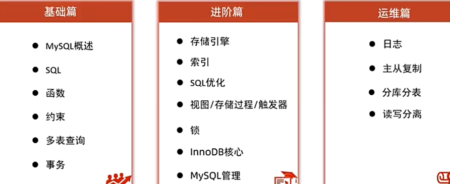

# Database

[toc]

## MySQL

  


### begin

关系型数据库管理系统(RDBMS)：使用表格化数据模型，支持表与表之间的关系。比如MySQL, ORACLE, PostgreSQL
SQL是RDBMS的语言。
非关系型数据库管理系统(NON-RDBMS)：使用非结构化或面向文档的数据模型。比如Redis, mongoDB, neo4j, cassandra.

* DBMS下有多个数据库，数据库下对应对张表
* 表格的一行在java中使用一个对象表示

SQL:

* DDL 数据定义语言 data definition language: CREATE, DROP, ALTER, TRUNCATE
* DML 数据操作语言 manipulation: INSERT, UPDATE, DELETE, CALL
* DQL 数据查询语言 query: SELECT
* DCL 数据控制语言 control: GRANT, REVOKE

### 安装

**Linux**
`sudo apt install mysql-server`: 安装后自动启动
`mysql --version`
`systemctl status mysql`: 查看mysql服务状态，如果没启动：
`systemctl start mysql`

linux系统安装完成之后默认有密码（手动修改）
`sudo cat /etc/mysql/debian.cnf`: 查看密码
`mysql -u debian-sys-maint -p`: 使用默认用户名和密码登录
修改密码
version > 5.7.9

```mysql
alter user 'root'@'localhost' identified with mysql_native_password by 'xiahao';
flush privileges;
# 'root'@'localhost'
```

> 报错参考 [url](https://blog.csdn.net/q258523454/article/details/84555847)

version < 5.7.9

```mysql
update user set password=Password("xiahao") where user='root';
update user set authentication_string=PASSWORD("xiahao") where user='root';
flush privileges;
```

> windows安装时需要手动设置密码

`show variable like '%port%';`: 查看端口
`use mysql; select user, host from user;`: 查看用户访问权限，如果root的host是localhost，表示这个用户只能在本地访问，使用
`update user set host='%' where user='root';`: 改为%，就可以在任何情况下访问了（不建议生产环境下配置，有一定风险）

默认情况下mysql只监听本地ip地址，从外部无法连接到mysql服务，修改如下：

```bash
sudo vim /etc/mysql/mysql.conf.d/mysqld.cnf
# 修改：
bind-address            = 127.0.0.1 # 默认只监听本机IP地址
mysqlx-bind-address     = 127.0.0.1
# 为：
bind-address            = 0.0.0.0 # 修改为监听所有的ip地址
mysqlx-bind-address     = 0.0.0.0
```

windows修改root密码

```bash
use mysql;  
update user set authentication_string=password('xiahao') where user='root' and Host='localhost';
```

windows使用
**mysql是一个数据服务器，监听3306端口；命令行终端或图形化工具(eg navicat)或java程序是client，通过网络连接到服务器.**

* 如果没写-h默认是本机localhost；如果没写-P默认是3306；
* 为了避免被攻击，一般会修改端口号

```bash
net start mysql # 启动mysql服务器后client才可以连接
net stop mysql  # close 
mysql -u root -p
# 全称
mysql -h host/IP -P port -u user -ppassword # -p后无空格 
# example
mysql -h 127.0.0.1 -P 3306 -u root -pxiahao
```

### 基础语句

#### DDL

```sql
# about database
show databases;
create database game;
drop database game; # delete
use game;

# about table
show tables;
create table player (
    id INT DEFAULT 1, # 常用约束包括default, null, not null, unique等, 以及主键约束(每个表只能有一个主键，主键不为空)，外键约束(一个表的外键必须是另一个表的主键)等
    name VARCHAR(100), # 变长字符串 size=100
    level INT,
    exp INT,
    gold DECIMAL(10, 2) # 十进制数值数据
);
drop table player; # 删除table

desc player; # describe 查看表结构
ALTER table player MODIFY COLUMN name VARCHAR(200); # 修改player表中name列结构
alter table player rename column name to nick_name; # 修改player表中name名称为nick_name;
alter table player add column last_login DATETIME; # 给player表添加last_login列，类型为datatime
alter table player drop column last_login; # 删除last_login列
```

#### DML

```sql
INSERT INTO player (id, name, level, exp, gold) VALUES (1, '张三', 1, 1, 1); # 全写的话可省略name
select * from player;
INSERT INTO player (id, name) VALUES (2, '李四'), (3, '王二麻子'); # 插入多条数据
update player set level=1, exp=0, gold=0 where name='李四';
delete from player where gold=0; # 删除gold=0的玩家
```

#### 导入导出

```sql
mysqldump -u root -p game > game.sql # 将数据库导出到文件中，文件内是一些sql创建插入语句
mysql -u root -p game < game.sql # 从文件导入数据
```

#### DQL

```sql
DISTINCT, LIMIT, IN, BETWEEN AND, AND, OR, NOT, LIKE, is null;
WHERE, GROUP BY, HAVING, ORDER BY, DESC, ASC;
UNION: 并集；union two select result, and keep unique.
INTERSECT: 交集；
EXCEPT：差集；
```

select: 检索
distinct: 检索列内不同值
limit: 检索前几个

```sql
SELECT DISTINCT prod_name 
FROM products
LIMIT 5;
# 单行注释
/* 多行
注释 */
```

order by: 根据某列排序，默认升序
desc: 逆序
where: 过滤数据
between A and B: 介于指定区间
!=, <>: 不等于
and, or, not: 组合逻辑
in ('A', 'B'): 属于，in一般比or快
like: 通配符过滤
%: 任意字符出现任意次数，包括0
_: 任意单个字符
[]: 用字符集匹配指定位置的一个字符
REGEXP: 使用正则表达式匹配

**计算字段/函数**
Concat(): 拼接
as: alias
trim(): 删除两侧空白格
ltrim(): 删除左侧空格
lower()
substr(str, begin, len)
sin()
abs()
sqrt()

**聚集函数**
avg()
count()
max()
sum()

**数据分组**：group by必须在where之后 order by之前
group by: 分组
where: 在数据分组之前过滤，过滤掉的行不包括在分组内
having: 在数据分组之后过滤

```sql
SELECT ...      # 要返回的列或表达式
FROM ...        # 被检索数据表
WHERE ...       # 行级过滤
GROUP BY ...    # 分组
HAVING ...      # 组级过滤
ORDER BY ...    # 输出排序顺序
```

**子查询**
一个查询结果作为另一个查询的条件；
即嵌套select

#### 表关联

```sql
INNER JOIN, LEFT JOIN, RIGHT JOIN
```

#### 索引

```sql
CREATE [UNIQUE|FULLTEXT|SPATIAL] INDEX index_name ON 
```

#### 视图

create view

## Redis

Redis: Remote dictionary server
是一个开源的基于内存的数据存储系统，可以用作数据库DB，缓存Cache和消息队列MQ等各种场景。是最热门NoSQL之一。

> 磁盘IO太慢了，so Redis. 性能极高。

支持数据类型
  

使用途径

* CLI: Command Line Interface
* API: Application Programming Interface
* GUI: Graphical User Interface

### install

Linux
`apt install redis`
`redis-server`: open
`redis-cli`: open redis client

windows
wsl, or Docker, or msi file

### use

string
默认使用string存储数据，区分大小写

```sql
SET key value
GET key
DEL key
EXISTS key
keys *: show all keys
flushall: del all keys 
TTL key: time to live 过期时间; -1未设置 -2已过期
EXPIRE key seconds: set ttl
```

List：有序？

```sql
lpush key value [value ...]: 头插法; 
rpush key value [value ...]: 尾插法;  
lpop key; ()
rpop
lrange key start stop: show; (list)
llen key: length of len
ltrim letter start stop: 裁剪两侧
# 可以配合实现一个消息队列
```

Set: 无序、不重复、集合

```sql
sadd key member [member ...]
smembers key: show
sismember key member: is member in set
srem key member: remove
# 交并差
sinter
sunion
sdif
```

SortedSet: 有序（通过给每个元素关联一个socre实现，有点丑系那个）、不重复集合

```sql
zadd key score member [score member]
zrange key start stop: show member; (with scores)
zscore key member: show score of member
zrank key member: show rank of member
zrevrank: reverse rank
zrem
```

Hash: 键值对的集合，这才是真map，要sortedset还有何用(中介？)

```sql
hash key file value
hget key
hdel
hexists
```

发布订阅
缺点：无法记录历史信息 无法持久化

```sql
publish(这tm不是服务端)
subscribe(这tm不就是客户端，可多个)
```
