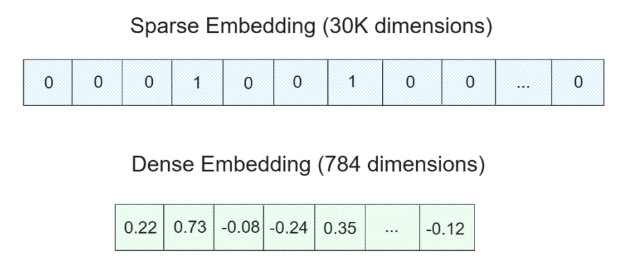

# Milvus

> 向量数据库速成
> eg, Milvus, FAISS 

tutorial link: https://zilliz.com.cn/blog

在具体构建RAG时，主要有四个步骤：数据整理、索引、检索和生成。

1. 数据整理：主要包括数据的收集和预处理，可能会收集每条记录的相关信息和元数据。
2. 索引：使用优化的索引方法来存储数据，从而实现快速检索。在这个步骤中，预处理的数据会通过一个embedding模型，转换为向量embedding，**然后使用FLAT、FAISS或==HNSW==等高级索引算法，存储在Milvus等向量数据库中**。
3. 检索：主要包括向量搜索操作，将用户的查询与存储的数据进行匹配。在这个过程中，用户的查询转换为embedding向量，然后执行相似性搜索，从而在向量数据库中找到最相关的信息。
4. 生成：添加上下文，生成结果。

Q: 在数据整理的时候应该注意什么？

1. 需要先从各种来源（如技术文档、支持与常见问题解答页面以及 GitHub ）收集相关的文本数据。这些文本数据随后被清洗和chunking，以确保每条信息既不过于宽泛，也不过于细碎.
2. 收集每条chunking记录的元数据。这些元数据包括：
   1. 来源类型：数据通常来自GitHub 、技术文档、支持与常见问题解答页面等。
   2. 记录类型：包括数据的版本、文本与代码。如果是代码，还会记录所使用的编程语言。
   3. URL、标签、路径：例如数据来源的URL。这些元数据非常有用，因为它们在LLM生成的响应中，提供了引用或来源链接。
   4. 日期：每条数据的发布日期。

Q: 做embedding的时候我们要考虑什么？

* 我们往往需要思考，到底应该将其转化为稀疏embedding，还是稠密 embedding
* 稀疏embedding通常用于**关键词匹配以及是或非的布尔匹配**。因此，通过稀疏embedding查询到的相关文档，通常包含查询的关键词
  * eg BM25(Best Matching 25): 基于TF-IFD的改进方法，是一种传统的embedding模型
* 稠密embedding则更适合**捕捉查询中的细微差别或语义含义**。通过稠密embedding获取的文档，不一定包含我们所查询的关键词，但它的内容通常与查询高度相关。
  * eg word2vec, text2vec, BERT
* **也可以结合二者模式**：在实际部署中，单纯的语义检索，或者单纯的关键词检索，都是比较少见的。例如，如果我们的查询较短（少于5个词）的内容，那么使用稀疏embedding可能就足够了。而如果我们的查询较长，那么在大多数情况下，使用稠密embedding会提供更好的结果。（改进方向）

  

---

milvus是把向量存在内存中的，当然支持持久化