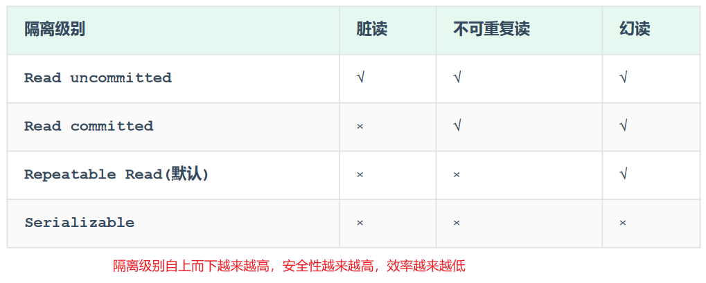

# Database

[toc]

## MySQL

  

### Begin

关系型数据库管理系统(RDBMS)：使用二维表存储数据，支持表与表之间的关系。比如MySQL, ORACLE, PostgreSQL
SQL (Structured Query Language)是RDBMS的语言。
非关系型数据库管理系统(NON-RDBMS)：使用非结构化或面向文档的数据模型。比如Redis, mongoDB, neo4j, cassandra.

* DBMS下有多个数据库，数据库下对应对张表
* 表格的一行在java中使用一个对象表示

SQL分类:

* DDL 数据定义语言 definition: CREATE, DROP, ALTER, TRUNCATE
* DML 数据操作语言 manipulation: INSERT, UPDATE, DELETE, CALL
* DQL 数据查询语言 query: SELECT
* DCL 数据控制语言 control: GRANT, REVOKE

注意：

* 分号结尾
* 关键词建议大写，但都行
* 单行注释： `--` or `#`
* 多行注释：`/* test */`

### 安装

**Linux**
`sudo apt install mysql-server`: 安装后自动启动
`mysql --version`
`systemctl status mysql`: 查看mysql服务状态，如果没启动：
`systemctl start mysql`

linux系统安装完成之后默认有密码（手动修改）
`sudo cat /etc/mysql/debian.cnf`: 查看密码
`mysql -u debian-sys-maint -p`: 使用默认用户名和密码登录
修改密码
version > 5.7.9

```mysql
alter user 'root'@'localhost' identified with mysql_native_password by 'xiahao';
flush privileges;
# 'root'@'localhost'
```

> 报错参考 [url](https://blog.csdn.net/q258523454/article/details/84555847)

version < 5.7.9

```mysql
update user set password=Password("xiahao") where user='root';
update user set authentication_string=PASSWORD("xiahao") where user='root';
flush privileges;
```

> windows安装时需要手动设置密码

`show variable like '%port%';`: 查看端口
`use mysql; select user, host from user;`: 查看用户访问权限，如果root的host是localhost，表示这个用户只能在本地访问，使用
`update user set host='%' where user='root';`: 改为%，就可以在任何情况下访问了（不建议生产环境下配置，有一定风险）

默认情况下mysql只监听本地ip地址，从外部无法连接到mysql服务，修改如下：

```bash
sudo vim /etc/mysql/mysql.conf.d/mysqld.cnf
# 修改：
bind-address            = 127.0.0.1 # 默认只监听本机IP地址
mysqlx-bind-address     = 127.0.0.1
# 为：
bind-address            = 0.0.0.0 # 修改为监听所有的ip地址
mysqlx-bind-address     = 0.0.0.0
```

windows修改root密码

```bash
use mysql;  
update user set authentication_string=password('xiahao') where user='root' and Host='localhost';
```

windows使用
**mysql是一个数据服务器，监听3306端口；命令行终端或图形化工具(eg navicat)或java程序是client，通过网络连接到服务器.**

* 如果没写-h默认是本机localhost；如果没写-P默认是3306；
* 为了避免被攻击，一般会修改端口号

```bash
net start mysql # 启动mysql服务器后client才可以连接
net stop mysql  # close 
mysql -u root -p
# 全称
mysql -h host/IP -P port -u user -ppassword # -p后无空格 
# example
mysql -h 127.0.0.1 -P 3306 -u root -pxiahao
```

#### 导入导出

```sql
mysqldump -u root -p game > game.sql # 将数据库导出到文件中，文件内是一些sql创建插入语句
mysql -u root -p game < game.sql # 从文件导入数据
```

### SQL

#### DDL

```sql
# 数据库操作
show databases;
create database game;   # add
drop database game;     # delete
use game;               # change database
```

```sql
# 表操作
show tables;            # show all tables of current database
desc tableName;         # 查看指定表结构：字段、类型等
show create table tableName;    # 查看指定表的建表语句
# 创建表
create table player (
    id INT DEFAULT 1 comment '编号', # 常用约束包括default, null, not null, unique等, 以及主键约束(每个表只能有一个主键，主键不为空)，外键约束(一个表的外键必须是另一个表的主键)等
    name VARCHAR(100) comment '姓名', # 变长字符串 size=100
    level INT,
    exp INT,
    gold DECIMAL(10, 2) # 十进制数值数据
) comment '用户表';
drop table player; # 删除table
```

数据类型：

* 数值类型: TINYINT(1B), SMALLINT(2B), MEDIUMINT(3B), INT(INTEGER)(4B), BIGINT(8B), FLOAT(4B), DOUBLE(8B), DECIMAL
* 字符串类型: 定长字符串CHAR, 变长VARCHAR(指定长度为最大占用长度)...
  * 定长CHAR更高效
* 日期时间类型: DATE, TIME, YEAR, DATATIME, TIMESTAMP

```sql
# 修改表
alter table player add column nickname varchar(20); # 给player表添加字段; 似乎可以省略column
alter table player modify column name VARCHAR(200); # 修改player表中name列数据结构
alter table player rename/change column name to nick_name; # 修改player表中name名称为nick_name;
alter table player drop column name; # 删除name列
```

#### DML

数据操作语言：**增删改**

```sql
insert into player (id, name, level, exp, gold) values (1, '张三', 1, 1, 1); # 所有字段都写的话可省略name
select * from player;
insert into player (id, name) values (2, '李四'), (3, '王二麻子'); # 插入多条数据
update player set level=1, exp=0, gold=0 where name='李四'; # update
delete from player where gold=0; # 删除gold=0的玩家
```

#### DQL

在一个正常的业务系统中，查询操作的频次是要远高于增删改的

```sql
SELECT      字段列表        # 要返回的列或表达式
FROM        表名列表        # 被检索数据表
WHERE       条件列表        # 行级过滤
GROUP BY    分组字段列表    # 分组
HAVING      分组后条件列表  # 组级过滤
ORDER BY    排序字段列表    # 输出排序顺序
LIMIT       分页参数
```

```sql
# 基础查询
select 字段1, 字段2 from 表名;
select * from tableName;                    # 实际开发中少用，低效
select 字段 as 别名 from ...;                # 设置字段别名
select 字段2 别名2, 字段2 别名2 from ...;     # as可省略
select distinct 字段列表 from ...;           # 去重  
```

```sql
# 条件查询
select column_list from table_name where 条件列表;
```

常用比较运算符：`>, >=, =, <>, !=, BETWEEN ... AND ..., IN(...), LIKE 占位符(模糊匹配(_单字符，%任意字符)), IS NULL`
常用逻辑运算符：`AND / &&, OR / ||, NOT / !`

```sql
# 聚合函数(将一列数据作为整体)
select 聚合函数(字段列表) from table_name;
select count(idcard) from emp; -- 统计idcard字段不为null的记录数
select avg(age) from emp;      -- 统计该企业员工的平均年龄
```

常用聚合函数：`count, max, min, avg, sum`

```sql
# 分组查询
select column_list from table_name [where condition] group by 分组字段名 [having 分组后过滤条件]
select gender, avg(age) from emp group by gender ; -- 根据性别分组 , 统计男性员工 和 女性员工的平均年龄
select workaddress, count(*) address_count from emp where age < 45 group by workaddress having address_count >= 3; 
-- 查询年龄小于45的员工 , 并根据工作地址分组 , 获取员工数量大于等于3的工作地址
```

* where在分组前过滤，过滤掉的不参与分组；having在分组后过滤；
* where不能对聚合函数进行判断；having可以；

```sql
# 排序查询
select column_list from table_name order by 字段1 排序方式1, 字段2 排序方式2;
# ASC (默认升序), DESC
```

```sql
# 分页查询
select column from table limit 起始索引, 查询记录数;
# 查询第1页员工数据, 每页展示10条记录
select * from emp limit 0,10;
select * from emp limit 10;
# 查询第2页员工数据, 每页展示10条记录
select * from emp limit 10,10;
```

```sql
UNION: 并集；union two select result, and keep unique.
INTERSECT: 交集；
EXCEPT：差集；
```

执行顺序：
  

**子查询**
一个查询结果作为另一个查询的条件；
即嵌套select

#### DCL

在MySQL中需要通过User@Host来唯一标识一个用户

```sql
# 管理用户
select * from mysql.user;   -- 查询用户
select Host, User from mysql.user;   -- 查询用户
create user 'userName'@'hostName' identified by 'password'; -- 创建用户
alter user 'userName'@'hostName' identified with mysql_native_password by 'new_password'; -- 修改用户密码
drop user 'userName'@'hostName'; -- 删除用户
# 示例
create user 'itcast'@'localhost' identified by '123456'; -- A. 创建用户itcast, 只能够在当前主机localhost访问, 密码123456;
create user 'heima'@'%' identified by '123456'; -- B. 创建用户heima, 可以在任意主机访问该数据库, 密码123456;
```

```sql
# 权限相关
show grants from 'userName'@'hostName'; -- 查询权限
grant 权限列表 on 数据库名.表名 to 'userName'@'hostName'; -- 授予权限
revoke 权限列表 on 数据库名.表名 from 'userName'@'hostName'; -- 撤销权限
# */all/all privileges 代表所有权限
```

  

### 函数

* 字符串函数
  * concat(s1,s2)
  * lower(s), upper(s)
  * lpad(s, n, pad), rpad() # left/right padding, 使字符串长度为n
  * trim(s): 去掉头尾的空格
  * substring(s, start, len)
* 数值函数
  * ceil(x)
  * floor(x)
  * mod(x,y)
  * rand(): return random value in 0-1
  * round(x,y): 四舍五入 y位小数
* 日期函数
  * curdate()
  * curtime()
  * now(): 返回data和time
  * year(date)
  * month(date)
  * day(date)
  * data_add(date, interval 70 years)
  * datediff(date1, date2)
* 流程函数
  *  
  *   

### 约束

#### 表关联

```sql
INNER JOIN, LEFT JOIN, RIGHT JOIN
```

#### 索引ff

```sql
CREATE [UNIQUE|FULLTEXT|SPATIAL] INDEX index_name ON 
```

#### 视图

create view

### 事务

事务是一组操作的集合，它是一个不可分割的工作单位，事务会把所有的操作作为一个整体一起向系 统提交或撤销操作请求，即这些操作要么同时成功，要么同时失败。（原子性）

```sql
# 手动控制事务方法一（关闭事务自动提交）
select @@autocommit; -- 查看事务提交方式，1表示自动提交
set @@autocommit = 0; -- 设置为手动（session参数，只针对当前窗口有效）
# 设置为手动之后就需要使用commit手动提交事务到数据库
commit;     -- 提交事务
# 设置手动之后 如果执行出错需要回滚（why
rollback;   -- 回滚事务
```

```sql
# 手动控制事务方法二（显式开启事务）
start transaction; -- 开启事务 或者begin
-- 事务操作
commit; -- 提交
rollback; -- 回滚
```

事务四大特性 (ACID)

* 原子性（Atomicity）：事务是不可分割的最小操作单元，要么全部成功，要么全部失败。
* 一致性（Consistency）：事务完成时，必须使所有的数据都保持一致状态。
* 隔离性（Isolation）：数据库系统提供的隔离机制，保证事务在不受外部**并发**操作影响的独立环境下运行。
* 持久性（Durability）：事务一旦提交或回滚，它**对数据库中的数据的改变就是永久**的 (因为存在磁盘中)。

并发事务问题（多个并发事务同时操作某数据库/表所引发的问题）

> 并发会产生并行的幻觉

* **赃读**：A事务读到B事务还未提交的数据
* **不可重复读**：同一事务先后读取同一条记录结果不一致的问题;（为何不叫读不重复）
* **幻读**：一个事务按条件查询数据时，没有对应的数据行，但在插入数据时，又发现该数据已存在，好像出现了"幻影"

事务隔离级别

  
> √表示会出现这种问题

```sql
SELECT @@TRANSACTION_ISOLATION; -- 查看事务隔离级别
SET [ SESSION | GLOBAL ] TRANSACTION ISOLATION LEVEL { READ UNCOMMITTED | READ COMMITTED | REPEATABLE READ | SERIALIZABLE } -- 设置事务隔离级别
```

比如，read uncommitted不可规避脏读问题，A事务**可以**读到B事务还未提交的数据；而read committed可以规避脏读问题，A事务读到B事务还未提交的数据时**会读取之前的数据**，并不会读取uncommitted data，当B事务提交之后select可以读到commited data。但read comitted会出现不可重复读问题。
repeatable read会保证一个事务中查询的数据一致，即使另一个事物commit数据。但会出现幻读问题，去查没有，更新又有，妈的见鬼。
serializable可解决幻读问题：A事务查询数据没有，B事务去insert**会被阻塞**，直到A事务commmit之后。

serializable串行化可以解决所有并发事物问题；我们一般使用默认repeatable read不做修改。

## 进阶

### 存储引擎

  

* 存储引擎：存储数据、建立索引、更新查询数据等技术的实现方式；
* 存储引擎基于表，而非库，所以又名为**表类型**。
* mysql5.5之后默认存储引擎InnoDB，早起是MyISAM；MEMORY存储引擎存在内存中。
* 查询存储引擎`show engines;`

InnoDB：
**support transactions, row-level locking, and foriegn keys**

  

  

MyISAM：

特点：

* 不支持事务，不支持外键
* 支持表锁，不支持行锁
* 访问速度快

文件：

* xxx.sdi：存储表结构信息
* xxx.MYD: 存储数据
* xxx.MYI: 存储索引

Memory:

* 内存存放 快
* hash索引（默认）
* 文件：xxx.sdi：存储表结构信息

  

如何选择存储引擎？
  
MyISAM现在被MongoDB替代，Memory被Redis替代

### 索引

### SQL优化

### 视图/存储过程/触发器

### 锁

### InnoDB引擎

### mysql管理
