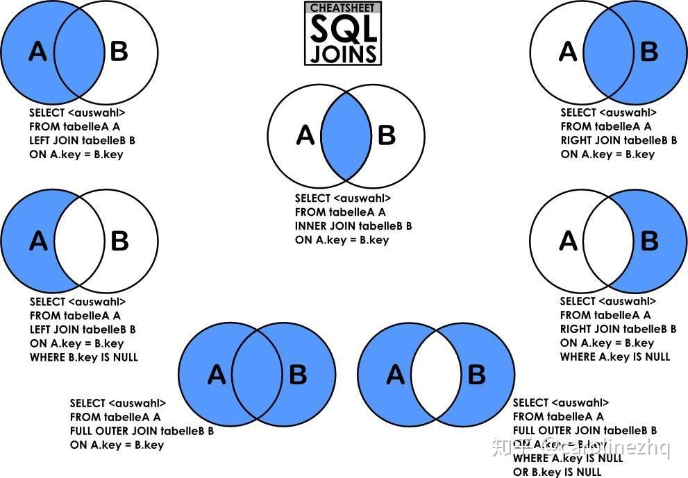
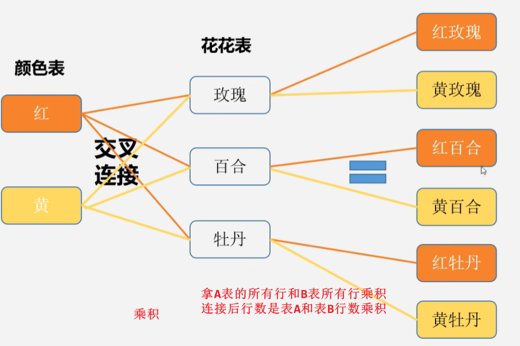
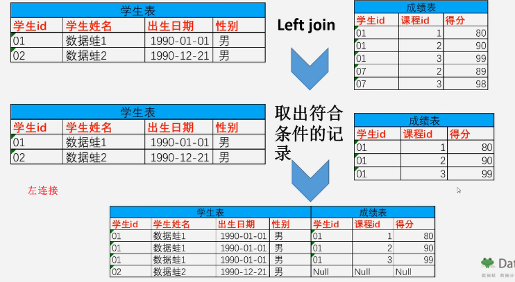
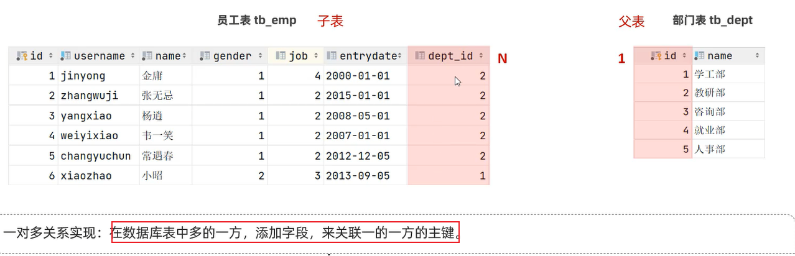
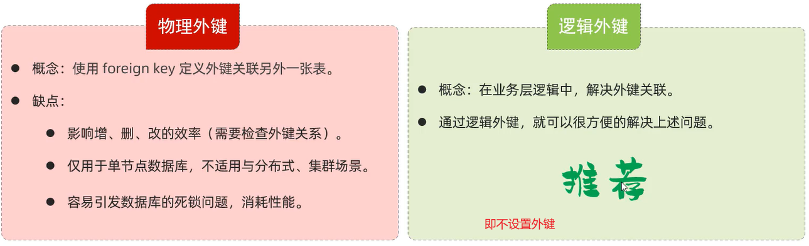

# Database

- [Database](#database)
  - [core](#core)
  - [DQL](#dql)
    - [单表查询](#单表查询)
    - [多表查询](#多表查询)
      - [笛卡尔积/交叉连接](#笛卡尔积交叉连接)
      - [内连接](#内连接)
      - [外连接](#外连接)
      - [内连接示例](#内连接示例)
      - [外连接示例](#外连接示例)
      - [子查询/嵌套查询](#子查询嵌套查询)
    - [Begin](#begin)
    - [SQL](#sql)
      - [DDL](#ddl)
      - [DML](#dml)
      - [DCL](#dcl)
    - [函数](#函数)
    - [多表设计](#多表设计)
      - [一对多](#一对多)
      - [一对一](#一对一)
      - [多对多](#多对多)
    - [事务](#事务)
    - [索引](#索引)
    - [一些指令](#一些指令)
    - [安装](#安装)
      - [导入导出](#导入导出)


经典50道，知乎总结：[link](https://zhuanlan.zhihu.com/p/113173133)
好题：13,15,17,22


```sql
-- 创建学生表student
create table student
     (Sno  varchar(10) not null,
      Sname varchar(10)        ,
      Sage  date               ,
      Ssex  varchar(10)        ,
      primary key (Sno));
insert into student values ('01', '赵雷', '1990-01-01', '男');
insert into student values ('02', '钱电', '1990-12-21', '男');
insert into student values ('03', '孙风', '1990-05-20', '男');
insert into student values ('04', '李云', '1990-08-06', '男');
insert into student values ('05', '周梅', '1991-12-01', '女');
insert into student values ('06', '吴兰', '1992-03-01', '女');
insert into student values ('07', '郑竹', '1989-07-01', '女');
insert into student values ('08', '王菊', '1990-01-20', '女');


-- 创建科目表course
create table course
(Cno varchar(10)  not null,
 Cname varchar(10)     ,
 Tno  varchar(10)      ,
 primary key (Cno));
insert into course values ('01', '语文', '02');
insert into course values ('02', '数学', '01');
insert into course values ('03', '英语', '03');


-- 创建教师表teacher
create table teacher
(Tno varchar(10)   not null,
 Tname varchar(10)  ,
 primary key (Tno));
insert into teacher values ('01', '张三');
insert into teacher values ('02', '李四');
insert into teacher values ('03', '王五');


-- 创建成绩表 sc
create table sc 
(Sno varchar (10)    ,
 Cno varchar (10)    ,
 score decimal(18,1),
 primary key (Sno, Cno));
insert into sc values('01' , '01' , 80);
insert into sc values('01' , '02' , 90);
insert into sc values('01' , '03' , 99);
insert into sc values('02' , '01' , 70);
insert into sc values('02' , '02' , 60);
insert into sc values('02' , '03' , 80);
insert into sc values('03' , '01' , 80);
insert into sc values('03' , '02' , 80);
insert into sc values('03' , '03' , 80);
insert into sc values('04' , '01' , 50);
insert into sc values('04' , '02' , 30);
insert into sc values('04' , '03' , 20);
insert into sc values('05' , '01' , 76);
insert into sc values('05' , '02' , 87);
insert into sc values('06' , '01' , 31);
insert into sc values('06' , '03' , 34);
insert into sc values('07' , '02' , 89);
insert into sc values('07' , '03' , 98);
```

## core

* 执行顺序是: from -> where -> group by + having -> select -> order by -> limit
  * 所以对于count(*)这种聚合函数，order by可以直接使用select后面的别名，但having不可，还得写出聚合函数（待验证）
* **聚合函数**
  * 使用group by分组之后，查询的字段只能是**聚合键**(分组字段)、聚合函数和常数(数字/字符/时间)
  * 聚合函数(avg/sum/count/max)一般和group by搭配使用，**where后面不可使用聚合函数**（考虑放在having后面/变成子查询放在where后面）
    * `select . from . where 分组前过滤条件 group by . having 分组后过滤条件`
* **子查询**
  * **当select的结果列(要查询的字段)全来自一张表（而select的条件列来自于不同表），考虑子查询；如果结果列来自多张表，考虑联结。**
  * 子查询一般配合in/not in（可以考虑使用not in来使用**补集**(所有/全部/都)）
  * > 内部select语句无需加分号
  * > 内部select返回一个单行单列数据时，外部select可以用`=`或`in`，返回多个数据时，外部一般用`in`(不如统一用in得了)
* **inner join/内连接**
  * 结果列来自多张表，考虑使用联结
  <!-- * 隐式内连接: `select * from table1, table2 where CONDITION` -->
  * 显式内连接: `select * from table1 as a inner join table as b on a.id = b.id`
* limit **偏移量** 查询记录数
  * `limit 5`等价于`limit 0 5`: 表示返回前5条
  * `limit 10 5`: 表示跳过前10条记录，返回从**11**开始的5条记录；常用于分页查询
    * 等价于`limit 5 offset 10`
* distinct field: 字段去重
* 判断是否为空: is null / is not null
* 一般来说字符串必须加引号(eg where name = 'xiaoming')，但列名和别名无需加引号(eg name字段)，一般使用单引号
* 等于使用=，不等用!=或<>, in ('a', 'b', 'c')
* 匹配机制
  * `_`匹配任意一个字符
  * `%`匹配任意0个或多个字符
  * `[]`匹配[]内的任意一个字符
    * `SELECT * FROM 学生表 WHERE 姓名 LIKE '[张李刘]%'`//查询学生表中姓‘张’、姓‘李’和姓‘刘’的学生的情况。
  * `[^]`不匹配[]内的任意一个字符
    * `SELECT * FROM 学生表 WHERE 学号 LIKE '%[^235]'` //从学生表表中查询学号的最后一位不是2、3、5的学生信息。

  


高级特性

* where后使用or连接两个条件时，只有两个字段都是索引，or才能让索引生效，如果只有一个是索引，则二者都失效；故而可以使用两个select然后union结果，这样任意其一是索引均可生效

## DQL

### 单表查询

在一个正常的业务系统中，查询操作的频次是要远高于增删改的
{width=60%}

```sql
# 基础查询
select 字段1, 字段2 from 表名;
select * from tableName;                    # 实际开发中少用，低效且不直观
select 字段 as 别名 from ...;                # 设置字段别名
select 字段2 别名2, 字段2 别名2 from ...;     # as可省略
select distinct 字段列表 from ...;           # 去重  
```

```sql
# 条件查询
select column_list from table_name where 条件列表;
```

常用比较运算符：`>, >=, =, <>, !=, between ... and ..., in(...), like 占位符(模糊匹配(_单字符，%任意字符)), is null`
常用逻辑运算符：`and / &&, or / ||, not / !`

```sql
# 聚合函数(将一列数据作为整体进行纵向计算)
select 聚合函数(字段列表) from table_name;
select count(idcard) from emp; -- 统计idcard字段不为null的记录数
select avg(age) from emp;      -- 统计该企业员工的平均年龄
```

常用聚合函数：`count(不统计null), max, min, avg, sum`
统计行数: `count(字段), count(常量), count(*)(推荐，底层有特别优化)`都行

---

**分组查询**: `select 字段列表 from 表名 [where 条件] group by 分组字段名列表 [having 分组后过滤条件]`

* **==where vs. having==**
  * 执行时机不同：where是在分组之前过滤，不满足where条件的记录不参与分组，having是在分组之后过滤记录
  * 判断条件不同：where不能对聚合函数进行判断(因为一般分组之后才聚合嘛)，having都可以。(`eg having count(*)>2; having gender=1;`)
* **分组之后，查询的字段一般是==分组字段和聚合函数==，查询其他字段没有任何意义**
* 执行顺序: from -> where -> group by + having -> select -> order by -> limit

```sql
-- 根据性别分组 , 统计男性员工 和 女性员工的平均年龄
select gender, avg(age) from emp group by gende;
-- 查询年龄小于45的员工 , 并根据工作地址分组 , 获取员工数量大于等于3的工作地址
select workaddress, count(*) address_count from emp where age < 45 group by workaddress having address_count >= 3;
```

**排序查询**
```sql
select column_list from table_name order by 字段1 排序方式1, 字段2 排序方式2;
# ASC (默认升序), DESC
```

**分页查询**
```sql
select column from table limit 起始索引, 查询记录数;
# 查询第1页员工数据, 每页展示10条记录
select * from emp limit 0,10;
select * from emp limit 10;
# 查询第2页员工数据, 每页展示10条记录
select * from emp limit 10,10;
```

起始索引 = (页码 - 1) * 每页展示记录数

```sql
UNION: 并集；union two select result, and keep unique.
INTERSECT: 交集；
EXCEPT：差集；
```

---

**执行顺序**：
{width=70%}

### 多表查询

1. 我们一般是先写连接部分，再写select后面的查询字段；你一定**要知道连接之后的表格长什么样子**
2. **连接后有行数据和列数据，行数据通过where语句来进行筛选，列数据通过select来选择进行展示**

#### 笛卡尔积/交叉连接

如果直接`select * from tableA, tableB`将返回笛卡尔积：类似于矩阵外积，CLIP的language和image的乘积。
直接这么搞是没意义的，但是是其他连接的基础。**必须要消除那些无效的笛卡尔积**。

{width=30%}

{width=50%}


#### 内连接

* inner join（内连接）: 返回两个表中匹配条件的**交集**记录
* 隐式内连接: `select 列名1, 列名2 from 左表, 右表 where 条件...`
* 显示内连接：`select 列名1, 列名2 from 左表 inner join 右表 on 连接条件`

{width=50%}

#### 外连接

* 左(外)连接
* **right join（右外连接）**:
  * 右外调个顺序就变成左外了: `A right join B -> B left join A`
* full join（全连接）: 返回两个表中的所有记录，不论是否匹配。（MySQL通过UNION来连接两个select语句）

**以下详述左外连接：**

```sql
SELECT 列名1, 列名2, ...
FROM 左表
LEFT JOIN 右表
ON 左表.共同列 = 右表.共同列;
```

* **left join（左外连接）**: 返回左表的所有记录和右表中满足条件的记录
  * 得到的数据是一个合并的表格，有两个表的所有字段（对于那些在右表中没有匹配的左表记录，右表相关字段将显示为NULL），第一个字段就是连接条件了，连接条件包含左表所有记录，和右表中匹配了的记录
  * 如果你只想要左侧部分(eg 上图`A-(A∩B)`部分)：加个`where b.x is null`

{width=70%}

#### 内连接示例

```sql
-- 查询员工姓名 和 对应部门名称
-- 隐式内连接
select tb_emp.name, tb_dept.name from tb_dept, tb_emp where tb_emp.dept_id = tb_dept.id;
-- 显式内连接
select tb_emp.name, tb_dept.name from tb_emp inner join tb_dept on tb_emp.dept_id = tb_dept.id;
```

#### 外连接示例

```sql
-- 查询员工表*所有*员工的姓名 和 对应的部门名称 (左外连接: 会完全包含左表数据，交集 + 包括null(左表有 右表无))
select tb_emp.name, tb_dept.name from tb_emp left outer join tb_dept on tb_emp.dept_id=tb_dept.id;
-- 查询部门表*所有*部门的名称 和 对应的员工名称 (右外连接: 包含交集 + 右表部门表有 左表员工表无)
select d.name, e.name from tb_emp e right join tb_dept d on e.dept_id=d.id; -- 注意右表放部门表
-- 右外可以完全替换成左外（实际开发中一般使用左外）
select d.name, e.name from tb_dept d left join tb_emp e on e.dept_id=d.id;
```

#### 子查询/嵌套查询

* 先写内层查询，再写外层
* select的结果列全部来自同一张表（而select的条件列来自不同表里），考虑子查询；select的结果列来自多张表，考虑联结

一个查询结果作为另一个查询的条件；


```sql
-- 标量子查询
-- 查询"教研部"的所有员工信息 (分解为：a:查询教研部对应id；b:找到员工id等于该id的条目)
select * from tb_emp where dept_id = (select id from tb_dept where name='教研部');
-- 查询"方东白"员工入职之后的员工信息 (分解为：a:查询方东白入职时间；b:...)
select * from tb_emp where entrydate >= (select entrydate from tb_emp where name = '方东白');

-- 列子查询
-- 查询"教研部"和"咨询部"的所有员工信息
select * from tb_emp where dept_id in (select id from tb_dept where name = '教研部' or name = '咨询部');

-- 行子查询
-- 查询与"韦一笑"的*入职日期及职位*都相同的员工 (两次子查询)
select * from tb_emp where entrydate = (select entrydate from tb_emp where name = '韦一笑')
                       and job = (select job from tb_emp where name = '韦一笑');
-- 优化一手 支持这种写法(A,B)=  (一次子查询)
select * from tb_emp where (entrydate, job) = (select entrydate, job from tb_emp where name = '韦一笑');

-- 表子查询 (将子查询作为临时表使用)
-- 查询入职日期是"2006-01-01"之后的员工信息，及其部门名称
-- 先查到日期符合的员工作为临时表来使用
select tmp.*, tb_dept.name from (select * from tb_emp where entrydate > '2006-01-01') tmp, tb_dept
    where tmp.dept_id=tb_dept.id;

```


### Begin

关系型数据库管理系统(RDBMS)：使用二维表存储数据，支持表与表之间的关系。比如MySQL, ORACLE, PostgreSQL
SQL (Structured Query Language)是RDBMS的语言。
非关系型数据库管理系统(NON-RDBMS)：使用非结构化或面向文档的数据模型。比如Redis, mongoDB, neo4j, cassandra.

* DBMS下有多个数据库，数据库下对应对张表
* 表格的一行在java中使用一个对象表示

SQL分类:

* DDL 数据定义语言(数据库设计) definition: CREATE, DROP, ALTER, TRUNCATE
* DML 数据操作语言(增删改) manipulation: INSERT, UPDATE, DELETE, CALL
* DQL 数据查询语言 query: SELECT
* DCL 数据控制语言 control: GRANT, REVOKE

注意：

* 分号结尾
* 关键词建议大写，但都行
* 单行注释： `--` or `#`
* 多行注释：`/* test */`

### SQL

#### DDL

```sql
# 数据库操作
show databases;
create database/schema game;   # add
drop database game;     # delete
use game;               # change database
```

```sql
# 表操作
show tables;            # show all tables of current database
desc tableName;         # 查看指定表结构：字段、类型等
show create table tableName;    # 查看指定表的建表语句
# 创建表 (重点)
create table player (
    id INT DEFAULT 1 comment '编号', # 常用约束包括default, null, not null, unique等, 以及主键约束(每个表只能有一个主键，主键不为空)，外键约束(一个表的外键必须是另一个表的主键)等
    name VARCHAR(100) comment '姓名', # 变长字符串 size=100
    level INT,
    exp INT,
    gold DECIMAL(10, 2) # 十进制数值数据
) comment '用户表';
drop table player; # 删除table
```

**用于限制表中字段的规则**
  

数据类型：

* **数值**类型: tinyint(1B), smallint(2B), mediumint(3B), int(integer)(4B), bigint(8B), float(4B), double(8B), decimal(字符串处理小数)
  * 默认是有符号类型，可以通过unsigned指定为无符号；eg int unsigned
  * double(5,2)表示2位小数，总共5位数
* **字符串**类型: 定长字符串char(0-255B), 变长varchar(0-65535B)(指定长度为最大占用长度), tinyblob(0-255B)(binary large object存储不超过255B的二进制数据), tinytext(0-255B)(短文本字符串), blob/text(0-65535B), mediumblob/mediumtext(0-1600wB), longblob/longtext(0-40亿B)
  * char(10)表示最多只能存10字符，不足也占用10B；而varchar(10)不足时按实际情况存储；char更高效，浪费空间。
* **日期时间**类型: **date**(YYYY-MM-DD), time(HH:MM:SS), year(YYYY), **datetime**(YYYY-MM-DD HH:MM:SS), timestamp

```sql
# 修改表 (不重要 可视化操作就完了)
alter table player add column nickname varchar(20); # 给player表添加字段; 似乎可以省略column
alter table player modify column name VARCHAR(200); # 修改player表中name列数据结构
alter table player change column name to nick_name; # 修改player表中name名称为nick_name;
alter table player drop column name; # 删除name列
rename table player to new_name; # 修改表名
```

#### DML

数据操作语言：**增删改** insert delete update
  
  
  

```sql
insert into player (id, name, level, exp, gold) values (1, '张三', 1, 1, 1); # 所有字段都写的话可省略name
select * from player;
insert into player (id, name) values (2, '李四'), (3, '王二麻子'); # 插入多条数据
update player set level=1, exp=0, gold=0 where name='李四'; # update
delete from player where gold=0; # 删除gold=0的玩家
```

#### DCL

在MySQL中需要通过User@Host来唯一标识一个用户

```sql
# 管理用户
select * from mysql.user;   -- 查询用户
select Host, User from mysql.user;   -- 查询用户
create user 'userName'@'hostName' identified by 'password'; -- 创建用户
alter user 'userName'@'hostName' identified with mysql_native_password by 'new_password'; -- 修改用户密码
drop user 'userName'@'hostName'; -- 删除用户
# 示例
create user 'itcast'@'localhost' identified by '123456'; -- A. 创建用户itcast, 只能够在当前主机localhost访问, 密码123456;
create user 'heima'@'%' identified by '123456'; -- B. 创建用户heima, 可以在任意主机访问该数据库, 密码123456;
```

```sql
# 权限相关
show grants from 'userName'@'hostName'; -- 查询权限
grant 权限列表 on 数据库名.表名 to 'userName'@'hostName'; -- 授予权限
revoke 权限列表 on 数据库名.表名 from 'userName'@'hostName'; -- 撤销权限
# */all/all privileges 代表所有权限
```

  

### 函数

* 字符串函数
  * concat(s1,s2)
  * lower(s), upper(s)
  * lpad(s, n, pad), rpad() # left/right padding, 使字符串长度为n
  * trim(s): 去掉头尾的空格
  * substring(s, start, len)
* 数值函数
  * ceil(x)
  * floor(x)
  * mod(x,y)
  * rand(): return random value in 0-1
  * round(x,y): 四舍五入 y位小数
* 日期函数
  * curdate()
  * curtime()
  * now(): 返回data和time
  * year(date)
  * month(date)
  * day(date)
  * data_add(date, interval 70 years)
  * datediff(date1, date2)
* 流程函数
  *  
  *   

### 多表设计

* 一对多：在“部门-员工”场景中，部门是1，员工是多，即多个员工(user_id)可能对应着一个部门(dept_id)；可以考虑在多的一方引入外键
* 一对一：一般是单表拆分为多表，eg 在“用户-身份证信息”场景中
* 多对多：在“学生-课程”场景中，一个学生(tb_student)可以选修多门课程，一个课程(tb_course)也可以供多个学生选择，此时就需要建立第三张中间表，内含两个外键，分别关联两个主键


#### 一对多

在多的一方添加外键

  

  

> 项目开发中很少使用物理外键，甚至被禁止

#### 一对一

  

#### 多对多

  

### 事务

事务是一组操作的集合，它是一个不可分割的工作单位，事务会把所有的操作作为一个整体一起向系 统提交或撤销操作请求，即这些操作**要么同时成功，要么同时失败**。（原子性）

```sql
# 手动控制事务方法一（关闭事务自动提交）
select @@autocommit; -- 查看事务提交方式，1表示自动提交
set @@autocommit = 0; -- 设置为手动（session参数，只针对当前窗口有效）
# 设置为手动之后就需要使用commit手动提交事务到数据库
commit;     -- 提交事务
# 设置手动之后 如果执行出错需要回滚（why
rollback;   -- 回滚事务
```

```sql
# 手动控制事务方法二（显式开启事务）[推荐]
start transaction; -- 开启事务 或者begin
-- 事务操作
commit; -- 提交
rollback; -- 回滚
```

### 索引

```sql
-- 创建普通索引
create index index_name on table_name(column_name) 
-- 创建唯一索引
create unique index index_name on table_name(column_name) 
-- 创建复合索引
create index index_name on table_name(column1, column2) 
-- 创建全文索引
create fulltext index index_name on table_name(column_name) 
-- 创建前缀索引 (提取前n个字符构建索引)
create index index_name on table_name (column_name(n))
```

### 一些指令

```sql
-- 查询当前数据库的增删改查频率
show [session | global] status like 'com_______';
```

可以通过慢查询日志来查看哪些sql语句的执行时间超过了指定参数; 还可以通过profiles查看每条语句的时间（需要先配置开启）

```sql
-- 查询每条sql的耗时
show profiles;
-- 查询指定id的sql的具体耗时
show profiles for query id;
explain + sql语句 -- 查询该语句执行计划 挺好用的
```

`show processlist;`: 查看有多少客户端连接了mysql服务
`kill connect +id`: kill客户端连接
`show variables like 'max_connections';`: 查询客户端连接数，默认151个

```sql
SELECT @@TRANSACTION_ISOLATION; -- 查看事务隔离级别
SET [ SESSION | GLOBAL ] TRANSACTION ISOLATION LEVEL { READ UNCOMMITTED | READ COMMITTED | REPEATABLE READ | SERIALIZABLE } -- 设置事务隔离级别
```


### 安装

**Linux**
`sudo apt install mysql-server`: 安装后自动启动
`mysql --version`
`systemctl status mysql`: 查看mysql服务状态，如果没启动：
`systemctl start mysql`

linux系统安装完成之后默认有密码（手动修改）
`sudo cat /etc/mysql/debian.cnf`: 查看密码
`mysql -u debian-sys-maint -p`: 使用默认用户名和密码登录
修改密码
version > 5.7.9

```mysql
alter user 'root'@'localhost' identified with mysql_native_password by 'xiahao';
flush privileges;
# 'root'@'localhost'
```

> 报错参考 [url](https://blog.csdn.net/q258523454/article/details/84555847)

version < 5.7.9

```mysql
update user set password=Password("xiahao") where user='root';
update user set authentication_string=PASSWORD("xiahao") where user='root';
flush privileges;
```

> windows安装时需要手动设置密码

`show variable like '%port%';`: 查看端口
`use mysql; select user, host from user;`: 查看用户访问权限，如果root的host是localhost，表示这个用户只能在本地访问，使用
`update user set host='%' where user='root';`: 改为%，就可以在任何情况下访问了（不建议生产环境下配置，有一定风险）

默认情况下mysql只监听本地ip地址，从外部无法连接到mysql服务，修改如下：

```bash
sudo vim /etc/mysql/mysql.conf.d/mysqld.cnf
# 修改：
bind-address            = 127.0.0.1 # 默认只监听本机IP地址
mysqlx-bind-address     = 127.0.0.1
# 为：
bind-address            = 0.0.0.0 # 修改为监听所有的ip地址
mysqlx-bind-address     = 0.0.0.0
```

windows修改root密码

```bash
use mysql;  
update user set authentication_string=password('xiahao') where user='root' and Host='localhost';
```

windows使用
**mysql是一个数据服务器，监听3306端口；命令行终端或图形化工具(eg navicat)或java程序是client，通过网络连接到服务器.**

* 如果没写-h默认是本机localhost；如果没写-P默认是3306；
* 为了避免被攻击，一般会修改端口号

```bash
net start mysql # 启动mysql服务器后client才可以连接
net stop mysql  # close 
mysql -u root -p
# 全称
mysql -h host/IP -P port -u user -ppassword # -p后无空格 
# example
mysql -h 127.0.0.1 -P 3306 -u root -pxiahao
```

#### 导入导出

```sql
mysqldump -u root -p game > game.sql # 将数据库导出到文件中，文件内是一些sql创建插入语句
mysql -u root -p game < game.sql # 从文件导入数据
```
