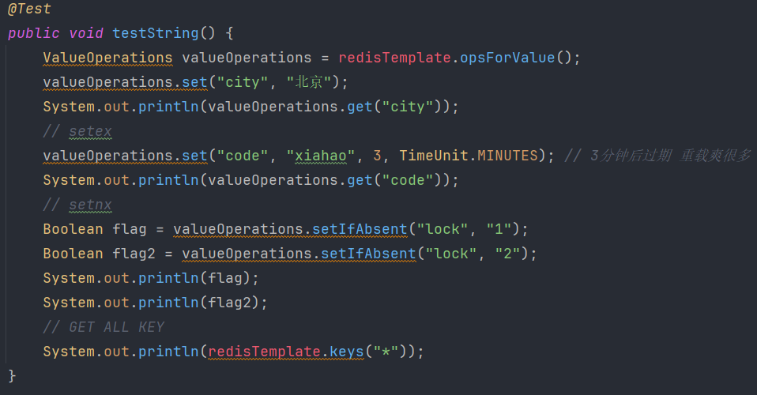
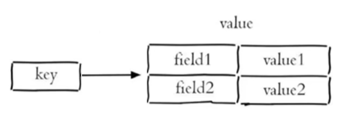
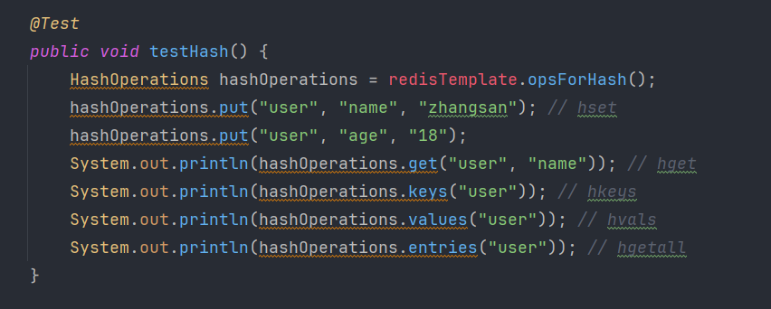

# Redis

Redis: Remote dictionary server
是一个开源的基于内存的数据存储系统，可以用作数据库DB，缓存Cache和消息队列MQ等各种场景。是最热门NoSQL之一。

> 磁盘IO太慢了，so Redis. 性能极高。

支持数据类型
  

使用途径

* CLI: Command Line Interface
* API: Application Programming Interface
* GUI: Graphical User Interface

## install

Linux
`apt install redis`
`redis-server`: open
`redis-cli`: open redis client

windows
wsl, or Docker, or msi file

## use

### 通用命令

```sql
KEYS pattern # 查找符合pattern的key
keys *: show all keys
EXISTS key
DEL key
TYPE key # 查类型
flushall: del all keys 
```

### string

默认使用string存储数据，区分大小写

```sql
SET key value # 设置指定key的value
GET key # 查询
SETEX key seconds value # 设置值，并设置key的过期时间 (常用于短信验证名到点过期)
SETNX key value # 只有key不存在时设置key的值
TTL key: time to live 过期时间; -1未设置 -2已过期
EXPIRE key seconds: set ttl
```

  

### Hash: 键值对的集合(类似于Java.HashMap)

是一个String类型的field和value的映射表(注意这俩才组成key-value中的value奥，前面的key并不在内)

==说明一点：Redis我们说的都是存的String，但这里的String并不等同于java.String，我们在Java中使用Redis是可以传递任意类型数据的, ie Object，它会自动将该对象序列化为redis的string==

  

```sql
# note!!! 注意这里的key是redis的key-value中的key，field才是Hash的'key'
HSET key field value # 设置 
HGET key field # 获取（需要指定Hash的key
HDEL key field # 删除
HKEYS key # 获取哈希表中所有字段
HVALS key # 获取所有值 
HEXISTS key field
```

  

### List：有序(类似于java.List 操作很queue)

Redis的List是简单的字符串列表 按插入顺序排序

```sql
lpush key value [value ...]: 头插法; 
rpush key value [value ...]: 尾插法;  
lpop key; ()
rpop
lrange key start stop # 获取指定范围的数据 有点像分页查询
llen key: length of len
ltrim letter start stop: 裁剪两侧
# 可以配合实现一个消息队列
```

### Set: 无序、不重复、集合(类似于Java.HashSet)

reids set是string类型的无序集合

```sql
SADD key member [member ...] # 添加
SMEMBERS key # 查询
SCARD key # 查询数量
sismember key member: is member in set
srem key member: remove
# 交并差
sinter key1 [key2]
sunion
sdif
```

### SortedSet: 有序集合（给每个元素关联一个socre，根据score升序排序）、不重复集合

reids 有序集合也是string类型的无序集合 特点是有个score
常用于排行榜

```sql
zadd key score member [score member]
zrange key start stop: show member; (with scores)
zscore key member: show score of member
zincrby key increment member # 给指定成员分数添加增量increment
zrank key member: show rank of member
zrevrank: reverse rank
zrem # 删除
```

### 发布订阅

缺点：无法记录历史信息 无法持久化

```sql
publish(这tm不是服务端)
subscribe(这tm不就是客户端，可多个)
```
