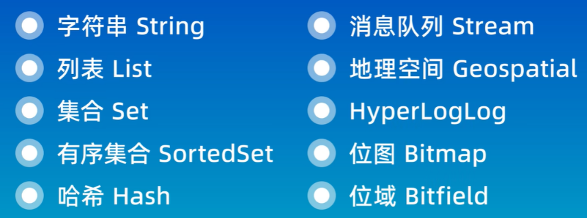

# Redis

Redis: Remote dictionary server
是一个开源的基于内存的数据存储系统，可以用作数据库DB，缓存Cache和消息队列MQ等各种场景。是最热门**NoSQL**之一。

> 磁盘IO太慢了，so Redis. 性能极高。

支持数据类型
  

使用途径

* CLI: Command Line Interface
* API: Application Programming Interface
* GUI: Graphical User Interface

传统关系型数据库会基于Sql语句做查询，语法有统一标准；
而不同的非关系数据库查询语法差异极大，五花八门各种各样。


  

## install

Linux
`apt install redis`
`redis-server`: open
`redis-cli`: open redis client

windows
wsl, or Docker, or msi file

> redis-server启动redis服务端，redis-cli启动客户端
> 可以配置redis.conf来让服务端后台运行
> redis-cli -h host -p port -a pwd
> ping -> pong表示连接成功

## use

  

==首先学会这俩：==

* `help @generic`: 列出所有generic命令和解释
* `help @set`: 列出所有set命令和解释
* `help sadd`: 解释sadd命令

### 通用命令

```sql
KEYS pattern # 查找符合pattern的key
keys *: show all keys
EXISTS key
DEL key
TYPE key # 查类型
flushall: del all keys 
expire: 设置过期时间seconds（内存很宝贵
ttl: 查询一个key的剩余有效期；-2表示expire；-1表示未设置过期时间
```

### String

默认使用string存储数据，区分大小写
> 存储普通字符串、整数类型、浮点类型都叫字符串，但格式不同，整数和浮点数可以自增自减

```sql
SET key value # 设置指定key的value
GET key # 查询
MSET, MGET
INCR # 让一个整型的key自增（可指定负数
INCRBY # 按指定步长自增
SETEX key seconds value # 设置值，并设置key的过期时间 (常用于短信验证名到点过期)
SETNX key value # 只有key不存在时设置key的值
```

> SET如果key不存在是新增，存在时是修改

  

  
==说明一点：Redis我们说的都是存的String，但这里的String并不等同于java.String，我们在Java中使用Redis是可以传递任意类型数据的, ie Object，它会自动将该对象序列化为redis的string==

### Hash

Hash类型，也叫散列，其value是一个无序字典，类似于Java中的HashMap结构。

是一个String类型的field和value的映射表(注意这俩才组成key-value中的value奥，前面的key并不在内)
  


```sql
# note!!! 注意这里的key是redis的key-value中的key，**field才是Hash的'key'**
HSET key field value # 设置 
HGET key field # 获取（需要指定Hash的key
HMSET, HMGET
HGETALL # 获取一个hash类型的key中的所有的field和value
HKEYS key # 获取一个hash类型的key中的所有的field
HVALS key # 获取所有值 
HEXISTS key field
HDEL key field # 删除
```

  

### List

Redis中的List类型与Java中的LinkedList类似，可以看做是一个双向链表结构。既可以支持正向检索和也可以支持反向检索。(queue的特性)

有序、可重复、增删快、查询速度一般

Redis的List是简单的字符串列表 按插入顺序排序

```sql
lpush key value [value ...]: 头插法; 
rpush key value [value ...]: 尾插法;  
lpop key; rpop
lrange key start stop # 获取指定范围的数据 有点像分页查询
llen key: length of len
# 可以配合实现一个消息队列
```

### Set

Redis的Set结构与Java中的HashSet类似，可以看做是一个value为null的HashMap。因为也是一个hash表，因此具备与HashSet类似的特征：

无序、不重复、查找快、支持交并差操作

reids set是string类型的无序集合

```sql
SADD key member [member ...] # 添加
SREM # 移除
SMEMBERS key # 查询set中所有元素
SISMEMBER # 判断一个元素是否在set中
SCARD key # 查询数量
sismember key member: is member in set
# 交并差
sinter key1 [key2]
sunion
sdif
```

### SortedSet / ZSet

Redis的SortedSet是一个可排序的set集合，与Java中的TreeSet有些类似，但底层数据结构却差别很大。SortedSet中的**每一个元素都带有一个score属性**，可以基于score属性对元素排序，底层的实现是一个跳表（SkipList）加 hash表。

可排序、不重复、查询速度快

常用于排行榜

```sql
zadd key score member [score member]
zrem # 删除
zscore key member: 获取zset指定元素的score
zrank key member:获取zset指定元素的排名
zrange key min max：按照score排序后，获取指定排名范围内的元素
zcard key: 获取指定元素个数
ZCOUNT key min max：统计score值在给定范围内的所有元素的个数
zincrby key increment member # 给指定成员分数添加增量increment
ZDIFF, ZINTER, ZUNION # 求差集.交集.并集
```

注意：所有的排名默认都是升序，如果要降序则在命令的Z后面添加REV即可，例如：

**升序**获取sorted set 中的指定元素的排名：ZRANK key member
**降序**获取sorted set 中的指定元素的排名：ZREVRANK key memeber

### 发布订阅

缺点：无法记录历史信息 无法持久化

```sql
publish(这tm不是服务端)
subscribe(这tm不就是客户端，可多个)
```

### java

  
