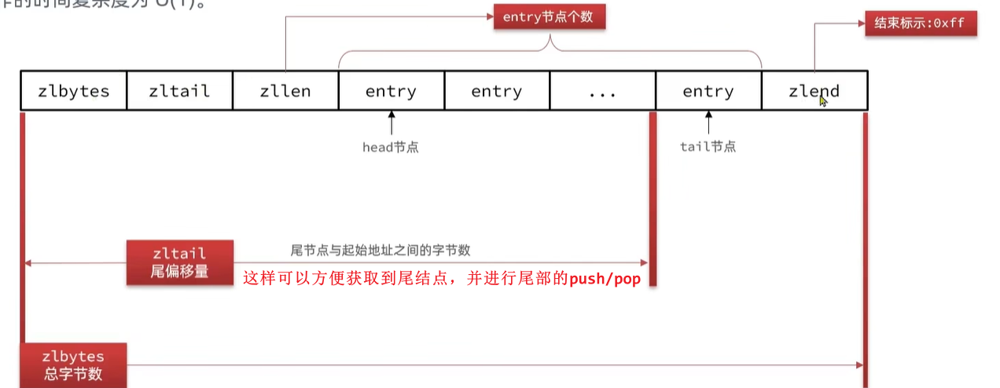
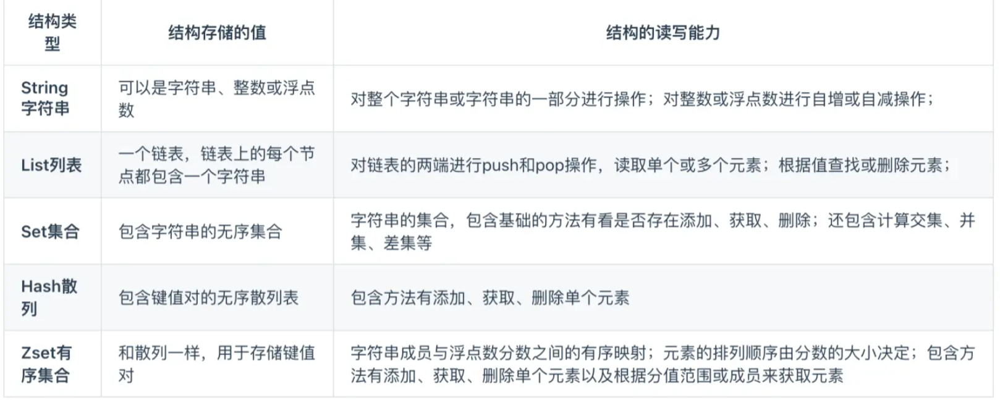

# Redis八股

- [Redis八股](#redis八股)
  - [基础](#基础)
    - [什么是Redis](#什么是redis)
    - [redis可以用来做什么](#redis可以用来做什么)
    - [为何要用Redis作为MySQL的缓存](#为何要用redis作为mysql的缓存)
  - [Redis数据结构](#redis数据结构)
    - [简单动态字符串SDS](#简单动态字符串sds)
    - [整数集合IntSet](#整数集合intset)
    - [Dict](#dict)
      - [Dict扩容与缩容 (include rehash)](#dict扩容与缩容-include-rehash)
    - [ZipList](#ziplist)
    - [QuickList](#quicklist)
    - [SkipList](#skiplist)
    - [RedisObject](#redisobject)
    - [String](#string)
    - [Redis数据结构及使用场景](#redis数据结构及使用场景)
    - [Zset的底层实现](#zset的底层实现)
  - [Redis线程模型/网络模型](#redis线程模型网络模型)
    - [Redis为什么快](#redis为什么快)
    - [Redis是单线程还是多线程](#redis是单线程还是多线程)
    - [redis哪些地方使用了多线程](#redis哪些地方使用了多线程)
    - [redis网络模型](#redis网络模型)
  - [缓存](#缓存)
    - [数据库与缓存的一致性](#数据库与缓存的一致性)
    - [缓存穿透](#缓存穿透)
      - [详解布隆过滤器](#详解布隆过滤器)
    - [缓存雪崩](#缓存雪崩)
    - [缓存击穿 / 热点key问题](#缓存击穿--热点key问题)
  - [事务](#事务)
    - [如何实现redis原子性](#如何实现redis原子性)
  - [持久化](#持久化)
    - [RDB](#rdb)
    - [AOF](#aof)
    - [RDB vs. AOF](#rdb-vs-aof)
  - [高可用](#高可用)
    - [主从集群](#主从集群)
      - [介绍下主从复制](#介绍下主从复制)

## 基础

### 什么是Redis

Redis: Remote Dictionary Service

* Redis是一种基于键值对(key-value)的**NoSQL**数据库，对数据的读写操作都是在**内存**中完成，因此读写速度非常快，常用于**缓存cache**，**消息队列mq**、**分布式锁**等场景
  * redis可以将内存数据持久化到磁盘上，并不会断电丢失
* Redis提供了多种数据类型来支持不同的业务场景，并且**对数据类型的操作都是原子性**的，因为执行命令由单线程负责的，**不存在并发竞争的问题**
* Redis还支持**事务、持久化、Lua脚本、多种集群方案（主从复制模式、哨兵模式、切片机群模式）、发布/订阅模式，内存淘汰机制、过期删除机制**等等。

### redis可以用来做什么

1. **缓存**：由于所有数据都存在内存中，读写速度远超基于磁盘存储的数据库(mysql)，所以使用redis作为缓存可以极大地提高应用的响应速度和吞吐量
2. **分布式锁**：Redis可以实现分布式锁，用来控制跨多个进程或服务器的资源访问
3. **消息队列**：充当简单的消息队列，依赖发布/订阅模式(Pub/Sub)
4. **排行榜**/计数器：Redis的ZSet非常适合用来实现排行榜的功能，同时Redis的原子递增操作可以用来实现计数器功能

### 为何要用Redis作为MySQL的缓存

源于：**高性能**和**高并发**两种特性

* 高性能：首次通过mysql从磁盘读取，很慢，缓存到redis后相当于直接操作内存，很快
* 高并发：单台设备的**Redis的QPS(Query Per Second)是mysql的10倍**，**redis单机的QPS可轻松突破10w，而mysql单机QPS很难超过1w**；故而直接访问redis可承受的请求远超过mysql；顺便可以很好地降低后端的负载

但缓存存在一定的成本：

* 数据一致性成本
* 代码复杂度上升
* 集群维护成本上升

{width=80%}

## Redis数据结构

### 简单动态字符串SDS

* 众所周知：**Redis中保存的Key是字符串，value往往是字符串或者字符串的集合**
* redis没用C语言自带的字符串/字符数组，因为它有很多问题：
  * 获取字符串长度的需要通过运算；size()-1或遍历
  * 非二进制安全；你不能存`\0`
  * 不可修改

> "申请内存"这个动作很消耗资源，故而预分配内存

### 整数集合IntSet

IntSet是Redis中set集合的一种实现方式，基于**C语言整数数组**来实现，并且具备长度可变、有序等特征。

Intset可以看做是特殊的整数数组，具备一些特点：

* Redis会确保Intset中的元素唯一、有序
  * 唯一性：就是查找一下看看有没有，有则不添加
  * 有序性：也是二分找到待插入位置
* 具备**编码升级**机制，节省内存空间
* 底层采用**二分查找**方式来查询

  

IntSet编码会自动升级（如果你开始用的int16，当你插入了一个16表示不了的数字，就会触发升级）：

* 升级编码为int32，并按新的编码方式及元素个数扩容数组
* **倒序**依次将数组中的元素拷贝到扩容后的正确位置
* 将待添加的元素放入数组末尾

### Dict

Redis是一个键值型的数据库，我们可以根据键实现快速的增删改查。而键与值的映射关系正是通过Dict来实现的。

底层就是**拉链法**（看起来和老版HashMap基本差不多）**数组+单链表**
  
 
> **size的值永远是2的n次方**，如此才能保证size-1的**低二进制位刚好全是1**，如此`hash % size == hash & (size - 1) == hash & sizemask`

哈希冲突时是头插到链表，因为比较方便，尾插你还得遍历过去，麻烦

**Q: 你头插的话不用比较是否和后面的元素相同吗？为啥HashMap需要捏？**
A: 也需要遍历判断是否有相同key，如有直接更新，如无，头插。所以这个头插必要性感觉也就那样

#### Dict扩容与缩容 (include rehash)

* Dict是**数组+单链表**，当集合中元素较多时，必然导致哈希冲突增多，**链表过长**，则查询效率会大大降低。
  * redis的Dict解决方案是扩容，HashMap 1.8解决方案是先扩容 + 再Treeify(len>=64 & 某单链表>=8)
* Dict在**每次新增键值对**时都会检查负载因子（LoadFactor = **used/size**） ，满足以下两种情况时会触发**哈希表扩容**（**每次翻倍**）：
  * 哈希表的LoadFactor >= 1，并且服务器没有执行BGSAVE或者BGREWRITEAOF等**后台进程** (说明cpu比较闲)；
  * 哈希表的LoadFactor > 5（忍不了了）
* 每次删除键值对时会检查负载因子，当`LoadFactor < 0.1`时会进行**哈希表收缩**
* 扩容与收缩时都会创建一个新的哈希表`ht[1]`，即有新的size，那你想要迁移到新哈希表，原来的元素位置肯定得重新计算了（注意迁移过程中旧哈希表`ht[0]`也是可以用的奥），此即**rehash过程**；而且我们不能一次性rehash，不然数据量很大的时候，主进程阻塞严重，此即**渐进式rehash**：
  * 计算新size，并申请内存，创建dictht，并赋值给`dict.ht[1]`
  * 设置`rehashidx=0`，标示开始rehash；(-1表示无需)
  * ~~**开始rehash，一次性将`dickt.ht[0]`中的每一个数据都rehash到`dict.ht[1]`**~~
  * 每次执行增删改查时，都检查一下`rehashidx`是否`>-1`，如果是，就把该`rehashidx`的entry进行rehash到`ht[1]`，并`rehashidx++`，即**每次CRUD就rehash一个元素**，挺妙的
    * **中间如果有人过来查询，修改或删除，需要同时到新旧两个dictht中查找，先找`ht[0]`旧的**
    * **新增的话就直接插入到新dictht就完事儿 `ie, ht[1]`**
    * 这样**可以确保旧的`ht[0]`元素只减不增**
  * 将最后的`ht[1]`赋值给`ht[0]`，并将`ht[1]`初始化为空哈希表，释放原来的旧的`ht[0]`的内存

### ZipList

> 由于Dict单链表使用了很多指针，内存空间分配是不连续的，容易产生内存碎片，而且指针也挺浪费内存的(一个指针8B)，浪费内存

* 为了节省内存，设计了ZipList，是一种**特殊的“双向(端)链表”**，**底层不是双端链表，但具备其特性**，即任意一端的push/pop（O(1)）
* **并非真的链表，没有通过指针进行连接，而是记录上一节点和本节点长度来寻址，占用连续内存，内存占用低**
* 不支持随机访问，**只能正向或反向遍历**（因为里面entry元素的长度不一致）；所以列表数据不建议太多，不然遍历很慢
* ZipList可能发生**连锁更新问题**：在一种特殊情况下产生的**连续多次空间扩展操作**，称之为连锁更新(casade update)，增删都可能导致连锁更新的发生；多米诺骨牌效应；不过概率很低啦，可以忽略；
  * 具体来说是因为entry记录了前一节点的大小
  * listpack是一种解决方案

{width=80%}
{width=80%}

* ZipListEntry中encoding编码可分为字符串和整数两种，字符串需要记录具体长度，整数记录类型即可(因为整数就2B,4B...几种类型)
* 一句话：ZipList中有各种各样的用于字符串或者整数的编码，最终目的都是为了极致地节省内存；

### QuickList

> ZipList虽然节省内存，但申请的内存必须连续，如果想要申请大块连续内存，申请效率很低，故而ZipList长度不建议太大；

可我就是要存大量数据，怎么办？一个ZipList放着难受，那**搞多个ZipList呗(数据分片思想)**，但多个ZipList比较分散，如何**查找和管理**呢？redis 3.2引入QuickList来管理；

* **QuickList是一个双向链表(支持正向和反向遍历)，每一个节点都是一个ZipList；**
* QuickList还要**限制ZipList的大小**，限制entry个数，或者ZipList最大内存（可以在redis中配置），默认是内存不超过8kb
* QuickList还可以**对ZipList节点进行压缩**，压缩就是给entry内的数据搞个什么压缩算法压缩压缩。。。(笑)
* QuickList**兼具链表和ZipList的优点**，链表优势是内存不用连续，可以存很多，劣势就是占用内存太多；ZipList内存占用少，但能存的数据量有限(申请大块内存难顶)

  

### SkipList

> ZipList和QuickList只能顺序或逆序遍历，所以访问首尾还行，访问中间就很慢了；ziplist虽然连续内存，但entry大小不一致，所以无法随机访问；QuickList是双向链表所以只能一个接一个访问

* 跳表本质上是一个双向链表，每个节点包含用于排序的`score`(可以理解为索引)和实际保存的字符串数据`ele`
* 节点按照score值升序排序
* **每个节点可以包含多层指针**，**层数在1-32之间**
  * 存在1到n个`forward`指针组成的`level[]`数组中
  * 每个节点还有1个backward指针
* 不同层指针的**跨度不同，层级越高，跨度越大**，从而提升查询效率
  * 查询的时候**先使用高层指针**走更远的距离，然后**判断score属性来决定是应该继续往前走，还是回去换成低层指针**，先粗后细嘛
* **CRUD效率和红黑树基本一致，实现却更简单**

  

  

  

**查询过程**：先根据level[]中最高级别的forward指针(即跨度最大的指针)找到下一个节点，然后对比节点中的score和我要找的节点的score，如果要找的score更大，则往后找，如果跟小，则进入level[]中下一级别的forward指针

### RedisObject

  

{width=70%}
{width=70%}

### String

* 基本编码是 ==**RAW编码**== 动态字符串，基于SDS实现，存储上限为512mb，不建议存太大
* 如果len(SDS) < **44B**, 则采用 ==**EMBSTR编码**== 动态字符串，此时Object head和SDS数据**会占据连续内存空间**；
  * 申请内存时只需要调用一次内存分配函数，更高效
  * 之所以44B，是因为此时整个RedisObject是64B，redis内存分配是采用`jmalloc`会以2^n次方进行内存分配，所以这样不会产生内存碎片
  * 所以推荐你用string时不要超过44B
* 如果存的字符串时**整数值**，则采用 ==**INT编码**==，直接就爱那个数据存在RedisObject的ptr指针的位置（刚好8B，你一个Long也就8B，足矣），无需额外的SDS；
  * redis真是内存机制节省大师...

  

### Redis数据结构及使用场景

* 常见的有五种数据类型
  * String类型的应用场景：缓存对象、常规计数、分布式锁、共享 session 信息等
  * List类型的应用场景：消息队列（但是有两个问题：1. 生产者需要自行实现全局唯一 ID；2. 不能以消费组形式消费数据）等。
  * Hash类型：缓存对象、购物车等。
  * Set类型：聚合计算（并集、交集、差集）场景，比如点赞、共同关注、抽奖活动等。
  * 有序集合Zset类型：排序场景，比如排行榜、电话和姓名排序等。
* 新版本新增四种
  * 位图BitMap（2.2 版新增）：二值状态统计的场景，比如签到、判断用户登陆状态、连续签到用户总数等
  * HyperLogLog（2.8 版新增）：海量数据基数统计的场景，比如百万级网页 UV 计数等；
  * 地理空间GEO（3.2 版新增）：存储地理位置信息的场景，比如滴滴叫车；
  * 消息队列Stream（5.0 版新增）：消息队列，相比于基于 List 类型实现的消息队列，有这两个特有的特性：自动生成全局唯一消息ID，支持以消费组形式消费数据。

  

### Zset的底层实现

Zset的底层数据结构是由 **压缩列表 或 跳表** 实现
如果有序集合的元素个数小于 128 个，并且每个元素的值小于 64 字节时，Redis 会使用压缩列表作为 Zset 类型的底层数据结构；
如果有序集合的元素不满足上面的条件，Redis会使用跳表作为Zset类型的底层数据结构；

## Redis线程模型/网络模型

> 请先复习`os_essence.md`中Linux的5中IO模型

### Redis为什么快

单线程的reids吞吐量10w/s

之所以redis核心是单线程还这么快的原因：

* 纯内存操作
* 避免多线程切换和线程安全
* IO多路复用

### Redis是单线程还是多线程

如果说的是Redis的核心业务部分(命令部分)，答：单线程（即使是最新的redis
如果聊整个Redis，答：多线程

**redis为何坚持使用单线程？**

* redis是**纯内存操作**（抛开持久化不谈），执行速度很快，他的性能瓶颈是**网络延迟或内存**而非**CPU**，因此多线程不会带来巨大的性能提升
  * IO多路复用的提升相比于纯内存并不多
* 多线程会导致过多的**上下文切换**(线程数超过核数)，带来不必要的开销
* 线程**安全**问题，必然要引入线程锁这种安全手段，复杂度增高，性能降低，还不兼容
* redis采用**IO多路复用**机制处理大量的客户端socket请求，实现一个线程处理多个并发的IO操作

### redis哪些地方使用了多线程

* Redis单线程指的是==接收客户端请求->解析请求 ->进行数据读写等操作->发送数据给客户端这个过程是由一个线程（主线程）来完成的==

* 但Redis程序并不是单线程的，Redis在启动的时候，是会**启动后台线程**（BIO）的：包括一个**关闭文件线程、AOF刷盘线程和一个lazyfree线程异步释放内存**(比如删除大key的`unlink key`)
  * 因为这几个任务挺耗时的，交给主线程来干的话，容易阻塞
* reids6.0采用多个IO线程处理网络请求，来解决网络IO的瓶颈

### redis网络模型

redis使用epoll()实现IO多路复用，多个客户端连接服务端时，Redis会将客户端socket的fd注册进epoll红黑树，然后epoll同时监听多个fd，如果有数据来了就通知事件处理器赶紧处理，这样就不会存在**服务端一直等待某个客户端给数据**的情形

6.0之前redis的IO多路复用模式使用的是**单Reactor单线程模式**
6.0之后将网络IO部分改成了多线程

## 缓存

### 数据库与缓存的一致性

当我们将数据缓存到redis之后，如果修改了数据库，肯定要同时给缓存数据改了，不然不乱套了...此即缓存更新策略

缓存更新策略：

* **内存淘汰**：啥也不干，开摆；利用redis自己的内存淘汰策略：内存不足时自动淘汰部分数据，下次再查询就可以更新了（很牵强...一致性很差；eg LRU, LFU算法
* **超时剔除**：给缓存数据设置TTL，到期后自动删除缓存，下次查询时更新缓存（一致性一般般..修改数据库后直到ttl到期前都不一致
  * 作为兜底方案
* ==**主动更新**==：自己写业务逻辑，更新数据库时同时更新缓存（一致性很好，但累啊
  * Read/Write Through(读穿/写穿)策略：将缓存和数据库整合为一个服务,由该服务来维护一致性。应用程序只需要与这个服务交互,无需关心缓存一致性问题。（就直接依赖别人的服务，透明
  * Write-Back / Write-Behind 写回策略：调用者**只操作缓存**, 由其他线程异步地将缓存数据**定期**持久化到数据库, 保证最终一致性。但缓存变了到写回之前依然不一致；此外如果此时redis宕机了就寄了
  * ==**Cache Aside/旁路缓存策略(唯一神)**==：由缓存的调用者，在更新数据库的**同时**更新缓存
    * 写策略：==**先**更新数据库，再**删除**缓存==

综上所述，缓存更新策略最佳实践：

* 对于低一致性需求：使用Redis自带的内存淘汰机制即可。比如店铺**类型**的缓存，很久不会变咯
* 对于高一致性需求：主动更新 + 超时剔除兜底
  * 读操作：先查缓存，命中直接返回，未命中再去查数据库，并写入缓存，**设置ttl**
  * 写操作：先更新数据库，再删除缓存；还要保证原子性

### 缓存穿透

**缓存穿透**问题：客户端请求的数据在缓存和数据库中都不存在，导致每次查询都会绕过缓存直接打到数据库，对数据库造成巨大压力（攻击数据库的好办法）；即**大量无效请求直接打到数据库**
> Cache Penetration 其实翻译为'渗透'挺好（不怀好意者通过这个漏洞避开redis渗透到mysql

应对方案：

* 主动方案（不让被穿透）/ 限制非法请求
  * 增加id的复杂度，避免被猜出来id规律
  * 增加id格式校验(比如删除0，删除范围外的值)
  * 增强用户权限校验
* 被动方案（穿透了再去弥补）
  * **缓存空对象**（简单粗暴
    * 消耗额外内存（我编各种各样的id打给你，你都得存着，但也可以通过ttl(2min)解决，但还是有点难受，项目中采用bloom filter
    * **可能造成短期的不一致**：我们在缓存了null之后，此时我们真的给数据库插入了要请求的新数据，但redis还是会返回null，走不到数据库 -> 只能控制ttl来缓解了，或者你数据库新增数据时去redis覆盖一下 
  * **Bloom布隆过滤**

**如何使用bloom filter解决缓存穿透问题？**

我们提前将所有可能存在的合法数据进行映射，并将其加入布隆过滤器。查询redis缓存和数据库之前，先通过布隆过滤器检查请求的元素是否存在：

1. 如果bloom大哥说不存在，则**一定不存在**，直接拒绝，避免访问redis缓存和mysql数据库
2. 如果bloom大哥说存在，则**大概率存在**，继续查询缓存和数据库；
   1. 如果缓存和数据库都没找到的话，则还是发生缓存穿透，此时我们再去**缓存空对象**来防止短时间内的重复穿透

#### 详解布隆过滤器

[reference](https://javaguide.cn/cs-basics/data-structure/bloom-filter.html)

布隆过滤器(Bloom Filter)**用于快速判断一个元素是否在集合中**；
是Bloom老哥1970年提出的一个**数据结构**，由**二进制位数组 + 一系列哈希函数**组成；

特点：**相比于我们用的HashMap，空间占用小很多，效率高很多**：100w个元素只需要100w bit ≈ 122KB空间!
缺陷：具有**一定的错误识别率**，难以删除，集合中元素越多，哈希冲突的概率越高，误报的可能性越大

**布隆过滤器若说某个元素存在，小概率会误判（因为哈希冲突的存在），若说某个元素不在，那么该元素一定不在。**

---

**原理**：

  
> 初始时bloom filter均为0

当一个元素加入bloom filter时，进行如下操作：

* 使用多个哈希函数对元素值进行哈希计算得到**多个哈希值**
* 根据得到的哈希值，在位数组中把对应下标的值**置为1**（可能取余%啥的

当我们需要判断一个元素是否存在于bloom filter时，进行如下操作：

* 对给定元素再次进行**相同的哈希计算**
* 判断哈希值对应下标的元素值**是否都为1**，是则说明这个值在布隆过滤器中，如果**存在一个值不为1**，说明该元素不在布隆过滤器中。

由于不同元素可能算出相同的hashcode，故布隆过滤器说某元素存在，小概率会误判；我们可以增加数组容量或调整哈希函数来减少误判。

> 手撕[bloom filter](https://javaguide.cn/cs-basics/data-structure/bloom-filter.html#%E7%BC%96%E7%A0%81%E5%AE%9E%E6%88%98) (不难)

---

使用场景：

* **判断给定数据是否存在**
  * 防止缓存穿透
  * 判断一个数字是否存在于包含大量数字的数字集中（数字集很大，上亿）
  * 垃圾邮件过滤（判断一个邮件地址是否在垃圾邮件列表中）
  * 黑名单功能（判断一个IP地址或手机号码是否在黑名单中）
* **去重**
  * 对巨量的订单号/手机号/QQ号去重

### 缓存雪崩

同一时段**大量的缓存key同时失效(TTL同时到期)**或**Redis服务器宕机**，导致大量请求打到数据库，可能给数据库干崩溃，引起整个系统都崩了

解决方案：

* 大量的缓存key同时失效
  * **均匀设置过期时间**（给不同的Key的TTL添加随机值
* Redis服务器宕机
  * **构建Redis缓存高可用集群**：通过主从节点的方式构建Redis缓存高可靠集群。主节点废了，从节点顶上
  * **牺牲部分服务**
    * **服务熔断机制**：暂停业务应用对缓存服务的访问，直接返回错误，不用再继续访问数据库（全部请求都无法工作
    * **请求限流机制**：只将少部分请求发送到数据库进行处理，再多的请求就在入口直接拒绝服务，等到Redis恢复正常并把缓存预热完后，再解除限流
  * 多级缓存：浏览器缓存 -> nginx缓存 -> redis缓存...

### 缓存击穿 / 热点key问题

指缓存中**某个热点key过期的瞬间**，大量并发请求直接打到数据库，干废数据库

条件：**高并发访问 && 缓存重建业务较复杂**
> 缓存重建是指缓存过期之后的重建，有的key重建过程是要从多个表查询和运算，可能达到数百ms，这段时间内都无法命中

{width=80%}

解决方案：

* **互斥锁**：只让一个线程拿了互斥锁去重建缓存，其他未能获取互斥锁的请求，等待锁释放后重新读取缓存（那也太难顶了
  * 互斥锁选择了**一致性Consistency**，但很慢，**可用性Availability**很低(CAP理论)
  * 实现简单；但性能低，有死锁风险
* **逻辑过期**：不给热点数据设置TTL，也就不会失效；但要额外设置一个过期时间字段，当真的过期了，得创建线程去重建缓存，重建过程中其他请求直接拿这个过期了的旧数据
  * 逻辑过期选择了**可用性**，但不保证**一致性**

## 事务

### 如何实现redis原子性

* redis执行一条命令的时候是自带原子性的，因为redis执行命令的时候是**单线程**来处理的，不存在多线程安全的问题
* 如果要保证2条命令的原子性的话，可以考虑用**lua脚本**，Redis会把整个Lua脚本作为一个整体执行

## 持久化

Redis的读写操作都是在内存中，所以Redis性能才会高，但是当Redis重启后，内存中的数据就会丢失，那为了保证内存中的数据不会丢失，Redis实现了**数据持久化**的机制，会把数据存储到磁盘，这样Redis重启就能够从磁盘中恢复原有的数据。

RDB: Redis Database Backup file
AOF: Append Only File

### RDB

将某一时刻内存中的所有数据都记录到磁盘中，当redis实例故障重启后，从磁盘中读取**RDB快照文件**即可恢复数据

{width=60%}

可通过`save`和`bgsave`命令两个命令来手动触发RDB持久化操作：

* save: **同步操作**，**会阻塞所有客户端请求**直到RDB文件被完全写入磁盘
  * 当Redis数据集较大时，使用SAVE命令会导致Redis服务器停止响应客户端的请求。不推荐在生产环境下使用
* bgsave: 异步操作，这个命令**会立即返回**，Redis服务器**会继续响应客户端的请求**，对服务的可用性影响较小

**Q: 什么场景会自动触发RDB持久化？**

1. Redis服务器通过`shutdown`命令**正常关闭**时，如果没有禁用RDB持久化，Redis会自动执行一次RDB持久化 (应该是`save`)，以确保数据在下次启动时能够恢复
   1. 不小心宕机是不会RDB的
2. 配置文件中，可以通过`save <seconds> <changes>`指令**配置自动触发RDB持久化的条件**
   1. `save 300 10`: 300s内，如果有>=10个key被修改，则执行`bgsave`
3. 当一个Redis实例被配置为**从节点，与主节点建立连接**时，它可能会根据配置接收主节点的RDB文件来初始化数据集

**Q: bgsave底层是什么？**

* fork主进程得到子进程，子进程共享主进程的内存数据
  * fork本质上是复制一份页表，然后俩进程通过相同的页表就可以访问同一块物理内存
* 子进程读取内存数据并写入RDB文件
* 用新RDB文件替换旧RDB

### AOF

Append Only File

AOF持久化：**记录每个写操作命令**并将其**追加**到AOF文件中，恢复时通过**重新执行这些命令**来重建数据

> 默认关闭，是主流的持久化方式

AOF工作流程：

1. 开启AOF功能时，Redis服务器会将接收到的所有写命令（比如SET, LPUSH, SADD等修改命令）追加到**AOF缓冲区**的末尾
2. 为了将缓冲区中的命令持久化到磁盘中的AOF文件，Redis提供了3种不同的**同步策略**：
   1. **always**：同步刷盘，每次写命令都同步到AOF，**可靠性最高，性能低**
   2. **everyse**c (default): 每秒刷盘，折中方案，性能适中，最多丢失1s数据
   3. **no**: 只会在AOF关闭或Redis关闭时执行，或由os内核触发。性能最好，可靠性最差，可能丢失大量数据；如果发生宕机，那么丢失的数据量由操作系统内核的缓存冲洗策略决定
3. AOF文件会不断增长，为了减文件大小，Redis支持**重写AOF文件** (`bgrewriteaof`命令)
   1.   
4. 当Redis服务器启动时，如果配置为使用AOF持久化，它会读取AOF中所有命令并执行，以恢复数据库

### RDB vs. AOF

* 文件大小：RDB只记数据，是二进制文件，AOF记录指令，是文本格式，空间占用更大
* 数据完整性：AOF相对更完整，取决于同步策略，比如每秒同步一次；RDB两次备份期间数据会丢失
* 数据恢复优先级：因为完整性，所以恢复时先用AOF，在用RDB
* 使用场景：如果可以容忍**数分钟**的数据丢失，追求**更快的启动性能**，使用RDB；如果对**数据完整性**要求高使用AOF
  * 一般会同时启用：RDB用于快照备份，AOF用于保证崩溃后的最大数据完整性

## 高可用

### 主从集群

单节点redis的并发能力有上限，如果想进一步**提升并发能力**，需要搭建主从集群，实现**读写分离**

**主节点做写操作，一个或多个从节点做读操作**：不能在slave写，只能在master写，可以在master和slave读

主从常见拓扑结构: 一主一从

#### 介绍下主从复制

主从复制 Master-Slave Replication: 是指将一台Redis服务器的数据，复制到其他的Redis服务器。

主从复制的作用：

1. **数据冗余**：实现了数据的**热备份**，是持久化之外的一种数据冗余方式
2. **故障恢复**：如果主节点挂掉了，可以将一个从节点提升为主节点，从而实现故障的快速恢复
3. **负载均衡**：在主从复制的基础上，配合读写分离，分担服务器负载，提高**并发量**
4. **高可用基石**：主从复制还是**哨兵和集群**能够实施的基础。

