# KeyNotes for C++面向对象高级编程-上 侯捷

[toc]

## Object Based Programming

### P1-6: Complex

Object based: 面对的是单一class的设计；
Object oriented: 面对的是多重class的设计，注重class之间的联系。

inline function: 函数在class body内定义将成为inline候选，然后由编译器决定；inline类似于宏，会比较快；但有些复杂函数编译器没有能力做成inline；

参数传递：pass by value vs. pass by reference (to const)
pass by reference: 参数传引用的话，修改会影响原数据；想要不修改原数据的话pass by reference to const (你清楚此时pass by reference仅仅是为了加速)
规则：参数传递尽量都pass by reference, 如果是char等by value也行，确实更快（但建议都by reference）

返回值传递：return by value vs. return by reference (to const)
尽量return by reference, 但是不能返回函数内局部变量的reference；只要不是local obj,都可返回reference

**namespace**: 把一些东西包装在命名空间xx内，以防同名打架；打开空间的方式：

1. using directive; (e.g., using namespace std;)
   1. 完全打开std包裹，此后只需要写缩写；
2. using declaration; (e.g., using std::cout;)
   1. 打开一部分std包裹，一条一条声明，声明完的直接缩写即可；
3. 不用using，直接写全名std::cout；

```cpp
// 语法
namespace std
{
    ...
}
```

### P7: String (Big Three)

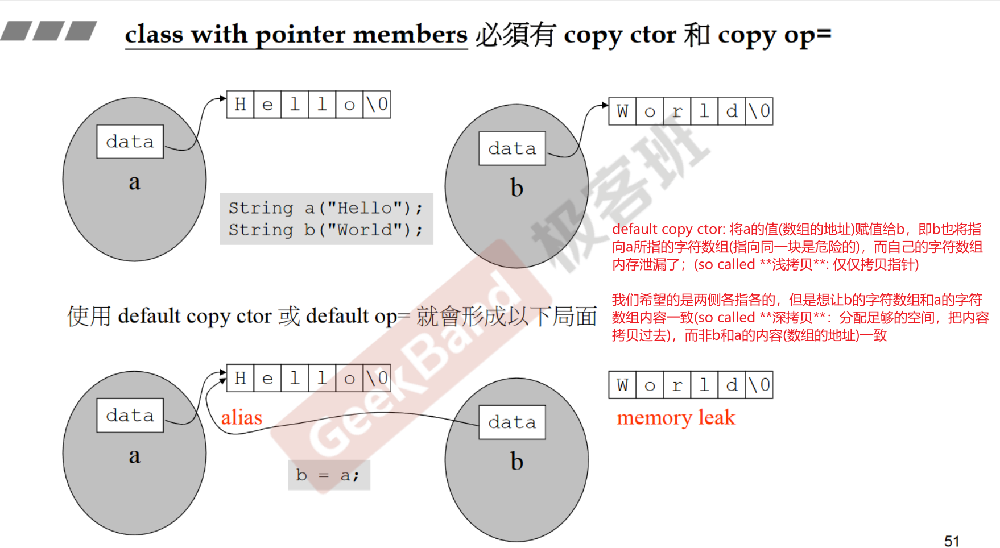  

default copy ctor: 将a的值(数组的地址)赋值给b，即b也将指向a所指的字符数组(指向同一个是危险的)，而自己的字符数组内存泄漏了；(原来这就叫**浅拷贝**：仅拷贝指针)
然而我们希望的是两侧各指各的，但是想让b的字符数组和a的字符数组内容一致(so called **深拷贝**：创造一块空间，把内容拷贝过去)，而非b和a的内容(数组的地址)一致。

### P8: 堆，栈与内存管理

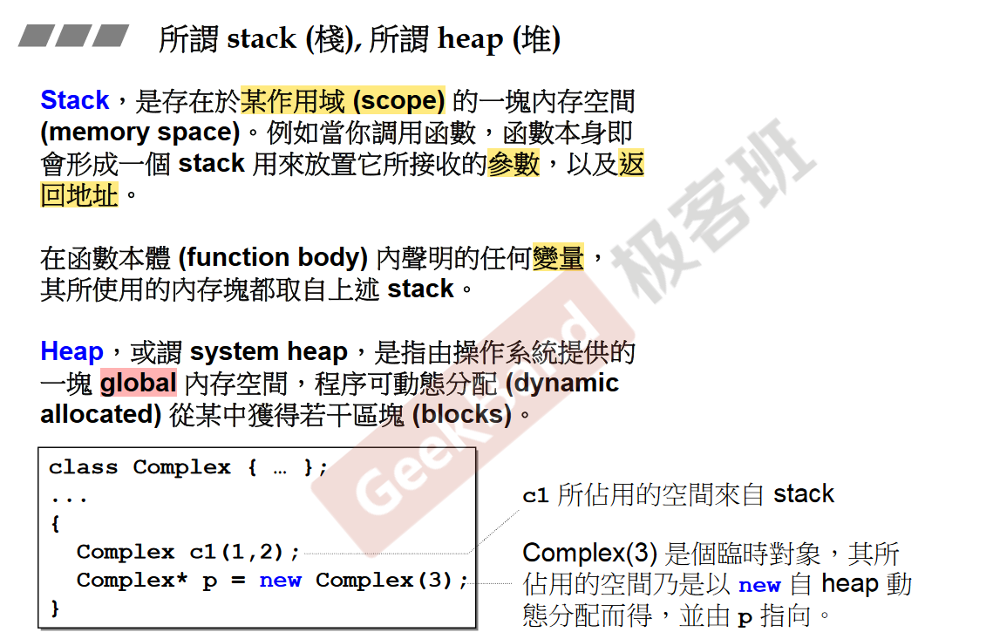  

stack objects (local)的生命期：在作用域(scope)结束之际结束；
这种作用域内的object，又称作**auto objects**，因为它会被**自动清理**（即自动调用析构函数）；

**static** local objects的生命期：在作用域(scope)结束之后仍然存在，直到整个程序结束，才自动调用析构函数；

global objects的生命期：在整个程序结束之后才结束；作用域是整个程序；

heap objects
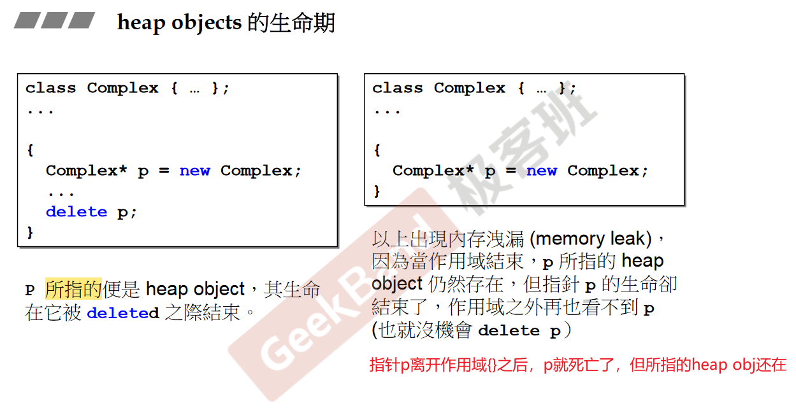  
> 指针p是stack obj，p所指的是heap obj;

即：
stack/auto objects会在(全局)作用域结束之后自动死亡（自动调用析构函数）;
heap objects不会在作用域结束之后自动死亡；如果不delete，heap obj会在程序结束时才会被os回收(似乎这样看是类似于global obj? 但主要的是heap obj是程序员手动的行为)；
> 既然os最终都会回收所有内存，为什么还需要delete?
> gpt: 因为内存泄漏可能会导致程序运行过程中占用的内存不断增加，导致程序运行速度变慢，甚至耗尽可用内存;当你的程序是一个长时间运行的服务或者应用时，内存泄漏可能会导致严重的问题;

---

**new, malloc, constructor的关系**
new运算符 先分配内存(调用函数operator new(), 内部调用malloc)，再转型，最后调用构造函数；
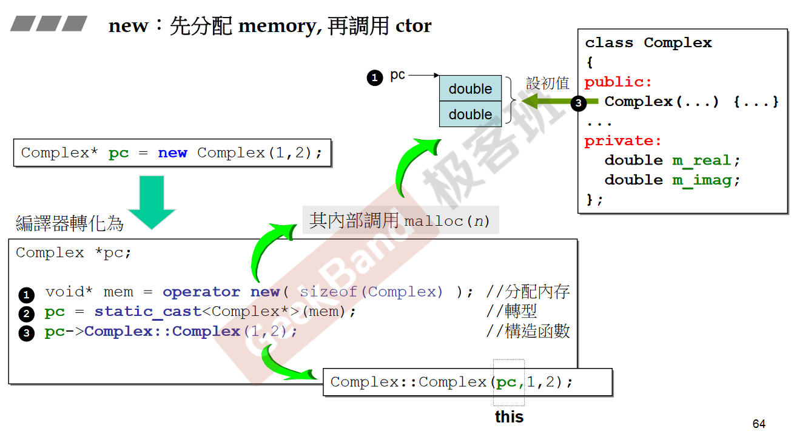  

> 我们知道malloc给你的内存，比你所要的要多很多东西。cookie, debug header, padding等. 要分配小块内存，开销overhead就想对比较大(比例大).

**delete, free, destructor的关系**
delete: 先调用析构函数，再释放内存(operator delete (free))
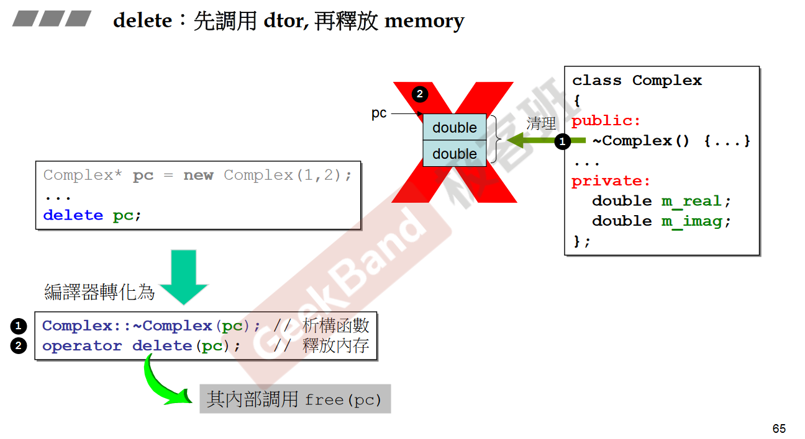
> **析构函数把动态分配的字符数组杀掉，而字符串本身只是一个pointer，由operator delete (free)杀掉。**

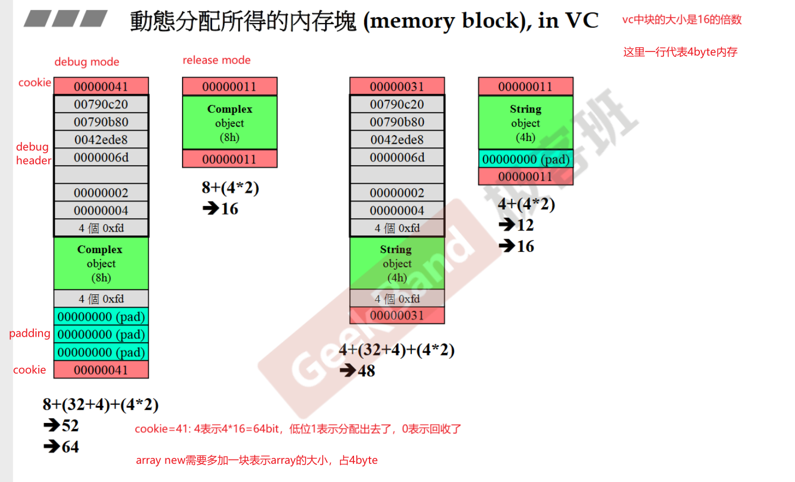  

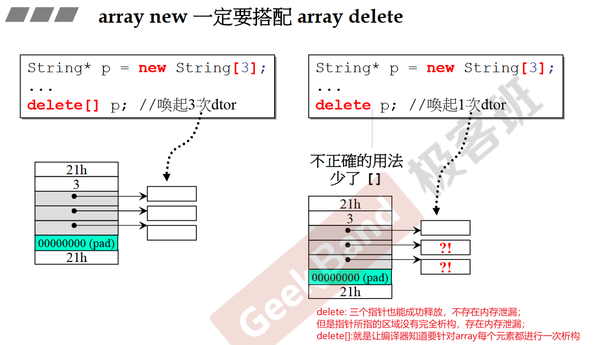  

## Object Oriented Programming

当问题比较复杂的时候，某个类需要和其他的类发生关系，就不再是单个独立的类了(object based).

类与类之间有什么关系呢？

- inheritance(继承)
- composition(复合)
- delegation(委托)

### P11: 组合与继承

#### Composition

- 表示has-a, 该类中有一个...C语言中的struct就有这种概念了.
- e.g., queue会复合deque，deque拿一点功能就改造成queue了(比较特例的composition)...另: 这种设计模式叫做adapter.
- 从内存的角度来看，a拥有b，那么a的内存组成中有一块就是b；

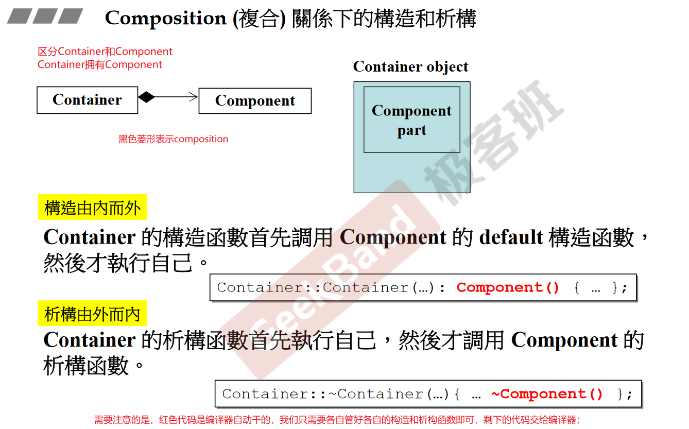

#### Delegation / Composition by reference

by reference包含by pointer (学术界)

Composition左边是真的有一个右边，所以画图的时候使用实心菱形；
Delegation左边也有一个右边，但是比较虚，只是一个指针指过来，不扎实，所以画图的时候使用空心菱形；我有这个指针之后，我在任何的时候也都可以调用你，委托你做事情。

---

**知名设计模式pImpl**
**Pointer to Implementation
aka, Handle/Body(句柄)/(实现)**
将类的实现**细节**隐藏起来，只暴露出类的**接口**，从而降低类之间的耦合度，提高代码的可维护性和可扩展性；

接口部分不变，细节可以方便变动，不影响接口，也就不影响客户端；
aka, 编译防火墙；

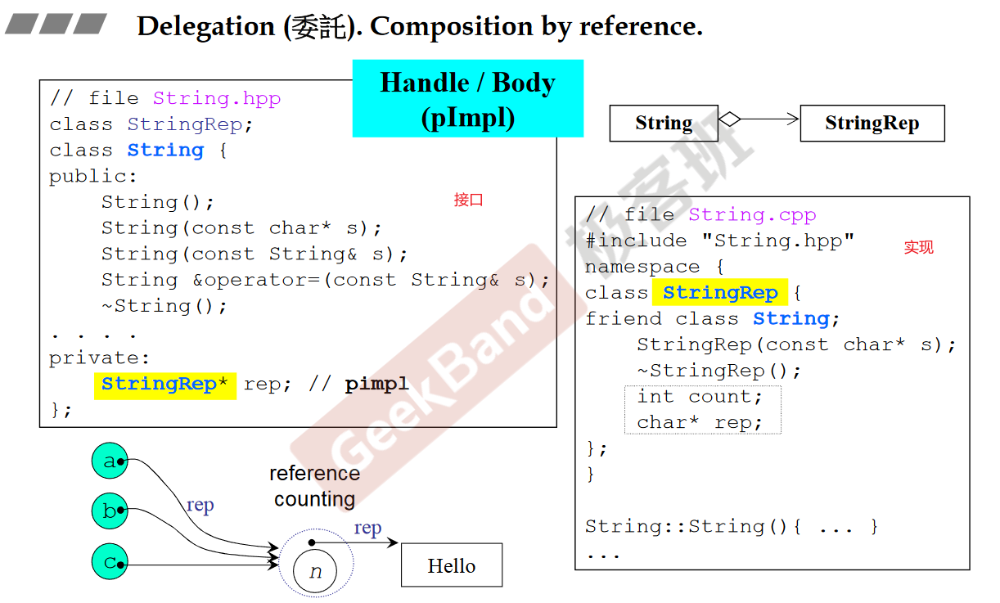  

---

#### Inheritance

继承表示is-a
有三种继承方式**public**, private, protected

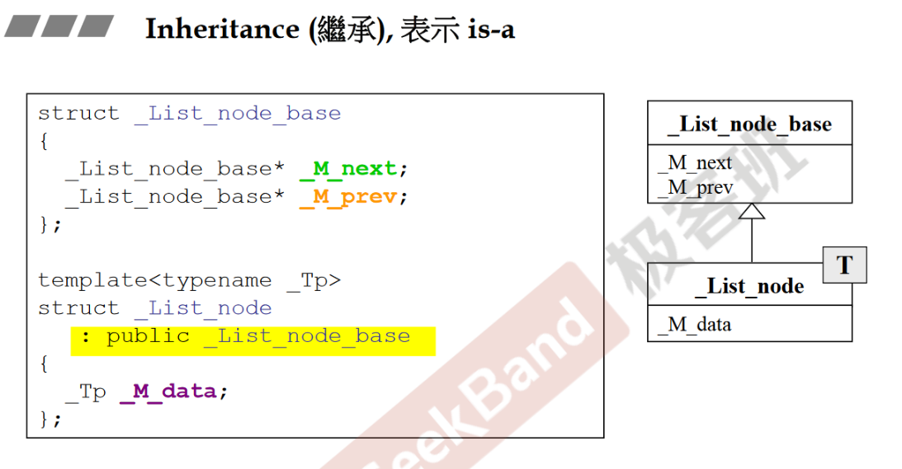

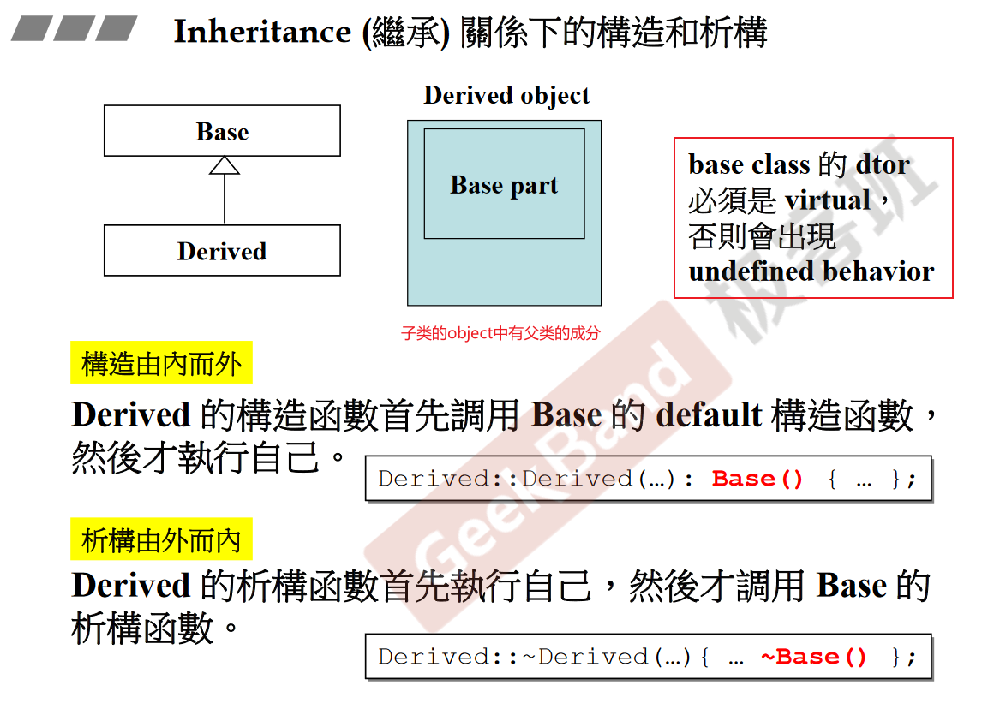

### p12: 虚函数与多态


可以通过子类对象调用父类的函数

**知名设计模式Template Method**
定义了一个算法的骨架，将一些步骤**延迟到子类**中实现。e.g., MFC, .NET
框架性的动作，一般性的动作(application framework)，由别人写好了；其中就大量用到了template method的手法；
把固定的可以写的写好，留下无法决定的函数，作为一个虚函数；

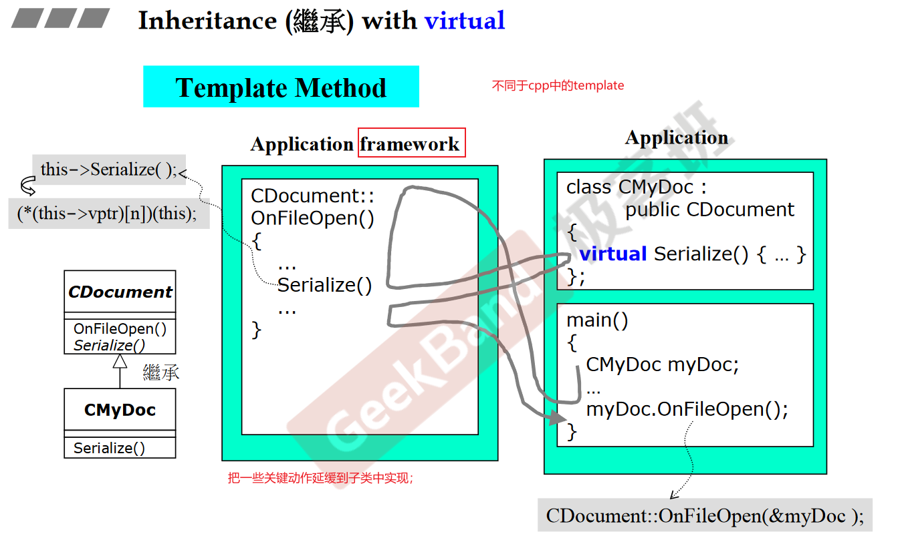  

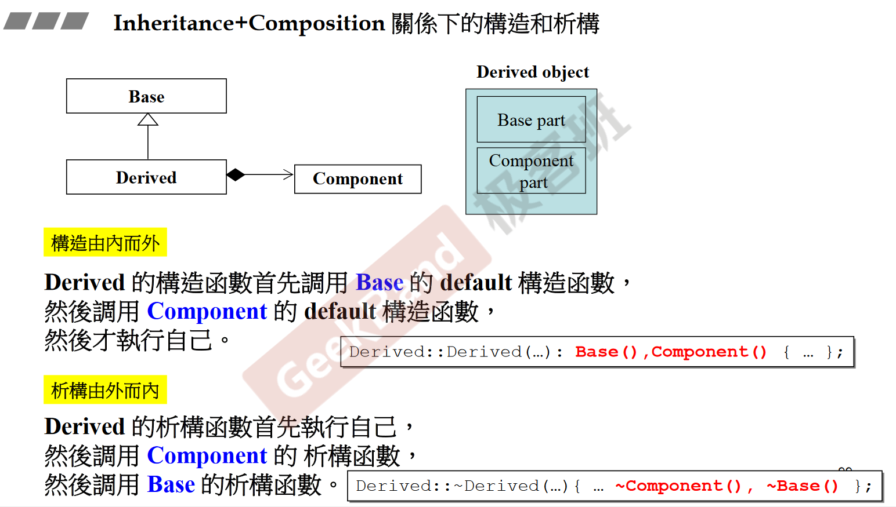  


## keypoint

1. 数据放在private中，绝大部分函数放在public中;
2. 函数传参尽量pass by reference，考虑是否要加const;
3. 函数返回值尽量return by reference, 但是不能返回函数内局部变量的reference;
4. constructor使用initialization list;
5. member function应该加const时需要加上;

## QA

Q: 函数传参什么时候pass by reference?
A: 建议全都pass by reference, 如果是char等by value也行，确实更快.

Q: 函数传参什么时候pass by reference to const?
A: 如果要求不修改参数的值 (你清楚此时pass by reference仅仅是为了加速).

Q: 函数返回值什么时候return by reference?
A: 只要不返回local object，就应该return by reference.

Q: member function什么时候要加const?
A: 函数不会修改对象的member variable的时候，应声明为const。// void func() const;

const是不能修饰非成员函数的，const只能修饰成员函数和对象。
然后const对象不能调用非const成员函数。是因为：const对象的指针类型是`const classA* this`, 而非const成员函数的隐式参数为`classA* this`，故类型不匹配，const成员函数的隐式参数才是`const classA* this`；
所以const对象只能调用const成员函数，非const对象都可以调用。

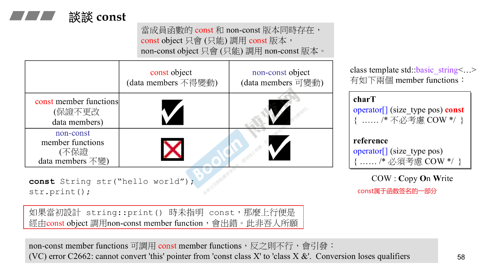  
> 右边这个const构成函数重载，但是根据这个我们可以看出const对象既可以调用const成员函数版本，又可以调用非const成员函数版本。确实如此，但是**当成员函数的const和non-const同时存在时，const obj只能调用const版本**。

Q: 成员初始值列表(member initialization list)和一般形式有什么区别?
A: member initialization list可以为每个成员变量提供初始值，在对象创建的时候直接初始化成员变量，更高效；一般形式会在对象创建时首先使用默认构造函数创建成员变量，然后再通过赋值运算符赋值。(待补充)

Q: 关于this pointer？
A: 成员函数体中访问成员变量a时，可以写this->a，也可以省略为a，编译器自动会加上；但是函数参数中一定不能写this；

Q: 关于static?
A: static member function没有this pointer，静态函数只能去处理静态数据；静态数据是属于class的，所有object公用一份，需要在class之外对class内声明的static变量进行定义（赋初值）；

Q: 函数重载与函数签名
A: 函数重载依赖于唯一的函数签名；function signature包括：函数名，参数类型，参数个数，参数顺序，所在的类，所在的命名空间
注：返回类型不属于函数签名，const属于函数签名的一部分（const修饰成员函数）
再注：const修饰函数参数的时候是否构成重载会比较复杂：[reference](https://www.cnblogs.com/qingergege/p/7609533.html)