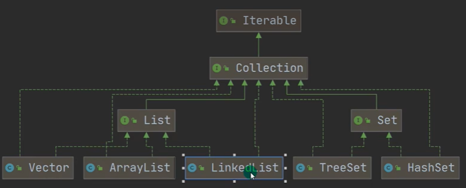
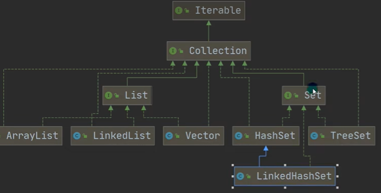
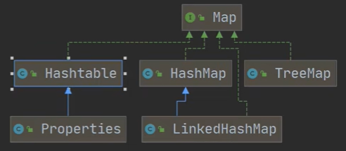

# collection

[toc]

  

<!--  -->

  

  

## general interface

### Iterable Interface

methods

* .iterator()
  * 返回迭代器Iterator, 似乎指向容器首元素之前（或者是首元素，存疑）
  * Iterator中有hasNext(), next()
    * next(): 移动至下一元素 & 将该元素返回
* forEach()

```java
Iterator iterator = ls.iterator();
while (iterator.hasNext()) 
sout(iterator.next()); // .next()会自动将iterator后移
```

### Collection Interface

* collection接口可以存放多个object元素
* 有很多collection的实现类，比如Vector, HashSet等（通过Set和List间接实现）
* 接口可不能实例化

methods (为什么没有forEach()，不是一般都会重写上面的所有method吗)

* .size()
* .isEmpty()
* .iterator()
* .contains()
* .add()
* .remove()
* .clear()
* .equals()

## List Interface

List和Set分别是两个interface

* List的实现类(如Vector, ArrayList...)中元素存储顺序和添加顺序一致、可重复
* List支持(顺序)索引: .get()

methods (定义了Collection,Iterable的方法(未必都重写了，可能只定义而无需改变))

* get(idx)
* getFirst(), getLast()
* indexOf()
* set(idx, element)
* subList(start, end)
* sort()

List的三种遍历方式（即List的所有实现子类均可用: e.g.,Vector, LinkedList...）：

```java
public static void main(String[] args) {
    ArrayList arrayList = new ArrayList();
    arrayList.add("aa");
    arrayList.add("bb");
    // 遍历的三种方式
    for (int i=0; i<arrayList.size(); ++i)
        System.out.println(arrayList.get(i)); // Object -> int

    for (Iterator iter=arrayList.iterator(); iter.hasNext();)
        System.out.println(iter.next());

    // for-range: based on the iterator
    for (Object obj : arrayList)
        System.out.println(obj);
}
```

### ArrayList Class

```java
import java.util.ArrayList;
ArrayList<E> objectName = new ArrayList<>(); // 初始化
// E是泛型数据类型，用于设置对象的数据类型
ArrayList<String> strList = new ArrayList<>();
```

precautions:

* 如果不指定`E`，默认是Object（当然也可以显式指定为Object类型），此时允许放入不同类型的数据
* 如果指定了E的类型，比如String，就只能放String了（存疑，大概是没错的，可以放null）
* null比较特殊，啥类型时都可以放（不知为啥）
* ArrayList是线程不安全的（无synchronized）

底层分析：

* ArrayList的本质是Object[] elementData;
* 如果使用无参ctor**实例化ArrayList，elementData容量为0**。第一次add时，扩容elementData为10，再次扩容按照1.5翻倍（即添加50%）
  * 扩容底层采用`Arrays.copyOf(elementData, newCapacity);`
* 如果使用指定大小n的ctor实例化，容量开始为n，然后直接按照1.5倍扩容

> `tranisent`修饰词表示该属性不会被序列化

```java
private static final Object[] DEFAULTCAPACITY_EMPTY_ELEMENTDATA = {};
public ArrayList() {
    this.elementData = DEFAULTCAPACITY_EMPTY_ELEMENTDATA;
}
```

### Vector Class

* Vector的底层也是Object[] elementData;
* Vector是线程安全的 (有Synchronized)
* 如果使用无参ctor实例化，**实例化时就给elementData为10**，之后add不够用了再按照**2**倍扩容
* 如果使用指定大小n的ctor实例化，容量开始为n，然后直接按照**2**倍扩容
  * 扩容底层也采用`Arrays.copyOf(elementData, newCapacity);`

ArrayList和Vector的区别：

* ArrayList的无参构造器中并不会预分配10个空间，是在add中才会new；而Vector的无参ctor上来就new 10个空间
* ArrayList的扩容频率更为频繁（因为50%嘛），但内存利用率也更高
* ArrayList更高效，因为不考虑线程安全
* ArrayList是新类(jdk1.2), Vector(jdk1.0), 如无特别需要，一般采用ArrayList

### LinkedList Class

  

* LinkedList底层维护了一个双向链表, 一个LinkedList维护两个属性，first指向首结点，last指向尾结点 (当然还有个size属性)
* 每个结点是一个Node对象，里面维护了prev, next, item三个属性
* 增删比较快（因为没涉及到数组，扩容等），改查比较慢
* LinkedList线程不安全
* Node是LinkedList的static内部类

```java
private static class Node<E> {
    E item;
    Node<E> next;
    Node<E> prev;

    Node(Node<E> prev, E element, Node<E> next) {
        this.item = element;
        this.next = next;
        this.prev = prev;
    }
}
```

源码：

* new LinkedList()啥也没干，就初始化了first, last, size..
* .add()通过尾插法，new一个Node（赋值item, next, prev），添加到双向链表中
* .remove()默认删除首元素 unlinkFirst()

## Set Interface

* Set的实现类(如TreeSet, HashSet)中元素存储顺序和添加顺序不一致、不可重复（但是取出顺序是**固定**的）
  * 不可重复
* List不支持索引
* 可以add(null)

set接口并不能使用索引遍历，只剩下两种遍历方式：迭代器 和 增强for

methods (定义了Collection,Iterable的方法，似乎基本只有Collection的接口，自己没啥特别的接口)

* ~~get(idx)~~
* ~~set(idx, element)~~
* ~~sort()~~

### HashSet Class

底层：

* HashSet的底层是HashMap
* HashMap的底层是数组+链表+红黑树
* 添加元素是首先计算出hash值，然后将hash值转为索引值idx
* 找到存储表idx处有无元素，如无直接放，如有，调用equals(**允许重写自定义**)，如果相同不再添加，如果不同加到当前idx的链表最后
  * 这个equals不能简单看做是内容相等，可以被类重写
* java8后，如果链表元素个数等于`TREEIFY_THRESHOLD=8 && len(table) >= MIN_TREEIFY_CAPACITY=64`，**树化**为红黑树。否则继续采用数组扩容机制resize。

注意：

* **结点个数**达到临界值(数组长度*0.75)就会扩容（总长度 × 2）
  * 注意：结点个数是指所有链表的所有结点之和（没有说只算数组的首元素）
* `if (len(this linked list) = TREEIFY_THRESHOLD(8) && len(table) >= MIN_TREEIFY_CAPACITY(64)`才会将该链表(this linked list)树化为红黑树；如果链表长度=8但table长度不够64，会先resize()将数组扩容两倍
  * 16->32->64 -> 树化为红黑树 (condition: 链表长度==8)

源码分析：

* `.add(key)`会调用`.put(key, value)`; // `value=PRESENT; static final Object PRESENT = new Object();`
* put会调用`putVal()`, 执行`hash(key)`得到hash值（不完全等于`.hashCode()`）作为参数传给`putVal()`
  * 当table为空时，**putVal()首先默认创建初始大小为16的Node<K,V>数组**（第一次扩容），同时有一个**加载因子0.75**用于缓冲，**临界值为12**.
    * `Node<K, V>[] table;`
    * 在哈希表的负载因子过高之前进行扩容，以确保哈希表操作的高效性，减少冲突
  * 然后根据key的hash来计算索引位置（table中idx）
  * 然后判断`table[idx]`是否为`null`
    * 相等则直接创建`Node`到`table[idx]`(key就是我们要的，value恒定为`PRESENT`, 同时还会存储hash值(为了后续比较)) （即new一个Node存储到table中，即将一个链表(结点)挂载到数组中）
      * `if ((p = tab[i = (n - 1) & hash]) == null) tab[i] = newNode(hash, key, value, null); // 等价于hash % n`
    * 若不相等
    * `if (table[idx].hash==hash && (p.key==key || key.equals(k)))`，说明当前索引位置对应链表的第一个元素和添加元素的hash值一样 && （是同一个对象 || 内容相同）-> 不再继续添加
    * `else if (is红黑树)`:调用putTreeVal添加
    * `else`: (此时就改插到该链表尾部了) -> 从头到尾遍历判断是否有该元素，有则不添加break，无则加到末尾;
      * 把元素添加到链表尾部后立即判断该链表长度是否达到8个节点，是->`treeifyBin()`将当前**链表树化为红黑树**
        * `treeifyBin()`在扩容之前会判断table的长度是否>=64，如果不满足，`resize()`进一步扩容，暂时先不树化。
  * 检查此时是否超过负载临界值`if (++size > threshold) resize();`
  
```java
static final int hash(Object key) {
    int h;
    return (key == null) ? 0 : (h = key.hashCode()) ^ (h >>> 16); // 如此设计是为了避免碰撞，让不同key得到不同哈希值
}
```

注意

* java规范要求如果两个对象根据equals方法时相同的，那么他们的hashCode方法也必须相同。反之如果他们的hashCode相同，equals未必相同，但不同对象应该尽量生成不同的哈希值，来减少冲突。
  * 经常需要同时重写Object类的equals和hashCode方法（通过快捷键生成，利用Objects中的方法，示例如下）
* 默认的hashCode()来自Object class: `public native int hashCode();` 看似并没有实现...native关键字表示一个原生函数，是在JVM中由本地代码实现（通常是c/cpp而非java），即可以理解为native的方法体在JVM中。
  * 同一个对象的两个引用的hashCode一致

```java
@Override
public boolean equals(Object obj) {
    if (this == obj) return true;
    if (obj == null || getClass() != obj.getClass()) return false;
    Employee employee = (Employee)obj;
    return age == employee.age && Objects.equals(name, employee.name);
}

@Override
public int hashCode() {
    return Objects.hash(name, age);
}
```

### LinkedHashSet

* LinkedHashSet底层维护的是数组+**双向**链表
* 会使用双向链表来维护元素顺序，所以能够确保**遍历顺序和插入顺序一致**
* 源码暂略

## Map Interface

* Set中底层也是Map，但只用了K，V使用的是常来那个`PRESENT`，Map中的KV都是指定的
* Map中的KV可以是任意引用类型的数据，会被存储在HashMap的Node对象中（HashSet的KV应该也是存储在HashMap的Node对象中）
* K不可重复，但新KV会替换旧KV (K相同时)；V可重复