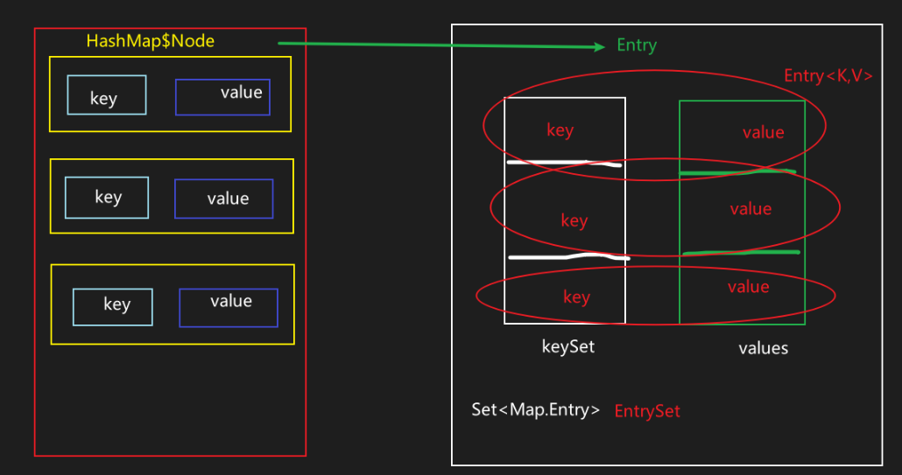

# collection

- [collection](#collection)
  - [概括](#概括)
    - [java的集合类有哪些 ☆](#java的集合类有哪些-)
    - [哪些是线程安全/不安全的 ☆](#哪些是线程安全不安全的-)
    - [如何选择](#如何选择)
  - [前置知识](#前置知识)
    - [enhanced for](#enhanced-for)
  - [接口](#接口)
    - [Iterable Interface](#iterable-interface)
    - [Collection Interface](#collection-interface)
      - [Collection vs. Collections](#collection-vs-collections)
  - [1.List Interface](#1list-interface)
    - [ArrayList ☆](#arraylist-)
      - [扩容机制](#扩容机制)
      - [ArrayList线程安全吗 怎么变为线程安全](#arraylist线程安全吗-怎么变为线程安全)
    - [CopyOnWriteArrayList ☆](#copyonwritearraylist-)
      - [如何保证线程安全？](#如何保证线程安全)
      - [为什么写要上锁，读不上锁？](#为什么写要上锁读不上锁)
      - [为什么写时复制？](#为什么写时复制)
    - [Vector](#vector)
    - [LinkedList](#linkedlist)
    - [ArrayList vs. Array (built-in) ☆](#arraylist-vs-array-built-in-)
    - [ArrayList vs. LinkedList ☆☆](#arraylist-vs-linkedlist-)
  - [2.Set Interface](#2set-interface)
    - [HashSet vs. LinkedHashSet vs. TreeSet](#hashset-vs-linkedhashset-vs-treeset)
    - [HashSet](#hashset)
    - [LinkedHashSet](#linkedhashset)
    - [TreeSet](#treeset)
  - [3.Queue Interface](#3queue-interface)
    - [Queue vs. Deque](#queue-vs-deque)
    - [PriorityQueue](#priorityqueue)
    - [BlockingQueue](#blockingqueue)
  - [4.Map Interface](#4map-interface)
    - [HashMap ☆](#hashmap-)
      - [如何解决Hash冲突？HashMap中是如何解决的？](#如何解决hash冲突hashmap中是如何解决的)
      - [HashMap的put流程](#hashmap的put流程)
        - [详解HashMap中的hashCode() + equals()](#详解hashmap中的hashcode--equals)
        - [如果只重写了equals() 没重写hashCode()，put的时候会怎么样？](#如果只重写了equals-没重写hashcodeput的时候会怎么样)
        - [HashMap的hash()是如何设计的 / 扰动函数](#hashmap的hash是如何设计的--扰动函数)
        - [HashMap为什么按2倍扩容](#hashmap为什么按2倍扩容)
      - [遍历HashMap](#遍历hashmap)
    - [Properties](#properties)
    - [TreeMap](#treemap)
    - [LinkedHashMap](#linkedhashmap)
    - [HashMap vs. Hashtable](#hashmap-vs-hashtable)
    - [HashMap vs. HashSet](#hashmap-vs-hashset)
    - [为什么HashMap线程不安全](#为什么hashmap线程不安全)
    - [ConcurrentHashMap是如何实现的 ☆](#concurrenthashmap是如何实现的-)
      - [jdk1.7 数组 + 链表](#jdk17-数组--链表)
      - [jdk1.8 数组 + 链表/红黑树](#jdk18-数组--链表红黑树)
        - [为什么同时需要CAS和synchronized](#为什么同时需要cas和synchronized)
        - [get是否需要加锁 / volatile起到的作用](#get是否需要加锁--volatile起到的作用)
      - [ConcurrentHashMap 1.7 vs. 1.8](#concurrenthashmap-17-vs-18)
  - [java.utils.Collections](#javautilscollections)

TODO
* 说一下红黑树的特点
* 判断一个集合类是否为线程安全的机制是什么？[fail-fast源码](https://javabetter.cn/sidebar/sanfene/collection.html#_5-%E5%BF%AB%E9%80%9F%E5%A4%B1%E8%B4%A5-fail-fast-%E5%92%8C%E5%AE%89%E5%85%A8%E5%A4%B1%E8%B4%A5-fail-safe-%E4%BA%86%E8%A7%A3%E5%90%97)

## 概括

### java的集合类有哪些 ☆

Java集合类主要由Collection和Map这两个接口派生而出，其中Collection又派生出三个子接口，分别是List, Set, Queue，所有Java集合都是List, Set, Queue, Map这四个接口的实现类。


> LinkedList实现了List和Queue接口，LinkedList底层是双向链表，可作为栈、单向队列和双向队列来使用（但可以使用idx增删中间元素，有点儿难受）; ArrayDeque没实现List，仅实现了Deque，纯粹

我用过的一些Collection：

* `ArrayList`: 动态数组，实现了List接口，支持动态增长。
* `LinkedList`: 双向链表，也实现了List接口，支持快速的插入和删除操作。
* `ArrayDeque`: 双端队列，实现了Queue接口，可以充当栈，FIFO队列和双端队列结构。
* `HashMap`: 基于哈希表的Map实现，存储键值对，通过键快速查找值。
* `HashSet`: 基于HashMap实现的Set集合，用于存储唯一元素。
* `TreeMap`: 基于红黑树实现的有序Map集合，可以按照键的顺序进行排序。
* `LinkedHashMap`: 基于哈希表和双向链表实现的Map集合，保持插入顺序或访问顺序。
* `PriorityQueue`: 优先级队列，可以按照比较器或元素的自然顺序进行排序。可用来充当堆数据结构。

### 哪些是线程安全/不安全的 ☆

* java.util包中线程安全
  * Vector：古老的List实现类，内部方法基本通过synchronized修饰，现推荐使用ArrayList
  * HashTable：古老的哈希表实现，同样适用synchronized修饰内部方法，现推荐使用HashMap
  * `Collections.synchronizedList`, `Collections.synchronizedSet`, `Collections.synchronizedMap`: 这些**方法**可以将非线程安全的集合包装成线程安全的集合
    * 底层本质是：eg synchronizedList类将List的很多方法加了synchronized，但**务必注意在迭代遍历List时必须手动添加synchronized(因为listIterator方法并没有添加synchronized)**
* java.util.concurrent包中线程安全
  * 并发list: `CopyOnWriteArrayList`
  * 并发set: `CopyOnWriteArraySet`
  * 并发map: `ConcurrentHashMap`
* 线程不安全
  * ArrayList, LinkedList, HashSet, HashMap
  * TreeSet, TreeMap: 虽然它们是有序集合，但也是线程不安全的

### 如何选择

先判断是单列还是键值对：

* 单列集合 -> `Collection`接口实现类
  * 允许重复元素 -> `List`接口实现类
    * 增删多 -> `LinkedList` (双向链表) `错误的！不建议使用; 依然O(n)`
    * 改查多 -> `ArrayList` (可变数组)
  * 不允许重复元素 -> `Set`接口实现类
    * 无序数据 -> `HashSet` (HashMap(数组+链表/红黑树))
    * 有序数据 -> `TreeSet` (红黑树)
    * 维护插入顺序(插入取出顺序一致) -> `LinkedHashSet` (数组+双向链表)
* 键值对集合 -> `Map`接口实现子类
  * 无序key -> `HashMap`
    * 保证线程安全 -> `ConcurrentHashMap`
  * 有序key -> `TreeMap`
  * 维护插入顺序 -> `LinkedHashMap`
  * 读取文件 -> `Properties`

## 前置知识

### enhanced for

```java
for (ElementTyle element : collection) {
}
```

* enhanced for (for-each)提供了一种简洁的方式来遍历**实现了Iterable接口的集合**和**数组**。
  * 实现了iterable接口的集合：**即实现了Collection接口的所有类，包括List接口下和Set接口下，注意没有Map接口**
  * 数组没有实现Iterable接口，因此不能直接获取Iterator对象来遍历;java额外特别支持了数组。
* **底层原理**：编译器在编译时将enhanced for转换成了基于iterator的常规for；

```java
int[] array = {1, 2, 3, 4, 5};
for (int element : array)
  sout(element);
// 等价于：
for (int i=0; i<array.length; ++i) 
  sout(array[i]);

List<String> list = Arrays.asList("A", "B", "C");
for (String element : list) {
    // 使用element
}
// 等价于
for (Iterator<String> iterator = list.iterator(); iterator.hasNext(); ) {
  String element = iterator.next();
} // list.iterator()指向首元素之前，第一次调用.next()才返回列表首元素
```

## 接口

### Iterable Interface

methods

* .iterator()
  * 返回迭代器Iterator类型, 指向容器首元素之前
    * > Iterable和Iterator是两个interface
  * Iterator接口中有hasNext(), next()
    * next(): 移动至下一元素 & 将该元素返回
* forEach()

```java
Iterator iterator = ls.iterator();
while (iterator.hasNext()) 
sout(iterator.next()); // .next()会自动将iterator后移
```

### Collection Interface

* collection接口可以存放多个object元素


#### Collection vs. Collections

* Collection是一个**interface**，是所有集合类的基础接口。定义了一组通用的操作和方法，如add(), remove(), size(), isEmpty(), contains(), iterator(), clear(), equals(); Collection接口下有很多子接口，如List，Set和Queue。
  * 即Collection下的所有实现类都有这些方法，尽管实现不同，但我们无需考虑; 比如ArrayList和HashSet都用add()，而HashMap不属于Collection实现类，是Map的实现类，他们喜欢put()
* Collections是一个**工具类**，提供了一系列**静态方法**，用于对集合进行操作，比如排序、查找、翻转等。

## 1.List Interface

* List的常见实现类有ArrayList, LinkedList和Vector
* List支持(顺序)索引: .get(), 不一定支持随机索引哦

methods (Collection和Iterable的方法应该都有)

* **get**(idx)
* getFirst(), getLast()
* **indexOf**()
* **set**(idx, element)
<!-- * subList(start, end) -->
* **sort**()

> List相比于Collection多了很多下标相关的操作，Set是不支持下标的

List的三种遍历方式（即List的所有实现子类均可用: e.g.,Vector, LinkedList...）：

```java
// 遍历的三种方式
for (int i=0; i<arrayList.size(); ++i)
    System.out.println(arrayList.get(i)); // Object -> int

for (Iterator iter=arrayList.iterator(); iter.hasNext();)
    System.out.println(iter.next());

// for-range: based on the iterator
for (Object obj : arrayList)
    System.out.println(obj);
```

### ArrayList ☆

```java
ArrayList<E> objectName = new ArrayList<>(); // 初始化
ArrayList<String> strList = new ArrayList<>();
```

precautions:

* 如果不指定泛型`E`，默认是Object类型，此时允许放入不同类型的数据
* 如果指定了E的类型，比如String，就只能放String了(**编译时检查类型**)
* 可以存null，但无意义
* ArrayList是线程不安全的（无synchronized）

#### 扩容机制

底层分析jdk8.0：

* ArrayList的本质是**Object[] elementData**，当当前元素个数达到数组容量上限就会触发扩容操作;
* 如果使用无参ctor**实例化ArrayList，elementData容量为0, `ie {}`**。第一次add时，扩容elementData为**10**，再次扩容按照**1.5**翻倍（即添加50%）
  * 扩容步骤：
    * 计算新容量：新容量为1.5倍
    * 创建新的更大的数组
    * 逐个复制元素：通过`Arrays.copyOf(elementData, newCapacity);`
    * **更新引用**：将ArrayList内部指向原数组的引用指向新数组
* 如果使用**指定大小n的ctor实例化，容量开始为n**，然后直接按照**1.5倍**扩容；
  * 频繁扩容可能影响性能，故而在初始化ArrayList时可以预分配足够大的容量，避免频繁触发扩容

```java
private static final Object[] DEFAULTCAPACITY_EMPTY_ELEMENTDATA = {};
public ArrayList() {
    this.elementData = DEFAULTCAPACITY_EMPTY_ELEMENTDATA;
}

// 扩容机制核心 -> 扩容为原来的1.5倍
int newCapacity = oldCapacity + (oldCapacity >> 1); // 右移1位 即 缩小一倍；移位要比普通运算符快很多
```

Q: 为何是1.5倍？
A: 可充分利用移位操作，运算速度快

#### ArrayList线程安全吗 怎么变为线程安全

* 通过方法Collections.synchronizedList
* 直接使用线程安全类`CopyOnWriteArrayList`或者`Vector`(旧)

线程不安全可能导致：下标越界异常、size与我们add的数量不一致（具体没啥好说的吧，慢慢推得）

### CopyOnWriteArrayList ☆

> 读写分离思想：将数据库的读操作和写操作分开处理，以减轻数据库的负载，提高并发处理能力和响应速度。通常是使用一个主数据库处理写操作，并使用一个或多个从数据库处理读操作。
> 适合读多写少的场景

#### 如何保证线程安全？

* `CopyOnWriteArrayList`底层也是通过一个数组保存数据，通过**volatile修饰数组变量**，**保证当前线程更新数组引用时(即数组引用指向一个新的数组对象)，其他线程可以立即看到这个变化**（可见性）
  * `private transient volatile Object[] array;`
* 在写操作(增删改)时，首先通过ReentrantLock加锁，然后将当前数组拷贝一份并让长度加一(copyOf)，然后将新元素放到数组最后一位，然后**更新数组的引用**，然后unlock
  * `Object[] newElements = Arrays.copyOf(elements, len + 1);`
* 在读操作时并不需要加锁

#### 为什么写要上锁，读不上锁？

* 之所以写要上锁，是因为保证只有一个线程可以修改，如果多个线程一块改，那数据可能不一致
* 之所以读不上锁，是因为**读操作总是基于一个稳定的快照进行**，首先是允许大家一起读的(也即读读不互斥)；此外，即使数组写时，读操作依然可以继续访问旧的数据，不受影响

#### 为什么写时复制？

* 写时复制的好处是，我们可以对容器进行并发的读，而无需加锁，因为容器是一个稳定的快照。
* 不然如果你写时不复制，而是直接锁住原数组进行修改，那读会发生什么？
  * 如果读不上锁，可能读到不一致的数据，因为读时，数组的内容可能被写操作改变，所以你可能读到部分修改后的数据和部分未修改的数据
  * 解决方案是读也上锁，那读就得阻塞了，那读的效率就大大降低了

### Vector

* Vector是List的古老实现类（遗留类），了解即可，现代开发很少用
  * 如果需要线程安全，通常使用Collections.synchronizedList()是ArrayList同步，来替代Vector
* Vector的底层也是Object[] elementData;
* Vector是线程安全的 (有Synchronized)，适用于多线程环境
* 如果使用无参ctor实例化，**实例化时就给elementData为10**，之后add不够用了再按照**2**倍扩容
* 如果使用指定大小n的ctor实例化，容量开始为n，然后直接按照**2**倍扩容
  * 扩容底层也采用`Arrays.copyOf(elementData, newCapacity);`

ArrayList vs. Vector

* ArrayList的无参构造器中并不会预分配10个空间，是在add中才会new；而Vector的无参ctor上来就new 10个空间
* ArrayList的扩容频率更为频繁（因为50%嘛），但内存利用率也更高
* ArrayList更高效，因为不考虑线程安全
* ArrayList是新类(jdk1.2), Vector(jdk1.0), 如无特别需要，一般采用ArrayList

### LinkedList

`import java.util.LinkedList;`

  

* LinkedList底层维护了一个双向链表, 一个LinkedList维护两个属性，first指向首结点，last指向尾结点 (当然还有个size属性)
* 每个结点是一个Node对象，里面维护了prev, next, item三个属性
* 增删比较快（因为没涉及到数组，扩容等;），改查比较慢 (其实有点问题的，增删头尾确实快，中间的话需要先O(n)遍历到为止，所以增删也并不快)
* LinkedList线程不安全
* Node是LinkedList的static内部类
* 未实现`RandomAccess`标记接口，因为底层内存地址不连续，不支持随机访问

---

* implements List: 说明是一个列表，支持增删改查（可通过idx访问: get(idx)，只不过其底层是不支持随机访问的
* **implements Deque**: 说明具有双端队列的特性，方便实现stack和queue等数据结构
  * 但一般使用ArrayDeque实现stack和queue，因为其基于动态数组实现，性能更好，更省内存（二者都实现了Deque

```java
private static class Node<E> {
    E item;
    Node<E> next;
    Node<E> prev;

    Node(Node<E> prev, E element, Node<E> next) {
        this.item = element;
        this.next = next;
        this.prev = prev;
    }
}
```

源码：

* new LinkedList()啥也没干，就初始化了first, last, size..
* .add()通过尾插法，new一个Node（赋值item, next, prev），添加到双向链表中
* .remove()默认删除首元素 unlinkFirst()

### ArrayList vs. Array (built-in) ☆

* ArrayList内部基于**动态数组**，Array是静态数组，前者可动态扩容，后者创建后长度就固定了(ArrayList并不可以自动缩容)
* ArrayList**只能存对象**/引用(**可以存数组int[]**)，不可存基本数据类型，Array均可
* 前者创建时无需指定大小，后者必须
* 前者可以使用**泛型**确保类型安全（编译时类型检查），后者不行
* 功能方面：Array只有length属性，ArrayList提供了**增删等api**，如add(),remove(),size()等
* 维度：Array可以多维，ArrayList只可以一维

### ArrayList vs. LinkedList ☆☆

* **底层数据结构不同**：ArrayList底层是**动态数组**Object[], LinkedList底层是**双向链表**（jdk1.6之前是循环链表）
* **随机访问**：前者支持**随机访问**，即O(1)访问，实现了`RandomAccess`接口，后者不可，O(n)
* **空间占用**：ArrayList占用连续内存空间，但可能需要在结尾预留一定的容量空间，相对占用较大空间，LinkedList无需连续，只需要额外空间存储前后节点的引用，**相对较小**
* **插入和删除的效率不同**：ArrayList在**尾部**的插入和删除操作效率较高(O(1))，但在中间或开头的增删需要移动元素，平均O(n)；LinkedList在任意位置的**纯**插入和删除操作效率都比较高，只需调整节点自身的双向指针即可（纯删除操作是O(1)没问题），但找到节点需要O(n)事件，所以除了删除**头尾**节点，其它节点的增删是O(n)的，故而效率也不高
* **理论上使用场景**：ArrayList适合**频繁随机访问和==中间==或尾部的增删**操作，LinkedList适合频繁的 **头部的增删操作和无需随机**访问的场景
  * 我实际的**实验**：头插、中间插和尾插，分别插入1w,10w,100w条，测试结果：
    * 头插：AL需要移动后续的元素，LL直接插，LL更快毋庸置疑，快了上百倍吧
    * 中间插：二位都是O(n)，结果显示**AL大概比LL快了10倍**，**100w数据的时候大概快了100倍**
      * **==一般大家会说中间节点的增删LL更快，错误想法==**
      * 可能是AL这种连续内存空间更有利于CPU缓存，以及内存分配啥的
    * 尾插：二维都是O(1)，实验结果也差不多；~~LL要new对象，效率比AL低一点点~~
  * Anyway，除了大量头部增删可能可以考虑LL，其他请用AL；或者说，请遵从LL作者意愿，使用AL；


{width=70%}


<!-- * 前者仅实现List接口，后者实现了List和Deque接口，可作为队列或栈使用 -->
  <!-- * > jdk21 搞了个`SequencedCollection`，ArrayList实现了该接口，也具有了`removeLast(), addFirst()`等方法，也是可以直接作为栈或队列了。（LinkedList也实现了该接口...反正他俩都有这些函数，jdk8时ArrayList是没有的 -->

## 2.Set Interface

* Set的实现类(如TreeSet, HashSet)中元素存储顺序和添加顺序不一致、不可重复（但是取出顺序是**固定**的）
  * **不可重复性**：指添加的元素按照equals()判断时，返回false，需要同时重写hashCode()和equals()方法
    * 为什么还需要override hashCode()? [github/haooxia](https://github.com/haooxia/interview/blob/main/java/java.md#hashcode)
* Set不支持索引
* 可以add(null)

set接口并不能使用索引遍历，只剩下两种遍历方式：迭代器 和 增强for

methods (定义了Collection,Iterable的方法，似乎基本只有Collection的接口，自己没啥特别的接口)

* ~~get(idx)~~
* ~~set(idx, element)~~
* ~~sort()~~

### HashSet vs. LinkedHashSet vs. TreeSet

> HashSet是不会自动排序的

* 都是Set接口的实现类，元素唯一，都不是线程安全的
* 主要区别于底层数据结构：HashSet底层是哈希表(基于HashMap实现)；LinkedHashSet底层是双向链表+哈希表，元素的插入取出符合FIFO；TreeSet底层是红黑树，元素有序（可自然排序or定制排序
* HashSet用于无需保证元素插入和取出顺序的场景，LinkedHashSet用于需要保证FIFO的场景，TreeSet用于支持元素自定义排序的场景
  * TreeSet的add时间复杂度是`O(logn)`, HashSet的add是`O(1)`

### HashSet

HashSet的底层是HashMap，参考即可

### LinkedHashSet

* LinkedHashSet底层维护的是数组+**双向**链表
* 会使用双向链表来维护元素顺序，所以能够确保**遍历顺序和插入顺序一致**
* 源码暂略

### TreeSet

* 相比于HashSet最大特点：可以排序
* TreeSet默认构造器的元素按照**自然顺序**（元素实现的Comparable接口中的compareTo默认方法规则，比如String就是字母排序，Integer是数值大小）排序
* TreeSet构造器**可以传入一个Comparator匿名对象来自定义排序规则**，实际上是将其赋给了底层的TreeMap的comparator属性。
* 那为什么TreeSet会自动排序呢?
  * TreeSet基于TreeMap使用**红黑树**数据结构来存储键值对，这种树结构保证了插入、删除、查找操作的时间复杂度为 O(logn)，并且自动维护元素的排序。

## 3.Queue Interface

### Queue vs. Deque

* 二者都是interface奥
* Queue是单端队列，一头增一头删，Deque是双端队列，两头都可以增删

### PriorityQueue

* 和Queue区别于：总是优先级最高的元素先出队，不是直接FIFO了
* 底层数据结构是**堆**，底层是可变长数组，默认是小顶堆
* 通过堆元素的上浮和下沉，插入和删除堆顶元素为O(logn)
* 非线程安全

### BlockingQueue

* BlockingQueue（阻塞队列）是一个interface，继承自Queue
* 支持当队列没有元素时一直阻塞，直到有元素；还支持如果队列已满，一直等到队列可以放入新元素时再放入。常用于生产者-消费者模型
  

## 4.Map Interface

* Map保存key-value映射关系的数据；Set中底层也是Map，但只用了K，V使用的是常量`PRESENT`
* K不可重复; 新KV会替换旧KV (K相同时); V可重复
* 可以通过key找到value: `.get(key)`

### HashMap ☆

  

* HashMap将数据以键值对的形式存储(存在内部的HashMap$Node对象中)，并通过"数组+链表/红黑树"的结构组织成一个table，是线程不安全的
* **HashMap的底层实现？**
  * jdk7中HashMap是`数组+链表`，即拉链法
    * 哈希冲突时，会在冲突位置形成链表，将新增元素加入到链表末尾，问题是：冲突过多时链表会特别长，导致查找复杂度逐渐退化为O(n)
  * jdk8引入红黑树(Red-Black Tree)，链表长度超过8时，会将链表转换为红黑树(Treeify)，以提高查找性能(**降为O(logn)**)。长度小于6时重新变回链表(untreeify)
    * 红黑树是一种**兜底**策略，牺牲空间换时间
* **为什么>8树化，<=6时重新变回链表？**
  * 源码注释中所述：根据泊松分布，在负载因子是0.75时，一个hash桶中元素个数为8的概率小于百万分之一，所以7作为分水岭，=7时不转换，>=8时树化，<=6时反树化。
* **为什么引入红黑树，而非其他树？**
  * 二叉搜索树BST(左 < root < 右)，极端情况下会退化为链表(O(n))：比如插入有序数据，BST一边可能无限长 -> 平衡二叉树
  * 平衡二叉树AVL(左右子树高差不超过1，追求**绝对平衡**): 旋转操作频繁：在添加元素时需要进行**左旋、右旋**操作维持根节点左右两端的平衡，复杂度和开销很高。
  * 红黑树：**不追求绝对的平衡**，相比于AVL减少了很多性能开销

#### 如何解决Hash冲突？HashMap中是如何解决的？

解决Hash冲突的算法：

* **再散列法**/开放地址法：当key的哈希地址`p=H(key)`出现冲突时，以p为基础产生另一个哈希地址p1，如还冲突产生p2..., 将相应元素存入地址pi中
  * 再散列法函数：$H_i = (H(Key) + d_i) \% m$； // m为表长
  * 根据**增量序列di**的取值不同，再散列法可分为：
    * **线性探测再散列**：`di=1,2,3...`, 顺序查找表中下一个单元
    * **伪随机探测再散列**：加个随机数
    * **二次探测再散列**：`1^2, -1^2, 2^2, -2^2...`，即左右横跳试探
* 链地址法/拉链法：每个数组元素bucket上都有一个链表结构,bucket中存头指针，元素存入链表
  * HashMap

#### HashMap的put流程

> HashMap的put/扩容机制和HashSet完全一致

{width=70%}

1. 根据key计算hashCode：`(h = key.hashCode()) ^ (h >>> 16)`
2. 数组首次扩容：`resize()` (初始大小为16的`Node<K,V>[] table`数组，加载因为0.75)
3. 根据hashCode计算在数组中的索引：`(n - 1) & hash`
4. 检查索引处bucket是否存放数据(是否为空)，
   1. 如果为空则插入一个新的Entry对象
   2. 如果非空，**判断key是否相同**，是则直接覆盖(用新value替换旧value)，如果key不同，判断集合的结构是链表还是红黑树
      1. 如果是链表，==**从头开始遍历链表逐个比较key的hashCode和equals()**== 直到找到相同key或到达末尾，如找到相同key，更新，如没找到相同key就**尾插法(jdk8)** (jdk7头插)
         1. 注意在插入时，如果 ==**链表长度>=8且HashMap的数组长度>=64**==，**树化**
      2. 如果是红黑树，在红黑树中使用hashCode和equals()方法进行查找，如找到相同key，更新value，如没找到就插入
5. 元素put过后，最后，检查**负载因子**是否超过阈值(0.75)，如果键值对的数量/数组长度 > 0.75，扩容
6. **扩容**：搞一个两倍长的数组，重新计算所有元素的位置，算完按照put的思路插入进去即可（该树化就树化），**链表和红黑树的结构也可能被打散**分到不同的bucket中。

> 一方面HashMap通过hashcode确定bucket存储位置，另一方面HashMap在equals()之前利用hashcode来提高查找效率（虽然hashcode相同不能直接推出两个key相同，但hashcode不同两个key一定不同）
---

注意：

* **结点个数**达到临界值(数组长度*0.75)就会扩容（总长度 × 2）
  * 注意：结点个数是指所有链表的所有结点之和（没有说只算数组的首元素）
* `if (len(this linked list) = TREEIFY_THRESHOLD(8) && len(table) >= MIN_TREEIFY_CAPACITY(64)`才会将该链表(this linked list)树化为红黑树；如果链表长度=8但table长度不够64，会先插入到链表，然后如果size超过临界值，resize()将数组扩容两倍
  * 16->32->64 -> 树化为红黑树 (condition: 链表长度==8)

##### 详解HashMap中的hashCode() + equals()

详解一下判等机制：`if (table[idx].hash==hash && (p.key==key || key.equals(k)))`

* 哈希值比较：首先table[idx]是哈希表的一个桶(bucket), 比较`table[idx].hash==hash`是指比较当前元素的hash值与我们正在插入的桶的hash值，是一个快速的初步检查，如不同，立即可以知道这不是我们要找的元素
  * **先比较哈希值可以快速排除大多数不匹配的情况，很高效**
* key相等性检查：如果hashcode相同，我们还需要进一步检查key是否真的相等，因为不同的key可能会有相同的hashcode（哈希冲突）
  * `p.key==key`: 如果两个引用指向同一对象，那指定相等了，也是加快速度
  * `key.equals(k)`: 如果引用不等，使用equlas()比较key的内容
    * 如果key相同，则更新其value

> java规范要求如果两个对象equals方法时相同，那么他们的hashCode也必须相同。反之如果他们的hashCode相同，equals未必相同，但不同对象应该尽量生成不同的哈希值，来减少冲突

##### 如果只重写了equals() 没重写hashCode()，put的时候会怎么样？

导致equals()相同的两个对象hashCode不同，这两个对象本应该放入一个bucket，被放到了两个bucket，get的时候就找不到了

##### HashMap的hash()是如何设计的 / 扰动函数

为了降低哈希冲突的概率，HashMap 的哈希函数是先拿到 key 的 hashcode，是一个 32 位的 int 类型的数值，然后**让hashcode的高16位和低16位进行异或操作**
为何？
我们知道hashcode得到32位，但HashMap的长度n一般较小，我们通过 `hash & (n - 1)` aka `hash % n`来获得索引位置，与&操作就只能捕获到32位hashcode的低位的特征，故而将hashcode右移16位，然后亦或高低位，这就**同时考虑到了低位和高维的特征**，特征越多，哈希碰撞的概率就越低。

```java
static final int hash(Object key) {
    int h;
    // key的hashCode和key的hashCode右移16位做异或运算
    return (key == null) ? 0 : (h = key.hashCode()) ^ (h >>> 16);
}
```

##### HashMap为什么按2倍扩容

HashMap的容量设置为2的幂次方，是为了快速定位元素所在的数组下标
hash % length == hash & (length - 1)的前提是length是2的n次方，使用&可以加速运算。

#### 遍历HashMap

* Node实现了`Map.Entry<K,V>`接口（实现了`getKey(), getValue()`）;
* 底层会自动创建一个存储了Entry对象的entrySet集合`Set<Map.Entry<K,V>>`，这个Set就支持使用iterator遍历了
* `Map.Entry`中存储的key和value实际是Node中key和value的**引用**，因为Node实现了Map.Entry接口，所以可以将Node对象赋给该接口（多态）
* 为了方便操作，除了`Set<Map.Entry<K,V>> entrySet()`外还有`Set<K> keySet()`和`Collection<V> values()`

  

---

* 不同视角: 灵活；
  * entrySet()返回一个包含所有Map.Entry<K,V>对象的**Set** (`Set<Map.Entry<K,V>> entrySet()`)，可以通过.entrySet().iterator()来遍历Map；即it.getKey(), it.getValue();
  * keySet()返回一个包含所有key的**Set** (`Set<K> keySet()`)，可以通过.keySet().iterator()来遍历获取key;
  * values()返回一个包含所有value的**Collection** (`Collection<V> values()`)，可以通过.values().iterator()来遍历value;
    * 由于允许重复，所以不使用Set
* 我们知道Set和Collection接口都实现了Iterable，所以都支持.iterator()，而Map接口并未实现Iterable.

---

method

* size()
* isEmpty()
* put(k,v)
* remove(k)
* get(k): return Object value
* clear()
* containsKey(k)

遍历（6种）

* entrySet(): 获取所有k-v
* keySet(): 获取所有key
* values(): 获取所有value
* 基于enhanced-for或者iterator(basic-for) 各有三种
* 基于**entrySet最高效**，因为使用keySet会多一次哈希查找操作

```java
HashMap<String, String> map = new HashMap<>();
    map.put("key1", "value1");
    map.put("key2", "value2");

    // 第一组(最简单): 基于keySet: .get()
    // (1) enhanced for
    for (String key : map.keySet()) {
        System.out.println("key: " + key + " value: " + map.get(key));
    }
    // (2) original for (based on iterator)
    Iterator<String> keyIt = map.keySet().iterator();
    while (keyIt.hasNext()) {
        String key =  keyIt.next();
        String value = map.get(key);
    }

    // 第二组(最高效)：基于entrySet: getKey(), getValue()
    // (1) enhanced for (TODO 推荐)
    for (Map.Entry<String, String> entry : map.entrySet()) {
        System.out.println("key: " + entry.getKey() + " value: " + entry.getValue());
    }
    // (2) original for (based on iterator)
    Iterator<Map.Entry<String, String>> it = map.entrySet().iterator();
    while (it.hasNext()) {
        Map.Entry<String, String> entry =  it.next();
        System.out.println("key: " + entry.getKey() + " value: " + entry.getValue());
    }

    // 第三组: 基于values
    // (1) enhanced for
    for (String v : map.values()) {
        System.out.println("value: " + v);
    }
    // (2) original for (based on iterator)
    Iterator<String> valueIt = map.values().iterator();
    while (valueIt.hasNext()) {
        String value =  valueIt.next();
    }
```

### Properties

* Properties继承自HashTable
* 常用于从**配置文件.properties**加载数据到Properties类对象，进行读取和修改。

### TreeMap

* 底层参考TreeSet，因为TreeSet是基于TreeMap的，只不过Value填充的是恒定的PRESENT
* 可以排序，默认ctor按照自然顺序，可以传入一个Comparator匿名对象
* TreeMap底层是Entry

### LinkedHashMap

继承自HashMap，内部维护了一个双向链表，保留了键值对的插入顺序（即我们使用**双向链表 + HashMap** [手撕LRU的实现](https://leetcode.cn/problems/lru-cache/?envType=study-plan-v2&envId=top-interview-150)

### HashMap vs. Hashtable

* Hashtable基本被淘汰，不要用
* 前者非线程安全，后者安全（但需要线程安全一般使用ConcurrentHashMap
* 前者可以使用null作为key和value，后者不可
* HashMap默认初始化大小为16，然后每次扩充为2倍；Hashtable默认初始化大小为11，然后每次扩充为2n+1；
* 如果指定初始化大小k，HashMap会将其扩充为2的幂次方大小（向上取整，即HashMap的大小始终是2的幂次方(why)；Hashtable会直接使用k
* 解决哈希冲突不同：jdk8之后HashMap：链表长度大于阈值(default=8)时，将链表转化为红黑树（将链表转换成红黑树前会判断，如果当前数组的长度小于 64，那么会选择先进行数组扩容，而不是转换为红黑树）；Hashtable没这个机制
* 哈希函数不同：HashMap对哈希值进行了高位和低位的混合扰动处理以减少冲突，而Hashtable直接使用键的hashCode()值

> * Hashtable底层是`Hashtable$Entry[11]`, HashMap底层是`HashMap$Node[16]`, 加载因子都是0.75，达到后进行扩容。
>   * Hashtable扩容：2倍+1：11->23；而HashMap是2倍；
>   * HashMap比Hashtable新，之所有不用Entry改为Node，是为了支持新的数据结构红黑树，

### HashMap vs. HashSet


### 为什么HashMap线程不安全

数据覆盖问题：多线程同时执行put操作，如果计算出来的索引位置是相同的，那就会造成前一个key被后一个key覆盖，从而导致元素的丢失k

### ConcurrentHashMap是如何实现的 ☆

#### jdk1.7 数组 + 链表

> Segment数组 + HashEntry数组 + 链表

{width=80%}

* ConcurrentHashMap将整个哈希表分为多个小的哈希表，称作Segment[]数组，每个Segment包含一个HashEntry[]数组，每个HashEntry是一个链表，来村键值对数据。（即把原来的数组分成了多个segment
  * 每个**segment是一种可重入锁**，当一个thread访问其中一个数据段上锁时，其他segment的数据可以并行访问
    * `Segment<K,V> extends ReentrantLock`，segment继承自ReentrantLock
  * segment数组可称作所数组，无他，就是扮演锁的角色
  * Segment数组默认大小为16(不能扩容)，即默认可以同时支持16个线程并发写。每个Segment守护一个HashEntry数组

> HashTable会用一把锁锁住整个哈希表，效率很低 -> 1.7分段锁好点了 -> 1.8每个Node一把锁并发度更好了

#### jdk1.8 数组 + 链表/红黑树

> **Node数组** + 链表/红黑树 (和jdk1.8 HashMap类似)


jdk1.8几乎完全重写了ConcurrentHashMap，取消了Segment分段锁，采用 ==**CAS+synchronized+volatile**== 来保证并发。锁粒度更细，synchronized只锁定当前链表或红黑树的首节点，即锁定到单个bucket级别，每个Node都可以并行操作，大幅度提升效率（1.7是锁到一个segment，即多个bucket

##### 为什么同时需要CAS和synchronized

ConcurrentHashMap使用这俩手段来保证线程安全，使用哪个主要是**根据锁竞争程度**来判断（我们知道竞争激烈的场景适合悲观锁，因为乐观锁在激烈场景下会爆炸）

* 在put中，如果计算出的hash槽没有存放元素，就直接通过CAS设置值
  * 这是因为我们的hash值经过各种扰动之后，造成**hash碰撞的概率是比较低的**，所以比较适合乐观锁
* 而发生hash碰撞时说明哈希表的容量不太够用，或者有大量的线程访问，所以**此时线程竞争是很激烈的**，故而此时采用悲观锁synchronized来处理hash碰撞；上锁后，遍历bucket中的数据，并替换或新增节点到该bucket，再判断是否需要转为红黑树

> 即就能用乐观锁的话，效率还是蛮高的，竞争激烈了就悲观锁

##### get是否需要加锁 / volatile起到的作用

注意：ConcurrentHashMap的get操作是无需加锁的，因为其该容器对Node的value字段使用了==volatile==修饰，这意味着一个线程修改了某个Node的value时，其他线程可以立马看见这个变化（volatile保证可见性）；此外volatile可以禁止指令重排序，确保了对Node的读取和写入操作不会被重排序

#### ConcurrentHashMap 1.7 vs. 1.8

* 结构不同/hash碰撞解决方法不同：1.7采用拉链法，1.8采用拉链法+红黑树
* 线程安全实现方式：1.7采用Segment分段锁，1.8采用`Node+CAS+synchronized`，锁粒度更细，synchronized只锁定当前链表或红黑二叉树的首节点
* **并发度**：1.7的最大并发度是Segment的个数（默认16），1.8最大并发度是Node数组的大小，会大的多

## java.utils.Collections

* 用来操作List, Set, Map等集合的工具类，提供一系列static方法对**集合(List, Set, Map)**进行排序、查找和修改等操作

static method: (默认都按**自然顺序**)

* `Collections.sort(List<T> list)`
  * 底层都是调用`Arrays.sort()`，可能需要先`.toArray()`
* `Collections.sort(List<T> list, Comparator<? super T> c)`
  * `<?>`: 支持**任意泛型**类型：即可以传入T或E任意泛型
  * `<? extents T>`: 支持T类及T类的子类孙子类，规定了泛型的上限
  * `<? super T>`: 支持T类及T类的父类爷类祖宗类，规定了父类的下限
* `Collections.reverse(List<?> list)`
* `Collections.binarySearch(list, key)`
* `Collections.swap(List<?> list, int i, int j)`
* `Collections.max(? extends T)`
* `Collections.max(? extends T, Comparator<? super T>)`
* `Collections.frequency(Collection<?> c, Object o)`
* `Collections.copy(List<? super T> dest, List<? super T> src)`

区分Colletions class和Arrays class

java.util.Arrays类能方便地操作**数组**，它提供的所有方法都是static的。

* Arrays.toString(int[])
* Arrays.sort()
* Arrays.binarySearch()
* Arrays.copyOf(): deep copy
  * =: shallow copy: 仅拷贝数组的引用，共用一份内存
* Arrays.equals()
