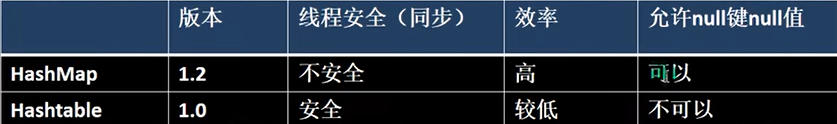

# collection

[toc]


> linkedlist实现了Deque和Queue接口

<!--  -->

  

  

==How to choose?==

* 判断是单列还是键值对
  * 单列 -> Collection接口实现类
    * 允许重复 -> List接口实现类
      * 增删多 -> LinkedList (双向链表) 错误的！不建议使用; 依然O(n)
      * 改查多 -> ArrayList (可变数组)
    * 不允许重复 -> Set接口实现类
      * 无序数据 -> HashSet (使用HashMap维护一个哈希表(数组+链表/红黑树))
      * 有序数据 -> TreeSet
      * 插入取出顺序一致 -> LinkedHashSet (数组+双向链表)
  * 键值对 -> Map接口实现子类
    * 无序key -> HashMap
      * 保证线程安全 -> ConcurrentHashMap
    * 有序key -> TreeMap
    * 读取文件 -> Properties

## prerequisite knowledge

### enhanced for

```java
for (ElementTyle element : collection) {
}
```

* enhanced for (for-each)提供了一种简洁的方式来遍历**实现了Iterable接口的集合**和**数组**。
  * 实现了iterable接口的集合：**即实现了Collection接口的所有类，包括List接口下和Set接口下，注意没有Map接口**
  * 数组没有实现Iterable接口，因此不能直接获取Iterator对象来遍历;java额外特别支持了数组。
* **底层原理**：编译器在编译时将enhanced for转换成了基于iterator的常规for；

```java
int[] array = {1, 2, 3, 4, 5};
for (int element : array)
  sout(element);
// 等价于：
for (int i=0; i<array.length; ++i) 
  sout(array[i]);

List<String> list = Arrays.asList("A", "B", "C");
for (String element : list) {
    // 使用element
}
// 等价于
for (Iterator<String> iterator = list.iterator(); iterator.hasNext(); ) {
  String element = iterator.next();
} // list.iterator()指向首元素之前，第一次调用.next()才返回列表首元素
```

## general interface

### Iterable Interface

methods

* .iterator()
  * 返回迭代器Iterator, 指向容器首元素之前
  * Iterator中有hasNext(), next()
    * next(): 移动至下一元素 & 将该元素返回
* forEach()

```java
Iterator iterator = ls.iterator();
while (iterator.hasNext()) 
sout(iterator.next()); // .next()会自动将iterator后移
```

### Collection Interface

* collection接口可以存放多个object元素
* 有很多collection的实现类，比如Vector, HashSet等（通过Set和List间接实现）

methods (为什么没有forEach()，不是一般都会重写上面的所有method吗)

* .size()
* .isEmpty()
* .iterator()
* .contains()
* .add()
* .remove()
* .clear()
* .equals()

## List Interface

List和Set分别是两个interface

* List的实现类(如ArrayList, LinkedList...)中元素存储顺序和添加顺序一致、可重复
* List支持(顺序)索引: .get(), 不一定支持随机索引哦

methods (定义了Collection,Iterable的方法(未必都重写了，可能只定义而无需改变))

* get(idx)
* getFirst(), getLast()
* indexOf()
* set(idx, element)
* subList(start, end)
* sort()

List的三种遍历方式（即List的所有实现子类均可用: e.g.,Vector, LinkedList...）：

```java
public static void main(String[] args) {
    ArrayList arrayList = new ArrayList();
    arrayList.add("aa");
    arrayList.add("bb");
    // 遍历的三种方式
    for (int i=0; i<arrayList.size(); ++i)
        System.out.println(arrayList.get(i)); // Object -> int

    for (Iterator iter=arrayList.iterator(); iter.hasNext();)
        System.out.println(iter.next());

    // for-range: based on the iterator
    for (Object obj : arrayList)
        System.out.println(obj);
}
```

### ArrayList

```java
import java.util.ArrayList;
ArrayList<E> objectName = new ArrayList<>(); // 初始化
// E是泛型数据类型，用于设置对象的数据类型
ArrayList<String> strList = new ArrayList<>();
```

precautions:

* 如果不指定泛型`E`，默认是Object（当然也可以显式指定为Object类型），此时允许放入不同类型的数据
* 如果指定了E的类型，比如String，就只能放String了(**编译时检查类型**)
* 可以存null，但无意义
* ArrayList是线程不安全的（无synchronized）

底层分析jdk8.0：

* ArrayList的本质是**Object[] elementData**;
* 如果使用无参ctor**实例化ArrayList，elementData容量为0**。第一次add时，扩容elementData为10，再次扩容按照1.5翻倍（即添加50%）
  * 扩容底层采用`Arrays.copyOf(elementData, newCapacity);`
* 如果使用**指定大小n的ctor实例化，容量开始为n**，然后直接按照1.5倍扩容
<!-- > `transient`修饰词表示该属性不会被序列化 -->

```java
private static final Object[] DEFAULTCAPACITY_EMPTY_ELEMENTDATA = {};
public ArrayList() {
    this.elementData = DEFAULTCAPACITY_EMPTY_ELEMENTDATA;
}

// 扩容机制核心 -> 扩容为原来的1.5倍
int newCapacity = oldCapacity + (oldCapacity >> 1); // 右移1位 即 缩小一倍；移位要比普通运算符快很多

```

### Vector

* Vector是List的古老实现类，了解即可
* Vector的底层也是Object[] elementData;
* Vector是线程安全的 (有Synchronized)
* 如果使用无参ctor实例化，**实例化时就给elementData为10**，之后add不够用了再按照**2**倍扩容
* 如果使用指定大小n的ctor实例化，容量开始为n，然后直接按照**2**倍扩容
  * 扩容底层也采用`Arrays.copyOf(elementData, newCapacity);`

ArrayList vs. Vector

* ArrayList的无参构造器中并不会预分配10个空间，是在add中才会new；而Vector的无参ctor上来就new 10个空间
* ArrayList的扩容频率更为频繁（因为50%嘛），但内存利用率也更高
* ArrayList更高效，因为不考虑线程安全
* ArrayList是新类(jdk1.2), Vector(jdk1.0), 如无特别需要，一般采用ArrayList

### LinkedList

  

* LinkedList底层维护了一个双向链表, 一个LinkedList维护两个属性，first指向首结点，last指向尾结点 (当然还有个size属性)
* 每个结点是一个Node对象，里面维护了prev, next, item三个属性
* 增删比较快（因为没涉及到数组，扩容等），改查比较慢 (其实有点问题的，增删头尾确实快，中间的话需要先O(n)遍历到为止，所以增删也并不快)
* LinkedList线程不安全
* Node是LinkedList的static内部类
* 未实现`RandomAccess`标记接口，因为底层内存地址不连续，不支持随机访问

---

* implements List: 说明是一个列表，支持增删改查（可通过idx访问: get(idx)，只不过其底层是不支持随机访问的
* **implements Deque**: 说明具有双端队列的特性，方便实现stack和queue等数据结构
  * 但一般使用ArrayDeque实现stack和queue，因为其基于动态数组实现，性能更好，更省内存（二者都实现了Deque

```java
private static class Node<E> {
    E item;
    Node<E> next;
    Node<E> prev;

    Node(Node<E> prev, E element, Node<E> next) {
        this.item = element;
        this.next = next;
        this.prev = prev;
    }
}
```

源码：

* new LinkedList()啥也没干，就初始化了first, last, size..
* .add()通过尾插法，new一个Node（赋值item, next, prev），添加到双向链表中
* .remove()默认删除首元素 unlinkFirst()

### ArrayList vs. Array (built-in)

* ArrayList内部基于动态数组，Array是静态数组，前者可动态扩容、缩容，后者创建后长度就固定了
* ArrayList只能存对象/引用，不可存基本数据类型，Array均可
* 前者创建时无需指定大小，后者必须
* 前者可以使用泛型确保类型安全，后者不行
* ArrayList提供了增删api，如add()、remove()等，而Array只有length属性

### ArrayList vs. LinkedList

* ArrayList底层是Object[], LinkedList底层是双向链表（jdk1.6之前是循环链表）
* 前者支持随机访问，实现了`RandomAccess`接口，后者不可，O(n)
* 二者都不可保证线程安全
* 前者的空间浪费体现在list列表的结尾会预留一定的容量空间，后者体现在每个元素都要存放两个指针

ArrayList的插入和删除时间复杂度

* 插入：
  * 头部插入：所有元素依次后移 -> O(n)
  * 尾部插入：如果没到容量极限 -> O(1)，如果到极限 -> 扩容 -> O(n)复制所有 -> O(1)添加
  * 中间插入：平均移动n/2个元素 -> O(n)
* 删除：
  * 头部删除：O(n)
  * 尾部：O(1)
  * 中间：移动n/2 -> O(n)

LinkedList（底层双向链表）的头尾插入删除都是O(1)，中间插入删除需要表平均遍历n/2个元素 -> O(n)

> 我们一般不用LinkedList，其作者都说: I wrote it, and i never use it. 不要认为LinkedList适合增删，它删除头尾确实快，但删除中间元素的时间复杂度为O(n)

## Set Interface

* Set的实现类(如TreeSet, HashSet)中元素存储顺序和添加顺序不一致、不可重复（但是取出顺序是**固定**的）
  * **不可重复性**：指添加的元素按照equals()判断时，返回false，需要同时重写hashCode()和equals()方法
    * 为什么还需要override hashCode()? [github/haooxia](https://github.com/haooxia/interview/blob/main/java/java.md#hashcode)
* Set不支持索引
* 可以add(null)

set接口并不能使用索引遍历，只剩下两种遍历方式：迭代器 和 增强for

methods (定义了Collection,Iterable的方法，似乎基本只有Collection的接口，自己没啥特别的接口)

* ~~get(idx)~~
* ~~set(idx, element)~~
* ~~sort()~~

### HashSet vs. LinkedHashSet vs. TreeSet

* 都是Set接口的实现类，元素唯一，都不是线程安全的
* 主要区别于底层数据结构：HashSet底层是哈希表(基于HashMap实现)；LinkedHashSet底层是双向链表+哈希表，元素的插入取出符合FIFO；TreeSet底层是红黑树，元素有序（可自然排序or定制排序
* HashSet用于无需保证元素插入和取出顺序的场景，LinkedHashSet用于需要保证FIFO的场景，TreeSet用于支持元素自定义排序的场景

### HashSet

**底层**：(HashSet和HashMap机制相同，回头可以看一下HashMap[源码分析](https://www.bilibili.com/video/BV1fh411y7R8?t=180.3&p=538)，我直接跳过了)

* HashSet的底层是HashMap
* HashMap的底层是**数组+链表/红黑树**(jdk8)
* 添加元素是首先计算出hash值，然后**将hash值转为索引值idx**
* 找到存储表idx处有无元素，如无直接放，如有，调用equals(**允许重写自定义**)，如果相同不再添加，如果不同加到当前idx的链表最后
  * 这个equals不能简单看做是内容相等，可以被类重写
* jdk8后，如果链表元素个数等于`TREEIFY_THRESHOLD=8 && len(table) >= MIN_TREEIFY_CAPACITY=64`，**树化**为**红黑树**。否则继续采用数组扩容机制resize。（jdk7之前是数组+链表）

注意：

* **结点个数**达到临界值(数组长度*0.75)就会扩容（总长度 × 2）
  * 注意：结点个数是指所有链表的所有结点之和（没有说只算数组的首元素）
* `if (len(this linked list) = TREEIFY_THRESHOLD(8) && len(table) >= MIN_TREEIFY_CAPACITY(64)`才会将该链表(this linked list)树化为红黑树；如果链表长度=8但table长度不够64，会先resize()将数组扩容两倍
  * 16->32->64 -> 树化为红黑树 (condition: 链表长度==8)

源码分析：

* `.add(key)`会调用`.put(key, value)`; // `value=PRESENT; static final Object PRESENT = new Object();`
* put会调用`putVal()`, 执行`hash(key)`得到hash值（不完全等于`.hashCode()`）作为参数传给`putVal()`
  * 当table为空时，**putVal()首先默认创建初始大小为16的Node<K,V>数组**（第一次扩容），同时有一个**加载因子0.75**用于缓冲，**临界值为12**.
    * `Node<K, V>[] table;`
    * 在哈希表的负载因子过高之前进行扩容，以确保哈希表操作的高效性，减少冲突
  * 然后根据key的hash来计算索引位置（table中idx）
  * 然后判断`table[idx]`是否为`null`
    * 相等则直接创建`Node`到`table[idx]`(key就是我们要的，value恒定为`PRESENT`, 同时还会存储hash值(为了后续比较)) （即new一个Node存储到table中，即将一个链表(结点)挂载到数组中）
      * `if ((p = tab[i = (n - 1) & hash]) == null) tab[i] = newNode(hash, key, value, null); // 等价于hash % n`
    * 若不相等
    * `if (table[idx].hash==hash && (p.key==key || key.equals(k)))`，说明当前索引位置对应链表的第一个元素和添加元素的hash值一样 && （是同一个对象 || 内容相同）-> 不再继续添加
    * `else if (is红黑树)`:调用putTreeVal添加
    * `else`: (此时就改插到该链表尾部了) -> 从头到尾遍历判断是否有该元素，有则不添加break，无则加到末尾;
      * 把元素添加到链表尾部后立即判断该链表长度是否达到8个节点，是->`treeifyBin()`将当前**链表树化为红黑树**
        * `treeifyBin()`在扩容之前会判断table的长度是否>=64，如果不满足，`resize()`进一步扩容，暂时先不树化。
  * 检查此时是否超过负载临界值`if (++size > threshold) resize();`
  
```java
static final int hash(Object key) {
    int h;
    return (key == null) ? 0 : (h = key.hashCode()) ^ (h >>> 16); // 如此设计是为了避免碰撞，让不同key得到不同哈希值
}
```

注意

* java规范要求如果两个对象根据equals方法时相同的，那么他们的hashCode方法也必须相同。反之如果他们的hashCode相同，equals未必相同，但不同对象应该尽量生成不同的哈希值，来减少冲突。
  * 经常需要同时重写Object类的equals和hashCode方法（通过快捷键生成，利用Objects中的方法，示例如下）
* 默认的hashCode()来自Object class: `public native int hashCode();` 看似并没有实现...native关键字表示一个原生函数，是在JVM中由本地代码实现（通常是c/cpp而非java），即可以理解为native的方法体在JVM中。
  * 同一个对象的两个引用的hashCode一致

```java
@Override
public boolean equals(Object obj) {
    if (this == obj) return true;
    if (obj == null || getClass() != obj.getClass()) return false;
    Employee employee = (Employee)obj;
    return age == employee.age && Objects.equals(name, employee.name);
}

@Override
public int hashCode() {
    return Objects.hash(name, age);
}
```

### LinkedHashSet

* LinkedHashSet底层维护的是数组+**双向**链表
* 会使用双向链表来维护元素顺序，所以能够确保**遍历顺序和插入顺序一致**
* 源码暂略

### TreeSet

* 相比于HashSet最大特点：可以排序
* TreeSet默认构造器的元素按照**自然顺序**（元素实现的Comparable接口中的compareTo默认方法规则，比如String就是字母排序，Integer是数值大小）排序
* TreeSet构造器**可以传入一个Comparator匿名对象来自定义排序规则**，实际上是将其赋给了底层的TreeMap的comparator属性。
* 那为什么TreeSet会自动排序呢?
  * TreeSet基于TreeMap使用**红黑树**数据结构来存储键值对，这种树结构保证了插入、删除、查找操作的时间复杂度为 O(logn)，并且自动维护元素的排序。

## Queue Interface

### Queue vs. Deque

* 二者都是interface奥
* Queue是单端队列，一头增一头删，Deque是双端队列，两头都可以增删

### PriorityQueue

* 和Queue区别于：总是优先级最高的元素先出队，不是直接FIFO了
* 底层数据结构是**堆**，底层是可变长数组，默认是小顶堆
* 通过堆元素的上浮和下沉，插入和删除堆顶元素为O(logn)
* 非线程安全

### BlockingQueue

* BlockingQueue（阻塞队列）是一个interface，继承自Queue
* 支持当队列没有元素时一直阻塞，直到有元素；还支持如果队列已满，一直等到队列可以放入新元素时再放入。常用于生产者-消费者模型
  

## Map Interface

* Map保存key-value映射关系的数据；Set中底层也是Map，但只用了K，V使用的是常量`PRESENT`
* K不可重复; 新KV会替换旧KV (K相同时); V可重复
* 可以通过key找到value: `.get(key)`

### HashMap

* HashMap的扩容机制和HashSet完全一致

HashMap底层细节

* 存储结构：HashMap存储键值对（key-value）在其内部的HashMap$Node对象中，并通过"数组+链表/红黑树"的结构组织成一个table。(same to HashSet)
  * Node是HashMap的一个内部类，包含以下成员：hash, key, value, next。
* Node实现了`Map.Entry<K,V>`接口（实现了`getKey(), getValue()`）; 
* 底层会自动创建一个存储了Entry对象的entrySet集合`Set<Map.Entry<K,V>>`，这个Set就支持使用iterator遍历了
* `Map.Entry`中存储的key和value实际是Node中key和value的**引用**，因为Node实现了Map.Entry接口，所以可以将Node对象赋给该接口（多态）
* 为了方便操作，除了`Set<Map.Entry<K,V>> entrySet()`外还有`Set<K> keySet()`和`Collection<V> values()`

  

---

* 不同视角: 灵活；
  * entrySet()返回一个包含所有Map.Entry<K,V>对象的**Set** (`Set<Map.Entry<K,V>> entrySet()`)，可以通过.entrySet().iterator()来遍历Map；即it.getKey(), it.getValue();
  * keySet()返回一个包含所有key的**Set** (`Set<K> keySet()`)，可以通过.keySet().iterator()来遍历获取key;
  * values()返回一个包含所有value的**Collection** (`Collection<V> values()`)，可以通过.values().iterator()来遍历value;
    * 由于允许重复，所以不使用Set
* 我们知道Set和Collection接口都实现了Iterable，所以都支持.iterator()，而Map接口并未实现Iterable.

---

method

* size()
* isEmpty()
* put(k,v)
* remove(k)
* get(k): return Object value
* clear()
* containsKey(k)

遍历（6种）

* entrySet(): 获取所有k-v
* keySet(): 获取所有key
* values(): 获取所有value
* 基于enhanced-for或者iterator(basic-for) 各有三种
* 基于**entrySet最高效**，因为使用keySet会多一次哈希查找操作

```java
HashMap<String, String> map = new HashMap<>();
    map.put("key1", "value1");
    map.put("key2", "value2");

    // 第一组(最简单): 基于keySet: .get()
    // (1) enhanced for
    for (String key : map.keySet()) {
        System.out.println("key: " + key + " value: " + map.get(key));
    }
    // (2) original for (based on iterator)
    Iterator<String> keyIt = map.keySet().iterator();
    while (keyIt.hasNext()) {
        String key =  keyIt.next();
        String value = map.get(key);
    }

    // 第二组(最高效)：基于entrySet: getKey(), getValue()
    // (1) enhanced for (TODO 推荐)
    for (Map.Entry<String, String> entry : map.entrySet()) {
        System.out.println("key: " + entry.getKey() + " value: " + entry.getValue());
    }
    // (2) original for (based on iterator)
    Iterator<Map.Entry<String, String>> it = map.entrySet().iterator();
    while (it.hasNext()) {
        Map.Entry<String, String> entry =  it.next();
        System.out.println("key: " + entry.getKey() + " value: " + entry.getValue());
    }

    // 第三组: 基于values
    // (1) enhanced for
    for (String v : map.values()) {
        System.out.println("value: " + v);
    }
    // (2) original for (based on iterator)
    Iterator<String> valueIt = map.values().iterator();
    while (valueIt.hasNext()) {
        String value =  valueIt.next();
    }
```

### HashTable

* HashTable的kv都不能为null，HashMap的kv都可以是null
* HashTable是线程安全的，HashMap不安全
* 底层是`Hashtable$Entry[11]`, HashMap底层是`HashMap$Node[16]`, 加载因子都是0.75，达到后进行扩容。
  * Hashtable扩容：2倍+1：11->23；而HashMap是2倍；
  * HashMap比Hashtable新，之所有不用Entry改为Node，是为了支持新的数据结构红黑树，



### Properties

* Properties继承自HashTable
* 常用于从**配置文件.properties**加载数据到Properties类对象，进行读取和修改。

### TreeMap

* 底层参考TreeSet，因为TreeSet是基于TreeMap的，只不过Value填充的是恒定的PRESENT
* 可以排序，默认ctor按照自然顺序，可以传入一个Comparator匿名对象
* TreeMap底层是Entry

### HashMap vs. Hashtable

* Hashtable基本被淘汰，不要用
* 前者非线程安全，后者安全（但需要线程安全一般使用ConcurrentHashMap
* 前者可以使用null作为key和value，后者不可
* HashMap默认初始化大小为16，然后每次扩充为2倍；Hashtable默认初始化大小为11，然后每次扩充为2n+1；
* 如果指定初始化大小k，HashMap会将其扩充为2的幂次方大小（向上取整，即HashMap的大小始终是2的幂次方(why)；Hashtable会直接使用k
* 解决哈希冲突不同：jdk8之后HashMap：链表长度大于阈值(default=8)时，将链表转化为红黑树（将链表转换成红黑树前会判断，如果当前数组的长度小于 64，那么会选择先进行数组扩容，而不是转换为红黑树）；Hashtable没这个机制
* 哈希函数不同：HashMap对哈希值进行了高位和低位的混合扰动处理以减少冲突，而Hashtable直接使用键的hashCode()值

### HashMap vs. HashSet

  


## java.utils.Collections

* 用来操作List, Set, Map等集合的工具类，提供一系列static方法对**集合(List, Set, Map)**进行排序、查找和修改等操作

static method: (默认都按**自然顺序**)

* `Collections.sort(List<T> list)`
  * 底层都是调用`Arrays.sort()`，可能需要先`.toArray()`
* `Collections.sort(List<T> list, Comparator<? super T> c)`
  * `<?>`: 支持**任意泛型**类型：即可以传入T或E任意泛型
  * `<? extents T>`: 支持T类及T类的子类孙子类，规定了泛型的上限
  * `<? super T>`: 支持T类及T类的父类爷类祖宗类，规定了父类的下限
* `Collections.reverse(List<?> list)`
* `Collections.binarySearch(list, key)`
* `Collections.swap(List<?> list, int i, int j)`
* `Collections.max(? extends T)`
* `Collections.max(? extends T, Comparator<? super T>)`
* `Collections.frequency(Collection<?> c, Object o)`
* `Collections.copy(List<? super T> dest, List<? super T> src)`

区分Colletions class和Arrays class

java.util.Arrays类能方便地操作**数组**，它提供的所有方法都是static的。

* Arrays.toString(int[])
* Arrays.sort()
* Arrays.binarySearch()
* Arrays.copyOf(): deep copy
  * =: shallow copy: 仅拷贝数组的引用，共用一份内存
* Arrays.equals()
