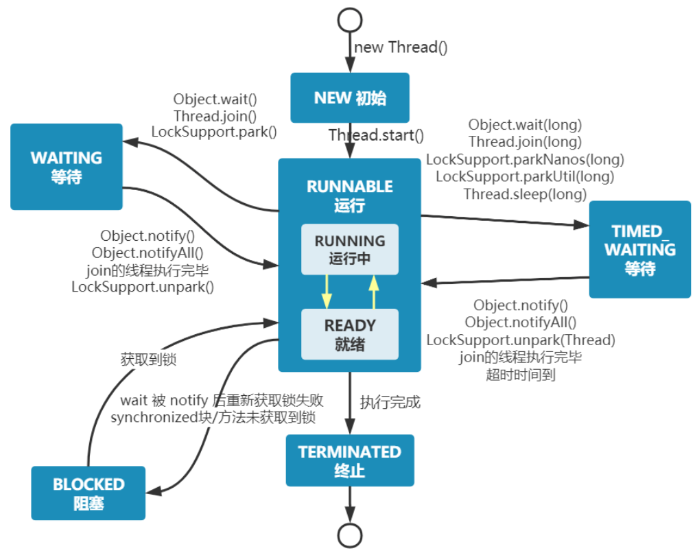
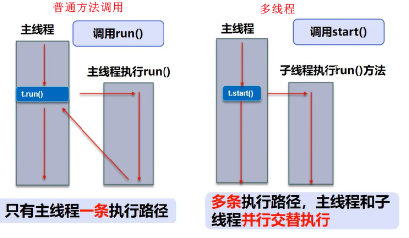
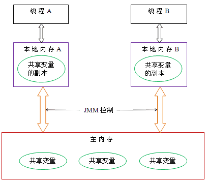
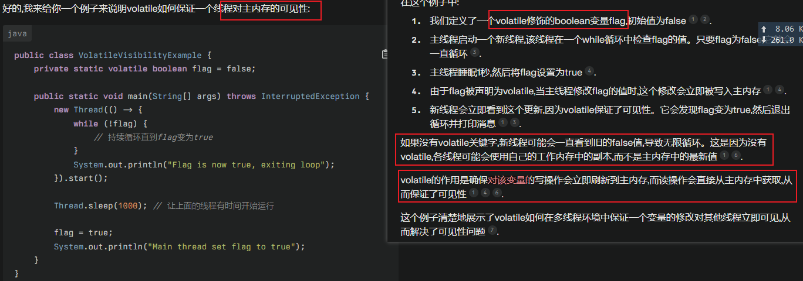
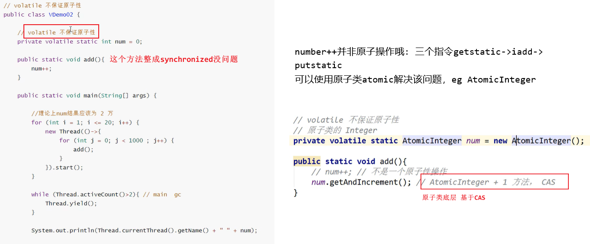
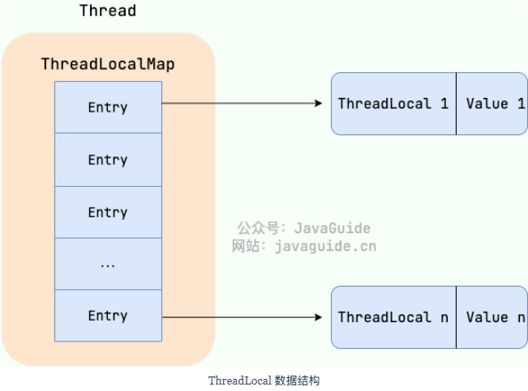
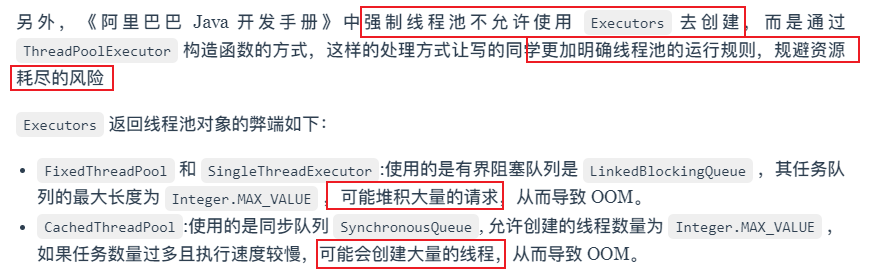
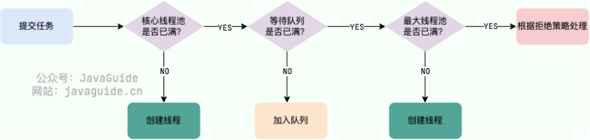

# 并发编程

- [并发编程](#并发编程)
  - [线程基础](#线程基础)
    - [进程 vs. 线程 ☆](#进程-vs-线程-)
      - [简单了解一下协程](#简单了解一下协程)
    - [用户线程 vs. 内核线程](#用户线程-vs-内核线程)
    - [java线程和os线程的区别](#java线程和os线程的区别)
    - [java线程创建有几种方式 ☆](#java线程创建有几种方式-)
    - [线程生命周期和状态](#线程生命周期和状态)
      - [blocked vs. waiting](#blocked-vs-waiting)
      - [notify() vs notifyall()](#notify-vs-notifyall)
      - [Thread#sleep() vs. Object#wait()](#threadsleep-vs-objectwait)
    - [线程调用的本质 start() vs. run() ☆](#线程调用的本质-start-vs-run-)
    - [线程相关method](#线程相关method)
  - [多线程](#多线程)
    - [java如何保证多线程安全/概括](#java如何保证多线程安全概括)
    - [单核 CPU 上运行多个线程效率一定会高吗](#单核-cpu-上运行多个线程效率一定会高吗)
    - [死锁 ☆](#死锁-)
      - [什么是死锁](#什么是死锁)
      - [如何预防、避免死锁](#如何预防避免死锁)
      - [死锁检测 (java)](#死锁检测-java)
    - [Java内存模型 JMM](#java内存模型-jmm)
      - [JMM抽象了线程和主内存之间的关系](#jmm抽象了线程和主内存之间的关系)
      - [happens-before](#happens-before)
        - [定义](#定义)
        - [happens-before常见规则](#happens-before常见规则)
      - [并发编程的三特性](#并发编程的三特性)
    - [volatile ☆](#volatile-)
    - [乐观锁与悲观锁 ☆](#乐观锁与悲观锁-)
      - [版本号机制 vs. CAS](#版本号机制-vs-cas)
        - [java中是如何实现CAS的](#java中是如何实现cas的)
        - [CAS的问题](#cas的问题)
    - [java中有哪些锁](#java中有哪些锁)
      - [互斥锁/自旋锁](#互斥锁自旋锁)
      - [读写锁](#读写锁)
      - [公平锁 vs. 非公平锁](#公平锁-vs-非公平锁)
      - [可重入锁](#可重入锁)
      - [独享锁 vs. 共享锁](#独享锁-vs-共享锁)
      - [乐观锁 vs. 悲观锁](#乐观锁-vs-悲观锁)
      - [分段锁](#分段锁)
      - [偏向锁/轻量级锁/重量级锁](#偏向锁轻量级锁重量级锁)
    - [synchronized](#synchronized)
      - [对synchronized的理解 ☆](#对synchronized的理解-)
      - [如何使用synchronized？](#如何使用synchronized)
      - [synchronized的底层本质](#synchronized的底层本质)
      - [synchronized vs. volatile ☆](#synchronized-vs-volatile-)
    - [ReentrantLock / Lock](#reentrantlock--lock)
      - [ReentrantLock vs. synchronized ☆](#reentrantlock-vs-synchronized-)
    - [ReentrantReadWriteLock / ReadWriteLock](#reentrantreadwritelock--readwritelock)
    - [ThreadLocal](#threadlocal)
      - [ThreadLocal原理](#threadlocal原理)
    - [BlockingQueue](#blockingqueue)
    - [线程池](#线程池)
      - [线程池三大创建方法](#线程池三大创建方法)
      - [ThreadPoolExecutor线程池7大参数](#threadpoolexecutor线程池7大参数)
      - [线程池处理任务的流程](#线程池处理任务的流程)
      - [拒绝策略](#拒绝策略)
      - [阻塞队列](#阻塞队列)
      - [参数设置](#参数设置)
      - [execute() vs. submit()](#execute-vs-submit)
      - [线程池关闭 shutdown() vs. shutdownnow()](#线程池关闭-shutdown-vs-shutdownnow)
    - [AQS](#aqs)


TODO：

* ReentrantLock底层原理、是如何实现可重入的（why volatile? state；参考点评项目我写了）
* 掌握AQS底层原理
* synchronized锁升级过程
* synchronized原理
* 锁升级，锁膨胀，偏向锁（synchronized
* volatile底层是如何实现的

## 线程基础

### 进程 vs. 线程 ☆

进程是系统进行资源分配和调度的**基本**单位。线程是os能够进行运算调度的**最小**单位；在java中，当我们启动main()时其实就是启动了一个JVM进程，而main函数所在线程就是这个进程中的一个线程，也即主线程；线程是进程内的执行单元，一个进程可以包含多个线程，多个线程共享进程的**堆和方法区资源**，每个线程都有自己的**程序计数器、虚拟机栈和本地方法栈**。引入线程是为了获得更好的**并发性**，但并发执行可能会导致一些问题，如线程不安全、死锁等

* **资源开销**：
  * 进程：由于每个进程都有独立的内存空间，创建和销毁进程的开销较大。进程间切换需要保存和恢复整个进程的状态，因此上下文切换的开销较高。
  * 线程：(同一进程内的)线程共享一部分相同的内存空间，创建和销毁线程的**开销较小**。线程间切换只需要保存和恢复少量的线程上下文（PC，虚拟机栈和本地方法栈）。
* **通信与同步**：
  * 进程：由于进程间相互隔离，进程之间的通信需要使用一些**特殊机制**，如管道、消息队列、共享内存等（比较复杂，详见进程通信section）。
  * 线程：由于线程共享相同的内存空间，它们之间可以直接访问共享数据(比如直接使用全局变量等)，线程间通信更加方便。（当然，需要一些互斥同步机制：互斥锁、条件变量、信号量；当然，进程通信的共享内存也需要同步机制：信号量、信号等）
* **安全性**：
  * 进程：由于进程间相互隔离，一个进程的崩溃不会直接影响其他进程的稳定性。
  * 线程：由于线程共享相同的内存空间，**一个线程的错误可能会影响整个进程的稳定性**

#### 简单了解一下协程

* 协程是一种**用户态**的轻量级线程，其**调度完全由用户程序控制，而不需要内核的参与**（线程间切换无需陷入内核态）。
* 协程的切换开销非常小，因为只需要保存和恢复协程的上下文(协程拥有自己的寄存器上下文和栈，但与其他协程共享堆内存)，而无需进行内核级的上下文切换。这使得协程在处理大量并发任务时具有非常高的效率。
* 协程需要程序员显式地进行调度和管理，相对于线程和进程来说，其编程模型更为复杂


> * java中虚拟线程(visual threads)类似于协程
>   * 和我早期的java线程(用户级)有什么区别呢？
> please ref: [link](https://javaguide.cn/java/concurrent/virtual-thread.html#%E8%99%9A%E6%8B%9F%E7%BA%BF%E7%A8%8B%E5%92%8C%E5%B9%B3%E5%8F%B0%E7%BA%BF%E7%A8%8B%E6%80%A7%E8%83%BD%E5%AF%B9%E6%AF%94)

### 用户线程 vs. 内核线程

* 实现方式：用户级线程在用户空间实现,由应用程序通过线程库来创建和管理，运行在用户空间。内核级线程由操作系统内核创建和管理,在内核空间实现，运行在内核空间。
* 切换开销：用户级线程切换不需要内核介入,开销较小。内核级线程切换需要在用户态和内核态之间切换,开销较大。
* 操作系统感知：用户级线程对操作系统内核透明,内核无法感知其存在。内核级线程可以被操作系统直接感知和调度。
* 并行性:用户级线程不能真正并行执行,同一时刻只能有一个线程运行(os无法感知，遂只能将整个进程调度到某个cpu核心上)。内核级线程可以在多核CPU上并行执行(os可以感知，遂可将线程独立地调度到不同的cpu核心上)。

### java线程和os线程的区别

* jdk1.2之前，java使用的是基于用户线程的“绿色线程”，即由jvm（应用程序）创建并模拟多线程的运行，不依赖于os
  * 不能直接使用操作系统提供的功能如异步 I/O、只能在一个内核线程上运行无法利用多核
* jdk1.3之后，Java线程改为基于os原生的内核线程实现(即通过`pthread_create()`创建线程)，即每个java线程直接映射到一个os内核线程；即java线程的创建、切换交给os管理，可利用多核（即**现在的Java线程的本质上就是操作系统的线程**

### java线程创建有几种方式 ☆

> please see `java_common_code.md`

* **继承Thread类、实现Runnable接口、实现Callable接口、使用线程池、使用CompletableFuture等**都可以创建线程
* 严格来说，Java 就只有一种方式可以创建线程，那就是通过new Thread().start()创建。不管是哪种方式，底层还是依赖于new Thread().start()

### 线程生命周期和状态

`enum Thread.Stat`

> java分6类，os分5类：创建 就绪 运行 阻塞 终止
> java将os的就绪和运行态合并为RUNNABLE（因为现代线程从就绪切换到运行态太快了，没必要分开了..还有其他原因略
> java将os阻塞细分为：BLIOCKED, WAITING, TIMED_WAITING三种状态

* `NEW`: 新建状态，线程对象被创建后,尚未调用start()方法时的状态（ie new了Thread但还没start
  * `new Thread()`其实还没有在系统层面pthread_create()，等到.start0()内部才会pthread_create()
* `RUNNABLE`: 可运行状态，调用start()方法后,线程进入就绪队列等待CPU调度
  * 包括`READY`等待cpu调度和`RUNNING`获得cpu时间片正在运行（等于os中的**就绪态+运行态**）
* `BLOCKED`：阻塞状态，线程被阻塞,暂时停止运行；常见原因：
  * 等待获取synchronized同步锁
  * 进行I/O操作
* `WAITING`：等待状态，线程无限期等待另一线程执行特定操作，如调用:
  * Object.wait() -> Object.notify()唤醒
  * Thread.join()
* `TIMED_WAITING`：超时等待状态，即具有**指定等待时间**的等待状态；在指定的时间后自行返回而不是像WAITING那样一直等待；如调用
  * Thread.sleep(long)
  * Object.wait(long)
  * Thread.join(long)
* `TERMINATED`：终止状态，表示该线程已经运行完毕或，即run方法执行完毕；或因异常退出;（线程终止之后不能再次启动，重新编译运行创建的是一个新的线程实例）

{width=80%} 

#### blocked vs. waiting

* 触发条件:
  * blocked是被动触发的，当线程尝试获取一个被其他线程持有的锁时会进入此状态（一般是synchronized锁）
    * 如该锁被占用，该线程被os挂起并放入等待队列，直到锁释放，jvm会自动唤醒该线程，使其重新竞争锁；
  * WAITING是主动触发的，通过调用Object.wait()、Thread.join()进入该状态
  * > ReentrantLock的lock()，调用lock()后进入blocked还是waiting取决于具体实现，暂不深究
* 唤醒机制:
  * blocked会自动唤醒，当持有锁的线程释放锁时，BLOCKED线程会自动竞争锁
  * WAITING**需要被显式唤醒**。如果线程调用了Object.wait()，则必须等待另一个线程调用同一对象上的Object.notify()或Object.notifyAll()方法才能被唤醒
* 状态切换
  * BLOCKED线程在获得锁后直接转为RUNNABLE状态
  * WAITING线程被唤醒后，通常会先进入BLOCKED状态，然后再转为RUNNABLE状态
    * waiting被唤醒后，**通常需要重新竞争锁才能继续执行**，所以可能被BLOCKED
* 使用场景：
  * blocked常用于synchronized关键字的锁竞争
    * BLOCKED主要发生在synchronized同步块或方法的竞争中。
  * waiting常用于线程间的协作和通信
    * WAITING可能发生在各种等待场景，如生产者-消费者模型中的等待通知机制。

#### notify() vs notifyall()

> 补充：wait()和notify()都必须在synchronized代码块或方法中使用，因为这俩实现线程通信的时候，需要依赖于对象的监视器机制，**只有一个线程持有对象的锁后，才能调用这些方法**。否则，可能执行混乱，抛出异常

* notify：理论上**随机**选择**一个**等待队列中的线程唤醒（不能确保唤醒的是最合适的线程），其他线程依然处于waiting
  * 但实际实现可能不同，取决于jvm，比如HotSpot JVM是按照**FIFO**的顺序唤醒的
* notifyAll：唤醒等待池中的**所有线程**，所有线程退出waiting状态，开始竞争锁，但只有一个能抢到，更可能得到我们想要的结果，但也可能造成不必要的竞争
* notifyall通常更安全（notify可能死锁），notify通常更高效（notifyall要竞争锁）
* 使用场景
  * notify(): 适用于只有一个线程需要被唤醒的情况
  * notifyAll(): 适用于所有等待线程都需要被唤醒的情况，避免死锁或确保所有线程都能重新竞争资源

#### Thread#sleep() vs. Object#wait()

* sleep()是Thread类的静态方法，而wait()是Object的实例方法
* 二者都可以暂停线程执行，进入waiting，都会释放cpu资源
* **sleep不会释放锁(抱着锁睡觉)**，其他线程无法获取该锁，但可以获得cpu时间片；wait暂停时会释放持有的锁
  * 主要是二者设计目的不同：sleep()目的是暂停当前线程一段时间，让出cpu资源给其他线程，是线程级别的方法；wait()目的是让当前线程等待某个条件，并释放当前线程持有的锁，是对象级别的方法
* sleep()常用于暂停，到时间后会自动苏醒，wait常用于**线程间通信**，需要其他线程调用同一对象的**notify()或notifyAll()**（此时是WAITING）
  * > 而wait(long timeout)这个有参版本可以设定超时参数，**会自动苏醒**（此时是**TIMED_WAITING状态**）
* 为什么wait()在Object中，而非定义在Thread中？
  * 将wait()定义在Object类中允许在任何对象上调用这个方法，而不仅限于Thread对象；每个对象（Object）都拥有对象锁，既然要释放当前线程占有的对象锁并让其进入WAITING，自然是要操作对应的对象（Object）而非当前的线程（Thread）

### 线程调用的本质 start() vs. run() ☆

* run()是线程的执行体，包含线程要执行的代码，当直接调用run()时，它会在当前线程的上下文中执行，而非创建新的线程。（ie run()就是main线程下的一个**普通成员方法**，执行该方法主线程会被阻塞，串行执行；
* start()会启动一个新的线程，并新线程中执行run()方法的代码；
  * 底层：调用native方法start0()，这个方法负责真正的创建和启动新的线程：首先通过`pthread_create()`创建一个新的os线程(unix os)，将新线程的入口点设置为JVM中的一个特定函数（也即我们的`run()`,视jvm和平台而异），然后新线程处于就绪状态，交给cpu管理调度；（即线程调度不归jvm管
  * 执行子线程时，main主线程不会阻塞。此时，主线程和子线程并发或并行(如果有多核cpu)执行
{width=60%}

### 线程相关method

* `setPriority(int)`: 更改线程的**优先级**；优先级低意味着调用概率低
  * `MIN_PRIORITY=1; NORM_PRIORITY=5; MAX_PRIORITY=10`
* `sleep(long millis)`: 休眠指定毫秒，线程被阻塞后会自动苏醒
* `join()`: 当一个线程调用另一个线程的join()方法时，**调用线程将被挂起，直到目标线程结束**。确保了线程间的**执行顺序**，常用于需要在某个线程完成后再继续执行的场景 （==**手撕题：让三个线程按顺序执行**==）
* `yield()`: **线程礼让**：yield()是一个提示，表示当前线程已经完成了其生命周期中最重要的部分，可以让出CPU使用权给其他同优先级的线程。调用 yield()并不保证当前线程会立即停止执行，它**只是建议线程调度器可以调度其他线程**
* `setDaemon()`: **守护线程**，用户线程结束之后，jvm不用管守护线程是否执行完毕...比如GC线程
* `interrupt()`: 中断线程，少用；推荐使用标志位停止线程
* `isAlive()`: 测试是否活动

## 多线程

* 同步：发出一个调用之后没有得到结果之前，该调用就不可以返回，一直等待
* 异步：调用在发出之后，不用等待返回结果，该调用直接返回

线程安全：多线程同时访问同一份数据，都能保证这份数据的正确性和一致性

### java如何保证多线程安全/概括

* `synchronized关键字`：同步代码块或方法，确保同一时刻只有一个线程可以访问这些代码。
* `volatile关键字`：用于变量，确保所有线程看到的是该变量的最新值，而不是可能存储在本地寄存器中的副本。
* `Lock接口/ReentrantLock类`：比synchronized更强大灵活高级
* `原子类juc.atomic`：提供原子操作，可用于**更新基本类型变量而无需额外的同步**
* `线程局部变量ThreadLocal`：为每个线程提供独立的变量副本，消除了线程之间的**竞争条件**（多个线程在访问和操作共享数据时，最终结果依赖于执行顺序，可能会导致不可预测的结果/错误）
* `并发集合juc`：集合内部已经实现了线程安全的逻辑，用久完了, e.g., ConcurrentHashMap, ConcurrentLinkedQueue
* `JUC工具类`：一些工具类用于控制线程间的同步和协作, e.g., Semaphore, CyclicBarrier 

### 单核 CPU 上运行多个线程效率一定会高吗

未必，取决于线程的任务类型：

* CPU密集型：主要进行计算和逻辑处理，需要占用大量的CPU资源
  * 多个线程同时运行会导致频繁的线程切换，增加了系统的开销，降低了效率
* IO密集型：主要进行输入输出操作，如读写文件、网络通信等，需要等待IO设备的响应，而不占用太多的CPU资源
  * 多个线程同时运行可以利用 CPU 在等待 IO 时的空闲时间，提高了效率

### 死锁 ☆

#### 什么是死锁

死锁：**两个或多个进程在争夺系统资源时，由于互相等待对方释放资源而无法继续执**行的状态

> 如果互斥锁应用不当，可能会造成**两个线程都在等待对方释放锁**，所谓死锁

死锁只有在同时满足四个条件时才会发生：

 1. 互斥条件: 多个进/线程**不能同时**使用同一资源
 2. 请求与保持条件: 一个线程因为请求资源而阻塞的时候，**不会释放自己的资源**
 3. 不可剥夺条件: 资源不能强制性地从一个进程中剥夺，只能由持有者**自愿释放**
 4. 循环等待条件: 多个进程之间形成一个循环等待资源链，每个进程都在等待下一个进程所占有的资源

#### 如何预防、避免死锁

只需要破坏上面一个条件就可以**破坏死锁** / **预防死锁**

1. 破坏请求与保持条件：**一次性申请所有的资源**。
2. 破坏不可剥夺条件：占用部分资源的线程进一步申请其他资源时，如果申请不到，**主动释放自己占有的资源**
3. 破坏循环等待条件：靠**按序申请资源**来预防（**资源按序分配法**）。让所有进程按照相同的顺序请求资源，释放资源则反序释放


如何**避免**死锁？

* 首先：预防死锁是在系统设计阶段实施（静态、保守），而避免死锁在运行时动态实施（动态、灵活）
* **银行家算法**：在资源分配之前，使用预分配的方式检查分配后的状态是否安全（使其进入安全状态）

#### 死锁检测 (java)

* 使用**jstack命令**查看JVM线程栈和堆内存的情况。如果有死锁，jstack的输出中通常会有Found one Java-level deadlock:的字样，后面会跟着死锁相关的线程信息
* 采用**VisualVM、JConsole**等工具进行排查

<!-- ### 虚拟线程

暂略 -->

### Java内存模型 JMM

> JMM是一种概念/约定；和JVM内存区域不是一个玩意儿

Java Memory Model是一种**抽象的模型**，用来定义多线程中**变量的访问规则**，用于**解决变量的可见性、有序性和原子性问题**，确保并发环境中可以安全地访问共享变量。

==JMM vs. Java内存区域==

* Java内存区域定义了JVM在运行时如何将数据分区存储，强调对**内存空间的划分**，比如堆主要用于存放对象实例
* JMM和java并发编程相关，**抽象了线程和主内存之间的关系**（比如说线程之间的共享变量必须存储在主内存中），规定了从Java源代码到CPU可执行指令的这个**转化过程**要遵守哪些和并发相关的原则和规范，其主要目的是为了**简化多线程编程**，增强程序可移植性的。


<!-- JMM：**定义了对于一个共享变量，当另一个线程对这个共享变量执行写操作后，这个线程对这个共享变量的可见性** -->

> **CPU缓存**：我们知道cache是cpu和主存的缓冲，会出现内存-缓存不一致的问题，者通过缓存一致协议解决(MESI协议)
> **指令重排**：为了提升执行速度，计算机在执行java源码时会经历：编译器优化重排 -> 指令并排重排 -> 内存系统重排 的过程，得到最终os可执行的指令序列
> > 指令重排**可以保证串行语义一致，但是没有义务保证多线程间的语义也一致**，所以在多线程下，指令重排序可能会导致一些问题
> > 可以通过内存屏障(memory barrier)这个cpu指令来禁止处理器发生重排，保障指令执行的有序性


#### JMM抽象了线程和主内存之间的关系

* **主内存** main memory：线程之间的共享变量必须存在主内存（ie 多线程共享的内存区域
* **本地内存** local memory (eg **寄存器**)：每个线程都有一个私有的本地内存，存储共享变量的副本
  * 老版本java总会从主存/共享内存读取变量，所以没啥问题。jdk1.2之后的jmm，线程可以把变量存到本地内存，而非直接在主存读写。这就有问题：一个线程在主存中修改了一个变量的值，而另外一个线程还继续使用它在寄存器中的变量值的拷贝，造成数据的不一致（很像cpu主存-cache不一致问题了

> note: java的主内存和本地内存是逻辑概念；主内存和本地内存可能都在物理内存RAM中的..有时可能在register和cache中
> 主内存与工作内存直接的具体交互协议：jmm搞了8个同步操作来实现...

  

#### happens-before

<!-- ##### 背景

happens-before用于平衡程序员、编译器和处理器，程序员追求易于理解和编程（强内存模型），编译器追求较少约束，去尽可能地优化性能（弱内存模型）；设计思想：

* 为了减少对编译器和处理器的约束，只要不改变程序的执行结果（单线程及多线程程序），不管你编译器和处理器怎么进行重排序优化都行
* 对于会改变程序执行结果的重排序，JMM要求编译器和处理器必须禁止这种重排序。 -->

##### 定义

* 如果操作A happens-before 操作B,那么A的执行结果对B可见,且A的执行顺序排在B之前
* 两个操作之间存在happens-before关系，并不意味着Java平台的具体实现必须要按照happens-before关系指定的顺序来执行。如重排序之后的执行结果，与按happens-before关系来执行的结果一致，那么JMM也允许这样的重排序

> 核心思想：前一个操作的结果对于后一个操作是可见的，无论这两个操作是否在同一个线程里

##### happens-before常见规则

* 程序顺序规则：一个线程内，按照代码顺序执行
* 解锁规则：解锁 happens-before 于加锁
* volatile变量规则：对一个volatile变量的写操作happens-before于后面对这个volatile变量的读操作。说白了就是对volatile变量的写操作的结果对于发生于其后的任何操作都是可见的
* 传递规则：如果A happens-before B，且B happens-before C，那么A happens-before C；

#### 并发编程的三特性

* **原子性**：一次操作或者多次操作，要么所有的操作全部都得到执行要么都不执行；可借助synchronized, Lock及原子类实现...
* **可见性**：当一个线程修改了**共享变量**，那么另外的线程都是立即可以看到更新后的值；可借助synchronized, **volatile**, Lock实现...
* **有序性**：由于指令重排序问题，代码的执行顺序未必就是编写代码时候的顺序。**volatile**可以禁止指令进行重排序优化（底层是利用了内存屏障cpu指令保证原顺序

### volatile ☆

> 轻量级的synchronized，但只能用于修饰变量，无法修饰方法及代码块等

pronounce: `[ˈvɒlətaɪl]`
==volatile可以保证变量的**可见性、禁止指令重排序**，但**不可保证原子性**==
> synchronized可以保证数据的可见性与原子性

**保证变量可见性**：

在 Java 中，volatile关键字可以**保证变量的可见性**，将变量声明为volatile，这就指示JVM，这个变量是**共享且不稳定的**，**每次使用它都到主存中进行读取**。

> 在C语言中，它最原始的意义就是禁用CPU缓存。如果我们将一个变量使用volatile修饰，这就指示编译器，这个变量是共享且不稳定的，每次使用它都到主存中进行读取

  

**禁止指令重排序**：

将变量声明为 volatile ，在对这个变量进行读写操作的时候，会通过插入特定的 内存屏障 的方式来禁止指令重排序

经典案例：DCL双重校验锁实现单例模式

请务必移步笔记：[link](https://github.com/haooxia/interview/blob/main/java/java_common_code.md)

**volatile不能保证原子性**
<!-- 
 -->

### 乐观锁与悲观锁 ☆

> 悲观者永远正确 乐观者永远前行

**悲观锁**：假定多线程**同时修改共享资源的概率比较高，很容易出现冲突**，所以访问共享资源前，先要上锁，确保各线程串行执行

* e.g., synchronized, ReentrantLock等独占锁就是悲观锁的思想;
* 适合写操作频繁、竞争激烈的场景，比如银行转账、库存扣减等强一致性业务
* 缺陷
  * 开销较大：频繁加锁解锁会导致较高的性能开销；在高并发环境下，多个线程同时竞争同一个锁会导致**频繁的上下文切换**和等待时间增加
    * 获得锁的线程会从"就绪"状态变为"运行"状态。
    * 未获得锁的线程会从"就绪"状态变为"阻塞"状态。
  * 悲观锁还可能会存在**死锁**问题

**乐观锁**：假定冲突的概率低：**先修改完共享资源，再验证这段时间内有没有发生冲突**，如果没有其他线程在修改资源，那么操作完成，如果发现有其他线程已经修改过这个资源，就**放弃**本次操作；（又名无锁编程

* e.g., 版本号机制(git), CAS 算法, `juc.atomic`包下的原子变量类(eg, AtomicInteger, AtomicReference)就是使用CAS实现的
* 优点：高并发的场景下，不存在锁竞争造成线程阻塞，也不会有死锁的问题，在性能上往往会更胜一筹
* 适合读多写少的场景
* 问题：一旦发生冲突，重试的成本非常高，所以只有在**冲突概率非常低**，且**加锁成本非常高**的场景，才考虑使用乐观锁

#### 版本号机制 vs. CAS

**版本号机制**：在数据表加上一个数据版本号version字段，表示数据被修改的次数。读取数据时，将版本号一起读出。更新数据时，比较当前版本号与之前读取的版本号是否一致。如果一致，则更新数据并将版本号加1；如果不一致，则表示数据已被其他线程修改，更新失败，通常会重试

**CAS法**（Compare And Swap）：是乐观锁的一种实现方式，是硬件层面支持的原子操作(一条cpu指令)，包含3个操作基数，内存位置（Var），预期原值（Expected）和新值（New），**只有当内存位置V的值等于预期原值E时**（即数据没被修改），**才将该位置的值更新为新值N**，否则不做任何操作。


##### java中是如何实现CAS的

java中实现CAS的关键是Unsafe类，一个提供低级别、不安全操作的类，通常用于JVM内部或一些需要极高性能和底层访问的库中，不推荐普通开发者在应用程序中使用。

* `sun.misc.Unsafe`类提供了`compareAndSwapObject`、`compareAndSwapInt`、`compareAndSwapLong`方法来实现的对Object、int、long类型的CAS操作
* 这些native function直接调用底层的硬件指令来实现原子操作；即java并没有直接用java实现CAS，底层os系统调用实现
* `java.util.concurrent.atomic;`包提供了一些用于**原子操作**的类，利用底层的**原子指令**，确保多线程环境下的操作是线程安全的，通常比锁高效数倍

```java
// 比如用于int的CAS操作：
public final native boolean compareAndSwapInt(Object var1, long var2, int var4, int var5);

// 比如AtomicInteger
// 利用CAS操作实现无锁的线程安全性
// 原子地获取并增加整数值
public final int getAndAddInt(Object o, long offset, int delta) {
    int v;
    do {
        // 以 volatile 方式获取对象 o 在内存偏移量 offset 处的整数值
        v = getIntVolatile(o, offset);
    } while (!compareAndSwapInt(o, offset, v, v + delta));
    // 返回旧值
    return v;
}
```

> 可见getAndAddInt使用了do-while循环，即**自旋锁**

##### CAS的问题

* ABA问题：一个变量V初次读取的时候是A值，并且在准备赋值的时候检查到它仍然是A值，这并不能说明它的值没有被其他线程修改过；因为可能先改为B再改为A，CAS操作就会误认为它从来没有被修改过
  * 解决方案：在变量前面追加上版本号或者时间戳；eg `AtomicStampedReference`类
    * 其中的compareAndSet()方法首先检查**当前引用是否等于预期引用**，并且**当前标志是否等于预期标志**，如果全相等，则以原子方式将该引用和该标志的值设置为给定的更新值（这是结合了CAS和版本号机制？
* 自旋操作使得循环时间长开销大
  * **如何避免重试/频繁自旋呢**？：设定一个自旋上限；**指数退避**：在检测到冲突后，通过引入指数退避机制，逐步增加重试的延迟时间，从而减少连续重试的冲突概率。(1ms, 2ms, 4ms, 8ms...) （以太网载波监听多路访问CSMA中有用过...）
* 只能保证一个共享变量的原子操作，不过jdk1.5之后AtomicReference可以保证**对象之间**的原子性，那你可以把多个变量放在一个对象中

### java中有哪些锁

> 互斥锁/自旋锁是基础，其他都基本是衍生概念了

- 锁的分类
  - 按照锁的使用场景分类
    - 互斥锁: synchronized, ReentrantLock
    - 自旋锁: CAS
    - 读写锁: ReentrantReadWriteLock
    - 递归锁: ReentrantLock

* 公平锁/非公平锁
* 独享锁/共享锁
* 乐观锁/悲观锁
* 分段锁
* 偏向锁/轻量级锁/重量级锁


#### 互斥锁/自旋锁

当一个线程对某共享资源加锁后，其他线程加锁就会失败。二者对于加锁失败后的处理方式不同：

1. **互斥锁(是一种无忙等待锁)**：加锁失败后，会被阻塞（**线程切换/开销较大**），而非在循环中忙等待，阻塞之后不消耗cpu资源。`eg synchronized, ReentrantLock`
   1. 线程释放cpu，即线程被阻塞（阻塞会释放cpu，从用户态陷入内核态，因为需要内核来管理状态，在合适的时候重新将其调度为可执行状态），锁释放后os内核会在合适的时机唤醒线程。但这其中开销不小：**两次线程上下文切换的成本**：运行->阻塞->就绪
   2. 上下切换的耗时大概在几十纳秒到几微秒之间，如果你锁住的代码执行时间比较短，那**可能上下文切换的时间都比你锁住的代码执行时间还要⻓**。
   3. 所以：**如果你能确定被锁住的代码执行时间很短，应该选用自旋锁代替互斥锁**
   4. 互斥锁适合长时间持有锁的场景，避免忙等待的cpu浪费。自旋锁适合短时间持有锁的场景，避免阻塞导致的上下文切换。
2. **自旋锁spin lock(又叫忙等待锁)**：加锁失败后，线程会**忙等待**，反复检查锁是否可用，直到拿到锁，会占用大量cpu时间; `eg CAS`
   1. **可以减少线程上下文切换的开销**（互斥锁会运行->就绪->阻塞）
   2. 基于CAS(compare and swap)原子指令
   3. 自旋锁比较简单，一直自旋，利用CPU周期，直到锁可用。需要注意，在单核CPU上，需要**抢占式的调度器**。否则，自旋锁在单CPU上无法使用，因为一个自旋的线程永远不会放弃CPU。

> 忙等待：不断循环检查某个条件是否满足，而不进行实质性的工作，却不断占用cpu进行检查

#### 读写锁

**读写锁**：用于能明确区分读操作和写操作的场景
> java中读写锁是两把锁

读写锁的工作原理是：（读锁共享，写锁独占）
1.当**写锁**没有被线程持有时，多个线程能够并发地持有**读锁**，这大大提高了共享资源的访问效率， 因为读锁是用于读取共享资源的场景，所以多个线程同时持有读锁也不会破坏共享资源的数据。
2.一旦**写锁**被线程持有后，读线程的获取**读锁**的操作会被阻塞，而且其他写线程的获取**写锁**的操作也会被阻塞。
> 跟读者写者问题一毛一样：允许读读，互斥读写，互斥写写
> 即写锁是**独占锁**，读锁是**共享锁**
> 读写锁**在读多写少的场景有优势**

根据实现的不同，读写锁可以**分为**读优先锁和写优先锁（王道书上竟然也有这两类）：

1. 读优先锁：当读线程A先持有了读锁，写线程B在获取写锁的时候，会被阻塞，并且在阻塞过程中，**后续来的读线程C仍然可以成功获取读锁**，最后直到A和C释放读锁后，B才可以成功获取写锁。
   1. 读锁能被更多的线程持有，以便提高读线程的并发性；会导致写线程饥饿
2. 写优先锁：当读线程A先持有了读锁，写线程B在获取写锁的时候，会被阻塞，并且在阻塞过程中，**后续来的读线程C获取读锁时会失败**，于是读线程C将被阻塞在获取读锁的操作，这样只要A释放读锁后，写线程B就可以成功获取读锁。
   1. 优先服务写线程，会导致读线程饥饿
3. 公平读写锁：用队列把获取锁的线程排队，不管是写线程还是读线程都按照先进先出的原则加锁即可，不会出现饥饿

> From Perplexity: C语言和java中默认读优先（未证实），mysql中默认写优先（证实）

#### 公平锁 vs. 非公平锁

* 公平锁: 多个线程按申请锁的顺序来获取锁(FIFO)。吞吐量降低: 严格的先来先得顺序可能导致整体**吞吐量下降**，因为可能有些线程能够更快地处理任务，但必须等待其前面的线程
* 非公平锁：并非按照申请锁的顺序，有可能后申请的线程先获取到锁。性能更好，但可能会导致某些线程永远无法获取到锁；（**优先级与饥饿问题**
  * ReentrantLock默认非公平，synchronized只能是非公平锁

#### 可重入锁

> ReentrantLock和Synchronized都是可重入锁

**可重入锁**：也叫递归锁，允许**同一个线程多次获取同一把锁**。它避免了同一线程在递归调用或者在调用链上需要多次获取同一锁时发生死锁（即不可重入锁容易发生死锁
> 比如你可以调用同一个类的两个**synchronized成员方法**（一个线程，一把**对象锁**，获取了两次

#### 独享锁 vs. 共享锁

> ReentrantLock和Synchronized是独享锁，ReadWriteLocak的读锁是共享锁，其写锁是独占锁（两把锁奥）

字面意思，独享锁指该锁一次只能被一个线程持有，共享锁指该锁可被多个线程持有
**互斥锁(ReentrantLock)/读写锁(ReadWriteLock)是独享锁/共享锁的具体实现**

#### 乐观锁 vs. 悲观锁

参考上文

#### 分段锁

是一种锁的设计，而非具体的一种锁，ConcurrentHashMap并发的实现就是通过分段锁(Segment, 继承自ReentrantLock)的形式来实现高效的并发操作，核心思想是**细化锁的力度**

当要put元素时，并非对整个hashmap上锁，而是通过hashCode判断处于哪个段，然后对该分段上锁，故而多线程put时如果不是一个分段就可以并行

#### 偏向锁/轻量级锁/重量级锁

(Synchronized的升级机制)
暂略


---

### synchronized

#### 对synchronized的理解 ☆

* synchronized是一个关键字，用于实现**线程同步**；当一个方法/代码块被Synchronized修饰时，它将成为一个**临界区**，同一时刻只能有一个线程访问。其他线程必须等待当前线程退出临界区才能进入。
* 可用来修饰实例方法、静态方法和代码块
* 其性能随着java版本的不断升级而提高，jdk1.6后synchronized做了很多优化，eg 适应自旋、锁消除、锁粗化、轻量级锁及偏向锁，效率得到本质上的提高。
* 强烈推荐使用，因为很方便，交给jvm就行；只有在到性能瓶颈时才考虑其他机制，eg ReentrantLock

#### 如何使用synchronized？

* 修饰实例方法（**锁当前对象实例, ie this**）：进入同步代码前需要获得当前对象实例的锁
* 修饰静态方法（**锁当前类**）：进入同步代码前要获得当前class的锁
  * 当前对象锁和类锁不是同一把，所以线程A调用synchronized修饰的实例方法时，线程B可以去调用synchronized修饰的静态方法
* 修饰代码块：可以选择性锁定对象的一部分，而非整个方法

#### synchronized的底层本质

* javap反编译.class可知：synchronized是通过`monitorenter`和`monitorexit`指令来指定**同步代码块**的开始和结束；
* 执行`monitorenter`时，**线程试图获取锁/对象监视器`monitor`的持有权**
  * 每个Java对象都有一个与之关联的监视器锁 monitor lock
* synchronized**修饰方法**的情况：通过`ACC_SYNCHRONIZED`标识指名是一个同步方法；没有上述两个指令

#### synchronized vs. volatile ☆

二者并非对立，而是互补

* volatile关键字主要用于解决变量在**多个线程之间的可见性**，而 synchronized 关键字解决的是**多个线程之间访问资源的同步性**
* volatile关键字是线程同步的**轻量级实现**，所以volatile性能肯定比synchronized关键字要好。但volatile只能用于变量而synchronized关键字可以修饰方法以及代码块
* volatile能保证数据的可见性，但不能保证数据的原子性。synchronized关键字两者都能保证

### ReentrantLock / Lock

**可重入锁**：也叫递归锁，允许**同一个线程多次获取同一把锁**的锁机制。它避免了同一线程在递归调用或者在调用链上需要多次获取同一锁时发生死锁（即不可重入锁容易发生死锁
> 比如你可以调用同一个类的两个**synchronized成员方法**（一个线程，一把**对象锁**，获取了两次

* `ReentrantLock`是`java.util.concurrent.locks.Lock`接口的常用实现类
* `ReentrantLock`和`synchronized`类似，但更灵活强大，增加了轮询、超时、中断、公平非公平锁等高级功能
  * Lock和synchronized功能类似，就是可以显示加锁 释放锁，ie `lock.lock(); lock.unlock();`还有一个尝试获取锁`lock.tryLock()`(就是非忙等待锁咯)
* 默认是**非公平锁**，可以通过构造函数写true来指定为公平锁
* 底层基于`AQS`，后文再说（TODO 重要）

---

ReentrantLock底层原理简述：
ReentrantLock内部维护一个**state字段**，表示锁的**持有者和重入次数**，如果=0，则锁空闲，如果>0，则锁被持有，且state表示被该线程重入的次数；
* 调用lock()获取锁：如果state=0, 拿锁成功，将state设置为1；如果锁已被自己持有，则可以重入state++即可，如果被别人持有，则等待
* 调用unlock()释放锁：如果state>0，则state--，如果减为0，别人就可以尝试获取锁

#### ReentrantLock vs. synchronized ☆

* 二者都是可重入锁
* synchronize**基于JVM**的内置锁实现，并没有向外暴露什么实现；ReentrantLock**基于JDK**（API层面，需要手动lock(),unlock()配和try-finally完成），我们可以看到源码实现
  * Lock必须手动开关，synchronized出了作用域会自动释放
* ~~Lock适合锁大量同步代码，synchronized适合少量代码同步~~
* wait和notify基于对象锁，必须放在synchronized块/方法内，ReentrantLock中不让用
* ReentrantLock有一些synchronized没的高级功能：
  * synchronized只能是**非**公平锁，即获取锁的顺序是不确定的，ReentrantLock均可
  * 可实现==选择性通知==: synchronized与wait()和notify()/notifyAll()方法相结合可以实现等待/通知机制，但这俩**不可以根据条件指定唤醒特定线程**。ReentrantLock类可以与Condition接口结合，更加灵活，实现更细粒度的线程等待和通知机制
  * 中断响应：synchronized不支持响应中断，线程在等待锁时无法响应中断。ReentrantLock支持正在等待的线程选择放弃等待，改为处理其他事情

### ReentrantReadWriteLock / ReadWriteLock

`ReentrantReadWriteLock`是`java.util.concurrent.locks.ReadWriteLock`接口的常用实现类

```java
public interface ReadWriteLock {
    Lock readLock();
    Lock writeLock();
}
```

* 它是**两把锁/Lock**，一把读锁，一把写锁；读锁是**共享锁**（即一把锁可以被多个线程同时获得），写锁是**独占锁**（即同时最多只能被一个线程持有）
  * 一般锁进行并发控制的规则：读读互斥、读写互斥、写写互斥
  * 读写锁进行并发控制的规则：**读读不互斥**、读写互斥、写写互斥；更细粒度
* 使用场景：**读多写少**的情况下，能够明显提升系统性能
* 底层也是基于AQS，后面再说

---

**线程持有读锁还能获取写锁吗？**

不能，获取写锁时，系统会检查是否有任何读锁被持有。如果有，即使这些读锁是由当前线程持有，写锁的获取依然会失败。避免死锁：如果允许一个线程在持有读锁时获取写锁，可能会导致死锁。例如，多个线程都持有读锁并尝试获取写锁时，所有线程都会被阻塞，无法继续执行。

**线程持有写锁还能获取读锁吗？**

能，获取读锁时，系统会检查是否有写锁被持有。如果写锁是由当前线程持有，读锁的获取会成功。**因为写锁已经保证了独占访问，当前线程再获取读锁不会破坏这种独占性。**

**读锁能否升级为写锁？**

不能，写锁可降级为读锁，但读锁不能升级为写锁。可能会有死锁问题发生。举个例子：假设两个线程的读锁都想升级写锁，则需要对方都释放自己锁，而双方都不释放，就会产生死锁。

### ThreadLocal

**Q: 为什么需要ThreadLocal？**

普通的全局变量，多个线程访问会互相影响。为确保线程安全，我们还需要加互斥锁。麻烦且慢。
但用ThreadLocal，每个线程都有自己独立的副本（ie 线程局部变量），互不影响。

<!-- 首先我们有一些变量是共享变量，比如堆内存中的对象是多线程共享的，比如方法区中的static变量，而你多个线程同时访问这种共享变量会出现线程不安全的问题，我们一般直接加个锁(`synchronized, Lock`)保证数据安全。 -->
<!-- 但加锁影响性能开销，还复杂，可能出现死锁。 -->

<!-- 所以有时候我们并不想要这种多个线程共享的变量，我们想要每个线程只访问自己的变量副本。这就可以考虑使用ThreadLocal机制创建**线程局部变量**，直接避免了共享变量，每个线程都有一个独立的副本，相互隔离。 -->

<!-- > 其实会有点像函数中的局部变量，ThreadLoca提供了一种线程内的局部变量，可以在多个方法之间共享数据，同时保持线程隔离。 -->

1. web应用中，可以使用ThreadLocal存储用户会话信息，这样每个线程在处理用户请求时都能方便拿到当前用户的会话信息。
2. 作用
   1. **线程隔离**：每个线程都有独立的变量副本，不互相影响，多线程时不用担心数据同步问题
   2. **降低耦合度**：在同一个线程内的多个函数或组件之间，**使用ThreadLocal可以减少参数的传递**，降低代码之间的耦合度，使代码更加清晰和模块化
   3. **性能优势**：由于ThreadLocal避免了线程间的同步开销，所以在大量线程并发执行时，相比传统的锁机制，它可以提供更好的性能
3. 使用ThreadLocal一定要记得`remove()`，防止**内存泄露**

```java
// 创建方法
private static final ThreadLocal<Integer> threadLocalValue = ThreadLocal.withInitial(() -> 0);
threadLocalValue.set(val)
threadLocalValue.get()
threadLocalValue.remove()
```

#### ThreadLocal原理

* 每个线程Thread对象内部都有一个Map，ie `ThreadLocalMap`
* **ThreadLocal对象本身作为key**（是弱引用weakReference），value是存的真正数据；key+value构成一个Entry
    * 弱引用是不管内存够不够，下一次垃圾回收时一定会回收
* 如果一个线程中声明了两个`ThreadLocal`对象，`Thread`内部使用这一个`ThreadLocalMap`存放2个`ThreadLocal`数据，key是不同的`ThreadLocal`，value是对应的数据


{60%}
<!-- > 每个线程都有一个ThreadLocalMap成员，独立的空间，get()时就检查当前线程的ThreadLocalMap有没有值，有则返回，无则通过initialValue()创建并放入Map中(前提是重写了该方法)；set()就是将value给到当前线程的key(ThreadLocal)；remove()大概是直接删除对应Entry -->

Q: **ThreadLocal内存泄漏?**

ThreadLocalMap中key是弱引用(weakReference)，而value是强引用。当key不被外部强引用时，GC的时候会清理掉key，但依然持有value数据。此时，Map就出现了key为null的Entry，这个value不会被GC回收，即为内存泄漏。**所以使用完ThreadLocal后一定要remove()**

remove会清理当前县城的ThreadLocalMap中对应的Entry


### BlockingQueue

实现类: `ArrayBlockingQueue`, `LinkedBlockingQueue`, `SynchronousQueue`...
> AbstractQueue: 非阻塞队列
> SynchronousQueue: 同步队列，只能存一个元素，put之后必须先拿出来

* 应用：生产者消费者，线程池

  

### 线程池

* 池化技术：是一种资源管理策略,旨在提高资源利用效率。其核心思想是**在需要时动态分配和重用资源**,**而不是频繁地创建和销毁**它们
  * 线程池: 预先创建一组线程,用于执行并发任务。适用于Web服务器、多线程下载器等场景；（复用 + 方便管理）
  * 连接池: 管理数据库连接的复用,减少数据库访问延迟，jdbc连接池
  * 对象池: 维护一组已创建的对象实例,适用于需要频繁创建和销毁对象的应用
  * 缓存池(存储频繁访问的数据), 文件池(存fd)，进程池等

#### 线程池三大创建方法

* 实现方法：
  * 使用Executors类创建线程池：eg `FixedThreadPool`, `CachedThreadPool`, `SingleThreadExecutor`
  * 使用`execute()`或`submit()`方法提交`Runnable()`或`Callable()`任务给线程池
  * 使用`shutdown()`或`shutdownnow()`关闭线程池

---

* `SingleThreadExecutor`: 线程池中仅一个线程，若提交给线程池的任务超过一个，存在任务队列中，等到线程空闲时，按照FIFO顺序执行队列中的任务
* `FixedThreadPool`：线程数量固定不动
* `CachedThreadPool`：线程数量不确定，可伸缩
* **三种创建方式底层都是调用`ThreadPoolExecutor`**
  

```java
// note: 创建单个线程; 任务都是由同一个线程来执行
ExecutorService threadPoll1 = Executors.newSingleThreadExecutor();
// note： 创建固定数量线程池
ExecutorService threadPoll2 = Executors.newFixedThreadPool(10);
// note: 创建缓存线程池，可伸缩，遇强则强
ExecutorService threadPoll3 = Executors.newCachedThreadPool();

for (int i = 0; i < 1000000; i++) {
    threadPoll3.execute(() -> {
        System.out.println(Thread.currentThread().getName() + " is running");
    }); // 函数式接口Runnable的对象
}
```

#### ThreadPoolExecutor线程池7大参数

```java
public ThreadPoolExecutor(
  int corePoolSize,
  int maximumPoolSize,
  long keepAliveTime,
  TimeUnit unit,
  BlockingQueue<Runnable> workQueue,
  ThreadFactory threadFactory,
  RejectedExecutionHandler handler
  )
```

* **corePoolSize**: 核心线程数；池中一直保持活动的线程数量；当线程池中线程数量少于corePoolSize时，即使有空闲线程，依然会创建新线程
* **maximumPoolSize**: 最大线程数；当任务队列满 && 活动线程数 < maximumPoolSize -> 创建新新线程
* keepAliveTime: 线程空闲时间；
  * 当线程池中线程数 > corePoolSize时，如果某线程空闲时间 > keepAliveTime -> **终止该线程**（超时不候）
* unit: keepAliveTime参数的时间单位
* **workQueue**: 任务队列，保存**等待**执行的任务；如LinkedBlockingQueue或SynchronousQueue；
  * 如果等待队列满 && 运行的线程数 < maximumPoolSize -> **创建新线程**来处理任务（）
  * 如果等待队列满 && 运行的线程数 = maximumPoolSize -> 根据**拒绝策略**来处理该任务
* threadFactor: 线程工厂；用于创建新线程，可用来设置线程名称、优先级等
* **handler**: 拒绝策略；当任务太多无法处理时，采取的处理方式。RejectedExecutionHandler 接口有几种常见的实现，如 AbortPolicy（抛出异常）、CallerRunsPolicy（由调用线程处理任务）等。

> ==最大承载任务数== = workQueue队列容量 + 最大线程数

#### 线程池处理任务的流程

{width=80%}
  
> 还是挺妙的: 先创建够corePoolSize个 -> 加入队列 -> 创建够maximumPoolSize个 / 终止线程 -> 拒绝策略

#### 拒绝策略

==**4种**拒绝策略==（达到最大线程数 & 任务队列也放满了任务时，即达到最大承载任务数）

* `AbortPolicy()`: default; 不处理，并抛出异常`RejectedExecutionException`
* `CallerRunspolicy`: 交给调用者执行（比如通常返回给main线程执行了），哪儿来的去哪儿（适合**需要保证任意任务都要被执行**的情况, 即不允许丢弃任务；但比较耗时，而且交给主线程的话，主线程可能就阻塞了，影响程序的正常运行
* `DiscardPolicy`: 不管不顾；不处理，不抛出异常，任务**被直接丢弃**
* `DiscardOldestPolicy`: **尝试**和最早的任务进行竞争，如果竞争失败，直接扔掉，不抛出异常；如果成功则执行（丢弃最早的未处理的任务请求

#### 阻塞队列

（暂略）
<!-- **线程池常用阻塞队列**：

* `LinkedBlockingQueue`: 默认容量为Integer.MAX_VALUE的有界阻塞队列，底层是链表
* `SynchronousQueue`: 
* `ArrayBlockingQueue`: -->

#### 参数设置

==ThreadPoolExecutor参数设置经验==

一个简单且适用面比较广的公式：

* corePoolSize
  * CPU密集型任务，设置为cpu核心数 + 1
    * 主要消耗cpu资源，之所以任务比核心数+1：线程可能出现短暂中断而暂停（eg 缺页中断），此时cpu处于空闲状态，就可以用这个核心来跑多一个的任务，保持cpu的利用率
  * I/O密集型任务，可设置较大的corePoolSize，常为cpu核心数的2倍
    * IO操作(eg 读写文件、网络通信)通常比较慢，而一般采用DMA控制器(直接内存访问)来管理IO操作，不用cpu直接控制，所以当需要进行数据传输时，cpu只需要向DMA控制器发送指令，然后就可以去处理其他任务了，DMA完成整个数据传输过程之后再通知cpu。故而中间这段时间就可以去处理其他线程
  * 当然更严谨的计算方法：应该使用VisualVM测试“线程等待时间/线程计算时间”的比例
* maximumPoolSize
  * 建议设置为corePoolSize的2-3倍
  * 避免设置太大，导致资源耗尽
* workQueue
  * 对于短期异步任务,可使用SynchronousQueue（不懂
  * 对于长期任务,可使用LinkedBlockingQueue或ArrayBlockingQueue

#### execute() vs. submit()

* 任务类型：execute()只能执行Runnable任务，submit()可以执行Runnable和Callable任务。
* 返回值：execute()没有返回值，submit()返回一个`Future`对象，可以用来获取任务的执行结果或处理异常。
* 异常处理：execute()不提供异常处理机制，异常会被默认处理，而submit()通过Future.get()可以捕获和处理异常。
* 使用场景：
  * 如果你不关心任务的结果，也不需要处理可能出现的异常，execute()足够使用。eg 日志记录、状态更新
  * 如果你需要获取任务的结果或处理异常，使用submit()；eg 计算任务、网络请求

#### 线程池关闭 shutdown() vs. shutdownnow()

可以通过shutdown()或者shutdownNow()

* shutdown(): 将线程池状态置为shutdown,并不会立即停止
  * 停止接收外部submit的任务
  * 内部正在跑的的任务以及等待队列中的任务会执行完毕
* shotdownNow():  将线程池状态置为 stop。一般会立即停止，事实上不一定
  * 同上，先停止接收外部submit的任务
  * **忽略队列里等待的任务**
  * **尝试将正在跑的任务interrupt中断**（遍历逐个interrupt）
  * 返回未执行的任务列表

in simple terms:
shutdownNow()能立即停止线程池，正在跑的和正在等待的任务都停下了。这样做立即生效，但是风险也比较大。
shutdown()只是关闭了提交通道，用submit()是无效的；而内部的任务该怎么跑还是怎么跑，跑完再彻底停止线程池。

### AQS

* AQS aka AbstractQueueSynchronizer: 抽象队列同步器，属于`juc.locks`包，是一个抽象类
* AQS是一个用于构建锁、同步器、协作工具类的工具类/框架
