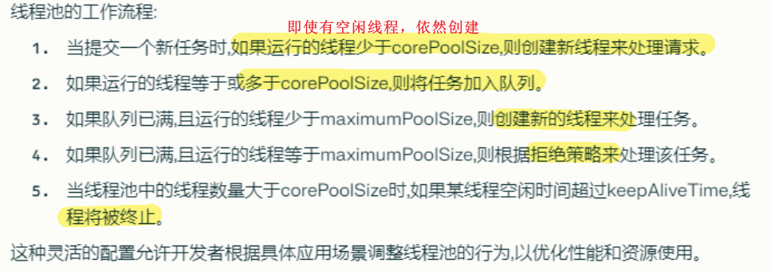

# 并发编程

[toc]

## 线程基础

* 进程：java中启动main函数即启动了一个JVM进程，main函数所在的线程就是这个进程中的一个线程，也即主线程。
* 多个线程共享进程的堆和方法区资源，每个线程都有自己的程序计数器、虚拟机栈和本地方法栈（寄存器和栈区）
* 用户线程：由用户空间程序管理和调度的线程，运行在用户空间（专门给应用程序使用
  * 无需用户态和内核态切换，开销较小
  * **不可以利用多核**：因为os无法感知用户线程的存在，只能将整个进程调度到某个cpu核心上运行
* 内核线程：由os内核管理和调度的线程，运行在内核空间（只有内核程序可以访问
  * os可以感知内核级线程，此时调度不以进程为单位，而是将内核线程独立地调度到不同的cpu核心上

### java线程和os线程的区别

* jdk1.2之前，java线程是一种用户级线程，即jvm（应用程序）自己模拟了多线程的运行，而不依赖于os
  * 不能直接使用操作系统提供的功能如异步 I/O、只能在一个内核线程上运行无法利用多核
* jdk1.2之后，Java线程改为基于os原生的内核线程实现，可以利用多核（即**现在的Java线程的本质其实就是操作系统的线程**

### process vs. thread (jvm视角)

* 多个线程共享进程的堆和方法区(jdk1.8之后的元空间)，但每个线程有自己的pc, 虚拟机栈和本地方法栈
  * 堆：主要用于存放创建的对象
  * 方法区：存放已被加载的类信息、常量、静态变量、即时编译后的代码等
  * 私有的pc是为了线程  切换后能恢复到正确的执行位置
  * 虚拟机栈：存储局部变量表、操作数栈、常量池引用等 -> 即线程内的局部变量不要给别的线程看到
  * 本地方法栈：类似

{width=70%}

### 线程创建与生命周期

* 继承Thread类、实现Runnable接口、实现Callable接口、使用线程池、使用CompletableFuture等都可以创建线程
* 严格来说，Java 就只有一种方式可以创建线程，那就是通过new Thread().start()创建。不管是哪种方式，最终还是依赖于new Thread().start()。（不懂...

* **implements Runnable接口，重写run方法（底层是静态代理模式）**
  * 创建一个Thread对象，并将Runnable接口实现类对象传递给它，然后调用start方法。
    * 可以把同一个Runnable对象（即用户自定义的被代理类：只用关注业务逻辑的实现）丢给多个线程使用（即Thread代理类：封装了创建和管理逻辑）（一份资源，多个代理） ==太妙了==
      *   
    *   
      * 详见onenote: Static Proxy

**线程生命周期和状态：**

`enum Thread.Stat`

> java分6类，os分5类：创建 就绪 运行 阻塞 终止
> java将os的就绪和阻塞态合并为RUNNABLE（因为现代线程切换太快了，没必要分开了
> java将os阻塞细分为：BLIOCKED, WAITING, TIMED_WAITING三种状态

* NEW: 初始状态，线程被创建出来但没有被调用start() （os创建态）
* RUNNABLE: 运行状态，线程被调用了start()等待运行的状态（等于os中的就绪态+运行态）
* BLOCKED：阻塞状态，需要**等待锁释放**
* WAITING：等待状态，表示该线程需要**等待其他线程做出一些特定动作**（通知或中断）
* TIMED_WAITING：超时等待状态，可以**在指定的时间后自行返回**而不是像WAITING那样一直等待（比如sleep和wait方法
* TERMINATED：终止状态，表示该线程已经运行完毕，即run方法执行完毕（os终止态）;线程终止之后不能再次启动

### Thread#sleep() vs. Object#wait()

* 二者都可以暂停线程执行
* sleep执行完毕不会释放锁，wait会释放
* sleep常用于暂停，wait常用于**线程间通信**
* 执行sleep()后线程会自动苏醒；wait()调用后，线程不会自动苏醒，需要其他线程调用同一对象的**notify()或notifyAll()**（此时是**WAITING状态**）；而wait(long timeout)这个有参版本可以设定超时参数，**会自动苏醒**（此时是**TIMED_WAITING状态**）
* 为什么wait()在Object中，而非定义在Thread中？
  * 将wait()定义在Object类中允许在任何对象上调用这个方法，而不仅限于Thread对象；每个对象（Object）都拥有对象锁，既然要释放当前线程占有的对象锁并让其进入 WAITING 状态，自然是要操作对应的对象（Object）而非当前的线程（Thread）

### 线程调用的本质 start() vs. run()

* 当运行该java程序时，即开启了一个进程，首先进入main方法开启主线程(即main线程)，然后t1.start()启动MyThread子线程，start()会调用线程的run(), 进而调用start0()，该方法时一个native本地方法，由jvm调用，底层是c/cpp（linux中jvm应该会调用pthread_create函数创建进程(unix-like os)）;
  * **所以一般可以说java本身是没有权限开启线程的**，java无法直接操作os，需要依赖底层的cpp
* 更进一步，start()调用start0()之后，**线程不会立马执行，只是将线程变成了就绪状态**，交给cpu调度。
* 执行MyThread子线程时，main主线程不会阻塞。此时，主线程和子线程并发或并行(如果有多核cpu)执行。主线程结束之后，子线程未必结束，所以当然进程也未必结束。

> JVM本身不负责线程的调度，而是将线程的调度委托给os；os通过抢占式的调度策略

**为何不直接使用主线程调用run()?** 
因为run()就是一个main线程下的一个**普通方法**，直接使用主线程调用run()并没有真的启动线程。执行该方法时，主线程被阻塞(很正常，没有启动子线程)。

  

### 线程相关method

* `setPriority(int)`: 更改线程的**优先级**；优先级低意味着调用概率低
  * `MIN_PRIORITY=1; NORM_PRIORITY=5; MAX_PRIORITY=10`
* `sleep(long millis)`: 休眠指定毫秒，线程被阻塞后会自动苏醒
* `join()`: 等待线程终止
* `yield()`: **线程礼让**，暂停当前正在执行的线程对象，并执行其他线程；注意暂停了并非阻塞，处于就绪状态，等待cpu调度
* `setDaemon()`: **守护线程**，用户线程结束之后，jvm不用管守护线程是否执行完毕...比如GC线程
* `interrupt()`: 中断线程，少用；推荐使用标志位停止线程
* `isAlive()`: 测试是否活动

## 多线程

并发 vs. 并行

同步 vs. 异步

* 同步：发出一个调用之后没有得到结果之前，该调用就不可以返回，一直等待
* 异步：调用在发出之后，不用等待返回结果，该调用直接返回

线程安全：在多线程环境下，对于同一份数据，不管有多少个线程同时访问，都能保证这份数据的正确性和一致性
现成不安全：...可能会导致数据混乱、错误或者丢失

### 单核 CPU 上运行多个线程效率一定会高吗

未必，取决于线程的任务类型：

* CPU密集型：主要进行计算和逻辑处理，需要占用大量的CPU资源
  * 多个线程同时运行会导致频繁的线程切换，增加了系统的开销，降低了效率
* IO密集型：主要进行输入输出操作，如读写文件、网络通信等，需要等待IO设备的响应，而不占用太多的CPU资源
  * 多个线程同时运行可以利用 CPU 在等待 IO 时的空闲时间，提高了效率

### 死锁

死锁：多个线程同时被阻塞，它们中的一个或者全部都在等待某个资源被释放。由于线程被无限期地阻塞，因此程序不可能正常终止

### 死锁检测 (java)

* 使用jmap、jstack等命令查看 JVM 线程栈和堆内存的情况。如果有死锁，jstack 的输出中通常会有 Found one Java-level deadlock:的字样，后面会跟着死锁相关的线程信息。另外，实际项目中还可以搭配使用top、df、free等命令查看操作系统的基本情况，出现死锁**可能**会导致 CPU、内存等资源消耗过高
* 采用VisualVM、JConsole等工具进行排查

> 死锁预防与避免见os section

### 虚拟线程

暂略

### Java内存模型 JMM

首先，我们知道线程间通信可通过共享内存，Java内存模型就是采用共享内存的并发模型；

> * 首先，**JMM和JVM的内存模型是两个完全不同的玩意儿**
> * JMM定义了Java语言如何与内存进行交互，即Java运行时的变量如何与内存交互。JMM抽象了线程和主内存之间的关系，主要目的是简化多线程编程，增强可移植性
> * JVM内存模型指的是JVM运行时内存如何划分的

JMM主要定义了对于一个共享变量，当另一个线程对这个共享变量执行写操作后，**这个线程对这个共享变量的可见性**。

* 主内存 main memory：线程之间的共享变量存在主内存（ie 多线程共享的内存区域
* 本地内存 local memory：每个线程都有一个私有的本地内存，存储共享变量的副本

> note: java的主内存和本地内存是逻辑概念，和物理内存和辅存没有直接对应关系；主内存和本地内存应该都是在物理内存RAM中的..有时可能在register和cache中，回头再看看吧

  
  

  

> JMM稍微还是有点抽象的，回头再看看

### 并发编程的三特性

* **原子性**：一次操作或者多次操作，要么所有的操作全部都得到执行要么都不执行；可借助synchronized, Lock及原子类实现...
* **可见性**：当一个线程修改了**共享变量**，那么另外的线程都是立即可以看到更新后的值；可借助synchronized, volatile, Lock实现...
* **有序性**：由于指令重排序问题，代码的执行顺序未必就是编写代码时候的顺序。volatile可以禁止指令进行重排序优化

### volatile

pronounce: `[ˈvɒlətaɪl]`
volatile可以保证变量的可见性、禁止指令重排序，但**不可保证原子性**

**保证变量可见性**：

在 Java 中，volatile关键字可以**保证变量的可见性**，将变量声明为volatile，这就指示JVM，这个变量是**共享且不稳定的**，**每次使用它都到主存中进行读取**。

> 在C语言中，它最原始的意义就是禁用CPU缓存。如果我们将一个变量使用volatile修饰，这就指示编译器，这个变量是共享且不稳定的，每次使用它都到主存中进行读取

**禁止指令重排序**：

将变量声明为 volatile ，在对这个变量进行读写操作的时候，会通过插入特定的 内存屏障 的方式来禁止指令重排序

  

### 乐观锁与悲观锁

暂略
这一块得结合os和c的锁好好整理一下

### 线程同步

> 线程同步包括线程互斥和线程同步
> 线程同步属于线程通信的大范畴

**同步synchronism**：多个线程/进程在一些关键点上可能需要相互等待与互通信息（即时间上有先后关系）
> 同步是直接制约关系，因为它明确地规定了进程间的依赖和顺序。

**互斥mutual exclusion / mutex**: 多线程/进程间存在共享数据资源，当一个线程进入临界区，其他线程必须被组织进入（等待） -> 间接制约关系
> 互斥是间接制约关系，因为进程间并不直接相互依赖，而是通过对共享资源的访问间接地相互影响。

#### synchronized

synchronized is a keyword: 用于线程同步
synchronized使用包括：synchronized方法 和 synchronized块

同步块`synchronized(Obj) {}`

* 其中Obj称作**同步监视器**，可以是任意对象/变量
* 同步方法中的同步监视器是this，即**对象本身**，无需指定Obj
* synchronized会执行块{}中代码之前需要锁定同步监视器，执行完毕释放
* 当static配和synchronized修饰一个方法时，就不再是**对象锁**了(非静态同步方法锁的是调用者)，而是**类锁**(静态同步方法锁的是类模板)

#### Lock

`java.util.concurrent.locks.Lock`

* `Lock` is interface, `ReentrantLock` is a implementation of `Lock`(常用)
* Lock和synchronized功能应该一样，就是可以显示加锁 释放锁，ie `lock.lock(); lock.unlock();`还有一个尝试获取锁`lock.tryLock()`(就是非忙等待锁咯)

Lock vs. synchronized

* Lock是interface，synchronized是keyword
* Lock是显式锁，必须手动开关，synchronized是隐式锁，出了作用域会自动释放
* Lock和synchronized都是可重入的（可重入是指同一线程多次获取同一把锁，不会被自己阻塞，不懂）
* Lock可判断锁状态，synchronized不可，即不可中断
* Lock可以实现公平锁(默认非公平),而synchronized只能是非公平锁
* Lock适合锁大量同步代码，synchronized适合少量代码同步
* Lock性能更好，扩展性更强（存疑

#### ReadWriteLock

实现类`ReentrantReadWriteLock`

* 维护一对关联的Lock，同步读读，互斥读写，互斥写写；粒度更细
* 可以理解为其中的写锁是独占锁，读锁是共享锁

#### BlockingQueue

实现类: `ArrayBlockingQueue`, `LinkedBlockingQueue`, `SynchronousQueue`...
> AbstractQueue: 非阻塞队列
> SynchronousQueue: 同步队列，只能存一个元素，put之后必须先拿出来

* 应用：生产者消费者，线程池

  

### 线程池

* 池化技术：是一种资源管理策略,旨在提高资源利用效率。其核心思想是**在需要时动态分配和重用资源**,**而不是频繁地创建和销毁**它们
  * 线程池: 预先创建一组线程,用于执行并发任务。适用于Web服务器、多线程下载器等场景；（复用 + 方便管理）
  * 连接池: 管理数据库连接的复用,减少数据库访问延迟，jdbc连接池
  * 对象池: 维护一组已创建的对象实例,适用于需要频繁创建和销毁对象的应用
  * 缓存池(存储频繁访问的数据), 文件池(存fd)，进程池等

==线程池**三大创建方法**==
  

```java
// note: 创建单个线程; 任务都是由同一个线程来执行
ExecutorService threadPoll1 = Executors.newSingleThreadExecutor();
// note： 创建固定数量线程池
ExecutorService threadPoll2 = Executors.newFixedThreadPool(10);
// note: 创建缓存线程池，可伸缩，遇强则强
ExecutorService threadPoll3 = Executors.newCachedThreadPool();

for (int i = 0; i < 1000000; i++) {
    threadPoll3.execute(() -> {
        System.out.println(Thread.currentThread().getName() + " is running");
    }); // 函数式接口Runnable的对象
}
```

**三种创建方式底层都是调用`ThreadPoolExecutor`**

==`ThreadPoolExecutor`线程池**7大参数**==

```java
public ThreadPoolExecutor(
  int corePoolSize,
  int maximumPoolSize,
  long keepAliveTime,
  TimeUnit unit,
  BlockingQueue<Runnable> workQueue,
  ThreadFactory threadFactory,
  RejectedExecutionHandler handler
  )
```

* corePoolSize: 核心线程数；池中一直保持活动的线程数量；当线程池中线程数量少于corePoolSize时，即使有空闲线程，依然会创建新线程
* maximumPoolSize: 最大线程数；当任务队列满 && 活动线程数 < maximumPoolSize -> 创建新新线程
* keepAliveTime: 线程空闲时间；
  * 当线程池中线程数 > corePoolSize时，如果某线程空闲时间 > keepAliveTime -> **终止该线程**（超时不候）
* unit: keepAliveTime参数的时间单位
* workQueue: 任务队列，保存**等待**执行的任务；如LinkedBlockingQueue或SynchronousQueue；
  * 如果等待队列满 && 运行的线程数 < maximumPoolSize -> **创建新线程**来处理任务（）
  * 如果等待队列满 && 运行的线程数 = maximumPoolSize -> 根据**拒绝策略**来处理该任务
* threadFactor: 线程工厂；用于创建新线程，可用来设置线程名称、优先级等
* handler: 拒绝策略；当任务太多无法处理时，采取的处理方式。RejectedExecutionHandler 接口有几种常见的实现，如 AbortPolicy（抛出异常）、CallerRunsPolicy（由调用线程处理任务）等。

> 最大承载任务数 = workQueue队列容量 + 最大线程数

  
> 还是挺妙的: 先创建够corePoolSize个 -> 加入队列 -> 创建够maximumPoolSize个 / 终止线程 -> 拒绝策略

==**4种**拒绝策略==

* `AbortPolicy()`: default; 不处理，并抛出异常`RejectedExecutionException`
* `CallerRunspolicy`: 交给调用者执行（比如通常返回给main线程执行了），哪儿来的去哪儿
* `DiscardPolicy`: 不管不顾；不处理，不抛出异常，任务**被直接丢弃**
* `DiscardOldestPolicy`: **尝试**和最早的任务进行竞争，如果竞争失败，直接扔掉，不抛出异常；如果成功则执行

==ThreadPoolExecutor参数设置经验==

* corePoolSize
  * CPU密集型任务，设置为cpu核心数 + 1
  * IO密集型任务，可设置较大的corePoolSize，常为cpu核心数的2倍
* maximumPoolSize
  * 建议设置为corePoolSize的2-3倍
  * 避免设置太大，导致资源耗尽
* workQueue
  * 对于短期异步任务,可使用SynchronousQueue（不懂
  * 对于长期任务,可使用LinkedBlockingQueue或ArrayBlockingQueue
