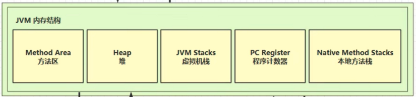

# JVM

[toc]

## Java内存区域详解

> 针对HotSpot JVM

Java程序员把内存控制权力交给JVM，而非像c++一样需要程序员手动new/delete，不容易出现内存泄漏和内存溢出问题，但一旦出现，你不了解jvm的话，很难排查错误。

### 运行时数据区域

JVM在执行Java程序的过程中会把它管理的内存划分成若干个不同的数据区域。

  
> 本地内存在JVM内存结构之外

apparently, 线程共享堆、方法区和*直接内存*；线程私有程序计数器、虚拟机栈和本地方法栈

#### PC

* 程序计数器存储**下一条**需要执行的字节码指令的**地址**
* 执行程序是，cpu/解释器根据pc的值从内存中取出指令，加载到指令寄存器中，然后执行该指令；故而得以：分支, 循环, 跳转...
* 每个线程都有一个**独立**的PC，便于线程切换后恢复执行位置，线程私有
* PC是唯一一个不会出现Out Of Memory的内存区域，生命周期跟随线程的创建和结束

#### 虚拟机栈/栈

* 核心，java方法调用都是通过栈实现（除了Native方法通过本地方法栈实现
* 线程私有，生命周期同于线程
* 每次方法调用都会压入一个栈帧(stack frame)到栈中，调用结束弹出该帧（包括main()
  * 无需GC回收栈内存，会自动弹出（同于cpp
* 栈由一个个栈帧(stack frame)组成，每个栈帧包括：
  * 局部变量表：存参数和局部变量（基本类型+对象引用，一般不存对象本身奥
  * 操作数栈：存计算过程的中间结果、临时变量
  * 方法返回地址：存方法执行完毕需返回的位置：
  * 动态链接：当一个方法要调用其他方法，需要将常量池中指向方法的**符号引用**转化为其在内存地址中的**直接引用**。动态链接的作用就是为了将符号引用转换为调用方法的直接引用
* 栈内存溢出StackOverflowError：
  * 栈帧过多… eg 往死里递归调用
  * 栈帧过大… （很少见了，你可以定义一大堆局部变量撑爆栈
  * 当然栈内存大小可以自定义(默认大概1M, -Xss定义)，一个线程占据一份，所以定义太大的话，线程数是要降低的
* 如果方法内局部变量没有**逃逸**方法的作用范围，它是线程安全的（**逃逸需要考虑线程安全**：比如引用类型变量作为参数传入或作为返回值返回，外部可能修改
  * > jdk1.7之后默认开启逃逸分析，如果对象未逃逸出方法，**可以直接在栈上为对象分配内存**

#### 本地方法栈

* native方法调用通过本地方法栈实现，同样创建一个栈帧...同样线程私有
  * 由于java有时不能直接操作os底层，所以有时依赖c/cpp

#### 堆

* 在虚拟机启动时创建，唯一目的就是**存放对象实例**，**几乎所有**对象实例和数据都存在heap中；（特殊情况就是逃逸分析
  * 是jvm管理的最大的一块内存；堆内存大小也可以自定义（默认大概几个G，-Xmx定义）
    * 堆内存是栈内存上千倍：是因为要存对象确实比存栈帧（局部变量&方法参数...要大的多
* 线程共享，需要考虑对象的线程安全问题
* 堆内存溢出OutOfMemoryError: Java heap space
* 是垃圾回收器管理的主要区域，故而也称作GC堆(Garbage Collected Heap)
  * > 现在收集器基本都采用分代垃圾收集算法，所以Java堆还可以细分为：新生代和老年代;再细致一点有：Eden、Survivor、Old 等空间

jdk及1.7之前堆内存划分为：新生代内存(Young Generation), 老生代(Old Generation), 永久代(Permanent Generation)

#### 方法区

* 方法区存储被jvm加载的:类信息(类名,修饰符,接口,父类...)、字段信息(名称,类型,修饰符)、方法信息(名称,返回值,参数,修饰符,字节码)、常量(字符串常量)、静态变量、即时编译器编译后的代码缓存等数据。
* 这是块逻辑区域（规范只定义了其概念和方法），不同jvm上方法区实现是不同的；永久代PermGen(＜jdk1.8)和元空间Metaspace(≥jdk1.8) (*具体实现*)是方法区(*规范*)的两种实现方法
  * 元空间存在本地内存，相比于永久代存在jvm中，具备更大的空间，可以加载更多的类，不易OOM
    * 方法区内存溢出也报错(就是你加载了一大堆class的时候，给方法区干爆)OutOfMemory:Metaspace (jdk1.8); OutOfMemory:PermGen space (<jdk1.8)

##### 字符串常量池

见`java.md`

#### 直接内存

* direct memory是一块特殊的内存缓冲区（属于os内存
  * 常见于NIO操作时，用作数据缓冲区
    * NIO(Non-Blocking I/O)引入了一种基于通道channel和缓冲区Buffer的I/O方式，可直接使用nativa函数库直接分配堆外内存，然后通过一个存储在 Java 堆中的 DirectByteBuffer 对象作为这块内存的引用进行操作，避免了在 Java 堆和 Native 堆之间来回复制数据

  
