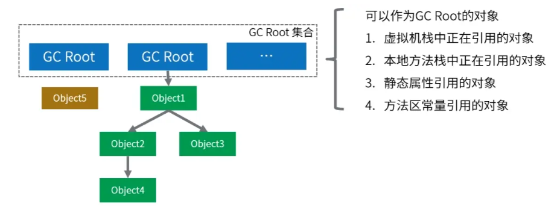

# JVM

- [JVM](#jvm)
  - [Java内存区域详解](#java内存区域详解)
    - [运行时数据区域](#运行时数据区域)
      - [永久代 vs. 元空间](#永久代-vs-元空间)
    - [栈 vs. 堆](#栈-vs-堆)
    - [堆细分](#堆细分)
      - [Minor GC vs. Major GC vs. Full GC](#minor-gc-vs-major-gc-vs-full-gc)
    - [四种引用类型](#四种引用类型)
    - [内存溢出 vs. 内存泄漏](#内存溢出-vs-内存泄漏)
      - [内存泄漏原因](#内存泄漏原因)
  - [类初始化和类加载](#类初始化和类加载)
    - [对象的创建过程](#对象的创建过程)
      - [对象的内存布局](#对象的内存布局)
    - [对象的销毁过程](#对象的销毁过程)
    - [对象的生命周期](#对象的生命周期)
    - [类加载过程 / 生命周期](#类加载过程--生命周期)
    - [类加载器ClassLoader](#类加载器classloader)
    - [双亲委派模型](#双亲委派模型)
      - [双亲委派模型的作用](#双亲委派模型的作用)
  - [垃圾回收](#垃圾回收)
    - [垃圾回收与触发条件](#垃圾回收与触发条件)
    - [垃圾检测算法](#垃圾检测算法)
    - [垃圾回收算法 / 垃圾收集算法](#垃圾回收算法--垃圾收集算法)
    - [垃圾回收器 / 垃圾收集器](#垃圾回收器--垃圾收集器)
    - [详解CMS收集器垃圾回收过程](#详解cms收集器垃圾回收过程)

## Java内存区域详解

> 针对HotSpot JVM

Java程序员把内存控制权力交给JVM，而非像c++一样需要程序员手动new/delete，不容易出现内存泄漏和内存溢出问题，但一旦出现，你不了解jvm的话，很难排查错误。

### 运行时数据区域

JVM在执行Java程序的过程中会把它管理的内存划分成若干个不同的数据区域。

{width=90%}
> 本地内存在JVM内存结构之外
> 字符串常量池(ie 串池)：专门存储string字面量的(为了重用)，在堆中
> 运行时常量池：存储类加载后生成的各种字面量、符号引用等，位于方法区

线程共享堆、方法区和*直接内存*；线程私有程序计数器、虚拟机栈和本地方法栈

1. **方法区/元空间/永久代**：方法区是一个逻辑概念，元空间和永久代都是对JVM规范中**方法区的实现**。
   1. 方法区存储被JVM加载的：**类信息**(类名, 修饰符, 接口, 父类...), **字段信息**(类中所有字段/变量(包括static变量)的名称, 类型, 修饰符), **方法信息**(名称, 参数类型, 返回类型, 方法的字节码), **运行时常量池**, 即时编译器**JIT编译后的代码缓存**等数据
   2. 方法区是逻辑概念，jdk1.7使用**永久代**PermGen实现，jdk1.8使用**元空间**Metaspace实现
   3. 永久代在JVM中，元空间使用本地内存，具备更大的空间
      1. **Q: 永久代能不能算堆内存**：永久代和堆的老年代是连续的，所以可以被视为堆的一部分。元空间肯定不能算了
2. **虚拟机栈**：每个线程有一个私有的栈，随着线程的创建而创建。栈由一个个 **栈帧(stack frame)** 组成，每个java方法会创建一个栈帧，调用结束后弹出该帧。栈的大小可以固定也可以动态扩展。
   1. 栈帧中存放了局部变量表（参数+局部变量：基本类型+对象引用(非对象本身)）、操作数栈(计算过程的中间结果)、方法返回地址(出口)等信息
   2. 栈内存溢出`StackOverflowError`: 栈帧过多(往死里递归调用)，栈帧过大(eg 一大堆局部变量)
      1. 通过`-Xss1m`定义jvm栈的大小为1MB（一个线程一份奥）; 默认大概`256KB-1MB`
   3. 栈内存无需GC回收，会自动弹出
3. **本地方法栈**：与虚拟机栈类似，native方法通过本地方法栈实现，同样创建一个栈帧
   1. native method: 用c/cpp实现的方法，而非java，通常是需要操作os底层，需要借助系统调用去内核态操控系统资源（java并不可以直接使用os的系统调用）
4. **程序计数器PC**：存储当前线程**下一条**要执行的字节码指令的**地址**。为了线程切换后能恢复到正确的执行位置，每条线程都需要一个独立的PC(线程私有)。
   <!-- 1. 执行程序是，cpu/解释器根据pc的值从内存中取出指令，加载到指令寄存器中，然后执行该指令；故而得以：分支, 循环, 跳转... -->
   <!-- 2. PC是唯一一个不会出现Out Of Memory的内存区域，生命周期跟随线程的创建和结束 -->
5. **堆内存**：在虚拟机启动时创建，唯一目的就是**存放对象实例**，==几乎所有==对象和数组都在堆上进行分配。
   1. 堆内存溢出`OutOfMemoryError: java heap space`
      1. 通过`-Xmx`定义最大堆大小；默认`几个G`，占据JVM空间最多，管理最复杂
   2. 是GC垃圾回收管理的主要区域
   3. 几乎所有：因为有些对象会在栈上分配内存 -> JVM**逃逸分析**(jdk1.7默认开启) （一般可以忽略）
      1. 简述逃逸分析：如果一个对象仅在方法内部创建使用，不会传递到外部，即该对象未逃逸出方法，jvm就可以将该对象在栈上分配内存，这样其内存随着栈帧销毁就自动释放了，至少可以减轻GC压力吧
   <!-- 3. jdk1.8后，字符串常量池从永久代中剥离出来，存放在堆中。 -->
6. **直接内存(direct memory)**：直接内存不属于JVM运行时内存区域，属于OS内存。可以通过NIO等方式直接分配内存。
   1. > 在JDK1.4中新加入了 **NIO(New Input/Output)** 类，引入了一种基于通道(Channel)与缓冲区（Buffer）的I/O 方式，它可以使用native函数库直接分配堆外内存，然后通过一个存储在Java堆中的DirectByteBuffer对象作为这块内存的引用进行操作。这样能在一些场景中显著提高性能，因为避免了在Java堆和Native堆中来回复制数据。

<!--    -->

<!-- 虚拟机栈/栈
* 栈由一个个栈帧(stack frame)组成，每个栈帧包括：
  * 局部变量表，操作数栈，方法返回地址
  * 动态链接：当一个方法要调用其他方法，需要将常量池中指向方法的**符号引用**转化为其在内存地址中的**直接引用**。动态链接的作用就是为了将符号引用转换为调用方法的直接引用
-->

#### 永久代 vs. 元空间

二者是方法区的实现，jdk7是永久代PermGen，jdk8是元空间MetaSpace(本地内存)，之所以替换是为了解决一些问题：

* 内存限制：永久代是堆的一部分，大小固定，容易内存溢出，特别是在**加载大量类或大量使用反射时**。元空间使用本地内存，没有固定的大小限制，能够根据需要**动态扩展**，不易OOM
* 垃圾收集比较复杂，元空间不再依赖堆内存的垃圾回收机制（再具体就不知道了）

### 栈 vs. 堆

1. **用途**：栈主要通过栈帧来存储局部变量、方法调用的参数、方法返回地址以及一些临时数据。堆用于存储对象实例和数组(当你new一个对象时，对象实例就会在堆上分配空间)
2. **可见性**：栈中数据是线程私有的，堆中数据是线程共享的
3. **生命周期**：栈中的数据生命周期确定，当一个方法调用结束时，其对应的栈帧(内含的数据)就会被销毁。**堆中的对象生命周期不确定**，对象会在垃圾回收机制**GC检测到对象不再被引用时才被回收**
4. **存取速度**：**栈的存取速度更快**，因为栈遵循FIFO，直接连续分配就好了，简单。而对象在堆上的分配则要考虑空闲块、内存碎片啥的，可能非连续内存分配，麻烦；而且堆要GC麻烦，栈直接弹出即可
5. **存储空间**：栈的空间更小，且固定，由os管理。当栈溢出时，通常是因为**递归过深或局部变量过大**。堆的空间较大，**动态扩展**，由JVM管理。堆溢出通常是由于**创建了太多的大对象或未能及时回收不再使用的对象**

### 堆细分

  

{width=80%}
> 年轻代:老年代=1:2, eden space : survivor spaces = 8:2

1. **年轻代 (Young Generation)**
   1. **Eden`[ˈiːdn]` Space**: 新创建的对象首先分配在eden space。Eden区相对较小，当Eden区满时，会触发一次**Minor GC（新生代垃圾回收）**
   2. **Survivor Spaces**: 通常分为两个相等大小的区域，称为S0(from survivor)和S1(to survivor)。**每次Minor GC后，存活下来的对象会被移动到其中一个Survivor空间或者老年代**，以继续它们的生命周期。
      1. 这两个区域轮流充当对象的中转站，帮助区分**短暂存活的对象**和**长期存活的对象**(默认15次minor gc)
2. **老年代 (Old Generation/Tenured Generation)**: 存放过多次Minor GC (default=15) 仍存活的对象会被移动到老年代
   1. **老年代中的对象生命周期较长**，所以空间比新生代大。
   2. 老年代的垃圾回收叫**Major GC**，发生频率更低，但执行时间更长
3. **永久代（Permanent Generation）**：老版本java中方法区由永久代实现，可以认为是堆的一部分，jdk8之后更新为元空间，移到了本地内存，解决了方法区内存溢出问题
4. > 大对象区（Humongous Objects）:在某些JVM实现中（如G1垃圾收集器），为大对象分配了专门的区域。大对象是指**需要大量连续内存空间的对象**，eg 大数组。这类对象直接分配在老年代，以避免因频繁的年轻代晋升而导致的内存碎片化问题

#### Minor GC vs. Major GC vs. Full GC

垃圾回收机制GC根据其作用范围和触发条件的不同，为三种类型:

* **Minor GC** (Young GC)
  * **作用范围**：**只针对年轻代进行回收**，包括Eden区和两个Survivor区（S0和S1）
  * **触发条件**：当Eden区满时，JVM会触发一次Minor GC，将Eden区和一个Survivor区中的**存活对象移动到另一个Survivor区或老年代**（**只有当对象的年龄达到阈值(default=15)时，这些对象才会被晋升到老年代**
  * **特点**：**频繁**发生，因为年轻代中对象的生命周期较短，回收效率高，暂停时间相对较短
* **Major GC** (Old GC)
  * **触发条件**：当**老年代空间不足时**，jvm会自动触发major gc，通常是在多次minor gc之后发生，以清理哪些存活时间较长的对象
  * **特点**：发生**频率较低**，但每次回收可能需要**更长时间**，因为涉及到更多内存
* **Full GC**
  * **作用范围**：对**整个堆内存**（包括年轻代、老年代以及永久代/元空间）进行回收，是最全面且耗时的GC。
  * **触发条件**：
    * 当**年轻代无法容纳新对象 && 老年代也没有足够空间**时，触发
    * 或者**显式调用**`System.gc()`，或者在永久代满时触发
  * **特点**：Full GC是**最昂贵**的操作，因为它**需要停止所有的工作线程**（Stop The World），遍历整个堆内存来查找和回收不再使用的对象，因此应尽量减少Full GC的触发

### 四种引用类型

> 强软弱虚
> 弱虚很少用，软挺常用的，可以加速jvm对垃圾内存的回收速度，避免内存溢出OOM

1. **强引用Strong**: 最常见的，eg `Person a = new Person()`，任何对象只要被强引用关联，GC**绝不回收**他们（即使内存不足），如果想要回收对象，必须显式地将强引用置为null
   1. `String str = new String("哈哈");`
2. **软引用 Soft Reference**: 描述一些非必需但仍有用的对象(可有可无)。当**内存不足时GC才会回收软引用对象**(如果内存足够不会回收)；通过`SoftReference`类实现
   1. `SoftReference<String> softRef = new SoftReference<>(new String("哈哈"));`
   2. 常用于实现缓存机制，比如图像缓存，内存不够了就自动回收了，不会崩掉；内存足够就空间换点性能...挺妙的
3. **弱引用 Weak Reference**: 弱引用对象在下一次垃圾回收时一定会回收(不管内存够不够)
   1. `WeakReference<String> weakRef = new WeakReference<>(new String("哈哈"));`
   2. 在实现ThreadLocal类时，通常会使用弱引用来存储线程局部变量。这确保了当线程结束后，相关的变量能够被及时清理，从而避免内存泄漏（TODO）
4. **虚引用PhantomReference**: 最弱，形同虚设，主要用来**跟踪对象被垃圾回收的状态**。

### 内存溢出 vs. 内存泄漏

* **内存溢出** OOM：JVM在**申请内存时无法找到足够的内存**，最终引发错误: `OutOfMemoryError`
  * 内存溢出可能是由于内存泄漏导致的(占满了)，也可能是因为程序一次性尝试分配大量内存，内存直接就干崩溃了导致的。

<!-- * 内存溢出常见原因：
  * **栈溢出**：**递归调用**，深度递归导致栈溢出: `StackOverFlowError`
  * **堆内存溢出**：**创建大量对象**，程序中不断创建大量对象，超出JVM堆的限制: `OutOfMemoryError:Java heap space`
  * **元空间溢出**：系统的**代码非常多**或引用的第三方包非常多或者通过动态代码生成类加载等方法，导致元空间的内存占用很大。`java.lang.OutOfMemoryError: Metaspace` -->

* **内存泄露** Memory Leak：程序在使用完内存后，未能释放已分配的内存空间，导致这部分内存无法被其他人使用。即不再需要的对象还在引用着，GC无法去回收。致这些对象无法被GC回收。

#### 内存泄漏原因

* **静态集合类**：使用静态集合类（eg HashMap或ArrayList），在类加载时被初始化，并且生命周期和jvm一样，即他们会在整个程序运行期间都存在。如果这些static集合持有对其他对象的引用，即使这些对象在业务逻辑中不再使用，它们也无法被GC回收（即**长生命周期对象持有短生命周期对象**，比如你讲一个方法内的局部类型的对象变量添加到static集合类中，本来我们想方法结束后自动释放，但无法如愿...
* 创建的连接不再使用时，需要调用**close()关闭连接**，只有连接被关闭后，GC才会回收对应的对象（Connection，Statement，ResultSet，Session）。忘记关闭这些资源会导致持续占有内存，无法被 GC 回收。

* 如果使用了**ThreadLocal**而没有及时调用remove()，在使用线程池时可能会导致内存泄漏，因为线程会持有对某些对象的引用。
<!-- * **事件监听**：未取消对事件源的监听，导致对象持续被引用 -->
ThreadLocal 的弱引用导致内存泄漏也是个老生常谈的话题了，使用完 ThreadLocal 一定要记得使用 remove 方法来进行清除。

## 类初始化和类加载

### 对象的创建过程

1. **类加载检查**：虚拟机遇到一条new指令时(`eg new Person()`)，首先查找常量池中的**符号引用**，检查`Person`类是否已经被加载。如果没有，那必须先执行相应的 **==类加载过程==(加载、解析、初始化)**
   1. > 符号引用：是**地址的替代品**，是一个字符串的形式，这样比较灵活。
2. **分配内存**：虚拟机将为新对象分配堆内存。
   1. > 对象所需的内存大小在类加载完成后便可确定
3. **初始化零值**：将分配的内存空间都初始化为零值
   1. > 保证了对象的实例字段在Java代码中可以不赋初始值就直接使用，程序能访问到这些字段的数据类型所对应的零值。
4. **设置对象头**：Object header 参考下文
5. **执行构造方法`<init>`**：**将成员变量赋值为预期的值**，这样一个对象就创建完成了
   1. > `<init>`是jvm给构造方法的特殊命名

#### 对象的内存布局

HotSpot中:

一个对象在堆中的布局可以分为三个部分：

* **对象头 object header**: 
  * **标记字** Mark word: eg 对象的hashcode，GC分代年龄，锁状态标志（如偏向锁、轻量级锁、重量级锁）； 64bit os下占用8B
  * **类型指针** class pointer: 指向对象所属类的**元数据**，jvm可以通过该指针确定对象属于哪个类，然后获取类的信息。(64bit os 8B)
    * **所以正常对象的object header在32位os上是8B，64位os上是16B**
  * 数组长度：如果对象是数组类型，会多一个数组长度字段(4B)
* 实例数据 instance data: 实例中的字段数据
* 对象填充 padding: 保证对象的总大小总是8B的倍数，内存对齐嘛

### 对象的销毁过程

* 对象创建完成后，就可以通过引用来访问对象的方法和属性，当对象**不再被任何引用指向时**，对象就会变成垃圾。
* 垃圾收集器会通过**可达性分析**算法判断对象是否存活，如果对象不可达，就会被回收。
* 垃圾收集器会通过标记清除、标记复制、标记整理等算法来回收内存，将对象占用的内存空间释放出来。
  * 常用的垃圾收集器有CMS、G1、ZGC等，它们的回收策略和效率不同，可以根据具体的场景选择合适的垃圾收集器。

### 对象的生命周期

* **创建**：对象通过关键字new在堆内存中被实例化，内存被分配，构造函数被调用
* **使用**：对象被引用并执行相应的操作，可以通过引用访问对象的属性和方法，在程序运行过程中被不断使用
* **销毁**：当对象不再被任何引用指向时，**对象就会变成垃圾**；GC会通过**可达性分析**算法判断对象是否存活，如果对象不可达，就会被回收。GC通过标记清除、标记复制、标记整理等算法来回收内存，**常用的GC有CMS, G1, ZGC**

### 类加载过程 / 生命周期

  

类加载：就是**将`.class`字节码文件加载到jvm中**，然后才可以使用

> `.class`文件就是源码`.java`编译后生成的**二进制**字节码文件
> **一些概念 / 我认为的反射本质（应该没问题吧）**：`Class`是一个Java类，每个被加载的类都有一个对应的`Class`对象，`Class`对象是一个对象实例，所以存放在**堆**中，封装类的元数据的**引用**；类的元数据(类,字段,方法的信息)存放在**方法区**，Class对象中保存着指向这个类的元数据的引用，所以我们可以使用反射通过一个类的Class对象拿到这些信息

加载Class类型的文件主要三步：**加载->连接->初始化** (==**由类加载器ClassLoader完成**==)，连接又分为：**验证->准备->解析**

1. **加载**：
   1. 通过类的**全限定名** (包名+类名) 获取到该类的二进制字节流 (在.class文件中)
   2. 将字节流所代表的静态存储结构，转化为方法区运行时的数据结构
   3. **在内存中生成一个代表该类的==Class对象==**，作为方法区这个类的各种数据的访问入口
      1. 这个Class对象就是传说中的反射中获取的Class对象，包含了类的详细信息，是反射机制的基础
2. **连接**：验证->准备->解析
   1. **验证**：确保class文件中的字节流包含的信息，符合当前虚拟机的规范要求，保证这些信息被当做代码运行后**不会危害虚拟机自身的安全**。可以有效防止恶意代码的执行
      1. 验证阶段大致会完成以下四个阶段的检验动作：**文件格式**校验、**元数据**验证、**字节码**验证、**符号引用**验证
   2. **准备**：为类的**static变量**分配内存并设置默认初始值，eg int是0, boolean是false。
      1. instance变量并不会分配内存和初始化
      2. Q: static变量会被加载到方法区，可方法区是逻辑概念，java7时由永久代实现，没问题。java8由永久代实现，可是永久代移动到了堆中？所以static变量也跑到了堆中？
   3. **解析**：jvm将常量池的**符号引用**替换为**直接引用**
      1. 符号引用：以一组符号来描述所引用的目标，符号可以是任何形式的字面量，只要使用的时候可以无歧义地定位到目标即可。引用的目标未必是已经加载到jvm内存中的内容。
      2. 直接引用：**直接指向目标的指针**、**相对偏移量**或是**一个能间接定位到目标的句柄**。直接引用和jvm的内存布局直接相关。如果有了直接引用， 那引用的目标必定已经存在在内存中了。
3. **初始化**：执行类的构造器方法`<clinit>()`，是类加载的最后一步，要注意的是这里的构造器方法()并不是开发者写的，而是编译器自动生成的。
4. **使用**：使用类或者创建对象
5. **卸载**：如果有下面的情况，类就会被卸载：
   1. 该类**所有的实例对象都已被GC回收**，也就是堆中不存在该类的任何实例
   2. **该类**(对应的Class对象)没在其他任何地方被引用（eg 反射）
   3. 加载该类的**ClassLoader实例已经被GC回收**

### 类加载器ClassLoader

类加载器（ClassLoader）用于**动态加载Java类到java虚拟机JVM**中。主要有四种类加载器：

* **启动类加载器Bootstrap ClassLoader**：最顶层的类加载器，负责加载Java的**核心类库** (eg `jre/lib`目录下的类); 使用cpp编写，是JVM的一部分。
  * 启动类加载器无法被Java程序直接引用。
* **扩展类加载器Extension ClassLoader**：它是Java编的，继承自ClassLoader类，负责加载Java扩展目录（`jre/lib/ext`或由系统变量`java.ext.dirs`指定的目录）下的jar包和类库。**扩展类加载器由启动类加载器加载**，其父加载器就是启动类加载器。
* **应用程序类加载器Application ClassLoader**：也是Java编的，负责加载**用户类路径/系统类路径**ClassPath上的类库。我们编写的任何类都是用它来加载的，除非显示指定自定义类加载器。
* **自定义类加载器Custom ClassLoader**：我们可以通过继承`java.lang.ClassLoader`创建自己的类加载器，比如从网络加载class文件、数据库、甚至是加密的文件中加载类等

### 双亲委派模型

* **Parent Delegation Model**: 一个类加载器在尝试加载某个类时，首先会**将加载任务委托给其父类加载器去完成**
* 每一层次的类加载器都是如此，因此**所有的加载请求最终都应该传送到顶层的启动类加载器中**
* 启动类加载器会尝试加载这个类。如果能加载就直接返回；如果不能加载（**因为这个类不在它的搜索范围内**），就将加载任务**返回给委托它的子加载器**
* 子加载器接着尝试加载这个类。如果子加载器也无法加载，则继续向下传递加载任务，直到找到能加载该类的ClassLoader
* 如果所有加载器都无法加载这个类，最终抛出 `ClassNotFoundException`

#### 双亲委派模型的作用

* **避免类的重复加载**：类加载器会先委托给父加载器尝试加载类，如果父类加载好了，当前ClassLoader就不会再去加载了。如果没有这种模型，可能会导致**同一个类被不同的类加载器重复加载到内存中**，造成浪费和冲突。
* **保证安全性**：如果用户自定义了一个与Java核心库相同名称的类(eg `java.lang.String`)，启动类加载器只会加载**信任路径**下的核心库中的类，而非你用户定义的不可信的假冒核心类。防止了你恶意代码替换核心类库

## 垃圾回收

1. 为什么要垃圾回收（内存泄露、内存溢出）
2. 垃圾判断/检测（引用计数，可达性分析）
3. 垃圾回收算法（标记清除、标记整理、标记复制、分代收集）
4. 常见垃圾回收器（CMS、G1）

### 垃圾回收与触发条件

垃圾回收(**Garbage Collection**, GC): 是**自动管理内存的一种机制**，它负责**自动释放不再被程序引用的对象所占用的内存**，这种机制减少了内存泄漏和内存管理错误的可能性。

垃圾回收触发条件：

* **内存不足时**：当JVM检测到堆内存不足，无法为新的对象分配内存时，会自动触发垃圾回收
* **手动请求**：虽然垃圾回收是自动的，开发者可以通过调用`System.gc()`或 `Runtime.getRuntime().gc()`**建议JVM进行垃圾回收**。不过这只是一个建议，并不能保证立即执行
* **JVM参数**：启动Java应用时可以通过JVM参数来调整垃圾回收的行为，eg `-Xmx`（最大堆大小）, `-Xms`（初始堆大小）等
* **对象数量或内存使用达到阈值**: 垃圾收集器内部实现了一些策略，以监控对象的创建和内存使用，达到某个阈值时触发垃圾回收

### 垃圾检测算法

**垃圾回收机制**就是为了自动 ==**检测垃圾**== 和 ==**回收垃圾**==，无需像c一样手动free/delete，提高开发效率，减少出错。

判断对象是否为垃圾（即**不再被使用**）主要依据两种主流的垃圾回收算法来实现：**引用计数法**和**可达性分析算法**。

* **引用计数法（Reference Counting）**
  * 原理：为每个对象分配一个**引用计数器cnt**，每当有一个地方引用它时，cnt++；当引用失效时，cnt--。当cnt==0时，表示对象不再被任何变量引用，可以被回收。
    * 像cpp的智能指针，也像linux硬链接，大概还像可重入锁的原理
  * 缺点：虽然很简单，但会出现**循环引用**的问题，即两个对象相互引用，但不再被其他任何对象引用，这时引用计数器不会为0，导致对象无法被回收（不再使用）
* **可达性分析算法（Reachability Analysis）**(主要)
  * 原理：从**一组**称为**GC Roots**的对象出发，向下追溯它们引用的对象，以及这些对象引用的其他对象，以此类推。如果一个对象无法从GC roots到达，则可以被回收。
    * **GC Roots对象包括**：虚拟机栈中引用的对象，本地方法栈中引用的对象，方法区中静态属性引用的对象，方法区中常量引用的对象等

  

### 垃圾回收算法 / 垃圾收集算法

1. **标记-清除算法 (Mark-and-Sweep)**：先根据可达性分析标记出所有可达的对象，然后**回收所有不可达/未标记的对象**
   1. 缺陷一：标记和清除的过程效率都不高
   2. 缺陷二：清除结束后会造成大量不连续的内存碎片。有碎片，后续申请大块连续内存就难顶了
2. **标记-复制算法 (Mark-and-Copy)**: 将内存分为两块，**每次申请内存时只使用其中一块**。当这一块的内存用完了，就**将还存活着的对象复制到另外一块上面**，然后清理掉这一块
   1. 缺陷：每次申请内存时，都只能使用一半的内存空间。内存利用率严重不足
3. **标记-整理算法 (Mark-and-Compact)**：标记之后不会直接清理。而是**将所有存活对象都移动到内存的一端**，然后清理整理后的边界以外的内存
   1. 缺陷：移动对象的成本高
4. **分代回收算法 (主流方法)**：**根据对象存活周期(经历过的GC次数)的不同**，将内存划分成了**新生代和老年代**。对象创建时，一般在新生代申请内存，当经历一次GC之后如果对还存活，那么对象的年龄+1。当年龄超过阈值后，如果对象还存活，那么该对象会进入老年代
   1. 阈值默认是15，可以通过参数`-XX:MaxTenuringThreshold`来设定
   2. 这也是为什么jvm要分为新生代和老年代

### 垃圾回收器 / 垃圾收集器

如果说收集算法是内存回收的**方法论**，那么垃圾收集器就是内存回收的**具体实现**。

> 没有最好的、全能的垃圾回收器，只有具体场景最合适的

JDK 默认垃圾收集器（使用 java -XX:+PrintCommandLineFlags -version 命令查看）：
JDK 8：Parallel Scavenge（新生代）+ Parallel Old（老年代）JDK 9 ~ JDK20: G1Serial 收集器

* **Serial(串行)收集器** (复制算法): “单线程” 的意义不仅仅意味着它只会使用一条垃圾收集线程去完成垃圾收集工作，更重要的是它**在进行垃圾收集工作的时候必须暂停其他所有的工作线程**（"Stop The World"），直到它收集结束。
  * 新生代采用标记-复制算法，老年代采用标记-整理算法。
  * 新生代单线程收集器，标记和清理都是单线程，优点是简单高效；
* **ParNew收集器** (复制算法): 是Serial收集器的多线程版本，在多核CPU环境下有着比Serial更好的表现；其他和Serial一样
* **Parallel Scavenge`[ˈskævɪndʒ]`收集器** (复制算法): 和ParNew类似，不过**追求高吞吐量**，高效利用 CPU。
  * `吞吐量 = 用户线程时间 / (用户线程时间 + GC线程时间)`，高吞吐量可以高效率的利用CPU时间，尽快完成程序的运算任务，适合后台应用等对交互相应要求不高的场景；
  * scavenge: 捡破烂、拾荒、清道夫
* **Serial Old收集器** (标记-整理算法): Serial收集器的老年代版本；主要有两大用途：一种用途是在 JDK1.5 以及以前的版本中与 Parallel Scavenge 收集器搭配使用，另一种用途是作为 CMS 收集器的后备方案。
* **Parallel Old收集器** (标记-整理算法)：Parallel Scavenge收集器的老年代版本；
* **CMS(Concurrent Mark Sweep)收集器**（标记-清除算法）：以获取**最短回收停顿时间**为目标的收集器, 是HotSpot JVM第一款真正意义上的并发收集器，它第一次实现了让垃圾收集线程与用户线程（**基本上**）同时工作
* **G1(Garbage First)收集器** (标记-整理算法)： JDK1.7提供的一个新收集器，也就是说不会产生内存碎片。此外，G1收集器不同于之前的收集器的一个重要特点是：G1回收的范围是整个Java堆(包括新生代，老年代)，而前六种收集器回收的范围仅限于新生代或老年代

### 详解CMS收集器垃圾回收过程

CMS主要使用了**标记-清除算法**进行垃圾收集：

1. 初始标记（Initial Mark）：标记所有从GC Roots直接可达的对象，这个阶段需要STW，但速度很快
2. 并发标记（Concurrent Mark）：从初始标记的对象出发，遍历所有对象，标记所有可达的对象。这个阶段是并发进行的，STW。
3. 重新标记（Remark）：完成剩余的标记工作，包括处理并发阶段遗留下来的少量变动，这个阶段通常需要短暂的 STW 停顿。
4. 并发清除（Concurrent Sweep）：清除未被标记(不可达)的对象，回收它们占用的内存空间。

其中**Remark使用三色标记法**：

