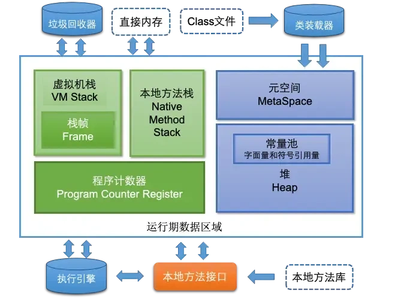
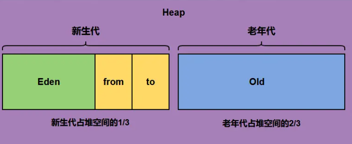

# JVM

## 内存模型

### 1. JVM的内存模型介绍一下

根据 JVM8 规范，JVM 运行时内存共分为虚拟机栈、堆、元空间、程序计数器、本地方法栈五个部分。还有一部分内存叫直接内存，属于操作系统的本地内存，也是可以直接操作的。

JVM的内存结构主要分为以下几个部分：

+ **元空间**：元空间的本质和永久代类似，都是对JVM规范中方法区的实现。不过元空间与永久代之间最大的区别在于：**元空间并不在虚拟机中**，而是使用本地内存。
+ **Java 虚拟机栈**：每个线程有一个私有的栈，随着线程的创建而创建。栈里面存着的是一种叫“栈帧”的东西，每个方法会创建一个栈帧，栈帧中存放了局部变量表（基本数据类型和对象引用）、操作数栈、方法出口等信息。栈的大小可以固定也可以动态扩展。
+ **本地方法栈**：与虚拟机栈类似，区别是虚拟机栈执行java方法，本地方法栈执行native方法。
+ **程序计数器：**程序计数器可以看成是当前线程所执行的字节码的行号指示器。为了线程切换后能恢复到正确的执行位置，每条线程都需要一个独立的程序计数器，这类内存区域为“线程私有”内存。
+ **堆内存**：堆内存是 JVM 所有线程共享的部分，在虚拟机启动的时候就已经创建。所有的对象和数组都在堆上进行分配。这部分空间可通过 GC 进行回收。当申请不到空间时会抛出 OutOfMemoryError。堆是JVM内存占用最大，管理最复杂的一个区域。其唯一的用途就是存放对象实例：**所有的对象实例及数组都在堆上进行分配**。jdk1.8后，字符串常量池从永久代中剥离出来，存放在堆中。
+ **直接内存**：直接内存**并不是**虚拟机运行时数据区的一部分，也不是Java 虚拟机的内存区域。在JDK1.4 中新加入了NIO，它可以使用native 函数库直接分配堆外内存，然后通过一个存储在Java堆中的DirectByteBuffer 对象作为这块内存的引用进行操作。这样能在一些场景中显著提高性能，因为避免了在Java堆和Native堆中来回复制数据。

### 2. JVM内存模型里的堆和栈有什么区别？

- **用途**：
  + 栈主要用于存储局部变量、方法调用的参数、方法返回地址以及一些临时数据。每当一个方法被调用，一个栈帧就会在栈中创建，用于存储该方法的信息，当方法执行完毕，栈帧也会被移除。
  + 堆用于存储对象的实例（包括类的实例和数组）。当你使用`new`关键字创建一个对象时，对象的实例就会在堆上分配空间。
- **生命周期**：
  + 栈中的数据具有确定的生命周期，当一个方法调用结束时，其对应的栈帧就会被销毁，栈中存储的局部变量也会随之消失。
  + 堆中的对象生命周期不确定，对象会在垃圾回收机制GC检测到对象不再被引用时才被回收。
- **存取速度**：
  + 栈的存取速度通常比堆快，因为栈遵循先进后出的原则，操作简单快速。
  + 堆的存取速度相对较慢，因为对象在堆上的分配和回收需要更多的时间，垃圾回收机制也会影响性能。
- **存储空间**：
  + 栈的空间相对较小，且固定，由操作系统管理。当栈溢出时，通常是因为递归过深或局部变量过大。
  + 堆的空间较大，动态扩展，由JVM管理。堆溢出通常是由于创建了太多的大对象或未能及时回收不再使用的对象。
- **可见性**：
  + 栈中的数据对线程是私有的，每个线程有自己的栈空间。
  + 堆中的数据对线程是共享的，所有线程都可以访问堆上的对象。

### 3. 栈中存的到底是指针还是对象？

在JVM内存模型中，栈主要用于管理线程的局部变量和方法调用的上下文，堆则是用于存储所有类的实例和数组。

在栈中讨论“存储”时，实际上指的是存储基本类型的数据（如int, double等）和对象的引用，而不是对象本身。

栈中存储的**不是**对象，而是**对象的引用**。当在方法中声明一个对象，比如`MyObject obj = new MyObject();`，这里的`obj`实际上是一个存储在栈上的引用，指向堆中实际的对象实例。

### 4. 堆分为哪几部分呢？

Java堆（Heap）主要用于存放对象实例和数组。随着JVM的发展和不同垃圾收集器的实现，堆的具体划分可能会有所不同，但通常可以分为以下几个部分：

- **新生代（Young Generation）**:
  + Eden Space中， 大多数新创建的对象首先存放在这里。Eden区相对较小，当Eden区满时，会触发一次Minor GC（新生代垃圾回收）。
  + Survivor Spaces中，通常分为两个相等大小的区域，称为S0和S1。在每次Minor GC后，存活下来的对象会被移动到其中一个Survivor空间，以继续它们的生命周期。这两个区域轮流充当对象的中转站，帮助区分短暂存活的对象和长期存活的对象。
- **老年代（Old Generation）**:存活过多次Minor GC仍存活的对象会被移动到老年代。老年代中的对象生命周期较长，因此Major GC（也称为Full GC，涉及老年代的垃圾回收）发生的频率相对较低，但其执行时间通常比Minor GC长。老年代的空间通常比新生代大，以存储更多的长期存活对象。
- **元空间（Metaspace）**:从Java 8开始，永久代(方法区)被元空间取代，用于存储类的元数据信息，如类的结构信息（如字段、方法信息等）。元空间并不在Java堆中，而是使用本地内存，这解决了永久代容易出现的内存溢出问题。
- **大对象区（Humongous Objects）**:在某些JVM实现中（如G1垃圾收集器），为大对象分配了专门的区域，称为大对象区域。大对象是指需要大量连续内存空间的对象，如大数组。这类对象直接分配在老年代，以避免因频繁的年轻代晋升而导致的内存碎片化问题。

### 5. 程序计数器的作用，为什么是私有的？

程序计数器的作用是记录当前线程执行的字节码行号，以便在线程切换后能恢复到正确的执行位置，从而保证程序的正常运行。因为不同线程各自执行的代码的指令地址是不一样的呀，所以每个线程都应该有自己的程序计数器。

### 6. 方法区中的方法的执行过程？

- **解析方法调用**：JVM会根据方法的符号引用找到实际的方法地址（如果之前没有解析过的话）。
- **栈帧创建**：在调用一个方法前，JVM会在当前线程的Java虚拟机栈中为该方法分配一个新的栈帧，用于存储局部变量表、操作数栈、动态链接、方法出口等信息。
- **执行方法**：执行方法内的字节码指令，涉及的操作可能包括局部变量的读写、操作数栈的操作、跳转控制、对象创建、方法调用等。
- **返回处理**：方法执行完毕后，可能会返回一个结果给调用者，并清理当前栈帧，恢复调用者的执行环境。

### 7. 方法区中还有哪些东西？

它用于存储已被虚拟机加载的**类型信息、常量、静态变量、即时编译器编译后的代码缓存**等。

- 类信息：包括类的结构信息、类的访问修饰符、父类与接口等信息。
- 常量池：存储类和接口中的常量，包括字面值常量、符号引用，以及运行时常量池。
- 静态变量：存储类的静态变量，这些变量在类初始化的时候被赋值。
- 方法字节码：存储类的方法字节码，即编译后的代码。
- 符号引用：存储类和方法的符号引用。
- 运行时常量池：存储着在类文件中的常量池数据，在类加载后在方法区生成该运行时常量池。
- 常量池缓存：用于提升类加载的效率，将常用的常量缓存起来方便使用。

### 8. String保存在哪里呢？

String 保存在字符串常量池中，不同于其他对象，它的值是不可变的，且可以被多个引用共享。

### 9. 引用类型有哪些？有什么区别？

引用类型主要分为强软弱虚四种：

- 强引用指代码中普遍存在的赋值方式，比如A a = new A()这种。强引用关联的对象，永远不会被GC回收。
- 软引用可以用SoftReference来描述，指的是那些有用但是不是必须要的对象。系统在发生内存溢出前会对这类引用的对象进行回收。
- 弱引用可以用WeakReference来描述，他的强度比软引用更低一点，弱引用的对象下一次GC的时候一定会被回收，而不管内存是否足够。
- 虚引用，是最弱的引用关系，可以用PhantomReference来描述，他必须和ReferenceQueue一起使用，同样的当发生GC的时候，虚引用也会被回收。可以用虚引用来管理堆外内存。

### 10. 弱引用了解吗?举例说明在哪里可以用?

Java中的弱引用是一种引用类型，它不会阻止一个对象被垃圾回收。

弱引用是通过`java.lang.ref.WeakReference`类实现的。弱引用的一个主要用途是创建非强制性的对象引用，这些引用可以在内存压力大时被垃圾回收器清理，从而避免内存泄露。

弱引用的使用场景：

- **缓存系统**：弱引用常用于实现缓存，特别是当希望缓存项能够在内存压力下自动释放时。如果缓存的大小不受控制，可能会导致内存溢出。使用弱引用来维护缓存，可以让JVM在需要更多内存时自动清理这些缓存对象。
- **对象池**：在对象池中，弱引用可以用来管理那些暂时不使用的对象。当对象不再被强引用时，它们可以被垃圾回收，释放内存。

### 11. OOM发生在JVM的哪一块内存空间？

- **堆内存溢出**：当出现OOM: Java heap space异常时，就是堆内存溢出了。原因是代码中可能存在大对象分配，或者发生了内存泄露，导致在多次GC之后，还是无法找到一块足够大的内存容纳当前对象。
- **栈溢出**：如果一段程序不断的进行递归调用，而且没有退出条件，就会导致不断地进行压栈。类似这种情况，JVM 实际会抛出 StackOverFlowError；当然，如果 JVM 试图去**扩展栈空间的的时候失败**，则会抛出 OOM。
- **元空间溢出**：元空间的溢出，系统会抛出OOM: Metaspace。出现这个异常的问题的原因是系统的代码非常多或引用的第三方包非常多或者通过动态代码生成类加载等方法，导致元空间的内存占用很大。
- **直接内存内存溢出**：在使用ByteBuffer中的allocateDirect()的时候会用到，很多javaNIO(像netty)的框架中被封装为其他的方法，出现该问题时会抛出java.lang.OutOfMemoryError: Direct buffer memory异常。

### 12. JVM 内存结构有哪几种内存溢出的情况？

同上

## 类初始化和类加载

### 13. 创建对象的过程？

1. **类加载检查**：虚拟机遇到一条 new 指令时，首先将去检查这个指令的参数是否能在**常量池**中定位到一个类的**符号引用**，并且检查这个符号引用代表的类是否已被**加载过、解析和初始化**过。如果没有，那必须先执行相应的**类加载过程**。
2. **分配内存**：在类加载检查通过后，接下来虚拟机将为新生对象分配内存。对象所需的**内存大小**在**类加载**完成后便可确定，在 Java 堆中划分一块确定大小的内存分配。
3. **初始化零值**：内存分配完成后，虚拟机需要将分配到的内存空间都初始化为零值（不包括对象头），保证了对象的实例字段在 Java 代码中可以不赋初始值就直接使用（有默认值）。
4. **进行必要设置，比如对象头**：初始化零值完成之后，虚拟机要对对象进行**必要的设置**，例如这个对象是哪个类的实例、如何才能找到类的元数据信息、对象的哈希码、对象的 GC 分代年龄等信息。这些信息存放在**对象头**中。另外，根据虚拟机当前运行状态的不同，如是否启用偏向锁等，对象头会有不同的设置方式。
5. **执行 init 方法**：在上面工作都完成之后，即对象创建后，按照程序员的设定对对象的资源和状态进行初始化，确保对象具备所需的状态和功能。

### 14. 对象的生命周期

对象的生命周期包括创建、使用和销毁三个阶段：

- 创建：对象通过关键字new在堆内存中被实例化，构造函数被调用，对象的内存空间被分配。

- 使用：对象被引用并执行相应的操作，可以通过引用访问对象的属性和方法，在程序运行过程中被不断使用。

- 销毁：当对象不再被引用时，通过垃圾回收机制自动回收对象所占用的内存空间。

  > 垃圾回收器会在适当的时候检测并回收不再被引用的对象，释放对象占用的内存空间，完成对象的销毁。

### 15. 类加载器有哪些？

- **启动类加载器**：这是最顶层的类加载器，负责加载**Java的核心库**（如位于jre/lib/rt.jar中的类），它是用C++编写的，是JVM的一部分。启动类加载器**无法被Java程序直接引用**。
- **扩展类加载器**：它是Java语言实现的，继承自ClassLoader类，负责加载**Java扩展目录**（jre/lib/ext或由系统变量java.ext.dirs指定的目录）下的jar包和类库。扩展类加载器由启动类加载器加载，并且父加载器就是启动类加载器。
- **应用程序类加载器**：这也是Java语言实现的，负责加载**用户类路径**（ClassPath）上的指定类库，是我们平时编写Java程序时默认使用的类加载器。系统类加载器的父加载器是扩展类加载器。它可以通过ClassLoader.getSystemClassLoader()方法获取到。
- **自定义类加载器**：开发者可以根据需求定制类的加载方式，比如从网络加载class文件、数据库中加载类等。自定义类加载器可以用来扩展Java应用程序的灵活性和安全性。

### 16. 什么是双亲委派机制

**双亲委派模型**，其核心思想是当一个类加载器收到类加载的请求时，首先不会自己去尝试加载这个类，而是把这个请求委派给父类加载器去完成，每一层次的类加载器都是如此，因此所有的加载请求最终都应该传送到顶层的启动类加载器中。只有当父加载器反馈自己无法完成这个加载请求（它的搜索范围中没有找到所需的类）时，子加载器才会尝试自己去加载。

### 17. 双亲委派模型的作用

- **保证类的唯一性**：通过委托机制，确保了所有加载请求都会传递到启动类加载器，避免了不同类加载器重复加载相同类的情况，保证了Java核心类库的统一性，也防止了用户自定义类覆盖核心类库的可能。
- **保证安全性**：由于Java核心库被启动类加载器加载，而启动类加载器只加载信任的类路径中的类，这样可以防止不可信的类假冒核心类，增强了系统的安全性。例如，恶意代码无法自定义一个java.lang.System类并加载到JVM中，因为这个请求会被委托给启动类加载器，而启动类加载器只会加载标准的Java库中的类。
- **支持隔离和层次划分**：双亲委派模型支持不同层次的类加载器服务于不同的类加载需求，如应用程序类加载器加载用户代码，扩展类加载器加载扩展框架，启动类加载器加载核心库。这种层次化的划分有助于实现沙箱安全机制，保证了各个层级类加载器的职责清晰，也便于维护和扩展。
- **简化了加载流程**：通过委派，大部分类能够被正确的类加载器加载，减少了每个加载器需要处理的类的数量，简化了类的加载过程，提高了加载效率。

### 18. 讲一下类加载过程？

类从被加载到虚拟机内存开始，到卸载出内存为止，它的整个生命周期包括以下 7 个阶段：

- **加载：**通过类的全限定名（包名 + 类名），获取类的字节码并将其转化为**方法区运行时**的数据结构，在内存中生成一个代表该类的java.lang.Class对象，作为方法区这个类的各种数据的访问入口
- **连接：**验证、准备、解析 3 个阶段统称为连接。
  - **验证**：检查class文件中的字节码是否符合虚拟机的要求，确保类的正确性。验证阶段大致会完成四个检验动作：文件格式校验、元数据验证、字节码验证、符号引用验证
  - **准备**：为类的静态字段分配内存并设置默认初始值。被final修饰的static字段不会设置，因为final在编译的时候就分配了。
  - **解析：**虚拟机将常量池中的符号引用（例如：全限类名）替换为直接引用，使其可以直接指向内存中的目标（上述加载进内存的类）。
- **初始化：**初始化是整个类加载过程的最后一个阶段，执行编译器生成的类构造器方法，完成类的初始化过程（包括静态字段赋值的动作，以及执行类定义中的静态初始化块内的逻辑）。
- **使用：**使用类或者创建对象
- **卸载：**
  + 该类所有的实例都已经被回收，也就是java堆中不存在该类的任何实例。
  + 加载该类的ClassLoader已经被回收。
  + 类对应的java.lang.Class对象没有任何地方被引用，无法在任何地方通过反射访问该类的方法。

## 垃圾回收

### 19. 判断垃圾的方法有哪些？

判断对象是否为垃圾主要依据两种主流的垃圾回收算法来实现：**引用计数法和可达性分析算法**。

> 引用计数法（Reference Counting）

- **原理**：为每个对象分配一个引用计数器，每当有一个地方引用它时，计数器加1；当引用失效时，计数器减1。当计数器为0时，表示对象不再被任何变量引用，可以被回收。
- **缺点**：不能解决循环引用的问题，即两个对象相互引用，但不再被其他任何对象引用，这时引用计数器不会为0，导致对象无法被回收。

> 可达性分析算法（Reachability Analysis）

- **原理**：从一组称为GC Roots（垃圾收集根）的对象出发，向下追溯它们引用的对象，以及这些对象引用的其他对象，以此类推。如果一个对象到GC Roots没有任何引用链相连（即从GC Roots到这个对象不可达），那么这个对象就被认为可以被回收。

  GC Roots对象包括：虚拟机栈（栈帧中的本地变量表）中引用的对象、方法区中类静态属性引用的对象、本地方法栈中JNI（Java Native Interface）引用的对象、活跃线程的引用等。

### 20. 垃圾回收算法是什么，是为了解决了什么问题？

垃圾回收算法是一种用于自动管理内存的机制，旨在解决传统编程语言中手动分配和释放内存带来的问题，比如内存泄漏和内存溢出。通过**自动检测和回收不再使用的对象**，垃圾回收算法释放它们占用的内存空间，避免内存资源的浪费，从而提高开发效率、减少错误，并增强程序的可靠性和稳定性。

### 21. 垃圾回收算法有哪些？

- **标记-清除算法**：标记-清除算法分为“标记”和“清除”两个阶段，首先通过可达性分析，标记出所有需要回收的对象，然后统一回收所有被标记的对象。缺陷：
  + 一个是效率问题，标记和清除的过程效率都不高。
  + 清除结束后会造成大量的碎片空间。可能造成在申请大块内存的时候没有足够的连续空间导致再次 GC。
- **复制算法**：为了解决碎片空间的问题，出现了“复制算法”。复制算法的原理是，将内存分成两块，每次申请内存时都使用其中的一块，当内存不够时，将这一块内存中所有存活的复制到另一块上。然后将然后再把已使用的内存**整个清理掉**。缺陷：
  + 每次申请内存时，都只能使用一半的内存空间。内存利用率严重不足。
- **标记-整理算法**：复制算法在新生代中效率较高（存活对象少，复制操作少）。而老年代对象在 GC 之后的存活率比较高，所以提出了“标记-整理算法”。标记-整理算法的“标记”过程与“标记-清除算法”的标记过程一致，但标记之后不会直接清理。而是**将所有存活对象都移动到内存的一端**。移动结束后直接清理掉剩余部分。
- **分代回收算法**：分代收集是将内存划分成了新生代和老年代，分别采用不同的回收算法。分配的依据是对象经历过的 GC 次数。对象创建时，一般在新生代申请内存，当经历一次 GC 之后如果对还存活，那么对象的年龄 +1。当年龄超过一定值(默认是 15，可以通过参数 -XX:MaxTenuringThreshold 来设定)，如果对象还存活，那么该对象会进入老年代。

### 22. 什么是Stop The World？

进行垃圾回收的过程中，会涉及对象的移动。为了保证对象引用更新的正确性，必须暂停所有的用户线程，像这样的停顿，虚拟机设计者形象描述为`Stop The World`。也简称为 STW。

### 23. 垃圾回收器有哪些？

- Serial收集器（复制算法): 新生代单线程收集器，标记和清理都是单线程，优点是简单高效；进行垃圾收集时，必须暂停其他所有工作线程，直到垃圾收集结束（STW）。
- ParNew收集器 (复制算法): 新生代收并行集器，实际上是Serial收集器的多线程版本，在多核CPU环境下有着比Serial更好的表现；
- Parallel Scavenge收集器 (复制算法): 新生代并行收集器，追求高吞吐量，高效利用 CPU。吞吐量 = 用户线程时间/(用户线程时间+GC线程时间)，高吞吐量可以高效率的利用CPU时间，尽快完成程序的运算任务，适合后台应用等对交互相应要求不高的场景；
- Serial Old收集器 (标记-整理算法): 老年代单线程收集器，Serial收集器的老年代版本；
- Parallel Old收集器 (标记-整理算法)： 老年代并行收集器，吞吐量优先，Parallel Scavenge收集器的老年代版本；
- CMS(Concurrent Mark Sweep)收集器（年轻代默认是ParNEW，老年代是标记-清除算法）： 老年代并行收集器，以获取最短回收停顿时间为目标的收集器，具有高并发、低停顿的特点，追求最短GC回收停顿时间。
- G1(Garbage First)收集器 (年轻代是标记复制，老年代是标记整理)： Java堆并行收集器，G1收集器是JDK1.7提供的一个新收集器，G1收集器基于“标记-整理”算法实现，也就是说不会产生内存碎片。此外，G1收集器不同于之前的收集器的一个重要特点是：G1回收的范围是整个Java堆(包括新生代，老年代)，而前六种收集器回收的范围仅限于新生代或老年代

### 24. 垃圾回收算法哪些阶段会stop the world?

**标记-复制算法中：**

+ **标记阶段停顿分析**
  + 初始标记阶段：初始标记阶段是指从GC Roots出发标记全部直接子节点的过程，该阶段**是STW的**。由于GC Roots数量不多，通常该阶段耗时非常短。
  + 并发标记阶段：并发标记阶段是指从GC Roots开始对堆中对象进行可达性分析，找出存活对象。该阶段是并发的，**不是STW的**，耗时相对长。
  + 再标记阶段：重新标记那些在并发标记阶段发生变化的对象。该阶段**是STW的**。

+ **清理阶段停顿分析**
  + 清理阶段清点出有存活对象的分区和没有存活对象的分区，该阶段不会清理垃圾对象，也不会执行存活对象的复制。该阶段是STW的。

+ **复制阶段停顿分析**
  + 复制算法中的转移阶段需要分配新内存和复制对象的成员变量。转移阶段**是STW的**。

**标记-清除算法中：**

+ **标记阶段停顿分析**
  + 同上

+ **清理阶段停顿分析**
  + 并发清理阶段是垃圾回收线程与应用线程并行执行的，**不是STW的**。如果在并发清理时出现内存不足，可能会退化为serial old，触发一次**STW**。

**标记-整理算法中：**

+ **标记阶段停顿分析**
  + 同上
+ **整理阶段停顿分析**
  + 整理阶段会对内存进行压缩和整理。这个阶段**是STW的**。

### 25. minorGC、majorGC、fullGC的区别，什么场景触发full GC

根据垃圾回收作用范围和触发条件的不同，可以将GC分为三种类型：Minor GC（也称为Young GC）、Major GC（有时也称为Old GC）、以及Full GC。以下是这三种GC的区别和触发场景：

> Minor GC (Young GC)

- **作用范围**：只针对年轻代进行回收，包括Eden区和两个Survivor区（S0和S1）。
- **触发条件**：当Eden区空间不足时，JVM会触发一次Minor GC，将Eden区和一个Survivor区中的存活对象移动到另一个Survivor区或老年代（Old Generation）。
- **特点**：通常发生得非常频繁，因为年轻代中对象的生命周期较短，回收效率高，暂停时间相对较短。

> Major GC （CMS中特有行为）

- **作用范围**：主要针对老年代进行回收，但不一定只回收老年代。
- **触发条件**：当老年代空间不足时，或者系统检测到年轻代对象晋升到老年代的速度过快，可能会触发Major GC。
- **特点**：相比Minor GC，Major GC发生的频率较低，但每次回收可能需要更长的时间，因为老年代中的对象存活率较高。

> Full GC

- **作用范围**：对整个堆内存（包括年轻代、老年代以及永久代/元空间）进行回收。
- **触发条件**：
  - 直接调用`System.gc()`或`Runtime.getRuntime().gc()`方法时，虽然不能保证立即执行，但JVM会尝试执行Full GC。
  - Minor GC（新生代垃圾回收）时，如果存活的对象无法全部放入老年代，或者老年代空间不足以容纳存活的对象，则会触发Full GC，对整个堆内存进行回收。
  - 当永久代（Java 8之前的版本）或元空间（Java 8及以后的版本）空间不足时。
- **特点**：Full GC是最昂贵的操作，因为它需要停止所有的工作线程（Stop The World），遍历整个堆内存来查找和回收不再使用的对象，因此应尽量减少Full GC的触发。

### 26. CMS收集器的垃圾收集过程？

- **初始标记**：标记所有从 **GC Roots 直接可达**的对象，这个阶段需要 STW，但速度很快。
- **并发标记**：从初始标记的对象出发，遍历所有对象，标记所有可达的对象。这个阶段是并发进行的，STW。
- **重新标记**：完成剩余的标记工作，包括**处理并发阶段遗留下来的少量变动**，这个阶段需要短暂的 STW 停顿。
- **并发清除**：清除未被标记的对象，回收它们占用的内存空间。

### 27. 了解G1垃圾收集器吗？

G1（Garbage-First Garbage Collector）在 JDK 1.7 时引入，在 JDK 9 时取代 CMS 成为了默认的垃圾收集器。

G1 把 Java 堆划分为多个**大小相等**的独立区域，每个区域都可以扮演新生代（Eden 和 Survivor）或老年代。
G1 还有专门为大对象设计的 区域，叫 Humongous 区。如果一个大对象超过了一个 Region 大小的 50%，就会被放入 Humongous 中。

这种区域化管理使得 G1 可以更灵活地进行垃圾收集，只回收部分区域而不是整个新生代或老年代。

+ **初始标记**：标记所有从 **GC Roots 直接可达**的对象，这个阶段需要 STW，但速度很快。
+ **并发标记**：G1 通过并发标记的方式找出堆中的垃圾对象。并发标记阶段与应用线程同时执行，不会导致应用线程暂停。
+ **最终标记**：用于标记在并发标记阶段新产生的垃圾对象，需要STW
+ **筛选回收**：通过回收效率和成本的评估来选择哪些区域进行回收（也就是包含最多垃圾的区域），此时也可能会产生短暂的STW。

> **混合收集**，这种回收方式**包括了部分新生代区域和老年代区域**。选择回收成本低而收益高的区域进行回收，可以提高回收效率和减少停顿时间。

> **可预测的停顿**，G1 在垃圾回收期间仍然需要「Stop the World」。不过，G1 在停顿时间上添加了预测机制，用户可以 JVM 启动时指定期望停顿时间，G1 会尽可能地在这个时间内完成垃圾回收。

### 28. 垃圾回收器 CMS 和 G1的区别？

+ **使用的范围不一样：**
  + CMS收集器是老年代的收集器，可以配合新生代的Serial和ParNew收集器一起使用
  + G1收集器收集范围是老年代和新生代。不需要结合其他收集器使用

+ **STW的时间：**
  + CMS收集器以最小的停顿时间为目标的收集器。
  + G1收集器可预测[垃圾回收 (opens new window)](https://so.csdn.net/so/search?q=垃圾回收&spm=1001.2101.3001.7020)的停顿时间（建立可预测的停顿时间模型）

+ **垃圾碎片**
  + CMS收集器是使用“标记-清除”算法进行的垃圾回收，容易产生内存碎片
  + G1收集器使用的是“标记-整理”算法，进行了空间整合，没有内存空间碎片。

+ **垃圾回收的过程不一样**

  + CMS收集器：初始标记、并发标记、重新标记、并发清除。
  + G1收集器：初始标记、并发标记、最终标记、筛选回收。

+ **CMS会产生浮动垃圾**

  > **浮动垃圾**是指在垃圾回收过程中，某些对象在标记阶段被认为是存活的，但在**并发清理阶段**时，这些对象被用户线程进一步使用并释放，导致它们在本次回收过程中未被回收。只能等到下一次清理。

  + CMS在并发清理阶段，浮动垃圾的产生可能导致垃圾回收效率降低，并在内存不足时退化为Serial Old收集器。也就意味着CMS垃圾回收器必须预留一部分内存空间用于存放浮动垃圾。
  + 而G1没有浮动垃圾，G1的筛选回收是多个垃圾回收线程并行gc的（STW），没有浮动垃圾的回收。

### 29. 什么情况下使用CMS，什么情况使用G1?

CMS适用场景：

- **低延迟需求**：适用于对停顿时间要求敏感的应用程序。
- **老生代收集**：主要针对老年代的垃圾回收。
- **碎片化管理**：容易出现内存碎片，可能需要定期进行Full GC来压缩内存空间。

G1适用场景：

- **大堆内存**：适用于需要管理大内存堆的场景，能够有效处理数GB以上的堆内存。
- **对内存碎片敏感**：G1通过紧凑整理来减少内存碎片，降低了碎片化对性能的影响。
- **比较平衡的性能**：G1在提供较低停顿时间的同时，也保持了相对较高的吞吐量。

### 30. G1回收器的特色是什么？

- G1最大的特点是**引入分区的思路，弱化了分代的概念**。
- 合理利用垃圾收集各个周期的资源，解决了其他收集器、甚至 CMS 的众多缺陷。

**G1 相比较 CMS 的改进：**

- **算法**： G1 基于标记--整理算法, 不会产生空间碎片，在分配大对象时，不会因无法得到连续的空间，而提前触发一次 FULL GC 。
- **停顿时间可控**： G1可以通过设置预期停顿时间（Pause Time）来控制垃圾收集时间避免应用雪崩现象。
- **并行与并发**：G1 能更充分的利用 CPU 多核环境下的硬件优势，来缩短 stop the world 的停顿时间。

### 31. GC只会对堆进行GC吗？

JVM 的垃圾回收器不仅仅会对堆进行垃圾回收，它还会对方法区进行垃圾回收。

1. **堆（Heap）：** 堆是用于存储对象实例的内存区域。大部分的垃圾回收工作都发生在堆上，因为大多数对象都会被分配在堆上，而垃圾回收的重点通常也是回收堆中不再被引用的对象，以释放内存空间。
2. **方法区（Method Area）：** 方法区是用于存储类信息、常量、静态变量等数据的区域。虽然方法区中的垃圾回收与堆有所不同，但是**同样存在对不再需要的常量、无用的类信息等进行清理的过程。**