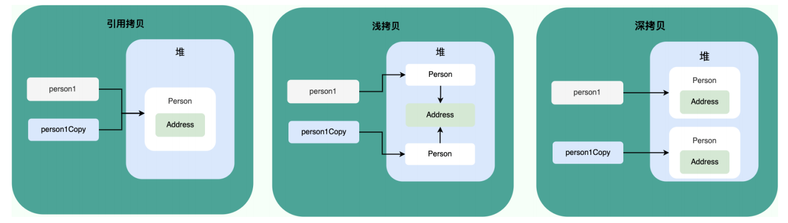
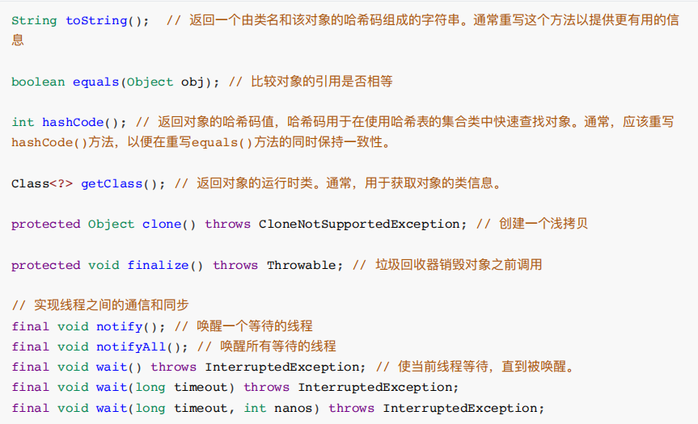
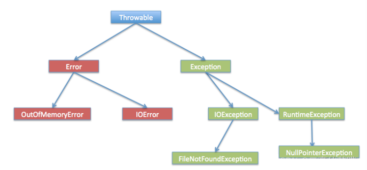

# java

- [java](#java)
  - [java SE](#java-se)
    - [1. JVM、JRE、JDK之间的关系](#1-jvmjrejdk之间的关系)
    - [2. Java SE 、Java EE](#2-java-se-java-ee)
    - [3. 源代码、字节码、机器码](#3-源代码字节码机器码)
    - [4. 为什么说Java是编译与解释并存](#4-为什么说java是编译与解释并存)
    - [5. Java vs C++](#5-java-vs-c)
    - [6. 值传递和引用传递的区别](#6-值传递和引用传递的区别)
    - [7. Java的基础数据类型](#7-java的基础数据类型)
    - [8. 基础数据类型的转换⽅式](#8-基础数据类型的转换式)
    - [9. 基本类型和包装类型的区别](#9-基本类型和包装类型的区别)
    - [10. 什么是⾃动装箱和⾃动拆箱](#10-什么是动装箱和动拆箱)
    - [11. 包装类型的缓存机制 Wrapper Cache](#11-包装类型的缓存机制-wrapper-cache)
    - [12. 成员变量和局部变量的区别](#12-成员变量和局部变量的区别)
    - [13. 静态方法和实例方法的区别](#13-静态方法和实例方法的区别)
    - [14. ⾯向对象和⾯向过程有什么区别](#14-向对象和向过程有什么区别)
    - [15. 对象实例 和 对象引用](#15-对象实例-和-对象引用)
    - [16. ⽅法的重载和重写有什么区别](#16-法的重载和重写有什么区别)
    - [17. 构造⽅法能不能重写](#17-构造法能不能重写)
    - [18. 面向对象的三大特性](#18-面向对象的三大特性)
    - [19. 说⼀说你对多态的理解](#19-说说你对多态的理解)
    - [20. 编译时多态和运⾏时多态的区别](#20-编译时多态和运时多态的区别)
    - [21. 接⼝和抽象类有什么区别](#21-接和抽象类有什么区别)
    - [22. 对Java访问权限的了解](#22-对java访问权限的了解)
    - [23. static和final有什么区别](#23-static和final有什么区别)
    - [24. final、finally、finalize的区别](#24-finalfinallyfinalize的区别)
    - [25. 深拷⻉和浅拷⻉有什么区别](#25-深拷和浅拷有什么区别)
    - [26. Object类常用方法](#26-object类常用方法)
    - [27. == 和 equals() 的区别](#27--和-equals-的区别)
    - [28. hashCode()和equals()的关系](#28-hashcode和equals的关系)
    - [29. 为什么要重写hashCode()和equals()](#29-为什么要重写hashcode和equals)
    - [30. String存储原理](#30-string存储原理)
    - [31. String vs. StringBuffer vs. StringBuilder](#31-string-vs-stringbuffer-vs-stringbuilder)
    - [32. 为何String不可变](#32-为何string不可变)
    - [33. 什么是字符串常量池](#33-什么是字符串常量池)
    - [34. String判等 = 和 new](#34-string判等--和-new)
    - [35. 字符串拼接发⽣了什么](#35-字符串拼接发了什么)
    - [36. String.intern()](#36-stringintern)
    - [37. Exception 和 Error](#37-exception-和-error)
    - [38. 说⼀说你对泛型的理解](#38-说说你对泛型的理解)
    - [39. 介绍⼀下泛型擦除](#39-介绍下泛型擦除)
    - [40. 反射机制是什么？](#40-反射机制是什么)
    - [41. 注解](#41-注解)
    - [42. 序列化与反序列化](#42-序列化与反序列化)


## java SE

### 1. JVM、JRE、JDK之间的关系

JVM负责将Java字节码翻译成机器码，以便在特定平台上执⾏Java程序。

JDK是Java的开发⼯具包，它包含了开发和编译Java程序所需的⼯具，以及运⾏Java程序的JRE

JRE是Java应⽤程序运⾏的环境，它包含了运⾏Java程序所需的库、Java虚拟机（JVM）以及其他⽀持⽂件。

> JVM提供了Java程序运⾏的虚拟环境，JDK是⽤于开发Java程序的⼯具包，⽽JRE是⽤于运⾏Java程序的环境。在开发阶段，你需要JDK；⽽在部署和运⾏阶段，你只需要JRE。

### 2. Java SE 、Java EE

Java SE ：包含JVM和Java核心类库等核心组件。

Java EE：基于Java SE，包含了支持企业级应用程序开发和部署的标准和规范。

### 3. 源代码、字节码、机器码

源代码：test.java：计算机无法直接理解和执行。

字节码：test.class：javac编译后的**中间表示形式，与平台无关**，可以实现“一次编写，到处运行”。

机器码：通过JVM将字节码翻译为计算机可以直接执行的机器码。

### 4. 为什么说Java是编译与解释并存

Java**首先编译**，将.java文件编译为JVM可理解的.class字节码文件。
**然后解释**，JVM逐行读取字节码，将其解释为机器码并执行。

> 即时编译JIT(Just-in-time compilation)：jvm引入jit来提高性能：JIT会在运行时将热点代码(频繁执行的代码)编译成本地机器码,以提高执行效率

### 5. Java vs C++

编译与解释不同

- cpp是编译型语言，直接编译生成可执行的机器码；java混合了编译型和解释型

平台依赖性：cpp平台依赖，java平台独立

- cpp是一次编写到处**编译**，即不同平台编译结果不同；java一次编写，到处**运行**

内存管理不同

- java内存管理由jvm自动处理；cpp需要手动delete，增加了内存泄漏的风险

java没有指针，不可以直接访问内存，内存更安全

### 6. 值传递和引用传递的区别

参数传递⽅式主要有值传递和引⽤传递两种， Java 中的参数传递是**始终按值传递的**。

+ 值传递：在值传递中，传递给函数的是实际参数的值的副本。当在函数内修改这个副本时，不会影响到原始值
+ 引⽤传递：⽅法接收的对象在堆中的地址，不会创建副本，对形参的修改将影响到实参。

但在 Java 中，虽然传递的是引⽤的值（对象的地址），但仍然是按值传递。实际上，传递的是**引⽤的副本**（指向同一个地址），因此在函数内对引⽤的修改会影响到原始的引⽤，但⽆法修改引⽤指向的对象（即如果指向新的对象的地址不会改变原始引用的指向）。

### 7. Java的基础数据类型

+ 整型: byte ( 8 bit )、short ( 16bit )、int ( 32 bit )、long ( 64 bit )   ( int默认 )

+ 浮点型: float ( 32 bit ) 、double ( 32 bit )   (double默认)

+ 布尔型: boolean  ( 1 bit )

+ 字符型: char ( 16 bit )

### 8. 基础数据类型的转换⽅式

+ ⾃动类型转换:⼩–>⼤ byte --> short --> int --> long --> float --> double 

  eg.   int small = 12345;    long big = small    (小的赋值给大的)

+ 强制类型转换:⼤–>⼩ ⼩类型 变量名 = (小类型) 值   

  eg.  long big = 10000999L;    int samll = (int) big;

> ⾃增/⾃减运算符、复合赋值运算符底层做了优化，内部⾃动强制类型转换; 如:++, --, +=, -=, ......

### 9. 基本类型和包装类型的区别

为了在**对象环境中**使⽤基本类型，Java提供了对应的包装类型

+ 基本类型直接存储数据值，在栈上分配内存，占⽤固定的内存空间，
+ 包装类型是对象动态分配内存，在堆上创建，包含额外的信息，例如⽅法和字段，同时也占⽤更多的内存空间。
+ **比较方式**：**基本类型使用`==`比较value，包装类型`==`比较的是object address**，故而包装类之间的值比较使用`equals()` (同于String，包装类型和String都重写了equals())

### 10. 什么是⾃动装箱和⾃动拆箱

⾃动装箱是指将基本类型转换为对应的包装类型，⽽⾃动拆箱是指将包装类型转换为对应的基本类型。这些转换通常**由编译器⾃动处理**。

~~~java
// ⾃动装箱
Integer intValue = 42; // 将基本类型int⾃动转换为Integer包装类型
// ⾃动拆箱
int primitiveValue = intValue; // 将Integer包装类型⾃动转换为基本类型int

// 装箱其实就是调⽤了 包装类的 valueOf() ⽅法，拆箱其实就是调⽤了 xxxValue() ⽅法。
Integer intValue = Integer.valueOf(42);
int primitiveValue = intValue.intValue();
~~~

### 11. 包装类型的缓存机制 Wrapper Cache

Java基本数据类型的包装类型很多都采用了缓存机制来提升性能。

- Byte,Short,Integer,Long 这4种包装类默认创建了数值[-128，127]的相应类型的缓存数据
- Character创建了数值在[0,127]范围的缓存数据
- Boolean直接返回True or False
- Float, Double没有缓存机制

好处：

+ 提高性能：对于Integer，-128~127会频繁使用，缓存机制可以避免重复创建对象，减少对象
+ 省内存：重用

### 12. 成员变量和局部变量的区别

1. 声明位置：
   + **成员变量：** 声明在类中，但在⽅法、构造函数或块之外。它们是类的⼀部分，因此可以被整个类的⽅法访问。
   + **局部变量：** 声明在⽅法、构造函数或块中。它们只在声明它们的⽅法、构造函数或块中可⻅。
2. 作用域：
   + **成员变量：** 具有类的整个实例的⽣命周期，可以在整个类中使⽤。
   + **局部变量：** 仅在声明它们的⽅法、构造函数或块中可⻅，并且只在该⽅法、构造函数或块的执⾏期间存在。

3. ⽣命周期

   + **成员变量：** 随着对象的创建⽽创建，随着对象的销毁⽽销毁。
   + **局部变量：** 在声明时分配内存，在⽅法调⽤结束时销毁。

4. 默认值

   + **成员变量：** 如果不显式初始化，会有默认值（例如，整数默认为0，对象引⽤默认为null等）。

   + **局部变量：** 不会⾃动初始化，必须在使⽤之前显式初始化。

> 成员变量又可分为：实例变量和静态变量

> 静态变量是被 static 关键字修饰的变量，被类的所有实例共享，⽆论⼀个类创建了多少个对象，它们都共享同⼀份静态变量。静态变量可以通过类名来访问。

### 13. 静态方法和实例方法的区别

+ static方法可以通过类名调用(推荐)，也可以通过对象名调用，而实例方法只能通过对象名调用。

+ static方法只能访问static成员（static成员变量和static方法），不允许访问实例成员（实例变量和实例方法）; 实例方法则不受限。

  > static方法属于类，在类加载的时候分配内存。在类的非静态成员不存在的时候静态方法就已经存在了。
  >
  > non-static成员属于instance，只有在对象实例化后才存在。

### 14. ⾯向对象和⾯向过程有什么区别

+ ⾯向对象会先抽象出具有状态、⾏为的对象，然后⽤对象执⾏⽅法的⽅式解决问题，强调封装、继承和多态，更容易扩展和维护。修改⼀个对象不会影响到其他对象，适合处理复杂的系统。

+ ⾯向过程将系统视为⼀系列的过程或函数，通过调⽤这些过程来完成任务。强调的是算法和流程， 如果需要修改⼀个过程，可能会影响到调⽤这个过程的其他地⽅，更适合简单的、线性的任务。

### 15. 对象实例 和 对象引用

- 对象引用指向对象实例，块内的对象引用存在栈中，对象实例在堆中
- 一个对象引用可以指向0或1个对象，一个对象可有n个引用指向他
- 对象相等一般比较的是内存中的内容value；`.equals()`通常比较的是value是否相同
- 引用相等一般比较的是两个引用是否指向同一个对象。(指向的内存地址是否相同)；`==`通常比较的是引用是否相同

### 16. ⽅法的重载和重写有什么区别

1. 重载

   ⽅法的重载指的是在同⼀个类中，可以有多个⽅法具有相同的名称，但是它们的**参数列表不同**（参数的类型、个数、顺序）。编译器根据⽅法的参数列表来区分不同的重载⽅法。

2. 重写

   ⽅法的重写指的是在⼦类中重新定义⽗类中已经定义的⽅法，⽅法名、参数列表和返回类型都必须相同。子类重写的⽅法不能父类的⽅法有更低的访问权限，不能抛出⽐⽗类⽅法更多的异常。

>重载是编译时多态，⽽重写是运⾏时多态。

### 17. 构造⽅法能不能重写

构造⽅法不能重写。因为**构造⽅法需要和类保持同名**，⽽**重写的要求是⼦类⽅法要和⽗类⽅法保持同名**。如果允许重写构造⽅法的话，那么⼦类中将会存在与类名不同的构造⽅法，这与构造⽅法的要求是⽭盾的。

### 18. 面向对象的三大特性

1. **封装：**为了提⾼代码的安全性，隐藏对象的内部细节，封装将对象的内部状态（字段、属性）隐藏起来，并通过定义公共的⽅法（接⼝）来操作对象，外部代码只需要知道如何使⽤这些⽅法⽽⽆需了解内部实现。

2. **继承：**允许⼀个类（⼦类）继承另⼀个类（⽗类）的属性和⽅法的机制。⼦类可以重⽤⽗类的代码，并且可以通过添加新的⽅法或修改（重写）已有的⽅法来扩展或改进功能，提⾼了代码的可重⽤性和可扩展性。

3. **多态：**多态是指相同的操作或⽅法可以在不同的对象上产⽣不同的⾏为，通过⽅法的重载和重写实现。多态允许以⼀致的⽅式处理不同类型的对象，提⾼了代码的灵活性。

### 19. 说⼀说你对多态的理解

因为⼦类其实是⼀种特殊的⽗类，因此Java允许把⼀个⼦类对象直接赋给⼀个⽗类引⽤变量，⽆须任何类型转换，或者被称为向上转型，向上转型由系统⾃动完成。  eg. `BaseClass obj = new SubClass()`;

当把⼀个⼦类对象直接赋给⽗类引⽤变量时，例如 BaseClass obj = new SubClass(); ，这个 obj 引⽤变量的**编译时类型是 BaseClass** ，⽽**运⾏时类型是 SubClass** ，当运⾏时调⽤该引⽤变量的⽅法时，其⽅法⾏为总是表现出⼦类⽅法的⾏为特征，⽽不是⽗类⽅法的⾏为特征，这就可能出现：相同类型的变量、调⽤同⼀个⽅法时呈现出多种不同的⾏为特征，这就是多态。

### 20. 编译时多态和运⾏时多态的区别

1. **编译时多态**

   编译时多态也被称为静态多态或早期绑定。它是指在编译阶段，编译器就能够确定调⽤哪个⽅法，这是通过**⽅法的重载来实现的**。编译时多态主要**依赖于⽅法的签名（⽅法名和参数列表）**，根据调⽤时提供的参数类型和数量来确定具体调⽤的⽅法。

2. **运⾏时多态**

   运⾏时多态也被称为动态多态或晚期绑定。指的是**在程序运⾏时，根据实际对象的类型来确定调⽤的⽅法**，这是**通过⽅法的重写来实现的**。运⾏时多态主要依赖于对象的**实际类型**，⽽不是引⽤类型。

> 编译时多态是通过⽅法的重载在编译阶段确定调⽤的⽅法。
>
> 运⾏时多态是通过⽅法的重写在程序运⾏时确定调⽤的⽅法，实现动态绑定。

### 21. 接⼝和抽象类有什么区别

- 抽象类主要用于**代码重用**和**为子类提供通用实现**，而接口主要用于**定义行为规范**
- 抽象类可以包含抽象方法（没有方法体的方法）和非抽象方法。而接口(jdk1.8之前)方法默认都是public abstract, 不能有方法体
- 抽象类的成员变量可以任意类型，而接口成员变量默认是public static final
- 都不能被实例化，只能被继承/实现
- 一个类只能继承一个类，但可以实现多个接口

> 实现接⼝的类 和 继承抽象类的⼦类 **都必须提供其中中定义的所有抽象⽅法的实现。**

### 22. 对Java访问权限的了解

+ 修饰符` public` 表示对所有类可⻅。⼀个类如果被声明为 `public` ，那么它可以被其他任何类访问。

+ 修饰符 `protected` 表示对**同⼀包内的类和所有⼦类可⻅**。⼦类可以访问⽗类中声明为` protected `的成员，⽽不管⼦类与⽗类是否在同⼀包中。
+ 默认`default`为包级别访问，这意味着**只有同⼀包中的类**可以访问。

+ 修饰符` private` 表示对同⼀类内可⻅。私有成员只能在声明它们的类中访问。

### 23. static和final有什么区别

+ `static` ⽤于修饰成员时，该成员成为类级别的，⽽不是实例级别的。静态成员属于类，不是属于类的实例。

+ 当` final `⽤于修饰变量、⽅法或类时，表示它是不可变的。对于变量，⼀旦赋值后就不能再修改；对于⽅法，表示⽅法不能被⼦类重写；对于类，表示类不能被继承。

### 24. final、finally、finalize的区别

+ final就是不可变的意思，可以修饰变量、⽅法和类。修饰变量时，这个变量必须初始化，所以也称为常量。

+ finally是异常处理的⼀部分，只能⽤在try/catch中，并且附带⼀个语句块表示这段语句⼀定会被执⾏，⽆论是否抛出异常。

+ finalize是java.lang.Object中的⽅法，也就是每⼀个对象都有这个⽅法，⼀个对象的finalize⽅法只会调⽤⼀次，调⽤了不⼀定被回收，因为只有对象被回收的时候才会被回收，就会导致前⾯调⽤，后⾯回收的时候出现问题，不推荐使⽤。

### 25. 深拷⻉和浅拷⻉有什么区别

浅拷贝和深拷贝的主要区别：如何处理对象内部的引用成员

+ 引用拷贝: **不会创建新对象**，仅仅将一个对象的引用赋值给另一变量

+ 浅拷⻉：浅拷⻉创建⼀个新对象，然后将原对象的⾮静态字段复制到新对象。如果字段是基本数据类型，那么就复制其值；如果字段是**引⽤类型，复制的就是引⽤⽽不是实际对象**。

+ 深拷⻉：创建⼀个新对象，并**递归复制原对象中的所有引⽤类型的字段指向的对象**，⽽不是共享引⽤。因此，新对象和原对象中的引⽤类型字段引⽤的是两组不同的对象。



### 26. Object类常用方法



### 27. == 和 equals() 的区别

- ==是运算法，equals()是方法
- 对于基本类型，==比较的是value
- 对于引用类型，==比较的是对象的内存地址，即判断是否是同一对象
- equals()**不能判断基本数据类型**，只能用于判断两个对象是否相同
- Object中默认的`equals()`就是`==`，但很多类都重写了这个⽅法，提供了对内容的⽐较。

### 28. hashCode()和equals()的关系

hashCode() ⽅法返回对象的哈希码值，如果两个对象被认为是相等的（通过 equals() ⽅法），那么它们的哈希码应该相同。

> 如果两个对象相等，则它们必须有相同的哈希码。
>
> 如果两个对象有相同的哈希码，则它们未必相等。

### 29. 为什么要重写hashCode()和equals()

在Java中，equals() 默认实现是⽐较对象的引⽤，没有实⽤价值。我们通常希望⽐较对象的内容是否相等，所以要重写。

⽽由于hashCode()与equals()具有联动关系（如果两个对象相等，则它们必须有相同的哈希码），所以equals()⽅法重写时，通常也要将hashCode()进⾏重写，使得这两个⽅法始终保持⼀致性。

### 30. String存储原理

+ String 类型是不可变的 

+ Java 中⽤双引号括起来的字符串，例如："abc"、"def"，都是直接存储在“⽅法区”的“字符串常量池”当中的。 

  > 因为字符串在实际的开发中使⽤太频繁
  >
  > 为了提⾼执⾏效率，所以把字符串放到了⽅法区的“字符串常量池”当中

### 31. String vs. StringBuffer vs. StringBuilder

- String不可变，两个SB可变
- **String线程安全(因为不可变)**，StringBuffer对方法加了synchronized，线程安全；StringBuilder线程不安全；
- 性能上：String每次改变都要搞一个新的String对象，然后把指针指向新对象，最慢。两个SB都是对对象本身操作，快一些；然后StringBuilder大概比StringBuffer快`10%-15%`（线程不安全）
- 操作少量数据时使用String，大量数据&单线程用StringBuilder，大量数据&多线程StringBuffer

### 32. 为何String不可变

```java
public final class String implements java.io.Serializable, Comparable<String>, CharSequence, Constable, ConstantDesc {
    private final byte[] value;
}
// jdk9之前是private final char value[];
// 改进的原因：java9中char[]改为byte[]（char 2B，byte 1B），目的是节省空间
```

1. String的`char[]/byte[]`用final修饰，保证了不可指向另一String
2. 数组是**private**，且**String没有提供/暴露修改该字符串的方法**，保证了数组内容无法修改
3. **String类也被final修饰**，故而不能被继承，避免了子类破坏String不可变

### 33. 什么是字符串常量池

jvm为了优化String类(性能&内存)专门开辟的一块区域，主要是为了避免字符串的重复创建。当程序中创建字符串常量时，这些字符串常量会被存储在字符串常量池中。如果后续的代码中创建了相同内容的字符串常量，Java 不会再创建新的对象，⽽是直接引⽤已经存在的字符串常量。是运行时常量池中的一部分。

### 34. String判等 = 和 new

+ 使⽤ new String("abc") 会在**堆内存中创建**⼀个新的字符串对象(**里面有个value属性引用一个字符数组**)。然后也去判断常量池有无该字符串对象，如有，value指向常量池中该对象；如无则在常量池创建，然后value指向。

+ 使⽤ String a = "abc" 会检查字符串常量池中是否已经存在值为 "abc" 的字符串。如果存在，直接引⽤该字符串，如果不存在，则在常量池中创建⼀个新的字符串。

> 通常推荐使⽤ String a = "abc" 这种⽅式，因为它更符合字符串的常⽤特性，避免了不必要的对象创建。

### 35. 字符串拼接发⽣了什么

1. 使⽤ `+ `运算符拼接

   + 如果拼接的都是**字符串直接量**，则在编译时编译器会将其直接优化为⼀个完整的字符串，和你直接写⼀个完整的字符串是⼀样的，效率⾮常的⾼。

   + 如果拼接的字符串中包含变量，则在编译时编译器**采⽤StringBuilder对其进⾏优化**，即⾃动创建StringBuilder实例并调⽤其append()⽅法，将这些字符串拼接在⼀起，效率也很⾼。

     > 但如果拼接操作是在循环中进⾏的，那么每次循环编译器都会创建⼀个StringBuilder实例，效率很低

2. 使⽤ `concat()`

   + `concat()` ⽅法在每次调⽤时都会创建⼀个新的字符串对象，⽽不修改原有的字符串对象。

3. 使⽤ `StringBuilder/StringBuffer`

   + stringBuilder 可以通过 append() ⽅法多次追加字符串。这样的操作是在同⼀个可变对象上进⾏的，不会产⽣⼤量的中间字符串对象。最后，通过 toString() StringBuilder 对象转换为不可变的字符串对象。

### 36. String.intern()

- 当调用一个字符串对象的 intern() 方法时，Java会检查该字符串是否已经在字符串池中。
- 如果字符串池中已经存在一个相同内容的字符串，则返回池中的这个字符串的引用。
- 如果字符串池中不存在这个字符串，则**将其添加到字符串池**中，并返回该字符串的引用。

### 37. Exception 和 Error



- Error: 程序无法处理的错误，不建议使用catch捕获。比如`OOM`, `StackOverflowError`,Error是严重错误，**程序直接崩溃**。

+ Exception: 程序本身可以处理的异常，可以通过catch捕获。分为编译时异常 / checked exception 和 运行时异常 / runtime exception
  - **编译时异常必须处理(checked)**，使用try-catch捕获或在方法签名中声明抛出throws，如果没处理无法通过编译 -> `unhandled exception`
  - 编译器无法检查出运行时异常，一般是编程时的逻辑错误，程序员应该避免；运行时异常可以不做处理。

异常处理的两种方式：

- try-catch-finally:自行处理
  - try block: 捕获异常，后面可以跟0或多个catch block，如果没有catch block必须跟一个finally block
  - catch block: 处理try捕获到的异常（异常被封装成Exception对象e，传递给catch
    - 可以有多个catch blok，捕获不同的异常；要求子类异常在前，父类在后
  - finally block: 一定会执行，无论是否有异常发生，通常搁这儿释放资源
- throws: 抛出异常，交给调用者处理，**最顶级的处理者是JVM**，但JVM的处理方式很暴力：直接输出并退出
  - 可以抛出具体的异常（推荐）也可以抛出其父类

### 38. 说⼀说你对泛型的理解

- Java 5引⼊了泛型（Generic）的概念，允许在创建集合时指定集合元素的具体类型，编译器会检测你传入的类型是否符合。
- 泛型的三种使用方式：泛型类、泛型接口、泛型方法，使得他们可以操作不同的数据类型
- 泛型只能指定为引用数据类型，不可是基本数据类型
- 指定泛型为具体类型后，可以传入子类类型（多态）

### 39. 介绍⼀下泛型擦除

Java 泛型擦除是指在编译时期，Java 编译器会将泛型信息从泛型代码中移除，以便保持与 Java 早期版本的兼容性。这个过程称为类型擦除。

+ 例如， List<T> 在编译时会被擦除为 List<Object> 。

+ 由于泛型擦除，不能直接创建泛型数组。例如， new T[] 是不合法的，因为在运⾏时⽆法确定 T 的实际类型。

### 40. 反射机制是什么？

反射的核⼼类是 Class 类，它是Java反射机制的⼊⼝。通过 Class 类，可以获取类的构造函数、⽅法、字段等信息，⽽不需要在编译时确定这些信息。

+ **优点：**程序可以在运⾏时动态地获取和操作类的信息，这使得代码更加灵活，能够适应不同的场景和需求。

+ **缺点：**反射允许绕过编译时的类型检查，这可能导致在运⾏时出现类型安全性问题。

> Spring/Spring Boot、MyBatis 等等框架中都⼤量使⽤了反射机制。这些框架中也⼤量使⽤了动态代理，⽽动态代理的实现也依赖反射。

### 41. 注解

注解以 @ 符号开头，通常紧跟着⼀个标识符，后⾯可以跟⼀些参数，⽤于给类、⽅法、字段等添加元数据信息，这些信息可以在编译时、运⾏时被读取和处理。例如：

+ `@Override `： ⽤于标识⽅法重写⽗类的⽅法。
+ `@Deprecated `：⽤于标识已经过时的⽅法、类等

### 42. 序列化与反序列化

- 序列化serialization: 将对象 -> 二进制字节流
- 反序列化deserialization: 反过来

- 应用场景
  - 对象在进行网络传输（比如远程方法调用 RPC 的时候）之前需要先被序列化，接收到序列化的对象之后需要再进行反序列化；（因为**网络传输只能传输字节流**）
  - 将对象存储到文件之前需要进行序列化，将对象从文件中读取出来需要进行反序列化；（因为文件只能存字节流）
  - 将对象存储到数据库（如 Redis）之前需要用到序列化，将对象从缓存数据库中读取出来需要反序列化；
- transient修饰的变量不会被序列化，在对象序列化时被忽略
  - transient不可修饰class和method，只可修饰变量
  - 此外，static变量不属于任何Object，故对象在序列化跟static变量没关系