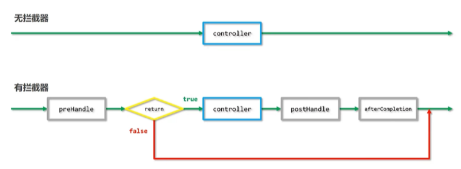
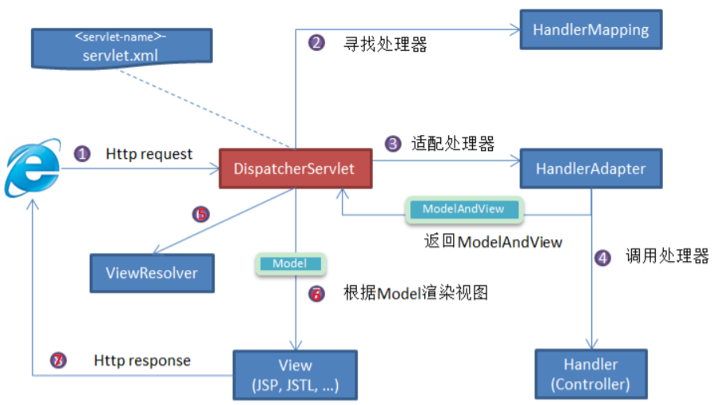

# Spring

> main reference: [二哥java](https://javabetter.cn/sidebar/sanfene/spring.html)

[toc]

## 基础

### Spring定义 特性 模块

Spring 是一个**轻量级、非入侵式**的控制反转 (IoC) 和面向切面 (AOP) 的框架

**Spring优势：**

* IoC和DI的支持：Spring 的核心就是一个大的**工厂容器**，可以维护**所有对象的创建和依赖关系**，Spring工厂用于生成Bean，并且管理Bean的生命周期，实现**高内聚低耦合**的设计理念
* AOP编程的支持：可以方便的实现对程序进行权限拦截、运行监控等切面功能
* 声明式事务的支持：支持通过配置就来完成对事务的管理，而不需要通过硬编码的方式，以前重复的一些事务提交、回滚的JDBC代码，都可以不用自己写了
* 快捷测试的支持：可以通过注解快捷地测试 Spring程序
* 快速集成功能：提供了对各种优秀框架（如：Struts、Hibernate、MyBatis、Quartz 等）的直接支持

**Spring主要模块：**

* Spring Core: 框架最基础的部分，提供IoC和DI特性
* Spring Context: 上下文容器，是BeanFactory功能加强的一个子接口
* Spring Web: 提供Web应用开发的支持
* Spring MVC: 针对Web应用中MVC思想的实现
* Spring DAO: 提供对JDBC抽象层，简化了JDBC编码
* Spring AOP: 即面向切面编程，它提供了与AOP联盟兼容的编程实现
* Spring ORM：它支持用于流行的ORM框架的整合，比如：Spring+Hibernate、Spring+iBatis、Spring+JDO的整合等

### Spring Annotation

please see: "java\SpringAnnotation.xmind"

### Spring设计模式

暂略

## Spring

### 说一下你对Spring的理解

Spring框架核心特性包括：

* **IoC容器**：Spring通过控制反转**实现了对象的创建和对象间的依赖关系管理**。开发者**只需要定义好Bean及其依赖关系**，**Spring容器负责创建和组装**这些对象
  * 依赖关系是指某对象A(eg 汽车)依赖对象B(eg 轮子)
* **AOP**：面向切面编程，允许开发者定义**横切关注点**，例如事务管理、安全控制等，**独立于业务逻辑的代码**。通过AOP，可以将这些关注点模块化，提高代码的可维护性和**可重用性**
* **事务管理**：Spring提供了**一致的事务管理接口**，支持声明式和编程式事务。开发者可以轻松地进行事务管理，而无需关心具体的事务API
* **MVC框架**：Spring MVC是一个基于Servlet API构建的Web框架，采用了模型-视图-控制器（MVC）架构。它支持灵活的URL到页面控制器的映射，以及多种视图技术
  * servlet是一个java类，用于处理web请求并生成响应，通常运行在Web服务器（如Tomcat、Jetty）上；核心api: `HttpServlet, HttpServletRequest...`

### 介绍一下Spring IoC和AOP

* **IoC(Inversion of Control)控制反转**：是一种创建和获取对象的思想，**依赖注入DI(Dependency Injection)是实现这种技术的一种方式**。传统开发过程中，我们需要通过**new关键字**来创建对象。使用IoC思想开发方式的话，我们不通过new关键字创建对象，而是**通过IoC容器来帮我们实例化对象**。 通过IoC的方式，可以**大大降低对象之间的耦合度**。
  * > 以前是我们想要什么就自己创建什么，现在是我们需要什么容器就帮我们送来什么。
  * 所谓反转，即，使用对象时，由主动new产生对象转换为 由"外部"(Spring提供的IoC容器)提供对象
* AOP(Aspect Oriented Programing): 面向切面变成能够将那些**与业务无关**，却**为业务模块所共同调用的逻辑**封装起来，以**减少系统的重复代码，降低模块间的耦合度**。Spring AOP**基于动态代理**，如果要代理的对象实现了某个接口，那么Spring AOP会使用JDK Proxy，去创建代理对象，而对于没有实现接口的对象，Spring AOP会使用Cglib生成一个被代理对象的子类来作为代理。（没懂）

### 对IoC的理解

IoC是一种设计思想，IoC意味着将你设计好的对象交给容器控制，

## SpringMVC

### SpringMVC的核心组件

* `DispatcherServlet`：前端控制器，核心的中央处理器，负责接收请求、分发，并给予客户端响应；是整个流程控制的**核心**，控制与调度
* `HandlerMapping`：处理器映射器，根据请求URL去匹配查找能处理的**Handler**，并会**将请求涉及到的拦截器和Handler一起封装**成一个`HandlerExecutionChain`处理器执行链对象
  * `Handler`: 处理器，完成具体的业务逻辑
  * `HandlerInterceptor`: 处理器拦截器，是个接口，可以拦截一些请求；你可以额外添加拦截器
    * 定义拦截器时，需要在配置类中实现`addInterceptors`方法注册拦截器，并设定拦截的路径范围
    * 可以创建多个拦截器，然后按照注册顺序进行执行
    * HandlerInterception中有三个方法
      * `preHandle`: 在请求处理程序执行之前调用。用于**执行权限验证**、日志记录等操作。如果该方法返回**false，则请求将被中断，后续的拦截器和处理程序将不会被执行**(很妙)
      * `postHandle`: 在**请求处理程序执行之后、视图渲染之前**调用。可以对请求的结果进行修改或添加额外的模型数据。
      * `afterCompletion`: 在整个请求完成之后调用，包括视图渲染完毕。可用于进行**资源清理**等操作。
* `HandlerAdapter`：处理器适配器，**Handler执行业务方法之前，需要进行一系列的操作**，包括表单数据的验证、数据类型的转换、将表单数据封装到JavaBean等，这些操作都是由交给他，开发者只需将注意力集中业务逻辑的处理上，DispatcherServlet通过HandlerAdapter执行不同的Handler
<!-- * `ModelAndView`: 装载了模型数据和视图信息，作为Handler的处理结果，返回给DispatcherServlet -->
* `ViewResolver`：视图解析器，根据Handler返回的逻辑视图，解析并渲染真正的视图，并传递给DispatcherServlet响应客户端

  

### SpringMVC工作原理 / 流程

1. **用户请求**：用户/客户端/浏览器发送请求，DispatcherServlet拦截请求
2. **请求拦截**：DispatcherServlet接收到请求后，并不直接处理，而是将请求信息传递给HandlerMapping。HandlerMapping根据请求的URL来查找能处理该请求的Handler（我们常说的Controller），并会**将请求涉及到的Interceptor和Handler一起封装**为一个处理器执行链对象`HandlerExecutionChain`
3. **处理器适配**：DispatcherServlet调用HandlerAdapter适配器执行具体的Handler
   1. HandlerAdapter通过适配器模式，使得不同类型的处理器可以被统一调用
4. **业务逻辑处理**：Handler完成对用户请求的处理后，会返回一个ModelAndView对象给DispatcherServlet
   1. ModelAndView顾名思义，包含了数据模型以及相应的视图的信息。Model是返回的数据对象，View是个逻辑上的View
5. **视图解析**：ViewResolver会根据逻辑View查找实际的View
6. **渲染视图**：DispatcherServlet使用解析得到的视图对象，将模型数据填充到视图中，完成视图的渲染，并将结果返回给用户
7. 把View返回给请求者（浏览器）
