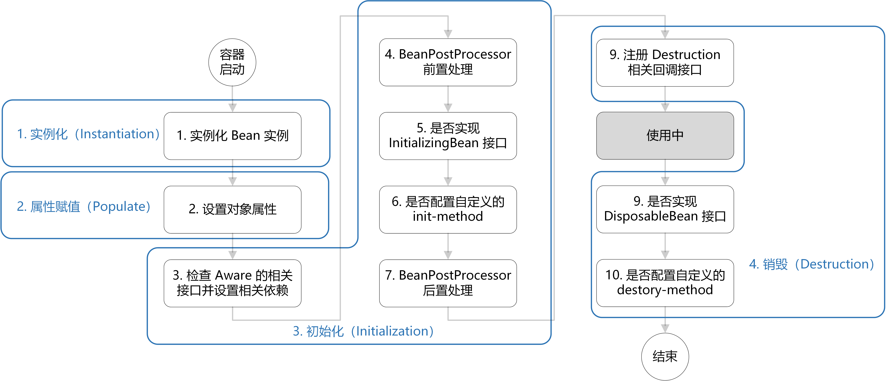
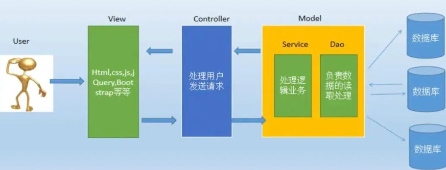

# Spring

- [Spring](#spring)
  - [Spring](#spring-1)
    - [Spring介绍](#spring介绍)
    - [Spring vs. SpringMVC vs. SpringBoot](#spring-vs-springmvc-vs-springboot)
    - [SpringBoot相比于Spring的改进](#springboot相比于spring的改进)
    - [介绍一下IoC](#介绍一下ioc)
      - [IoC注入方式](#ioc注入方式)
      - [IoC实现机制](#ioc实现机制)
    - [介绍一下AOP](#介绍一下aop)
      - [AOP实现机制](#aop实现机制)
      - [静态代理 vs. 动态代理](#静态代理-vs-动态代理)
    - [Spring框架中反射的应用](#spring框架中反射的应用)
    - [Spring框架用到了哪些设计模式](#spring框架用到了哪些设计模式)
    - [Spring常用注解](#spring常用注解)
    - [Spring事务](#spring事务)
      - [介绍与原理](#介绍与原理)
      - [Spring事务分类](#spring事务分类)
      - [Spring事务隔离级别](#spring事务隔离级别)
      - [Spring事务传播行为 propagation](#spring事务传播行为-propagation)
      - [声明式事务失效情况](#声明式事务失效情况)
  - [Bean](#bean)
    - [BeanFactory vs. ApplicationContext](#beanfactory-vs-applicationcontext)
    - [Bean的生命周期](#bean的生命周期)
    - [Bean定义和依赖定义的方法](#bean定义和依赖定义的方法)
    - [依赖注入/Bean注入的方法](#依赖注入bean注入的方法)
    - [Bean作用域](#bean作用域)
    - [单例Bean的线程安全问题](#单例bean的线程安全问题)
  - [SpringMVC](#springmvc)
    - [介绍MVC分层](#介绍mvc分层)
    - [SpringMVC的核心组件](#springmvc的核心组件)
    - [SpringMVC工作原理 / 流程 ☆](#springmvc工作原理--流程-)


todo:
spring是如何解决循环依赖的，三级缓存（xiaolin

## Spring

### Spring介绍

> Spring 是一个**轻量级、非侵入式**的**控制反转 (IoC) 和面向切面 (AOP)** 的**框架**

**Spring核心特性/优势：**

* **IoC容器**：Spring通过控制反转，**维护所有对象的创建和依赖关系**。开发者只需要定义好Bean及其依赖关系，**Spring容器负责创建和组装这些对象**。
  * 依赖关系是指某对象A(eg bus)依赖对象B(eg wheels)，可以通过`@Autowired`注入
* **AOP**：将那些与核心业务(CRUD登录注册)无关，却为**业务模块**所共同调用的逻辑(**周边功能：日志、事务管理**)封装起来，以减少系统的重复代码，降低模块间的耦合度，并且有利于扩展和维护
* **事务管理**：Spring提供了**一致的事务管理接口**，支持声明式和编程式事务。开发者可以轻松地进行事务管理，而无需关心具体的事务API。

### Spring vs. SpringMVC vs. SpringBoot

1. Spring是一个全面的**java应用程序开发框架**，为了简化java应用程序的开发，提供很多核心功能：eg 控IOC, AOP, 事务管理
2. SpringMVC是Spring框架中的一个**模块**，利用spring的上述核心特性，专门用于开发**Web应用程序**。它采用了模型-视图-控制器（MVC）设计模式；通过DispatcherServlet处理请求，将请求映射到相应的控制器进行处理，并返回视图。
3. SpringBoot：进一步简化spring开发流程；约定大于配置、各种启动项starter、内置服务器；

### SpringBoot相比于Spring的改进

* SpringBoot提供了**自动化配置**，大大简化了项目的配置过程。通过**约定优于配置**的原则，很多常用的配置可以自动完成，开发者可以**专注于业务逻辑**的实现
  * 约定大于配置
    * eg 如果你使用MySQL数据库，只需在`application.properties`中提供数据库连接URL、用户名和密码，SpringBoot会自动配置数据源（Spring的话需要自定义一个配置类，需要手动配置所有组件）
    <!-- * eg 命名规则：项目配置文件一般是`application.yml` -->
* SpringBoot提供了**快速的项目启动器**，可以引入不同的**Starter(起步依赖)**; starter会**自动处理依赖，自动配置，加速开发**
  * `spring-boot-starter-web`: 用于构建web程序，默认使用tomcat作为嵌入式容器
  * `spring-boot-starter-test`: 包含用于测试的依赖项，如 JUnit
  * `spring-boot-starter-data-redis`: 用于与Redis数据库交互
  * `spring-boot-starter-amqp`: 集成RabbitMQ消息中间件
* SpringBoot默认集成了多种**内嵌服务器**（如Tomcat、Jetty、Undertow），**无需额外的部署**步骤，方便快捷
  * 有了内嵌tomcat之后，直接将项目打包为`jar`文件，然后就可以直接启动应用；没有的话你需要打包为`war`文件，然后再单独部署到外部tomcat服务器（**spring就得这么干...**）

### 介绍一下IoC

* **IoC(Inversion of Control)控制反转**：是一种**创建和获取对象的思想**，**依赖注入DI(Dependency Injection)是实现这种技术的一种方式**。
* 传统开发中，我们需要通过**new**来直接创建对象（即对象的创建和管理由开发者控制）。而在IoC思想下，**Spring容器`ApplicationContext`** 负责对象的实例化、配置和管理。
  * 所谓反转，即反转了**控制权**，使用对象时，由主动new产生对象转换为由"外部"(IoC容器)提供对象

<!-- * **创建对象**：原来是new一个，现在是由Spring容器创建
* **初始化对象**：原来是对象自己通过构造器或者setter方法给依赖的对象赋值，现在是由**Spring容器自动注入**
  * 如何自动注入来初始化呢？基于`@Autowired`, `@Resource`, 或者基于XML配置，或者基于构造函数（啊？
* **销毁对象**：原来是直接给对象赋值null或做一些销毁操作，现在是Spring容器**管理生命周期负责销毁对象**。 -->

  

#### IoC注入方式

比如你准备在controller方法中注入一个service实例，然后调用该实例。

1.可以通过**构造器注入**（推荐）：

```java
@Service
public class GreetingService {
    public String getGreeting() {
        return "Hello, Spring IoC!";
    }
}

@RestController
public class HelloController {
    private final GreetingService greetingService;
    // 使用构造器注入 GreetingService
    @Autowired
    public HelloController(GreetingService greetingService) {
        this.greetingService = greetingService;
    }
    @GetMapping("/hello")
    public String sayHello() {
        return greetingService.getGreeting();
    }
}
```
2.字段注入（适合简单场景，不推荐）
```java
@RestController
public class HelloController {
    @Autowired
    private GreetingService greetingService;
    @GetMapping("/hello")
    public String sayHello() {
        return greetingService.getGreeting();
    }
}
```

3.setter方法注入（适合需要设置多个依赖的情况）
```java
@RestController
public class HelloController {
    private GreetingService greetingService;
    @Autowired
    public void setGreetingService(GreetingService greetingService) {
        this.greetingService = greetingService;
    }
    @GetMapping("/hello")
    public String sayHello() {
        return greetingService.getGreeting();
    }
}
```

#### IoC实现机制

* **反射**：Spring IOC容器利用java反射机制在**运行时创建对象并设置属性**，使得spring可以根据配置文件或**注解**动态地管理bean；
* **依赖注入**：IOC的核心概念是依赖注入，它允许**将对象所依赖的其他对象**通过构造函数注入、setter注入或方法注入传递给该对象，**而非在对象内部创建这些依赖**。
* **工厂模式**：IOC容器通常采用工厂模式来管理对象的创建和生命周期。**容器作为工厂**负责**实例化Bean并管理它们的生命周期**。
* **容器实现**：IOC容器是实现IOC的核心，通常使用`BeanFactory`或`ApplicationContext`来管理Bean。
  * `BeanFactory`是IOC容器的**基本形式**，提供基本的IOC功能，适合简单应用；
  * `ApplicationContext`是BeanFactory的**扩展**，提供更多功能，eg 事件传播

**自动注入过程：**

1. 容器自动注入（eg 你在controller中@Autowired一个Service），是通过ApplicationContext容器来实现的，Springboot启动时会自动创建并启动一个`AnnotationConfigApplicationContext `；
2. Spring启动时，**容器**会自动扫描所有用`@Component, @Service, @Controller, @Repository`等注解标记的类，并将其**注册为Bean**
3. 当你在类中使用@Autowired注入时，Spring容器会在应用启动时，**自动识别并找到对应Bean(eg通过类型匹配)，并注入到@Autowired修饰的字段或构造方法**中


### 介绍一下AOP

AOP(Aspect Oriented Programing): 

在面向切面编程的思想里面，把功能分为两种

* **核心业务**：登陆、注册、增、删、改、查
* **周边功能**：**日志、事务管理**这些次要的业务

在面向切面编程中，核心业务功能和周边功能是分别独立进行开发，两者不是耦合的，然后把切面功能和核心业务功能 "编织" 在一起，这就叫AOP。

---

面向切面编程能够将那些**与核心业务(CRUD登录注册..)无关**，却**为业务模块所共同调用的逻辑(周边功能：日志、事务管理)**封装起来，以**减少系统的重复代码，降低模块间的耦合度**，并且有利于扩展和维护。

> 用于在不修改原始代码的情况下，给现有方法/代码添加增强功能。

AOP中的概念：

简而言之：

1. JoinPoint连接点是一堆执行方法
2. PointCut通过表达式来匹配joinpoint得到切入点
3. Advice通知是在切入点"处"(前|后|环绕)执行具体的操作
4. Aspect切面是将多个Advice和PointCut结合在一起的模块/类

详而言之：

* JoinPoint：**连接点**，指程序执行过程中**可以插入AOP逻辑的点**，springAOP中连接点通常是**执行方法**
  * 在SpringAOP中**仅支持执行方法**的连接点，其他其实还有抛出异常、设置变量等
* `@PointCut`: 定义**切入点**，一个用于匹配**连接点**的表达式；可以理解为**连接点的过滤器**，用来定义在那些连接点应用AOP逻辑；
  * 当方法/**连接点匹配上了定义的规则**，就成为了切入点，就可以在这些点上插入Advice
* Advice：**通知**，在**切入点处**(即匹配了的PointCut)执行的**具体操作**
  * 前置通知`@Before`: 在切入点执行之前执行
  * 返回通知`@AfterReturning`: 在切入点方法返回结果之后执行，在After之前
  * 后置通知`@After`: 在切入点执行之后执行
  * **环绕通知**`@Around`：在切入点执行前后分别执行一段代码，**环绕通知必须依赖形参`ProceedingJoinPoint`来调用原方法**`pjp.proceed()`，然后在前后添加通知
  * **正常流程**：环绕通知-前 -> 前置通知 -> 返回通知 -> 后置通知 -> 环绕通知-后
* `@Aspect`：声明一个**切面**，包含了通知(advice)和切入点(pointcut)的对应关系
  * advice和pointcut的对应管理：**切面类中通过切入点@Pointcut标识出需要增强的目标方法，通过通知@Before指定在什么时机执行增强逻辑**
  * 一般是标注在类上，也可以标注接口、注解

```java
// 一个AOP切面类
@Aspect // 声明一个切面，描述通知和切入点的关系
@Component
public class LoggingAspect {
    // 切入点
    @Pointcut("execution(* com.example.demo.service.UserService.addUser(..))")
    public void userServiceMethods() {} // 切入点方法内容为空，因为它仅用于定义切入点

    @Before("userServiceMethods()")
    // 你也可以直接把切入点写到切面中
    // @Before("execution(* com.example.demo.service.UserService.addUser(..))") 
    public void logBefore() {
        System.out.println("Before method execution: Logging aspect");
    }

    @After("userServiceMethods()")
    public void logAfter() {
        // ...
    }

    @Around("userServiceMethods()") // 可以使用@Around替代@Before和@After
    public Object logAround(ProceedingJoinPoint pjp) throws Throwable {
        // 在目标方法执行前执行
        System.out.println("Before method execution: Logging aspect");
        // 执行目标方法
        Object result = pjp.proceed();
        // 在目标方法执行后执行
        System.out.println("After method execution: Logging aspect");
        return result;
    }
}
```

#### AOP实现机制

> 动态代理设计模式源码务必参考：[java_common_code.md](https://github.com/haooxia/CSJourney/blob/main/java/java_common_code.md)

Spring AOP的实现依赖于**动态代理**技术。动态代理是**在运行时动态生成代理对象，而不是在编译时(静态代理)**。它允许开发者在不修改源码的情况下**增强方法的功能。**(拦截并增强)

Spring AOP支持**两种动态代理**：基于JDK的 & 基于CGLIB的动态代理 (code generation library)

* 前者要求**被代理的类必须实现接口**，后者不需要（即当被代理类没实现接口时，spring使用cglib库实现动态代理）
* 前者基于java的**反射**实现，会**创建一个实现了相同接口的代理类，运行时动态生成该类的实例**；后者基于**字节码生成技术**实现，通过**继承**被代理的类来创建代理对象
* 后者不需要反射，性能更高

<!-- #### 介绍一下动态代理 -->

<!-- Java动态代理主要分为两种类型： -->

<!-- * **基于接口**的代理（**JDK动态代理**）： 这种类型的代理要求目标对象必须实现至少一个接口。Java动态代理会**创建一个实现了相同接口的代理类**，然后在运行时动态生成该类的实例。
  * 这种代理的实现核心是java.lang.reflect.Proxy类和java.lang.reflect.InvocationHandler接口。每一个动态代理类都必须实现InvocationHandler接口，并且每个代理类的实例都关联到一个handler。**当通过代理对象调用一个方法时，这个方法的调用会被转发为由InvocationHandler接口的invoke()方法来进行调用。**
* **基于类**的代理（**CGLIB动态代理**）：CGLIB是一个强大的高性能的代码生成库，它可以**在运行时动态生成一个目标类的子类**。CGLIB代理不需要目标类实现接口，而是通过继承的方式创建代理类。 -->

#### 静态代理 vs. 动态代理

* **灵活性**：动态代理更加灵活，**不需要必须实现接口**，可以直接代理实现类，并且可以**不需要针对每个目标类都创建一个代理类**。另外，静态代理中，接口一旦新增加方法，目标对象和代理对象都要进行修改，这是非常麻烦的！
* **JVM层面**：静态代理在**编译时就将接口、实现类、代理类这些都变成了一个个实际的class文件**。而**动态代理是在运行时动态生成类字节码(反射机制)**，并加载到JVM中的。
* 静态代理通常只代理一个类；动态代理代理的是一个接口下的多个实现类。

### Spring框架中反射的应用

1. **利用反射实现依赖注入DI**：比如你在Service层`@Autowired`一个DAO对象，无需手动编写创建DAO实例的代码。Spring在运行时**自动解析该注解**，**通过反射找到对应的DAO类**，并**利用反射实例化**，然后**注入到Service类**中
2. **SpringAOP中动态代理借助反射技术**：比如你想给所有Service层添加日志记录功能，可以定义一个切面，Spring会使用动态代理(jdk)创建目标类的代理对象，**这个代理对象在调用任何方法前或后，都会执行切面中定义的代码逻辑**（如记录日志），而**这一切都是在运行时通过反射来动态构建和执行的，无需硬编码到每个方法调用中**
3. 促进“高内聚、松耦合”

### Spring框架用到了哪些设计模式

* 工厂设计模式: Spring使用工厂模式通过BeanFactory、ApplicationContext创建bean对象
* 代理设计模式 : Spring AOP功能的实现。（jdk动态代理，cglib动态代理
* 单例设计模式 : Spring 中的Bean默认都是单例的
* 模板方法、观察者、适配器、包装器暂略

### Spring常用注解

* `@Component`: ==标记一个**类作为Spring的bean**。Spring会**将该类实例化为一个bean**，并**添加到Spring容器中**==
* `@Autowired`: 自动装配bean。当Spring容器中存在与要注入的属性的类型匹配的**bean**时，会自动注入到**属性**中，跟我们new一样
```java
@Component
public class MyService {
}
@Component
public class MyController {
    @Autowired // spring自动将MyService类型的bean注入到myService属性中
    private MyService myService;
}
```
* `@Comfiguration`: 标记一个类作为Spring的配置类。类内可以包含`@Bean`注解的方法，用于定义和配置Bean
* `@Bean`: 标记一个方法作为Spring的**bean工厂方法**。**Spring会将该方法的返回值作为一个bean**，并**添加到Spring容器**，这个bean就可以在其他地方被注入和使用；（如果自定义配置，经常用到这个注解）
  * 所谓工厂方法，就是方法的职责是生成对象(即Bean)
  * `@Bean`通常会放在`@Configuration`类中，因为该类会告诉Spring如何创建和管理Bean
```java
@Configuration
public class MyConfiguration {
    @Bean
    public MyBean myBean() {
        return new MyBean();
    }
}
```
* `@Service`: 标记一个类作为Service层的组件。是`@Component`的特例，特用于标记一个Service层实现**类**成为一个**Bean**
* `@Repository`: 标记一个类作为DAO数据访问层的组件。是`@Component`的特例
* `@Controller`: 标记一个类作为控制层的组件。是`@Component`的特例，标记了的类会被Spring实例化为一个bean，添加到Spring容器中

AOP中的`@Aspect`, `@PointCut`, `@Before`, `@After`, `@Around`略了
`@GetMapping`, `@PostMapping`, `@PutMapping`略了

### Spring事务

#### 介绍与原理

**声明式事务**使用方法：配置**事务管理器**(配置DataSource和TransactionManager) + `@Transactional`注解（一般在service类中使用）

Spring的事务其实是对底层数据库事务(eg MySQL)的封装与简化。Spring本身无法提供事务功能。

**Spring声明式事务基于AOP实现**，当你使用@Transactional注解某方法时，Spring会在该方法执行前后进行**拦截**然后自动执行一些逻辑：在方法调用之前，Spring会启动一个事务(**底层就是通过事务管理器`TransactionManager`执行数据库的`begin`命令**)，如果方法执行成功，Spring提交事务(执行`commit`)，如果执行过程抛出了错误和异常（Error+运行时异常），Spring会回滚事务(执行`rollback`)。

> 我们mysql事务一直都是在数据层上; 把事务开到业务层的好处：可以将业务层中的方法里所包含的多个数据层操作放到一个事务管理，使其同成功同失败（Spring自动协调

#### Spring事务分类

* 声明式事务管理：使用Spring的AOP来声明事务，**将事务管理代码从业务代码中分离出来**。代码简洁，好维护。但不够灵活，只有方法级别的粒度。
  * 不足：最细**粒度**只能作用做到整个**方法级别**，因为springAop连接点是方法调用嘛；而编程式可以作用到**代码块级别**
* 编程式事务管理：需要在代码中显式调用事务管理的API来控制事务的边界，**通过==编程方式==明确指定事务的开始、提交和回滚**，粒度更细，但是**代码侵入性较强，不够优雅**。

声明式事务注解**默认属性**：
```java
@Transactional(
    propagation = Propagation.REQUIRED, // 传播行为
    isolation = Isolation.REPEATABLE_READ, // 隔离级别
    timeout = 30, // 事务超时自动回滚
    readOnly = false,
    rollbackFor = {SQLException.class, RuntimeException.class} // 指定回滚异常
)
```

#### Spring事务隔离级别

跟mysql一样...多了个default(交给mysql控制)
<!-- mysql的四个隔离级别，Spring都支持，并且提供了对应的机制来配置它们，定义在TransactionDefinition接口中 -->

1. `default`：使用底层数据库的默认隔离级别。
2. `read_uncommited`：读未提交，允许事务读取其他事务没提交的更改。最低级别，脏读+不可重复读+幻读
3. `read_commited`：读已提交，确保事务只能读取已经被其他事务提交的更改。仅解决脏读
4. `repeatable_read`：可重复读，确保事务可以多次从一个字段中读取相同的值。解决了脏读+不可重复读
5. `serializable`：串行化，完全隔离了事务，确保事务序列化执行。解决所有问题

#### Spring事务传播行为 propagation

事务的传播机制：**当一个事务方法调用另一个事务方法时，如何处理这两个事务之间的关系。**

Spring 提供了一系列事务传播行为，这些传播行为定义了事务的边界和事务上下文如何在方法调用链中传播。

* `required` (default): 如果当前有事务，则加入该事务；如果没有事务，则**新建一个事务**
* `requires_new`: 总是新建一个事务，如果当前存在事务，则挂起该事务
  * 挂起：暂停该事务；创建新事务->执行新事务->结束新事务->恢复被挂起事务
* `supports`: 支持当前事务，如果当前存在事务则加入，没有事务，则**以非事务方式执行**
* `not_supported`: 总是以非事务方式执行，如果当前有事务则挂起该事务
* `mandatory(强制的)`: 必须在一个已有事务中执行，如果当前有事务则加入，如果没有则抛出异常
* `never`: 总是以非事务方式执行，如果当前有事务则抛出异常
* `nested`: 如果当前存在事务，则在当前事务内执行一个嵌套事务。如果没有事务，则新建一个事务。
  * 嵌套事务是一个子事务，它依赖于父事务。父事务失败时，会回滚子事务所做的所有操作。但子事务异常不一定会导致父事务的回滚。

> 事务传播机制是使用ThreadLocal实现的，所以，如果调用的方法是在新线程中，事务传播会失效。

#### 声明式事务失效情况

1. **未捕获异常**: 如果一个事务方法中发生了未捕获的异常，并且异常未被处理或传播到事务边界之外，那么spring会认为该事物是"失败"的，即会失效，**所有的数据库操作会回滚**
2. **非受检异常/unchecked exception/运行时异常**: 默认情况下，Spring对非受检异常（RuntimeException, NullPointerException..）进行回滚处理
   1. 受检异常是必须try-catch的
   2. 非受检异常/运行时异常我们不用处理，spring遇到这类异常会自动回滚，因为逻辑错误或空指针异常啥的，我们希望放弃当前操作
3. `@Transactional`应用在**非public方法上**
   1. 因为底层AOP通过反射拿到Transactional注解信息后，会判断方法是否是public，如果不是，则不会获取事务属性
4. **跨方法调用事务问题**: 如果一个事务方法内部调用另一个方法，而这个被调用的方法没有@Transactional注解，这种情况下外层事务可能会失效。
5. **事务传播属性propagation设置不当**: 如果在多个事务之间存在事务嵌套，且事务传播属性配置不正确，可能导致事务失效。
   1. 特别是在方法内部调用有@Transactional注解的方法时要特别注意。

## Bean

### BeanFactory vs. ApplicationContext

BeanFactory是Spring的“心脏”，而ApplicantContext是Spring的完整“身躯”

* BeanFactory主要负责配置、创建和管理bean，为Spring提供了**基本的依赖注入DI支持**
  * 采用**延迟实例化**的方式，即只在第一次`getBean()`获取Bean时，才会实例化Bean.
* ApplicationContext**是BeanFactory的子接口**，在BeanFactory的基础上添加了企业级的功能支持；（一般用这个）
  * **在启动时预先创建并初始化所有的Bean**

### Bean的生命周期

* Bean就是一帮身不由己的**java对象**，生命周期受到IoC容器控制。
* 普通的java对象，生命周期只有**实例化 + 对象不再被使用时通过垃圾回收机制进行回收**俩阶段（比较简单）
* Spring Bean这个java对象的生命周期可以分为四个阶段：**实例化instantiation, 属性赋值Populate, 初始化Initialization, 销毁Destruction**
* BeanFactory管理的Bean是在使用到时才**实例化**，ApplicationContext管理的Bean在容器初始化时就完成Bean**实例化**

  


详解Bean生命周期：

1. **创建Bean的实例**: 通过**反射机制**创建一个Bean实例
   1. 具体来说：Spring容器先读取xml配置文件/注解中bean的定义，然后利用反射根据全类名获得Class对象，然后利用反射调用其构造函数来创建对象。
2. **Bean属性赋值/填充**: 将当前类依赖的Bean属性，进行注入和装配（指的是什么？是指这个类的成员变量吗
3. **Bean初始化**
   1. 如果Bean实现了`BeanNameAware`接口，调用`setBeanName()`方法，传入Bean的名字
   2. 如果Bean实现了`BeanClassLoaderAware`接口，调用`setBeanClassLoader()`方法，传入ClassLoader对象的实例
   3. 如果Bean实现了`BeanFactoryAware`接口，调用`setBeanFactory()`方法，传入BeanFactory对象的实例
   4. 类似地，如果实现了其他`*.Aware`接口，就调用相应的方法
   5. 如果有和加载这个Bean的Spring容器相关的`BeanPostProcessor`对象，执行`postProcessBeforeInitialization()`方法
   6. 如果Bean实现了`InitializingBean`接口，执行`afterPropertiesSet()`方法
   7. 如果Bean在配置文件中的定义包含`init-method`属性，执行指定的方法
   8. 如果有和加载这个Bean的Spring容器相关的`BeanPostProcessor`对象，执行`postProcessAfterInitialization()`方法
4. **销毁Bean**：销毁**并非要立马把Bean给销毁掉**，而是把Bean的销毁方法先记录下来，将来需要销毁Bean或者销毁容器的时候，就调用这些方法去释放Bean所持有的资源。
   1. 如果Bean实现了`DisposableBean`接口，执行destroy()方法
      1. > disposable: 一次性的，用后即丢的
   2. 如果Bean在配置文件中的定义包含`destroy-method`属性，执行指定的Bean销毁方法。
      <!-- 1. 或者，也可以直接通过@PreDestroy注解标记Bean销毁之前执行的方法。 -->

### Bean定义和依赖定义的方法

* **配置文件方式**：使用XML文件来定义Spring应用中的bean及其依赖关系。开发者需要在XML文件中显式声明每个bean的类、属性和依赖
  * xml分为bean相关标签(id, class...)和依赖注入(**通过property注入该bean所依赖的bean**(也可以通过`constructor-arg`))相关标签（有多种依赖注入的方式...
  * 清晰明确：所有bean的配置集中在一个或多个XML文件中，便于查看和管理
  * 类型不安全（无编译时类型检查）
* **注解方式**：在Java类上使用特定的注解来定义bean。Spring会自动扫描这些类并注册为bean，无需在XML中显式声明
  * 使用`@Component`, `@Service`..定义bean，使用`@Autowired`注入依赖
  * 简洁，类型安全（提供编译时类型检查）

### 依赖注入/Bean注入的方法

1. **属性注入**：简洁明了,但可能会违反类的封装性。通过@Autowired或@Resource

```java
@Component
public class TestBeanProperty {
    @Autowired
    private AnotherBean anotherBeanProperty;
}
```

2. **构造器注入**：通过构造方法注入Bean的依赖。这种方式可以确保Bean在实例化时就注入所有必需的依赖。
   1. 强制依赖使用构造器注入，忘不了

```java
@Component
public class TestBeanConstructor {
    private AnotherBean anotherBeanConstructor;

    @Autowired
    public TestBeanConstructor(AnotherBean anotherBeanConstructor) {
        this.anotherBeanConstructor = anotherBeanConstructor;
    }
}
```

3. **setter注入**：通过Setter方法完成调用类所需依赖的注入；这种方式更灵活,因为它允许在实例化后注入依赖。
   1. 可选依赖使用setter注入，更灵活

```java
@Component
public class TestBeanSet {
    private AnotherBean anotherBeanSet;

    @Autowired
    public void setAnotherBeanSet(AnotherBean anotherBeanSet) {
        this.anotherBeanSet = anotherBeanSet;
    }
}
```

### Bean作用域

* singleton(**单例**) default: 在Spring容器仅存在一个Bean实例，Bean以单实例的方式存在
  * 单例可以节省内存 提高效率
* prototype(原型): 每次从容器中调用Bean时，都会返回一个新的实例。（**多例**，适用于状态非常瞬时的bean
* request: 每次HTTP请求都会产生一个新的Bean，该Bean仅在当前HTTP Request内有效
* session: 同一个HTTP Session共享一个Bean，不同的HTTP Session使用不同的Bean

### 单例Bean的线程安全问题

* singleton下Spring容器中只会存在一个Bean实例，并且该实例会**被多个线程共享**，如果bean是无状态的，则线程安全。
  * **无状态**：指**不包含可变的成员变量**或**只进行查询操作而不修改状态**。可以被安全地共享，因为它们不维护任何特定于用户的状态（比如mvc中的controller, service都是无状态的

* 而**有状态Bean**具有可变的成员变量，能够保存数据。当多个线程同时访问并修改这些变量时，就会出现资源竞争和线程安全问题。故而非线程安全的
  * **使用锁机制**：可以通过synchronized或ReentrantLock等方式来控制对共享资源的访问
  * **改变Bean的作用域**：将Bean作用域改为原型prototype，这样每次请求都会创建一个新的Bean实例，从而避免共享状态的问题


## SpringMVC

### 介绍MVC分层

MVC是模型(model)－视图(view)－控制器(controller)的缩写，一种**软件设计典范**

* 视图(view)：为用户提供使用界面，与用户直接进行交互。
* 控制器(controller)：用于将用户请求转发给相应的Model进行处理，并根据Model的计算结果向用户提供相应响应。它**使视图与模型分离**
* 模型(model)：模型分为两类，一类称为**数据承载Bean**，一类称为**业务处理Bean**。前者是指实体类（eg User类），专门为用户承载业务数据的；后者是指**Service或DAO对象**，专门用于处理用户提交请求的

  


### SpringMVC的核心组件

* `DispatcherServlet`：前端控制器，核心的中央处理器，负责接收请求、分发，并给予客户端响应；是整个流程控制的**核心**，控制与调度
* `HandlerMapping`：处理器映射器，根据请求URL去匹配查找能处理的**Handler**，并会**将请求涉及到的拦截器和Handler一起封装**成一个`HandlerExecutionChain`处理器执行链对象
  * `Handler`: 处理器，完成具体的业务逻辑
  * `HandlerInterceptor`: ==**处理器拦截器**==，是个接口，可以拦截一些请求；你可以额外添加拦截器
    * 定义拦截器时，需要在配置类中实现`addInterceptors`方法注册拦截器，并设定拦截的路径范围
    * 可以创建多个拦截器，然后按照注册顺序进行执行
    * HandlerInterception中有三个方法
      * `preHandle`: 在请求处理程序执行之前调用。用于**执行权限验证**、日志记录等操作。如果该方法返回**false，则请求将被中断，后续的拦截器和处理程序将不会被执行**(很妙)
      * `postHandle`: 在**请求处理程序执行之后、视图渲染之前**调用。可以对请求的结果进行修改或添加额外的模型数据。
      * `afterCompletion`: 在整个请求完成之后调用，包括视图渲染完毕。可用于进行**资源清理**等操作。
* `HandlerAdapter`：==**处理器适配器**==，根据处理器的接口类型，选择相应的HandlerAdapter来**调用controller处理器**；由于controller可能有不同接口类型(`eg, Controller接口, HttpRequestHandler接口等`)
* `ViewResolver`：视图解析器，根据Handler返回的逻辑视图，解析并渲染真正的视图，并传递给DispatcherServlet响应客户端

  


### SpringMVC工作原理 / 流程 ☆


> 客户端url请求 -> DispatcherServlet -> HandlerMapping (handlerExecutionChain handler + interceptor) -> HanderAdapter -> Handler -> ModelAndView -> ViewResolver -> 客户端

1. **用户请求**：用户/客户端发送请求，DispatcherServlet拦截请求
2. **请求拦截**：DispatcherServlet接收到请求后，将请求信息传递给HandlerMapping，HandlerMapping根据请求URL来查找能处理该请求的Handler（ie Controller），并会**将请求涉及到的Interceptor和Handler一起封装**为一个处理器执行链对象`HandlerExecutionChain`
3. **处理器适配**：DispatcherServlet调用HandlerAdapter适配器执行具体的Handler
   1. HandlerAdapter通过适配器模式，使得不同类型的处理器可以被统一调用
4. **业务逻辑处理**：Handler完成对用户请求的处理后，会返回一个ModelAndView对象给DispatcherServlet
   1. ModelAndView顾名思义，包含了数据模型以及相应的视图的信息。Model是返回的数据对象，View是个逻辑上的View
5. **视图解析**：ViewResolver会根据逻辑View查找实际的View
6. **渲染视图**：DispatcherServlet使用解析得到的视图对象，将模型数据填充到视图中，完成视图的渲染，并将结果返回给用户
7. 把View返回给请求者（浏览器）
