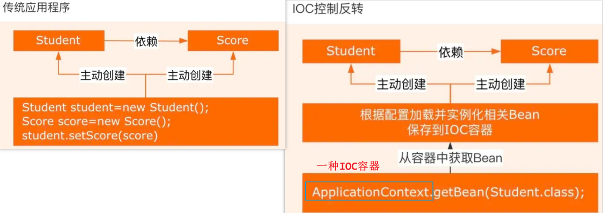
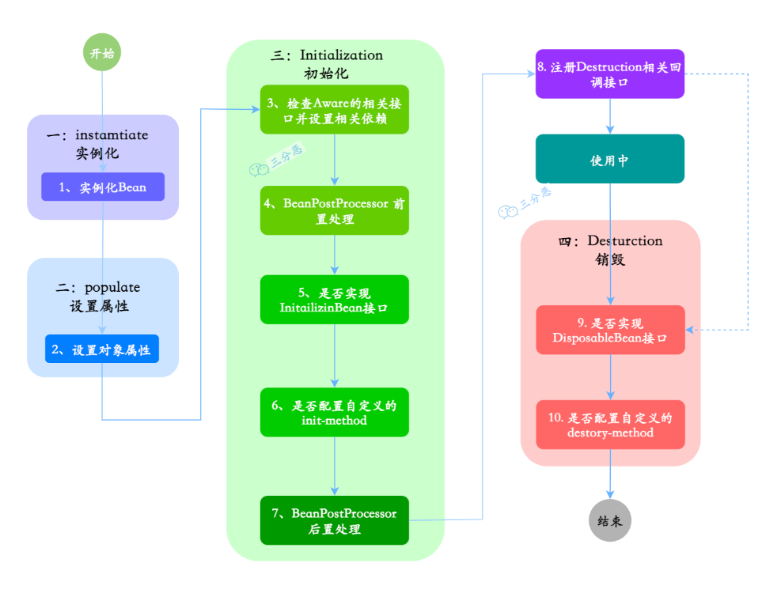

# Spring

> main reference: [二哥java](https://javabetter.cn/sidebar/sanfene/spring.html)

[toc]

todo:
spring是如何解决循环依赖的，三级缓存（xiaolin

## 基础

### Spring定义 特性 模块

**Spring主要模块：**

* Spring Core: 框架最基础的部分，提供IoC和DI特性
* Spring Context: 上下文容器，是BeanFactory功能加强的一个子接口
* Spring Web: 提供Web应用开发的支持
* Spring MVC: 针对Web应用中MVC思想的实现
* Spring DAO: 提供对JDBC抽象层，简化了JDBC编码
* Spring AOP: 即面向切面编程，它提供了与AOP联盟兼容的编程实现
* Spring ORM：它支持用于流行的ORM框架的整合，比如：Spring+Hibernate、Spring+iBatis、Spring+JDO的整合等

### Spring Annotation

please see: "java\SpringAnnotation.xmind"

## Spring

### Spring介绍

Spring 是一个**轻量级、非入侵式**的**控制反转 (IoC) 和面向切面 (AOP)** 的**框架**

**Spring核心特性/优势：**

* **IoC容器**：Spring通过控制反转，**维护所有对象的创建和依赖关系**。开发者只需要定义好Bean及其依赖关系，**Spring容器负责创建和管理这些对象**。
  * 依赖关系是指某对象A(eg bus)依赖对象B(eg wheels)
* **AOP**：面向切面编程，允许开发者定义**横切关注点**，例如事务管理、安全控制等，**独立于业务逻辑的代码**。通过AOP，可以将这些关注点模块化，提高代码的可维护性和**可重用性**。
* **事务管理**：Spring提供了**一致的事务管理接口**，支持声明式和编程式事务。开发者可以轻松地进行事务管理，而无需关心具体的事务API。
* **MVC框架**：Spring MVC是一个基于Servlet API构建的Web框架，采用了模型-视图-控制器（MVC）架构。它支持灵活的URL到页面控制器的映射，以及多种视图技术。
  * servlet是一个java类，用于处理web请求并生成响应，通常运行在Web服务器（如Tomcat、Jetty）上；核心api: `HttpServlet, HttpServletRequest...`

### 介绍一下IoC

* **IoC(Inversion of Control)控制反转**：是一种创建和获取对象的思想，**依赖注入DI(Dependency Injection)是实现这种技术的一种方式**。传统开发，我们需要通过**new关键字**来创建对象。使用IoC思想开发方式的话，我们不通过new关键字创建对象，而是**通过IoC容器来帮我们实例化对象**。
  * > 以前是我们想要什么就自己创建什么，现在是我们需要什么容器就帮我们送来什么。
  * IOC解决了繁琐的对象生命周期的操作，**解耦**了对象之间的耦合度，也解耦了代码
  * 所谓反转，其实就是反转的**控制权**，使用对象时，由主动new产生对象转换为由"外部"(Spring提供的IoC容器)提供对象

---

作图理解：

原本是我们自个儿new，现在有专门的IoC容器`ApplicationContext`来**控制**对象，控制是指：

* **创建对象**：原来是new一个，现在是由Spring容器创建
* **初始化对象**：原来是对象自己通过构造器或者setter方法给依赖的对象赋值，现在是由**Spring容器自动注入**
  * 如何自动注入来初始化呢？基于`@Autowired`, `@Resource`, 或者基于XML配置，或者基于构造函数（啊？
* **销毁对象**：原来是直接给对象赋值null或做一些销毁操作，现在是Spring容器**管理生命周期负责销毁对象**。

  

#### IoC实现机制

* **反射**：Spring IOC容器利用反射机制动态地加载类、创建对象实例及调用对象方法，**反射允许在运行时检查类、方法、属性等信息，以及可以运行时创建对象和调用方法**，使得对象实例化更为灵活。
* **依赖注入**：IOC的核心概念是依赖注入，即容器负责管理应用程序组件之间的依赖关系。Spring通过**构造函数注入、属性注入或方法注入**，将组件之间的依赖关系描述在配置文件中或使用注解。
* **设计模式 - 工厂模式**：IOC容器通常采用工厂模式来管理对象的创建和生命周期。**容器作为工厂**负责**实例化Bean并管理它们的生命周期**。
* **容器实现**：IOC容器是实现IOC的核心，通常使用`BeanFactory`或`ApplicationContext`来管理Bean。
  * `BeanFactory`是IOC容器的**基本形式**，提供基本的IOC功能；
  * `ApplicationContext`是BeanFactory的**扩展**，提供更多企业级功能。

### 介绍一下AOP

AOP(Aspect Oriented Programing): 

在面向切面编程的思想里面，把功能分为两种

* **核心业务**：登陆、注册、增、删、改、查
* **周边功能**：**日志、事务管理**这些次要的业务

在面向切面编程中，核心业务功能和周边功能是分别独立进行开发，两者不是耦合的，然后把切面功能和核心业务功能 "编织" 在一起，这就叫AOP。

---

面向切面编程能够将那些**与核心业务(CRUD登录注册..)无关**，却**为业务模块所共同调用的逻辑(周边功能：日志、事务管理)**封装起来，以**减少系统的重复代码，降低模块间的耦合度**，并且有利于扩展和维护。

> 用于在不修改原始代码的情况下，给现有方法/代码添加增强功能。

AOP中的概念：

简而言之：

1. JoinPoint连接点是一堆执行方法
2. PointCut通过表达式来匹配joinpoint得到切入点
3. Advice通知是在切入点"处"(前|后|环绕)执行具体的操作
4. Aspect切面是将多个Advice和PointCut结合在一起的模块/类

详而言之：

* JoinPoint：**连接点**，指程序执行过程中可以插入AOP逻辑的特定点，springAOP中连接点通常是**执行方法**
  * 在SpringAOP中**仅支持执行方法**的连接点，其他其实还有抛出异常、设置变量等
* `@PointCut`: 定义**切入点**，一个用于匹配**连接点**的表达式；可以理解为**连接点的过滤器**，用来定义在那些连接点应用AOP逻辑；
  * 当方法/**连接点匹配上了定义的规则**，就成为了切入点，就可以在这些点上插入Advice
* Advice：**通知**，在**切入点处**(即匹配了的PointCut)执行的**具体操作**
  * 前置通知`@Before`: 在切入点执行之前执行
  * 返回通知`@AfterReturning`: 在切入点方法返回结果之后执行，在After之前
  * 后置通知`@After`: 在切入点执行之后执行
  * **环绕通知**`@Around`：在切入点执行前后分别执行一段代码，**环绕通知必须依赖形参`ProceedingJoinPoint`来调用原方法**`pjp.proceed()`，然后在前后添加通知
  * **正常流程**：环绕通知-前 -> 前置通知 -> 返回通知 -> 后置通知 -> 环绕通知-后
* `@Aspect`：声明一个**切面**，包含了通知(advice)和切入点(pointcut)的对应关系
  * advice和pointcut的对应管理：**切面类中通过切入点@Pointcut标识出需要增强的目标方法，通过通知@Before指定在什么时机执行增强逻辑**
  * 一般是标注在类上，也可以标注接口、注解

```java
// 一个AOP切面类
@Aspect // 声明一个切面，描述通知和切入点的关系
@Component
public class LoggingAspect {
    // 切入点
    @Pointcut("execution(* com.example.demo.service.UserService.addUser(..))")
    public void userServiceMethods() {} // 切入点方法内容为空，因为它仅用于定义切入点

    @Before("userServiceMethods()")
    // 你也可以直接把切入点写到切面中
    // @Before("execution(* com.example.demo.service.UserService.addUser(..))") 
    public void logBefore() {
        System.out.println("Before method execution: Logging aspect");
    }

    @After("userServiceMethods()")
    public void logAfter() {
        // ...
    }

    @Around("userServiceMethods()") // 可以使用@Around替代@Before和@After
    public Object logAround(ProceedingJoinPoint pjp) throws Throwable {
        // 在目标方法执行前执行
        System.out.println("Before method execution: Logging aspect");
        // 执行目标方法
        Object result = pjp.proceed();
        // 在目标方法执行后执行
        System.out.println("After method execution: Logging aspect");
        return result;
    }
}
```

#### AOP实现机制

> 动态代理设计模式源码务必参考：[java_common_code.md](https://github.com/haooxia/CSJourney/blob/main/java/java_common_code.md)

Spring AOP的实现依赖于**动态代理**技术。动态代理是**在运行时动态生成代理对象，而不是在编译时(静态代理)**。它允许开发者在不修改源码的情况下增强方法的功能。

Spring AOP支持两种动态代理：

* **基于JDK动态代理**：需要代理的类实现一个或多个接口。基于java.reflect反射包实现，java内置的动态代理实现方式，**底层会实现与目标类相同的接口**
* **基于CGLIB动态代理**：当**被代理的类没有实现接口时**，Spring会使用CGLIB库**生成一个被代理类的子类**作为代理。CGLIB是一个第三方代码生成库，通过继承方式实现代理。

#### 介绍一下动态代理

Java的动态代理是一种**在运行时动态创建代理对象**的机制，主要用于在不修改原始类的情况下对方法调用进行**拦截和增强**。

Java动态代理主要分为两种类型：

* **基于接口**的代理（**JDK动态代理**）： 这种类型的代理要求目标对象必须实现至少一个接口。Java动态代理会**创建一个实现了相同接口的代理类**，然后在运行时动态生成该类的实例。
  * 这种代理的实现核心是java.lang.reflect.Proxy类和java.lang.reflect.InvocationHandler接口。每一个动态代理类都必须实现InvocationHandler接口，并且每个代理类的实例都关联到一个handler。**当通过代理对象调用一个方法时，这个方法的调用会被转发为由InvocationHandler接口的invoke()方法来进行调用。**
* **基于类**的代理（**CGLIB动态代理**）：CGLIB是一个强大的高性能的代码生成库，它可以**在运行时动态生成一个目标类的子类**。CGLIB代理不需要目标类实现接口，而是通过继承的方式创建代理类。

##### 静态代理 vs. 动态代理

* **灵活性**：动态代理更加灵活，**不需要必须实现接口**，可以直接代理实现类，并且可以**不需要针对每个目标类都创建一个代理类**。另外，静态代理中，接口一旦新增加方法，目标对象和代理对象都要进行修改，这是非常麻烦的！
* **JVM层面**：静态代理在**编译时就将接口、实现类、代理类这些都变成了一个个实际的class文件**。而**动态代理是在运行时动态生成类字节码(反射机制)**，并加载到JVM中的。
* 静态代理通常只代理一个类；动态代理代理的是一个接口下的多个实现类。

### Spring框架中反射的应用

1. **利用反射实现依赖注入DI**：比如你在Service层`@Autowired`一个DAO对象，无需手动编写创建DAO实例的代码。Spring在运行时**自动解析该注解**，**通过反射找到对应的DAO类**，并**利用反射实例化**，然后**注入到Service类**中
2. **SpringAOP中动态代理借助反射技术**：比如你想给所有Service层添加日志记录功能，可以定义一个切面，Spring会使用动态代理(jdk or CGLIB)创建目标类的代理对象，这个代理对象在调用任何方法前或后，都会执行切面中定义的代码逻辑（如记录日志），而**这一切都是在运行时通过反射来动态构建和执行的，无需硬编码到每个方法调用中**
3. 促进“高内聚、松耦合”

### Spring框架用到了哪些设计模式

* 工厂设计模式: Spring使用工厂模式通过BeanFactory、ApplicationContext创建bean对象
* 代理设计模式 : Spring AOP功能的实现。（jdk动态代理，cglib动态代理
* 单例设计模式 : Spring 中的Bean默认都是单例的
* 模板方法、挂插着、适配器、包装器暂略

### Spring常用注解

* `@Component`: ==标记一个**类作为Spring的bean**。Spring会**将该类实例化为一个bean**，并**添加到Spring容器中**==
* `@Autowired`: 自动装配bean。当Spring容器中存在与要注入的属性的类型匹配的**bean**时，会自动注入到**属性**中，跟我们new一样
```java
@Component
public class MyService {
}
@Component
public class MyController {
    @Autowired // spring自动将MyService类型的bean注入到myService属性中
    private MyService myService;
}
```
* `@Comfiguration`: 标记一个类作为Spring的配置类。类内可以包含`@Bean`注解的方法，用于定义和配置Bean
* `@Bean`: 标记一个方法作为Spring的**bean工厂方法**。**Spring会将该方法的返回值作为一个bean**，并**添加到Spring容器**，这个bean就可以在其他地方被注入和使用；（如果自定义配置，经常用到这个注解）
  * 所谓工厂方法，就是方法的职责是生成对象(即Bean)
  * `@Bean`通常会放在`@Configuration`类中，因为该类会告诉Spring如何创建和管理Bean
```java
@Configuration
public class MyConfiguration {
    @Bean
    public MyBean myBean() {
        return new MyBean();
    }
}
```
* `@Service`: 标记一个类作为Service层的组件。是`@Component`的特例，特用于标记一个Service层实现**类**成为一个**Bean**
* `@Repository`: 标记一个类作为DAO数据访问层的组件。是`@Component`的特例
* `@Controller`: 标记一个类作为控制层的组件。是`@Component`的特例，标记了的类会被Spring实例化为一个bean，添加到Spring容器中

AOP中的`@Aspect`, `@PointCut`, `@Before`, `@After`, `@Around`略了
`@GetMapping`, `@PostMapping`, `@PutMapping`略了

### Spring事务

#### Spring事务及分类

**Spring事务的本质是基于数据库的事务机制实现的**，Spring**本身无法提供事务功能**，它只是提供一个统一的事务管理接口，具体的事务实现由各个数据库自己实现（包括提交和回滚）。

> 我们mysql事务一直都是在数据层上; 把事务开到业务层的好处：可以将业务层中的方法里所包含的多个数据层操作放到一个事务管理，使其同成功同失败（Spring自动协调

Spring事务可分为：编程式事务管理和声明式事务管理

* 编程式事务可以使用TransactionTemplate和PlatformTransactionManager来实现，**需要显式执行事务**。允许我们**在代码中直接控制事务的边界**，**通过==编程方式==明确指定事务的开始、提交和回滚**
* 声明式事务是基于AOP的，本质是通过AOP功能，对方法前后进行拦截，**将事务处理的功能编织到拦截的方法中**，也就是在目标方法开始之前启动一个事务，在目标方法执行完之后根据执行情况提交或者回滚事务(@Around)。通过`@Transactional`实现，简单好用推荐。
  * 不足：最细**粒度**只能作用做到整个**方法级别**，因为springAop连接点是方法调用嘛；而编程式可以作用到**代码块级别**

**Q: 区别？**

* 编程式事务管理：需要在代码中显式调用事务管理的API来控制事务的边界，比较**灵活**，但是**代码侵入性较强，不够优雅**。
* 声明式事务管理：这种方式使用Spring的AOP来声明事务，**将事务管理代码从业务代码中分离出来**。代码简洁，好维护。但不够灵活，只有方法级别的粒度。

声明式事务注解**默认属性**：
```java
@Transactional(
    propagation = Propagation.REQUIRED, // 传播行为
    isolation = Isolation.REPEATABLE_READ, // 隔离级别
    timeout = 30, // 事务超时自动回滚
    readOnly = false,
    rollbackFor = {SQLException.class, RuntimeException.class} // 指定回滚异常
)
```

#### Spring事务隔离级别

跟mysql一样...多了个default(交给mysql控制)
<!-- mysql的四个隔离级别，Spring都支持，并且提供了对应的机制来配置它们，定义在TransactionDefinition接口中 -->

1. `default`：使用底层数据库的默认隔离级别。
2. `read_uncommited`：读未提交，允许事务读取其他事务没提交的更改。最低级别，脏读+不可重复读+幻读
3. `read_commited`：读已提交，确保事务只能读取已经被其他事务提交的更改。仅解决脏读
4. `repeatable_read`：可重复读，确保事务可以多次从一个字段中读取相同的值。解决了脏读+不可重复读
5. `serializable`：串行化，完全隔离了事务，确保事务序列化执行。解决所有问题

#### Spring事务传播行为 propagation

事务的传播机制定义了**在方法被另一个事务方法调用时，这个方法的事务行为应该如何**。

Spring 提供了一系列事务传播行为，这些传播行为定义了事务的边界和事务上下文如何在方法调用链中传播。

* `required` (default): 如果当前有事务，则加入该事务；如果没有事务，则**新建一个事务**
* `requires_new`: 总是新建一个事务，如果当前存在事务，则挂起该事务
  * 挂起：暂停该事务；创建新事务->执行新事务->结束新事务->恢复被挂起事务
* `supports`: 支持当前事务，如果当前存在事务则加入，没有事务，则**以非事务方式执行**
* `not_supported`: 总是以非事务方式执行，如果当前有事务则挂起该事务
* `mandatory(强制的)`: 必须在一个已有事务中执行，如果当前有事务则加入，如果没有则抛出异常
* `never`: 总是以非事务方式执行，如果当前有事务则抛出异常
* `nested`: 如果当前存在事务，则在当前事务内执行一个嵌套事务。如果没有事务，则新建一个事务。
  * 嵌套事务是一个子事务，它依赖于父事务。父事务失败时，会回滚子事务所做的所有操作。但子事务异常不一定会导致父事务的回滚。

> 事务传播机制是使用ThreadLocal实现的，所以，如果调用的方法是在新线程中，事务传播会失效。

#### 声明式事务失效情况

1. **未捕获异常**: 如果一个事务方法中发生了未捕获的异常，并且异常未被处理或传播到事务边界之外，那么spring会认为该事物是"失败"的，即会失效，**所有的数据库操作会回滚**
2. **非受检异常/unchecked exception/运行时异常**: 默认情况下，Spring对非受检异常（RuntimeException, NullPointerException..）进行回滚处理
   1. 受检异常是必须try-catch的
   2. 非受检异常/运行时异常我们不用处理，spring遇到这类异常会自动回滚，因为逻辑错误或空指针异常啥的，我们希望放弃当前操作
3. `@Transactional`应用在**非public方法上**
   1. 因为底层AOP通过反射拿到Transactional注解信息后，会判断方法是否是public，如果不是，则不会获取事务属性
4. **跨方法调用事务问题**: 如果一个事务方法内部调用另一个方法，而这个被调用的方法没有@Transactional注解，这种情况下外层事务可能会失效。
5. **事务传播属性propagation设置不当**: 如果在多个事务之间存在事务嵌套，且事务传播属性配置不正确，可能导致事务失效。
   1. 特别是在方法内部调用有@Transactional注解的方法时要特别注意。

## Bean

### BeanFactory vs. ApplicationContext

BeanFactory是Spring的“心脏”，而ApplicantContext是Spring的完整“身躯”

* BeanFactory主要负责配置、创建和管理bean，为Spring提供了**基本的依赖注入DI支持**
  * 采用**延迟实例化**的方式，即只在第一次`getBean()`获取Bean时，才会实例化Bean.
* ApplicationContext**是BeanFactory的子接口**，在BeanFactory的基础上添加了企业级的功能支持；（一般用这个）
  * **在启动时预先创建并初始化所有的Bean**

### Bean的生命周期

* Bean就是一帮身不由己的**java对象**，生命周期受到IoC容器控制。
* 普通的java对象，生命周期只有**实例化 + 对象不再被使用时通过垃圾回收机制进行回收**俩阶段（比较简单）
* Spring Bean这个java对象的生命周期可以分为四个阶段：**实例化instantiation, 属性赋值Populate, 初始化Initialization, 销毁Destruction**
* BeanFactory管理的Bean是在使用到时才**实例化**，ApplicationContext管理的Bean在容器初始化时就完成Bean**实例化**

  

详解Bean生命周期：

1. 实例化: 1.实例化一个Bean对象
2. 属性赋值: 2.为Bean设置相关属性和依赖
3. 初始化：3-4在初始化之前，5-6是真正的初始化，7在初始化之后执行
4. 销毁: 第8步其实也可以算到销毁阶段，但不是真正意义上的销毁，而是先在使用前注册了销毁的相关调用接口，为了后面第9、10步真正销毁Bean时再执行相应的方法

[继续整理](https://fighter3.blog.csdn.net/article/details/123498761?spm=1001.2014.3001.5506)

## SpringMVC

### SpringMVC的核心组件

* `DispatcherServlet`：前端控制器，核心的中央处理器，负责接收请求、分发，并给予客户端响应；是整个流程控制的**核心**，控制与调度
* `HandlerMapping`：处理器映射器，根据请求URL去匹配查找能处理的**Handler**，并会**将请求涉及到的拦截器和Handler一起封装**成一个`HandlerExecutionChain`处理器执行链对象
  * `Handler`: 处理器，完成具体的业务逻辑
  * `HandlerInterceptor`: 处理器拦截器，是个接口，可以拦截一些请求；你可以额外添加拦截器
    * 定义拦截器时，需要在配置类中实现`addInterceptors`方法注册拦截器，并设定拦截的路径范围
    * 可以创建多个拦截器，然后按照注册顺序进行执行
    * HandlerInterception中有三个方法
      * `preHandle`: 在请求处理程序执行之前调用。用于**执行权限验证**、日志记录等操作。如果该方法返回**false，则请求将被中断，后续的拦截器和处理程序将不会被执行**(很妙)
      * `postHandle`: 在**请求处理程序执行之后、视图渲染之前**调用。可以对请求的结果进行修改或添加额外的模型数据。
      * `afterCompletion`: 在整个请求完成之后调用，包括视图渲染完毕。可用于进行**资源清理**等操作。
* `HandlerAdapter`：处理器适配器，**Handler执行业务方法之前，需要进行一系列的操作**，包括表单数据的验证、数据类型的转换、将表单数据封装到JavaBean等，这些操作都是由交给他，开发者只需将注意力集中业务逻辑的处理上，DispatcherServlet通过HandlerAdapter执行不同的Handler
<!-- * `ModelAndView`: 装载了模型数据和视图信息，作为Handler的处理结果，返回给DispatcherServlet -->
* `ViewResolver`：视图解析器，根据Handler返回的逻辑视图，解析并渲染真正的视图，并传递给DispatcherServlet响应客户端

  


### SpringMVC工作原理 / 流程


1. **用户请求**：用户/客户端/浏览器发送请求，DispatcherServlet拦截请求
2. **请求拦截**：DispatcherServlet接收到请求后，并不直接处理，而是将请求信息传递给HandlerMapping。HandlerMapping根据请求的URL来查找能处理该请求的Handler（我们常说的Controller），并会**将请求涉及到的Interceptor和Handler一起封装**为一个处理器执行链对象`HandlerExecutionChain`
3. **处理器适配**：DispatcherServlet调用HandlerAdapter适配器执行具体的Handler
   1. HandlerAdapter通过适配器模式，使得不同类型的处理器可以被统一调用
4. **业务逻辑处理**：Handler完成对用户请求的处理后，会返回一个ModelAndView对象给DispatcherServlet
   1. ModelAndView顾名思义，包含了数据模型以及相应的视图的信息。Model是返回的数据对象，View是个逻辑上的View
5. **视图解析**：ViewResolver会根据逻辑View查找实际的View
6. **渲染视图**：DispatcherServlet使用解析得到的视图对象，将模型数据填充到视图中，完成视图的渲染，并将结果返回给用户
7. 把View返回给请求者（浏览器）
