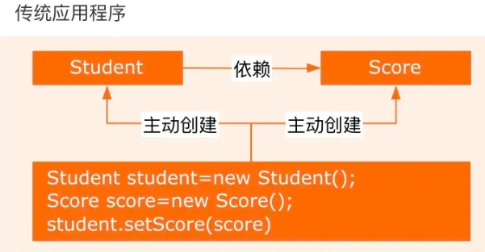
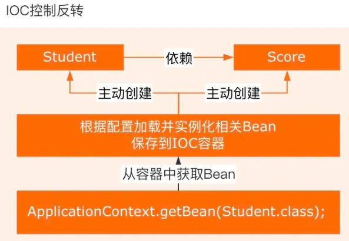
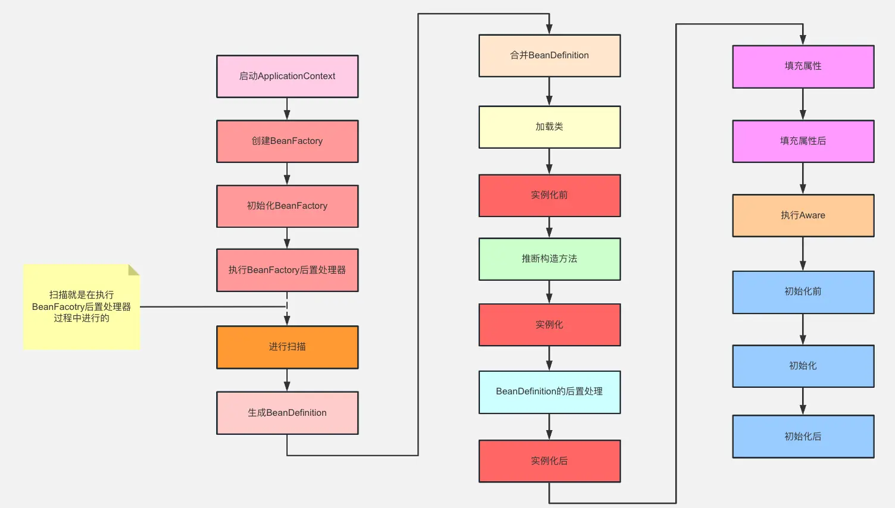
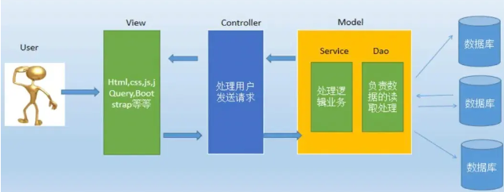

# Spring
> 整体的很一般，只适合略微微参考
### 1. 说一下你对Spring的理解

Spring框架核心特性包括：

- **IoC容器**：Spring通过控制反转实现了对象的创建和对象间的依赖关系管理。开发者只需要定义好Bean及其依赖关系，Spring容器负责创建和组装这些对象。
- **AOP**：面向切面编程，允许开发者定义横切关注点，例如事务管理、安全控制等，独立于业务逻辑的代码。通过AOP，可以将这些关注点模块化，提高代码的可维护性和可重用性。
- **事务管理**：Spring提供了一致的事务管理接口，支持声明式和编程式事务。开发者可以轻松地进行事务管理，而无需关心具体的事务API。
- **MVC框架**：Spring MVC是一个基于Servlet API构建的Web框架，采用了模型-视图-控制器（MVC）架构。它支持灵活的URL到页面控制器的映射，以及多种视图技术。

### 2. Spring的AOP介绍一下

Spring AOP是Spring框架中的一个重要模块，用于实现面向切面编程。AOP能够将那些与业务无关，**却为业务模块所共同调用的逻辑或责任（例如事务处理、日志管理、权限控制等）封装起来**，便于**减少系统的重复代码**，**降低模块间的耦合度**，并**有利于未来的可拓展性和可维护性**。

> 通俗易懂的理解：用于在不修改原始代码的情况下，向现有代码中添加额外的功能或行为。它通过在程序执行的特定点（如方法调用之前或之后）插入代码来实现这些功能。

在 AOP 中有以下几个概念：

- **AspectJ**：切面，只是一个概念，没有具体的接口或类与之对应，是 Join point，Advice 和 Pointcut 的一个统称。

  > 可以理解为一个**独立的模块**，它用来封装那些**横切关注点**。

- **Join point**：连接点，指程序执行过程中的一个点，例如方法调用、异常处理等。在 Spring AOP 中，**仅支持方法级别**的连接点。

- **Advice**：通知，即我们定义的一个切面中的横切逻辑，有“around”，“before”和“after” 三种类型。意味着切面中的具体动作，比如在方法执行前记录日志、在方法执行后做某些处理等。

- **Pointcut**：切点，用于匹配连接点，定义了在哪些连接点上应用切面，比如指定在某个类的所有方法上应用日志记录。

~~~java
// LoggingAspect 类就是一个切面，它封装了日志记录的逻辑
@Aspect
public class LoggingAspect {
	// 切入点：定义在 createUser 连接点上应用通知
    // 连接点：createUser 方法的执行
    // 通知：@Before 是通知类型，logBefore 方法是通知的具体实现
    @Before("execution(* com.example.UserService.createUser(..))")
    public void logBefore(JoinPoint joinPoint) {
        System.out.println("准备创建用户: " + joinPoint.getArgs()[0]);
    }
}
~~~

### 3. 怎么理解SpringIoC

**IOC**：Inversion Of Control，即控制反转，是一种设计思想。在传统的 Java SE 程序设计中，我们直接在对象内部通过 new 的方式来创建对象，是程序主动创建依赖对象。

而在Spring程序设计中，IOC 是有专门的容器去控制对象。





**所谓控制**就是对象的创建、初始化、销毁。

- 创建对象：原来是 new 一个，现在是由 Spring 容器创建。
- 初始化对象：原来是对象自己通过构造器或者 setter 方法给依赖的对象赋值，现在是由 Spring 容器自动注入。
- 销毁对象：原来是直接给对象赋值 null 或做一些销毁操作，现在是 Spring 容器管理生命周期负责销毁对象。

总结：IOC 解决了繁琐的对象生命周期的操作，解耦了我们的代码。**所谓反转**：其实是反转的控制权，前面提到是由 Spring 来控制对象的生命周期，那么对象的控制就完全脱离了我们的控制，控制权交给了 Spring 。这个反转是指：**我们由对象的控制者变成了 IOC 的被动控制者**。

### 4. Spring常用注解有什么

> @Autowired 注解

主要用于自动装配bean。当Spring 容器中存在与要注入的属性类型匹配的bean时，它会自动将bean注入到属性中。就跟我们new 对象一样。

用法很简单，如下示例代码：

```java
@Component
public class MyService {
}
@Component
public class MyController {
    @Autowired
    private MyService myService;
}
// MyController类中的myService属性被@Autowired注解标记，Spring会自动将MyService类型的bean注入到myService属性中。
```

> @Component

这个注解用于标记一个类作为Spring的bean。当一个类被@Component注解标记时，Spring会将其实例化为一个bean，并将其添加到Spring容器中。在上面讲解@Autowired的时候也看到了，示例代码：

```java
@Component
public class MyComponent {
}
// MyComponent类被@Component注解标记，Spring会将其实例化为一个bean，并将其添加到Spring容器中。
```

> @Configuration

@Configuration，注解用于标记一个类作为Spring的配置类。配置类可以包含@Bean注解的方法，用于定义和配置bean，作为全局配置。示例代码：

```java
@Configuration
public class MyConfiguration {
    @Bean
    public MyBean myBean() {
        return new MyBean();
    }
}
```

> @Bean

@Bean注解用于标记一个方法作为Spring的bean工厂方法。当一个方法被@Bean注解标记时，Spring会将该方法的返回值作为一个bean，并将其添加到Spring容器中，如果自定义配置，经常用到这个注解。

```java
@Configuration
public class MyConfiguration {
    @Bean
    public MyBean myBean() {
        return new MyBean();
    }
}
```

> @Service

@Service，这个注解用于标记一个类作为服务层的组件。它是@Component注解的特例，用于标记服务层的bean，一般标记在业务service的实现类。

```java
@Service
public class MyServiceImpl {
}
```

> @Repository

@Repository注解用于标记一个类作为数据访问层的组件。它也是@Component注解的特例，用于标记数据访问层的bean。这个注解很容易被忽略，导致数据库无法访问。

```java
@Repository
public class MyRepository {
}
// MyRepository类被@Repository注解标记，Spring会将其实例化为一个bean，并将其添加到Spring容器中。
```

> @Controller

@Controller注解用于标记一个类作为控制层的组件。它也是@Component注解的特例，用于标记控制层的bean。这是MVC结构的另一个部分，加在控制层

```java
@Controller
public class MyController {
}
// MyController类被@Controller注解标记，Spring会将其实例化为一个bean，并将其添加到Spring容器中
```

### 5. Bean的生命周期说一下



1. Spring启动，查找并加载需要被Spring管理的bean，进行Bean的实例化
2. Bean实例化后对将Bean的引入和值注入到Bean的属性中
3. 如果Bean实现了BeanNameAware接口的话，Spring将Bean的Id传递给setBeanName()方法
4. 如果Bean实现了BeanFactoryAware接口的话，Spring将调用setBeanFactory()方法，将BeanFactory容器实例传入
5. 如果Bean实现了ApplicationContextAware接口的话，Spring将调用Bean的setApplicationContext()方法，将bean所在应用上下文引用传入进来。
6. 如果Bean实现了BeanPostProcessor接口，Spring就将调用他们的postProcessBeforeInitialization()方法。
7. 如果Bean 实现了InitializingBean接口，Spring将调用他们的afterPropertiesSet()方法。类似的，如果bean使用init-method声明了初始化方法，该方法也会被调用
8. 如果Bean 实现了BeanPostProcessor接口，Spring就将调用他们的postProcessAfterInitialization()方法。
9. 此时，Bean已经准备就绪，可以被应用程序使用了。他们将一直驻留在应用上下文中，直到应用上下文被销毁。
10. 如果bean实现了DisposableBean接口，Spring将调用它的destory()接口方法，同样，如果bean使用了destory-method 声明销毁方法，该方法也会被调用。

### 6. Spring容器里存的是什么？

在Spring容器中，存储的**主要是Bean对象**。

Bean是Spring框架中的基本组件，用于表示应用程序中的各种对象。当应用程序启动时，Spring容器会根据配置文件或注解的方式创建和管理这些Bean对象。Spring容器会负责创建、初始化、注入依赖以及销毁Bean对象。

### 7. MVC分层介绍一下

MVC全名是Model View Controller，是模型(model)－视图(view)－控制器(controller)的缩写，一种软件设计典范，用一种业务逻辑、数据、界面显示分离的方法组织代码，将业务逻辑聚集到一个部件里面，在改进和个性化定制界面及用户交互的同时，不需要重新编写业务逻辑。

- 视图(view)： 为用户提供使用界面，与用户直接进行交互。
- 模型(model)： 通常指一个用于存取数据的对象或简单的 Java 对象（Java POJO）。它不仅可以承载数据，还可以包含处理用户请求的逻辑。模型分为两类：数据承载 Bean 和业务处理 Bean。数据承载 Bean，像 `User` 类，专门用于存储和传递业务数据；而业务处理 Bean，则如 `Service` 或 `DAO` 对象，专门负责处理用户的业务请求。
- 控制器(controller)： 用于将用户请求转发给相应的 Model 进行处理，并根据 Model 的计算结果向用户提供相应响应。它使视图与模型分离。



流程步骤：

1. 用户通过View 页面向服务端提出请求，可以是表单请求、超链接请求、AJAX 请求等；
2. 服务端 Controller 控制器接收到请求后对请求进行解析，找到相应的Model，对用户请求进行处理Model 处理；
3. 将处理结果再交给 Controller（控制器其实只是起到了承上启下的作用）；
4. 根据处理结果找到要作为向客户端发回的响应View 页面，页面经渲染后发送给客户端。

### 8. 为什么使用springboot

- 简化开发：Spring Boot通过提供一系列的开箱即用的组件和自动配置，简化了项目的配置和开发过程，开发人员可以更专注于业务逻辑的实现，而不需要花费过多时间在繁琐的配置上。
- 快速启动：Spring Boot提供了快速的应用程序启动方式，可通过内嵌的Tomcat、Jetty或Undertow等容器快速启动应用程序，无需额外的部署步骤，方便快捷。
- 自动化配置：Spring Boot通过自动配置功能，根据项目中的依赖关系和约定俗成的规则来配置应用程序，减少了配置的复杂性，使开发者更容易实现应用的最佳实践。

### 9. 怎么理解SpringBoot中的约定大于配置

- **自动化配置**：Spring Boot 提供了大量的自动化配置，通过分析项目的依赖和环境，自动配置应用程序的行为。开发者无需显式地配置每个细节，大部分常用的配置都已经预设好了。例如，Spring Boot 可以根据项目中引入的数据库依赖自动配置数据源。
- **默认配置**：Spring Boot 在没有明确配置的情况下，会使用合理的默认值来初始化应用程序。这种默认行为使得开发者可以专注于核心业务逻辑，而无需关心每个细节的配置。
- **约定优于配置**：Spring Boot 遵循了约定优于配置的设计哲学，即通过约定好的方式来提供默认行为，减少开发者需要做出的决策。例如，约定了项目结构、Bean 命名规范等，使得开发者可以更快地上手并保持团队间的一致性。

### 10. 了解SpringCloud吗，说一下他和SpringBoot的区别

Spring Boot是用于构建单个Spring应用的框架，而Spring Cloud则是用于构建分布式系统中的微服务架构的工具，Spring Cloud提供了服务注册与发现、负载均衡、断路器、网关等功能。

两者可以结合使用，通过Spring Boot构建微服务应用，然后用Spring Cloud来实现微服务架构中的各种功能。

### 11. 负载均衡有哪些算法？

- 简单轮询：将请求按顺序分发给后端服务器上，不关心服务器当前的状态，比如后端服务器的性能、当前的负载。
- 加权轮询：根据服务器自身的性能给服务器设置不同的权重，将请求按顺序和权重分发给后端服务器，可以让性能高的机器处理更多的请求
- 简单随机：将请求随机分发给后端服务器上，请求越多，各个服务器接收到的请求越平均
- 加权随机：根据服务器自身的性能给服务器设置不同的权重，将请求按各个服务器的权重随机分发给后端服务器
- 一致性哈希：根据请求的客户端 ip、或请求参数通过哈希算法得到一个数值，利用该数值取模映射出对应的后端服务器，这样能保证同一个客户端或相同参数的请求每次都使用同一台服务器
- 最小活跃数：统计每台服务器上当前正在处理的请求数，也就是请求活跃数，将请求分发给活跃数最少的后台服务器

### 12. 介绍一下服务熔断

在分布式与微服务系统中，如果下游服务因为访问压力过大导致响应很慢或者一直调用失败时，上游服务为了保证系统的整体可用性，会**暂时断开与下游服务的调用连接**。这种方式就是熔断。

服务熔断一般情况下会有三种状态：闭合、开启和半熔断;

闭合状态：服务一切正常，没有故障时，上游服务调用下游服务时，不会有任何限制。

开启状态：上游服务不再调用下游服务的接口，会直接返回上游服务中预定的方法。

半熔断状态：处于开启状态时，上游服务会根据一定的规则，尝试恢复对下游服务的调用。此时，上游服务会以有限的流量来调用下游服务，同时，会监控调用的成功率。如果成功率达到预期，则进入关闭状态。如果未达到预期，会重新进入开启状态。

### 13. 介绍一下服务降级

服务降级，说白了就是一种服务托底方案，如果服务无法完成正常的调用流程，就使用默认的托底方案来返回数据。