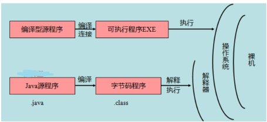
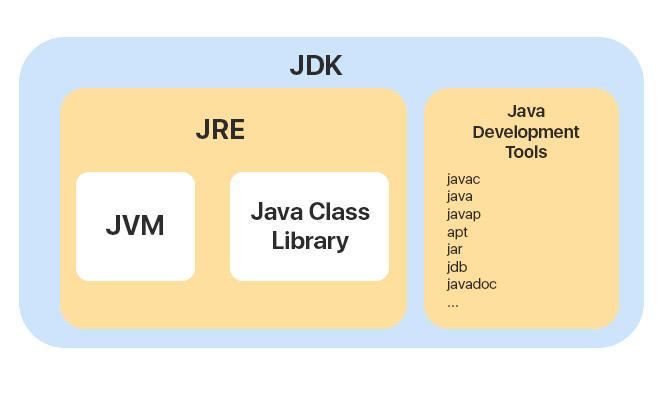
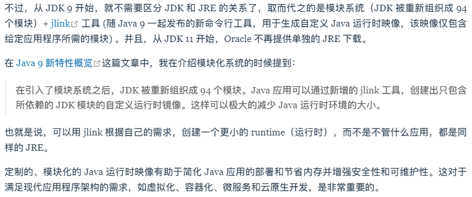
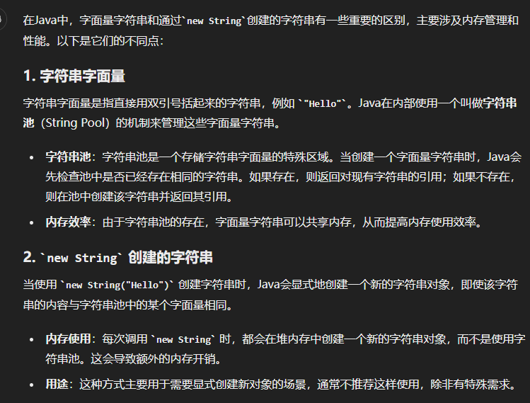
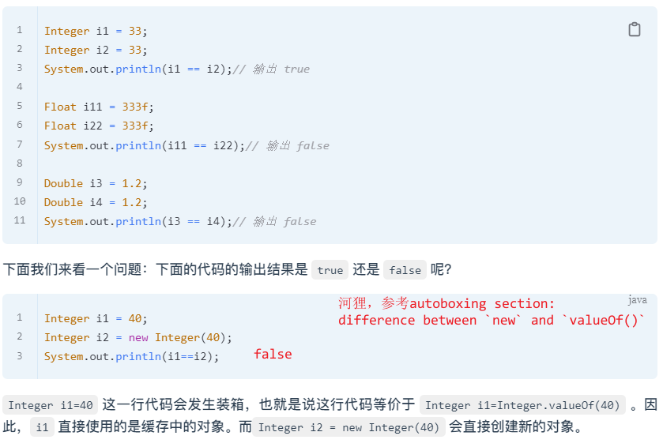
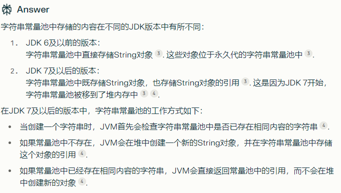

# Java

[toc]

## route

* JavaSE: 基础, oop, colletion, 泛型, 多线程, IO流, 反射, Java8(Stream API, Lambda)
* MySQL, JavaWeb(servlet,...), Spring 5(IOC,AOP), SpringMVC, MyBatis, SpringBoot 2, (Maven), Linux
* JavaEE进阶：Redis(14d), 消息队列(14d), Nginx(14d), 微服务(60d), 容器(7)
* 设计模式(21d)
* 项目实战
* Java高级/other：并发编程（线程, 同步, 异步, 线程池, JUC）, JVM(类加载, 垃圾回收, JVM性能调优), 分布式

## 基础-1

### 基础

* Java SE vs. Java EE vs. Java ME
  * Java SE(Standard): 包含java核心类库和虚拟机等核心组件
  * Java EE(Enterprise): 基于Java SE，包含了支持企业级应用程序开发和部署的标准和规范(servlet, JSP, JDBC, ...)
  * Java ME(Micro): 用于开发嵌入式电子产品的应用程序，手机冰箱空调等
* 源代码 vs. 字节码
  * 源代码 `test.java`: 计算机无法直接理解和执行
  * 字节码 `test.class`: `javac`编译后的**中间表示形式**。字节码是**平台无关**的，可以实现“一次编写、到处运行” (write once, run anywhere)
    * C语言编译后会直接生成特定平台的机器码，可以直接在该平台运行。 `gcc -> a.out`
    * 而java编译生成的字节码文件**不是可以直接执行的机器码**，需要通过jvm解释执行
      *   
    * 一次编写到处运行 和 一次编译到处运行 本质上是一样的，前者是**强调开发者只需要编写一次**(编写费程序员脑子)java code，无需针对不同平台修改代码；后者**强调只需编译一次**(编译耗cpu)生成class文件，可以在任何安装了对应版本jvm的平台上运行，无需重新编译(无需重新编译还是挺吊的)
      * cpp有时不同平台会有不同接口，比如socket(但我们通常说.c是跨平台的(大部分情况下是**一次编写，到处编译**的))；其次cpp在不同平台编译产生的结果还不同(.out和.exe)
  * JVM: 可以加载和执行java字节码；将java字节码解释或即时编译成机器码，然后在具体的硬件设备上运行。jvm的存在使得java源代码可以在不同os和硬件上运行，而无需修改源码。
* JVM vs. JDK vs. JRE
  * JVM/java虚拟机: 运行java字节码(平台无关)的虚拟机。不同os有不同的jvm，如此jvm便屏蔽了底层平台的差别，一份编译后的class字节码文件就可以run anywhere.
    * 每个公司/个人都可以开发自己的jvm
  * JRE: java runing environment = JVM + java基础类库；JRE是运行java程序所需的内容集合（即你想要运行java程序，jre就够了，无需jdk
  * JDK: java development kit = JRE + Java tools (编译java源码的编译器javac, javadoc（文档注释工具）, jdb（调试器）, jconsole（基于JMX的可视化监控⼯具）, javap（反编译工具）etc)，工具齐全，供开发者编码使用。
  *   
  *   

#### 为什么说java是编译与解释并存

首先高级语言按照程序的执行方式分为：

* 编译型：通过编译器将源码**一次性翻译**成可被特定平台执行的机器码；执行速度快，开发效率低。e.g., c, cp, go, rust...
  * 执行时直接执行机器码当然快咯，编译时候都给全局优化好了；而解释型语言需要在运行时逐行翻译源码，那当然慢（而且还缺乏全局优化）；开发低效是因为每次改完代码都得重新编译，那大型项目确实难顶...而且编译后的程序通常只能在特定平台运行
* 解释型：通过解释器**一句一句**将代码解释interpret为机器代码后再执行；开发效率高，执行速度慢。e.g., python, js, php...

即时编译JIT(Just-in-time compilation)：混合了编译语言和解释型语言的优点，首先可以像编译语言一样将源代码编译为字节码，然后执行时将字节码直译。
即java是**先编译后解释**(结合了二者)，故而称java是编译与解释并存。

#### AOT是什么

jdk9引入了一种新的编译模式AOT(Ahead of Time Compilation). 不同于JIT，AOT会在程序被执行之前编译为机器码，属于静态编译。AOT 避免了 JIT 预热等各方面的开销，可以提高 Java 程序的启动速度，避免预热时间长。

* AOT的主要优势在于启动时间、内存占用和打包体积。JIT的主要优势在于具备更高的极限处理能力，可以降低请求的最大延迟。
* AOT 编译无法支持 Java 的一些动态特性，如反射、动态代理、动态加载等，所以用不了Spring等框架。

#### java vs. c++

* java没有指针，不可以直接访问内存，内存更安全
* java不支持多重继承，类只可以单继承。但java的接口可以多继承；c++允许多重继承
* java有自动垃圾回收机制GC，无需人来手动free；java中没有destructor
* java不支持运算符重载
* cpp是编译型语言，直接编译生成可执行的机器码；java混合了编译型和解释型，编译之后仍然需要一个解释器来执行
* cpp是一次编写到处**编译**，即不同平台编译结果不同（不同os甚至cpu使用的机器指令集不同）；java一次编写，到处**运行**
* ==java中数组是对象==(数组是Object的子类)，具有特定属性(eg length)和方法(eg clone(), hashCode())；而cpp中数组被视为原生数据类型，与普通变量一样，没有额外的属性和方法。cpp中数组名指向数组首元素；C语言中数组作为参数传递传递的是数组地址，即也是引用，而非拷贝
  * ==首先java数组确实是Object的子类!== 其次，这种继承关系比较特殊，由JVM实现，而非常规的java类继承机制（所以我没看到源码）
  * 所以java中`int[] arr = {1,2,3};`中arr是引用类型，存在栈中，指向堆中的实际数组对象/值

#### java只有值传递

* 形参 is **parameters** (定义函数，接收实参), 实参 is **arguments** (传递给方法的参数)
* c/cpp中包括值传递(方法接收的是实参值的拷贝(副本))和引用传递(方法接收的是**实参所引用的对象的地址**，对形参的修改会影响到实参)，==但java只有值传递，传递的都是参数的副本==
* java的值传递
  * 如果参数是基本类型的话，传递的就是基本类型的字面量值的拷贝，会创建副本。
  * 如果参数是引用类型，传递的就是==引用的副本(地址值的副本)==，同样符合值传递。
    * 核心是说：在方法内部修改这个引用的副本，**你可以修改对象的属性，影响到原始对象**，==但不会影响到方法外部的引用==（妙妙
* 看起来核心在于 传地址值的副本(java) vs. 传地址值(cpp)
  * 前者接收原始引用的副本，方法内部可以通过该副本访问和修改对象，但不可修改调用者的原始引用，调用者的引用仍指向该对象（更加安全）
  * 后者接收原始引用，方法内部不仅可以访问和修改对象，还可以修改该引用，使其指向新对象（即直接在方法内部修改调用者的变量

[有必要再来一遍](https://javaguide.cn/java/basis/why-there-only-value-passing-in-java.html)

### keywords

一些关键字keywords：
**访问控制修饰符**：private, protected, public
**定义类、方法、变量修饰符的关键字**：abstract, final, static, synchronized
> class, extends, implements, interface, new

建立实例，实例引用，判断实例：new, this, super, instanceof
包：package, import
异常处理：try, catch, finally, throw, throws
基本类型：boolean, byte, char, double, float, int, long, short
其他修饰符关键字：native, strictfp, transient, volatile, assert

#### Access Modifier

* public: 开放，所有用户可直接调用；
* protected: 保护，只有自己，以及自己的子女、同一个包内的朋友可以调用，其他人不行；
* private: 私有，除自己外，其他人不可调用，自己子女也不可以；
* default: 同一包内的类可见

#### abstract final static

* abstract: 用于声明抽象类和抽象方法
* ==final==
  * 修饰类时表示不能被继承；
  * 修饰方法时表示子类不可override此方法；
  * 修饰基本类型变量时值不可更改；即成为一个**常量**
  * 修饰引用类型变量时这个变量的值也是不能更改（**值为所指向的内存地址**），即不能指向其他对象，然而该引用的对象本身的内容是可以修改的（除非该对象本身不可变）
    * > 类似于cpp的指针常量(指针指向不可改，内容可改)吧可能，不过无所谓了，forget the cpp sometimes.
    * 注意==java中数组变量属于引用类型==，故而`final int[] arr = ...`;arr不可以指向另一个数组对象，但该数组的内容(元素的值)可以改变
    * > 常量在定义时必须赋值，但可以在三个地方赋初值：(定义时，构造器中，代码块中)
    * > 如果final修饰的属性是static，不能在构造器中赋值，只能在定义时或static代码块中。因为static属性是在实例化(ctor)之前，类加载时就要赋值。
* ==static==
  * static修饰的方法称作静态方法，static修饰的变量称作类变量；static还可以修饰内部类和代码块
  * static不可修饰外部类、局部变量
  * static在类加载时初始化/加载完成
  * static修饰的属于类，而非对象，可以直接调用，无需实例化

### 数据类型

* 基本数据类型(8 kinds): (built-in **primitive data types**)
  * byte(8bit), short(16bit),int(32b),long(64b): 与os/硬件架构位数无关
    * c中int在16位机器上是16b, 32位机器上是32b; java由于通过jvm跨平台所以与平台无关，恒定为32b，和C范围一致。
  * float(32b), double(32b): IEEE754
  * boolean(1bit)
  * char(**16bit**): unicode
    * 提一嘴：char用单引号，String用双引号
    * 注意cpp的char本质上是小整数(8bit, ASCII, -128~128 or 0-255)，而java中是16bit的unicde字符
      * java的char参与算数运算时会提升为int类型，所以char和int运算结果为int，想要char的话，需要强制类型转换； `char ch = (char) ('0' + 1); int i = '0' + 1`
        * 而cpp中会自动隐式转换为char`char ch = '0'+1;`

这8中类型对应列8中**包装类型**Warpper: Byte, Short, Integer, Long, Float, Double, Boolean, Character

#### 基本类型 vs. 包装类型

* 用途层面：**方法参数**、==对象属性==常常使用包装类型来定义变量。局部变量常常使用基本数据类型（性能考虑+简洁）。
  * 包装类型可用于泛型，基本类型不可。
  * but, 对象属性使用基本类型感觉也挺常见的
* 存储方式：基本类型的局部变量存在jvm栈中，基本类型的non-static成员变量存在jvm的堆中。而**包装类型属于对象类型**，均存在堆中。
  * 注意基本类型未必都存在stack中
* 占用空间：基本类型更小，对象类型有个对象头Object Header（存储对象的元数据信息: 标记字段mark word：hashcode, 锁状态标志, GC标记等；类型指针(用于确定对象类型)） (the size of object header is about 8-12B)
* 默认值：包装类默认为null, 基本类型有默认值且非null (eg, 0, 0.0, false, '\u0000')
* **比较方式**：**基本类型使用`==`比较value，包装类型`==`比较的是object address**，故而包装类之间的值比较使用`equals()` (同于String，包装类型和String都重写了equals())
* java的Collection(eg ArrayList, HashMap)只能处理对象，不可处理primitive type

#### 自动装箱拆箱 autoboxing & unboxing

* autoboxing: primitive type -> wrapper: `Integer i = 10;`
  * 等价于`Integer i = Integer.valueOf(10);`
  * jdk5引入自动性（底层调用`.valueOf()`），之前就需要手动；
  * 还有一种方式创建Integer: `Integer i = new Integer(10);`j
    * **`new`和`valueOf()`区别是什么？**
    * new Integer(val): 即直接调用constructor, ==每次都会创建一个新Integer对象，不使用缓存机制== (java9中废弃); 底层自然不会调用valueOf(), 没什么鸟关系
    * Integer.valueOf(): 一个成员方法，超出缓存的值才会new一个新对象。
* unboxing: wrapper -> primitive type: `int n = i;`
  * 等价于`int n = i.intValue();`

#### 包装类型的缓存机制 Wrapper Cache

  

Java基本数据类型的包装类型很多都采用了缓存机制来提升性能。

* ==Byte,Short,Integer,Long 这4种包装类默认创建了数值[-128，127]的相应类型的缓存数据==
  * 缓存的范围区间的大小只是在性能和资源之间的权衡。
* Character创建了数值在[0,127]范围的缓存数据
* Boolean直接返回True or False
* Float, Double没有缓存机制，河狸

为何？

* 提高性能：对于Integer，-128~127会频繁使用，缓存机制可以避免重复创建对象，减少对象创建、回收的开销。
* 省内存：重用咯
* 补充：多处访问同一个Integer缓存对象实例时，不会出现问题，因为：
  * Integer对象是不可变的（类的设计便是如此，搞了个private的value，但没暴露修改方法）

**详解Integer 缓存机制**：
创建Integer时，调用valueOf():
IntegerCache.low = -128; IntegerCache.high = 127
所以在[-128, 127]之间并没有真的new一个Interger，否则会new；
内部缓存了个Interger数组吧，len=256

```java
public static Integer valueOf(int i) {
    if (i >= IntegerCache.low && i <= IntegerCache.high)
        return IntegerCache.cache[i + (-IntegerCache.low)];
    return new Integer(i);
}
```

  

#### other question

* 我们知道float/double会丢失精度 -> use BigDecimal
* 我们还知道primitive type中整数最大就是long int -> use BigInteger

### 变量

#### 局部变量 vs. 成员变量

> 可以分类为：局部变量, 成员变量 (static & non-static)
> non-static成员变量又名为 实例变量 instance variable
> static成员变量又名为 类变量 class variable / 静态变量

* **语法形式**：成员变量属于类的范畴(形式上)，局部变量在代码块内或方法/构造方法的**参数**或方法体中。==局部变量不能被访问控制修饰符及static修饰==，成员变量可以；而final大家都可以
  * 河狸，局部变量要啥访问控制；至于static, static变量的生命周期是类级别的，和局部变量的定义冲突; 所以说static变量说的就是static成员变量
* **存储方式**：局部变量一定是在栈中；static成员变量属于类，存在方法区(待详解)；non-static成员变量属于实例instance，跟着对象存在堆中。
  * 一个引用类型的局部变量，该变量本身依然在栈中，所指向的对象在堆中
* **生命周期**：局部变量随着块/方法的调用而生成和消亡；static成员变量与类的生命周期一致，在类加载时分配内存，在程序结束时释放内存；non-static成员变量和对象的生命周期一致，随对象创建而分配，回收而释放。
* **默认值**：如果不赋初值，局部变量不会自动赋值，即**局部变量必须赋初值/初始化**；而成员变量会自动为类型的默认值(e.g., 0, null, false)。
  * 一个有趣的点：Java中局部变量如果不初始化会编译报错，cpp编译则不报错（java确实安全）
  * 一种情况例外:被 final 修饰的成员变量也必须显式地赋值

多说一句static variable:

* class的所有instance共享同一份static variable，省内存
* 可以通过类名访问
* 通常会被final修饰为常量 (何故)

### 方法

#### 静态方法 vs. 实例/一般方法

* static方法可以通过类名调用(推荐)，也可以通过对象名调用，而实例方法只能后者。（调用static方法无需创建对象，eg Math.abs()...）
* static方法只能访问static成员（static成员变量和static方法），不允许访问实例成员/non-static（实例变量和实例方法）; 实例方法则不受限。
  * **为何static方法不能调用non-static成员？**
  * static方法属于类，在类加载的时候分配内存。non-static成员属于instance，只有在对象实例化后才存在。在类的非静态成员不存在的时候静态方法就已经存在了，此时调用在内存中还不存在的非静态成员

#### 重载Overloading vs. 重写Overriding

* 重载：**同一个类中**，多个同名方法根据不同的传参执行不同的逻辑处理
  * 参数列表 (类型, 个数, **顺序**) 构成signature
  * **返回值不同或访问修饰符不同不构成重载**
* 重写：子类继承自父类的相同方法，输入数据一样，但要做出有别于父类的响应时，你就要覆盖父类方法(覆写)
  * ==两同两小一大==
    * **方法名、参数列表必须相同**
    * **子类方法返回值类型应 <= 父类方法返回值类型，抛出的异常范围 <= 父类，访问修饰符范围 >= 父类**
      * 如果方法的返回类型是 void 和基本数据类型，则返回值重写时不可修改。但是如果方法的返回值是引用类型，重写时是可以返回该引用类型的子类
  * 如果父类方法访问修饰符为 private/final/static 则子类就不能重写该方法，但是被 static 修饰的方法能够被再次声明。
    * private: 子类不可见
    * final: 正是为了防止重写
  * 构造方法无法被重写

## 基础-2

### OOP

#### 面向对象 vs. 面向过程

* 面向过程把解决问题的过程拆成一个个方法，通过一个个方法的执行解决问题。是过程化思维，使用面向过程语言开发大型项目，软件复用和维护存在很大问题，模块之间耦合严重。
* 面向对象会先抽象出对象，然后用对象执行方法的方式解决问题。相对面向过程更适合解决规模较大的问题，可以拆解问题复杂度，对现实事物进行抽象并映射为开发对象，更接近人的思维。更易维护、易复用、易扩展

#### 面向对象六大原则 （有亿点抽象

* 单一职责原则 Single Responsibility Principle (SRP)：一个类只负责一项职责，只有一个引起它变化的原因 -> 降低复杂度，提高可维护性
* 开闭原则 Open-Closed Principle (OCP): 软件实体应该对外扩展开放，对修改封闭 -> 当需要改变一个程序的功能时,应该通过添加新代码来实现,而不是更改现有的代码。
  * > 例子：通过制定接口来实现这一原则，比如定义一个图形类，然后让不同类型的图形继承这个类，而不需要修改图形类本身
* 里氏替换原则 Liskov Substitution Principle (LSP)：
* 依赖倒置原则 Dependency Inversion Principle (DIP)：
* 接口隔离原则 Interface Segregation Principle (ISP)：客户端不应该依赖那些它不需要的接口，即接口应该小而专。例子：通过接口抽象层来实现底层和高层模块之间的解耦，比如使用依赖注入。

#### 对象实例 和 对象引用

* 对象引用指向对象实例，块内的对象引用存在栈中，对象实例在堆中
* 一个对象引用可以指向0或1个对象，一个对象可有n个引用指向他
* 对象相等一般比较的是内存中的内容value；`.equals()`通常比较的是value是否相同
* 引用相等一般比较的是两个引用是否指向同一个对象。(指向的内存地址是否相同)；`==`通常比较的是引用是否相同

关于String相等的判断：

* 如果直接`String str = "hello";`是在**字符串常量池**中创建一个"hello"字符串对象(如果他还不存在)，并让str指向该对象。以便重用相同的字符串对象。
* 如果使用new创建字符串对象`String str = new String("hello");`是在堆中创建一个新的字符串对象，即使"hello"已经存在字符串常量池。

```java
String str1 = "hello";
String str2 = new String("hello");
String str3 = "hello";
String str4 = new String("hello");
// str1==str2 : false
// str1==str3 : true
// str2==str4 : false
// equals都相同
```

#### constructor

构造方法特点：

* 方法名与类名相同
* 不写返回值(也无需void)；一般为public，当然也可以是default(插一句，只有public和default可以修饰类)
* 实例化对象时，系统自动调用ctor完成对象的初始化
* 如果未定义ctor，默认提供无参ctor；**如定义了ctor，系统不会提供无参ctor**，如需要，自行显式定义
* 不可以被override；overload当然可以了

#### 面向对象的三大特性

* **封装Encapsulation**：将对象的属性和方法组合在一起，对外隐藏内部实现细节(eg 属性)。通过访问修饰符（eg private, protected, public）来控制对类成员的访问权限，确保对象的内部状态只能通过定义好的接口（方法）进行访问和修改。
  * 一般就是私有化属性->提供public的setter和getter
  * 增强代码的可维护性和安全性，防止外部代码对对象内部状态进行不合理的修改。（可以进行数据验证）
  * > 抽象是为了简化和模型化问题，将现实问题映射到程序模型中；而封装则是为了保护和隐藏这些模型的内部实现细节，只暴露必要的接口供外部使用。
* **继承Inheritance (is-a)**：通过定义一个类（子类）从另一个类（父类）继承属性和方法，从而实现代码的重用。子类可以扩展父类的功能或重写父类的方法
  * 提高代码复用性
  * 子类拥有父类对象所有的属性和方法（**包括私有属性和私有方法**），但是父类中的私有属性和方法子类是无法访问，只是拥有。(有趣，我有继承权，但你的访问控制依然在控制我)
  * 子类不可以继承和override父类构造器(构造器通常不被视为普通的类方法)
  * super代表父类对象的引用，this代表本对象的引用
  * **创建子类对象时，编译器首先默认调用父类无参ctor**(i.e., 编译器会默认自动在子类构造器开头插入`super();`)，倘若父类没有无参ctor，必须在子类中第一句显式使用super指定要调用的父类ctor`super(params list);`
    * 当然你也可以显式使用super指定要调用的ctor
      * 当然你还可以使用super调用父类的属性和方法；==super代表父类对象的引用，this代表本对象的引用==
    * 同cpp一样同样是自内而外构造，从Object ctor-> ... -> Base ctor -> derived ctor
  * 如果子类和父类, 爷类, Object等有同名属性时，按就近原则访问
* **多态**：同一个方法在不同对象中有不同的实现。多态性通过方法重载（Overloading）和方法重写（Overriding）实现。**父类的引用指向子类的实例/对象**
  * 未完待续

#### 接口 vs 抽象类

抽象类是一种类，可以包含抽象方法（没有方法体的方法，实现尚不确定），也可以包含具体方法（有方法体的方法）。抽象类不可被实例化，主要被用于被其他类继承。

抽象类是对一种事物的抽象,**包括属性和行为**。而接口是对**行为**的抽象,仅定义行为规范。

```java
// 抽象类 Animal
abstract class Animal {
    // 抽象方法
    public abstract void makeSound();
    
    // 具体方法
    public void eat() {
        System.out.println("This animal is eating.");
    }
}
// 具体类 Dog 继承自抽象类 Animal
class Dog extends Animal {
    // 实现抽象方法 makeSound
    @Override
    public void makeSound() {
        System.out.println("Woof!");
    }
}
```

* 共同点
  * 都不能被实例化，只能被继承/实现
  * 都可以包含未实现的抽象方法
    * 抽象方法：没有方法体，使用abstract修饰，必须被子类实现
  * 都可以有默认的实现方法
  * 设计目的：都用于定义类的接口，以确保子类实现某些特定的方法
* 不同点
  * 接口主要用于对类的**行为**进行约束，你实现了某个接口就具有了对应的行为，强调“做什么”。抽象类主要适用于提供一些默认行为以及共享状态的时候，强调“是什么”
    * 还有点抽象...
  * 一个类只能继承一个类，但是可以实现多个接口
  * 接口中的成员变量默认是`public static final`类型的(即常量)，不能被修改且必须有初始值，而抽象类的成员变量默认 default，可在子类中被重新定义，也可被重新赋值

#### 引用拷贝 vs. 浅拷贝 vs. 深拷贝

> 值类型：基本数据类型
> 引用类型：java包装类(Integer, String...)和自定义类

浅拷贝和深拷贝的主要区别：如何处理对象内部的引用成员

* 引用拷贝: 最简单直接，仅仅将一个对象的引用赋值给另一变量，不会在内存中创建新对象，两个变量指向同一对象；`Persona = new Person();Person b = a`
* 对象拷贝：**创建一个新的对象**，分为shallow copy和deep copy
  * shallow copy: 如果原型对象的成员变量是值类型，将复制一份给克隆对象，也就是说在堆中拥有独立的空间；如果原型对象的成员变量是引用类型，则将引用对象的**地址复制**一份给克隆对象，也就是说原型对象和克隆对象的成员变量指向相同的内存地址。
    * Object类提供了`clone()`方法，用以实现浅拷贝（前提是被复制类implements Cloneable接口，重写了clone()）
  * deep copy: 无论是值类型还是引用类型都会完完全全的拷贝一份，在内存中生成一个新的对象，得到一个独立的副本

  

### Object

Object类的方法：getClass(), hashCode(), equals(), clone(), toString(), finalize()...
其中很多是native method, eg hashCode(), 使用c/cpp实现的方法，可以理解为native method的方法体在JVM中

#### == vs. equals()

* ==是运算法，equals()是方法
* 对于基本类型，==比较的是value
* 对于引用类型，==比较的是对象的内存地址，即判断是否是同一对象
* equals()**不能判断基本数据类型**，只能用于判断两个对象是否相同
* Object中默认的`equals()`就是`==`

  
**基本类型使用`==`比较value，包装类型`==`比较的是object address**，故而包装类之间的值比较使用`equals()` (同于String，**包装类型和String都重写了equals()**)

#### hashCode()

* 同一对象两个引用的hashcode一致
* 两个引用指向不同对象，hashcode不一致（但不严谨，可能碰撞）
* hashcode将object的内部地址转换为一个整数，所以可以当做是address，但当然不是真address了

**`hashCode()`和`equals()`都用于比较两个对象是否相等**
hashCode()用于比较两个对象是否相等，比如往HashSet添加对象，首先比较对象的hashCode是否与已加入的对象的hashCode相同，如果没有相同的，就假设没有重复出现；如果有相同的，进而调用`equals()`检查是否**真的相同**(因为可能**哈希冲突**嘛，即不同对象产生相同的hashCode)；
所以，先用hashCode()判断一下是否相等比全部使用equals()要快多咯。

所以进而，我们又攻克了一个问题：
为什么override equals() 的时候必须同时override hashCode()?

* 保持一致性：java规范要求equals()相同的对象必须具备相同的hashCode()
  * 
* 保持正确性：比如上述hashSet，它需要**先使用hashCode()确定对象的存储位置，然后再利用equals()判等**

#### toString()


* Wrapper classes, String, StringBuffer, StringBuilder, HashSet, ArrayList......本身或父类重写了toString()，反正应该是可以直接用
* 当我们输出一个object时`sout(obj)`，会自动调用`obj.toString()`方法来获得其字符串；同样，字符串连接操作`"Str" + obj`也会隐式调用`obj.toString().`

### String

#### String vs. StringBuffer vs. StringBuilder

* String不可变，两个SB可变
* String线程安全(因为不可变)，StringBuffer对方法加了同步锁，线程安全；StringBuilder则没有，非线程安全；
* 性能上：String每次改变都要搞一个新的String对象，然后把指针指向新对象，最慢。两个SB都是对对象本身操作，快一些；然后StringBuilder大概比StringBuffer快`10%-15%`（线程不安全）
* 操作少量数据时适用String，大量数据&单线程用StringBuilder，大量数据&多线程StringBuffer

#### 为何String不可变

```java
public final class String implements java.io.Serializable, Comparable<String>, CharSequence, Constable, ConstantDesc {
    private final byte[] value;
}
```

> jdk9之前是`private final char value[];`
> 改进的原因：java9中char[]改为byte[]（char 2B，byte 1B），目的是节省空间，很多字符使用1B就够了(ASCII)。它会自动检测字符的范围，来选择使用单/双字节编码（通过coder变量）；新版String支持两个编码方案：Latin-1和UTF-16

**经典错误**：因为String中使用final修饰字符数组，所以String不可变； (x)
final修饰只能说明value这个引用类型的变量不可以指向另一个数组对象，但数组内容是可以变化的，即value指向的堆内存的内容可以变，那可不就是修改了String嘛。

标准答案：

1. String的`char[]/byte[]`用final修饰，保证了不可指向另一String
2. 数组是**private**，且**String没有提供/暴露修改该字符串的方法**，保证了数组内容无法修改
3. **String类也被final修饰**，故而不能被继承，避免了子类破坏String不可变

> 如果String类可以被继承，子类可能会重写String的方法，potentially破坏其不可变性。例如，子类可能重写concat方法，使其直接修改内部字符数组，而不是创建新的String对象

#### 字符串拼接 + vs. StringBuilder

* 第一层：java不支持运算符重载(不让程序员)，但却特意为`String`类内置了两个重载，`+`和`+=`用于字符串拼接
  * 所以StringBuilder是不支持`+`的
* 第二层：String的+实际是new一个StringBuilder，然后调用append()，然后调用toString()返回String对象；如果在循环中使用`+`，那么每次都会`new StringBuilder`，它不会聪明到复用一个SB，每次new是很累的。而如果我们主动new一个StringBuilder，就不存在这个问题了。
* 第三层：JDK9之后，你可以放心使用`+`进行字符串拼接了，字符串相加+改为了用动态方法`makeConcatWithConstants()`来实现，而不是产生大量的临时对象
  * 回头刷题试一试，是否意味着String也挺好用？

#### 字符串常量池

JVM为了提升性能和减少内存消耗针对字符串（String类）专门开辟的**一块内存区域**，主要目的是为了避免字符串的重复创建

**首先区分一下`String s1 = "abc";` 和 `String s2 = new String("abc");`：**

* 首先`s1`和`s2`都在栈中嘛
* `String s1 = "abc";`：首先检查字符串常量池有无该字符串对象，如有，s1直接指向；如无则在常量池中创建，s1再指向；即s1指向的是常量池的某一地址
* `String s2 = new String("abc");`：首先一定会在堆中创建一个String对象(里面有个value属性引用一个字符数组还记得吧)，s2指向该对象，然后也去判断常量池有无该字符串对象，如有，value指向常量池；如无则在常量池创建，然后value指向。即s2指向的一定是堆中某一地址
  
故而new的方式创建了几个String对象呢？
答：1或2。堆中肯定有一个，然后字符串常量池中如果之前有一个，则不再创建直接引用；如无，则创建一个。
**推荐使用第一种方式创建String**

关于常量池，回头看到JVM内存的时候请回顾，[javaguide](https://javaguide.cn/java/basis/java-basic-questions-02.html#string-s1-new-string-abc-%E8%BF%99%E5%8F%A5%E8%AF%9D%E5%88%9B%E5%BB%BA%E4%BA%86%E5%87%A0%E4%B8%AA%E5%AD%97%E7%AC%A6%E4%B8%B2%E5%AF%B9%E8%B1%A1)这里似乎错了，一个矛盾的点：他说两个对象都在堆中，实际上一个在堆中一个在常量池中（我觉得是这样，似乎都没错。。。版本问题
  

另外intern方法的作用待补充...

### Exception

  

Exception vs. Error

* Error: 程序无法处理的错误，不建议使用catch捕获。比如`OOM`, `StackOverflowError`,Error是严重错误，**程序直接崩溃**。
* Exception: 程序本身可以处理的异常，可以通过catch捕获。分为编译时异常 / checked exception 和 运行时异常 / runtime exception
  * **编译时异常必须处理(checked)**，使用try-catch捕获或在方法签名中声明抛出throws，如果没处理无法通过编译 -> `unhandled exception`
  * 编译器无法检查出运行时异常，一般是编程时的逻辑错误，程序员应该避免；运行时异常可以不做处理，因为太多了，都处理很累效率很低（一堆try-cache还看个啥；默认会用throws的方式处理，一直throws到JVM，输出并终止

> 捕获了异常之后程序就不会自动挂掉，你还可以接着用。这样子我们的项目就不会因为一个小错误挂掉了

异常处理的两种方式：

* try-catch-finally: **自行处理**
  * try block: 捕获异常，后面可以跟0或多个catch block，如果没有catch block必须跟一个finally block
  * catch block: 处理try捕获到的异常（异常被封装成Exception对象e，传递给catch
    * 可以有多个catch blok，捕获不同的异常；要求子类异常在前，父类在后（河狸
  * finally block: 一定会执行，无论是否有异常发生，通常搁这儿释放资源
* throws: 抛出异常，交给调用者处理，**最顶级的处理者是JVM**，但JVM的处理方式很暴力：**直接输出并退出**
  * 可以抛出具体的异常（推荐）也可以抛出器父类

  

### 泛型

* 泛型(generics)可以增强代码的可读性及稳定性，比如给ArrayList传递对象时，编译器会检测你传入的类型是否符合（前提当然是你指定了类型，默认List的对象类型是Object，所以常常需要配合手动类型转换）
* 泛型的三种使用方式：泛型类、泛型接口、泛型方法，使得他们可以操作不同的数据类型
* 泛型只能指定为引用数据类型，不可是基本数据类型
* 指定泛型为具体类型后，可以传入子类类型（多态嘛：父类引用指向子类对象

### 注解 反射 动态代理

* 反射(reflection): 赋予了我们在运行时分析类以及执行类中方法的能力，框架的灵魂
* 优点：更灵活
* 缺点：安全性降低、性能差点

这一块直接看onenote吧，javaguide不够深入

### API vs. SPI

* API(Application Programming Interface)是应用程序编程接口,定义了一组可以被应用程序开发者直接使用的类、方法和接口。
* SPI(Service Provider Interface)是服务提供者接口,定义了一组接口规范,用于第三方开发者扩展和实现特定功能。
* 设计思想：API是由**实现方制定接口并完成实现**,调用方直接使用。SPI是由**调用方制定接口规范**,**实现方根据规范提供具体实现**,**调用方可以选择不同的实现**
* 加载方式：API在编译时或运行时直接调用，**SPI一般在运行时动态加载和发现具体实现**（ok，很框架了）
* 应用：API常见于各种库和框架提供的公共接口，SPI常见于**JDBC驱动**、日志框架、Dubbo扩展点等插件化场景

{width=70%}

### 序列化与反序列化

* 序列化serialization: 将数据结构(struct in cpp)或==对象==(object in java/cpp) -> 二进制字节流
* 反序列化deserialization: 反过来
* 应用场景
  * 对象在进行网络传输（比如远程方法调用 RPC 的时候）之前需要先被序列化，接收到序列化的对象之后需要再进行反序列化；（因为**网络传输只能传输字节流嘛**
  * 将对象存储到文件之前需要进行序列化，将对象从文件中读取出来需要进行反序列化；（因为文件只能存字节流嘛
  * 将对象存储到数据库（如 Redis）之前需要用到序列化，将对象从缓存数据库中读取出来需要反序列化；（同上
* **transient修饰的变量不会被序列化**，在对象序列化时被忽略
  * transient不可修饰class和method，只可修饰variable
  * 此外，static变量不属于任何Object，故对象在序列化跟static变量没鸟关系
* 常见的序列化协议：Kryo, Hessian, Protobuf, ProtoStuff

  
