# Java

- [Java](#java)
    - [基础](#基础)
      - [源代码 vs. 字节码 vs. 机器码](#源代码-vs-字节码-vs-机器码)
      - [JVM vs. JDK vs. JRE](#jvm-vs-jdk-vs-jre)
      - [为什么说java是编译与解释并存](#为什么说java是编译与解释并存)
      - [java vs. c++](#java-vs-c)
      - [如何理解java只有值传递](#如何理解java只有值传递)
    - [keywords](#keywords)
      - [Access Modifier](#access-modifier)
      - [abstract final static](#abstract-final-static)
      - [final vs. finally vs. finalize()](#final-vs-finally-vs-finalize)
    - [数据类型](#数据类型)
      - [基本类型 vs. 包装类型 ☆](#基本类型-vs-包装类型-)
      - [自动装箱拆箱 autoboxing \& unboxing](#自动装箱拆箱-autoboxing--unboxing)
      - [包装类型的缓存机制 Wrapper Cache](#包装类型的缓存机制-wrapper-cache)
      - [详解Integer缓存机制](#详解integer缓存机制)
      - [other question](#other-question)
    - [变量](#变量)
      - [局部变量 vs. 成员变量](#局部变量-vs-成员变量)
    - [方法](#方法)
      - [静态方法 vs. 实例/一般方法](#静态方法-vs-实例一般方法)
      - [重载Overloading vs. 重写Overriding](#重载overloading-vs-重写overriding)
    - [OOP](#oop)
      - [面向对象 vs. 面向过程 ☆](#面向对象-vs-面向过程-)
      - [面向对象六大原则 / SOLID（终于懂点了](#面向对象六大原则--solid终于懂点了)
      - [constructor](#constructor)
      - [面向对象的三大特性](#面向对象的三大特性)
      - [编译时多态 vs. 运行时多态](#编译时多态-vs-运行时多态)
      - [接口 vs. 抽象类](#接口-vs-抽象类)
      - [引用拷贝 vs. 浅拷贝 vs. 深拷贝 ☆](#引用拷贝-vs-浅拷贝-vs-深拷贝-)
      - [加载顺序](#加载顺序)
    - [Object](#object)
      - [== vs. equals() ☆](#-vs-equals-)
      - [hashCode()](#hashcode)
      - [toString()](#tostring)
    - [String](#string)
      - [String vs. StringBuffer vs. StringBuilder ☆](#string-vs-stringbuffer-vs-stringbuilder-)
      - [为何String不可变](#为何string不可变)
      - [字符串拼接 + vs. StringBuilder](#字符串拼接--vs-stringbuilder)
      - [运行时常量池 字符串常量池 StringTable](#运行时常量池-字符串常量池-stringtable)
      - [String判等 `=` vs. `new`](#string判等--vs-new)
      - [String#intern](#stringintern)
    - [Exception](#exception)
    - [I/O](#io)
      - [Java IO模型](#java-io模型)
    - [泛型](#泛型)
    - [注解](#注解)
    - [反射](#反射)
      - [获取Class对象](#获取class对象)
      - [反射的原理](#反射的原理)
      - [反射的应用](#反射的应用)
      - [java创建对象的方式](#java创建对象的方式)
    - [序列化与反序列化](#序列化与反序列化)


### 基础

> 值类型：基本数据类型
> 引用类型：java包装类(Integer, String...)，自定义类，以及数组

<!-- #### Java SE vs. Java EE

* Java SE(Standard): 包含JVM和Java核心类库等核心组件
* Java EE(Enterprise): 基于Java SE，包含了支持企业级应用程序开发和部署的标准和规范(servlet, JSP, JDBC, ...) -->

#### 源代码 vs. 字节码 vs. 机器码

* 源代码 `test.java`: 计算机无法直接理解和执行
* 字节码 `test.class`: `javac`编译后的**中间表示形式**，**平台无关**，可以实现“一次编写、到处运行” (write once, run anywhere)
  * C语言编译后会直接生成特定平台的机器码，可以直接在该平台运行。 `gcc -> a.out`
  * `javac test.java -> test.class`
  * `javap -c test.class`: 查看字节码（将class反编译为认可可读的格式，字节码本来是二进制指令）
* 机器码：通过JVM将字节码翻译为可执行的机器码；不易直接查看

#### JVM vs. JDK vs. JRE

* JVM: 将 ==**解释并执行java字节码**==(翻译为机器码并执行)；还负责java程序的**内存管理**。
  * 不同平台有不同的jvm，故而可以屏蔽了底层平台的差别，一份class字节码文件就可以run anywhere.
  * 每个公司/个人都可以开发自己的jvm
* JRE: java runing environment = JVM + java基础类库(eg, lang, io, util, math, reflect...)；JRE是运行java程序所需的内容集合
  * 即你想要运行java程序，jre就够了，无需jdk
* JDK: java development kit = JRE + Java tools (javac, javadoc, jdb（调试器）, jconsole（可视化监控）, javap...)，工具齐全，供开发者编码使用。

#### 为什么说java是编译与解释并存

首先语言分为：

* 编译型：通过编译器将源码**一次性翻译**成可被特定平台执行的机器码；执行**速度快**，开发**效率低**。e.g., c, cpp, go, rust...
  * 执行时直接执行机器码所以快；而解释型语言需要在运行时逐行翻译源码，慢；开发低效是因为每次改完代码都得重新编译...而且编译后的程序通常只能在特定平台运行
* 解释型：通过解释器**一句一句**将代码interpret为机器代码后再执行，并不生成独立的可执行文件；开发效率高，执行速度慢。e.g., python, js, php...

java**首先编译过程**：.java->.class字节码（将人类可读的源码编译为jvm可理解的中间代码
**然后解释过程**：JVM逐行读取字节码，将其**解释为机器码并执行**

> 此外，现代JVM引入了**即时编译技术JIT**(Just-in-time compilation)：JIT会监控程序执行情况，识别出频繁执行的“热点代码”（字节码），然后将其编译为机器码，并**缓存在内存**中，以便后续直接执行，避免**重复的解释**过程。


#### java vs. c++

* 编译与解释不同
  * cpp是编译型语言，直接编译生成可执行的机器码；java混合了编译型和解释型，编译之后仍然需要jvm充当解释器来解释执行
* 平台依赖性：cpp平台依赖，java平台独立
  * cpp是一次编写到处**编译**，即不同平台、不用cpu指令集编译结果不同；java一次编写，到处**运行**
* 内存管理不同
  * java内存管理由jvm自动处理（无需人来手动free；cpp需要手动delete，增加了内存泄漏的风险
* 多重继承
  * java不支持多重继承，类只可以单继承。但java的接口可以多继承；c++允许多重继承
* java没有指针，不可以直接访问内存，内存更安全
* java不支持运算符重载

> * ==java中数组是对象==，具有特定属性(eg length)和方法(eg clone(), hashCode())；而cpp中数组被视为原生数据类型，与普通变量一样，没有额外的属性和方法
>   * ==首先java数组确实是Object的子类!== 其次，这种继承关系比较特殊，由JVM实现，而非常规的java类继承机制（所以我没看到源码）
>   * 所以java中`int[] arr = {1,2,3};`中arr是引用类型，存在栈中，指向堆中的实际数组对象/值

#### 如何理解java只有值传递

* 当传递基本数据类型时,传递的是该类型的值的副本。方法内对形参的任何修改不会影响到实际参数。
* 对于对象类型，传递的是**原始引用的副本**（即对象的内存地址），而非**原始引用**(c++是)。==方法内部可以通过该副本访问和修改对象的属性（影响到原始对象），但不可以修改原始引用指向的对象（不可指向新对象）==
  * c++接收**原始引用**，方法内部不仅可以访问和修改对象，还可以修改该引用，使其指向新对象（即直接在方法内部修改调用者的变量(更不安全)

> 由于java pass-by-value, 故而java中是无法写出`swap(int a, int b)`函数的，你可以借助一个`int[]`实现`swap(int[] arr)`，把两个int塞进arr，或者封装进对象

### keywords

#### Access Modifier

访问权限: public > protected > default > private

* public: 被声明为public的类、方法和变量可被**任何**其他类访问
  * 一个java源代码最多只能有一个public class，且该className同于文件名
* protected: protected修饰的成员对**同一包中的其他类**和**任何子类(即使不同包)** 可见
* default: 只能被**同一包中的其他类**访问
* private: private修饰的成员只能被该**类自己**的方法访问
  * 子类可以继承，但不能访问

#### abstract final static

* abstract: 用于声明抽象类和抽象方法
* ==final==
  * 修饰**类**时表示不能被继承；
  * 修饰**方法**时表示子类不可override此方法；
  * 修饰**基本类型变量**时值不可更改；即成为一个**常量**
  * 修饰**引用类型变量**时这个变量的值也是不能更改（**值为所指向的内存地址**），即不能指向其他对象，然而该引用的对象本身的内容是可以修改的（除非该对象本身不可变）
    * > 类似cpp的**指针常量**（指针本身是常量，指向不可改，但指向的值可改）
    * 由于java中数组变量属于引用类型，故而`final int[] arr = ...`指arr不可以指向另一个数组对象，但该数组的内容(元素的值)可以改变
* ==static==
  * static修饰的方法称作静态方法，static修饰的变量称作类变量；static还可以修饰内部类和代码块
  * static在类加载时初始化/加载完成
  * static修饰的属于类，而非对象，可以直接调用，无需实例化
  <!-- * static不可修饰外部类、局部变量 -->

#### final vs. finally vs. finalize()

* final: pass
* finally: 用于异常处理，确保在try或catch块之后执行代码，通常用于清理操作。确保**无论是否发生异常**，都会执行其中的代码
* finalize(): 当对象被回收时，系统自动调用该对象的finalize方法，子类可以重写该方法，做一些释放资源的操作。Object类下的一个方法，每个对象都有

### 数据类型

* 基本数据类型(8 kinds): (built-in **primitive data types**)
  * byte(8bit), short(16bit),int(32b),long(64b): 与os/硬件架构位数无关
    * c中int在16位机器上是16b, 32位机器上是32b; java由于通过jvm跨平台所以与平台无关，恒定为32b，和C范围一致。
  * float(32b), double(64b): IEEE754
  * boolean(1bit)
  * char(**16bit**): unicode
    * 注意cpp的char本质上是小整数(8bit, ASCII, -128~128 or 0-255)，而java中是16bit的unicode字符
      * java的char参与算数运算时会提升为int类型，所以char和int运算结果为int，想要char的话，需要强制类型转换； `char ch = (char) ('0' + 1);`
        * 而cpp中会自动隐式转换为char`char ch = '0'+1;`

这8中类型对应列8中**包装类型**Warpper: Byte, Short, Integer, Long, Float, Double, Boolean, Character

#### 基本类型 vs. 包装类型 ☆

* 适用场景：基本类型类型适合简单的数值计算，包装类型适合需要对象的场景，如集合、序列化等。
  * 集合, 泛型中只能塞包装类型，基本类型不可。
* 存储方式：基本类型的局部变量存在栈中，基本类型的static成员变量存在方法区，基本类型的non-static成员变量存在堆中(算对象嘛)。而**包装类型属于对象类型**，存在堆中。（static修饰的包装类型，对象本身也是存在堆中的，只是引用变量存在方法区）
  * 注意基本类型未必都存在stack中
* 占用空间：基本类型更小，对象类型有个**对象头**Object Header（包括对象的元数据信息，占用8-16B:
  * 标记字段mark word：hashcode, 锁状态标志, GC分代年龄等；
  * 类型指针(用于确定对象类型)）
* **比较方式**：**基本类型使用`==`比较value，包装类型`==`比较的是object address**，故而包装类之间的值比较使用`equals()` (同于String，包装类型和String都重写了equals())
  * 需要注意一手Integer在缓存范围[-128, 127]内使用==是相等的，内存地址一样

#### 自动装箱拆箱 autoboxing & unboxing

* autoboxing: primitive type -> wrapper: `Integer i = 10;`
  * 等价于`Integer i = Integer.valueOf(10);`
    * jdk5引入自动性（底层调用`.valueOf()`），之前就需要手动；
  * 还有一种方式创建Integer: `Integer i = new Integer(10);`
    * ==**new和valueOf()区别是什么？**==
    * new Integer(val): 即直接调用constructor, ==每次都会创建一个新Integer对象，不使用缓存机制==; 底层自然不会调用valueOf(), 没什么鸟关系
    * Integer.valueOf(): 一个成员方法，超出缓存的值才会new一个新对象。
* unboxing: wrapper -> primitive type: `int n = i;`
  * 等价于`int n = i.intValue();`

#### 包装类型的缓存机制 Wrapper Cache

Java基本数据类型的包装类型很多都采用了缓存机制来提升性能。

* ==Byte,Short,Integer,Long 这4种包装类默认创建了数值[-128，127]的相应类型的缓存数据==
* Character创建了数值在[0,127]范围的缓存数据
* Boolean直接返回True or False
* Float, Double没有缓存机制，河狸

缓存机制的作用：

* 提高性能：对于Integer，-128~127会频繁使用，缓存机制可以避免重复创建对象，减少对象创建、回收的开销。节省内存
* 省内存：重用咯
> * 补充：多处访问同一个Integer缓存对象实例时，不会出现问题，因为：
>   * Integer对象是不可变的（类的设计便是如此，搞了个private的value，但没暴露修改方法）

> Integer与==：如果都是包装类型创建的Integer && 数值位于缓存区间之内，则二者地址相同，则返回true，否则返回false(不位于缓存区间 || new出来的Integer)

#### 详解Integer缓存机制
创建Integer时，调用valueOf():
`IntegerCache.low = -128; IntegerCache.high = 127`
所以在[-128, 127]之间并没有真的new一个Interger，否则会new；
内部缓存了个Interger数组吧，len=256

```java
public static Integer valueOf(int i) {
    if (i >= IntegerCache.low && i <= IntegerCache.high)
        return IntegerCache.cache[i + (-IntegerCache.low)];
    return new Integer(i);
}
```

#### other question

* 我们知道float/double会丢失精度 -> use BigDecimal
* 我们还知道primitive type中整数最大就是long int -> use BigInteger

### 变量

#### 局部变量 vs. 成员变量

> 变量可以分类为：局部变量, 成员变量 (又可分为 static & non-static)
> non-static成员变量又名为 实例变量 instance variable
> static成员变量又名为 类变量 class variable / 静态变量

* **语法形式**：成员变量声明在类中，但在方法、构造函数和方法体之外，局部变量在方法、构造函数和方法体内(或参数)位置声明。
  * > **局部变量不能被访问控制修饰符及static修饰**，成员变量可以；而final大家都可以
  * > 河狸，局部变量要啥访问控制；至于static, static变量的生命周期是类级别的，和局部变量的定义冲突; 所以说static变量说的就是static成员变量
* **==存储方式==**：基本类型的局部变量存在栈中，引用类型的局部变量（引用本身还是在栈中，所以说局部变量在**栈**中没啥问题）；static成员变量属于类，存在**方法区**；non-static成员变量属于实例instance，跟着对象存在**堆**中。
  * **一个引用类型的局部变量，该变量本身依然在栈中，所指向的对象在堆中**
* **生命周期**：局部变量随着块/方法的调用而生成和消亡；static成员变量与类的生命周期一致，在类加载时分配内存，在程序结束时释放内存；non-static成员变量和对象的生命周期一致，随对象创建而分配，回收而释放。
* **默认值**：如果不赋初值，局部变量不会自动赋值，即**局部变量必须赋初值/初始化**；而成员变量会自动为类型的默认值(e.g., 0, null, false)。
  * 一个有趣的点：Java中局部变量如果不初始化会编译报错，cpp编译则不报错（java确实安全）
  * > 注：`int[] arr = new int[5];`：这个arr局部变量本身也不会被默认初始化，必须显示初始化；然而new的5个值是被默认初始化为0的（因为堆内存是会默认初始化的

### 方法

#### 静态方法 vs. 实例/一般方法

* static方法可以通过类名调用(推荐)，也可以通过对象名调用，而实例方法只能后者。（调用static方法无需创建对象，eg Math.abs()...）
* static方法只能访问static成员（static成员变量和static方法），**不允许访问non-static（实例变量和实例方法）**; 实例方法则不受限。
  * **为何static方法不能调用non-static成员？**
  * static方法属于类，在类加载的时候分配内存。non-static成员属于instance，只有在对象实例化后才存在。在类的非静态成员不存在的时候静态方法就已经存在了，此时调用在内存中还不存在的非静态成员

#### 重载Overloading vs. 重写Overriding

* 重载方法：指**在同⼀个类中**，可以有多个方法具有相同的名称，但是它们的参数列表不同（参数的类型、个数、**顺序** 构成signature）。如此我们就可以根据不同的传参执行不同的逻辑
  * **访问修饰符、返回类型、异常声明**不构成signature
* 重写方法：子类继承自父类的相同方法，输入数据一样，但要做出有别于父类的响应时，你就要覆盖父类方法(覆写)
  * ==两同两小一大==
    * **方法名、参数列表必须相同**
    * **子类方法返回值类型应 <= 父类方法返回值类型，抛出的异常范围 <= 父类，访问修饰符范围 >= 父类**
      * > 如果修饰符范围 < 父类：子类对象赋值给父类引用时（向上转型），通过父类引用调用方法时可能出现编译错误
      * > 如果方法的返回类型是void和基本数据类型，则返回值重写时不可修改。但是如果方法的返回值是引用类型，重写时是可以返回该引用类型的子类
  * 子类无法重写的情况：父类方法访问修饰符为private(子类不可见)/final(you know)；构造方法无法被重写

> **重载是编译时多态/早期编译，重写是运行时多态/后期编译**

### OOP

#### 面向对象 vs. 面向过程 ☆

* ⾯向过程将系统视为⼀系列的过程或函数，强调算法和流程。更适合简单的、线性的任务。模块间耦合严重，但效率高
* ⾯向对象会先抽象出具有状态、行为的对象，然后⽤对象执行方法的⽅式解决问题，强调封装、继承和多态，更容易扩展和维护。修改⼀个对象不会影响到其他对象，适合处理复杂的系统。

#### 面向对象六大原则 / SOLID（终于懂点了

* 单一职责原则 (S-Single)：一个类应该只负责一项职责。
  * eg 考虑一个员工类，它应该只负责管理员工信息，而不应负责其他无关工作。
* 开闭原则 (O-Open): 软件实体（类、模块、函数等）应该对扩展开放，对修改封闭。也就是说，应该能够在不修改现有代码的情况下增加新功能。
  * eg 通过制定接口来实现这一原则，比如定义一个图形类，然后让不同类型的图形(圆形、方形)继承这个类，而不需要修改图形类本身。
* 里氏替换原则 (L-liskov)：**子类对象应该能够替换掉父类对象**，而不影响程序的正确性。也就是说，子类必须能实现父类的功能。
  * 假设有一个`鸟`类，子类`麻雀`和`企鹅`。麻雀可以飞，而企鹅不能。如果企鹅作为鸟被使用时导致错误，说明不符合LSP。
* 接口隔离原则 (I-Interface)：不应该强迫一个类依赖它不需要的接口。换句话说，**接口应该小而专一**。
  * 假设有一个大型的Animal接口，包含fly()、swim() 和walk()方法。对于不会游泳的动物（如鸟），它们不应该实现不需要的方法。可以将这些功能分开到多个接口中。
* 依赖倒置原则 (D-Dependency)：高层模块不应依赖低层模块，二者应依赖于抽象。抽象不应依赖于细节，细节应依赖于抽象。
  * 抽象是指：接口 or 抽象类
  * 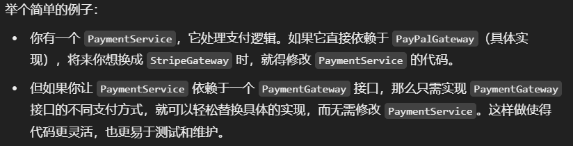{width=80%}
    * 接口引用指向实现类对象（多态）


<!-- #### 对象引用 vs. 对象实例

* 对象引用指向对象实例，块内的对象引用存在栈中，对象实例在堆中
* 一个对象引用可以指向0或1个对象实例，一个对象实例可有n个引用指向他
* 实例相等一般比较的是内存中的内容value；`.equals()`通常比较的是value是否相同
* 引用相等一般比较的是两个引用是否指向同一个对象(指向的内存地址是否相同)；`==`通常比较的是引用是否相同 -->

#### constructor

* 方法名与类名相同
* 不写返回值(也无需void)；一般为public
* 实例化对象时，系统自动调用ctor完成对象的初始化
* 如果未定义ctor，默认提供无参ctor；**如定义了ctor，系统不会提供无参ctor**，如需要，自行显式定义
* 不可被override，可overload

#### 面向对象的三大特性

* **封装Encapsulation**：将对象的属性和方法**组合**在一起，通过访问控制修饰符对外**隐藏**内部实现细节(eg 属性)，只**暴露**必要的接口/方法供外部访问和修改；
  * 一般就是私有化属性->提供public的setter和getter
  * 增强代码的可维护性和安全性，防止外部代码对对象内部状态进行不合理的修改。（可以进行数据验证）
* **继承Inheritance (is-a)**：允许一个类继承另一个类的属性和方法，实现代码的重用。子类可以**扩展**父类的功能(加方法)或**重写**父类的方法
  * 子类拥有父类对象所有的属性和方法（**包括私有属性和私有方法**），但是父类中的私有属性和方法子类是无法访问，只是拥有。(有趣，我有继承权，但你的访问控制依然在控制我)
    * 子类不可继承和重写父类构造器(构造器通常不被视为普通的类方法)
  * **super**代表父类对象的引用，this代表本对象的引用
  * **创建子类对象时，编译器首先默认调用父类无参ctor**(i.e., 编译器会默认自动在子类构造器开头插入`super();`)，倘若父类没有无参ctor，必须在子类中第一句显式使用super指定要调用的父类ctor`super(params list);`
    * 当然你也可以显式使用super指定要调用的ctor
      * 当然你还可以使用super调用父类的属性和方法；
    * 同cpp一样同样是**自内而外**构造(基类/父类->派生类/子类)，从Object ctor-> ... -> Base ctor -> derived ctor
  * 如果子类和父类, 爷类, Object等有同名属性时，按就近原则访问
* **多态Polymorphic**：允许不同类型的对象对同一消息做出不同的响应；override是实现手段，动态绑定是底层原理
  * ==**多态的向上转型upcasting**==：**父类引用指向子类对象**
    * eg `Animal animal = new Dog()`;(编译/声明类型是Animal，运行类型是Dog，java编译器在编译时会根据编译类型来检查哪些方法和属性是可以访问的，即编译时还不知道Dog呢，所以**animal不可以访问Dog的特有成员属性/方法**)
    * animal可以调用父类Animal的所有成员(当然要考虑访问权限)，不可调用子类特有成员，调用子类非特有成员时运行的是**子类的实现**
    * **动态绑定**：在运行时根据对象的运行类型来确定要调用的方法，发生在程序运行期间，而不是在编译时，是实现多态的关键；
      * 原理：当调用对象的方法时，Java虚拟机会查找对象的实际类型。然后在该类的方法表中搜索匹配的方法签名。如果找到匹配的方法，就调用该方法；如果没找到，则继续在父类中查找。
  * 多态的向下转型downcasting：子类引用 = (子类类型) 父类引用
    * eg `Dog dog = (Dog) animal;` **前提**是父类引用animal必须指向子类类型的对象，即`Animal animal = new Dog();`是前提
    * 向下转型后就可以访问子类的特有成员了
  * **多态体现在哪些方面？**
    * 方法重载 / 编译时多态
    * 方法重写 / 运行时多态
    * **接口多态**：多个类可以实现一个接口，你可以使用**接口引用指向实现类的对象**，可以通过**接口引用调用实现类中的方法**（仙人指路：静态代理）
    * **向上转型**：父类引用指向子类对象，使得运行时期可以采用不同的子类实现
    * **向下转型**：父类引用强制类型转换为子类类型

#### 编译时多态 vs. 运行时多态

* 编译时多态也被称为**静态多态**或**早期绑定**。指在**编译阶段**，编译器就能够确定调⽤哪个方法，这是通过方法的**重载**来实现的。
* 运⾏时多态也被称为**动态多态**或**晚期绑定**。指在程序**运行时，根据对象的运行类型来确定调用的⽅法**，这是通过方法的**重写**来实现的。运行时多态主要依赖于对象的实际运行类型，而非声明类型。

#### 接口 vs. 抽象类

> 抽象方法 abstract method: 没有方法体的方法

* 抽象类用于描述类的**共同特性和行为**，主要用于**代码重用**和**为子类提供通用实现**，而接口主要用于**定义行为规范**
  * 当需要共享代码或者提供默认行为时，使用抽象类
  * 当需要定义一组功能或行为规范时，使用接口，尤其是多重继承时
* 不同点：
  * 抽象类使用extends继承，且只能继承一个；接口使用implements实现，且能实现多个接口
  * 抽象类可以**包含抽象方法和非抽象方法**。而接口的方法一般来说都是抽象的，不能有方法体（虽然jdk8之后允许有默认方法体）
  * 抽象类可以有构造函数，接口不可
  * 抽象类的成员变量可以任意类型，而接口成员变量默认是public static final，即常量
* 相同点
  * 都不能被实例化，只能被继承/实现
  * 实现接口的类 和 继承抽象类的子类 都必须提供其中中定义的所有抽象方法的实现

#### 引用拷贝 vs. 浅拷贝 vs. 深拷贝 ☆

浅拷贝和深拷贝的主要区别：如何处理对象内部的引用成员

* 引用拷贝: **不会创建新对象**，仅仅将一个对象的引用赋值给另一变量(栈中)，两个变量指向堆中同一对象；`Persona = new Person();Person b = a`
* 对象拷贝：**创建一个新的对象**，分为shallow copy和deep copy
  * shallow copy: 如果原对象的成员变量是**基本数据类型**，复制一份给克隆对象；如果原对象的成员变量是**引用类型**，则只会复制该引用，两个引用指向同一对象，即**不会复制指引所指向的实际对象本身**。
    * Object类提供了`clone()`方法，默认是浅拷贝（需要重写，方法体: `return super.clone()`）
  * deep copy: 无论是值类型还是引用类型都会完完全全的拷贝一份，在内存中生成一个新的对象，得到一个**独立**的副本
    * 通过**序列化**实现，或手动遍历**为每个引用类型属性创建新的实例**(重写clone())

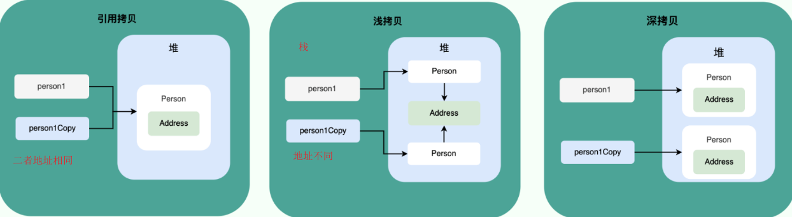

#### 加载顺序

有继承关系时，new一个子类对象加载顺序是怎么样的？

1. 加载父类静态内容 (包括static变量和static代码块)
   1. 实例化对象之前，肯定是要先加载对象的，即static
2. 加载子类静态内容
   1. 因为子类可能依赖父类的静态成员
3. 初始化父类非静态内容 (包括普通变量和普通代码块)
4. 调用父类构造方法（一直递归调用到Object类）
   1. 构造方法常常依赖于普通变量和代码块，所以晚于他俩，确保所有实例都进行了初始设置
5. 初始化子类非静态内容
6. 调用子类构造方法
   1. 构造是从内而外

### Object

Object类的方法：getClass(), hashCode(), equals(), clone(), toString(), finalize()...
其中很多是native method, eg hashCode(), 使用c/cpp实现的方法，可以理解为native method的方法体在JVM中

#### == vs. equals() ☆

* ==是运算符，equals()是方法
* 对于基本类型，==比较的是value
* 对于引用类型，==比较的是对象的内存地址，即判断是否是同一对象
* equals()**不能判断基本数据类型**，只能用于判断两个对象是否相同
* Object中默认的`equals()`就是`==`，但很多类重写了该方法，以判断俩对象的属性是否相同(eg, Integer, String)

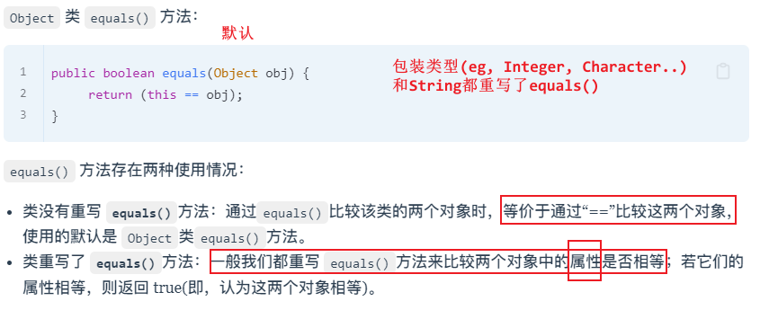  

**注意**：equals()相同只能说明两个对象逻辑上/属性上相同，并不意味着是同一对象，即物理内存上未必相同(`==`用于判断两个引用是否指向同一对象实例，物理上相同)

#### hashCode()

* hashcode()底层：基于对象的**内存地址**生成的整数；重写时我们通常基于对象的**属性值**重写hashCode(), 以确保equals相等的对象具有相同的hash值
  * 同一对象两个引用的hashcode一致
  * 两个引用指向不同对象，hashcode大概率不一致（可能碰撞）

**`hashCode()`和`equals()`都用于比较两个对象是否相等**
hashCode()用于比较两个对象是否相等，比如往HashMap添加对象，首先比较对象的hashCode是否与已加入的对象的hashCode相同，如果**hashcode不同，则一定不相等**。如果相同，继续调用`equals()`检查是否**真的相同**(因为可能**哈希冲突**：即不同对象产生相同的hashCode)；
> hashcode认为不存在则一定不存在，hashcode认为存在则未必存在，所以需要equals兜底

所以，先用hashCode()判断一下是否相等比全部使用equals()要快多咯。

所以进而，我们又攻克了一个问题：
**为什么override equals() 的时候必须同时override hashCode()?**

* 保持一致性：**java规范要求equals()相同的对象必须具备相同的hashCode()**
  * 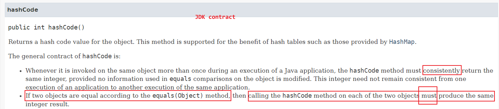
* 保持正确性：比如HashMap，判等时默认先用hashcode再用equals，如果你没重写hashcode，那原本应该相同的元素，可能也被视为不同了，CRUD行为不符预期

#### toString()

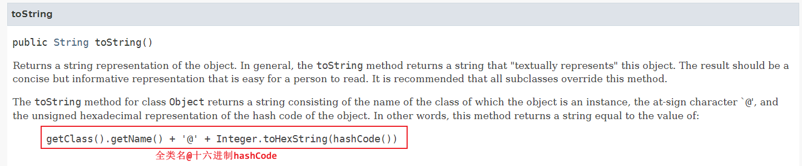

* Wrapper classes, String, StringBuffer, StringBuilder, HashSet, ArrayList......本身或父类重写了toString()，可以直接用，而int[]并没有
* 当我们输出一个object时`sout(obj)`，会自动调用`obj.toString()`方法来获得其字符串；同样，字符串连接操作`"Str" + obj`也会隐式调用`obj.toString()`

### String

#### String vs. StringBuffer vs. StringBuilder ☆

* String不可变，两个SB可变
* **String线程安全(因为不可变)**，StringBuffer对方法加了synchronized，线程安全；StringBuilder线程不安全；
* 性能上：String每次改变都要搞一个新的String对象，然后把指针指向新对象，最慢。两个SB都是对对象本身操作，快一些；然后StringBuilder大概比StringBuffer快`10%-15%`（线程不安全）
* 操作少量数据时使用String，大量数据&单线程用StringBuilder，大量数据&多线程StringBuffer

#### 为何String不可变

```java
public final class String implements java.io.Serializable, Comparable<String>, CharSequence, Constable, ConstantDesc {
    private final byte[] value;
}
```

> jdk9之前是`private final char value[];`
> 改进的原因：java9中char[]改为byte[]（char 2B，byte 1B），目的是节省空间，很多字符使用1B就够了(ASCII)。它会自动检测字符的范围，来选择使用单/双字节编码（通过coder变量）；新版String支持两个编码方案：Latin-1和UTF-16

**经典错误**：因为String中使用final修饰字符数组，所以String不可变； (x)
final修饰只能说明value这个引用类型的变量不可以指向另一个数组对象，但数组内容是可以变化的，即value指向的堆内存的内容可以变，那可不就是修改了String嘛。

标准答案：

1. String的`char[]/byte[]`用final修饰，保证了不可指向另一String
2. 数组是**private**，且**String没有提供/暴露修改该字符串的方法**，保证了数组内容无法修改
3. **String类也被final修饰**，故而不能被继承，避免了子类破坏String不可变

> 如果String类可以被继承，子类可能会重写String的方法，potentially破坏其不可变性。例如，子类可能重写concat方法，使其直接修改内部字符数组，而不是创建新的String对象(妙的)

#### 字符串拼接 + vs. StringBuilder

* 首先，java不支持运算符重载(不让程序员)，但却特意为`String`类内置了两个重载，`+`和`+=`用于字符串拼接
  * 所以StringBuilder是不支持`+`的，用append
* String的+对应的操作是：`new StringBuilder().append().toString()` (toString()中会new并返回一个String对象)；
* > 如果在循环中使用`+`，那么每次都会`new StringBuilder`，它不会聪明到复用一个SB，每次new是很累的。而如果我们主动new一个StringBuilder，就不存在这个问题了。
* > JDK9之后，你可以放心使用`+`进行字符串拼接了，字符串相加+改为了用动态方法`makeConcatWithConstants()`来实现，而不是产生大量的临时对象
* >回头刷题试一试，是否意味着String也挺好用？

#### 运行时常量池 字符串常量池 StringTable

* **常量池**: 就是一张存在字节码.class文件中的表格，虚拟机指令根据这张常量表找到要执行的类名、方法名、参数类型、字面量等信息
  * 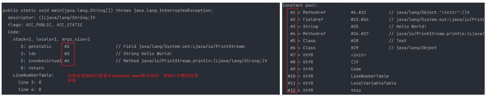  
* **字符串常量池**: jvm为了优化String类(性能&内存)专门开辟的一块区域，主要是为了避免字符串的重复创建。
  <!-- * HotSpot虚拟机的字符串常量池的实现是stringTable.cpp, 可简单理解为一个固定大小的HashTable，保存的是字符串(key)和字符串对象的引用(value属性)之间的映射，value引用指向堆中的字符串对象。 -->
  * ==jdk1.7之前**字符串常量池和静态变量**在方法区/永久代中，jdk1.7之后都移到了**堆**中==
    * 主要是因为永久代的GC回收效率太低，只有在Full GC时才会被执行GC；堆中回收效率更高
    * 虽然说现在串池在堆中，但和new的String的堆所处的并不是一个空间，所以判等时肯定不等咯
<!-- * StringTable是字符串常量池在JVM中的实现，本质是哈希表 -->

#### String判等 `=` vs. `new`

**首先区分一下`String s1 = "hello";` 和 `String s2 = new String("hello");`：**

* 首先`s1`和`s2`都在栈中（虚拟机栈
* `String s1 = "abc";`：首先检查字符串常量池有无该字符串对象，如有，s1直接指向；如无则在常量池中创建，s1再指向；即s1指向的是常量池的某一地址
* `String s2 = new String("hello");`：首先new一定会在堆中创建一个String对象(**里面有个value属性引用一个字符数组**)，s2指向该对象，然后==也去判断常量池有无该字符串对象==，如有，==value指向常量池中该对象==；如无则在常量池创建，然后value指向。即s2指向的一定是堆中某一地址
  * 故而new的方式创建了几个String对象呢？
  * 答：1或2。堆中肯定有一个String(注意这个String的value一定是指向常量池中的字符串常量)，然后字符串常量池中如果之前有一个，则不再创建直接引用；如无，则创建一个。
**推荐使用第一种方式创建String**

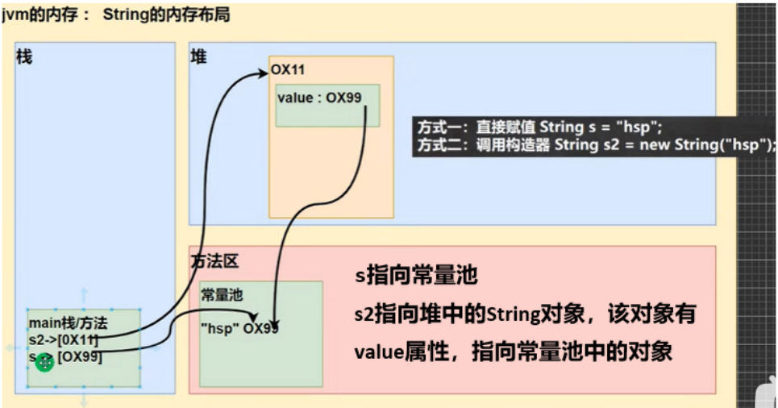{width=70%}
> 1.7之后常量池从方法区移动到了堆

```java
// new vs =
String str1 = "hello";
String str2 = new String("hello");
String str3 = "hello";
String str4 = new String("hello");
// str1!=str2; str1==str3; str2!=str4;
// equals都相同
```

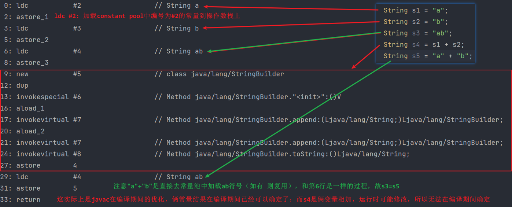  
s4 != s3: s4=s1+s2的底层是new StringBuilder().append("a").append("b").toString() -> new String("ab");故而s3在常量池中，s4在堆中
s5 = s3: s5="a"+"b"会在**编译期间优化**为"ab"了（编译期间已确定，编译器直接去常量池加载"ab"

==i.e., 字符串常量拼接原理是**编译期优化**，字符串变量拼接原理是**StringBuilder**==

#### String#intern

jdk7: intern()方法：

* 当调用一个字符串对象的 intern() 方法时，Java会检查该字符串是否已经在字符串池中。
* **如果字符串池中已经存在一个相同内容的字符串，则返回池中的这个字符串的引用**
* 如果字符串池中不存在这个字符串，则将其添加到字符串池中，并返回该字符串的引用

```java
// 简单理解
String s1 = new String("hello");
String s2 = "hello";
// Before interning
System.out.println(s1 == s2); // 输出 false，两个字符串对象不同
// Interning s1
s1 = s1.intern();
// After interning
System.out.println(s1 == s2); // 输出 true，两个字符串对象现在是相同的引用
```

优点

* 减少内存使用
* 提高**比较效率**：直接比较对象的引用，肯定比你搁那equals()逐字符比较要快咯

---

String.intern()是一个native方法，是将指定的字符串对象的引用**尝试**保存在字符串常量池中：

* jdk1.8: 将字符串对象尝试放入串池，如有则不放入，如无则放入串池，**并返回串池中的对象**(返回引用)
  * 注意==是把这个new的在堆中的String放到字符串常量池中...==（不是特别清楚
* jdk1.6: 将字符串对象尝试放入串池，如有则不放入，**==如无将该对象复制一份==**，放入串池，**并返回串池中的对象**

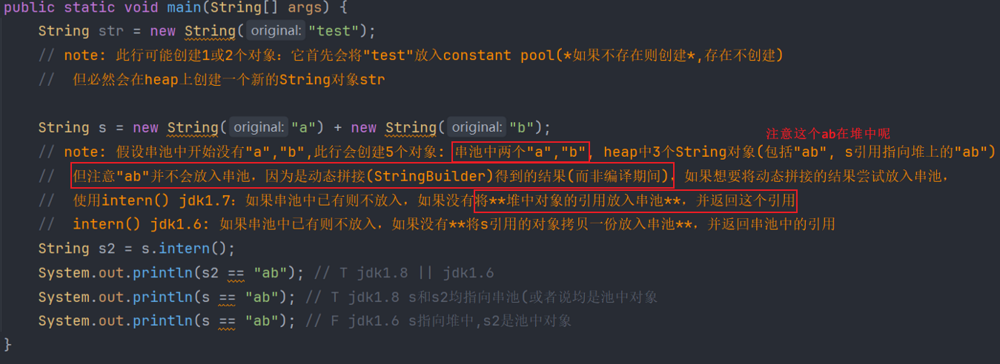  

### Exception

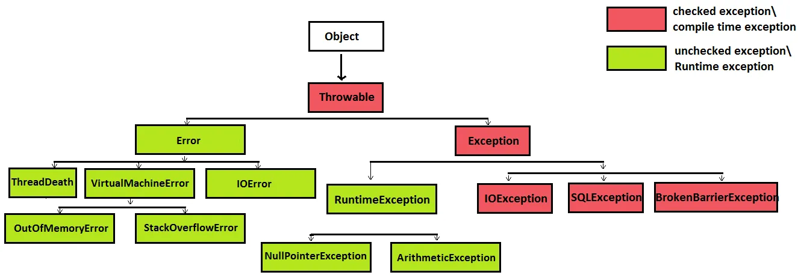  

Exception vs. Error

* Error: 运行期间的严重问题，致命错误，程序**直接崩溃**，通常和jvm相关。比如`OOM`, `StackOverflowError`。不要去捕获或处理Error，安全挂掉就行...
* Exception: 程序本身可以处理的异常，可以通过catch捕获。分为编译时异常 / checked exception 和 运行时异常 / runtime exception
  * **编译时异常是在编译阶段必须处理的异常**，通常由外部因素导致，如文件未找到，输入输出异常`IOException`。使用try-catch捕获或在方法签名中声明抛出throws，如果**没处理无法通过编译** -> `unhandled exception`
  * **运行时异常是指运行期间可能发生的异常**，编译器检查不出来，一般是编程时的逻辑错误，如数组越界`ArrayIndexOutofBoundsException`、空指针异常`NullPointerException`，算术运算异常`ArithmeticException`；可以捕获也可以不捕获，尽量避免即可。

> 捕获了异常之后程序就不会自动挂掉，你还可以接着用。这样子我们的项目就不会因为一个小错误挂掉了

异常处理的两种方式：

* try-catch-finally: **自行处理**
  * try block: 捕获异常，后面可以跟0或多个catch block，如果没有catch block必须跟一个finally block
  * catch block: 处理try捕获到的异常（异常被封装成Exception对象e，传递给catch
    * 可以有多个catch blok，捕获不同的异常；要求子类异常在前，父类在后（河狸
  * finally block: **一定**会执行，无论是否有异常发生，**或者在try中遇到`return`语句**(~~招银面试答错了~~)，通常搁这儿释放资源
    * 在try-block return之前会执行finally-block再执行try-block中的return语句（如果finally-block中有return语句，那就会直接执行这个return，覆盖掉try-block或者catch-block中的return：[reference](https://javabetter.cn/sidebar/sanfene/javase.html#_41-%E4%B8%89%E9%81%93%E7%BB%8F%E5%85%B8%E5%BC%82%E5%B8%B8%E5%A4%84%E7%90%86%E4%BB%A3%E7%A0%81%E9%A2%98)
  * > try-with-resources (jdk7) 可以自动关闭打开的资源
* throws: 抛出异常，交给调用者处理，**最顶级的处理者是JVM**，但JVM的处理方式很暴力：**直接输出并退出**
  * 可以抛出具体的异常（推荐）也可以抛出其父类

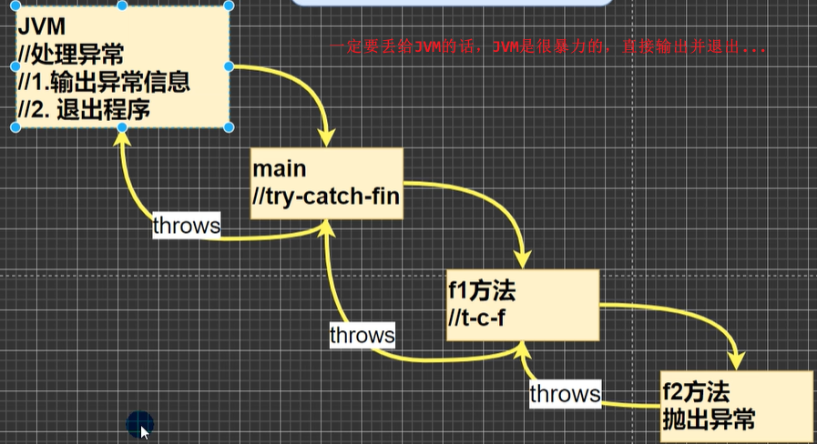{width=50%}

### I/O

首先java io流的划分：

* 按照数据流向划分：输入流InputStream（从文件、网络、控制台等读取到程序），输出流OutputStream
* 按处理数据的单位划分：字节流ByteStream（图像、音频），字符流CharacterStream（文本）

#### Java IO模型

> 请先挪步：`os_essence.md`查看[linux的IO模型](https://github.com/haooxia/CSJourney/blob/main/os/os_essence.md#linux-5%E7%A7%8Dio%E6%A8%A1%E5%9E%8B-)

* **BIO** (Blocking I/O) / **传统**IO：基于阻塞式IO模型，线程在执行I/O操作时被阻塞，无法处理其他任务，适用于连接数较少的场景，因为**每个连接占用一个线程**。
  * 基于字节流`FileInputStream`，字符流`BufferedReader`进行文件读写，基于`ServerSocket`(服务端：等价于linux`socket()+bind()+isten()`)和`Socket`(客户端：等价于linux`socket()+connect()`)进行网络通信
* **NIO** (**New** I/O 或 **Non-blocking** I/O)：基于非阻塞IO模型，线程在等待IO时不会阻塞，可执行其他任务，通过**Selector**监控多个**Channel**上的事件，适用于连接数多但连接时间短的场景。
  * Selector会不断轮询已注册的Channel，检查是否有就绪事件发生（也即epoll不断轮询红黑树上的fd，检查是否有就绪事件发生，有则组织成链表返回）
  * Selector在linux中底层是epoll，windows中是select
* **AIO**（Asynchronous I/O）：使用异步IO模型，线程发起I/O请求后立即返回，当IO操作完成时通过**回调函数**通知线程，适用于连接数多且连接时间长的场景

### 泛型

* 泛型(generics)允许**类、接口和方法**在定义时使用一个或多个**类型参数**，这些类型参数在使用时可以被指定为具体的类型。
* 作用
  * 类型安全，**在编译时进行类型检查**，从而**减少运行时由于类型不匹配引发的异常**；例如，使用泛型可以确保集合中只存储特定类型的对象，避免了因类型错误而导致的**运行时异常**`ClassCastException`
  * 多种数据类型执行相同的代码时可以**复用代码**，比如int加法，float加法，你当然可以重载，但那不就多份代码了。
* 注意：
  * 泛型只能指定为引用数据类型，不可是基本数据类型
  * 指定泛型为具体类型后，可以传入子类类型（多态嘛

### 注解

注解 annotation: 用于修饰包、类、方法、属性、构造器、局部变量等信息。

注解本质上是一个继承了`Annotation`接口的**接口**，实现类是Java**运行时生成的动态代理类**。

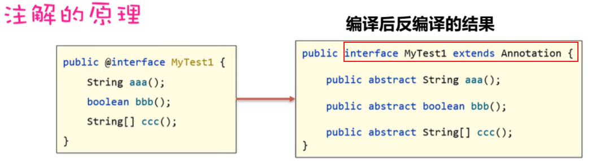  

**元注解**：修饰注解的注解，java给了4个meta-annotation

* `@Target`: 说明注解的使用范围/**==作用域==**
  * `类，接口：TYPE, 成员变量：FIELD, 成员方法：METHOD, 方法参数：PARAMETER...`
* `@Retention`: 说明需要在什么级别保留该注解信息，声明注解的**保留周期/==生命周期==**
  * `SOURCE`: 只作用在源码.java阶段，字节码.class文件中不存在，给编译器用的，比如`@Override`
  * `CLASS(default)`: 保留到字节码阶段，运行阶段不存在
  * `RUNTIME(常用)`: 一直保留到运行阶段，可以**通过反射获取注解信息**，比如`@Autowired`
* `@Document`: 注解将被包含在javadoc中
* `@Inherited`: 说明子类可以继承父类中的该注解

### 反射

Java反射机制(reflection)是在运行状态中，对于任意一个类，都**能够知道这个类中的所有属性和方法**，对于任意一个对象，都**能够调用这个对象的任意一个方法和属性**；这种动态获取的信息以及动态调用对象方法的功能称之为反射机制。

特性：

* **运行时类信息访问**：反射机制允许程序在运行时获取类的**完整结构信息**，包括**类名、包名、父类、构造器、成员变量、成员方法、注解**等。
  * 类名包名: `class.getName()`
  * 父类: `class.getSuperClass()`
  * 构造器: `ctor = class.getConstructor(...)`, 然后可以通过`ctor.newInstance()`创建对象
  * 成员变量: `field = class.getField(...)`, 然后可以做取值`get`和赋值`set`操作，注意需要通过`setAccessible(true)`打开**暴力反射**
  * 成员方法: `method = class.getMethod(...)`, 然后可以执行该方法`method.invoke(...)`，也需要打开暴力反射
  * 注解: `annotations = class.getAnnotations(...)`
* **动态对象创建**：可以使用反射api动态地创建对象实例，即使在编译时不知道具体的类名。
  * 通过Class类的newInstance()方法或Constructor对象的**newInstance()** 实现的。
* **动态方法调用**：可以在运行时动态地调用对象的方法，**包括私有方法**。
  * 这通过Method类的**invoke()** 实现，允许你传入对象实例和参数值来执行方法。
* **访问和修改字段值**：反射还允许程序在运行时访问和修改对象的字段值，即使是私有的。这是通过Field类的**get()和set()** 方法完成的。

#### 获取Class对象

三种方式：

1. 已知具体类的话，通过类的class静态属性获取即可: `Class c1 = Person.class;`
   1. `int.class, Integer.class, ArrayList.class, int[].class`
2. 已知类的实例，通过getClass()可获取：`Class c2 = person.getClass();`
3. 已知全类名，通过Class的static方法 forName()获取：`Class c2 = Class.forName("com.example.Person");`
4. 内置数据类型直接通过

#### 反射的原理

我们知道：Java编译后生成.class字节码文件，然后JVM解释并执行字节码文件。当JVM进行类加载时，会加载字节码文件，将类型相关的所有信息加载进方法区，反射就是去获取这些信息，然后就可以执行各种操作。

#### 反射的应用

1. 加载数据库驱动
2. mybatis-plus中我的总结（参考onenote

[暂略](https://xiaolincoding.com/interview/java.html#%E4%BB%80%E4%B9%88%E6%98%AF%E5%8F%8D%E5%B0%84)

#### java创建对象的方式

1. 使用**new关键字直接**调用构造函数: `Person p = new Person()`;
2. 使用反射
   1. **使用Class类的newInstance()**，调用无参ctor
      1. `Person p = (Person) Person.class.newInstance();`
   2. **使用Constructor类的newInstance()**，调用指定ctor，不限于无参cotr
      1. `Constructor<Person> ctor = Person.class.getConstructor(String.class); Person p = ctor.newInstance("xh");`
3. **使用clone()**，前提是类实现了Cloneable接口
   1. `Person p = new Person(); Person p2 = (Person) p1.clone()`
4. **使用反序列化**：通过将对象序列化到文件或流中，然后再反序列化来创建对象

<!-- ### API vs. SPI

* API(Application Programming Interface)是应用程序编程接口,定义了一组可以被应用程序开发者直接使用的类、方法和接口。
* SPI(Service Provider Interface)是服务提供者接口,定义了一组接口规范,用于第三方开发者扩展和实现特定功能。
* 设计思想：API是由**实现方制定接口并完成实现**,调用方直接使用。SPI是由**调用方制定接口规范**,**实现方根据规范提供具体实现**,**调用方可以选择不同的实现**
* 加载方式：API在编译时或运行时直接调用，**SPI一般在运行时动态加载和发现具体实现**（ok，很框架了）
* 应用：API常见于各种库和框架提供的公共接口，SPI常见于**JDBC驱动**、日志框架、Dubbo扩展点等插件化场景

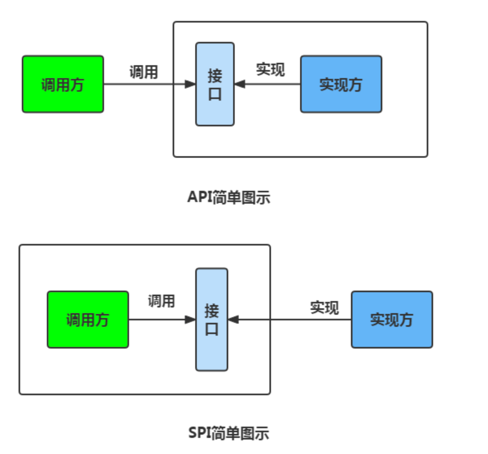{width=70%} -->

### 序列化与反序列化

* 序列化serialization: 将数据结构(struct in cpp)或==对象==(object in java/cpp) -> 二进制字节流
* 反序列化deserialization: 反过来
* 应用场景
  * 对象在进行网络传输（比如远程方法调用 RPC 的时候）之前需要先被序列化，接收到序列化的对象之后需要再进行反序列化；（因为**网络传输只能传输字节流嘛**
  * 将对象存储到文件之前需要进行序列化，将对象从文件中读取出来需要进行反序列化；（因为文件只能存字节流嘛
  * 将对象存储到数据库（如 Redis）之前需要用到序列化，将对象从缓存数据库中读取出来需要反序列化；（同上
* **transient修饰的变量不会被序列化**，在对象序列化时被忽略
  * transient不可修饰class和method，只可修饰variable
  * 此外，static变量不属于任何Object，故对象在序列化跟static变量没鸟关系
* 常见的序列化协议：Kryo, Hessian, Protobuf, ProtoStuff

<!-- 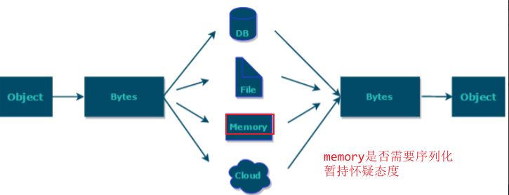   -->
