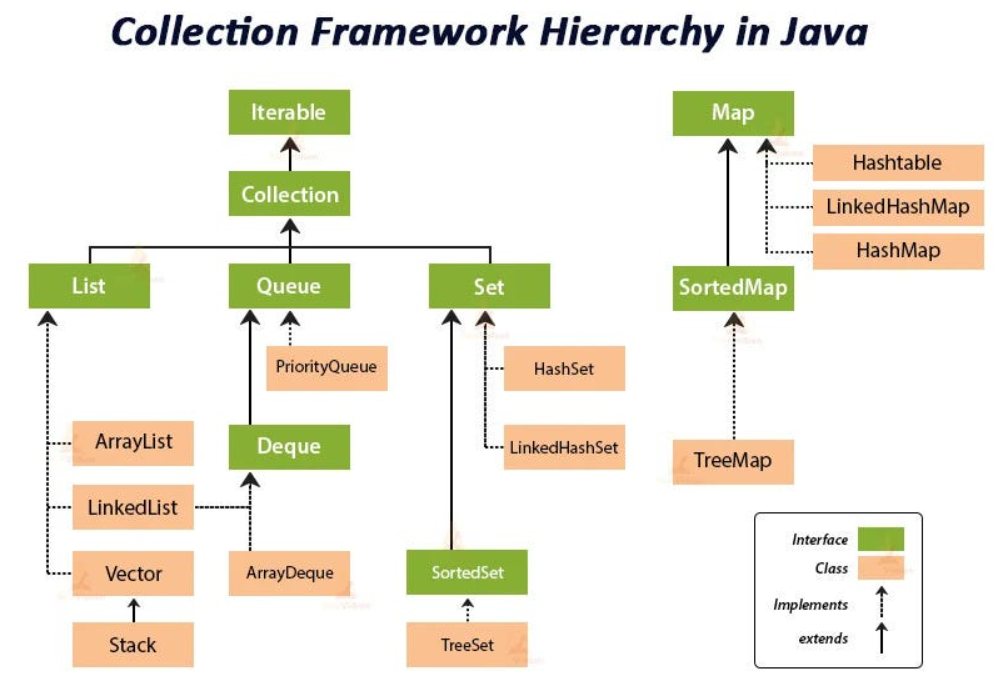
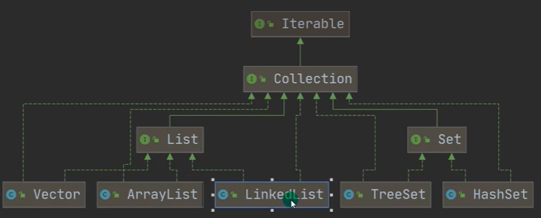

# collection

  



  

## general interface

### Iterable Interface

methods

* .iterator()
  * 返回迭代器Iterator, 似乎指向容器首元素之前（或者是首元素，存疑）
  * Iterator中有hasNext(), next()
    * next(): 移动至下一元素 & 将该元素返回
* forEach()

```java
Iterator iterator = ls.iterator();
while (iterator.hasNext()) 
sout(iterator.next()); // .next()会自动将iterator后移
```

### Collection Interface

* collection接口可以存放多个object元素
* 有很多collection的实现类，比如Vector, HashSet等（通过Set和List间接实现）
* 接口可不能实例化

methods (为什么没有forEach()，不是一般都会重写上面的所有method吗)

* .size()
* .isEmpty()
* .iterator()
* .contains()
* .add()
* .remove()
* .clear()
* .equals()

## List Interface

List和Set分别是两个interface

* List的实现类(如Vector, ArrayList...)中元素存储顺序和添加顺序一致、可重复
* List支持(顺序)索引: .get()

methods (定义了Collection,Iterable的方法(未必都重写了，可能只定义而无需改变))

* get(idx)
* getFirst(), getLast()
* indexOf()
* set(idx, element)
* subList(start, end)
* sort()

List的三种遍历方式（即List的所有实现子类均可用: e.g.,Vector, LinkedList...）：

```java
public static void main(String[] args) {
    ArrayList arrayList = new ArrayList();
    arrayList.add("aa");
    arrayList.add("bb");
    // 遍历的三种方式
    for (int i=0; i<arrayList.size(); ++i)
        System.out.println(arrayList.get(i)); // Object -> int

    for (Iterator iter=arrayList.iterator(); iter.hasNext();)
        System.out.println(iter.next());

    // for-range: based on the iterator
    for (Object obj : arrayList)
        System.out.println(obj);
}
```

### ArrayList Class

```java
import java.util.ArrayList;
ArrayList<E> objectName = new ArrayList<>(); // 初始化
// E是泛型数据类型，用于设置对象的数据类型
ArrayList<String> strList = new ArrayList<>();
```

precautions:

* 如果不指定`E`，默认是Object（当然也可以显式指定为Object类型），此时允许放入不同类型的数据
* 如果指定了E的类型，比如String，就只能放String了（存疑，大概是没错的，可以放null）
* null比较特殊，啥类型时都可以放（不知为啥）
* ArrayList是线程不安全的（无synchronized）

底层分析：

* ArrayList的本质是Object[] elementData;
* 如果使用无参ctor实例化ArrayList，elementData容量为0。第一次add时，扩容elementData为10，再次扩容按照1.5翻倍（即添加50%）
  * 扩容底层采用`Arrays.copyOf(elementData, newCapacity);`
* 如果使用指定大小n的ctor实例化，容量开始为n，然后直接按照1.5倍扩容

> `tranisent`修饰词表示该属性不会被序列化

```java
private static final Object[] DEFAULTCAPACITY_EMPTY_ELEMENTDATA = {};
public ArrayList() {
    this.elementData = DEFAULTCAPACITY_EMPTY_ELEMENTDATA;
}
```