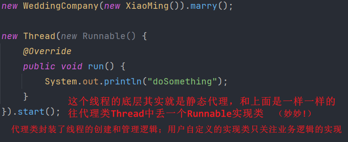
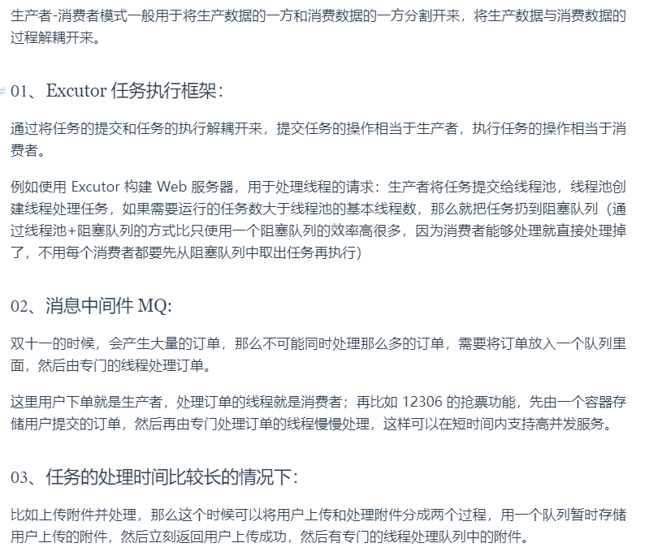
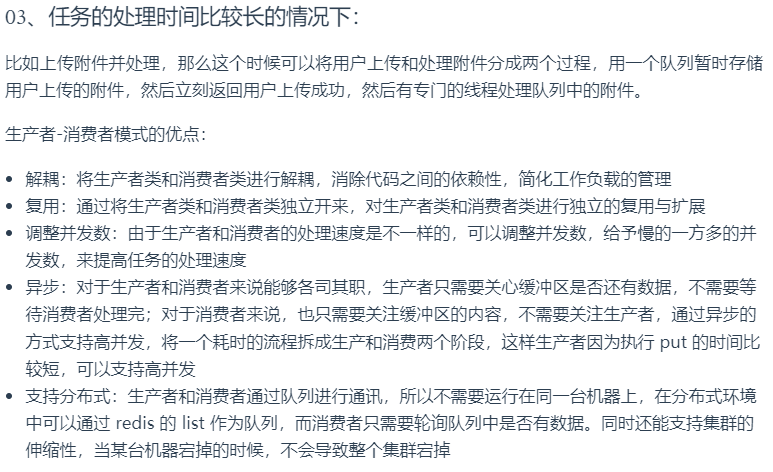
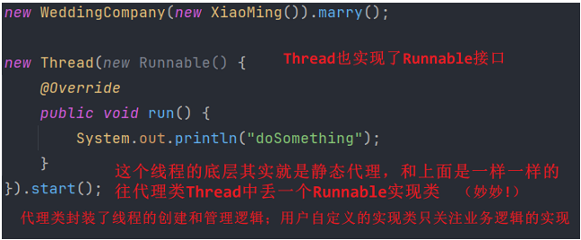

# some common/important code in Java

- [some common/important code in Java](#some-commonimportant-code-in-java)
  - [创建线程](#创建线程)
    - [继承Thread类](#继承thread类)
    - [实现Runnable接口](#实现runnable接口)
    - [实现Callable泛型接口](#实现callable泛型接口)
    - [线程池](#线程池)
      - [Executors.FixedThreadPool](#executorsfixedthreadpool)
      - [ThreadPoolExecutor](#threadpoolexecutor)
    - [按序执行三个线程](#按序执行三个线程)
    - [基于atomicLong设计高并发的计数器](#基于atomiclong设计高并发的计数器)
  - [排序算法](#排序算法)
  - [生产者消费者问题](#生产者消费者问题)
    - [实现](#实现)
    - [应用场景](#应用场景)
  - [单例模式](#单例模式)
    - [饿汉式](#饿汉式)
    - [懒汉式](#懒汉式)
      - [线程不安全](#线程不安全)
      - [双重校验锁模式 (线程安全) DCL](#双重校验锁模式-线程安全-dcl)
  - [代理模式](#代理模式)
    - [静态代理](#静态代理)
    - [动态代理](#动态代理)


TODO: plz read this and sum up: [link](https://www.nowcoder.com/discuss/650808006875127808?sourceSSR=dynamic)


## 创建线程

* **继承Thread类、实现Runnable接口、实现Callable接口、使用线程池、使用CompletableFuture等**都可以创建线程

### 继承Thread类

最直接的一种方式，用户自定义类继承java.lang.Thread类，**重写run**()方法，run()方法中定义了线程执行的具体任务。创建该类的实例后，通过**调用start**()方法启动线程。

* 优点：直接继承Thread类，简单
* 缺点：
  * java不支持多继承，继承Thread类后，不能再继承其他的父类，灵活性较差
  * **线程任务和控制逻辑耦合**，代码复用性较差

```java
public class MyThread extends Thread{
    @Override
    public void run() {
        System.out.println("Running thread: " + Thread.currentThread().getName());
    }

    public static void main(String[] args) {
        MyThread t1 = new MyThread();
        MyThread t2 = new MyThread();
        t1.start();
        t2.start();
    }
}
```

### 实现Runnable接口

实现Runnable接口需要**重写run**()方法，然后**将此Runnable对象作为参数传递给Thread类的构造器**，**创建Thread对象**后调用其start()方法启动线程。

* 优点：可避免单继承的局限性，java支持接口的多实现
* **线程任务和控制逻辑分离**，便于复用和扩展

```java
public class MyRunnable implements Runnable {
    @Override
    public void run() {
        System.out.println("Running Thread: " + Thread.currentThread().getName());
    }

    public static void main(String[] args) {
        // 仅需创建一个MyRunnable对象
        MyRunnable mr = new MyRunnable();
        Thread t1 = new Thread(mr);
        Thread t2 = new Thread(mr);
        t1.start();
        t2.start();
    }
}
```

---

* 底层是静态代理模式：即通过Thread类来代理Runnable的实现来执行操作；
  * 可重用性：显著的优点是同一个Runnable对象可以被多个线程共享。这样，多个线程可以同时执行相同的业务逻辑，而不需要为每个线程创建新的资源实例（一份资源、多个代理）
  * 
    * 详见onenote: Static Proxy

### 实现Callable泛型接口

* 优点：可以返回结果，可以抛出异常，适合需要任务结果的场景
* 缺点：相比于Runnable接口，使用复杂度更高，需要额外的工具类（如FutureTask）来管理。

> Callable依赖FutureTask类来获取返回结果

```java
import java.util.concurrent.*;

// Callable是一个泛型接口，指定call()返回类型为String
public class MyCallable implements Callable<String> {
    @Override
    public String call() throws Exception{
        System.out.println("Running Thread: " + Thread.currentThread().getName());
        return "OK";
    }
    public static void main(String[] args) throws ExecutionException, InterruptedException {
        MyCallable mc = new MyCallable();
        // 将Callable对象封装在FutureTask中，可以在多线程环境下执行任务，并获取任务执行结果
        FutureTask<String> ft = new FutureTask<>(mc);
        Thread t1 = new Thread(ft);
//        Thread t2 = new Thread(ft);
        t1.start();
        String result = ft.get(); // 阻塞获取结果(即同步等待call()执行完毕
        System.out.println(result);
    }
}
```

### 线程池

#### Executors.FixedThreadPool

* 实现方法：
  * 使用Executors类创建线程池：eg `FixedThreadPool`, `CachedThreadPool`, `SingleThreadExecutor`
  * 使用`execute()`或`submit()`方法提交`Runnable()`或`Callable()`任务给线程池
    * 区别见`JUC.md`
  * 使用`shutdown()`或`shutdownnow()`关闭线程池
    * 区别见`JUC.md`

```java
import java.util.concurrent.*;

public class MyExecutors implements Runnable{
    @Override
    public void run() {
        System.out.println("Running Thread: " + Thread.currentThread().getName());
    }
    public static void main(String[] args) {
        // 创建线程池，获取ExecutorService实例
        ExecutorService threadPool = Executors.newFixedThreadPool(3);
        // 向线程池提交任务
        for (int i=0; i<10; ++i) { // 整十个吧
            threadPool.execute(new MyExecutors());
        }
        // 等待线程都执行那个完毕后关闭线程池
        threadPool.shutdown();
    }
}
```

#### ThreadPoolExecutor

```java
import java.util.concurrent.*;

public class MyThreadPoolExecutor{
    // 创建了一个线程池，最大线程数为5，核心线程数为2，空闲线程存活时间为10秒
    // 任务队列容量为3。然后向线程池提交了5个任务，每个任务打印当前线程的名称和"ok"。最后关闭线程池。
    public static void main(String[] args) {
        ThreadPoolExecutor threadPool = new ThreadPoolExecutor(
                2,                           // 核心线程数 corePoolSize
                5,                                      // 最大线程数 maximumPoolSize
                10,                                      // 空闲线程存活时间 keepAliveTime
                TimeUnit.SECONDS,                       // 时间单位 unit
                new LinkedBlockingQueue<>(3),   // 阻塞队列的容量 workQueue
                Executors.defaultThreadFactory(),       // 默认线程工厂 (可忽略) threadFactory
                new ThreadPoolExecutor.AbortPolicy()    // 默认拒绝策略 (可忽略) handler
                );
        for (int i=0; i<8; ++i) {
            threadPool.execute(() -> {
                // 这里采用lambda表达式来传入一个Runnable实现类的对象
                System.out.println("Running Thread: " + Thread.currentThread().getName());
            });
        }
        threadPool.shutdown();
    }
}
```

### 按序执行三个线程

```java
// TODO: 新建T1、T2、T3三个线程，并保证它们按顺序执行
public class JoinTest {
    public static void main(String[] args) {
        Thread t1 = new Thread(() -> {
            System.out.println("Thread-1");
        });
        Thread t2 = new Thread(() -> {
            try {
                t1.join(); // 当一个线程调用另一个线程的join()方法时，调用线程将被挂起，直到目标线程结束
            } catch (InterruptedException e) {
                throw new RuntimeException(e);
            }
            System.out.println("Thread-2");
        });
        Thread t3 = new Thread(() -> {
            try {
                t2.join();
            } catch (InterruptedException e) {
                throw new RuntimeException(e);
            }
            System.out.println("Thread-3");
        });

        t1.start();
        t2.start();
        t3.start();
    }
}
```

### 基于atomicLong设计高并发的计数器

## 排序算法

please read `algo\dataStructure.md`

## 生产者消费者问题

### 实现

> * bg: 经典的多线程并发协作模式，一个生产者线程用于生产数据，一个消费者线程用于消费数据，**为了解耦二者的关系**，通常采用一个共享的数据区域；ie 生产者生产数据后直接放到共享数据区，无需关心消费者的行为；消费者只需从共享数据区拿数据，无需关注生产者行为。（好一个解耦
> * 其中同步互斥关系：生产者之间互斥，消费者之间也互斥；生产者和消费者之间**互斥且同步**

**逻辑等待->业务->通知**

* 基于`synchronized + wait() + notify()`实现
  * wait()和notify()调用之前，**要求线程必须获得该对象的监视器锁，即只能在同步方法或方法块中调用二者**（wait执行完毕 当前线程会释放锁
  * notify()会从WAITTING状态的线程中挑选一个进行通知，使其从等待队列切换到同步队列，**然后还要等待获取对象的监视器锁**之后才可以执行；notifyall()会唤醒所有等待线程（包括生产者类和消费者类）
  * 缺陷：==无法实现精确唤醒，只能同时唤醒两类==
* 基于`Lock + Condition (await() & signal())`实现
  * **可以精确地唤醒一类线程**（可实现仅唤醒消费者类线程或生产者类线程）
    * 就是依赖多个condition
* 基于阻塞队列`BlockingQueue`实现
  * 无脑调用take()和put()即可，底层已经实现了互斥同步机制，它的底层思路就是`Lock + Condition`实现的，和我写的差不多...

### 应用场景

  
  

## 单例模式

### 饿汉式

```java
// note: 饿汉式单例模式
public class Hungry {
    // 1.私有化构造器 防止直接new
    private Hungry(){};
    // 2.私有化静态实例
    private final static Hungry hungry = new Hungry();
    // 3.暴露公共的静态方法返回实例
    public static Hungry getInstance() {
        return hungry;
    }
}
```

### 懒汉式

#### 线程不安全

```java
// note: 懒汉式单例模式(单线程有效 多线程出错)
public class LazyMan {
    // 将构造器私有化 防止直接new
    private LazyMan(){};
    // 创建一个私有的静态实例(不初始化)
    private static LazyMan lazyMan;
    // 提供一个公共的静态方法返回实例
    public static LazyMan getInstance() {
        if (lazyMan == null) { // note: 多个线程同时访问这个方法时，可能会创建多个实例
            lazyMan = new LazyMan();
        }
        return lazyMan;
    }
}
```

#### 双重校验锁模式 (线程安全) DCL

```java

// note: 懒汉式单例模式(多线程有效)
// note: 双重检测锁模式的懒汉式单例 / Double-Checked Locking (DCL懒汉式单例)
public class LazyMan2 {
    // 将构造器私有化 防止直接new
    private LazyMan2(){} // 这里没分号
    // 创建一个私有的静态实例(不初始化)
    private static volatile LazyMan2 lazyMan; // note 请注意添加volatile关键字，禁止指令重排
    // 提供一个公共的静态方法返回实例
    public static LazyMan2 getInstance() {
        // 在第一次检查是否为null时不加锁，只有在需要创建实例时才加锁，减少开销
        if (lazyMan == null) {
            synchronized (LazyMan2.class) {
                if (lazyMan == null) { 
                    // 两个if我还没搞懂；简单来说一些线程同时通过了第一个if，然后一个A拿到锁，其他卡在这儿，
                    // 回头A new完之后释放锁，如果没有if的话，其他线程也跑进去new，那还得了
                    lazyMan = new LazyMan2();
                }
            }
        }
        return lazyMan;
    }
}
```

Q: 为什么要用volatile修饰变量？

1. **保证可见性**。当一个线程在getInstance中new了一个LazyMan2的实例后，其他线程在访问lazyMan变量时会立马看到这个更新，而非是一个未初始化的值。
2. 禁止指令重排。
   1. `lazyMan = new LazyMan2();`这一行代码其实底层有三步：
      1. 为lazyMan分配内存空间
      2. 调用构造方法初始化对象lazyMan
      3. 将lazyMan指向分配的内存空间
   2. 故而可能发生指令重排，如果排序为132就废废了，132的话先分配了内存，其他线程检测到不为null直接返回了，殊不知此时2没执行（还没构造对象嘞...

## 代理模式

> 通过代理对象帮真实/目标对象增强点功能，帮他干点活，让真实对象专注自己的核心功能

### 静态代理

* 静态代理是指在**运行之前，代理类字节码.class已编译好**，即编译时已经确定代理类，故而静态；
* 而且通过一个静态代理类也只能代理一个目标类，代理类和目标类需要实现相同的interface
* 本质是：接口多态，接口类型的引用指向实现类的对象，以及接口引用调用实现类中的方法，然后在方法around增强功能，eg 日志, 权限校验 etc
  * 在代理类中定一个**接口引用的成员变量**
* 缺陷：程序员需要手动**为每一个目标类编写对应的代理类**，工作量太大，繁琐

```java
// 示例1
interface Marry {
    void marry();
}

// 真实对象
class XiaoMing implements Marry {
    @Override
    public void marry() {
        System.out.println("小明去结婚.");
    }
}

// 代理角色：婚庆公司
class Company implements Marry {
    // 要在代理类中调用目标类的方法，所以需要传入一个目标对象，然后用一个接口引用指向即可
    private Marry target;
    public Company(Marry target) {
        this.target = target;
    }
    @Override
    public void marry() {
        before();
        this.target.marry();
        after();
    }
    // 增强行为
    private void before() {
        System.out.println("结婚之前，布置现场");
    }
    private void after() {
        System.out.println("结婚之后，收尾款");
    }
}

public class StaticProxy {
    public static void main(String[] args) {
        // note: 之所以可以把真是对象传递给代理对象，是因为Company构造函数接受一个Marry类型的参数，你可以传递任何实现了Marry接口的对象
        //  本质上是接口多态：接口类型的引用指向实现类的对象，以及接口引用调用实现类中的方法
        XiaoMing xm = new XiaoMing();
        Company company = new Company(xm);
        // 接口引用调用实现类的方法
        company.marry();
    }
}
```

```java
// 示例2
interface IUserDao {
    public void save();
}

class UserDao implements IUserDao {
    @Override
    public void save() {
        System.out.println("保存数据...");
    }
}

// 代理对象
class UserDaoProxy implements IUserDao {
    private IUserDao target; // note 定义一个接口引用的成员变量

    public UserDaoProxy(IUserDao target) {
        this.target = target;
    }

    @Override
    public void save() {
        System.out.println("开启事务"); // 扩展功能
        target.save();
        System.out.println("提交事务");
    }
}

public class StaticProxy2 {
    public static void main(String[] args) {
        UserDaoProxy userDaoProxy = new UserDaoProxy(new UserDao());
        userDaoProxy.save();
    }
}
```

  

### 动态代理

* 静态代理在编译时已经实现，编译完成后是一个实际的class文件
* 动态代理实在运行时动态生成，即**编译完成后没有实际的class文件，而是在运行时动态生成类字节码，并加载到JVM中**
* **jdk动态代理**的问题：只能代理实现了interface的类，**CGLIB动态代理**可以解决该问题(Code Generation LIBrary)
  * 前者必须实现是因为，jdk动态代理生成的代理类底层会**实现与目标类相同的接口**；后者无需是因为，cglib是通过**生成目标类的子类**来实现代理的
  * jdk动态代理效率更高
  * Spring AOP模块中：如果目标对象实现了接口，则默认采用JDK动态代理，否则采用CGLIB动态代理。

静态代理 vs. 动态代理

* **灵活性**：动态代理更加灵活，**不需要必须实现接口**，可以直接代理实现类，并且可以**不需要针对每个目标类都创建一个代理类**。另外，静态代理中，接口一旦新增加方法，目标对象和代理对象都要进行修改，这是非常麻烦的！
* **JVM层面**：静态代理在**编译时就将接口、实现类、代理类这些都变成了一个个实际的class文件**。而**动态代理是在运行时动态生成类字节码**，并加载到JVM中的。

jdk动态代理实现如下，CGLIB我就不写了

```java
// 动态代理借助jdk api
import java.lang.reflect.InvocationHandler;
import java.lang.reflect.Method;
import java.lang.reflect.Proxy;

interface IUserDao {
    public void save();
}

// note: 目标对象需要实现interface，代理对象无需
class UserDao implements IUserDao {
    @Override
    public void save() {
        System.out.println("保存数据...");
    }
}

class ProxyFactory { // 无需实现interface
    private Object target; // 维护一个目标对象

    public ProxyFactory(Object target) {
        this.target = target;
    }
    // note: 为目标对象生成代理对象
    public IUserDao getProxyInstance() {

        return (IUserDao) Proxy.newProxyInstance( // 注意返回值强转一下
                target.getClass().getClassLoader(), // 类加载器 固定
                target.getClass().getInterfaces(), // 目标对象实现的接口的类型
                new InvocationHandler() { // 匿名内部类
                    @Override
                    public Object invoke(Object proxy, Method method, Object[] args) throws Throwable {
                        // 在代理对象上调用方法并返回结果
                        System.out.println("开启事务");
                        // 执行目标对象方法
                        Object returnValue = method.invoke(target, args);
                        System.out.println("提交事务");
                        return null;
                    }
                }
        );
    }
}

public class DynamicProxy {
    public static void main(String[] args) {
        // 注意要强制类型转换: Object -> IUserDao
        IUserDao proxyInstance = new ProxyFactory(new UserDao()).getProxyInstance();
        proxyInstance.save();
    }
}
```

每一个动态代理类都必须实现InvocationHandler接口，并且每个代理类的实例都关联到一个handler。**当通过代理对象调用一个方法时，这个方法的调用会被转发为由InvocationHandler接口的invoke()方法来进行调用。**