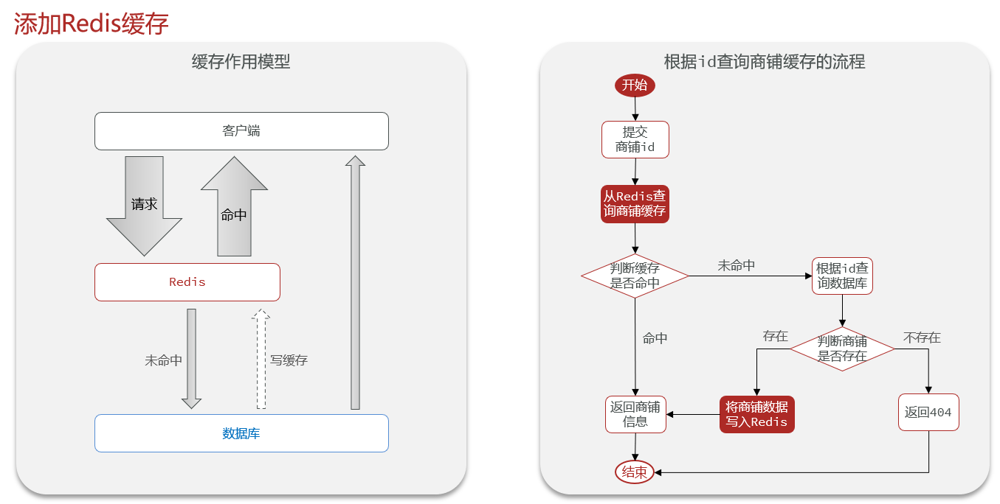

# 黑马点评

- [黑马点评](#黑马点评)
  - [STAR](#star)
  - [alias \& bg](#alias--bg)
    - [数据库表设计](#数据库表设计)
  - [1.登录功能](#1登录功能)
    - [关于session](#关于session)
    - [基于Session的短信登录](#基于session的短信登录)
    - [Q \& A](#q--a)
    - [利用redis解决集群的session共享问题](#利用redis解决集群的session共享问题)
      - [具体实现](#具体实现)
    - [STAR总结](#star总结)
  - [2.缓存店铺信息](#2缓存店铺信息)
    - [标准操作](#标准操作)
    - [缓存更新 / 缓存与数据库的一致性](#缓存更新--缓存与数据库的一致性)
      - [项目实现](#项目实现)
      - [STAR总结](#star总结-1)
    - [解决缓存穿透问题](#解决缓存穿透问题)
    - [如何解决缓存雪崩问题](#如何解决缓存雪崩问题)
    - [如何解决缓存击穿问题](#如何解决缓存击穿问题)
      - [互斥锁解法](#互斥锁解法)
      - [逻辑过期解法](#逻辑过期解法)
  - [3. 秒杀](#3-秒杀)
    - [全局ID生成器](#全局id生成器)
    - [优惠券秒杀下单](#优惠券秒杀下单)
      - [乐观锁解决 单体下一人多单超卖问题](#乐观锁解决-单体下一人多单超卖问题)
      - [悲观锁解决 单体下一人一单和超卖问题](#悲观锁解决-单体下一人一单和超卖问题)

## STAR

first of all, STAR法介绍项目

* Situation：背景
* Task：你的任务
* Action：你的具体行动
* Result：结果，最好量化

## alias & bg

驴友社区
描述：该项目是一个创新的旅游项目，为用户提供了丰富的旅游体验和便捷的功能，包括短信登录、景点查询、优惠券秒杀、附近的景点推荐、用户签到、旅行圈好友关注和动态点赞排行榜等功能；

秒享生活
基于Redis+SpringBoot的生活服务类App,实现了短信验证码登录查找店铺，秒杀优惠券，发表点评，关注推送的完整业务流程。

介绍：
我做的这个项目是一个仿大众点评的评价类项目，实现了优惠券秒杀，好友关注，点赞评论，查看附近娱乐场所等功能

介绍：该项目是一个聚焦运动健身领域的点评平台，为运动爱好者提供便捷的功能，包括短信登录、运动场所查询、运动课程优惠券抢购、用户点评等功能

### 数据库表设计

* tb_user: 用户表: id主键, phone, name
  * 存用户基本信息
* tb_user_info: 用户详情表: user_id主键, city, fans, followee, gender, level...
  * 存用户详情信息
* tb_shop: 店铺信息表: id主键, name, type_id(逻辑外键), images, address, score, avg_price
  * 存店铺基本信息
* tb_shop_type: 店铺类型表: id主键, 类型name, sort
  * 店铺类型：健身中心、游泳馆、球类运动(乒乓、羽毛球、篮球、足球、高尔夫)、武术搏击、溜冰、马术、攀岩
* tb_blog：用户探店日记: id主键, shop_id(逻辑外键), user_id(逻辑外键), titile标题, content内容, images
* tb_voucher：优惠券表: id, shop_id, 代金券名title, 
* tb_voucher_order：优惠券的订单表: id主键, user_id(逻辑外键), voucher_id(逻辑外键)
* tb_follow：用户关注表: id, user_id, follow_user_id

## 1.登录功能

使用Redis解决了在集群模式下的Session共享问题，使用双拦截器实现用户的登录校验和权限刷新。
实现手机短信登录功能，并使用Redis实现Session token的存储，解决服务器集群中共享登录用户信息问题；采用双拦截器实现刷新token有效期和鉴权功能。

### 关于session

* Session用来**存放会话内的数据**，本项目中存了验证码、用户信息
* **一个客户端对应一个会话**，该**客户端后续的请求都属于该会话** (有效期内)，因为会带上sessionID，所以服务端将其视为一个会话内
* **不同客户端对应不同会话**（不同的浏览器、设备、用户），这样大家就可以各登录各的，互不干扰
* 一个客户端发送请求给服务端，如果没带sessionid，就意味着是一个**新客户端**，服务端为其创建一个会话，并返回一个sessionid
* 默认情况下session有效期是30min，超时了就要重新登陆
* HttpSession参数会有SpringMVC自动注入，当你发送请求的时候

### 基于Session的短信登录

> 首先，短信验证登录的作用：账号密码登录容易泄露密码，短信登录还可以减少用户的记密码的负担，注册也更方便

* 发送验证码（收到请求 -> 校验phone合法性 -> 生成验证码通过阿里云服务发送）
* 登录与注册（收到账号和验证码请求 -> 校验验证码正确性 -> 查数据库中有无账号，无则注册 -> 将用户user存到session中）
  * 将整个User类对象user都存入session/ThreadLocal
* 其他请求校验登录状态（收到用户请求 -> 从http请求中取出session -> 从session取出user，如不存在则拦截 -> 将user存到ThreadLocal）

**发送验证码**：[code](https://github.com/cs001020/hmdp/blob/master/src/main/java/com/hmdp/service/impl/UserServiceImpl.java#L52-L67)
1. 用户通过post提交手机号到服务器(接口为 `@PostMapping("code")`)
2. 服务端校验手机号的合法性: `regex正则表达式`；if 不合法则返回错误
3. 服务端生成验证码(`code=Random(6)`)，同时**将验证码保存到当前客户端对应的会话session中**(`session.setAttribute("code", code)`)，通过短信的方式将验证码发送给用户
   1. ==**后续验证码也存到redis中**==
   2. 不同客户端对应不同session会话，这个setAttribute()是把k-v数据存到这个客户端的会话中（存在服务端）
   3. 发送操作可以借助阿里云SMS短信服务，暂时不做了，我目前只是模拟了下，手动从后台拿到验证码登录；大概**4分一条**，我也可以做了，很easy


**短信验证码登录、注册**：[code](https://github.com/cs001020/hmdp/blob/master/src/main/java/com/hmdp/service/impl/UserServiceImpl.java#L71-L110)
1. 用户输入验证码，将手机号和验证码一块post给服务端 (`@PostMapping("/login")`)
2. 服务端**从session拿到当前验证码**(`session.getAttribute("code")`)，然后和用户输入的验证码进行校验；如果不一致，校验失败
3. 根据手机号去`tb_user`查询用户，如果用户不存在，则为用户**创建用户信息**并保存
4. **将用户信息保存到session中**(`session.setAttribute("user", user)`)，方便后续获得当前登录信息
   1. 后续这一步改为：==**将用户信息存到redis中**==（通过UUID生成一个随机token作为key）


**校验登录状态**(use interceptor): [code](https://github.com/cs001020/hmdp/blob/master/src/main/java/com/hmdp/interceptor/RefreshTokenInterceptor.java#L30-L50)

1. 用户在发送一些请求(not exclude)到controller时，请求的cookie中会带着sessionID(user的那个)
   1. 后续改为：**用户会带着token访问(在http的`authorization`字段)**
2. 服务端从`HttpServeletRequest`中获得该客户端对应的session`getSession()`，从session中取出"user"的数据(`session.getAttribute("user)`)，如果不存在就拦截返回401
   1. 后续：**服务端从redis中取出token对应的value，判断是否存在**
3. 如果存在，将用户信息存入ThreadLocal


---

### Q & A

**Q: 为什么要把验证码存到session？为何不存到mysql嘞？**
A: 临时性存储：验证码通常是临时的，存储在session中可以确保在用户会话期间有效，且在会话结束后自动失效。存到mysql会增加复杂性，没必要

Q: 为什么要存到redis，不是说好的存到session?
A: 参考session共享问题

**Q: 为何可以用这个session校验登录状态？**
A: 因为只有你登录之后会被赋予一个sessionid，然后查询你这个id就可以找到对应的session，那固然就找到了这个会话； 在会话期间我们想要快速访问用户数据，避免频繁查询数据库，主要是后续的权限校验需要对比；因为这个session

**Q: 为什么要把用户信息存到ThreadLocal？为什么不直接去session中或者mysql取？**

> bg: **每个用户请求都会交给Tomcat线程池中的一个线程来处理**，请求处理完成后，回收到线程池，准备好处理下一个请求。

A: 首先用户信息会经常使用，所以我们要特别存起来
1. **线程安全**：ThreadLocal可以在多线程环境中保证每个线程都能访问到自己独立的用户信息，避免了多线程冲突。
2. **访问速度**：直接取session中取 或从mysql数据库中取 速度要比从ThreadLocal中取慢得多
3. **避免显式传参**，简化代码：使用ThreadLocal可以避免在多个方法之间显式传递用户信息，使得代码更加简洁和易于维护。
   1. 一个请求通常由多个过滤器、拦截器、服务层方法等共同处理，我们当然应该可以在收到的时候拿个变量接收，然后通过参数传递下去，但比较麻烦

> 至于ThreadLocal的底层细节，请见`JUC.md`

**Q: 为什么登录校验要写在拦截器中？**
A: 项目中很多Controller/业务需要校验用户的登录，我们不可能在每个业务中都写校验逻辑;
SpringMVC中，请求会先走interceptor组件的`preHandle()`，成功后再到达相应的controller, 你可以配置所有请求都走拦截器，也可以通过`execludePathPatterns()`排除路径，比如我们排除了`/shop/**`看看商铺肯定是不用校验登录的；

因此我们把用户校验登录的功能交给拦截器做

> 但是需要把拦截器中拿到的用户信息通过ThreadLocal传递到各个Controller层去，传递的过程中还需注意线程安全问题。


ok，到这儿基于session登录结束，但有集群的session共享问题

---

### 利用redis解决集群的session共享问题

**问题：** ==何所谓session共享问题?==
**多台tomcat并不共享session空间，当切换到不同tomcat时，数据会丢失。**
详：每个tomcat中都有一份自己的session, 假设用户第一次请求被负载均衡到了第一台tomcat，并且把user信息存放到第一台服务器的session中，但第二次请求被负载均衡到第二台tomcat，那么在第二台服务器上，肯定没有第一台服务器存放的session，所以校验登录状态就无法从session中取出user信息了

> tomcat暂且就理解为webserver吧

解决方案A：

* **Session拷贝**：当任意一台tomcat的session修改时，都会同步给其他的Tomcat服务器的session
  * 问题：冗余 服务器压力大 拷贝延迟

解决方案B (Ours)：

**使用Redis实现共享session登录，主要是为了解决在分布式系统中，用户session无法共享的问题**。

因为传统的session是存储在服务器端的内存中，当请求分发到不同的服务器时，就无法获取到用户的session信息。而Redis作为一个内存数据库，具有高性能、高并发、持久化等特点，非常适合用来存储和共享session。

redis替代session实现登录注册功能的好处：

* **分布式**支持与扩展性：**Redis更适合分布式系统**，很容易扩展。在多服务器环境下，Redis可以作为中央session存储，而传统内存session难以在多服务器间共享。
* **持久化**：Redis的多种持久化方式可将数据持久化到磁盘(RDB, AOF)；而session数据会因为系统故障或者重启而丢失
* **灵活**：可以用各种数据结构存储会话数据，eg 字符串、哈希表、列表等

#### 具体实现

可以用String来存储，也可以用Hash结构存储，占用更少内存

**Q: 我们用什么key？**
A: 验证码的key: `login:code:{phone}`
用户信息的key: `login:token:{Radom_UUID}`；通过UUID随机生成; 可以用手机号，但有点敏感

**Q: 过期时间怎么设置的？**
A: 验证码2min, 用户信息30min(改为7天吧)并且**每次请求来了刷新从新即使**

**Q: 如何状态权限 / Token续期的？**
A: 第一个Interceptor拦截一切路径，刷新token的有效期，然后全部放行；第二个Interceptor拦截需要登录的路径

---

### STAR总结

**双重拦截器完成登录状态的刷新**

**S**: 用户请求进入之后，对于一些业务比如帖子发布，优惠券购买，我们需要判断这个用户是否登录了，登录了放行，没登录则拦截。但是对于其他一些业务比如说浏览店铺，对于未登录的用户我们也不需要拦截。
**T**: 但是这里还存在一个token过期的问题，我们一般会给这个token设置一个过期时间。我设置的是7天，如果过期了，用户就会从登录状态变为未登录的状态，但是如果这七天内用户再次登录了，进行了一次查询，我们应该给这个token进行一次续期。
**A**: 我设置成了两层拦截器，**第一层拦截器拦截所有请求**，如果token存在，则给这个**token刷新**，进行一个续期操作。如果**token不存在则直接放行交给下一层判断**。接下来这些请求会到达第二个拦截器，这个拦截器只拦截一些必须登录操作，只有token存在才可以执行（token不存在说明校验不通过）。
**R**: 所以，我设置两层拦截器，第一层拦截器拦截所有接口的请求，token存在则对token进行一个刷新，不存在直接放行。第二层拦截器拦截那些必须要登录才能完成的操作。


> 第二个Interceptor会排除一些无需登录校验的路径 `eg /login, /shop/**`  [code](https://github.com/cs001020/hmdp/blob/b9026b6da2274f4fc7f419aceb6d84c8e24222b7/src/main/java/com/hmdp/config/MvcConfig.java#L21-L44)

**Q: 为何要设置两个Interceptor，不能在第一个Interceptor中遇到不存在token时直接拦截掉吗？**
A: 不能，因为有一些功能不需要校验，比如浏览店铺，登录入口，所以你如果在第一个Interceptor拦截过滤掉，那这些功能就没啦。所以由于我们想过滤一部分请求不进行校验，然后我们又想对所有请求进行token刷新，故而需要两个Interceptor做不同的拦截


## 2.缓存店铺信息

推荐观看[总结](https://www.bilibili.com/video/BV1cr4y1671t?t=659.3&p=47)

使用redis作为mysql的缓存有很多好处，详见 [redis.md](https://github.com/haooxia/CSJourney/blob/main/database/redis.md)

---

本来我们查店铺信息都是去数据库中查询，很慢，所以考虑使用redis缓存店铺信息。
```java
@GetMapping("/{id}")
public Result queryShopById(@PathVariable("id") Long id) {
    //这里是直接查询数据库
    return shopService.queryById(id);
}
```

### 标准操作

查询数据库前先查redis缓存，如缓存命中，则直接返回，否则，再查询mysql数据库，顺便**将数据存入redis**。

**业务中**：
* 用户post一个**店铺id**来查询，先去redis查缓存，然后判断是否命中
  * 命中直接返回，结束；
  * 未命中，根据id查数据库，然后判断查询结果是否命中
    * 若命中，将数据写入redis再返回
    * 若不存在，直接返回404报错

**问题**：未考虑 **==缓存更新==**；如果已缓存了数据到redis，此时若数据库更新，reids就是旧数据了

{width=90%}


### 缓存更新 / 缓存与数据库的一致性

> 理论详见 [redis.md](https://github.com/haooxia/CSJourney/blob/main/database/redis.md)

缓存更新策略分为：==内存淘汰、超时剔除和主动更新==（一致性逐渐增高，维护成本也逐渐增高）


{width=80%}
> **本项目中高一致性需求：店铺详情信息，以及优惠券信息**


主动更新又分为：==Cache-Aside模式，Read/Write Through模式, Write Behind Caching模式==

---

**Q: 为什么是删除缓存而非更新缓存？**
A: 如果每次修改数据库都更新缓存，这样会有很多次无效写入redis操作，就，你每次都更新，可也没人来访问，何必呢？不如直接删掉，下次别人访问了再加载一次即可（懒惰、延迟加载

**Q: 如何保证缓存和数据库的操作的同时成功或失败？原子性**
A: 本项目是单体的，把缓存与数据库操作放到一个事务里即可；分布式系统中可采用分布式事务, eg seata

**Q: 为什么要先操作/更新mysql数据库再删除redis缓存？能否反过来？**
A: 不能，反过来发生数据不一致的概率高得多，原因如下：


> * 右侧正常情况是：线程2: 更新数据库->删缓存；-> 线程1: 查缓存未命中 -> 写入缓存
> * 右侧的发生概率是极低的，但也可能发生，所以我们设置超时时间使用**超时剔除作为兜底**（即使我写缓存写错了，超时了自动会删掉

Q: 为什么要采用Cache Aside？write/read through 及 write back区别？

#### 项目实现


==**主动更新（Cache Aside旁路缓存策略） + 超时剔除**==

* **读操作**：根据id查询商铺时，先查缓存，命中直接返回，未命中再去查数据库，将数据库结果写入缓存，**并设置超时时间ttl**；（30min）
  *   
* **写操作**：根据id修改店铺时，**先**修改/更新数据库，再**删除**缓存（同时开启事务保证两个操作的原子性
  *   

代码分析：当我们修改了数据之后，把缓存中的数据进行删除，查询时发现缓存中没有数据，则会从mysql中加载最新的数据，从而避免数据库和缓存不一致的问题。
由于此项目是单体架构的项目，更新数据库操作和删除缓存操作都在一个方法里，需要通过**事务**去控制，来保证原子性。**但如果是分布式系统：在更新完数据库之后，删除缓存的操作不是自己来完成，而是通过mq去异步通知对方，对方去完成缓存的处理!!**

#### STAR总结

利用Cache-Aside解决数据库与缓存的数据一致性问题

> from ChatGPT:

Situation (S): 用户频繁查询店铺信息，导致直接访问数据库的查询速度较慢。为了解决这个性能瓶颈，决定采用Redis缓存来加速查询。然而，随着数据库的不断更新，Redis中的缓存数据可能与数据库中的数据不一致，导致数据过时的问题。这种情况下，必须找到一种有效的缓存更新策略来保证数据一致性。

Task (T): 需要设计并实现一种缓存策略，在提高查询性能的同时，保证数据库与缓存数据的一致性，尤其是在更新店铺信息时，确保缓存与数据库保持同步。

Action (A):

读取操作：在用户查询店铺信息时，首先查询Redis缓存。如果缓存命中，则直接返回数据；如果未命中，则查询MySQL数据库，并将查询结果写入缓存，同时设置缓存的超时时间（如30分钟），以减少缓存过期造成的一致性问题。

写入操作：在用户更新店铺信息时，首先更新MySQL数据库，然后删除Redis中的对应缓存。为了确保操作的原子性，将数据库更新和缓存删除操作放在同一个事务中。如果项目是分布式系统，则通过消息队列（MQ）异步通知其他服务进行缓存删除。

Result (R): 通过采用Cache-Aside模式并结合超时剔除机制，成功解决了数据库与缓存之间的数据一致性问题。该方案在确保高性能查询的同时，有效避免了缓存和数据库数据不同步的情况，提高了系统的可靠性和用户体验。

### 解决缓存穿透问题

> 理论详见 [redis.md](https://github.com/haooxia/CSJourney/blob/main/database/redis.md)

**缓存穿透**问题：客户端请求的数据在缓存和数据库中都不存在，导致每次查询都会绕过缓存直接打到数据库，对数据库造成巨大压力（攻击数据库的好办法）；即**大量无效请求直接打到数据库**
> Cache Penetration 其实翻译为'渗透'挺好（不怀好意者通过这个漏洞避开redis渗透到mysql

缓存空对象
  
  

* **为什么不用bloom filter？TODO** [扩展一下](https://wx.zsxq.com/dweb2/index/topic_detail/5122558481528484)

### 如何解决缓存雪崩问题

给不同的key添加随机值（比如在增量0-10min中浮动）

### 如何解决缓存击穿问题

  

#### 互斥锁解法

原方案：从缓存中查询不到数据后直接查询数据库
现方案：查询缓存之后，如未查到，尝试获取互斥锁，然后**判断是否获得互斥锁**，没拿到就休眠50毫秒并重新查缓存(看看这时候重建好了没，最好是拿锁的哥们已经重建好了...(但缓存击穿一般要求重建时间比较久))，拿到锁的哥们就根据id查询数据库，并重建/更新缓存，最后释放锁。
  

这里的锁非同寻常：
不是我们的synchronized或者Lock(因为要求互斥等待)，而我们想要一个自定义的行为，此处利用redis的String的指令`setnx lock 1获取锁, del lock释放锁`

  

你的并发效果怎么样呢？
我采用JMeter进行并发压力测试：日志中就查了一次数据库，证明在如此高并发的场景下我们并没有打到数据库上（1000个线程并发运行，Ramp-up时间5秒（打到指定线程数所需时间，用于控制启动速度，即5s内平均每秒启动200个线程）
> 这jmeter测试的跟缓存击穿没啥关联啊，只能说证明了我们的互斥锁没问题：即一个线程拿锁去查数据库，即就查了一次数据库，其他都是查缓存

#### 逻辑过期解法

  

我们通过jmeter并发测试：发现就执行了一次缓存重建，在重建完成之间，直接返回旧的数据，重建成功之后返回新的数据（确实妙

  

## 3. 秒杀

### 全局ID生成器

全局唯一ID/分布式唯一ID（Globally Unique Identifier，简称 GUID）是一个特殊的编码，用于确保在一个特定的环境中生成的所有ID都是唯一的，不会有重复的。这种唯一性**不仅限于单个系统或应用，而是跨多个系统、应用或数据库的全局唯一**

Q: 为什么要设置全局ID唯一，而非直接利用mysql的主键id自增

* id规律性太明显，容易泄漏信息
  * 场景：别人可以根据两个时点(比如一天内)的id变化判断出你商城的销售量...这还怎么骗人嘞
* 受单表数据量的限制（数据量过大），订单id不应该重复
  * 场景：随着我们商城规模越来越大，mysql的单表的容量不宜超过**500W**，数据量过大之后，我们要进行**拆库拆表**，但mysql拆分后的各表的id各自自增；但他们从逻辑上讲他们是同一张表，所以我们期望需要保证订单id的唯一性（因为售后客户要根据id来找你，一样的id就不行咯...

**全局ID生成器**，是一种在分布式系统下用来生成全局唯一ID的工具，一般要满足下列特性：

* 唯一性
  * redis的string**数值类型**有**incre自增特性**，redis独立于数据库之外，管你有多少个数据库或表，我redis就一份，故天然保证唯一
* 高可用（我来找你你不能挂啊
  * redis主从、集群、哨兵可以确保
* 高性能（要快
  * redis就是快
* 递增性
  * incre
* 安全性（不能让用户猜到规律
  * 这里得改改了，手动拼点别的信息

> 还有其他的全局唯一ID生成算法：UUID(非单增)，snowflake雪花算法(也是long64位)，我们是redis自增

  
ID的组成部分：

* 符号位：1bit，永远为0
* 时间戳：31bit，以**秒**为单位，可以使用**69年**
* 序列号：32bit，秒内的计数器（保证1s内的多个订单ok），理论上支持每秒产生2^32个不同ID，绝壁够用了

```java
public class RedisIDWorker {
    // 开始时间戳
    private static final long BEGIN_TIMESTAMP = 1640995200L; // 2022-01-01 00:00:00
    // 序列号的位数
    private static final int COUNT_BITS = 32;
    private StringRedisTemplate stringRedisTemplate;
    public RedisIDWorker(StringRedisTemplate stringRedisTemplate) {
        this.stringRedisTemplate = stringRedisTemplate;
    }
    public long nextId(String keyPrefix) {
        // 1.生成时间戳
        LocalDateTime now = LocalDateTime.now();
        long nowSecond = now.toEpochSecond(ZoneOffset.UTC); // 转换为秒数
        long timestamp = nowSecond - BEGIN_TIMESTAMP;
        // 2.生成序列号
        // 2.1.获取当前日期，精确到天
        String date = now.format(DateTimeFormatter.ofPattern("yyyy:MM:dd"));
        // 2.2.自增长
        long count = stringRedisTemplate.opsForValue().increment("icr:" + keyPrefix + ":" + date);
        // note 为什么要拼接date, 用一个key不可以吗？ 1. 一个key上限是2^64,不好；另外我们只给了32位；
        //  所以我们给每天整一个key，还可以起到统计一天/月/年单量的效果
        // 3.拼接并返回(我们要返回long 可能是字符串拼接奥
        // note: 将时间戳左移到高位，然后将序列号放到低位(或运算)
        return timestamp << COUNT_BITS | count;
    }
}
```

### 优惠券秒杀下单

#### 乐观锁解决 单体下一人多单超卖问题

* 定义：超卖问题是在高并发环境下，eg 电子商务和股票交易等秒杀场景中出现的一种数据不一致性问题；指销售的商品数量超过了实际库存数量
* 秒杀扣减库存逻辑：**判断是否在秒杀时间范围内，判断库存是否充足，若充足则扣减库存**
  * 超卖场景：当线程2查到库存容量充足 至 线程2扣减库存之间，线程1扣减了库存，如果刚好扣完了，线程2就又扣了一次，此即超卖
* 原因：多个线程操作共享资源，且代码有好几行，然后多个线程难以避免出现穿插；并发引起的资源竞争没有加锁,导致运行时序不可控；但请注意超卖是个概率问题，有概率发生而已
* 解决方案
  * **悲观锁思路**：认为一定会发生，因此在操作之前加锁，确保各位线程**串行执行**：e.g., synchronized, Lock; 性能差
    * 悲观锁的种类有哪些？可以怎么分类？悲观锁和乐观锁的优缺点
  * **乐观锁思路**：认为未必会发生，即发生概率较低；故而乐观锁并不加锁，只有当更新数据时才去判断有没有其他线程对数据做了修改，如无则安全，如有说明发生了线程安全问题，重试或抛异常；性能好很多
    * 版本号法
    * CAS法（Compare And Swap）：是乐观锁的一种实现方式，是硬件层面支持的原子操作，包含3个操作基数，内存位置（V），预期原值（A）和新值（B），**只有当内存位置V的值等于预期原值A时**（即数据没被修改），**才将该位置的值更新为新值B**，否则不做任何操作。
    * 但乐观锁的前提是修改数据的场景：因为乐观锁核心思想就是在修改数据的时候检查是否被别人修改过嘛

```java
// 悲观锁解法很简单，遂省略

// 解法二：基于CAS乐观锁（业务上没问题，但很多线程执行失败，整体的成功率大大降低
  // 4.判断库存是否充足
  if (voucher.getStock() < 1) return Result.fail("库存不足！");
  // 5. 扣减库存 (NOTE: 判断更新时数值是否和上述查到的数值相等(CAS乐观锁)
  boolean success = seckillVoucherService.update()
          .setSql("stock = stock - 1") // set stock = stock - 1
          .eq("voucher_id", voucherId).eq("stock", voucher.getStock()) // where voucher_id = ? and stock = ?
          .update(); // update


// 解法三 (note 不去判断是否值相同，判断>0即可，解决成功率低的问题
if (voucher.getStock() < 1) return Result.fail("库存不足！");
boolean success = seckillVoucherService.update()
        .setSql("stock = stock - 1") // set stock = stock - 1
        .eq("voucher_id", voucherId).gt("stock", 0) // where voucher_id = ? and stock > 0
        .update(); // update
```

==如果直接使用乐观锁（即判别两个值是否相等）的话，请求的成功率太低；
解决方案：无需判断库存是否与查到的相等，只需判断库存>0即可==

#### 悲观锁解决 单体下一人一单和超卖问题

问题：我们是卖优惠券的，但此时一个用户可以无限量抢单（利好黄牛），所以需要加一层限制逻辑。

秒杀扣减库存逻辑：判断是否在秒杀时间范围内，判断库存是否充足，**判断这个用户是否下过这个订单（根据用户id和优惠券id）**，若没有则扣减库存

> 前面那个超卖问题加的乐观锁也被这里的悲观锁包裹了啊？那要那个乐观锁还有啥用

我们是对用户加锁，而非锁住this，保证同一用户只能串行执行块内内容`synchronized(userId.toString().intern())`

通过synchronized可以解决单机情况下一人一单问题，但在集群模式下回出现问题：
我们的锁监视器监视了jvm线程池里面的userid的字符串

由于synchronized是本地锁，只能提供线程级别的同步，每个JVM中都有一把synchronized锁，不能跨JVM进行上锁，当一个线程进入被synchronized关键字修饰的方法或代码块时，它会尝试获取对象的内置锁（也称为监视器锁）。如果该锁没有被其他线程占用，则当前线程获得锁，可以继续执行代码；否则，当前线程将进入阻塞状态，直到获取到锁为止。集群模式下，意味着有多个JVM（多个常量池），所以synchronized会失效！

所以我们需要一个分布式锁：**满足分布式系统或集群模式下多进程可见并且互斥的锁**

分布式锁有什么特点：
可见性：多个线程都能看到相同的结果；
互斥：互斥是分布式锁的最基本的条件，使得程序串行执行
高可用：程序不易崩溃，时时刻刻都保证较高的可用性

  

如何基于redis实现分布式锁
`set lock thread1 NX EX 10`: NX保证互斥，EX设置过期时间，这一条指令完成两个功能，具备原子性