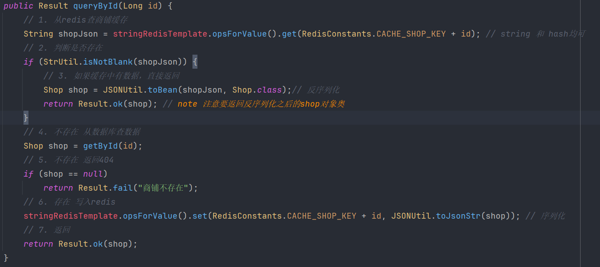
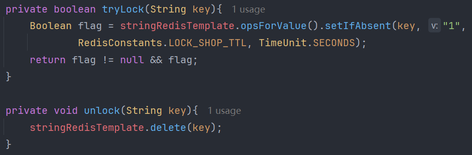
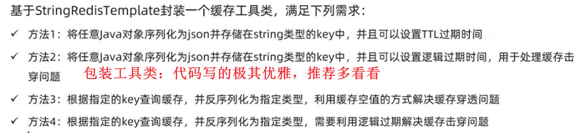

# 黑马点评

[toc]

## alias & bg

驴友社区
描述：该项目是一个创新的旅游项目，为用户提供了丰富的旅游体验和便捷的功能，包括短信登录、景点查询、优惠券秒杀、附近的景点推荐、用户签到、旅行圈好友关注和动态点赞排行榜等功能；

秒享生活
基于Redis+SpringBoot的生活服务类App,实现了短信验证码登录查找店铺，秒杀优惠券，发表点评，关注推送的完整业务流程。

介绍：
我做的这个项目是一个仿大众点评的评价类项目，实现了优惠券秒杀，好友关注，点赞评论，查看附近娱乐场所等功能

## 1.登录功能

使用Redis解决了在集群模式下的Session共享问题，使用双拦截器实现用户的登录校验和权限刷新。
实现手机短信登录功能，并使用Redis实现Session token的存储，解决服务器集群中共享登录用户信息问题；采用双拦截器实现刷新token有效期和鉴权功能。

### 基于Session的短信登录

**发送验证码：**
用户在提交手机号后，服务端会校验手机号是否合法，如果不合法，则要求用户重新输入手机号 如果手机号合法，后台此时生成对应的验证码(RandomUtil)，同时将验证码进行保存(session.setAttribute)，然后再通过短信的方式将验证码发送给用户(我只是模拟了下，可以借助阿里云短信服务)

**短信验证码登录、注册：**
用户输入手机号和验证码，后台从session中拿到当前验证码(session.getAttribute)，然后和用户输入的验证码进行校验，如果不一致，则无法通过校验，如果一致，则后台根据手机号查询用户，如果用户不存在，则为用户创建账号信息，保存到数据库(通过mybatisplus)，无论是否存在，都会将用户信息保存到session中，方便后续获得当前登录信息

**校验登录状态（通过==拦截器==对一些路径进行拦截）:**
用户在请求时候，会在cookie中携带者sessionId到后台，**后台通过sessionId从session中拿到用户信息**，如果没有session信息，则进行拦截，如果有session信息，则将用户信息保存到threadLocal中，并且放行

  

#### 为什么要把用户信息保存到ThreadLocal中？

ThreadLocal可实现线程隔离：ThreadLocal为每个线程提供独立的变量副本，各个线程可以独立地改变自己的副本，而不会影响其他线程的副本；ThreadLocal的本质类似HashMap；

在处理单个web请求时，由一个线程负责。（即使服务器使用线程池，在单个请求的生命周期内，处理该请求的线程是不变的。）

在Web应用中，将用户信息保存到ThreadLocal中的主要目的是为了**在当前处理的线程中**方便、 快捷地获取用户相关信息，而不需要频繁地从Session或其他存储中检索。这样做有以下几个好处：

* 线程安全：ThreadLocal为每个线程提供了其自己的变量副本。这意味着一个线程不能访问或修改另一个线程的ThreadLocal变量。这在多线程环境中特别有用，因为它避免了共享数据时的同步问题
* 性能优化：从Session或其他存储中检索用户信息可能涉及数据库查询或网络调用，这可能会消耗相对较多的时间和资源。通过将用户信息保存在ThreadLocal中，可以在需要时快速访问，减少了不必要的查找和等待时间
* 请求作用域数据的传递：在Web应用中，一个请求通常由多个过滤器、拦截器、服务层方法等共同处理。使用ThreadLocal可以确保这些组件在处理请求时都能访问到相同的用户信息，而不需要显式地传递数据。

在使用ThreadLocal时，要确保在请求处理完毕后及 时清理其中的数据，避免内存泄漏。这通常通过在请求处理完毕后调用 ThreadLocal的remove()方法来实现

#### 登录校验拦截器详解


在项目中，有很多Controller，随着业务的开发，**越来越多的业务都需校验用户的登录**，不可能在每一个业务的Controller类中都编写“校验登录状态”的逻辑。在SpringMVC中，拦截器可以在所有Controller执行之前去做，有了拦截器之后，用户的各种请求就不用直接访问Controller，必须先经过拦截器，判断是否放行。可以把用户校验登录的功能交给拦截器做，但是需要把拦截器中拿到的用户信息传递到各个Controller层去，传递的过程中还需注意线程安全问题。那么在拦截器中拦截到的用户信息，可以保存到ThreadLocal中。

ok，到这儿基于session登录结束，但有集群的session共享问题

#### 利用redis解决集群的session共享问题

每个tomcat中都有一份属于自己的session,假设用户第一次请求被负载均衡服务器分配到了第一台tomcat，并且把自己的信息存放到第一台服务器的session中，但是第二次这个用户被负载均衡到第二台tomcat，那么在第二台服务器上，肯定没有第一台服务器存放的session，所以此时整个登录拦截功能就会出现问题，我们如何解决这个问题呢？

早期的方案是session拷贝来共享，就是说虽然每个tomcat上都有不同的session，但是每当任意一台服务器的session修改时，都会同步给其他的Tomcat服务器的session，这样的话，就可以实现session的共享了，但这有两个问题：每台服务器中都有完整的一份session数据，服务器压力过大；session拷贝数据时，可能会出现延迟

解决方案：**使用Redis实现共享session登录，主要是为了解决在分布式系统中，用户session无法共享的问题。**因为传统的session是存储在服务器端的内存中，当请求分发到不同的服务器时，就无法获取到用户的session信息。而Redis作为一个内存数据库，具有高性能、高并发、持久化等特点，非常适合用来存储和共享session。

redis替代session实现登录注册功能的好处：

* 分布式支持与扩展性：Redis更适合分布式系统，可以很容易地进行横向扩展，通过增加节点来扩展系统的容量和性能。在多服务器环境下，Redis可以作为中央session存储，而传统内存session难以在多服务器间共享。
* 持久化：Redis提供了多种持久化方式，可以将数据持久化到磁盘上，确保数据不会因为系统故障或者重启而丢失而服务器内存中的session在服务器重启后会丢失。
* 灵活性： Redis提供了丰富的数据结构和操作命令，可以灵活地处理各种数据存储和操作需求。在实现登录注册功能时，可以利用Redis的字符串、哈希表、列表等数据结构来存储用户信息、会话数据等，以及利用Redis的原子操作来实现并发安全的会话管理。

#### 权限刷新拦截器详解

我们通过拦截器进行获取token(从http请求头获取)、查询Redis用户、刷新token有效期(expire)的操作。
而如果将权限刷新功能写到登录校验拦截器中，该拦截器A只会拦截需要登陆的路径。
解决：在这个拦截器A前再加一个拦截器B，用于拦截所有路径，把获取token、查询Redis用户、刷新token有效期的操作放到这个拦截器B上做。而拦截需要登陆的路径的拦截器A只需要判断ThreadLocal中有没有用户即可

  

## 2.缓存店铺信息

推荐观看[总结](https://www.bilibili.com/video/BV1cr4y1671t?t=659.3&p=47)

使用redis作为mysql的缓存有很多好处，见`redis.md`

### 一般操作

查询数据库之前先查询redis缓存，如缓存数据存在，则直接从缓存中返回，如不存在，再查询mysql数据库，然后将数据存入redis。

体现在业务中：前端提交一个**店铺id**，先去redis查缓存，然后判断查询结果是否命中，若命中直接返回，结束；若未命中，根据id查数据库，然后判断查询结果是否命中，若命中，将数据写入redis再返回，若不存在，直接返回404报错；
  
  

但目前没有考虑==**缓存更新策略**==，存在问题：如果已缓存了数据到redis，此时若数据库更新，reids就是旧数据了

### 如何保证缓存和数据库的一致性

> 背景知识参考redis.md, 此文件仅表述采用的解决方案
>
> * 为什么要采用Cache Aside？write/read through 及 write back区别？
> * 为什么Cache Aside要先更新数据库再删除redis？顺序可以反吗？为什么不是更新redis呢？
> * 为什么还要设置超时时间保证超时剔除？
> * 如何保证更新数据库 & 删除缓存的原子性？

==主动更新（Cache Aside旁路缓存策略） + 超时剔除==

* 根据id查询商铺时，如果缓存未命中，则查询数据库，将数据库结果写入缓存，并设置超时时间；
  *   
* 根据id修改店铺时，**先**修改数据库，再**删除**缓存（同时开启事务保证两个操作的原子性
  *   

代码分析：当我们修改了数据之后，把缓存中的数据进行删除，查询时发现缓存中没有数据，则会从mysql中加载最新的数据，从而避免数据库和缓存不一致的问题。
由于此项目是单体架构的项目，更新数据库操作和删除缓存操作都在一个方法里，需要通过**事务**去控制，来保证原子性。**但如果是分布式系统：在更新完数据库之后，删除缓存的操作不是自己来完成，而是通过mq去异步通知对方，对方去完成缓存的处理!!**

### 如何解决缓存穿透问题

缓存空对象
  
  

* **为什么不用bloom filter？TODO** [扩展一下](https://wx.zsxq.com/dweb2/index/topic_detail/5122558481528484)

### 如何解决缓存雪崩问题

给不同的key添加随机值（比如在增量0-10min中浮动）

### 如何解决缓存击穿问题

  

#### 互斥锁解法

原方案：从缓存中查询不到数据后直接查询数据库
现方案：查询缓存之后，如未查到，尝试获取互斥锁，然后**判断是否获得互斥锁**，没拿到就休眠50毫秒并重新查缓存(看看这时候重建好了没，最好是拿锁的哥们已经重建好了...(但缓存击穿一般要求重建时间比较久))，拿到锁的哥们就根据id查询数据库，并重建/更新缓存，最后释放锁。
  

这里的锁非同寻常：
不是我们的synchronized或者Lock(因为要求互斥等待)，而我们想要一个自定义的行为，此处利用redis的String的指令`setnx lock 1获取锁, del lock释放锁`

  

你的并发效果怎么样呢？
我采用JMeter进行并发压力测试：日志中就查了一次数据库，证明在如此高并发的场景下我们并没有打到数据库上（1000个线程并发运行，Ramp-up时间5秒（打到指定线程数所需时间，用于控制启动速度，即5s内平均每秒启动200个线程）
> 这jmeter测试的跟缓存击穿没啥关联啊，只能说证明了我们的互斥锁没问题：即一个线程拿锁去查数据库，即就查了一次数据库，其他都是查缓存

#### 逻辑过期解法

  

我们通过jmeter并发测试：发现就执行了一次缓存重建，在重建完成之间，直接返回旧的数据，重建成功之后返回新的数据（确实妙

  

## 3. 秒杀

### 全局ID生成器

全局唯一ID/分布式唯一ID（Globally Unique Identifier，简称 GUID）是一个特殊的编码，用于确保在一个特定的环境中生成的所有ID都是唯一的，不会有重复的。这种唯一性**不仅限于单个系统或应用，而是跨多个系统、应用或数据库的全局唯一**

Q: 为什么要设置全局ID唯一，而非直接利用mysql的主键id自增

* id规律性太明显，容易泄漏信息
  * 场景：别人可以根据两个时点(比如一天内)的id变化判断出你商城的销售量...这还怎么骗人嘞
* 受单表数据量的限制（数据量过大），订单id不应该重复
  * 场景：随着我们商城规模越来越大，mysql的单表的容量不宜超过**500W**，数据量过大之后，我们要进行**拆库拆表**，但mysql拆分后的各表的id各自自增；但他们从逻辑上讲他们是同一张表，所以我们期望需要保证订单id的唯一性（因为售后客户要根据id来找你，一样的id就不行咯...

**全局ID生成器**，是一种在分布式系统下用来生成全局唯一ID的工具，一般要满足下列特性：

* 唯一性
  * redis的string**数值类型**有**incre自增特性**，redis独立于数据库之外，管你有多少个数据库或表，我redis就一份，故天然保证唯一
* 高可用（我来找你你不能挂啊
  * redis主从、集群、哨兵可以确保
* 高性能（要快
  * redis就是快
* 递增性
  * incre
* 安全性（不能让用户猜到规律
  * 这里得改改了，手动拼点别的信息

> 还有其他的全局唯一ID生成算法：UUID(非单增)，snowflake雪花算法(也是long64位)，我们是redis自增

  
ID的组成部分：

* 符号位：1bit，永远为0
* 时间戳：31bit，以**秒**为单位，可以使用**69年**
* 序列号：32bit，秒内的计数器（保证1s内的多个订单ok），理论上支持每秒产生2^32个不同ID，绝壁够用了

```java
public class RedisIDWorker {
    // 开始时间戳
    private static final long BEGIN_TIMESTAMP = 1640995200L; // 2022-01-01 00:00:00
    // 序列号的位数
    private static final int COUNT_BITS = 32;
    private StringRedisTemplate stringRedisTemplate;
    public RedisIDWorker(StringRedisTemplate stringRedisTemplate) {
        this.stringRedisTemplate = stringRedisTemplate;
    }
    public long nextId(String keyPrefix) {
        // 1.生成时间戳
        LocalDateTime now = LocalDateTime.now();
        long nowSecond = now.toEpochSecond(ZoneOffset.UTC); // 转换为秒数
        long timestamp = nowSecond - BEGIN_TIMESTAMP;
        // 2.生成序列号
        // 2.1.获取当前日期，精确到天
        String date = now.format(DateTimeFormatter.ofPattern("yyyy:MM:dd"));
        // 2.2.自增长
        long count = stringRedisTemplate.opsForValue().increment("icr:" + keyPrefix + ":" + date);
        // note 为什么要拼接date, 用一个key不可以吗？ 1. 一个key上限是2^64,不好；另外我们只给了32位；
        //  所以我们给每天整一个key，还可以起到统计一天/月/年单量的效果
        // 3.拼接并返回(我们要返回long 可能是字符串拼接奥
        // note: 将时间戳左移到高位，然后将序列号放到低位(或运算)
        return timestamp << COUNT_BITS | count;
    }
}
```

### 优惠券秒杀下单

#### 乐观锁解决 单体下一人多单超卖问题

* 定义：超卖问题是在高并发环境下，eg 电子商务和股票交易等秒杀场景中出现的一种数据不一致性问题；指销售的商品数量超过了实际库存数量
* 秒杀扣减库存逻辑：**判断是否在秒杀时间范围内，判断库存是否充足，若充足则扣减库存**
  * 超卖场景：当线程2查到库存容量充足 至 线程2扣减库存之间，线程1扣减了库存，如果刚好扣完了，线程2就又扣了一次，此即超卖
* 原因：多个线程操作共享资源，且代码有好几行，然后多个线程难以避免出现穿插；并发引起的资源竞争没有加锁,导致运行时序不可控；但请注意超卖是个概率问题，有概率发生而已
* 解决方案
  * **悲观锁思路**：认为一定会发生，因此在操作之前加锁，确保各位线程**串行执行**：e.g., synchronized, Lock; 性能差
    * 悲观锁的种类有哪些？可以怎么分类？悲观锁和乐观锁的优缺点
  * **乐观锁思路**：认为未必会发生，即发生概率较低；故而乐观锁并不加锁，只有当更新数据时才去判断有没有其他线程对数据做了修改，如无则安全，如有说明发生了线程安全问题，重试或抛异常；性能好很多
    * 版本号法
    * CAS法（Compare And Swap）：是乐观锁的一种实现方式，是硬件层面支持的原子操作，包含3个操作基数，内存位置（V），预期原值（A）和新值（B），**只有当内存位置V的值等于预期原值A时**（即数据没被修改），**才将该位置的值更新为新值B**，否则不做任何操作。
    * 但乐观锁的前提是修改数据的场景：因为乐观锁核心思想就是在修改数据的时候检查是否被别人修改过嘛

```java
// 悲观锁解法很简单，遂省略

// 解法二：基于CAS乐观锁（业务上没问题，但很多线程执行失败，整体的成功率大大降低
  // 4.判断库存是否充足
  if (voucher.getStock() < 1) return Result.fail("库存不足！");
  // 5. 扣减库存 (NOTE: 判断更新时数值是否和上述查到的数值相等(CAS乐观锁)
  boolean success = seckillVoucherService.update()
          .setSql("stock = stock - 1") // set stock = stock - 1
          .eq("voucher_id", voucherId).eq("stock", voucher.getStock()) // where voucher_id = ? and stock = ?
          .update(); // update


// 解法三 (note 不去判断是否值相同，判断>0即可，解决成功率低的问题
if (voucher.getStock() < 1) return Result.fail("库存不足！");
boolean success = seckillVoucherService.update()
        .setSql("stock = stock - 1") // set stock = stock - 1
        .eq("voucher_id", voucherId).gt("stock", 0) // where voucher_id = ? and stock > 0
        .update(); // update
```

==如果直接使用乐观锁（即判别两个值是否相等）的话，请求的成功率太低；
解决方案：无需判断库存是否与查到的相等，只需判断库存>0即可==

#### 悲观锁解决 单体下一人一单和超卖问题

问题：我们是卖优惠券的，但此时一个用户可以无限量抢单（利好黄牛），所以需要加一层限制逻辑。

秒杀扣减库存逻辑：判断是否在秒杀时间范围内，判断库存是否充足，**判断这个用户是否下过这个订单（根据用户id和优惠券id）**，若没有则扣减库存

> 前面那个超卖问题加的乐观锁也被这里的悲观锁包裹了啊？那要那个乐观锁还有啥用

我们是对用户加锁，而非锁住this，保证同一用户只能串行执行块内内容`synchronized(userId.toString().intern())`

通过synchronized可以解决单机情况下一人一单问题，但在集群模式下回出现问题：
我们的锁监视器监视了jvm线程池里面的userid的字符串

由于synchronized是本地锁，只能提供线程级别的同步，每个JVM中都有一把synchronized锁，不能跨JVM进行上锁，当一个线程进入被synchronized关键字修饰的方法或代码块时，它会尝试获取对象的内置锁（也称为监视器锁）。如果该锁没有被其他线程占用，则当前线程获得锁，可以继续执行代码；否则，当前线程将进入阻塞状态，直到获取到锁为止。集群模式下，意味着有多个JVM（多个常量池），所以synchronized会失效！

所以我们需要一个分布式锁：**满足分布式系统或集群模式下多进程可见并且互斥的锁**

分布式锁有什么特点：
可见性：多个线程都能看到相同的结果；
互斥：互斥是分布式锁的最基本的条件，使得程序串行执行
高可用：程序不易崩溃，时时刻刻都保证较高的可用性

  

如何基于redis实现分布式锁
`set lock thread1 NX EX 10`: NX保证互斥，EX设置过期时间，这一条指令完成两个功能，具备原子性