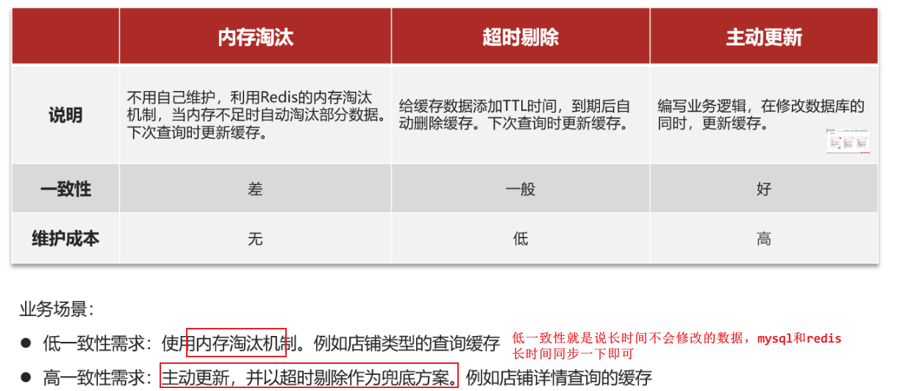
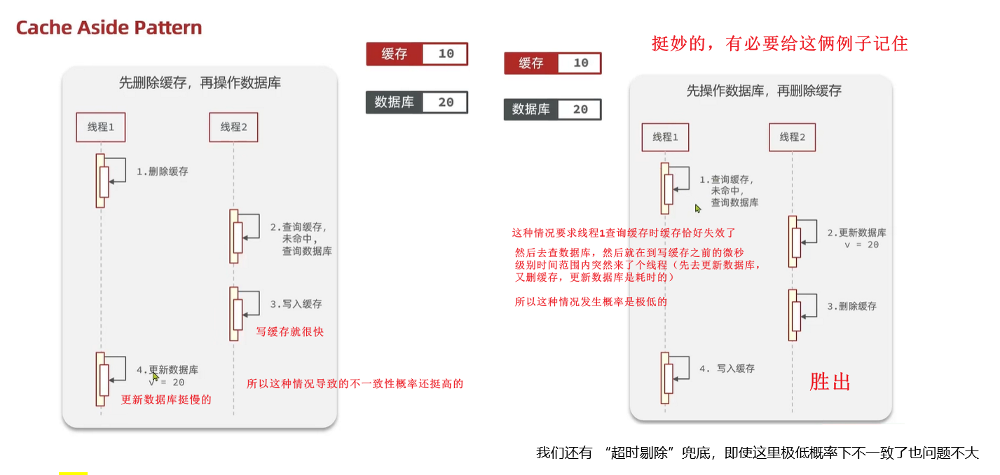
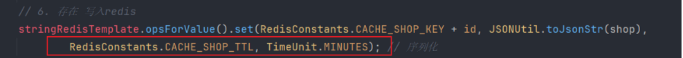
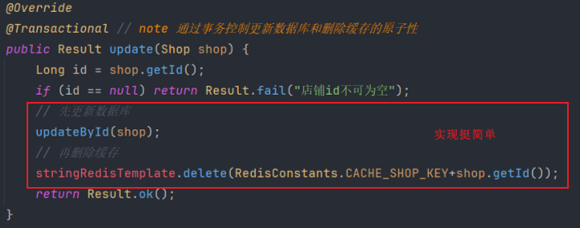
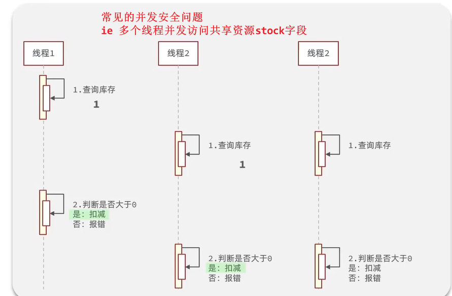
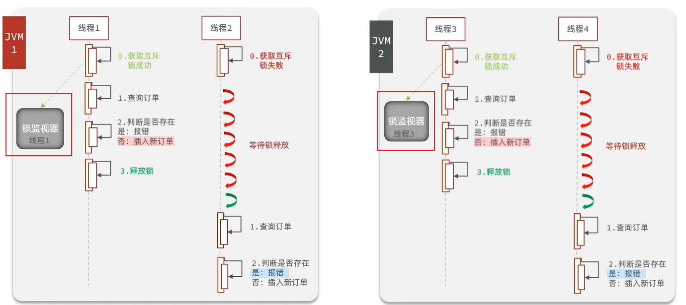
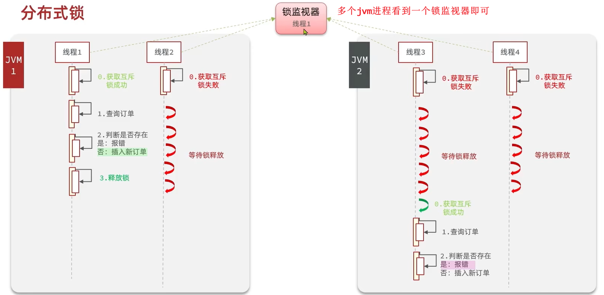
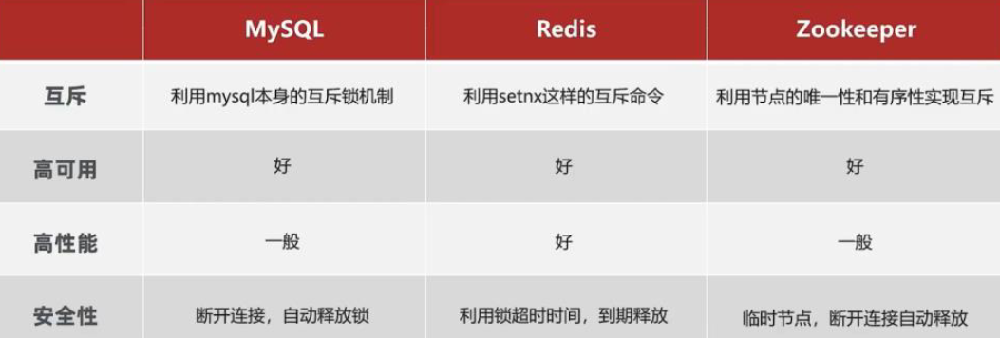
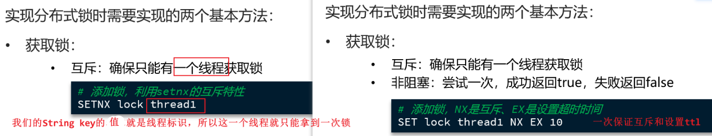
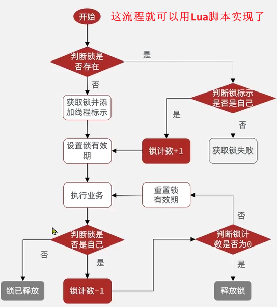

# 黑马点评

- [黑马点评](#黑马点评)
  - [STAR](#star)
  - [alias \& bg](#alias--bg)
    - [数据库表设计](#数据库表设计)
  - [1.登录功能](#1登录功能)
    - [关于session](#关于session)
    - [基于Session的短信登录](#基于session的短信登录)
    - [Q \& A](#q--a)
    - [利用redis解决集群的session共享问题](#利用redis解决集群的session共享问题)
      - [具体实现](#具体实现)
    - [STAR总结](#star总结)
  - [2.缓存数据](#2缓存数据)
    - [标准操作](#标准操作)
    - [缓存更新 / 缓存与数据库的一致性](#缓存更新--缓存与数据库的一致性)
      - [项目实现](#项目实现)
      - [STAR总结](#star总结-1)
    - [解决缓存穿透问题](#解决缓存穿透问题)
    - [解决缓存雪崩问题](#解决缓存雪崩问题)
    - [如何解决缓存击穿问题](#如何解决缓存击穿问题)
      - [互斥锁解法](#互斥锁解法)
      - [逻辑过期解法](#逻辑过期解法)
  - [3. 秒杀](#3-秒杀)
    - [优惠券秒杀下单](#优惠券秒杀下单)
      - [基本的优惠券下单](#基本的优惠券下单)
      - [乐观锁解决超卖问题](#乐观锁解决超卖问题)
      - [悲观锁实现单体一人一单功能](#悲观锁实现单体一人一单功能)
      - [集群环境下并发问题](#集群环境下并发问题)
        - [分布式锁](#分布式锁)
        - [Redission](#redission)
        - [redission是如何实现可重入的](#redission是如何实现可重入的)
        - [redission是如何实现可重试的](#redission是如何实现可重试的)
        - [redission是如何解决锁超时的问题的](#redission是如何解决锁超时的问题的)
      - [异步优化](#异步优化)

## STAR

first of all, STAR法介绍项目

* Situation：背景
* Task：你的任务
* Action：你的具体行动
* Result：结果，最好量化

## alias & bg

驴友社区
描述：该项目是一个创新的旅游项目，为用户提供了丰富的旅游体验和便捷的功能，包括短信登录、景点查询、优惠券秒杀、附近的景点推荐、用户签到、旅行圈好友关注和动态点赞排行榜等功能；

秒享生活
基于Redis+SpringBoot的生活服务类App,实现了短信验证码登录查找店铺，秒杀优惠券，发表点评，关注推送的完整业务流程。

介绍：
我做的这个项目是一个仿大众点评的评价类项目，实现了优惠券秒杀，好友关注，点赞评论，查看附近娱乐场所等功能

介绍：该项目是一个聚焦运动健身领域的点评平台，为运动爱好者提供便捷的功能，包括短信登录、运动场所查询、运动课程优惠券抢购、用户点评等功能

### 数据库表设计

* tb_user: 用户表: id主键, phone, name
  * 存用户基本信息
* tb_user_info: 用户详情表: user_id主键, city, fans, followee, gender, level...
  * 存用户详情信息
* tb_shop: 店铺信息表: id主键, name, type_id(逻辑外键), images, address, score, avg_price
  * 存店铺基本信息
* tb_shop_type: 店铺类型表: id主键, 类型name, sort
  * 店铺类型：健身中心、游泳馆、球类运动(乒乓、羽毛球、篮球、足球、高尔夫)、武术搏击、溜冰、马术、攀岩
* tb_blog：用户探店日记: id主键, shop_id(逻辑外键), user_id(逻辑外键), titile标题, content内容, images
* tb_voucher：优惠券表: id, shop_id, 代金券名title, type(0普通券 1特价券) 
* tb_seckill_voucher: 特价秒杀券表（秒杀券要多填的消息，即秒杀券扩展字段）：库存stock，抢购起止时间
* tb_voucher_order：优惠券的订单表: id主键, user_id(逻辑外键), voucher_id(逻辑外键)
* tb_follow：用户关注表: id, user_id, follow_user_id

## 1.登录功能

使用Redis解决了在集群模式下的Session共享问题，使用双拦截器实现用户的登录校验和权限刷新。
实现手机短信登录功能，并使用Redis实现Session token的存储，解决服务器集群中共享登录用户信息问题；采用双拦截器实现刷新token有效期和鉴权功能。

### 关于session

* Session用来**存放会话内的数据**，本项目中存了验证码、用户信息
* **一个客户端对应一个会话**，该**客户端后续的请求都属于该会话** (有效期内)，因为会带上sessionID，所以服务端将其视为一个会话内
* **不同客户端对应不同会话**（不同的浏览器、设备、用户），这样大家就可以各登录各的，互不干扰
* 一个客户端发送请求给服务端，如果没带sessionid，就意味着是一个**新客户端**，服务端为其创建一个会话，并返回一个sessionid
* 默认情况下session有效期是30min，超时了就要重新登陆
* HttpSession参数会有SpringMVC自动注入，当你发送请求的时候

### 基于Session的短信登录

> 首先，短信验证登录的作用：账号密码登录容易泄露密码，短信登录还可以减少用户的记密码的负担，注册也更方便

* 发送验证码（收到请求 -> 校验phone合法性 -> 生成验证码通过阿里云服务发送）
* 登录与注册（收到账号和验证码请求 -> 校验验证码正确性 -> 查数据库中有无账号，无则注册 -> 将用户user存到session中）
  * 将整个User类对象user都存入session/ThreadLocal
* 其他请求校验登录状态（收到用户请求 -> 从http请求中取出session -> 从session取出user，如不存在则拦截 -> 将user存到ThreadLocal）

**发送验证码**：[code](https://github.com/cs001020/hmdp/blob/master/src/main/java/com/hmdp/service/impl/UserServiceImpl.java#L52-L67)
1. 用户通过post提交手机号到服务器(接口为 `@PostMapping("code")`)
2. 服务端校验手机号的合法性: `regex正则表达式`；if 不合法则返回错误
3. 服务端生成验证码(`code=Random(6)`)，同时**将验证码保存到当前客户端对应的会话session中**(`session.setAttribute("code", code)`)，通过短信的方式将验证码发送给用户
   1. ==**后续验证码也存到redis中**==
   2. 不同客户端对应不同session会话，这个setAttribute()是把k-v数据存到这个客户端的会话中（存在服务端）
   3. 发送操作可以借助阿里云SMS短信服务，暂时不做了，我目前只是模拟了下，手动从后台拿到验证码登录；大概**4分一条**，我也可以做了，很easy


**短信验证码登录、注册**：[code](https://github.com/cs001020/hmdp/blob/master/src/main/java/com/hmdp/service/impl/UserServiceImpl.java#L71-L110)
1. 用户输入验证码，将手机号和验证码一块post给服务端 (`@PostMapping("/login")`)
2. 服务端**从session拿到当前验证码**(`session.getAttribute("code")`)，然后和用户输入的验证码进行校验；如果不一致，校验失败
3. 根据手机号去`tb_user`查询用户，如果用户不存在，则为用户**创建用户信息**并保存
4. **将用户信息保存到session中**(`session.setAttribute("user", user)`)，方便后续获得当前登录信息
   1. 后续这一步改为：==**将用户信息存到redis中**==（通过UUID生成一个随机token作为key）


**校验登录状态**(use interceptor): [code](https://github.com/cs001020/hmdp/blob/master/src/main/java/com/hmdp/interceptor/RefreshTokenInterceptor.java#L30-L50)

1. 用户在发送一些请求(not exclude)到controller时，请求的cookie中会带着sessionID(user的那个)
   1. 后续改为：**用户会带着token访问(在http的`authorization`字段)**
2. 服务端从`HttpServeletRequest`中获得该客户端对应的session`getSession()`，从session中取出"user"的数据(`session.getAttribute("user)`)，如果不存在就拦截返回401
   1. 后续：**服务端从redis中取出token对应的value，判断是否存在**
3. 如果存在，将用户信息存入ThreadLocal


---

### Q & A

**Q: 为什么要把验证码存到session？为何不存到mysql嘞？**
A: 临时性存储：验证码通常是临时的，存储在session中可以确保在用户会话期间有效，且在会话结束后自动失效。存到mysql会增加复杂性，没必要

Q: 为什么要存到redis，不是说好的存到session?
A: 参考session共享问题

**Q: 为何可以用这个session校验登录状态？**
A: 因为只有你登录之后会被赋予一个sessionid，然后查询你这个id就可以找到对应的session，那固然就找到了这个会话； 在会话期间我们想要快速访问用户数据，避免频繁查询数据库，主要是后续的权限校验需要对比；因为这个session

**Q: 为什么要把用户信息存到ThreadLocal？为什么不直接去session中或者mysql取？**

> bg: **==每个用户请求都会交给Tomcat线程池中的一个线程来处理==**，请求处理完成后，回收到线程池，准备好处理下一个请求。

A: 首先用户信息会经常使用(比如用户下单时，我们需要获取用户id，然后写到订单表中)，所以我们要特别存起来
1. **线程安全**：ThreadLocal可以在多线程环境中保证每个线程都能访问到自己独立的用户信息，避免了多线程冲突。
2. **访问速度**：直接取session中取 或从mysql数据库中取 速度要比从ThreadLocal中取慢得多
3. **避免显式传参**，简化代码：使用ThreadLocal可以避免在多个方法之间显式传递用户信息，使得代码更加简洁和易于维护。
   1. 一个请求通常由多个过滤器、拦截器、服务层方法等共同处理，我们当然应该可以在收到的时候拿个变量接收，然后通过参数传递下去，但比较麻烦

> 至于ThreadLocal的底层细节，请见`JUC.md`

**Q: 为什么登录校验要写在拦截器中？**
A: 项目中很多Controller/业务需要校验用户的登录，我们不可能在每个业务中都写校验逻辑;
SpringMVC中，请求会先走interceptor组件的`preHandle()`，成功后再到达相应的controller, 你可以配置所有请求都走拦截器，也可以通过`execludePathPatterns()`排除路径，比如我们排除了`/shop/**`看看商铺肯定是不用校验登录的；

因此我们把用户校验登录的功能交给拦截器做

> 但是需要把拦截器中拿到的用户信息通过ThreadLocal传递到各个Controller层去，传递的过程中还需注意线程安全问题。


ok，到这儿基于session登录结束，但有集群的session共享问题

---

### 利用redis解决集群的session共享问题

**问题：** ==何所谓session共享问题?==
**多台tomcat并不共享session空间，当切换到不同tomcat时，数据会丢失。**
详：每个tomcat中都有一份自己的session, 假设用户第一次请求被负载均衡到了第一台tomcat，并且把user信息存放到第一台服务器的session中，但第二次请求被负载均衡到第二台tomcat，那么在第二台服务器上，肯定没有第一台服务器存放的session，所以校验登录状态就无法从session中取出user信息了

> tomcat暂且就理解为webserver吧

解决方案A：

* **Session拷贝**：当任意一台tomcat的session修改时，都会同步给其他的Tomcat服务器的session
  * 问题：冗余 服务器压力大 拷贝延迟

解决方案B (Ours)：

**使用Redis实现共享session登录，主要是为了解决在分布式系统中，用户session无法共享的问题**。

因为传统的session是存储在服务器端的内存中，当请求分发到不同的服务器时，就无法获取到用户的session信息。而Redis作为一个内存数据库，具有高性能、高并发、持久化等特点，非常适合用来存储和共享session。

redis替代session实现登录注册功能的好处：

* **分布式**支持与扩展性：**Redis更适合分布式系统**，很容易扩展。在多服务器环境下，Redis可以作为中央session存储，而传统内存session难以在多服务器间共享。
* **持久化**：Redis的多种持久化方式可将数据持久化到磁盘(RDB, AOF)；而session数据会因为系统故障或者重启而丢失
* **灵活**：可以用各种数据结构存储会话数据，eg 字符串、哈希表、列表等

#### 具体实现

可以用String来存储，也可以用Hash结构存储，占用更少内存

**Q: 我们用什么key？**
A: 验证码的key: `login:code:{phone}`
用户信息的key: `login:token:{Radom_UUID}`；通过UUID随机生成; 可以用手机号，但有点敏感

**Q: 过期时间怎么设置的？**
A: 验证码2min, 用户信息30min(改为7天吧)并且**每次请求来了刷新从新即使**

**Q: 如何状态权限 / Token续期的？**
A: 第一个Interceptor拦截一切路径，刷新token的有效期，然后全部放行；第二个Interceptor拦截需要登录的路径

---

### STAR总结

**双重拦截器完成登录状态的刷新**

**S**: 用户请求进入之后，对于一些业务比如帖子发布，优惠券购买，我们需要判断这个用户是否登录了，登录了放行，没登录则拦截。但是对于其他一些业务比如说浏览店铺，对于未登录的用户我们也不需要拦截。
**T**: 但是这里还存在一个token过期的问题，我们一般会给这个token设置一个过期时间。我设置的是7天，如果过期了，用户就会从登录状态变为未登录的状态，但是如果这七天内用户再次登录了，进行了一次查询，我们应该给这个token进行一次续期。
**A**: 我设置成了两层拦截器，**第一层拦截器拦截所有请求**，如果token存在，则给这个**token刷新**，进行一个续期操作。如果**token不存在则直接放行交给下一层判断**。接下来这些请求会到达第二个拦截器，这个拦截器只拦截一些必须登录操作，只有token存在才可以执行（token不存在说明校验不通过）。
**R**: 所以，我设置两层拦截器，第一层拦截器拦截所有接口的请求，token存在则对token进行一个刷新，不存在直接放行。第二层拦截器拦截那些必须要登录才能完成的操作。


> 第二个Interceptor会排除一些无需登录校验的路径 `eg /login, /shop/**`  [code](https://github.com/cs001020/hmdp/blob/b9026b6da2274f4fc7f419aceb6d84c8e24222b7/src/main/java/com/hmdp/config/MvcConfig.java#L21-L44)

**Q: 为何要设置两个Interceptor，不能在第一个Interceptor中遇到不存在token时直接拦截掉吗？**
A: 不能，因为有一些功能不需要校验，比如浏览店铺，登录入口，所以你如果在第一个Interceptor拦截过滤掉，那这些功能就没啦。所以由于我们想过滤一部分请求不进行校验，然后我们又想对所有请求进行token刷新，故而需要两个Interceptor做不同的拦截


## 2.缓存数据


推荐观看[总结](https://www.bilibili.com/video/BV1cr4y1671t?t=1.5&p=47)

使用redis作为mysql的缓存有很多好处，详见 [redis.md](https://github.com/haooxia/CSJourney/blob/main/database/redis.md)

---

本来我们查店铺信息都是去数据库中查询，很慢，所以考虑使用redis缓存店铺信息。
```java
@GetMapping("/{id}")
public Result queryShopById(@PathVariable("id") Long id) {
    //这里是直接查询数据库
    return shopService.queryById(id);
}
```

### 标准操作

查询数据库前先查redis缓存，如缓存命中，则直接返回，否则，再查询mysql数据库，顺便**将数据存入redis**。

**业务中**：
* 用户post一个**店铺id**来查询，先去redis查缓存，然后判断是否命中
  * 命中直接返回，结束；
  * 未命中，根据id查数据库，然后判断查询结果是否命中
    * 若命中，将数据写入redis再返回
    * 若不存在，直接返回404报错

**问题**：未考虑 **==缓存更新==**；如果已缓存了数据到redis，此时若数据库更新，reids就是旧数据了

{width=90%}


### 缓存更新 / 缓存与数据库的一致性

> 理论详见 [redis.md](https://github.com/haooxia/CSJourney/blob/main/database/redis.md)

缓存更新策略分为：==内存淘汰、超时剔除和主动更新==（一致性逐渐增高，维护成本也逐渐增高）

{width=80%}
> **本项目中高一致性需求：店铺详情信息，以及优惠券信息**


主动更新又分为：==Cache-Aside模式，Read/Write Through模式, Write Behind Caching模式==

---

**Q: 为什么是删除缓存而非更新缓存？**
A: 如果每次修改数据库都更新缓存，这样会有很多次无效写入redis操作，就，你每次都更新，可也没人来访问，何必呢？不如直接删掉，下次别人访问了再加载一次即可（懒惰、延迟加载

**Q: 如何保证缓存和数据库的操作的同时成功或失败？原子性**
A: 本项目是单体的，把缓存与数据库操作放到一个事务里即可；分布式系统中可采用分布式事务, eg seata

**Q: 为什么要先操作/更新mysql数据库再删除redis缓存？能否反过来？**
A: 不能，反过来发生数据不一致的概率高得多，原因左图（你删除了缓存，还没更新数据库之间，另一个线程查数据库然后更新了缓存，然后你才更新数据库，此时二者不一致了）：


> * 右侧正常情况是：线程2: 更新数据库->删缓存；-> 线程1: 查缓存未命中 -> 写入缓存
> * 右侧的发生概率是极低的，但也可能发生，所以我们设置超时时间使用**超时剔除作为兜底**（即使我写缓存写错了，超时了自动会删掉

Q: 为什么要采用Cache Aside？write/read through 及 write back区别？

Q: Cache Aside名称的由来?

---

Q: 什么是**延迟双删**(Lazy Double Deletion)？
A: 分布式系统中数据库和缓存数据保持**最终一致性**的常用策略，并非强一致性；

[reference-1](http://t.csdnimg.cn/euldM)
[reference-2](http://t.csdnimg.cn/nF6c9)

Q: **为何需要延迟双删?**

* 方案一：先更新数据库，再删除redis缓存：当请求1执行完更新数据库操作后，**还未来得及删除redis**，此时 **==请求2查询到并使用了redis中的旧数据==**。
* 方案二：先删除redis，再更新数据库：当请求1执行完删除redis后，还未进行更新数据库操作，此时请求2**查询到了数据库的旧数据并写入了redis**。然后你跑去更新数据库，导致二者不一致。

Q: **如何实现延迟双删**?
A: 第三种方案：

* **先删除redis**：确保接下来的读操作会从数据库中读到最新数据，避免读到旧数据（解决了先更新数据库，再删除缓存中"读到redis失效的数据"的问题）
* **再更新数据库**：（在删除redis到更新好数据库之间可能有其他线程查到了数据库旧数据，并写入redis -> 故而最后再删除一次redis）
* **延迟N秒**：给数据库足够的操作时间，确保数据已经持久化到数据库
* **再删除一次redis**

<!-- 注意: N > 请求2将数据库旧数据写入redis的时间 -->

> "延迟双删" 相比于 "先更新数据库再删除缓存": **数据一致性要求更高，性能低一些**

Q: 如何确定延迟的时间？
A: 如果数据库的更新操作通常很快，可以选择较短的延时时间，比如几百毫秒或一秒钟

**Q: 延迟双删一定保证一致性了吗？**
A: 没有，线程1删除缓存，更新数据库之前，线程2读取数据库并写入缓存，然后线程1更新好数据库，在删除redis缓存之前，线程3过来会读到redis中的旧数据。

Q: 为什么要延迟N秒？

#### 项目实现


==**主动更新（Cache Aside旁路缓存策略） + 超时剔除**==

* **读操作**：根据id查询商铺时，先查缓存，命中直接返回，未命中再去查数据库，将数据库结果写入缓存，**并设置超时时间ttl**；（30min）
  *   
* **写操作**：根据id修改店铺时，**先**修改/更新数据库，再**删除**缓存（同时开启事务保证两个操作的原子性
  *   

代码分析：当我们修改了数据之后，把缓存中的数据进行删除，查询时发现缓存中没有数据，则会从mysql中加载最新的数据，从而避免数据库和缓存不一致的问题。
由于此项目是单体架构的项目，更新数据库操作和删除缓存操作都在一个方法里，需要通过**事务**去控制，来保证原子性。**但如果是分布式系统：在更新完数据库之后，删除缓存的操作不是自己来完成，而是通过mq去异步通知对方，对方去完成缓存的处理!!**

#### STAR总结

利用Cache-Aside解决数据库与缓存的数据一致性问题

> from ChatGPT:

Situation (S): 用户频繁查询店铺信息，导致直接访问数据库的查询速度较慢。为了解决这个性能瓶颈，决定采用Redis缓存来加速查询。然而，随着数据库的不断更新，Redis中的缓存数据可能与数据库中的数据不一致，导致数据过时的问题。这种情况下，必须找到一种有效的缓存更新策略来保证数据一致性。

Task (T): 需要设计并实现一种缓存策略，在提高查询性能的同时，保证数据库与缓存数据的一致性，尤其是在更新店铺信息时，确保缓存与数据库保持同步。

Action (A):

读取操作：在用户查询店铺信息时，首先查询Redis缓存。如果缓存命中，则直接返回数据；如果未命中，则查询MySQL数据库，并将查询结果写入缓存，同时设置缓存的超时时间（如30分钟），以减少缓存过期造成的一致性问题。

写入操作：在用户更新店铺信息时，首先更新MySQL数据库，然后删除Redis中的对应缓存。为了确保操作的原子性，将数据库更新和缓存删除操作放在同一个事务中。如果项目是分布式系统，则通过消息队列（MQ）异步通知其他服务进行缓存删除。

Result (R): 通过采用Cache-Aside模式并结合超时剔除机制，成功解决了数据库与缓存之间的数据一致性问题。该方案在确保高性能查询的同时，有效避免了缓存和数据库数据不同步的情况，提高了系统的可靠性和用户体验。

### 解决缓存穿透问题

> 缓存穿透及Bloom filter理论详见 [redis.md](https://github.com/haooxia/CSJourney/blob/main/database/redis.md)

**缓存穿透**问题：客户端请求的数据在缓存和数据库中都不存在，导致每次查询都会绕过缓存直接打到数据库，对数据库造成巨大压力（攻击数据库的好办法）；即**大量无效请求直接打到数据库**
> Cache Penetration 其实翻译为'渗透'挺好（不怀好意者通过这个漏洞避开redis渗透到mysql

  


解决方案：**布隆过滤器 + 缓存空对象**

{width=60%}

* 前端提交店铺id，首先会经过Bloom Filter计算查询是否存在该id（布隆过滤器内提前计算存储了数据库中所有的商铺id），如果bloom说没有则一定没有，直接拒绝，避免访问缓存和数据库，如果bloom说有则大概率存在，则继续查询缓存和数据库
  * 如果缓存和数据库都没找到的话，此时我们再去**缓存空对象**来防止短时间内的重复穿透（TTL 2min）


Q: bloom filter是如何实现的?
A: please read `redis.md`
Q: 还有哪些解决缓存穿透的方法（主动和被动方案）?
A: please read `redis.md`

---

ChatGPT总结：

* Situation: 客户端发起请求，查询的数据在缓存和数据库中都不存在，导致每次查询都直接打到数据库。
* Task: 解决缓存穿透问题，以减少对数据库的压力。
* Action: 首先通过布隆过滤器判断请求的数据是否存在，如果不存在则直接拒绝请求，避免访问缓存和数据库；同时使用缓存空对象来防止短时间内的重复穿透。
* Result: 成功减少了无效请求对数据库的直接攻击，保护了数据库性能。

### 解决缓存雪崩问题

> 理论详见 [redis.md](https://github.com/haooxia/CSJourney/blob/main/database/redis.md)

本项目给不同的key添加随机值（比如在增量0-10min中浮动）

Q: 还有哪些缓存雪崩的解决方案?
A: `redis.md`

### 如何解决缓存击穿问题

> 其实**项目亮点**可以说：利用互斥锁和逻辑过期这两种方案解决缓存击穿问题；确实还挺不错的

指缓存中**某个热点key过期的瞬间**，大量并发请求直接打到数据库，干废数据库

两种解法：互斥锁法

  

#### 互斥锁解法

原方案：从缓存中查询不到数据后直接查询数据库
**现方案**：查询缓存之后，如未查到，尝试获取互斥锁，然后**判断是否获得互斥锁**，没拿到就休眠50毫秒并重新查缓存(看看这时候拿锁的哥们重建好了没，好了就直接拿缓存，没好再歇息50ms)，拿到锁的哥们就根据id查询数据库，并重建/更新缓存，最后释放锁。

实现 [code](https://github.com/cs001020/hmdp/blob/b9026b6da2274f4fc7f419aceb6d84c8e24222b7/src/main/java/com/hmdp/service/impl/ShopServiceImpl.java#L81-L108)

{width=80%}

  


> **获取锁成功之后还需要再次查询redis缓存是否命中做Double Check**，因为此时你获取的锁可能是别人重建结束后释放的锁（也就是你判断缓存没命中之后别人释放了），其实此时如果缓存重建成功的话，你不应该再去拿锁重建

利用redis的String的指令`setnx lock 1 获取锁, del lock释放锁`

  
> 锁就是redis中的一个key；`setIfAbsent`即为`setnx`，ttl=10s (比业务长个几倍啥的就行)
> **key使用店铺id**，即每个店铺有一把锁

---

**Q: 你这其他线程每隔50ms就查询一下，多耗费cpu资源啊？**
A: 优化，利用指数退避算法：`50*2, 50*4, 50*8, 50*16...` 

**Q: 这个互斥锁用什么实现？**
A: Redis的**分布式锁**`setnx`, set if not exists, 当key不存在时设置并返回true(获得锁), 当key存在时返回false(表示锁被占用)，同时我们设定一个过期时间ttl，防止服务崩溃等异常原因导致锁无法释放。
还可以用zookeeper的分布式锁

**Q: 为什么不用synchronized?**
A: synchronized没拿到锁会一直阻塞等待直到获取锁，而我们没拿到锁之后并不是要去一直拿锁，让一个线程拿锁重建缓存就完事儿了；synchronized的话别人拿到重建完释放锁后，你又把锁拿来，没必要啊。即**synchronized不满足我们这种没拿到锁之后的自定义行为**。
> 我们这里拿到锁和没拿到锁之后的行为是需要我们**自定义**；我们定义获取失败时休眠并重试，这应该比你一直阻塞好的多吧。

**Q: 为什么不用ReentrantLock？**
ReentrantLock可以通过非阻塞方式`tryLock()`获取锁，如果锁不可用，不会阻塞，可以执行其他逻辑，所以**理论上我认为ReentrantLock.trylock()在单体项目中是可以用的**。。。但分布式场景下用不了


Q: 还有什么分布式锁？区别是什么？

Q: 我记得有个redission？TODO


<!-- 你的并发效果怎么样呢？
我采用JMeter进行并发压力测试：日志中就查了一次数据库，证明在如此高并发的场景下我们并没有打到数据库上（1000个线程并发运行，Ramp-up时间5秒（打到指定线程数所需时间，用于控制启动速度，即5s内平均每秒启动200个线程）
> 这jmeter测试的跟缓存击穿没啥关联啊，只能说证明了我们的互斥锁没问题：即一个线程拿锁去查数据库，即就查了一次数据库，其他都是查缓存 -->

#### 逻辑过期解法

> 代码见黑马笔记，我这里暂时选择写使用互斥锁解决缓存击穿问题了，要用逻辑过期解法的话再回去看看
> 逻辑过期涉及到的东西也蛮多的：setnx锁，线程池

**需求：修改根据id查询商铺的业务，基于逻辑过期方式来解决缓存击穿问题**

原方案：从缓存中查询不到数据后直接查询数据库
**现方案**：用户查缓存（**理论上都命中**，因为我们没删除，没命中的(穿透问题)我们提前用布隆过滤器过滤了），命中后将value取出，**判断value中的过期时间是否满足**，如果没有过期，则直接返回redis中的数据，**如果过期，尝试获取锁，拿到锁的那一个线程会开启独立线程去执行缓存重建**，不管拿没拿到锁，自己不负责重建，自己都会直接返回旧数据用着，重构完成后释放互斥锁。
> 因为只需要一个线程去开启一个独立线程，故而需要竞争锁

  
> 我的bloom filter稍微和这里未命中不太一样 没了未命中 直接前面过滤了；不重要，这里关注击穿问题

我们通过jmeter并发测试：发现就执行了一次缓存重建，在重建完成之间，直接返回旧的数据，重建成功之后返回新的数据（确实妙

Q: 为什么要开启独立线程做缓存更新而非自己更新？
A: 自己更新那不就跟互斥锁解法类似了，自己需要等更新好才能用，异步更新的话，自己直接拿个旧的就行了


<!--    -->

## 3. 秒杀

### 优惠券秒杀下单

秒杀业务：

当用户发起请求，此时会请求nginx，nginx会访问到tomcat，而tomcat中的程序，会进行串行操作

**其中核心业务是：扣减库存+创建订单**

为了避免**超卖**，我们需要判断库存是否充足（所以要查库存
为了限制一个用户对一种优惠券只能下一单，加入**校验一人一单**（就是要看看数据库有没有该订单，所以要查订单，查订单之前要利用获取分布式锁
> 这些都是购买资格的判断

1. 判断购买资格
   1. 根据id查询优惠卷
   2. 判断秒杀库存是否足够
   3. 查询订单
   4. 校验是否是一人一单
2. 真正的下单过程
   1. 扣减库存
   2. 创建订单

在这六步操作中，又有很多操作是要去操作数据库的，而且还是一个线程串行执行， 这样就会导致我们的程序执行的很慢，所以我们需要**异步程序执行**，那么如何加速呢？

#### 基本的优惠券下单

前端提交优惠券下单请求(post id), 查询优惠券的信息，看看秒杀是否开始结束，看看库存是否充足，然后才扣减库存(`tb_seckill_voucher的stock`)，创建订单，插入数据库`tb_voucher_order`；
{width=80%}

```java
// 核心代码
// 校验省略...
if (voucher.getStock() < 1) // 库存不足
    return Result.fail("库存不足！");
// 扣减库存
boolean success = seckillVoucherService.update()
        .setSql("stock= stock -1")
        .eq("voucher_id", voucherId).update();
if (!success) {
    //扣减库存
    return Result.fail("库存不足！");
}
// 创建订单省略...
```

标准实现的问题：当我们使用jmeter用200个用户线程并发请求一起抢购（然而我们的优惠券stock=100），理论上只会下单100次，**然而**，我们发现执行完毕stock变成了-9!而且订单数量是109单，此乃**超卖现象**，不可接受，我商家亏麻了。

原因：库存只有1时，多个线程一块查询认为还有库存，然后就都去扣减了
  

#### 乐观锁解决超卖问题

* 定义：**超卖**问题是在**高并发环境**下，eg 电子商务和股票交易等秒杀场景中出现的一种数据不一致性问题；指销售的商品数量超过了实际库存数量
* 原因：多个线程操作共享资源，且代码有好几行，然后**多个线程难以避免出现穿插**；**并发引起的资源竞争没有加锁,导致运行时序不可控**；但请注意超卖是个概率问题，有概率发生而已

首先悲观锁synchronized, ReentrantLock肯定可以解决超卖问题，但悲观锁性能不好，不适合高并发场景

所以我们采用乐观锁，可以采用**版本号法**，可以给stock加个version字段，每次修改version++，提交时看看version对不对即可，但没必要；我们用**CAS法**，利用stock字段本身即可，
> 这里不存在ABA问题，因为该场景下stock只会--，不会++（stock数量是我们开始就设定好了的

```java
// 扣减库存
boolean success = seckillVoucherService.update()
        .setSql("stock= stock -1")
        .eq("voucher_id", voucherId)
        .eq("stock", voucher.getStock()) // 等号 -> 改进为gt("stock", 0);
        .update();

// 等价于
UPDATE seckill_voucher
SET stock = stock - 1
WHERE voucher_id = 'voucherId的值'
  AND stock = 'voucher.getStock()的值';
```

理论上应该是等号，就是你先查strock库存，然后你修改时不一样的话，那就是别人改了，我就得请求失败，但这样**太严格了, ==成功率太低==**，jemeter大多数请求的线程都挂掉了，别人确实改了，但依然是stock>0时我应该是请求成功的。所以我们**改进一下CAS：** `where stock > 0;`即可，现在超卖问题解决，200个请求线程刚好挂掉100！

<!-- #### 乐观锁解决 单体下一人多单超卖问题 -->

#### 悲观锁实现单体一人一单功能

问题：我们是卖优惠券的，但此时一个用户可以无限量抢单（利好黄牛），所以需要加一些限制逻辑。

  
秒杀扣减库存逻辑：判断是否在秒杀时间范围内，判断库存是否充足，**判断这个用户是否下过这个订单（根据用户id和优惠券id）**，若没有则扣减库存

```java
// 5.一人一单逻辑
Long userId = UserHolder.getUser().getId();
int count = query().eq("user_id", userId).eq("voucher_id", voucherId).count();
// 5.2.判断是否存在
if (count > 0) // 用户已经购买过了
  return Result.fail("用户已经购买过一次！");

//6，扣减库存
boolean success = seckillVoucherService.update()
        .setSql("stock= stock -1")
        .eq("voucher_id", voucherId).update();
if (!success) {
    //扣减库存
    return Result.fail("库存不足！");
}

//7.创建订单
//...
```

jmeter 200个请求测试结果发现一个人不止下了1单，我测的下了10单！
原因同上：多个请求同时判断count<=0, 所以同时来扣库存，故而请求乐观锁or悲观锁；
由于**乐观锁仅适用于插入数据的场景**，该场景不适合，所以悲观锁**锁住{查询count -> 扣减库存 -> 创建订单}**整个过程

<!-- > 前面那个超卖问题加的乐观锁也被这里的悲观锁包裹了啊？那要那个乐观锁还有啥用 -->

我们是**对用户userId加锁**，**而非锁住this(即不要锁这个方法，这样不同用户也会串行执行，而我们指向让同一用户串行执行，减小锁粒度**)，保证同一用户只能串行执行块内内容`synchronized(userId.toString().intern())`

到这儿，我们在用jemter测试，发现200个请求就成功了一次！奈斯

#### 集群环境下并发问题

> **虽然我们是单体项目，不过我们可能面临的并发度很高，所以有必要的话我们会把一个项目部署到多个机器，从而形成一个==负载均衡的集群==，而集群模式下synchronized会出现一些问题。**
> 我们在idea搞两个启动项，idea会给我们搞两台tomcat服务器，端口不同，形成了集群；然后我们使用nginx做了下负载均衡到两个ip+port

**Q: synchronized在集群下为什么会出现问题?**

A: 在集群环境中，多个Tomcat实例各自运行在独立的JVM中。虽然服务器A和服务器B的线程可能使用相同的代码和锁对象名称，但由于它们的**锁对象是不同**的，因此无法实现跨 JVM 的互斥。
具体来说：
服务器A的线程1和线程2使用同一个锁对象，可以互斥。
服务器B的线程3和线程4也可以互斥，但无法与服务器A的线程1和2互斥。
> 这里的**锁对象就是一个字符串对象**`userId.toString().intern()`，集群下这玩意儿是不同的，我们的字符串常量池都不是一个，怎么可能相同嘞

{width=80%}

所以我们要想办法让多个jvm用同一把锁

所以我们不用synchronized了，我们采用Redis分布式锁：

第一：我们可以自己设计redis锁，通过set命令
第二：我直接就用了redission锁，何必造轮子呢，知道底层就行了

---

##### 分布式锁

**分布式锁**：满足分布式系统或集群模式下**多进程可见**并且**互斥**的锁。

  


分布式锁特点：
* 可见性：多个jvm进程都能看到相同的结果；
* 互斥：互斥是分布式锁的最基本的条件，使得程序串行执行
* 高可用：程序不易崩溃，时时刻刻都保证较高的可用性

  

如何基于redis实现分布式锁
* `set lock thread1 NX EX 10`: NX保证互斥，EX设置过期时间，这一条指令完成两个功能，**原子操作**
  * 即一个`set` = `setnx` + `expire`

##### Redission

基于setnx实现的分布式锁存在下面的问题：

* **不可重入**：可重入是指同一线程可以多次获取同一把锁，避免死锁；synchronized和Lock锁都是可重入的。
  * redission利用hash结构记录线程id和重入次数实现可重入

* **不可重试**：目前的分布式只能尝试一次就返回false，而有的场景需要重试获取锁/**阻塞的**
  * 利用发布/订阅机制PubSub(redis)实现智能的等待、唤醒、重试

* **超时释放**: 我们在加锁时增加了过期时间，这样的我们可以防止死锁，但是如果卡顿的时间超长，虽然我们采用了lua表达式**防止删锁的时候，误删别人的锁**，但是毕竟没有锁住，有安全隐患
  * 利用watchDog，每隔一段时间`releaseTime/3=10s`，重置超时时间

* **主从一致性**: 如果Redis提供了主从集群，当我们向集群写数据时(把锁给他)，主机需要异步的将数据同步给从机，而万一在同步过去之前，主机宕机了(没拿到锁)，就会出现死锁问题。
  * 解决方法先不看了 [link](https://www.bilibili.com/video/BV1cr4y1671t?t=60.1&p=68)

---

我们利用最基本的redission分布式锁即可解决一人一单问题：

tryLock(waitTime, leaseTime, TimeUnit)
* waitTime: 尝试获取锁时等待的最长时间，期间会不断重试；default=-1，即失败立马返回，不等待
* leaseTime: 获取锁的有效时间，到点了就自动释放，为了防止死锁；即ttl，defalut=30

```java
@Resource
private RedissonClient redissonClient;

RLock lock = redissonClient.getLock("lock:order:" + userId);
//获取锁对象
boolean isLock = lock.tryLock(); 
// 可以传入三个参数： 最大等待时长（期间会重试），自动释放时间，时间单位
lock.unlock();
```

##### redission是如何实现可重入的

  

我们本来通过String的指令`set keyName valueName nx ex`自定义锁，来确保一次只能有一个线程获取锁。
> 应该是：keyName是userId，valueName是线程标识`Thread.currentThread().getId();`，这样也就保证了一个用户只能有一个线程拿到锁

但它是不可重入的，因为nx保证了互斥性，而可重入是**允许你一个线程多次获取同一把锁**，而nx是不允许的。

ReentrantLock是如何实现可重入的？基本原理：如果请求获取的锁已经有人的情况下，检查一下是不是自己这个线程，是的话，也让获取锁成功，并将**计数器state累加记录重入的次数**；销毁时减1，等到计数器为0时才删锁。
> 这个state是volatile的
> 很像cpp的一种智能指针


所以可以模仿，采用Hash类型，Key记录**锁名称**，field记录**线程标识**，value记录**计数器**

  
> Lua是一门编程语言，Redis提供了Lua脚本的功能，你可以在一个Lua脚本中编写多条redis命令，可以确保多条命令执行的**原子性**
> 利用Hash结构实现的redis可重入锁的Lua脚本参考：[link](https://www.bilibili.com/video/BV1cr4y1671t?t=780.5&p=66)

* **实际上redission自带的默认的tryLock()和unlock()底层走的就是这一段Lua脚本！就是可重入的**

##### redission是如何实现可重试的

如果我们设定了waitTime=1，则1s内会重试，但并不是一直轮询重试！精髓在于：利用了消息订阅机制，等你释放了再去尝试获取锁，cpu友好很多。

  


##### redission是如何解决锁超时的问题的

Q: 什么是锁超时？
A: 我获取锁成功，锁有个ttl，但我业务阻塞了，还没执行完业务，锁ttl就到期了；这时候其他线程来获取了锁，就出问题了；即我们必须保证锁是因为我业务执行完毕而释放

leaseTime=-1默认时，默认值是30s，即30s会后自动释放；默认-1才有看门狗机制，如果自己设定了leaseTime则没有看门狗机制

watchDog看门狗机制：获取锁成功之后，开启一个定时任务，这个任务每隔一段时间(`releaseTime/3=10s`)就会去重置锁的超时时间，ttl满血复活

#### 异步优化

[link](https://www.bilibili.com/video/BV1cr4y1671t?t=8.6&p=69)

