# hmall

- [hmall](#hmall)
  - [begin](#begin)
    - [单体架构 vs. 微服务架构](#单体架构-vs-微服务架构)
      - [有什么拆分原则/目标](#有什么拆分原则目标)
    - [SpringCloud](#springcloud)
      - [你用过那些微服务组件 / 概括](#你用过那些微服务组件--概括)
  - [一、注册中心](#一注册中心)
    - [为什么本项目需要注册中心](#为什么本项目需要注册中心)
    - [注册中心功能](#注册中心功能)
    - [注册中心原理](#注册中心原理)
      - [负载均衡算法 load balancer](#负载均衡算法-load-balancer)
  - [二、远程调用](#二远程调用)
    - [HTTP vs. RPC](#http-vs-rpc)
    - [Feigh vs. Dubbo](#feigh-vs-dubbo)
    - [Feign是什么](#feign是什么)
    - [Feign及LoadBalancer工作原理](#feign及loadbalancer工作原理)
      - [修改LoadBalancer](#修改loadbalancer)
    - [常见负载均衡算法](#常见负载均衡算法)
      - [一致性哈希算法](#一致性哈希算法)
    - [服务端/七层负载均衡 vs. 客户端负载均衡](#服务端七层负载均衡-vs-客户端负载均衡)
  - [三、网关](#三网关)
    - [为什么需要网关](#为什么需要网关)
    - [什么是网关](#什么是网关)
      - [网关的功能](#网关的功能)
      - [Spring Cloud Gateway核心概念](#spring-cloud-gateway核心概念)
      - [Spring Cloud Gateway内部原理](#spring-cloud-gateway内部原理)
    - [我做了什么](#我做了什么)
      - [配置网关路由规则](#配置网关路由规则)
      - [网关登录校验](#网关登录校验)
        - [JWT单点登录校验流程](#jwt单点登录校验流程)
        - [JWT多点登录校验的问题](#jwt多点登录校验的问题)
        - [基于网关实现JWT多点登录校验](#基于网关实现jwt多点登录校验)
  - [四、配置管理](#四配置管理)
    - [为什么需要配置管理？](#为什么需要配置管理)
    - [配置中心的原理](#配置中心的原理)
    - [项目中做了什么](#项目中做了什么)
  - [五、服务保护](#五服务保护)
    - [服务雪崩问题](#服务雪崩问题)
    - [服务雪崩解决方案](#服务雪崩解决方案)
    - [利用Sentinel解决服务雪崩](#利用sentinel解决服务雪崩)
  - [分布式理论](#分布式理论)
    - [CAP定理](#cap定理)
    - [BASE理论](#base理论)
  - [六、分布式事务](#六分布式事务)
    - [为什么需要分布式事务](#为什么需要分布式事务)
    - [如何解决分布式事务](#如何解决分布式事务)
    - [Seata架构及原理](#seata架构及原理)
    - [XA模式](#xa模式)
    - [AT模式 (Seata default)](#at模式-seata-default)
      - [解决AT的脏写问题](#解决at的脏写问题)


TODO: 最后的视频笔记中有讲解如何切换负载均衡算法（我可以改造为加权轮询或者一致性哈希算法

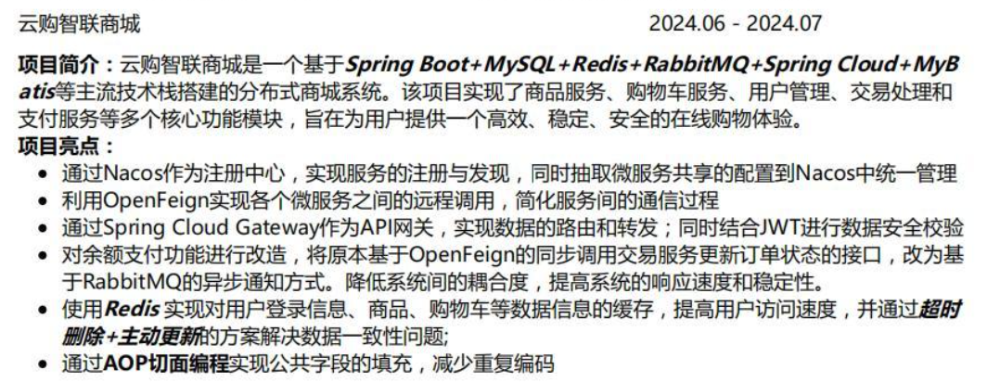  

---

* 通过Nacos作为注册中心，实现服务的注册与发现
* 利用OpenFeign实现各个微服务之间的远程调用，简化服务间的通信过程

## begin

### 单体架构 vs. 微服务架构

单体架构(monolithic structure): 整个项目中所有功能模块都在一个工程中开发；项目部署时需要对所有模块一起编译、打包；所有的组件（如用户界面、业务逻辑和数据库）都紧密耦合在一起，通常在同一个代码库中进行开发和部署。

* 优点
  * 简单，易于理解和开发，适合小型项目
  * 方便运维部署
  * 资源共享，节约成本
* 缺点
  * 团队协作成本高：不同模块的代码之间物理边界越来越模糊
  * 系统可用性差：某个模块的故障可能导致整个应用崩溃；**一些热点功能会耗尽系统资源**，导致其它服务低可用

微服务架构将应用程序拆分为多个小型、独立的服务，每个服务专注于特定的功能。服务之间通过API进行通信，能够独立部署和扩展。
> 本项目中：把商品、用户、购物车、交易等模块拆分，可以交给不同的团队去开发

* 缺点：
* 系统复杂性增加：一个服务拆成了多个服务，整体系统的复杂性增加，需要处理服务之间的**通信、部署、监控和维护**等方面的复杂性
* 服务间通信开销：微服务之间通过网络进行通信，传递数据需要**额外的网络开销和序列化开销**，可能导致性能瓶颈和增加系统延迟
* 数据一致性和事务管理：**每个微服务都有自己的数据存储**，**数据一致性和跨服务的事务管理**变得更加复杂
* 服务治理和版本管理：随着微服务数量的增加，**服务的治理和版本管理变得更加复杂**。需要考虑服务的**注册发现、负载均衡、监控和故障处理**等方面，以确保整个系统的可靠性和稳定性

#### 有什么拆分原则/目标

* 高内聚：每个微服务的职责要尽量单一，包含的业务相互关联度高、完整度高
* 低耦合：每个微服务的功能要相对独立，尽量减少对其它微服务的依赖，或者依赖接口的稳定性要强

> 本项目按照业务进行**纵向划分**为：用户服务、商品服务、订单服务、购物车服务和支付服务
> 横向划分：将各个功能模块之间的公共业务部分抽离出来作为通用服务

### SpringCloud

SpringCloud是java领域最全的微服务组件的集合

目前主流的微服务开源解决方案：

* Spring Cloud Alibaba项目：包括 Nacos（服务注册与发现、配置管理）、Sentinel（流量控制、熔断降级）、RocketMQ（消息队列）等组件，以及与 Alibaba Cloud（阿里云）的集成
* Spring Cloud Netflix: 结合了Netflix开源的多个组件，但是Netflix自2018年停止维护和更新
* Dubbo是一个高性能、轻量级的Java微服务框架（更多地被认为是一个高性能的RPC框架）

#### 你用过那些微服务组件 / 概括

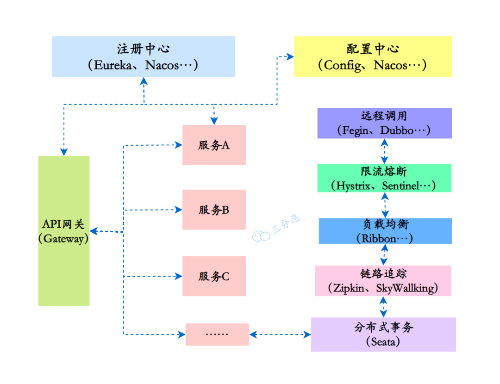

* 注册中心：**注册与发现服务**，管理微服务的地址中心；常用实现：
  * Netflix: Eureka `[juˈriːkə]`, Consul
  * Ali: Nacos
* 配置中心：集中管理微服务的**配置信息**，可以动态修改配置而无需重启服务；常用实现：
  * Netflix: Spring Cloud Config
  * Ali: Nacos Config
* 远程调用：在不同微服务之间进行**通信和协作**；常见实现：
  * RESTful APO: e.g., RestTemplate, Feign
  * RPC: e.g., Dubbo, gRPC
* API网关：作为微服务架构的**入口**，统一暴露服务，并提供路由、负载均衡、安全认证等功能；常见实现：
  * Netflix: Zuul, Gateway
  * Ali: Gateway, Apisix
* 分布式事务：保证跨多个微服务的**一致性和原子性**操作。常用实现：
  * Ali: Seata
* 熔断器：防止微服务之间的**故障扩散**，提高系统的容错能力。常用实现：
  * Netflix: Hystrix
  * Ali: Sentinel, Resilience4j
* 限流和降级：防止微服务**过载**，对请求进行限制和降级处理。常用实现：
  * Netflix: Hystrix
  * Ali: Sentinel

## 一、注册中心

**本项目中**：将商品和购物车拆为了两个服务，然后我们查询购物车时需要查询商品信息，因为我们查询购物车列表时，要判断商品最新的价格和状态，这样可以让用户看到商品涨价及降价信息(price字段)，以及是否还有库存(stock库存字段)，我们单体架构时大家在一个服务中，可以直接本地调用item的查询功能，然而拆分之后，**我们如何在服务cart-service中实现对服务item-service的查询呢?**

立即答：**把原来的本地方法调用改为跨微服务的远程程序调用(Remote Procedure Call (RPC))**
> RPC的实现方式可以: 基于HTTP协议(RestTemplate)，也可以基于Dubbo协议

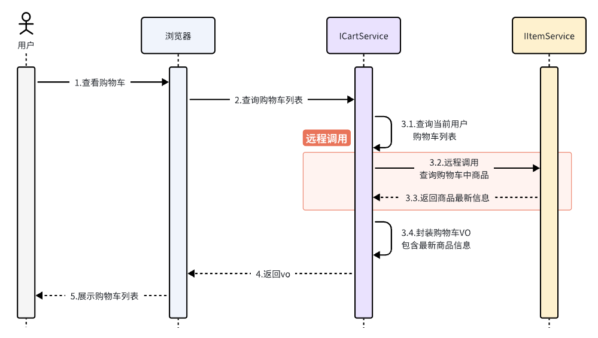

我们可以通过RestTemplate发送http请求（包括请求方式、路径、参数、返回值）

```java
ResponseEntity<List<ItemDTO>> response = restTemplate.exchange(
        "http://localhost:8081/items?ids={ids}", // NOTE 问题：IP被写死了
        // 引入nacos后，可以通过自定义的负载均衡算法动态获取URI
        HttpMethod.GET,
        null,
        new ParameterizedTypeReference<List<ItemDTO>>() {
        },
        Map.of("ids", CollUtil.join(itemIds, ","))
);
```

### 为什么本项目需要注册中心

如果item-service进行了多实例部署(不同ip和port)来应该高并发，那么RestTemplate是不知道要去哪个ip和port的，上面这个url没法写...等问题

即**服务治理问题**：**调用者不知道服务提供者的地址，不知道该调哪个，临时部署的实例调用者也不知道** -> 所以我们需要注册中心/家政公司来统一管理

### 注册中心功能

注册中心主要用于**注册服务和发现服务**，用来管理和维护分布式系统中各个服务的地址和元数据的组件；

### 注册中心原理

> 服务中心占据一个ip和port：nacos的端口为`8848`
> 一个服务提供者可能有多个**实例**，每个实例都对应一个ip和port(可以理解为对应着一台服务器吧，至少是一个应用程序)

即服务中心、服务提供者和服务消费者之间的关系

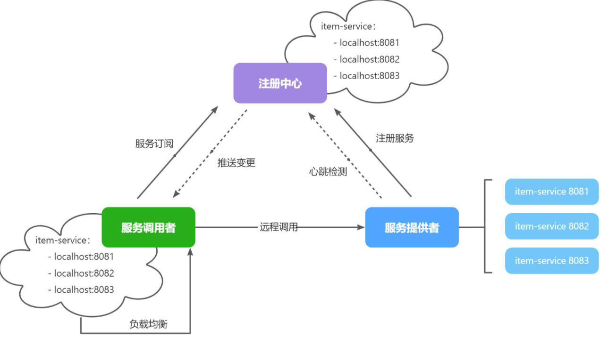{width=70%}

基本流程如下：

* 服务提供者启动时就会**注册**自己的服务信息（服务名(`item-service`), IP, port）到注册中心
* 服务调用者可以从注册中心**订阅**想要的服务(通过服务名吧)，获取服务对应的**实例列表**（1个服务可能多实例部署）
* **服务调用者==自己==对实例列表负载均衡**，挑选一个实例
  * 为什么是调用者进行负载均衡而非提供者？
* 服务调用者向该实例发起**远程调用**

**当服务提供者的实例宕机或者启动新实例时，调用者如何得知呢？**

* 服务提供者会定期向注册中心发送请求，报告自己的健康状态（**心跳请求**）
* 当注册中心长时间收不到提供者的心跳时，会认为该实例宕机，将其从服务的实例列表中剔除
* 当服务有新实例启动时，会发送注册服务请求，其信息会被记录在注册中心的服务实例列表
* 当注册中心服务列表变更时，会**主动通知微服务**，更新本地服务列表（**推送变更**

#### 负载均衡算法 load balancer

服务调用者必须利用负载均衡的算法，动态地从nacos中多个实例中挑选一个实例去访问

* 随机
* 轮询
* IP的hash
* 最近最少访问

## 二、远程调用

TCP协议：作为传输层协议，TCP提供可靠的字节流传输，但在使用时会遇到“粘包”问题，即接收端无法区分消息边界。为了解决这个问题，开发者需要在TCP之上定义自定义协议。于是诞生了RPC和HTTP。
RPC 本质上不算是协议，而是一种调用方式。而像gRPC和Thrift这样的具体实现，才是协议，它们是实现了RPC调用的协议。目的是希望程序员能像调用本地方法那样去调用远端的服务方法。同时RPC有很多种实现方式，不一定非得基于TCP协议。

### HTTP vs. RPC

* 服务发现：HTTP使用DNS解析域名获取IP地址，而RPC通常依赖于中间服务（如Consul, nacos）来管理服务名与IP的映射
* 连接管理：HTTP1.1保持长连接以复用，而RPC协议通常会使用连接池来提升性能。
* 数据传输内容：HTTP主要传输字符串数据，使用JSON进行序列化，十分冗余；而RPC可以使用更高效的序列化协议（如Protobuf），性能上更优，这也是为什么企业内部微服务抛弃HTTP而使用RPC的主要原因
  * read: [link](https://javaguide.cn/distributed-system/rpc/http_rpc.html#http-%E5%92%8C-rpc-%E6%9C%89%E4%BB%80%E4%B9%88%E5%8C%BA%E5%88%AB)

### Feigh vs. Dubbo

Feigh和Dubbo都是用于实现远程调用的框架，Feign基于HTTP，Dubbo基于RPC

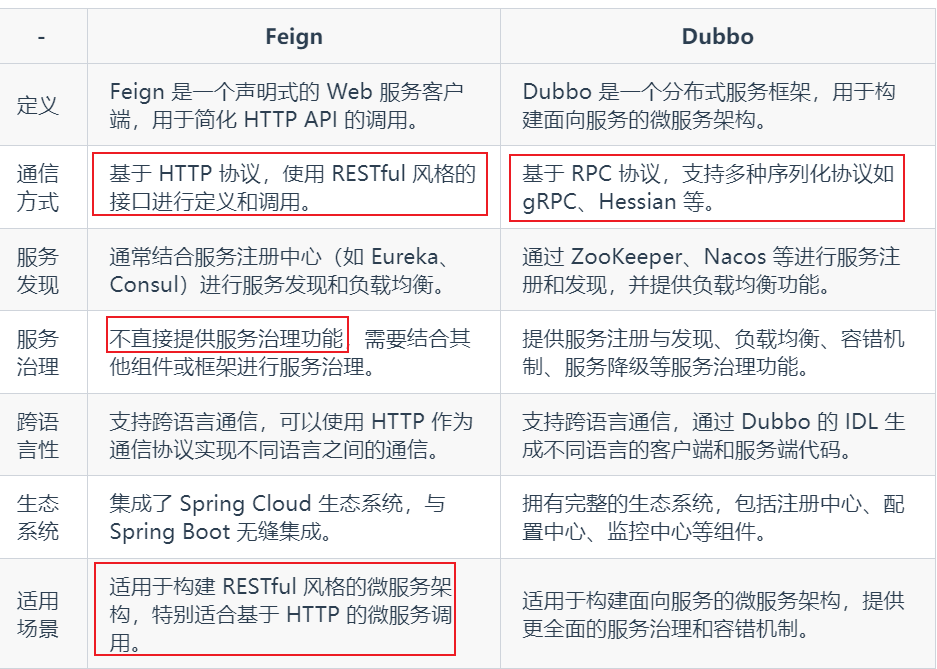  

### Feign是什么

* Feign是一个声明式web客户端,它简化了使用基于 HTTP 的远程服务的开发。
  * > 声明式接口：开发者只需定义一个接口，并通过注解来描述HTTP请求的细节。Feign会根据这些定义自动生成相应的实现类。
* Feign是在**RestTemplate**和**Ribbon**的基础上进一步封装，使用RestTemplate实现Http调用，使用Ribbon实现负载均衡。
  * OpenFeign目前支持两种负载均衡策略: Ribbon(早期)和Spring Cloud LoadBalancer(2020之后取代Ribbon)


主要特点和功能：

* 声明式API：开发者只需要定义一个接口，并通过注解来描述HTTP请求的细节，Feign会根据这些定义自动生成实现类（动态代理）。通过使用注解，开发者可以轻松地指定URL、HTTP方法、请求参数、请求头等信息，使得远程调用变得非常直观和易于理解。

```java
// 定义Feign客户端接口
@FeignClient(name = "userFeignClient", url = "https://jsonplaceholder.typicode.com/")
public interface UserFeignClient {

    // 定义获取用户信息的方法
    @GetMapping("/users")
    ResponseEntity<List<User>> getUsers();
}
```

---

项目中写法:

```java
@FeignClient("item-service") // 去注册中心拿到实例列表
public interface ItemClient {
    @GetMapping("/items")
    List<ItemDTO> queryItemByIds(@RequestParam("ids") Collection<Long> ids);
}
```

### Feign及LoadBalancer工作原理

OpenFeigin/Feign的工作原理(包括内部的Spring Cloud LoadBalancer负载均衡的过程):

* **Feign接口声明**: 开发者定义一个接口,并使用@FeignClient注解标记服务名称,以及使用SpringMVC注解声明请求方式(get)、路径(item-service/items)、参数(ids)等信息（feign客户端）
* **动态代理生成**: Feign在运行时会为这个接口生成一个**动态代理实现类**,实现类会根据接口上的注解信息构造出正确的HTTP请求
  * 动态代理实现类是`FeiginInvocationHandler`，里面的`invoke()`最终会发远程调用（通过`FeignBlockingLoadBalancerClient`，此时请求request知道请求方式、路径和参数，但没有ip和port）：
    * 获取服务名称：serviceId(`item-service`)
    * 根据serviceId从注册中心拉取服务列表 (`loadBalancerClient`)
    * 利用负载均衡算法选择一个服务
      * 默认时RoundRobin算法
    * 重构请求的URI路径(将`item-service`改为`ip:port`)，发起远程调用/http请求
* 响应结果处理: 请求返回后,Feign会根据接口声明的返回值类型,自动将响应结果转换为对应的对象

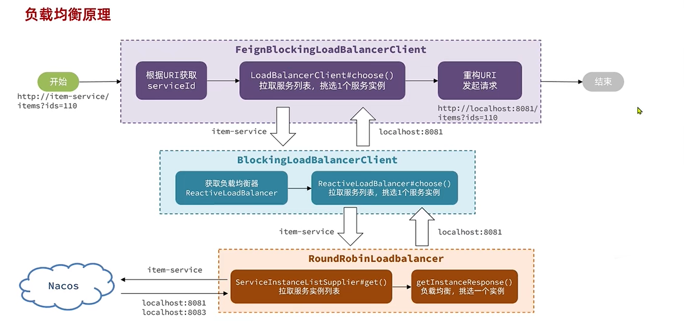  

#### 修改LoadBalancer

[官方文档 link](https://docs.spring.io/spring-cloud-commons/docs/current/reference/html/#switching-between-the-load-balancing-algorithms)

Spring Cloud LoadBalancer默认使用RoundRobbin轮询算法
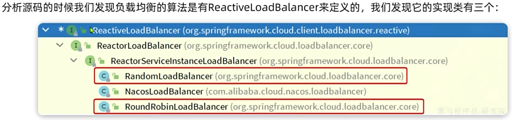
> 这也太弱了，就这三种，Nacos本质是RandomWeight

源码用了`@ConditionalOnMissingBean`修饰，意味着我们自己写一个Bean(自定义负载均衡算法)的话，可以替换默认实现

**NacosLoadBalancer**：先优先试用本集群，然后就是随机加权RandomWeight；[课程讲解](https://www.bilibili.com/video/BV1S142197x7?t=3.1&p=166)

### 常见负载均衡算法

> 负载均衡器 load balancer: Ribbon/Gateway; 一般都支持下面的算法

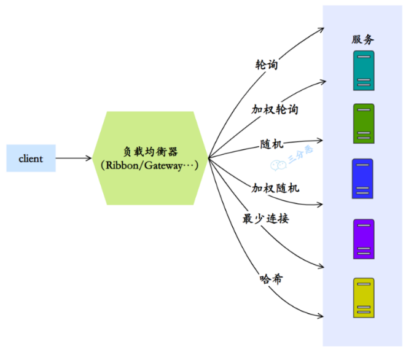{width=70%}

* **简单轮询**（Round Robin）：请求按顺序分配给每个服务器，简单易用，适合服务器性能相近的场景。
* **加权轮询**（Weighted Round Robin）：RR + 权重。根据服务器自身的性能给服务器设置不同的权重，将请求**按顺序和权重分**发给后端服务器，可以让性能高的机器处理更多的请求
  * 无法应对**水平切分**的分布式数据库系统，因为每个服务器节点存的数据不同；比如一个分布式KV缓存系统，某个key应该到哪个或者哪些节点上获得，应该是确定的，不是说任意访问一个节点都可以得到缓存结果的。遂**哈希算法**
  * 水平切分：是将同一张表的数据按行拆分到多个数据库中，例如将用户表中的数据根据用户ID范围分散到不同的数据库中。
* **简单随机**（Random）：将请求随机分发给后端服务器上，请求越多，各个服务器接收到的请求越平均
* **加权随机** (Weighted Random)：根据服务器自身的性能给服务器设置不同的权重，将请求按各个服务器的权重随机分发给后端服务器
* **最少连接算法**（Least Connection）：将请求分配给当前连接数最少的服务器，适合处理能力差异较大的服务器，能够有效防止某些服务器过载
* **最少活跃算法**：类似于最少连接，不过是以活动连接数为标准，即当前正在处理的请求数；活跃数越低，说明处理能力越强，这样就可以使处理能力强的服务器处理更多请求。
* **哈希算法**：将请求的参数信息通过哈希函数映射为一个哈希值，然后根据哈希值来决定请求被哪一台服务器处理。**在服务器数量不变的情况下**，相同参数的请求总是发到同一台服务器处理，有注意**利用缓存**，比如同个IP的请求、同一个用户ID的请求
  * $server\_idx = hash(user\_id) \% server\_num$
  * 问题：如果节点数量发生了变化，也就是在对系统做扩容或者缩容时，**必须迁移改变映射关系的数据**，否则会出现查询不到数据的问题；这个迁移成本太高了
* **一致性哈希算法**：解决了哈希算法在服务器数量变化后哈希值会落到不同服务器上的问题

#### 一致性哈希算法

一致哈希算法也用了取模运算，但与哈希算法不同的是，哈希算法是对节点的数量进行取模运算，而一致哈希算法是对$2^{32}$进行取模运算（即所谓哈希环）
{width=40%}

一致性哈希要进行两步哈希：

* 第一步：对**存储服务器节点**进行哈希计算，比如根据节点的IP地址进行哈希
* 第二步：当对**数据**进行存储或访问时，对数据进行哈希映射

所以，**一致性哈希是指将「存储节点」和「数据」都映射到一个首尾相连的哈希环上**

当需要对指定key的值进行读写时，也需要通过两步寻址：

* 对key进行哈希计算，确定key所在的位置: `hash(key) % (2^32-1)`
* **从该位置往顺时针的方向的找到第一个服务器节点就是要找的**

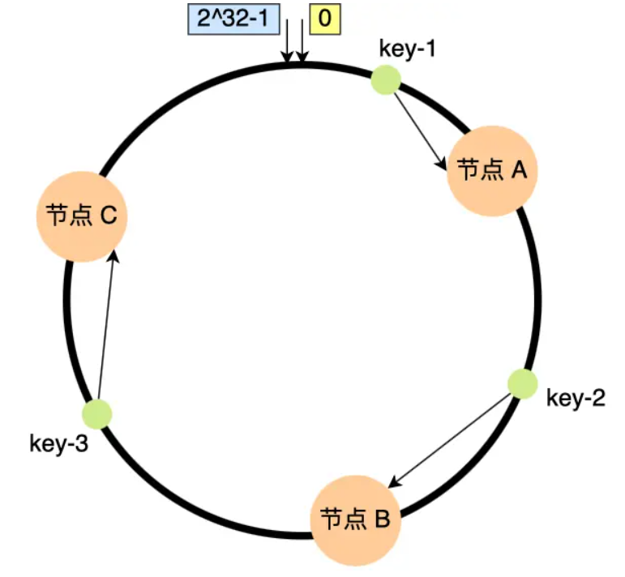{width=50%}

对于一致性哈希算法，如果你增加或移除了一个节点，**仅影响该节点在哈希环上顺时针的邻居节点的数据，其他数据不受影响**

一致性哈希算法存在的问题：**不保证节点能够在哈希环上分布均匀**，即会有大量的请求集中在一个节点上
解决方法：不再将真实节点映射到哈希环上，而是**将虚拟节点映射到哈希环上**，**并将虚拟节点映射到实际节点**，所以这里有「两层」映射关系。
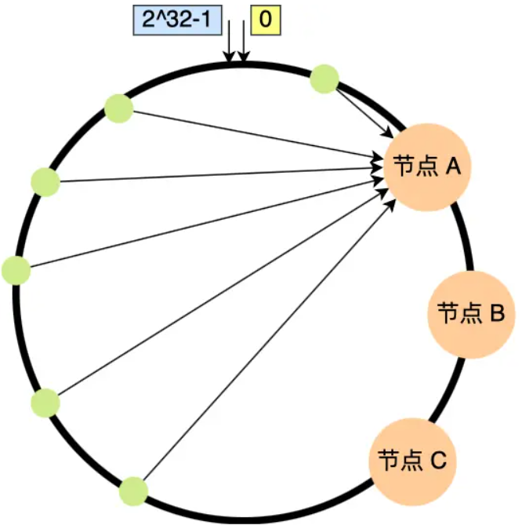{width=40%}

### 服务端/七层负载均衡 vs. 客户端负载均衡

主要是**部署位置和控制权**不同：

* 七层负载均衡通常部署在服务器端，控制权在服务器端（通过专门的负载均衡器或代理服务器, eg nginx）
* 客户端负载均衡由客户端直接实施，负载均衡逻辑集成在客户端的代码中，控制权在客户端；客户端根据服务实例的健康状况、负载情况等指标来决定选择哪个节点进行调用（比如我们的spring cloud LoadBalancer就主要用于客户端）

七层负载均衡解决方案：

* **DNS解析**：在DNS服务器中**为同一个主机记录配置多个IP地址**，这些IP地址对应不同的服务器。当用户请求域名的时候，DNS服务器采用轮询算法返回IP地址，这样就实现了轮询版负载均衡
* **反向代理**：客户端将请求发送到反向代理服务器，由反向代理服务器去选择目标服务器，获取数据后再返回给客户端。**对外暴露的是反向代理服务器地址**，隐藏了真实服务器IP地址。反向代理“代理”的是目标服务器，这一个过程**对于客户端而言是透明的**
  * Nginx是最常见的反向代理服务器

客户端负载均衡一般通过现成的组件来实现：

* Netflix Ribbon: 更全面；Nacos中集成了Ribbon，现代是LoadBalancer了
* Spring Cloud LoadBalancer

## 三、网关

### 为什么需要网关

ok，到现在为止我们已经将商城拆分成了5个微服务：用户服务, 商品服务, 购物车服务, 交易服务, 支付服务

1. 每个微服务都有不同的ip或port，前端请求不同数据需要访问不同的入口，很麻烦
   1. 答：我们让前端只访问网关即可(唯一ip和port)，然后由网关负责**路由和转发**及**负载均衡**
2. 单体架构我们只需要进行一次用户登录与校验，就可以在所有业务中获取到用户信息，而独立部署之后：每个微服务都需要编写登录校验、用户信息获取的逻辑功能吗？难道要把jwt秘钥分发给每个服务？麻烦且不安全
   1. 答：校验交给网关（首次登录还是由登录模块完成），

### 什么是网关

* 网关就是看门大爷，数据从一个网络传输到另一网络时就需要经过网关来**做数据的路由和转发**以及**数据安全的校验**
* 网关充当了客户端和后端服务的入口点
* 也可叫做**API网关**：因为所有API调用都要经过API网关，网关负责对API进行管理和控制

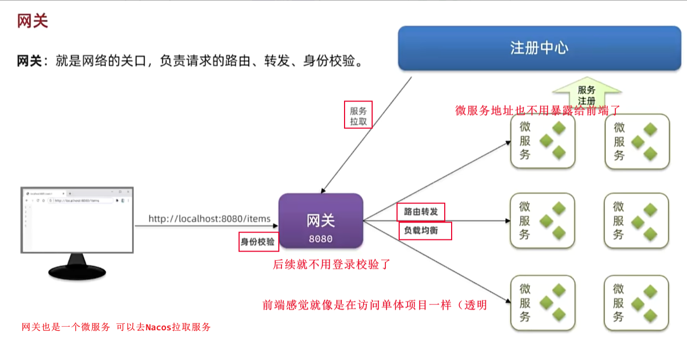{width=80%}

网关的两种实现方案：

- **Netflix Zuul**：2020年**淘汰**
- **SpringCloudGateway**：官方推荐，基于**非阻塞**的Spring的WebFlux技术(基于reactor)，完全支持**响应式编程**，吞吐能力更强
- 此外还有：Kong, APISIX

#### 网关的功能

* **路由转发**：网关根据请求的URL路径或其他标识，将请求路由到相应的后端服务。通过**配置路由规则**，**可以灵活地将请求分发给不同的后端服务**
* **负载均衡**：网关可以在后端服务之间实现负载均衡，将请求平均分发到多个实例上，提高系统的吞吐量和可扩展性
* **安全认证与授权**：网关可以**集中处理身份验证和授权**，确保只有经过身份验证的客户端才能访问后端服务
* **缓存**：网关可以缓存后端服务的响应，减少对后端服务的请求次数，提高系统性能和响应速度
* **数据转换与协议转换**：网关可以在客户端和后端服务之间进行数据格式转换和协议转换，如将请求从HTTP转换为WebSocket，或将请求的参数进行格式转换，以满足后端服务的
需求

[link](https://javaguide.cn/distributed-system/api-gateway.html#%E7%BD%91%E5%85%B3%E8%83%BD%E6%8F%90%E4%BE%9B%E5%93%AA%E4%BA%9B%E5%8A%9F%E8%83%BD)

#### Spring Cloud Gateway核心概念

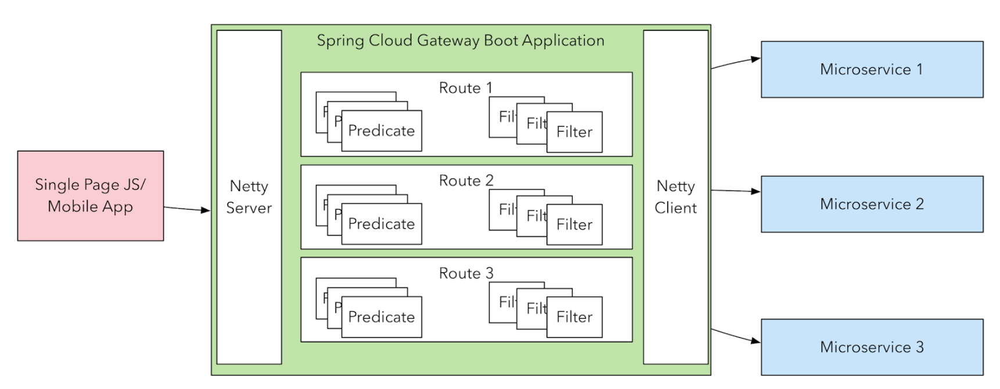{width=70%}

有三个关键组件：

* **Route (路由)**：是Gateway的基本模块，包含唯一ID, 目标URI, predicate集合, filter集合；定义了请求的匹配规则和转发目标，通过配置路由，可以将请求映射到后端的服务实例或URL上
* **Predicate (断言器)**: 用于匹配HTTP请求条件的逻辑表达式，判定请求是否符合某个路由的条件；内置很多路由断言器:
  * eg `After: 是某个时间点之后的请求`, `Path: 请求路径URL必须符合指定规则`, `Host: 请求必须是访问某个域名的`, `Method：匹配HTTP方法（如GET、POST）`...大家还可以逻辑组合
* **Filter (过滤器)**：在请求到达目标服务之前修改请求(eg 添加头信息、参数)，或响应返回给客户端之前修改响应(eg 修改状态码、响应体)
  * 内置多个filter：eg 请求转发、请求限流...
  * 可自定义filter，**可以实现日志记录、身份验证、限流等**

#### Spring Cloud Gateway内部原理

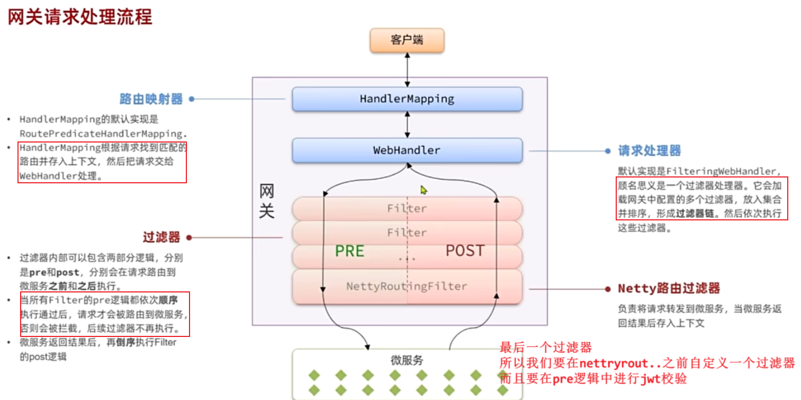{width=80%}

1. 客户端请求进入网关后由**HandlerMapping**对请求做判断，**找到与当前请求匹配的路由规则**（Route），然后将请求交给WebHandler去处理。
2. WebHandler则会**加载当前路由下需要执行的==过滤器链==（Filter chain），然后按照顺序逐一执行过滤器(filter)**
3. 图中Filter被虚线分为左右两部分，是因为Filter内部的逻辑分为pre和post两部分，**分别会在请求路由到微服务之前和之后被执行**
4. **只有所有Filter的pre逻辑都依次顺序执行通过后，请求才会被路由到微服务**
   1. 所以我们在这儿写校验功能就行
5. **微服务返回结果后，再倒序执行Filter的post逻辑**
6. 最终把响应结果返回

### 我做了什么

#### 配置网关路由规则

* 创建微服务`hm-gateway` (搞个启动类)
* 配置网关路由规则 (在`application.yaml`中配置)
* over

```yaml
- id: item
  uri: lb://item-service
  predicates:
    - Path=/items/**,/search/**
```

四个属性含义如下：
- id：路由的唯一标示
- predicates：**路由断言**，其实就是**匹配条件**
- filters：过滤器用于对请求或响应进行修改和处理 （不是去拦截谁奥
- uri：**路由目标地址**，**lb://代表负载均衡**，**从注册中心获取目标微服务的实例列表**，并且**负载均衡**选择一个访问

#### 网关登录校验

> jwt基础: please read [link](https://github.com/haooxia/CSJourney/blob/main/network/network.md)
> 拦截器基础: please read [link](https://github.com/haooxia/CSJourney/blob/main/java/Spring.md)

##### JWT单点登录校验流程

1. 客户端向服务器发送用户名、密码及验证码
2. 服务器校验正确性(**鉴权**)，如正确，使用JWT工具创建JWT token(Header+Payload+Signature)，并发送给客户端
3. 客户端收到JWT后，将其存在**Cookie或localStorage**中
4. 后续客户端所有请求都要在**请求头**中带上该JWT令牌
   1. 后续的请求(携带jwt登录令牌)首先经过**自定义的拦截器的preHandle()**，再到controller; [code](https://github.com/shuhongfan/sky-take-out/blob/267313f948bba2001fbc497995a39ef61f2c621f/sky-take-out/sky-server/src/main/java/com/sky/interceptor/JwtTokenUserInterceptor.java#L23)
      1. 拦截器从请求头中获取JWT
      2. 校验JWT的有效性
         1. 服务端解析JWT(BASE64)并通过校验jwt的完整性，没问题的话从payload中拿出用户相关信息即可
      3. 解析JWT并将用户信息（如userId）存入上下文ThreadLocal
         1. 后续同一**线程内**的其他操作就可以直接取出userID
            1. 在复杂的业务逻辑中，方法之间可能需要传递多个参数。如果使用ThreadLocal，后续方法可以直接从ThreadLocal中获取，而不需要显式地传递这些参数，简化了方法的签名
         2. 注意后续其他线程也会被Interceptor拦截并做校验
      4. 如果JWT无效或过期，返回401 Unauthorized状态码。
      5. 拦截器注意在`afterCompletion`中释放ThreadLocal

> (**tomcat中每一个请求对应一个线程来处理**，因此我们在拦截器中存入当前线程的线程域，后续处理业务的整个过程都可以从ThreadLocal中取出用户信息)

这个`userId`真有这么重要？是：很多业务都用到了：`ctrl +alt + f7看看谁在用`
userId是用户user表的主键, 是购物车cart表的外键，有这玩意儿 后续查表就很方便 
//  比如
//  1.查询我的购物车列表
//  `List<Cart> carts = lambdaQuery().eq(Cart::getUserId, UserContext.getUser()).list()`

##### JWT多点登录校验的问题

问题：

* 本项目将**登录鉴权**(创建并发送JWT)放在`user-service`微服务下(一个点授权了即可)，但登录校验可不只是`user-service`用到，其他很多微服务都需要知道用户信息(eg 购物车微服务`cart-service`中查询和修改你肯定得知道是哪个用户，eg 交易微服务`trade-service`也需要知道用户是谁)，但这三者是三个节点，难道我需要在三个微服务节点中都写上**登录校验**的代码吗？
* 而且我鉴权微服务`user-service`还需要把`jwt秘钥`都发给各个微服务，那泄露风险蛮高的。

所以，还是请出gateway，网关校验后向后传递即可。所以你需要在网关转发之前进行校验

##### 基于网关实现JWT多点登录校验


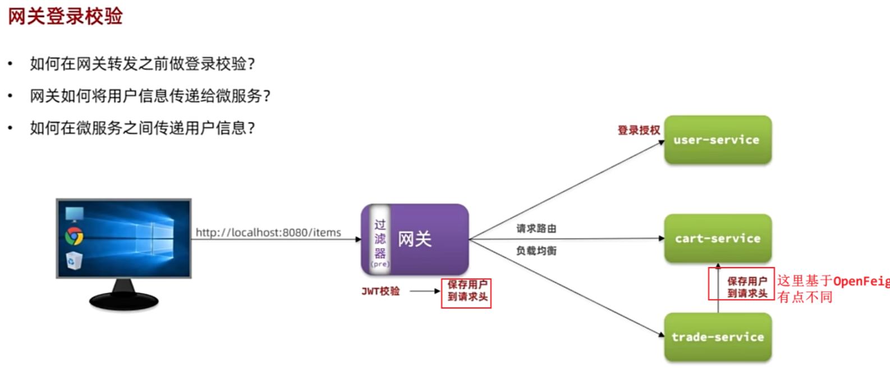  


使用网关做登录校验会有一堆问题：

* 问题一：网关路由是配置的，**请求转发是Gateway内部代码，我们如何在转发之前做登录校验**？即我们应该在哪儿写登录校验
  * 答：在`NettyRoutingFilter`转发过滤器之前自定义一个过滤器，然后在pre逻辑中写就行
* 问题二：网关校验JWT之后，**如何将用户信息传递给微服务**？
  * 我们单体的时候用的是ThreadLocal，这里可以用吗？显然不行，大家都不在一个tomcat；可以**通过http请求头，发个http请求给其他微服务**
* 问题三：微服务之间也会相互调用，这种调用不经过网关，那微服务之间该如何传递用户信息？(eg 下单后会清理购物车，所以交易微服务trade-service会调用购物车微服务cart，你trade中有用户信息，它并不会自动传递给cart)

---

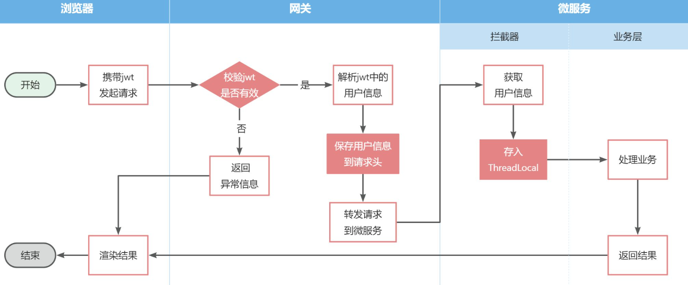  


具体实现：
我们利用`GlobalFilter`全局过滤器来完成登录校验: [code](https://ocnwqnhdszi1.feishu.cn/wiki/CJJjwxElniy1Nyk10w3cRWWknzb#ZXvAdQSJRom5GqxEajuci1KknzE)

我们自定义了一个`AuthGlobalFilter`类实现了用于身份校验的全局过滤器（实现了`filter()`写逻辑，`getOrder()`写过滤器的优先级(设置为0，越小优先级越高，我们仅次于NettyRoutingFilter)

* 检查请求路径是否需要身份校验（我们做了一些excludePaths，即无需登录就可以访问的路径，eg `/serach/**, /users/login, ...`，无需校验的话直接放行
* 从请求头(GlobalFilter中参数会有上层传来的上下文exchange)中提取jwt
* 校验token有效性，如无效则放行，有效则解析userId，然后 ==**保存用户信息到http请求头**==, 然后放行（**传入修改后的exchange**） [code](https://github.com/fangshuiyun/hmall/blob/000e66b3b94ef0761ea6db60d692793cb9d0269c/hm-gateway/src/main/java/com/hmall/gateway/filters/AuthGlobalFilter.java#L53)

---

**ok，所以下游微服务如何拿到userId？以及为何需要ThreadLocal？**

由于网关发送请求到微服务采用的是Http请求，因此**我们可以将用户信息以请求头的方式传递到下游微服务**。然后**微服务可以从请求头中获取登录用户信息**（然后就回到了单体的逻辑，只不过无需校验了）。==**考虑到微服务内部可能很多地方都需要用到登录用户信息**==，**因此我们可以利用SpringMVC的Interceptor来实现登录用户信息获取，并存入ThreadLocal，方便后续使用。** [code](https://github.com/fangshuiyun/hmall/blob/000e66b3b94ef0761ea6db60d692793cb9d0269c/hm-common/src/main/java/com/hmall/common/interceptors/UserInfoInterceotor.java#L13)

---

ok, 第三个问题，如何将一个微服务的userid传递给另一个微服务？（*这块可以在项目中考虑隐去不表*）

前端发起的请求都会经过网关再到微服务，由于我们之前编写的过滤器和拦截器功能，微服务可以轻松获取登录用户信息。**但有些业务是比较复杂的，请求到达微服务后还需要调用其它多个微服务**。比如下单业务，流程如下：
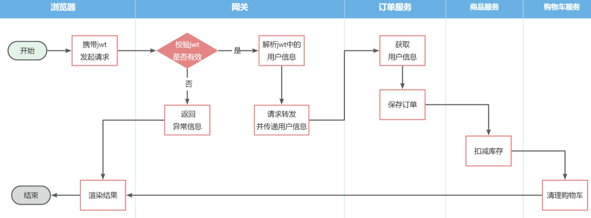

下单的过程中，需要调用商品服务扣减库存，**调用购物车服务清理用户购物车**。而清理购物车时必须知道当前登录的用户身份。但是，订单服务调用购物车时并没有传递用户信息，购物车服务无法知道当前用户是谁！

**实现**：由于微服务间调用是通过OpenFeign实现的，所以我们让每一个由OpenFeign发起的请求自动携带登录用户信息就行了，借助**OpenFeign的拦截器**`feign.RequestInterceptor`, **我们在里面将用户信息保存到请求头中(先从ThreadLocal中取出, easy)**。如此，每次OpenFeign发起请求的时候都会调用该方法，传递用户信息到下一个微服务。[code](https://github.com/fangshuiyun/hmall/blob/master/hm-api/src/main/java/com/hmall/api/config/DefaultFeignConfig.java#L18-L24)

完事儿！

---

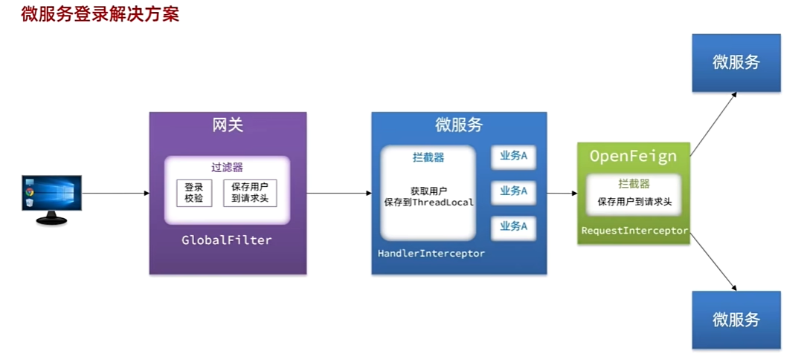

==**总结**==
我们用了很多过滤器/拦截器：

* **网关中的过滤器GlobalFilter**：拦截、jwt登录校验、保存用户信息到http请求头
* **微服务中的拦截器即SpringMVC的HandlerInterceptor**：获取请求头中的用户信息，并存入ThreadLocal
* **OpenFeign的拦截器RequestInterceptor**：保存用户信息到请求头

## 四、配置管理

### 为什么需要配置管理？

微服务架构中的**每个服务**通常都需要一些配置信息，例如**数据库连接地址、服务端口、日志级别等**。微服务的实例一般非常多，如果每个实例都需要一个个地去做这些配置，那么运维成本将会非常大，这时候就需要一个集中化的配置中心，去管理这些配置。

另一方面，我们的项目中 **==网关路由==或其他业务配置在配置文件中写死了**，如果变更**必须重启**微服务；（用**Nacos可以监听并推送**，无需重启立即生效，即**热更新**

我们还要请出Nacos，它充当我们的注册中心和配置中心。

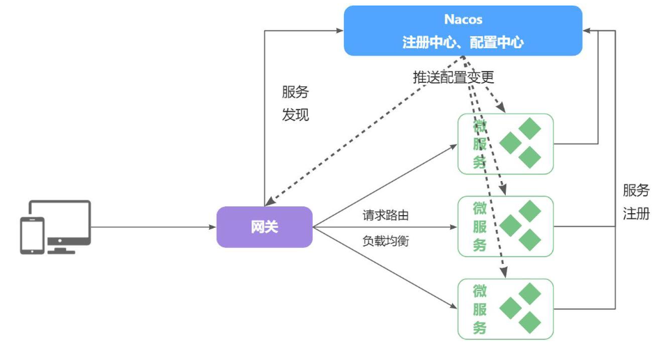{width=70%}

微服务**共享的配置**(eg jdbc配置，log配置，swagger配置)可以统一交给Nacos保存和管理，在Nacos控制台修改配置后，**Nacos会将配置变更推送给相关的微服务，并且无需重启即可生效，实现配置热更新**。
网关的路由（gateway-routes）同样是配置，因此同样可以基于这个功能实现动态路由功能，**无需重启网关即可修改路由配置**

### 配置中心的原理

立即答：配置信息的CRUD

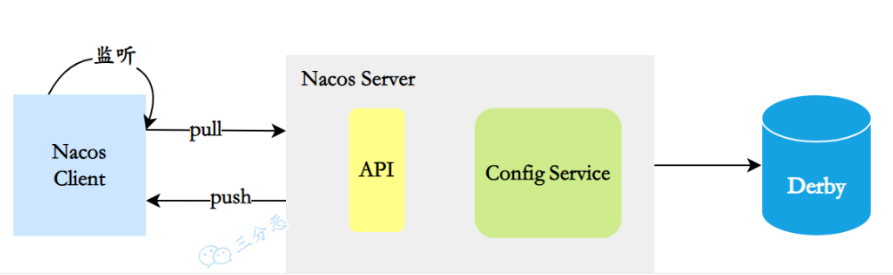  
1. **配置信息存储**：Nacos默认使用内嵌数据库**Derby**来存储配置信息，还可以采用MySQL等关系型数据库（本项目就是）
2. **注册配置信息**：服务启动时，Nacos Client会向Nacos Server注册自己的配置信息，这个注册过程就是把配置信息写入存储，并生成版本号
3. **获取配置信息**：服务运行期间，Nacos Client通过API从Nacos Server获取配置信息。Server根据键查找对应的配置信息，并返回给Client
4. **监听配置变化**：Nacos Client可以通过注册监听器的方式，实现对配置信息的监听。当配置信息发生变化时，Nacos Server会通知已注册的监听器，并触发相应的回调方法。（**热更新的原理**


### 项目中做了什么

抽取出yaml中jdbc配置，log配置，swagger配置，添加到nacos网页控制台中**配置列表**即可（新建配置-yaml格式）；然后一些配置我们没写死用变量名替代，后续可以在项目yaml文件中指定这些少量变量即可，方便很多。

**注意我们在nacos网页中写的配置，实际上会被存到我们配置的mysql中**

这么多配置，使用的顺序是什么
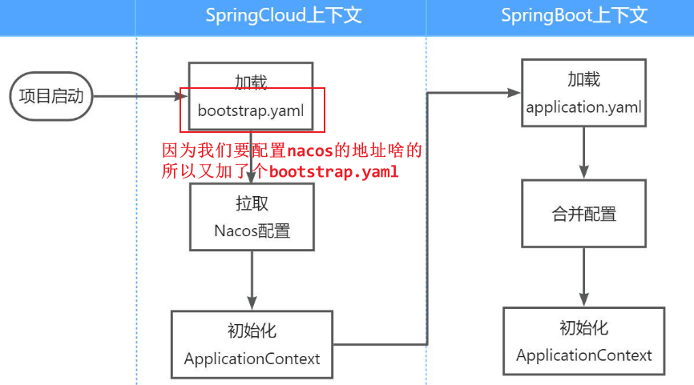

将拉取到的共享配置与本地的application.yaml配置合并，完成项目上下文的初始化。

---

此外，配置热更新，解决了修改配置后需要重新打包、重启服务才能生效的问题：（没啥好说的）

1. 在nacos中添加配置
2. 在微服务中以特定方式读取需要热更新的配置属性

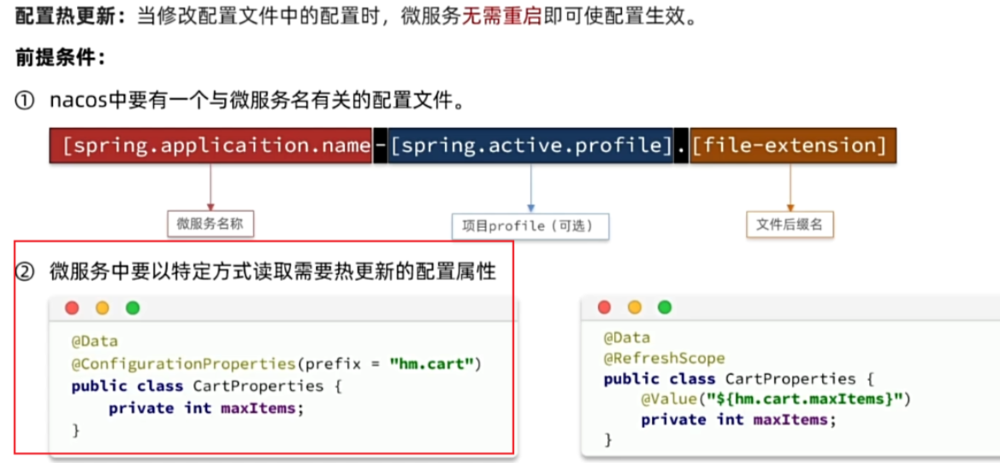{width=80%}

## 五、服务保护

### 服务雪崩问题

**服务雪崩问题/级联失败问题**：在微服务架构中，由于**某个服务的故障或阻塞(eg 如果服务==并发度很高==时，响应时间增加，甚至长时间阻塞至失败)，导致依赖于该服务的其他服务也相继出现故障**，从而引发整个系统的瘫痪。这种现象类似于雪崩，局部的失败会迅速扩散，影响到整个服务链。
> 比如本项目中：很多服务(eg 购物车服务)需要调用商品服务，如果商品服务

服务雪崩的原因：

* 服务提供者出现故障或阻塞
* 服务调用者没做好异常处理，导致自身故障

### 服务雪崩解决方案

**解决雪崩问题的常见方案**/微服务保护方案/增加健壮性：

* **请求限流**（大坝）：限制流量在服务可处理的范围内，避免因突发流量而故障
  * 通过限流器(rate limiter)，数量高低起伏的并发请求曲线，经过限流器就变的非常平稳
  * 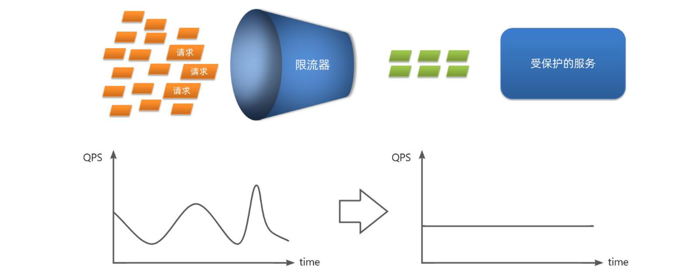{width=70%}
  * 限流可以降低服务器压力，尽量减少因并发流量引起的服务故障的概率，但并不能完全避免服务故障
* **线程隔离**（船舱 / 防火卷帘门）：控制业务可用的**线程数量**，然后你这个微服务就不会耗尽服务器资源了，不会影响其他服务，将故障隔离在一定范围
  * 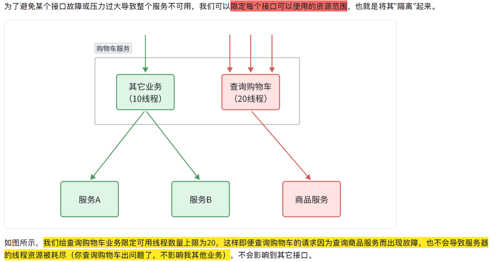{width=80%}
* **服务熔断**（保险丝）：虽然线程隔离解决了雪崩问题，但你异常的还在那消耗资源，没必要；服务熔断将异常比例过高的接口断开，拒绝所有请求，直接走fallback逻辑
  * 由**断路器**统计请求的异常比例或慢调用比例，如超出阈值，则熔断该业务，阻拦该接口的请求，**进行服务降级处理**，走我们编写的**fallback逻辑**
    * **服务降级**：兜底机制/容错机制，在系统资源紧张或服务故障时，主动屏蔽一些非核心或可选的功能，而只提供最基本的功能

### 利用Sentinel解决服务雪崩

我们用Sentinel实现上述服务保护措施
> 下载jar包->启动->在控制台dashboard控制即可

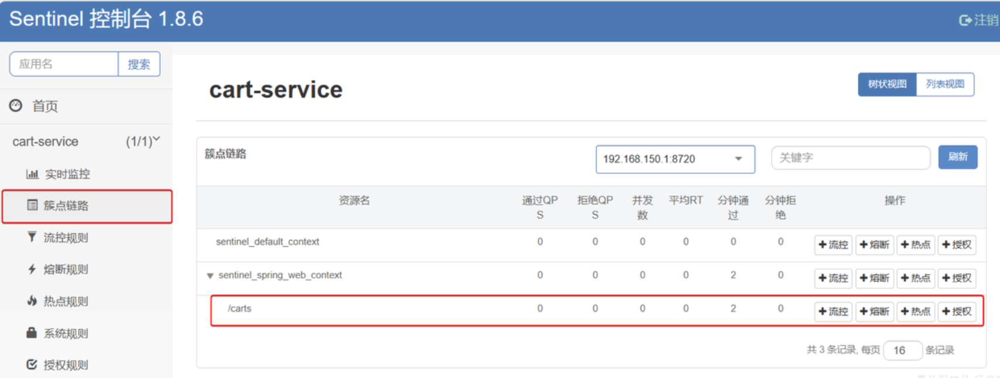  

Sentinel有个**簇点链路**功能，默认SpringMVC每个请求路径是一个**簇点**，但我们改为 **"请求方式 + 请求路径"** 作为一个簇点（因为我们RESTful同一路径随不同请求方式而不同），如此我们就可以直接使用按钮操作对簇点进行限流、隔离或熔断。

* 请求限流：设置**簇点的QPS**阈值为6(1s最多进来6个请求，多的就直接拒了)
* 线程隔离：我们对查询商品的FeignClient接口做线程隔离，设置**簇店的并发线程数**阈值为5（也就是说这个查询功能最多使用5个线程）
* 服务熔断：设置簇点的熔断措施：响应时间RT>200ms就算慢调用，统计最近1000ms内的最少5次请求，如果慢调用比例>=0.5，则触发熔断，熔断20s
  * 服务熔断后还会自动打开奥

## 分布式理论

> ACID是数据库事务完整性的理论，CAP是分布式系统设计理论，BASE是CAP理论的延伸

### CAP定理

CAP定理：一个分布式系统中无法同时满足以下三者：**Consistency**（一致性），**Availability**（可用性）、**Partition tolerance**（分区容错性），~~最多只能满足其二~~。

一般来说，CAP理论中**分区容错性P是一定要满足的**，在此基础上，只能满足可用性A或者一致性C；

* 一致性：所有结点的数据副本严格一致，无论客户端访问哪个节点，都应该得到最新的、相同的数据副本
* 可用性：系统应该在任何情况下都能处理请求并返回结果，即使返回的数据可能不是最新的
* 分区容错性：即便是系统出现网络分区，整个系统也要能对外提供服务
  * 分区：节点之间出现网络故障导致相互无法通信，原本整个网络就变成了几个**网络分区**

**为何无法同时保证CAP？**

当发生网络分区时，如果系统选择保持**一致性C**，系统可能需要暂停服务，以确保所有节点的数据一致性，即没有A。反之，如果系统选择保持**可用性A**，则可能会允许不同节点返回不同的数据，即没有C；

* CP架构: 强一致，低可用：Seata分布式锁的**XA模式**，ZooKeeper, Nacos
* AP架构: 高可用，弱一致：Seata分布式锁的**AT模式**，web缓存，DNS，Eureka, Nacos

### BASE理论

BASE权衡了一致性C和可用性A：

核心思想：即使无法做到强一致性Strong Consistency，也可以根据应用特点采用适当的方式来达到最终一致性Eventual consistency的效果（即损失

* **Basically Available(基本可用)**：分布式系统出现故障时，允许损失部分可用性，只要保证核心可用即可
* **Soft state(软状态)**：在一定时间内，允许出现中间状态，出现临时的不一致状态，（硬状态对一致性的要求很严格（似乎这个度量不好衡量
* **Eventually Consistency (最终一致性)**：虽然无法保证强一致性，但软状态结束之后，最终达成数据一致性

## 六、分布式事务

我们知道本地事务利用数据库本身的事务机制即可保证ACID特性，而**分布式事务其实就是将对同一库事务的概念扩大到了对多个库的事务。目的是为了保证分布式系统中的数据一致性。**

* 每个服务的事务叫做**分支事务**，整个业务称作**全局事务**
* 当业务跨**多个服务或者数据源**实现，就可能产生分布式事务问题
* 产生分布式事务的原因：**多个分支事务之间无法相互感知，所以我们需要一个事务协调者(Transaction Coordinator)**

### 为什么需要分布式事务

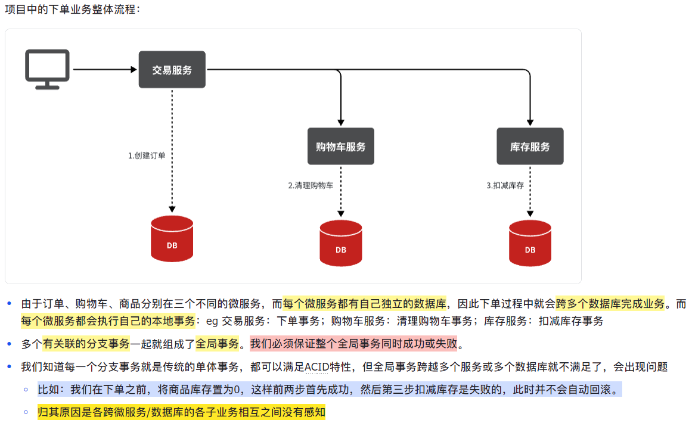  

---

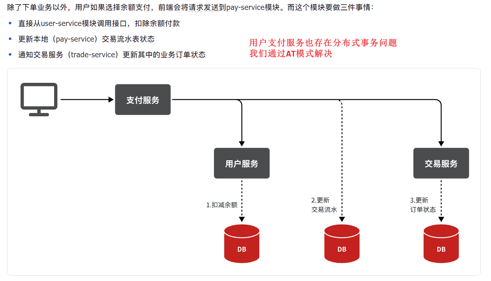  


### 如何解决分布式事务

**我们做了什么**：

* docker安装seata微服务 并注册到nacos 且使用nacos作为配置中心
* seata数据我们存在mysql中/当然也可以redis：`global-table, branch-table, lock-table`
* 使用`@GlobalTransactional`标注分布式事务的入口方法，然后全局事务中调用的各个分支事务加上`@Transactional`即可 (so easy): [code](https://github.com/fangshuiyun/hmall/blob/000e66b3b94ef0761ea6db60d692793cb9d0269c/trade-service/src/main/java/com/hmall/trade/service/impl/OrderServiceImpl.java#L51)

### Seata架构及原理

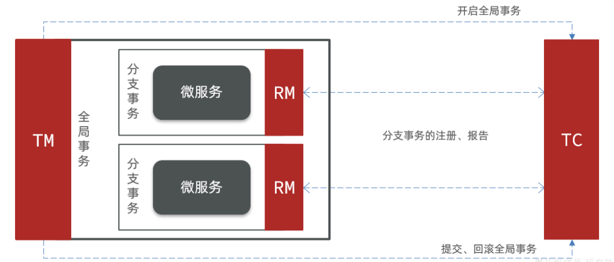  

三个角色：

* TC (Transaction Coordinator) **事务协调中心**：**维护全局和分支事务的状态**
  * TC是一个微服务，需要单独部署，TM和RM可理解为seata的客户端部分，引入以来即可
* TM (Transaction Manager) **全局事务管理器**：定义全局事务的**范围**、开始全局事务、**提交或回滚全局事务**
* RM (Resource Manager) **资源管理器(数据库)**：管理分支事务，与TC交谈以注册分支事务和**报告分支事务的状态**

### XA模式

* 常见的分布式解决方案有2PC(2-Phase Commit), 3PC, TCC等
* Seata支持XA, TCC, AT, SAGA

概括：参与者RM将操作成败通知协调者TC（**暂不提交**），再由协调者根据**所有参与者的反馈情况**决定各参与者是否要提交操作还是回滚操作。
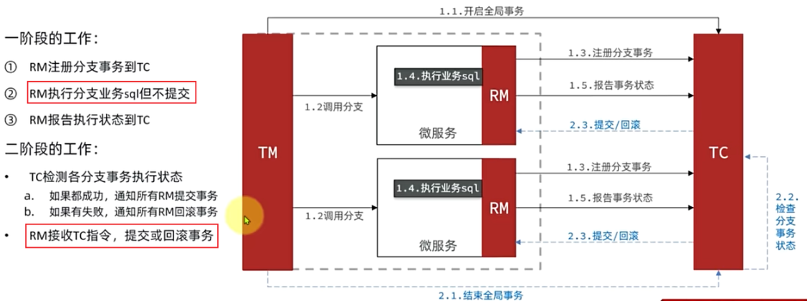  

等待是双刃剑：

* 缺陷：前面的分支一直干等着，耗时，而且还占据着锁（事务没提交就不释放锁），所以性能较差
* 优点：事务满足**强一致性**

### AT模式 (Seata default)

弥补了XA模式中**资源锁定周期过长**的缺陷，RM执行完分支事务SQL后即提交，然后记录更新前快照到undo log, 如果最后TC要求rollback，就恢复log数据，如果TC要求commit，则删除log即可(挺快的)

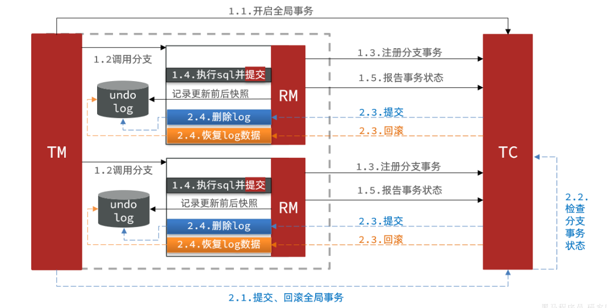  

* 缺陷：**非强一致性** / 短暂的数据不一致（确实比较短，**概率较低，一般不用考虑**）(99%的情况下没问题)
  * ==**脏写**== 问题：一个事务覆盖了另一事务还未提交的数据
    * 通过**TC全局锁**解决
  * 脏读问题：一个事物读取了另一事务还未提交的数据
    * dont know

所以 **XA vs. AT**:

* XA一阶段不提交事务，**锁定资源**，AT会提交，不锁定资源
* XA依赖数据库机制实现回滚，AT依赖undo log实现数据回滚
* XA是强一致性的，AT是最终一致性的，所以你要求效率就AT，要就一致性就XA

#### 解决AT的脏写问题

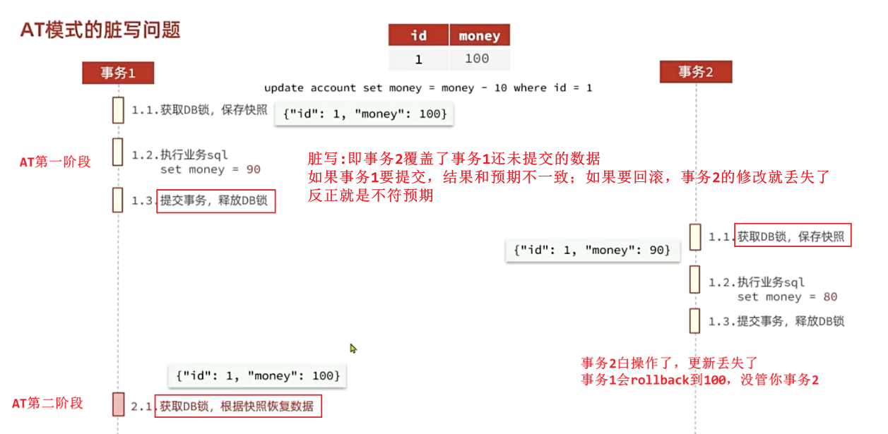  

解决方法：在释放DB锁之前，需要先拿到**TC全局锁**，以避免同一时刻其他事务来操控该数据

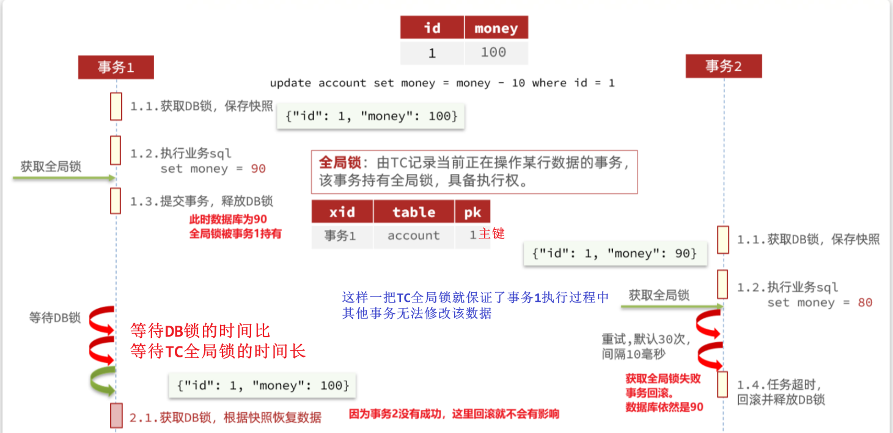  

这和XA模式有什么区别？
https://www.bilibili.com/video/BV1S142197x7?t=647.1&p=159
DB锁由数据库管理（XA模式就是DB锁），DB锁会锁住整行，其他任何事务都无法对这行数据进行增删改查
TC全局锁由TC管理，其他没有被seata管理的事务仍然可以进行增删改查，所以二者有粒度的差别，性能比XA高。

锁有点复杂 [link](https://blog.csdn.net/m0_45406092/article/details/121263208)
