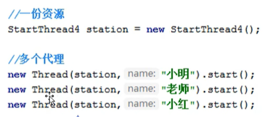

# Java Thread

* 创建线程的三种方式
  * extends Thread类，重写run方法
    * 调用start方法来启动线程，这会调用底层的start0方法（这是一个native方法）。
  * implements Runnable接口，重写run方法（推荐）
    * 创建一个Thread对象，并将Runnable接口实现类对象传递给它，然后调用start方法。
      * 可以把同一个Runnable对象（即用户自定义的被代理类：只用关注业务逻辑的实现）丢给多个线程使用（即Thread代理类：封装了创建和管理逻辑）（一份资源，多个代理） ==太妙了==
        *   
      * 这里使用了：静态**代理设计模式**
      *   
        * 详见onenote: Static Proxy
  * implements Callable接口 (了解)
    * 基本和Runnale类似；但可以有返回值，可以抛出异常。方法不同run()/call()
    * Thread的构造函数可以是Runnable，**但没有Callable**，即无法直接传递Callable对象
      * 解决方法：FutureTask实现了Runnable接口，所以可以把FutureTask丢进Thread构造函数，然后FutureTask的构造函数参数类型可以是`Callable<V>`

```java
// 方法一
class MyThread extends Thread {
    @Override
    public void run() {
        for (int i = 0; i < 5; i++) {
            System.out.println("Thread " + Thread.currentThread().getId() + " is running");
            Thread.sleep(1000); // 让线程休眠1秒
        }
    }
}

public class ThreadExample {
    public static void main(String[] args) {
        // 创建线程对象
        MyThread t1 = new MyThread();
        // MyThread t2 = new MyThread();
        
        t1.start();
        // t2.start();
    }
}
```

当运行该java程序时，即开启了一个进程，首先进入main方法开启主线程(即main线程)，然后t1.start()启动MyThread子线程，start()会调用线程的run(), 进而调用start0()，该方法时一个native本地方法，由jvm调用，底层是c/cpp （linux中jvm应该会调用pthread_create函数创建进程(unix-like os)）; 
更进一步，start()调用start0()之后，**线程不会立马执行，只是将线程变成了就绪状态**，交给cpu调度。
> 为何不直接使用主线程调用run()? 因为run()就是一个**普通方法**，直接使用主线程调用run()并没有真的启动线程。执行该方法时，主线程被阻塞(很正常，没有启动子线程)。

执行MyThread子线程时，main主线程不会阻塞。此时，主线程和子线程并发或并行(如果有多核cpu)执行。

主线程结束之后，子线程未必结束，所以当然进程也未必结束。

```java
// 方法二
class MyRunnable implements Runnable {
    @Override
    public void run() {
        for (int i = 0; i < 5; i++) {
            System.out.println("Runnable Thread " + Thread.currentThread().getId() + " is running");
            Thread.sleep(1000); // 让线程休眠1秒
        }
    }
}

public class RunnableExample {
    public static void main(String[] args) {
        // 丢一个runnable接口实现类即可
        Thread t1 = new Thread(new MyRunnable());
        // Thread t2 = new Thread(new MyRunnable());
        
        t1.start();
        // t2.start();
    }
}
```

