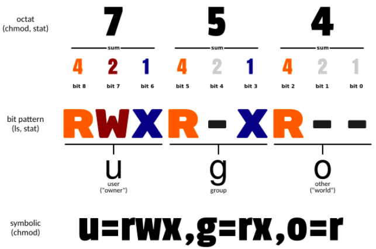

# Linux

- [Linux](#linux)
  - [commands](#commands)
    - [系统管理](#系统管理)
    - [网络相关](#网络相关)
      - [查询](#查询)
      - [网络性能指标](#网络性能指标)
    - [磁盘相关](#磁盘相关)


## commands

### 系统管理

* `ps`: 显示当前运行进程的快照，`ps -aux`显示所有进程
* `top`: 实时显示进程动态
* `df`: 显示文件系统的磁盘空间使用情况
* `du`: 查看目录或文件的磁盘使用情况
* `free`: 显示内存和交换空间的使用情况
* `ifconfig`: 显示网络接口的配置和状态
* `netstat`: 显示网络连接、路由表和网络接口统计，`netstat -tuln`查看所有监听的接口
* `chmod`: 更改文件或目录的权限


**ps -ef**: 显示进程详细信息，连同命令行

- UID: user ID of the process owner
- PID: process ID, unique (>=2)
- PPID: parent process ID
- C: CPU占用率
- STIME: start time
- TTY: 登入者终端机位置
- TIME: cumulative CPU time used by the process
- CMD: command that started the process

ps -ef | grep python: 查看python进程

**ps -aux**: 显示所有进程更详细的信息，包括cpu和内存占用
> a: show processes for all users
> u: display the process's user/owner
> x: 显示无控制终端的进程

- %CPU: CPU占用
- %MEM
- VSZ: 虚拟内存占用量
- STAT: 状态
  - R: 运行
  - D: 不可中断，一般是IO
  - S: 中断
  - T: 停止
  - Z: 僵尸

**kill**: 向进程发送信号
kil -l: 查询所有信号
kill -9 [PID]: 使用SIGKILL强制杀死进程
Ctrl-C: SIGINT: 终止该进程
Ctrl-Z: SIGTSTP: 将前台的进程置于后台，并暂停；可以使用fg调到前台。

**chmod**: 更改文件或目录的权限，可以使用文本方法也可以用**八进制数表示法**
{width=50%}

chmod [{ugoa}{+-=}{rwx}] 文件/目录
+增加，-减少，=赋予； a(all)

### 网络相关

#### 查询

查询本地dns服务器：`cat /etc/resolv.conf`
或者: `nslookup www.baidu.com`(本意是获取ip的)
Non-authoritative answer代表来自缓存
Authoritative answer代表来DNS服务器(实际上是来自权威域名服务器Authoritative DNS Serverreso)
> windows中`ipconfig -all`或者`nslookup`

查看TCP连接：`netstat -napt`

查询端口占用：
`lsof -i:8080`: 显示占用8080端口的进程信息
`netstat -tunlp | grep 8080`:

* t: 显示TCP协议相关的连接
* u: 显示UDP协议相关的连接
* n: 以数字形式显示地址和端口号,不进行域名解析 number
* l: 仅显示正在监听的连接 listen
* p: 显示相关联的进程ID和程序名称 program

#### 网络性能指标

1. 带宽：链路最大传输速率(bit/s)
2. 延时：请求数据包发送后，收到对端响应所需要的时间
3. 吞吐率：单位时间内成功传输的数据量
4. PPS：packet per second，以网络包为单位的传输速率
5. 并发连接数：TCP连接数量
6. 丢包率：丢失数据包数量 / 发送数据包数量
7. 重传率：重传网络包比例

查询网络配置
`ifconfig` 查询所有网口的配置
`ifconfig eno2` 查询eno网口的配置
返回值包括：ipv4, netmask, ipv6, MAC, mtu_size, broadcast接口广播地址
RX packets: 接收数据包数量；TX packets: 发送数据包数量；
errors: 错误数据包，eg校验错误，帧同步错误
dropped: 丢包数量
overruns: 超限数据包，速度过快，ring buffer来不及处理

### 磁盘相关

1.`fdisk -l`：列出系统中连接的磁盘的信息

```sh
rtx5@rtx5:/home/xiahao/temp/PiBO-Spearmint$ sudo fdisk -l
Disk /dev/nvme0n1: 1.76 TiB, 1920383410176 bytes, 3750748848 sectors
Disk model: SAMSUNG MZ1LB1T9HALS-00007
Units: sectors of 1 * 512 = 512 bytes
Sector size (logical/physical): 512 bytes / 512 bytes
I/O size (minimum/optimal): 512 bytes / 512 bytes


Disk /dev/sda: 18.2 TiB, 20000588955648 bytes, 39063650304 sectors
Disk model: MR9340-8i
Units: sectors of 1 * 512 = 512 bytes
Sector size (logical/physical): 512 bytes / 4096 bytes
I/O size (minimum/optimal): 65536 bytes / 131072 bytes
Disklabel type: gpt
Disk identifier: 357959AD-A985-4884-A2B6-F4E3990FF9FE

Device          Start         End     Sectors   Size Type
/dev/sda1        2048   600000511   599998464 286.1G Linux filesystem
/dev/sda2   600000512  4600000511  4000000000   1.9T Linux filesystem
/dev/sda3  4600000512 39063648255 34463647744    16T Linux filesystem
```

表示有两块磁盘：/dev/nvme0n1和/dev/sda
/dev/nvme0n1: 1.76TiB, 型号 SAMSUNG..., 扇区大小512B(逻辑/物理), NVMe固态SSD
/dev/sda: 18.2TiB, 型号MR9340.., 扇区大小512B(逻辑) 4096B(物理)

下面的device实际上就是sda的磁盘分区，分成三个区
/dev/sda1: 起始扇区号, 结束扇区, 大小, 类型为linux文件系统

2.`df -lh`: 查看**文件系统**的磁盘空间**使用情况**
Filesystem： 文件系统的名称。
Size： 文件系统的总大小。
Used： 已使用的空间量。
Avail： 可用空间量。
Mounted on：文件系统的挂载点。

> `lsblk -f` 更方便地查询磁盘挂载；**同一磁盘的不同分区是不同的文件系统**，有独立的UUID。

3.`mount /dev/name /created_dir` 挂载name磁盘到指定目录
