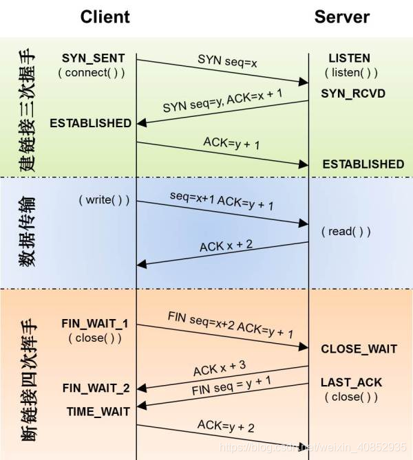

# 计算机网络复试笔记

[toc]

## 一、基础

1. 计网按分布范围分类：广域网WAN(Wide Area Network)、城域网MAN 5-50km（Metropolitan）、局域网 <1km LAN（Local）、个人区域网PAN <10m（Personal）
2. 传输方式按交换技术分类：（有哪些交换技术）
   - 电路交换网络：通过电路交换机建立一条专用的数据通信路径，通信过程中独占。
       - 优点：传输时延小、没有冲突、实时性强；
       - 缺点：独占式信道利用率低、建立连接时间长、灵活性差。
   - 分组交换网络：让连接到通讯电路的计算机将所要发送的数据分成多个数据包，并按找一定顺序排列后分别发送。(TCP/IP)
      - 优点：无需建立连接、信道利用率高、简化了存储管理、加速了传输；共享线路
      - 缺点：存在发送时延、可能会存在分组失序、丢失、重复。
3. 传输方式按有无连接分类：
   - 面向有连接(ATM，帧中继，TCP等，在通信传输之前，先打开一个连接，关闭无法发送数据)：在通信传输前后，专门进行建立和断开连接的处理，没有连接则无法通信，避免发送无谓的数据。
   - 面向无连接(以太网，IP，UDP等协议，无需确认对端是否存在，发送端可随时发送数据。)：接受端需要确定是否收到了数据；因为不需要建立连接，传输速度快。
4. 传输方式按接收端数量分类：
   - 单播(Unicast)：一对一通信。如早期固定电话。
   - 广播(Broadcast)：一对所有通信。一台主机与广播范围(广播域)下其他所有主机通信，如电视播放。
   - 多播(Multicast)：一对多通信。与广播类似，限定某一组主机作为接收端，e.g., 视频会议。
   - 任播(Anycast)：一对特定一通信。指对接收端有选择的通信，与多播相似，选择一组主机中最优目标主机发送，选中主机返回单播信号，随后进行单播，如DNS根域名解析系统。
5. 性能指标
   1. 带宽Bandwidth：数字信道所能传送的“最高数据传输速率”。
   2. 时延Delay：发送时延+传播时延+处理时延+排队时延。
   3. 时延带宽积：以比特为单位的链路长度，= 传播时延 * 信道带宽。
6. 协议：计算机与计算机之间通过网络实现通信时事先达成的一种约定或规范；ISO制定了一个国际标准OSI; IETF制定了一个业界标准，i.e., TCP/IP; 上下层之间交互遵循的约定叫接口，同层之间交互遵循的约定叫做协议。
7. OSI七层参考模型：物理层（Physical Layer）、数据链路层（Data Link Layer）、网络层（NetWork Layer）、传输层（Transport Layer）、会话层（Session Layer）、表示层（Presentation Layer）、应用层（Application Layer）。（下三层为点对点通信、是通信子网，用于数据通信，上四层是端到端通信，上三层是资源子网，用于资源共享）
8. TCP/IP四层参考模型：网络接口层（对应下两层）、网际层、传输层、应用层（上三层）。
  
9. 七层协议详解
   1. **应用层** ：为**特定应用程序**提供数据传输服务，例如 HTTP, DNS, ftp, SMTP, SSH等。数据单位为==报文==。
   2. **表示层** ：设备固有数据格式和网络标准数据格式的转换，接受不同形式的信息，文字图像声音等。
   3. **会话层** ：通信管理，负责**建立和断开通信连接**(数据流动的逻辑通路)；
   4. **传输层** ：负责不同主机中两个**进程**之间的通信。功能是为端到端连接提供**可靠传输**服务，比如：流量控制、差错控制、服务质量、数据传输管理等。
      1. 由于应用层协议很多，定义通用的传输层协议就可以支持不断增多的应用层协议。运输层包括两种协议：传输控制协议 TCP，提供面向连接、可靠的数据传输服务，数据单位为==报文段==；用户数据报协议UDP，提供无连接、尽最大努力的数据传输服务，数据单位为==用户数据报==。TCP 主要提供完整性服务，UDP 主要提供及时性服务。
   5. **网络层** ：负责两台**主机**之间的通信。将数据传输到目标地址，目标地址可以是多个网络通过路由器连接的而成的某一个地址，负责**寻址和路由选择**。网络层把传输层传递下来的报文段或者用户数据报封装成==分组==。IP、ARP
      1. > ip层寻址，tcp/udp层以ip层提供的途径为基础进行实际的数据传输（传输层）
   6. **数据链路层** ：负责物理层面上的**互连**的节点之间的通信。网络层针对的还是主机之间的数据传输服务，而主机之间可以有很多链路，链路层协议就是为同一链路的主机提供数据传输服务。数据链路层把网络层传下来的分组封装成==帧==。PPP Ethernet
      1. 网络层是source到target address，数据链路层仅负责其中的一个个区间内的通信。
   7. **物理层** ：负责物理介质上实现0,1比特流与电子信号的互换与传输。考虑的是怎样在传输媒体上传输数据==比特流==，而不是指具体的传输媒体。物理层的作用是尽可能屏蔽传输媒体和通信手段的差异，使数据链路层感觉不到这些差异。
10. MAC地址：网卡(NIC)设备出厂会烧一个唯一MAC，其层次性对寻址没用，可以不算有层次性；MAC寻址参考地址转发表；
11. IP地址：网络号+主机号；具有层次性；IP寻址参考路由控制表；
12. 网络设备

- **网卡(NIC)/网络适配器**: network interface card/网络接口卡：将数字信号(由一系列01组成的网络包)转换为电信号或光信号，并通过网线或光纤发送出去，到达下一个集线器、路由器等设备
- **中继器(repeater)**: **物理层**面上延长网络的设备；半双工（碰撞现象）
  - 多口中继器又名中继集线器，简称**集线器**(repeater hub): ==无脑将电信号广播到所有端口==，不安全，浪费资源；
  - RJ-45 + PHY(MAU) + 中继电路
  - 广播，一次也只能转发一个包（否则碰撞）
- > 由于集线器会广播到所有端口，浪费资源且不安全。所以考虑单播，所以集线器 + MAC地址表。
- 网桥(bridge)/**二层交换机**: **数据链路层**面上连接两个网络的设备/连接不同终端；全双工
  - 多口网桥又名交换集线器，简称**交换机(switching hub)**: 高级集线器，只发送给目标MAC的端口，维持MAC地址表（MAC->物理端口）；
  - RJ-45 + PHY(MAU) + MAC模块 + 缓冲区 + 交换电路
  - (切记**交换机MAC模块不具有MAC地址**，直接接受所有的包存放到缓冲区，然后由交换电路根据MAC地址表进行包转发到相应端口)
  - 一次可以转发多个包
  - 交换机只是转发包，不会成为发送方或接收方
  - 交换机在地址表中匹配完全一致的MAC
  - 交换机中对 MAC 地址表的维护是包转发操作中的一个步骤
- > 由于交换机不具备独立MAC，当连接另一个交换机的时候需要为另一个交换机上连接的所有电脑的mac都做一个映射，映射表太大了，所以考虑给交换机 + MAC，
- **路由器(router)/三层交换机/网关(gateway)**: **网络层**面上连接两个网络的设备，每一个端口都有独立MAC
  - 端口模块(eg ADSL, FTTH, 无线局域网, 以太网) + 包转发模块(路由表)
  - 路由器的各个端口都具有MAC地址和IP地址
  - 路由器会作为发送方从相应端口发送
  - 路由器在地址表中仅匹配网络号部分，忽略主机号
  - 路由器中对路由表的维护是与包转发操作相互独立的
  - 补充：
  - 光猫/数字调制解调器/翻译(modem): 将光纤的光信号转换为网络信号，然后路由器才能联网
  - 光猫一定有光纤输入接口吧，然后现在的光猫很多有路由功能，但据说比较菜
  - 路由器wan口接光猫，lan口接电脑，还有wifi

## 二、物理层

1. 通信双方按**交互方式**分类：(**信号传输**有哪几种方式)
   1. 单工通信：又称为单向通信，即只能有一个方向的通信而没有反方向的交互。例：无线电广播，电视广播
   2. 半双工通信：又称为双向交替通信，即通信的双方都可以发送信息，但不能双方同时发送（当然也就不能同时接受）
   3. 全双工通信：又称为双向同时通信，即通信的双方可以同时发送和接受信息。
2. Some Conception
   1. 信道：信号的传输媒介。分为模拟信道和数字信道
   2. 码元传输速率（波特率）：单位时间传输的码元（脉冲）个数；
   3. 信息传输速率（比特率）：单位时间传输的比特数（二进制码元个数）；
   4. 比特率=波特率*1码元携带的比特数
   5. 奈氏准则：理想低通（没有噪声、带宽有限）的信道中，极限**码元**传输速率为2W波特。
   6. 香农定理：带宽有限、有噪声时信道的极限数据传输速率为Wlog2(1+S/N)
3. 数字数据编码成数字信号：归零编码、非归零、反向非归零、曼彻斯特、差分曼彻斯特

## 三、数据链路层

1. **透明传输**：由于使用特定的字符来表示帧的开始和结束，所以传输的内容中不能出现和帧定界符相同的字符，但这显然是不可能的，为了解决这个办法，就可以在内容中和帧定界符一样的字符前边加上规定好的**转义字符**，这种方法称为**字符填充**或者是**字节填充**。
2. 流量控制：
   1. 停止-等待协议：发送一帧就要应答一帧，必须等待应答发送方才能继续发送。
   2. 滑动窗口流量控制：发送方维持一组连续的允许发送的帧的序号，叫发送窗口。接收方也维持接受窗口。由接收方对发送方进行流量控制。

3. 滑动窗口：
   1. 停等协议：发1收1（窗口尺寸）；逐个确认、逐个接收
   2. GBN后退N帧协议：发[1, 2^n - 1]，收1；累计确认，逐个接收
   3. SR选择重传协议：发=收=2^(n-1)；逐个确认，可乱序接收
4. 介质访问控制
   1. 信道划分介质访问控制：频分复用（并行）、时分复用（并发）、波分复用（光的频分复用）、码分复用（信道复用技术，为了提升传输能力和资源利用率）
   2. 随机访问介质访问控制：ALOHA、CSMA（先听再发）、CSMA/CD、CSMA/CA（CA是碰撞避免）
      1. CSMA/CD（载波监听多点接入/碰撞检测协议）：（CD是碰撞检测；先听再发、边发边听、冲突停发、随机重发)
      2. CSMA/CA（载波监听多点接入/碰撞避免技术） Carrier Sense Multiple Access with Collision Avoidance

## 四、重点

1. 有哪些私有（保留）地址？
 A类：10.0.0.0 - 10.255.255.255；B类：172.16.0.0 - 172.31.255.255；C类：192.168.0.0 - 192.168.255.255

2.   

3. 在浏览器中输入网址之后执行会发生什么？
    - 查找域名对应的IP地址。这一步会依次查找浏览器缓存，系统缓存，路由器缓存，本地域名服务器，根域名服务器，顶级域名服务器，权限域名服务器。
        - 两种解析方法：
            - 递归查询：主机递归查询 本地 - 根 - 顶级 - 权限域名服务器
            - 递归查询和迭代查询结合：主机递归查询本地..；本地迭代查询根 - 顶级 - 权限；
    - 浏览器向IP对应的web服务器发送一个HTTP请求
    - 服务器响应请求，发回网页内容
    - 浏览器解析网页内容
4. ARP地址解析协议
    完成IP地址到MAC地址的映射。若同一个局域网中的主机A给B发数据，先在ARP高速缓存中查看有无主机B的IP地址，若有，可查出对应的mac地址，再将mac地址写入MAC帧并发送；若没有，先使用目的MAC地址为6个FF的帧广播ARP请求分组，主机B收到请求后，向A发出相应ARP分组，其中包含B的mac地址。
5. ipv4和ipv6的区别
    ipv4是用32bit来表示的,通常分成4段8位序列，用10进制来表示每一段(范围就是0到255)以“.”分隔，而ipv6使用128bit表示,用十六进制来表示的，也按照8位分割，以16进制来记录每一段,以“：”分隔。
6. TCP（Transmission Control Protocol）和UDP（User Datagram数据报 Protocol）是OSI模型中的运输层中的协议。
    - TCP**面向连接**，UDP**面向非连接**；即发送数据前不需要建立链接
    - TCP提供**稳定可靠**的服务（数据传输），UDP无法保证，可能丢包
    - TCP面向**字节流**，UDP面向**报文**
    - TCP数据传输**慢**，UDP数据传输**快**
    - TCP适合传输文件、发送文件；UDP适合语音通话、视屏直播；
7. TCP三次握手（TCP为全双工通信，双方均可发起 建立or中断）
    (我要和你建立链接，你真的要和我建立链接么，我真的要和你建立链接，成功)：
    1. 第一次握手(SYN=1, seq=x): **SYN包**
        客户将标志位SYN=1，随机产生一个值seq=x，将该数据包发送给服务器。
    2. 第二次握手(SYN=1, ACK=1, seq=y, ACKnum=x+1):**SYN+ACK包**
        服务器收到数据包后由标志位SYN=1知道客户器请求建立连接，服务器将标志位SYN和ACK都置为1，ack=x+1，随机产生一个值seq=y，并将该数据包发送给Client以确认连接请求。
    3. 第三次握手(ACK=1，ACKnum=y+1)：**ACk包**
        客户机收到确认后，检查ack是否为x+1，ACK是否为1，如果正确则将标志位ACK置为1，ack=y+1，并将该数据包发送给服务器，完成三次握手，随后双方可以开始传输数据了。
        为啥两次握手不行？
        - 如只有两次：如果只是两次握手， 至多只有连接发起方的起始序列号能被确认， 另一方选择的序列号则得不到确认；需要三次握手的目的是**在不可靠的信道上建立可靠的连接**；“这个问题的本质是, 信道不可靠, 但是通信双发需要就某个问题达成一致”
      

8. TCP四次挥手
     (我要和你断开链接；好的，断吧。我也要和你断开链接；好的，断吧)：

- 第一次挥手(FIN=1，seq=x)**FIN包**
      假设客户端想要关闭连接，客户端发送一个 FIN 标志位置为1的包，表示自己已经没有数据可以发送了，但是仍然可以接受数据。

- 第二次挥手(ACK=1，ACKnum=x+1)**ACK包**

  服务器端确认客户端的 FIN 包，发送一个确认包，表明自己接受到了客户端关闭连接的请求，但还没有准备好关闭连接。

- 第三次挥手(FIN=1，seq=y)**FIN包**

    服务器端准备好关闭连接时，向客户端发送结束连接请求，FIN 置为1。

- 第四次挥手(ACK=1，ACKnum=y+1)**ACK包**

    客户端接收到来自服务器端的关闭请求，发送一个确认包，并进入 `TIME_WAIT`状态，等待可能出现的要求重传的 ACK 包。

    客户端等待了某个固定时间（两个最大段生命周期，2MSL，2 Maximum Segment Lifetime）之后，没有收到服务器端的 ACK ，认为服务器端已经正常关闭连接，于是自己也关闭连接，进入 `CLOSED` 状态。

9. TCP中的流量控制和拥塞控制
    注：tcp协议如何保证传输的可靠性
    **流量控制**主要针对的是端到端传输中控制流量大小并保证传输可靠性（未收到ack就不滑动）。流量控制往往  是指**点对点**通信量的控制，所要做的是抑制发送端发送数据的速率。
    **拥塞控制**主要是一个**全局性过程**，涉及到所有主机，路由器，以及与降低网络传输性能有关的所有因素。防  止过多的数据注入到网络中。如果有发生丢包则通过拥塞控制减小窗口，确定出合适(==慢启动 拥塞避免 快重传 快恢复==)的拥塞窗口（增性加乘性减）。
    1. 慢启动：不要一开始就发送大量的数据，先探测一下网络的拥塞程度，也就是说由小到大逐渐增加拥塞窗口的大小;
    2. 拥塞避免：拥塞避免算法让拥塞窗口缓慢增长，即每经过一个往返时间RTT就把发送方的拥塞窗口cwnd加1，而不是加倍，这样拥塞窗口按线性规律缓慢增长。
    3. 快重传：快重传要求接收方在收到一个 失序的报文段 后就立即发出 重复确认（为的是使发送方及早知道有报文段没有到达对方）而不要等到自己发送数据时捎带确认。快重传算法规定，发送方只要一连收到三个重复确认就应当立即重传对方尚未收到的报文段，而不必继续等待设置的重传计时器时间到期。
    4. 快恢复：快重传配合使用的还有快恢复算法，当发送方连续收到三个重复确认时，就执行“乘法减小”算法，把ssthresh门限减半，但是接下去并不执行慢开始算法：因为如果网络出现拥塞的话就不会收到好几个重复的确认，所以发送方现在认为网络可能没有出现拥塞。所以此时不执行慢开始算法，而是将cwnd设置为ssthresh的大小，然后执行拥塞避免算法。
  

10. DNS,域名系统（Domain Name System缩写DNS，Domain Name被译为域名）是因特网的一项核心服务，它作为可以将域名和IP地址相互映射的一个分布式数据库，能够使人更方便的访问互联网，而不用去记住能够被机器直接读取的IP数串。
11. DHCP（Dynamic Host Configuration Protocol，动态主机配置协议）应用层协议；通常被应用在大型的局域网络环境中，主要作用是集中的管理、分配IP地址，使网络环境中的主机动态的获得IP地址，能够提升地址的使用率。DHCP协议采用客户端/服务器模型。

