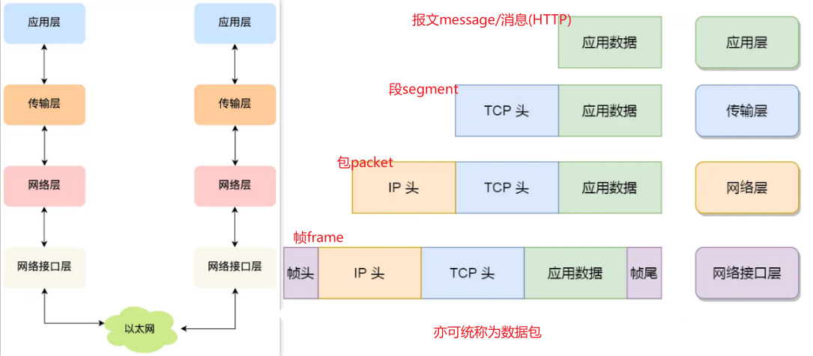
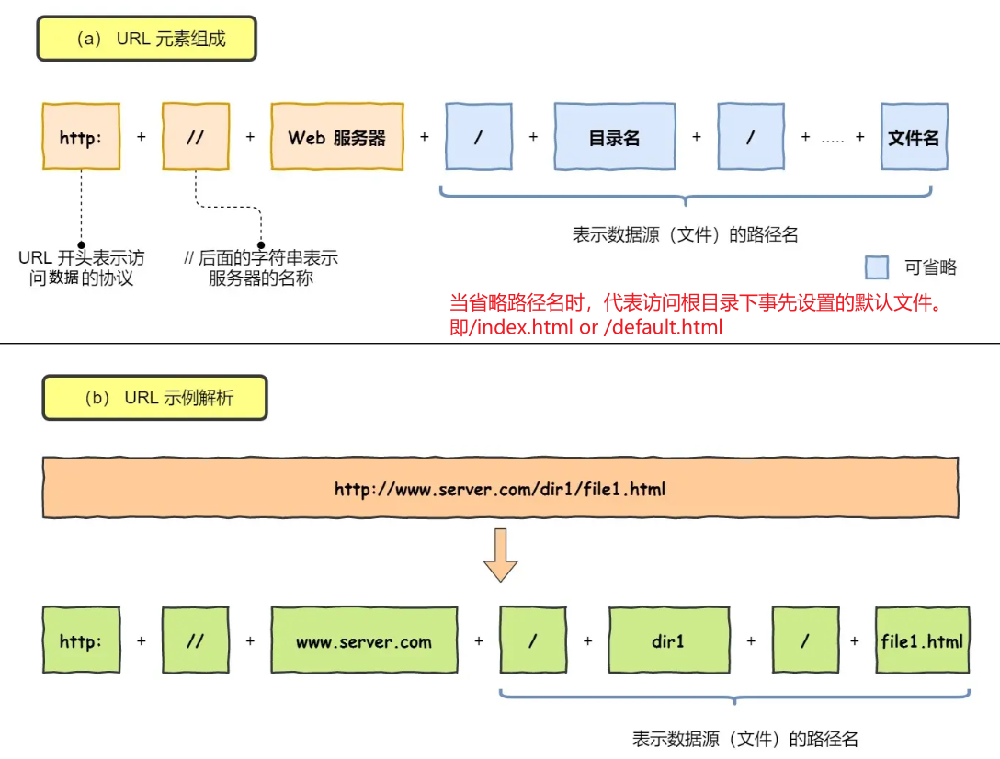
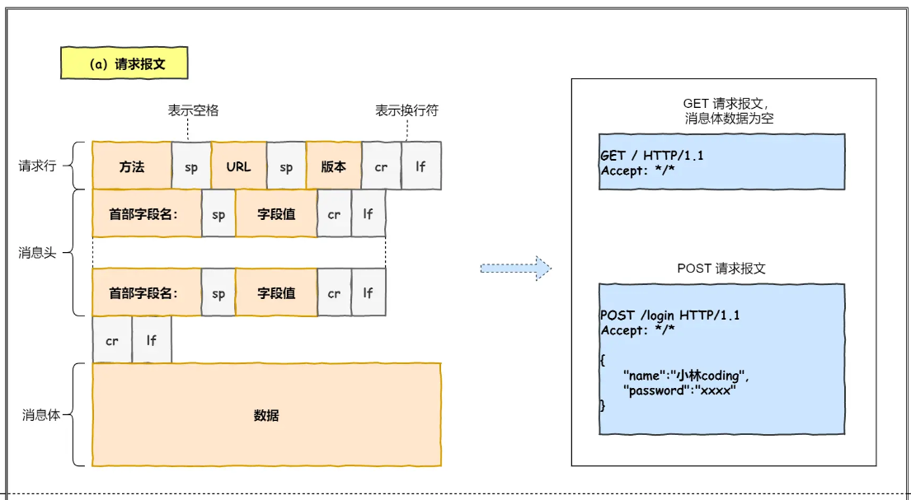
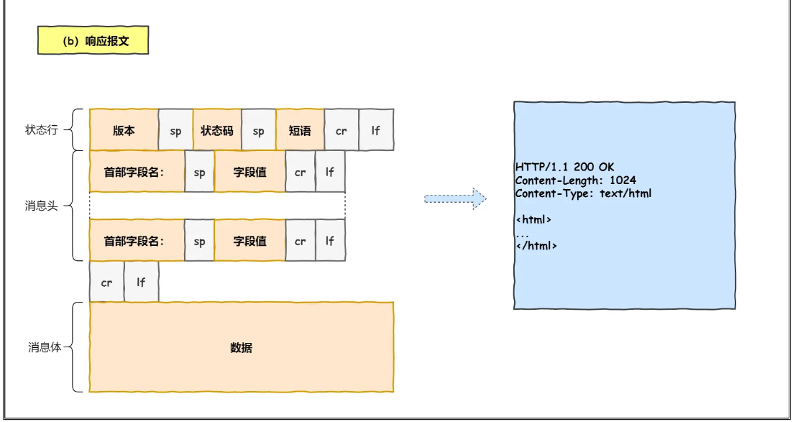
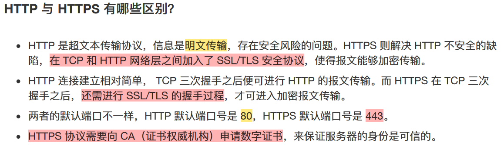
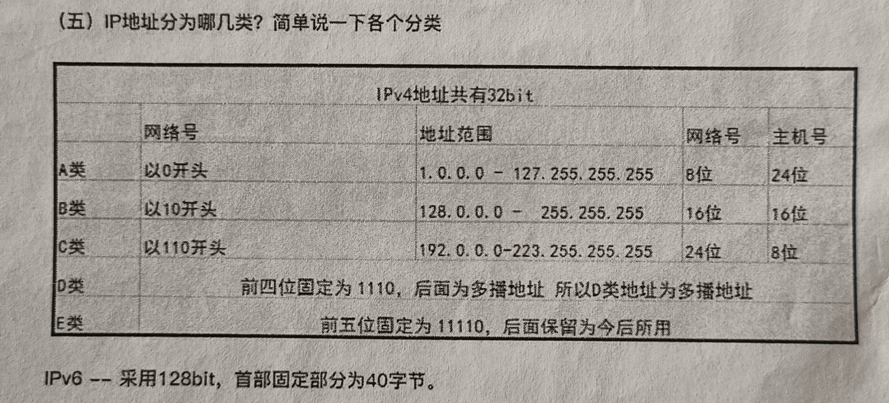

# 计算机网络笔记

[toc]

## 一、基础

### 分层

TCP/IP四层参考模型：应用层（上三层），传输层，网络层，网络接口层（下两层）
我更喜欢五层模型。数据链路层管mac，分离出来还是挺好的。

  

七层协议详解（可以直接忽略表示层、会话层，然后合并下两层）

1. **应用层Application Layer** ：为**特定应用程序**提供数据传输服务，e.g., HTTP, FTP, Telnet, DNS, SMTP, SSH等。数据单位为==报文==。
    1. 应用层工作在os的用户态，传输层及以下工作在内核态。
2. 表示层 ：设备固有数据格式和网络标准数据格式的转换，接受不同形式的信息，文字图像声音等。
3. 会话层 ：通信管理，负责**建立和断开通信连接**(数据流动的逻辑通路)；
4. **传输层Transport Layer** ：负责不同主机中两个**进程**之间的通信（通过**端口**）。
    1. 由于应用层协议很多，定义通用的传输层协议就可以支持不断增多的应用层协议。
        1. 传输控制协议 TCP：提供面向连接、**可靠的数据传输服务**.(特性：流量控制、超时重传、拥塞控制).数据单位为==报文段(TCP Segment)==；e.g., HTTP.
        2. MSS: TCP最大报文段长度
        3. 用户数据报协议UDP：提供无连接、尽最大努力的数据传输服务，数据单位为==用户数据报==。TCP 主要提供完整性服务，UDP 主要提供及时性服务。
5. **网络层Internet Layer** ：负责两台**主机**之间的通信。将数据传输到目标地址，目标地址可以是多个网络通过路由器连接的而成的某一个地址，负责**寻址和路由选择**。
    1. IP协议将传输层的报文段作为数据部分，加上IP包头组装为IP==分组==。IP分组>MTU将进行分片(以太网=1500B)。
    2.   
    3. IP协议两个功能：**寻址和路由选择**（区别在哪？）
6. **数据链路层(MAC层)** ：负责物理层面上的**互连**的节点之间的通信。网络层针对的还是主机之间的数据传输服务，而主机之间可以有很多链路，链路层协议就是为同一链路的主机提供数据传输服务。数据链路层把网络层传下来的分组封装成==帧==。PPP Ethernet
    1. 网络层是source address -> target address，数据链路层仅负责其中的一个个区间内的通信。
7. **物理层** ：负责物理介质上实现0,1比特流与电子信号的互换与传输。考虑的是怎样在传输媒体上传输数据==比特流==，而不是指具体的传输媒体。物理层的作用是尽可能屏蔽传输媒体和通信手段的差异，使数据链路层感觉不到这些差异。

MAC地址：网卡(NIC)设备出厂会烧一个唯一MAC，其层次性对寻址没用，可以不算有层次性；MAC寻址参考地址转发表；
IP地址：网络号+主机号；具有层次性；IP寻址参考路由控制表；

  

---

### input URL -> display webPage

#### HTTP

   1. (浏览器)解析URL得到Web服务器和文件名
   2. 生成HTTP请求消息

  

所以常常的URL实际上就是请求Web服务器中的文件资源。

HTTP消息
  
  

#### DNS

浏览器解析URL生成HTTP消息后，需要委托os将消息发送给web服务器(基于IP)。但在发送之前，需要查询服务器域名对应的IP地址。

DNS(Domain Name System)服务器专门保存了web服务器域名与其ip之间的映射，是一种服务器。
> 域名用·分隔，越靠右层级越高(老外总喜欢反着来)

实际上www.google.com完整形式是www.google.com.; 域名层级关系为:

1. **根域名**DNS服务器(.): Root DNS Servers
2. **顶级域名**DNS服务器(.com): Top-Level Domain(TLD) Servers
3. **权威域名**DNS服务器(google.com): Authoritative DNS Servers
4. 递归域名服务器(本地域名服务器)：Recursive DNS Servers，负责向其他DNS服务器查询映射信息，给到用户。

> 根域的DNS服务器信息存在互联网的所有DNS服务器中。故而所有DNS服务器都可找到根域DNS服务器，一路向下顺藤摸瓜就找到了目标DNS服务器。

讲解域名解析的过程：
  
> 本地DNS服务器就是递归DNS服务器，一般可能在运营商那。
> DNS解析中**缓存查询**：先查询浏览器缓存 -> 查询操作系统缓存 -> 查询Hosts文件 -> (路由器缓存、ISP缓存) -> 都没有才去问本地DNS服务器

#### 协议栈

通过DNS获取IP之后，就可以把HTTP传输工作交给**操作系统中**的协议栈了。
  

- 应用程序调用socket来委托协议栈工作
- 网卡驱动程序负责控制网卡硬件，网卡负责对网线中的信号执行发送和接受操作

协议栈中一步步来咯

##### 3.1 TCP

http基于tcp。

**讲解TCP报文头部格式**：
  

**三次握手建立连接**：所谓连接，只是双方计算机内维护的一个状态机中的状态变化。
  
  

> `netstat -napt`: 查询tcp连接状态

如果HTTP请求消息过长，超过MSS，TCP会对其进行分割。然后加上TCP头部(源端口是浏览器客户端随机的，目标端口为80(http)或者443(https))。
此时请求报文位于tcp报文的数据部分，**封装的很安全可靠了**，可以发送了。

<!-- TCP三次握手（TCP为全双工通信，双方均可发起 建立or中断）
(我要和你建立链接，你真的要和我建立链接么，我真的要和你建立链接，成功)： -->
<!-- 1. 第一次握手(SYN=1, seq=x): **SYN包**
    客户将标志位SYN=1，随机产生一个值seq=x，将该数据包发送给服务器。
1. 第二次握手(SYN=1, ACK=1, seq=y, ACKnum=x+1):**SYN+ACK包**
    服务器收到数据包后由标志位SYN=1知道客户器请求建立连接，服务器将标志位SYN和ACK都置为1，ack=x+1，随机产生一个值seq=y，并将该数据包发送给Client以确认连接请求。
2. 第三次握手(ACK=1，ACKnum=y+1)：**ACk包**
    客户机收到确认后，检查ack是否为x+1，ACK是否为1，如果正确则将标志位ACK置为1，ack=y+1，并将该数据包发送给服务器，完成三次握手，随后双方可以开始传输数据了。 -->
<!-- 为啥两次握手不行？

- 如只有两次：如果只是两次握手， 至多只有连接发起方的起始序列号能被确认， 另一方选择的序列号则得不到确认；需要三次握手的目的是**在不可靠的信道上建立可靠的连接**；“这个问题的本质是, 信道不可靠, 但是通信双发需要就某个问题达成一致”

   -->

<!-- 1. TCP四次挥手
     (我要和你断开链接；好的，断吧。我也要和你断开链接；好的，断吧)：

- 第一次挥手(FIN=1，seq=x)**FIN包**
      假设客户端想要关闭连接，客户端发送一个 FIN 标志位置为1的包，表示自己已经没有数据可以发送了，但是仍然可以接受数据。

- 第二次挥手(ACK=1，ACKnum=x+1)**ACK包**

  服务器端确认客户端的 FIN 包，发送一个确认包，表明自己接受到了客户端关闭连接的请求，但还没有准备好关闭连接。

- 第三次挥手(FIN=1，seq=y)**FIN包**

    服务器端准备好关闭连接时，向客户端发送结束连接请求，FIN 置为1。

- 第四次挥手(ACK=1，ACKnum=y+1)**ACK包**

    客户端接收到来自服务器端的关闭请求，发送一个确认包，并进入 `TIME_WAIT`状态，等待可能出现的要求重传的 ACK 包。

    客户端等待了某个固定时间（两个最大段生命周期，2MSL，2 Maximum Segment Lifetime）之后，没有收到服务器端的 ACK ，认为服务器端已经正常关闭连接，于是自己也关闭连接，进入 `CLOSED` 状态。 -->

##### 3.2 IP

可是发给谁呢，TCP头部目前只有port，需要搞个目标主机的地址啊。ip来整远程定位吧。

老规矩，讲解IP报文头部格式：
  

ok，现在网络报的报文为：
|IP头部|TCP头部|HTTP报文(HTTP头部+数据)|
|------|------|----------------------|

##### 3.3 MAC

ok，挺好的，ip帮我远程定位到**最终**目标地址了，可是好远啊，我下一站去哪儿呢？需要一个**两点传输**助手：MAC。

> 注意MAC功能属于IP层(arp)，不是网卡控制的奥。

老规矩，上MAC头部：
  

发送方MAC：从网卡读一下
接收方MAC：（有点复杂，交给ARP）

ARP地址解析协议：IP->MAC; `arp -a`
若同一个局域网中的主机A给B发数据，先查询**ARP缓存**(就几分钟...)中有无B的IP，若有，相应mac写入mac帧发送即可；
若无，发送**帧广播ARP请求分组**：目的MAC地址为FF-FF-FF-FF-FF-FF，目的ip也已知。主机B收到请求后，向A单播一个包含自己mac的ARP应答分组。

知道了目标ip对应的MAC之后，就确定了下一站地址（交换机内部维持一张mac->端口的映射表(此处的端口真的是交换机上的物理端口)）也即**以太网内的传输是基于mac的**。

> ARP请求/应答报文 = 发送端mac + 发送端IP + 目的端mac + 目的端ip

ok，现在网络报的报文为：
|MAC头部|IP头部|TCP头部|HTTP报文(HTTP头部+数据)|
|----|------|------|----------------------|

> question: why we need MAC addr? 

#### 网卡

我们的网络包是一堆二进制数据，无法直接发给对方，需要将**数字信号转为电信号**，才能在网线上传输，即真正的传输。**网卡**要登场了。在网卡之前，还有**网卡驱动程序**。

首先，**网卡驱动**获取网络包之后，会将其**复制**到**网卡内的缓存区**中，接着会在其开头加上**报头**和**起始帧分界符**， 在末尾加上用于检测错误的**帧校验序列**。

  

==到此，真的是封装完毕了==！交给网卡转为电信号发出去了。

#### 交换机

交换机位于MAC层(**数据链路层**)，二层网络设备。**交换机的端口没有mac地址。**

网线上电信号来到交换机，将其转换为数字信号。根据FCS进行错误校验，若没问题，放到交换机缓冲区内。（无法判断mac所以没出错的话统统接受）

交换机内部维持着一张**mac地址表->端口之间的映射表**。据此，就可以知道要发给目标mac电脑要走哪个端口。如果映射表中没找到，只能转发到除了源端口以外的所有端口，非目标机自动丢弃。（目标机响应的时候可以记录下映射）

> 集线器hub是无脑将收到的电信号广播给所有出口。很呆，所以是一层网络设备(物理层)。接收方主机通过mac地址进行判断是不是发给自己的。
> 交换机是将收到电信号只发给**目标mac指定的电脑对应的出口**。有点聪明，定义到二层网络设备(数据链路层)。

#### 路由器

网络包经过交换机后到达路由器，将会转发给下一个路由器或目标设备。
路由器基于ip(网络层)，三层网络设备，**路由器的各个端口都具有MAC地址及IP地址**。
交换机基于以太网，二层网络设备，各个端口没有mac。由于路由器端口具有mac，故而可以成为以太网的发送方和接收方。各个端口的ip使其某种意义上和计算机内网卡一样。

路由器端口作为接收方收到以太网包后，根据**路由表**查询转发目标，再由相应的端口作为发送方将以太网包发出去。

Specifically，接收以太网包，开始类似于交换机，将电信号**转为数字信号**，然后进行**FCS校验**。此外，**检查头部的目的mac地址**是不是自己，如果是，放到路由器缓冲区中。不是，直接丢弃，交换机没这功能。

然后mac地址的使命结束（mac头部的作用就是将包送给下一个路由器），那么**去掉mac头部**，然后根据ip头部进行转发。

**如何转发ip包呢？**

> `route -n`或者`netstat -r`查询路由表

1. 查询路由表判断转发目标。
   1. 路由匹配：根据目标ip查询路由表的目标地址列，将目标ip与每个条目的的子网掩码进行与操作，如匹配，将该路由器端口作为转发目标。如果没匹配的，选择默认路由`0.0.0.0`.
2. 路由器发送包（**仅修改mac头部(因为以太网内的两个设备传递依靠mac)，不动ip头部**）
   1. 根据路由表的网关列(gateway)判断对方的ip地址（**路由器不修改包内两端的ip奥**）。网关列显示了需要把数据包发送给哪个ip才能到达目标网段
      2. 如果目标网络在本地网段内，网关列可能显示0.0.0.0或空，表示直接可达。
      3. 如果网关列有个ip地址，说明还没到，这个ip是下一跳网关，数据包需要先到这个网关，然后再进行转发。
   2. 知道了ip之后，使用arp查到mac作为目标mac(路由器也有arp缓存)，本地mac使用路由器该端口的mac。**修改mac头部**之后将包转为电信号通过端口发送。
3. 如此经过多个路由器后，网络包到达最终网段。

  

> 交换机转发过程中会修改mac，不修改ip，也会重新计算尾部fcs；我感觉头尾网卡负责的部分可能都需要修改，但我不确定:)

#### 服务器

网络包到达服务器后，先检查mac头部看看mac匹配否，匹配就收下。（要FCS校验吗？）然后看看ip头部的协议项，知道了上层是tcp协议，然后看看tcp头部，看看里面的序列号是不是想要的，是就放到缓存，返回一个ACK，不是则丢弃。此外，由于服务器的HTTP在监听80，如果tcp头部端口是80，服务器就把包发给http进程了。

HTTP进程看到这个请求是要访问一个页面，于是就把这个网页封装在HTTP响应报文里。响应报文也需要穿上相应的TCP、IP、MAC头部。完事儿后从网卡出发->交换机->路由器-> ... ->客户端那边的路由器->交换机->客户端->开始扒掉头部剩下http响应报文->交给浏览器渲染webPage，over！

最后，客户端要离开了，双方四次挥手断开连接（沟通一次真的挺累的。

## 二、HTTP

HTTP (HyperText Transfer Protocol)超文本传输协议
什么是超文本？是文字、图片、视频、**超链接**的混合体，HTML是常见的超文本，本身只是纯文字文件，但内部用很多标签定义了图片、视频等的链接，再经过浏览器的解释，呈现给我们的就是一个文字、有画面的网⻚了。

### 基础

HTTP常见状态码（详见p64 xiaolin）：
  

HTTP常见字段有：（暂略）

#### GET与POST

GET 的语义是从服务器获取指定的资源。浏览器限制url长度。
POST 的语义是根据请求负荷（报文body）对指定的资源做出处理。可以将任意格式的数据写在报文body中，浏览器不限制body大小。

安全：请求方法不会破坏服务器上的资源
幂等：多次执行相同的操作，返回的结果相同
RFC(Request for comments)规范如下（但程序员未必遵守...）：
  

#### HTTP缓存

对于一些重复性的HTTP请求，可以把这对「请求-响应」的数据都缓存在本地。HTTP缓存有两种实现方式：强制缓存和协商缓存。

强制缓存：只要浏览器判断缓存没有过期，则直接使用浏览器的本地缓存，决定是否使用缓存的主动性在于浏览器这边。(from disk cache)。强制缓存在response header设置两个字段表示资源在客户端缓存的有效期：相对时间Cache-control和绝对时间Expires.

协商缓存：通过服务端告知客户端是否可以使用本地缓存的资源，通过`304`状态码表示。
实现方式一（基于时间）：Last-Modified和If-Modified-Since
实现方式二（基于标识，优先级更高）：Etag和If-None-Match

协商缓存这两个字段都需要配合强制缓存中 Cache-Control 字段来使用，只有在未能命中强制缓存的时候，才能发起带有协商缓存字段的请求。
  
> question: 很多cache-control设置为1年，那么一年内都不会更新？有图可知当过期后才回去更新似乎。

#### HTTP/1.1特性

- 优点
  - 简单：报文格式header+body; header中key-value
  - 灵活，易于扩展：http在应用层，下层可以任意变化
    - HTTPS：在HTTP与TCP层之间增加了SSL/TLS安全传输层
    - HTTP/1.1和HTTP/2.0传输协议使用的是TCP协议，而到了 HTTP/3.0传输协议改用了UDP协议。
  - 跨平台、应用广泛
- 缺点
  - **无状态**
    - 好处：服务器不会去记忆HTTP的状态，减轻负担。
    - 坏处：服务器没有记忆能力，它在完成有关联性的操作时会非常麻烦。so cookie诞生。
      - Cookie通过在**请求和响应报文**中写入Cookie信息来控制客户端的状态。
      - 在客户端第一次请求后，**服务器会下发一个**装有客户信息的「小贴纸」，后续客户端请求服务器的时候，带上「小贴纸」，服务器就能认得了。
  - **明文传输** -> so HTTPS
    - 好处：方便阅读和调试
    - 坏处：信息裸奔
  - **不安全**
    - 窃听风险：**通信使用明文**（不加密），内容可能会被窃听。比如，账号信息容易泄漏，那你号没了。
    - 篡改风险：**无法证明报文的完整性**，所以有可能已遭篡改。比如，网⻚上植入垃圾广告，视觉污染，眼没了。
    - 冒充风险：**不验证通信方的身份**，因此有可能遭遇伪装。比如，访问假的淘宝、拼多多，那你钱没了。
- 速度如何呢（一般般）-> so HTTP/2, HTTP/3
  - 长连接
    - HTTP/1.0不支持长连接，每一个请求都需要建立断开连接，累死了。HTTP/1.1提出长连接keep-alive，会好一些。
  - 对头阻塞（跟堵车一样）
    - 顺序发送的请求序列中的一个请求因为某原因被阻塞时，后面排队的所有请求也一同被阻塞了，会招致客户端一直请求不到数据。
  - 管道网络传输（HTTP/1.1有这个功能，但现实中没使用，我们认为他不具有好了）
    - 一个TCP连接中，客户端可以发起多个请求，只要第一个请求发出去了，不等其回来，就发第二个请求出去。但是**服务器必须按照接收请求的顺序发送对这些管道化请求的响应**。所以，**HTTP/1.1管道解决了请求的队头阻塞，但是没有解决响应的队头阻塞**。

#### HTTPS

  

HTTPS在HTTP和TCP层之间添加`SSL/TLS`协议，解决了HTTP的不安全：**信息加密**防止窃听，**校验机制**防止篡改，**身份证书**防止冒充

对称加密：发送方和接收方用同样的规则（钥匙）对数据进行加密和解密。（直到加密规则就破解了）
非对称加密：用两个秘钥进行加密和解密，公开密钥所有人都知道，私有密钥仅仅持有方才有，私钥放在服务器中，数据经过公钥加密就只能被私钥解密，数据经过私钥加密就只能被公钥解密

## 二、物理层

1. 通信双方按**交互方式**分类：(**信号传输**有哪几种方式)
   1. 单工通信：又称为单向通信，即只能有一个方向的通信而没有反方向的交互。例：无线电广播，电视广播
   2. 半双工通信：又称为双向交替通信，即通信的双方都可以发送信息，但不能双方同时发送（当然也就不能同时接受）
   3. 全双工通信：又称为双向同时通信，即通信的双方可以同时发送和接受信息。
2. Some Conception
   1. 信道：信号的传输媒介。分为模拟信道和数字信道
   2. 码元传输速率（波特率）：单位时间传输的码元（脉冲）个数；
   3. 信息传输速率（比特率）：单位时间传输的比特数（二进制码元个数）；
   4. 比特率=波特率*1码元携带的比特数
   5. 奈氏准则：理想低通（没有噪声、带宽有限）的信道中，极限**码元**传输速率为2W波特。
   6. 香农定理：带宽有限、有噪声时信道的极限数据传输速率为Wlog2(1+S/N)
3. 数字数据编码成数字信号：归零编码、非归零、反向非归零、曼彻斯特、差分曼彻斯特

## 三、数据链路层

1. **透明传输**：由于使用特定的字符来表示帧的开始和结束，所以传输的内容中不能出现和帧定界符相同的字符，但这显然是不可能的，为了解决这个办法，就可以在内容中和帧定界符一样的字符前边加上规定好的**转义字符**，这种方法称为**字符填充**或者是**字节填充**。
2. 流量控制：
   1. 停止-等待协议：发送一帧就要应答一帧，必须等待应答发送方才能继续发送。
   2. 滑动窗口流量控制：发送方维持一组连续的允许发送的帧的序号，叫发送窗口。接收方也维持接受窗口。由接收方对发送方进行流量控制。

3. 滑动窗口：
   1. 停等协议：发1收1（窗口尺寸）；逐个确认、逐个接收
   2. GBN后退N帧协议：发[1, 2^n - 1]，收1；累计确认，逐个接收
   3. SR选择重传协议：发=收=2^(n-1)；逐个确认，可乱序接收
4. 介质访问控制
   1. 信道划分介质访问控制：频分复用（并行）、时分复用（并发）、波分复用（光的频分复用）、码分复用（信道复用技术，为了提升传输能力和资源利用率）
   2. 随机访问介质访问控制：ALOHA、CSMA（先听再发）、CSMA/CD、CSMA/CA（CA是碰撞避免）
      1. CSMA/CD（载波监听多点接入/碰撞检测协议）：（CD是碰撞检测；先听再发、边发边听、冲突停发、随机重发)
      2. CSMA/CA（载波监听多点接入/碰撞避免技术） Carrier Sense Multiple Access with Collision Avoidance

## 四、重点

1. 有哪些私有（保留）地址？
 A类：10.0.0.0 - 10.255.255.255；B类：172.16.0.0 - 172.31.255.255；C类：192.168.0.0 - 192.168.255.255

2.   

3. 在浏览器中输入网址之后执行会发生什么？
    - 查找域名对应的IP地址。这一步会依次查找浏览器缓存，系统缓存，路由器缓存，本地域名服务器，根域名服务器，顶级域名服务器，权限域名服务器。
        - 两种解析方法：
            - 递归查询：主机递归查询 本地 - 根 - 顶级 - 权限域名服务器
            - 递归查询和迭代查询结合：主机递归查询本地..；本地迭代查询根 - 顶级 - 权限；
    - 浏览器向IP对应的web服务器发送一个HTTP请求
    - 服务器响应请求，发回网页内容
    - 浏览器解析网页内容
5. ipv4和ipv6的区别
    ipv4是用32bit来表示的,通常分成4段8位序列，用10进制来表示每一段(范围就是0到255)以“.”分隔，而ipv6使用128bit表示,用十六进制来表示的，也按照8位分割，以16进制来记录每一段,以“：”分隔。
6. TCP（Transmission Control Protocol）和UDP（User Datagram数据报 Protocol）是OSI模型中的运输层中的协议。
    - TCP**面向连接**，UDP**面向非连接**；即发送数据前不需要建立链接
    - TCP提供**稳定可靠**的服务（数据传输），UDP无法保证，可能丢包
    - TCP面向**字节流**，UDP面向**报文**
    - TCP数据传输**慢**，UDP数据传输**快**
    - TCP适合传输文件、发送文件；UDP适合语音通话、视屏直播；

7. TCP中的流量控制和拥塞控制
    注：tcp协议如何保证传输的可靠性
    **流量控制**主要针对的是端到端传输中控制流量大小并保证传输可靠性（未收到ack就不滑动）。流量控制往往  是指**点对点**通信量的控制，所要做的是抑制发送端发送数据的速率。
    **拥塞控制**主要是一个**全局性过程**，涉及到所有主机，路由器，以及与降低网络传输性能有关的所有因素。防  止过多的数据注入到网络中。如果有发生丢包则通过拥塞控制减小窗口，确定出合适(==慢启动 拥塞避免 快重传 快恢复==)的拥塞窗口（增性加乘性减）。
    1. 慢启动：不要一开始就发送大量的数据，先探测一下网络的拥塞程度，也就是说由小到大逐渐增加拥塞窗口的大小;
    2. 拥塞避免：拥塞避免算法让拥塞窗口缓慢增长，即每经过一个往返时间RTT就把发送方的拥塞窗口cwnd加1，而不是加倍，这样拥塞窗口按线性规律缓慢增长。
    3. 快重传：快重传要求接收方在收到一个 失序的报文段 后就立即发出 重复确认（为的是使发送方及早知道有报文段没有到达对方）而不要等到自己发送数据时捎带确认。快重传算法规定，发送方只要一连收到三个重复确认就应当立即重传对方尚未收到的报文段，而不必继续等待设置的重传计时器时间到期。
    4. 快恢复：快重传配合使用的还有快恢复算法，当发送方连续收到三个重复确认时，就执行“乘法减小”算法，把ssthresh门限减半，但是接下去并不执行慢开始算法：因为如果网络出现拥塞的话就不会收到好几个重复的确认，所以发送方现在认为网络可能没有出现拥塞。所以此时不执行慢开始算法，而是将cwnd设置为ssthresh的大小，然后执行拥塞避免算法。
  

1. DHCP（Dynamic Host Configuration Protocol，动态主机配置协议）应用层协议；通常被应用在大型的局域网络环境中，主要作用是集中的管理、分配IP地址，使网络环境中的主机动态的获得IP地址，能够提升地址的使用率。DHCP协议采用客户端/服务器模型。

## other

1. 计网按分布范围分类：广域网WAN(Wide Area Network)、城域网MAN 5-50km（Metropolitan）、局域网 <1km LAN（Local）、个人区域网PAN <10m（Personal）
2. 传输方式按交换技术分类：（有哪些交换技术）
   - 电路交换网络：通过电路交换机建立一条专用的数据通信路径，通信过程中独占。
       - 优点：传输时延小、没有冲突、实时性强；
       - 缺点：独占式信道利用率低、建立连接时间长、灵活性差。
   - 分组交换网络：让连接到通讯电路的计算机将所要发送的数据分成多个数据包，并按找一定顺序排列后分别发送。(TCP/IP)
      - 优点：无需建立连接、信道利用率高、简化了存储管理、加速了传输；共享线路
      - 缺点：存在发送时延、可能会存在分组失序、丢失、重复。
3. 传输方式按有无连接分类：
   - 面向有连接(ATM，帧中继，TCP等，在通信传输之前，先打开一个连接，关闭无法发送数据)：在通信传输前后，专门进行建立和断开连接的处理，没有连接则无法通信，避免发送无谓的数据。
   - 面向无连接(以太网，IP，UDP等协议，无需确认对端是否存在，发送端可随时发送数据。)：接受端需要确定是否收到了数据；因为不需要建立连接，传输速度快。
4. 传输方式按接收端数量分类：
   - 单播(Unicast)：一对一通信。如早期固定电话。
   - 广播(Broadcast)：一对所有通信。一台主机与广播范围(广播域)下其他所有主机通信，如电视播放。
   - 多播(Multicast)：一对多通信。与广播类似，限定某一组主机作为接收端，e.g., 视频会议。
   - 任播(Anycast)：一对特定一通信。指对接收端有选择的通信，与多播相似，选择一组主机中最优目标主机发送，选中主机返回单播信号，随后进行单播，如DNS根域名解析系统。
5. 性能指标
   1. 带宽Bandwidth：数字信道所能传送的“最高数据传输速率”。
   2. 时延Delay：发送时延+传播时延+处理时延+排队时延。
   3. 时延带宽积：以比特为单位的链路长度，= 传播时延 * 信道带宽。
6. 协议：计算机与计算机之间通过网络实现通信时事先达成的一种约定或规范；ISO制定了一个国际标准OSI; IETF制定了一个业界标准，i.e., TCP/IP; 上下层之间交互遵循的约定叫接口，同层之间交互遵循的约定叫做协议。
7. 网络设备

- **网卡(NIC)/网络适配器**: network interface card/网络接口卡：将数字信号(由一系列01组成的网络包)转换为电信号或光信号，并通过网线或光纤发送出去，到达下一个集线器、路由器等设备
- **中继器(repeater)**: **物理层**面上延长网络的设备；半双工（碰撞现象）
  - 多口中继器又名中继集线器，简称**集线器**(repeater hub): ==无脑将电信号广播到所有端口==，不安全，浪费资源；
  - RJ-45 + PHY(MAU) + 中继电路
  - 广播，一次也只能转发一个包（否则碰撞）
- > 由于集线器会广播到所有端口，浪费资源且不安全。所以考虑单播，所以集线器 + MAC地址表。
- 网桥(bridge)/**二层交换机**: **数据链路层**面上连接两个网络的设备/连接不同终端；全双工
  - 多口网桥又名交换集线器，简称**交换机(switching hub)**: 高级集线器，只发送给目标MAC的端口，维持MAC地址表（MAC->物理端口）；
  - RJ-45 + PHY(MAU) + MAC模块 + 缓冲区 + 交换电路
  - (切记**交换机MAC模块不具有MAC地址**，直接接受所有的包存放到缓冲区，然后由交换电路根据MAC地址表进行包转发到相应端口)
  - 一次可以转发多个包
  - 交换机只是转发包，不会成为发送方或接收方
  - 交换机在地址表中匹配完全一致的MAC
  - 交换机中对 MAC 地址表的维护是包转发操作中的一个步骤
- > 由于交换机不具备独立MAC，当连接另一个交换机的时候需要为另一个交换机上连接的所有电脑的mac都做一个映射，映射表太大了，所以考虑给交换机 + MAC，
- **路由器(router)/三层交换机/网关(gateway)**: **网络层**面上连接两个网络的设备，每一个端口都有独立MAC
  - 端口模块(eg ADSL, FTTH, 无线局域网, 以太网) + 包转发模块(路由表)
  - 路由器的各个端口都具有MAC地址和IP地址
  - 路由器会作为发送方从相应端口发送
  - 路由器在地址表中仅匹配网络号部分，忽略主机号
  - 路由器中对路由表的维护是与包转发操作相互独立的
  - 补充：
  - 光猫/数字调制解调器/翻译(modem): 将光纤的光信号转换为网络信号，然后路由器才能联网
  - 光猫一定有光纤输入接口吧，然后现在的光猫很多有路由功能，但据说比较菜
  - 路由器wan口接光猫，lan口接电脑，还有wifi