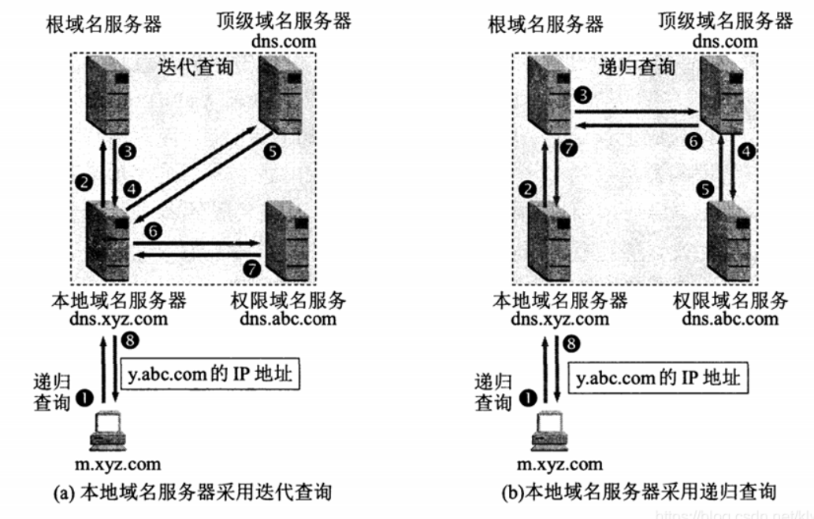
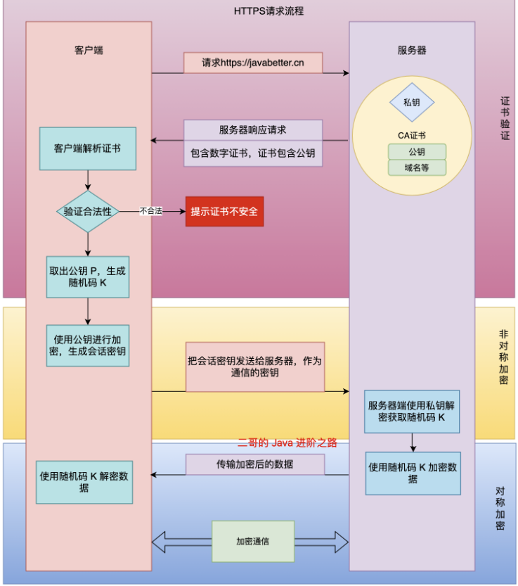
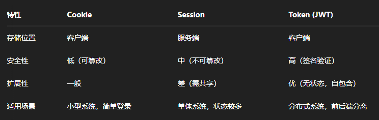
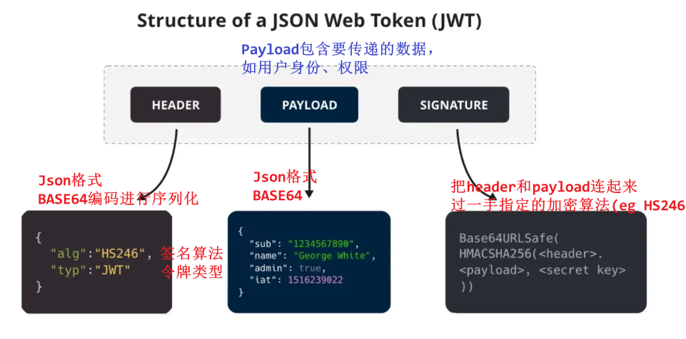

# 计算机网络笔记

- [计算机网络笔记](#计算机网络笔记)
  - [一、基础](#一基础)
    - [分层](#分层)
    - [输入URL到页面展示发生了什么 ☆☆](#输入url到页面展示发生了什么-)
    - [详解DNS解析 ☆☆](#详解dns解析-)
    - [Socket网络通信流程](#socket网络通信流程)
    - [MAC \& ARP](#mac--arp)
    - [常见Port](#常见port)
  - [二、HTTP](#二http)
    - [常见状态码及字段 ☆☆](#常见状态码及字段-)
    - [常见请求方式 ☆☆](#常见请求方式-)
      - [GET vs. POST ☆☆](#get-vs-post-)
    - [HTTP缓存：强缓存 \& 协商缓存](#http缓存强缓存--协商缓存)
    - [HTTP1.0 vs HTTP1.1](#http10-vs-http11)
    - [HTTP1.1 vs HTTP2.0](#http11-vs-http20)
    - [HTTP特性](#http特性)
    - [HTTPS vs. HTTP ☆☆☆](#https-vs-http-)
    - [HTTPS](#https)
    - [基础](#基础)
    - [HTTPS工作流程 ☆☆](#https工作流程-)
    - [Cookie vs. Session vs. JWT](#cookie-vs-session-vs-jwt)
      - [详解JWT](#详解jwt)
        - [服务端如何校验客户端发来的JWT](#服务端如何校验客户端发来的jwt)
  - [三、TCP](#三tcp)
    - [TCP vs. UDP ☆☆](#tcp-vs-udp-)
    - [TCP如何保证可靠性 ☆☆](#tcp如何保证可靠性-)
    - [UDP如何保证可靠性](#udp如何保证可靠性)
    - [TCP头部](#tcp头部)
    - [三次握手 ☆☆](#三次握手-)
      - [为什么不是两次握手？](#为什么不是两次握手)
      - [为什么不是四次握手？](#为什么不是四次握手)
    - [四次挥手 ☆☆](#四次挥手-)
      - [为什么是四次挥手？](#为什么是四次挥手)
      - [为什么客户端要等2MSL才进入closed状态](#为什么客户端要等2msl才进入closed状态)

核心：

* 七层结构，简单介绍一下每一层。
* 输入 URL 后，将发生什么？这个问题会涉及到很大一部分的计算机网络基础。
* HTTP 和 HTTPS，DNS 解析
* TCP、UDP、拥塞控制、三次握手、四次挥手、滑动窗口
* IP 和 ARP 协议

## 一、基础

### 分层

OSI七层结构
TCP/IP四层参考模型：应用层（上三层），传输层，网络层，网络接口层（下两层）

{width=70%}  

七层协议详解（可以直接忽略表示层、会话层，然后合并下两层）

1. **应用层Application Layer** ：**应用层直接与用户交互**，提供各种网络服务，比如`HTTP, FTP, Telnet, DNS, SMTP, SSH`等。数据单位为报文。
    1. 会话层及以上在os用户态，传输层及以下工作在内核态。Socket在传输层，可以使用TCP和UDP，作为桥梁
2. **表示层** ：**设备固有数据格式和网络标准数据格式的转换**（压缩、加密和解密），接受不同形式的信息，文字图像声音等。`JPEG, GIF, SSL/TLS`
3. **会话层** ：通信管理，负责**建立和断开通信连接**；`RPC, NFS`
4. **传输层Transport Layer** ：负责不同主机中两个**进程**之间的通信（通过**端口**），保证数据的**完整性和顺序**。`TCP, UDP`
5. **网络层Internet Layer** ：负责两台**主机**之间的通信，负责数据包的**路由选择**，找到源到目的地的最佳路径。`IP, ICMP, IGMP, 路由器router/三层交换机` 
6. **数据链路层(MAC层)** ：负责物理层面上的**直连**的设备之间的通信。数据链路层把网络层传下来的分组封装成帧; `ARP, Ethernet, FDDI, PPP, 网桥bridge/二层交换机` (ARP也可以算到上一层)
    1. 网络层是source address -> target address，数据链路层仅负责其中的一个个区间内的通信。
7. **物理层** ：负责数据的物理传输，包括物理接口、传输介质等; `RJ-45水晶头, 中继器repeater, 集线器hub`


> MAC地址：网卡(NIC)设备出厂会烧一个唯一MAC，其层次性对寻址没用，可以不算有层次性；MAC寻址参考地址转发表；
> IP地址：网络号+主机号；具有层次性；IP寻址参考路由控制表；

{width=80%}

### 输入URL到页面展示发生了什么 ☆☆

> URL是web服务器中的一个文件资源
> URL = http(s): + // + web服务器 + / + 目录名 + / +文件名
> 也即HTTP请求与响应过程

1. 用户输入URL，浏览器接收用户请求，**先检查浏览器缓存**中是否缓存该资源，如有直接返回，如无进入下一步网络请求。
2. **网络请求前，进行DNS解析**，以获取请求域名domain的IP地址。**DNS解析时会按照本地浏览器缓存 -> 操作系统缓存 -> 本地Hosts文件 -> 路由器缓存/IPS互联网服务商DNS缓存 -> 本地DNS服务器 -> 根DNS服务器 -> 顶级域名服务器 -> 权威域名服务器 的顺序查询域名对应IP，直到找到为止**。
3. **浏览器和服务器通过三次握手建立TCP连接（由os网络协议栈调用socket完成）**。(在https请求中，浏览器还会通过**SSL/TLS**协议进行加密)。连接建立后，浏览器端会构建请求行、请求头和请求体，向服务器**发送请求报文**。
4. 服务器接收到**请求**信息（解析请求，根据请求路径和参数，调用相应的后端逻辑(eg 数据库查询、文件读取等)），生成**响应数据**。
5. 浏览器解析响应头。先根据状态码决定后续操作（如状态码为301、302，会重定向到新地址）；再根据Content-Type决定如何处理响应体（若是二进制字节流类型，提交给下载管理器；若是HTML类型，进入**页面渲染流程**）。
6. 浏览器解析HTML文件，构建DOM树，解析CSS文件，执行JS代码，最终完成页面渲染和展示。

> HTTP请求报文包括：请求行、请求头和请求体。注意请求头中Host写的是domain，而非ip地址。
> HTTP响应报文包括：**状态行**、响应头和响应体。

```java
// HTTP请求报文: 请求行 + 请求头 + 请求体
POST /login HTTP/1.1 // 请求行: 请求方法 请求URL(不含域名) HTTP版本
Host: www.user.com // 请求数据: KV数据
Content-Type: application/x-www-form-urlencoded
User-Agent: Mozilla/5.0
// 空行
username=xiaoming&password=1234 // 请求体


// HTTP响应报文: 状态行 + 响应头 + 响应体
HTTP/1.1 200 OK // 状态行: HTTP版本 状态码 状态描述
Date: Sat, 31 Dec 2005 23:59:59 GMT // 响应头
Content-Type: text/html;charset=ISO-8859-1
Content-Length: 122

<html> // 响应体
  <head><title>Hello</title></head>
  <body><h1>Hello, world!</h1></body>
</html>
```

### 详解DNS解析 ☆☆

DNS(Domain Name System)服务器专门保存了web服务器域名与其ip之间的映射，是一种服务器。
> 域名用·分隔，越靠右层级越高(老外总喜欢反着来)
> DNS基于UDP


实际上www.google.com完整形式是www.google.com.; 域名层级关系为:

1. **根域名**DNS服务器(.): Root DNS Servers
2. **顶级域名**DNS服务器(.com): Top-Level Domain(TLD) Servers
3. **权威域名**DNS服务器(google.com): Authoritative DNS Servers
4. **递归域名**服务器(**本地域名**服务器)：Recursive DNS Servers，负责向其他DNS服务器查询映射信息，给到用户。（比如本地配置的`8.8.8.8`

> 根域的DNS服务器信息存在互联网的所有DNS服务器中。故而所有DNS服务器都可找到根域DNS服务器，一路向下顺藤摸瓜就找到了目标DNS服务器。

DNS解析中**缓存查询**：先查询浏览器缓存 -> 查询操作系统缓存 -> 查询Hosts文件 -> (路由器缓存、ISP缓存) -> 都没有才去问本地DNS服务器

迭代查询方式：
{width=80%}

以上为**迭代查询**，还有一种**递归查询**：

迭代式是每次都是本地dns服务器去问根/顶级/权威dns服务器，而递归是是本地dns服务器问根dns，根dns问顶级dns，顶级dns问权威dns，问完递归地返回回来。

{width=70%}

> 本地DNS服务器就是递归DNS服务器，一般可能在运营商那。


### Socket网络通信流程

**服务端socket流程：**

1. `socket()`创建**监听**套接字（唯一），指定通信协议(TCP/UDP)，该套接字是一个fd
2. `bind()`将监听socket与本地IP和port绑定
3. `listen()`使服务器进入监听状态，等待客户端发起连接请求
4. `accept()`接收客户端的连接请求，会返回一个新的**通信套接字**，专门用于与该客户端的通信
5. `send()/recv()`发送和接收数据
6. `close()`关闭与客户端的链接

**客户端socket流程：**

1. `socket()`创建一个**通信套接字**，指定通信协议(TCP/UDP)
2. `connect()`连接服务端，需要指定服务端IP和指定port
3. `send()/recv()`发送和接收数据
4. `close()`关闭与客户端的链接

### MAC & ARP

**Q: 有了IP为什么还要MAC?**

你发送数据是通过公有IP来标识和路由寻址的，而局域网内的多个设备可能共享一个**公有IP地址**(比如局域网内每个设备一个私有ip嘛，通过NAT路由转换)，这样你就找不到目标了。所以IP只能标识一个网络，无法标识一个具体的设备。而MAC真的能对应着一台具体的物理设备。局域网内额度通信必须用MAC地址，而非IP地址。

> IP相当于城市和小区名，MAC相当于小区门牌号。快递先通过城市和小区名(IP)找到小区，再通过门牌号(MAC)找到具体门牌号。


其实大概可以概括为：**IP标识一个网络，MAC标识局域网内部的一个设备**。

---

所以一个主机向另一个主机发送数据需要物理的mac地址，而我们一般只知道逻辑的ip地址，所以需要一个 IP->MAC，所以ARP诞生。

ARP工作流程： 

1. ARP请求：当源主机A需要与目标主机B通信时，它首先检查自己的**ARP缓存** `arp -a`，查看是否**已存储有目标IP->MAC**。如果没有，**主机A广播ARP请求分组到局域网** `(目标MAC地址: FF-FF-FF-FF-FF-FF)`，内容包括目标IP地址。这个请求会被同一局域网内所有设备接收。
2. ARP应答：**只有**目标主机B会响应这个请求。它会**单播一个ARP应答分组**给主机A，其中包含自己的**MAC地址**
3. **更新ARP缓存**：A收到后，存下这对mapping到自个儿的arp缓存
4. 数据传输：主机A把mac封装到数据包并通过**链路层**发送给B


> 知道了目标ip对应的MAC之后，就确定了下一站地址（**二层交换机内部维持一张mac->物理端口的映射表**，也即**以太网内的传输是基于mac的**。

### 常见Port

FTP: 21
SSH: 22
DNS: 53
HTTP: 80
HTTPS: 443
MySQL: 3306
Redis: 6379
tomcat: 8080, 8443

## 二、HTTP

HTTP (HyperText Transfer Protocol)超文本传输协议

> HTTP是一个应用层协议,通常基于TCP实现;TCP是传输层协议;而**Socket是对TCP/IP协议的抽象和封装**,提供了**编程接口**。在实际应用中,HTTP通常通过Socket API来使用TCP协议。

### 常见状态码及字段 ☆☆

HTTP报文：
请求行/状态行（方法 URL 版本） + 消息头（首部字段+字段值） + 消息体（数据）

常用字段

- Host字段：客户端发送请求时，用来指定服务器的域名
- User-Agent: 客户端浏览器类型
- Content-Length字段：服务器在返回数据时，使用Content-Length字段表明本次回应的数据长度
- Content-Type字段：服务器回应时，告诉客户端，本次数据是什么格式，比如html/png/json/pdf
- Content-Encoding字段：表示服务器返回的数据使用了什么压缩格式
- Expires: 表示资源的过期时间（强制缓存）
- Last-Modified: 表示资源的最后修改时间（协商缓存）

{width=90%}

> `100 continue`：表示你的请求收到了，你（客户端）可以继续发请求
> `301 Moved Permanently`，代表请求的资源已被永久移动，浏览器会**自动跳转到新URL**
> `302 Found`，代表资源**暂时移动**，通常用于临时重定向
> `304 Not Modified`，代表资源未修改，客户端可以**使用缓存**的版本，减少带宽消耗

> `401: unauthorized`: 代表请求需要身份验证，通常用于API认证失败的情况
> `403, 404`

4xx客户端错误，5xx服务端错误

> `502 Bad Gateway`，代表服务器作为网关或代理时，接收到上游服务器（eg 后端服务器）的无效的响应（网关服务器是中间人，帮你向上游服务器请求，但上游坑你宕机、超时等返回无效的内容
> `503 Service Unavailable`，代表服务器暂时不可用，通常是维护或过载导致的

### 常见请求方式 ☆☆

* GET：**请求指定的资源**
  * 数据传输：通过URL传递参数，在URL后面加上`?key=value`
  * 请求是**安全的**，不会对服务器上的数据做任何修改
  * 请求是**幂等的**，多次相同的get请求返回相同的结果
* POST：**向指定资源提交数据**(如表单提交、上传文件)
  * 数据传输：通过请求体body传递参数
  * 请求**不安全**，可能修改服务器上的数据
  * 请求**非幂等**，多次相同的post请求肯能产生不同的结果。比如你提交注册表单，第二次注册可能因为用户名重复而失败得到不同响应。（妙
* PUT：**更新指定资源的全部信息，对现有资源的替换**。
  * 数据传输：通过请求体传递参数
  * 请求**不安全**，可能修改服务器上的数据
  * 请求 **==幂等==**，多次相同的put请求返回相同的结果。比如你更新用户信息，第二次更新和第一次更新是一样的，返回结果是一样的。
* HEAD：类似于GET，但只返回响应头，不返回消息体
* DELETE：**删除指定的资源**

#### GET vs. POST ☆☆

1. **作用**不同：GET用于请求指定的资源，POST用于向指定资源提交数据（如表单提交、上传文件）
2. **参数传递方式**不同
   1. GET请求的参数一般写在URL中，不适合传输敏感数据；数据量较小，不超过2KB，且只接受ASCII字符
   2. POST请求参数一般放在请求体中，更加安全；理论上长度不受限；对于数据类型也没有限制
   3. > HTTP协议没有Body和URL的⻓度限制，对URL限制的大多是浏览器和服务器的原因。
3. **缓存机制**不同：GET请求会被浏览器主动缓存，也可以添加到书签中。而POST一般不会
4. **安全性**：GET请求是安全的，不会对服务器上的数据做任何修改；而POST请求是不安全的，可能会修改服务器上的数据
5. **幂等性**：GET请求是幂等的，多次相同的请求返回相同的结果；而POST请求不是幂等的，多次相同的请求可能产生不同的结果（参考上文）

<!-- 4. 时间消耗不同
   1. GET 产生一个 TCP 数据包；
   2. POST 产生两个 TCP 数据包。
      1. 对于 GET 方式的请求，浏览器会把 header 和 data 一并发送出去，服务器响应 200（返回数据）； 而对于 POST，浏览器先发送 Header，服务器响应 100 continue，浏览器再发送 data，服务器响 应 200 ok（返回数据） -->

### HTTP缓存：强缓存 & 协商缓存

对于一些重复性的HTTP请求，可以把这对「请求-响应」的数据都缓存在本地。
缓存的作用：

- 减少不必要的网络传输，节约带宽
- 更快的页面加载速度
- 减少服务器负载，避免服务器过载

HTTP缓存有两种实现方式：**强制缓存**和**协商缓存**。

- **强制缓存**：浏览器判断请求的目标资源是否有效命中强缓存，如果命中，则可以直接从内存中读取目标资源，无需与服务器做任何通讯，决定是否使用缓存的主动性在于浏览器这边。
  - 强制缓存在response header设置两个字段表示资源在客户端缓存的有效期：
    - 绝对时间Expires：存一个时间戳，然后之后使用本地时间戳判断，但有大问题：本地时间不准...遂expires废弃
  - 相对时间Cache-control：存缓存秒数
- **协商缓存**：通过服务端告知客户端是否可以使用本地缓存的资源，通过`304`状态码表示。(**很像乐观锁的版本号法了**)
  - 方式一：基于时间：`Last-modified` & `If-modified-since`：首先需要在服务器端读出文件修改时间赋给响应头的last-modified字段（并设置`Cache-control:no-cache`），然后再次请求该资源时，都会带上`If-Modified-Since(时间即为上面的Last-modified)`字段，然后服务端拿到这个时间并再次读取该资源的修改时间，对比二者来决定是读取缓存还是返回新的资源。
    - 缺点：
      - 文件内容本身不修改的情况下，依然有可能更新文件修改时间
      - 文件在极短时间内完成修改的时候（eg 几百ms），文件修改时间不会改变，因为文件修改时间记录最小单位是s
  - 方式二：基于标识，**优先级更高**：`Etag` & `If-None-Match`：将原先协商缓存的**比较时间戳的形式修改成了比较文件指纹**（服务器根据文件内容计算出的唯一**哈希值**然后返回给客户端），然后再次请求时将Etag值赋给请求头的`If-None-Match`，服务端拿到后比较两个指纹，如果一致，返回304(未修改)状态码和一个空的响应体。如不一致，返回文件+新Etag
    - 缺点
      - 计算和验证Etag耗费服务端开销；

> 有哈希值的文件设置强缓存即可。没有哈希值的文件（比如index.html）设置协商缓存
> 协商缓存这两个字段都需要配合强制缓存中 Cache-Control 字段来使用，**只有在未能命中强制缓存的时候，才能发起带有协商缓存字段的请求**。

### HTTP1.0 vs HTTP1.1

> HTTP1.0 默认短连接，HTTP 1.1 默认长连接，HTTP 2.0 采用多路复用；HTTP3.0**不了解**

1. **长连接**(底层socket默认60s)
   1. HTTP1.0默认为短连接，每次请求都需要建立一个TCP连接。
   2. HTTP1.1支持**长连接**，==每一个TCP连接上可以传送多个HTTP请求和响应==，默认开启Connection:Keep-Alive (该字段要求完成该HTTP请求后**不要断开HTTP请求使用的TCP连接**，然后下次发http请求时无需重新建立TCP连接（同时SSL的开销也可以避免了）)
<!-- 2. 缓存
   1. HTTP1.0主要使用Expires/If-Modified-Since来做为缓存判断的标准
   2. HTTP1.1则引入了更多的缓存控制策略，例如Entity tag/If-None-Match缓存策略。 -->
3. **管道传输** (Pipeline)：只要第一个请求发出去了，不必等其回来，就可以发第二个请求出去，可以减少整体的响应时间

### HTTP1.1 vs HTTP2.0

1. **首部压缩**: HTTP是无状态的，每次请求都必须带上所有信息，2.0引入了头部压缩机制，减少了头部体积，加速传输
2. **多路复用**
   1. HTTP/1.1虽然支持长连接, 但每个请求仍然要占用一个TCP连接, HTTP完成一个事务(请求与响应过程)后，才可处理下一个事务，容易造成**队头阻塞**
   2. HTTP/2.0引入了多路复用技术,允许在**同一个TCP连接**上同时发送多个请求和响应。（多个Stream复用在一条TCP连接）
3. **服务端推送**：服务器可以主动向客户端推送资源，而无需客户端明确请求
4. **二进制格式**：2.0采用二进制而非文本格式(1.1)来传输数据，解析更加高效
   1. > 在应用层(HTTP/2)和传输层(TCP)之间增加了一个**二进制分帧层**，将所有传输的信息分割为更小的消息和帧(frame)，并对它们采用**二进制格式编码**,更高效且错误率更低。

### HTTP特性

- 简单、灵活、易于扩展
  - http在应用层，下层可以任意变化
    - HTTPS：在HTTP与TCP层之间增加了SSL/TLS安全传输层
    - HTTP/1.1和HTTP/2.0传输协议使用的是TCP协议，而到了 HTTP/3.0传输协议改用了UDP协议。
- **无状态**
  - 好处：服务器不会去记忆HTTP的状态，减轻负担。
  - 坏处：每个请求都是独立的，不依赖于之前的请求。虽然这简化了服务器的设计，但在需要保持会话状态时，需要借助Cookie、Session等技术
- **明文传输**
  - HTTP默认是明文传输的，数据在传输过程中不加密。这使得数据容易被窃听和篡改，安全性较低，so HTTPS (secure)
- 支持缓存
  - HTTP支持通过头字段（如Cache-Control、ETag等）实现客户端和代理服务器的缓存机制，提高访问速度和减少服务器负载。
- **不安全**
  - 窃听风险：**通信使用明文**（不加密），内容可能会被窃听。比如，账号信息容易泄漏，那你号没了。
  - 篡改风险：**无法证明报文的完整性**，所以有可能已遭篡改。比如，网⻚上植入垃圾广告，视觉污染，眼没了。
  - 冒充风险：**不验证通信方的身份**，因此有可能遭遇伪装。比如，访问假的淘宝、拼多多，那你钱没了。


### HTTPS vs. HTTP ☆☆☆

http和https都是**web传输协议**，即在web中用于客户端和服务器之间传输数据的通信协议。

1. **安全性**：HTTP是**明文传输**数据，通信内容容易被窃听和篡改；而HTTPS在HTTP的基础上加入了**SSL/TLS加密层**，使得报文能够加密传输
2. **端口号和前缀**：http默认端口号是80，https是443；http的URL以`http://`开头，https以`https://`开头
3. **部署成本**：https需要向CA（证书办法机构）申请SSL/TLS证书，而且证书需要钱，所以https的部署成本更高
4. **搜索引擎偏好**：搜索引擎更偏好使用https协议的网站，因为https更安全，所以排名更靠前（SEO更靠前）

### HTTPS

### 基础

* 为了解决http传输过程中的一些安全问题（http基于明文）
* HTTPS在HTTP和TCP层之间添加`SSL/TLS`协议
* SSL/TLS协议用于加密通信内容，保证通信过程中数据不被窃取和篡改
  * TLS是SSL的继任者

> SSL: Secure Sockets Layer
> TLS: Transport Layer Security 

* **对称加密**：发送方和接收方用同样的钥匙对数据进行加密和解密
* **非对称加密**：用两把钥匙进行加密和解密，公钥所有人都知道，私钥仅仅持有方才有，私钥放在服务器中；**数据经过公钥加密就只能被私钥解密，公钥自己也无法破解**；数据经过私钥加密就只能被公钥解密，私钥自己也无法解密，即加解密的过程并不对称
  * 对称加密更快，非对称更安全
  * 非对称加密算法包括**RSA**、DSA、ECC等，**通常涉及大量的数学运算，所以速度慢，安全性高**
  * 对称加密通常适用于大规模数据加密，eg 数据库加密、文件加密等；非对称加密适用于密钥交换、数字签名等场景
* 数字证书：**客户端会通过数字证书来验证服务器的身份**，数字证书由CA（证书权威机构）签发，包含了**服务器的公钥**、证书的**颁发机构**、证书的**有效期**等信息

### HTTPS工作流程 ☆☆

1. 客户端向服务器**发起https请求** (e.g., `GET url`)
2. 服务器接收到请求后，返回自己的**数字证书**，包含了**公钥**、颁发机构、有效期等信息
3. 客户端收到数字证书后，**验证证书合法性**，如果合法，就会生成一个**随机码(对称密钥, 会话秘钥)**，然后**用服务器的公钥加密这个会话秘钥**，发送给服务器
   1. 合法性：看看是否在有效期内，是否被吊销，CA机构是否没问题
4. 服务器收到会话密钥后，用**私钥**解密，得到会话密钥；至此客户端和服务端就有了相同的会话秘钥
5. 客户端和服务器**通过会话密码对通信内容进行加密**，然后传输。

前面的 **==非对称加密==** 仅用于密钥交换，握手后，数据传输所用的会话秘钥是 **==对称加密==**（更快）

> 简而言之：服务器有公私钥，把公钥给客户端，客户端用公钥加密一个会话密码，该密码只能由持有私钥的服务器解开。（**我给你把公钥，让你给我锁个东西，然后我自己拿私钥解开**）

> 如果通信内容被截取，但由于没有会话密钥，所以无法解密。当通信结束后，连接会被关闭，会话密钥也会被销毁，下次通信会重新生成一个会话密钥。

{width=60%}


### Cookie vs. Session vs. JWT

背景：HTTP是**无状态**协议，无法识别同一客户端的连续请求，因此需要**会话跟踪技术**来维持登录等状态。

* Cookie
  * 本质：浏览器自动保存的一段数据，**每次请求自动携带**给服务端
  * 流程：登录后服务端通过响应头中的`set-cookie`字段返回数据，浏览器保存到本地，后续每个请求都会携带相应的cookie信息。
  * cookie一般记录用户的**登录状态**、跟踪用户的**浏览历史**、保存用户的**偏好设置**等。
  * 特点：
    * 可被用户/浏览器查看、篡改
    * 容量小(~4KB)
    * 传输过程中可能被偷听
* Session
  * 本质：**服务端维护的会话数据**，客户端只持有一个`SessionID`
  * 流程：登录后，服务端保存session数据，并为该用户创建唯一sessionID，然后将sessionID通过cookie发送给客户端，客户端保存sessionID，后续请求携带sessionID，服务端就可以根据ID找到对应的session数据
  * 特点：
    * 比cookie安全，且能存储更多数据
    * 不适合分布式系统，因为不同服务端的session数据不共享
* JWT
  * 本质：**服务端签发的加密String**，包含用户信息，无需服务端存储状态。
  * 流程：用户登录后，服务端生成一个JWT字符串，包含用户信息和签名，然后将JWT发送给客户端，客户端保存JWT，后续请求携带JWT（通过`Authorization`字段），服务端解密JWT并验证签名(解析分割->解码->对比)
  * 特点：
    * **无状态、自包含**，适合分布式框架
    * 防止篡改（通过RSA等算法）

  

**Q: Cookie vs. Session**

> Cookie和Session不是应用层协议,是用于在HTTP这个应用层协议的基础上**管理用户的状态和身份**

- **存储位置**：Cookie将数据数据存在浏览器/客户端中，Session将数据存在服务端
- **数据容量**：单个Cookie大小限制一般为4KB。Session存储容量理论上不受限，取决于服务器的配置和资源
- **安全性**：由于Cookie存储在用户浏览器中，因此可以被用户读取和篡改。相比之下，Session数据存储在服务器上，更难被用户访问和修改
- **性能**：使用Cookie时，因为数据随每个请求发送到服务器，可能会**影响网络传输效率**，尤其是在Cookie数据较大时。使用Session时，因为数据存储在服务器端，每次请求都需要查询服务器上的Session数据，这可能会**增加服务器的负载**

**Q: cookie, session长什么样呢？**
cookie以键值对形式存在客户端：
```http
Set-Cookie: sessionId=abc123; userId=45; theme=dark;
```
session以json格式存在服务端，然后客户端只会存一个sessionID：

```json
// 服务端
{
  "sessionId": "abc123",
  "userId": 45,
  "loggedIn": true,
  "preferences": {
    "theme": "dark",
    "language": "en"
  }
}
```

```http
// 客户端
Set-Cookie: sessionId=abc123;
```

**Q: 为什么cookie好篡改，session不好篡改呢？**
A: cookie存在客户端，我通过f12都可以改掉存储的kv数据，比如你可以修改用户名；而session存在服务端，你只知道一个唯一的sessionid，你是无法访问修改服务端的session数据的

---

详细：

* **nothing**: 以登录为例，你登录时发送账户和密码到服务端经过鉴权/校验之后，如果正确服务端返回账户和密码，然后你后续的任何请求还需要带上账户和密码，很显然，既不安全又麻烦
* **Cookie**: 同样客户端登录发送用户名和密码到服务端经过鉴权，如正确服务端返回一个cookie(通过响应头`Set-Cookie`实现，eg `Set-Cookie: username=xiaoming`)，浏览器存下，后续所有请求在请求头中都会**自动带上cookie**(`Cookie`字段)，服务端通过解析你这个cookie就可以验证身份，就可以生成与该客户端相对应的内容(即可以维持用户状态)。但也很显然，如果服务端返回的是`username`的话，我客户端是可以篡改cookie中的username字段的内容的，服务端这就能给我提供其他用户的内容了，风险很大。当然我服务端可以加密，但一旦加密规则泄漏，也没啥用
  * cookie容量限制为4KB；用户还可以禁掉cookie
  * 可能被网络窃听，在传输过程中被偷听，然后就可以伪造你构造请求了
* **Session**: 同样客户端发用户密码服务端鉴权，如正确服务端存下这个数据，即用户和密码(**亦或者是其他会话数据**)，然后通过`Set-Cookie`字段返回一个`SessionID`(Session是基于Cookie的)，浏览器存下SessionID，下次请求会自动带上(同样是`Cookie`字段)，服务端就可以根据这个id查到对应的session会话数据了
  * 存在服务端容量大很爽，可以存很多其他的会话的临时数据和上下文信息，但占用服务器资源
  * **扩展性差(分布式集群)**，你一个用户信息只会存在一个服务器节点，当你下一次请求可能负载均衡到了其他节点，那会判定你没有登陆(你就带个sessionid过来，哥们这儿也没存你的数据啊)，所以**分布式集群情况下我们一般不用session了**(即我的点评用session共享数据，商城用jwt)
  * 也可能被窃听...主要是用户不可以篡改了
* **Token (JWT / JSON Web Token)**: Token就是个秘钥字符串，我们借助JWT规范规范(RFC 7519)；同样客户端发送用户密码服务端鉴权，如认证成功服务端会创建一个jwt字符串(include Header, Payload(你的用户名和密码是被加密到这儿了), Signature)传给客户端(eg 通过`token`字段)，客户端存下jwt，后续请求带上jwt(eg 通过`Authorization`字段)，后端就会解密token，然后检查Signature发现没篡改信息后，放行
  * jwt存在客户端
  * jwt是**无状态**的，无需在服务端存会话数据
  * jwt是**自包含**的，jwt本身包含了所有必要的信息，所以便于分布式扩展
  * jwt采用秘钥进行签名，确保令牌的完整性和真实性，比cookie和session更安全


#### 详解JWT

JWT = 头部Header + 载荷Payload + 签名Signature
  

##### 服务端如何校验客户端发来的JWT

* 解析JWT，分割为三部分
* 使用BASE64对header和payload**解码**，然后找到jwt指定的签名算法(header-alg)，然后**服务器选择算法相应的的秘钥对header+payload进行签名**
* 比较这俩签名，如匹配则未篡改，登录校验成功


<!-- #### Cookie vs. LocalStorage -->

<!-- Cookie 适合用于在**客户端和服务器之间传递数据**、跨域访问和设置过期时间，而 LocalStorage 适合用于在同一域名下的不同页面之间**共享数据、存储大量数据和永久存储数据**。 -->

## 三、TCP

为什么需要TCP协议？
IP层不可靠，它不保证网络包的按序交付、数据完整性。
TCP提供可靠数据传输服务，确保接收端收到的网络包是无损坏、按序的、非冗余的。

### TCP vs. UDP ☆☆

TCP和UDP的**区别**：

- 概念
  - TCP（传输控制协议）是一种面向连接的、可靠的、基于字节流的传输层通信协议
  - UDP（用户数据报协议）为应用程序提供了一种无需建立连接就可以发送封装的IP数据包的方法。
- 特点
  - TCP：面向连接，传输可靠，传输形式为**字节流**，传输效率慢，所需资源多。
  - UDP：无连接、传输不可靠、传输形式为**数据报文段**，传输效率快，所需资源少。
- 区别
  - 是否**面向连接**
  - 是否是**可靠**传输：TCP可靠，有连接管理、序列号机制(有序、去重)、确认机制(丢包)、错误检测、流量控制和拥塞控制等功能。UDP不可靠，数据可能丢失、重复或乱序接受。（也可以基于QUIC协议整个可靠的UDP传输）
  - 是否有**流量控制和拥塞控制**：tcp提供该机制，确保网络中传输的速度不会导致网络拥塞或丢包。udp不提供
  <!-- - 是否有**状态**：TCP传输是有状态的，它会去记录自己发送消息的状态比如消息是否发送了、是否被接收了等等，而UDP是无状态的。 -->
  - **传输形式**: TCP是**面向字节流**的（流式传输，没有数据边界，但保证顺序和可靠），UDP是**面向报文**的（一个包一个包地发送，有数据边界，但可能丢包或乱序）。
    <!-- - UDP存在数据边界，意味着read调用次数==write调用次数； -->
  - 传输**效率**:由于TCP传输的时候多了连接、确认重传等机制，所以TCP的传输效率要比UDP低。
  - **首部开销**:TCP首部开销(20 ~ 60字节)比UDP首部开销(8字节)要大。
  - 是否提供**广播或多播**服务: TCP只支持点对点通信UDP支持一对一、一对多、多对一、多对多。
- 应用场景
   1. TCP: 常用于要求通信数据可靠场景（如网⻚浏览(HTTP/HTTPS)、文件传输(FTP)、邮件传输（SMTP）、远程登录(SSH)、数据库操作等
   2. UDP: 常用于要求通信速度高场景（如域名转换、视频直播、实时游戏等），广播

### TCP如何保证可靠性 ☆☆

* **连接管理**：通过三次握手和四次挥手建立可靠连接
* **序列号机制**：发送端将数据分割为报文段，每个段对应唯一序号，接收端可以根据序号**重组==乱序==**到达的段；同时，接收端可以根据序号**去重**，避免重复接收
* **确认机制**：TCP给发送的每个包指定序列号，接收方会对收到的包进行应答，发送方就会知道接收方是否收到对应的包；如果指定时间后，发送端仍未收到确认应答，说明出现==丢包问题==，则启动**超时重传**
* **错误检测**：使用**校验和**（首部+数据）检测数据在传输过程中的损坏，损坏则丢弃


---

* **流量控制**：TCP连接的每一方都有固定大小的**缓冲空间**，TCP的 **==接收端==只允许==发送端==发送接收端缓冲区能接纳的数据**（即接收端通过窗口大小window size告知发送端可接收的数据量）。当接收方来不及处理发送方的数据，能**提示发送方降低发送的速率**，防止包丢失。（底层由滑动窗口算法实现
* **拥塞控制**：如果网络非常拥堵，此时再发送数据就会加重网络负担，那么迟迟发布到目的地就可能丢包。为此TCP引入**慢启动机制**，**先发出少量数据，先摸清当前的网络拥堵状态后，再决定按照多大的速度传送数据**
  * 通过**慢启动、拥塞避免、快速重传和快速恢复**算法，动态调整发送速率以适应网络负载，防止网络瘫痪（四个算法的具体细节暂略，[reference ](https://www.nowcoder.com/issue/tutorial?zhuanlanId=MQ75nB&uuid=bee07891106f4b4dbd1211b916e87ec3#89nowy)

<!-- #### 为什么DNS基于UDP

1. 速度快
2. 大多数DNS查询和相应数据包都很小
3. DNS查询时一次性的，无需维护连接状态（UDP无连接）
4. 减少服务器负载（无需连接嘛、请求响应也比较简单、易于负载均衡 -->

### UDP如何保证可靠性

> 似乎就是按需手动模仿tcp的行为啊...

* **应用层确认机制**：发送方在发送数据后（需要添加**序列号编号**），要求接收方返回一个确认消息（ACK），只有收到ACK后才认为数据成功传输，否则进行**重传**
  * 使用场景：消息队列、文件传输..
* 直接使用**可靠UDP协议**：
  * **QUIC** (Quick UDP Internet Connections): 由Google开发，基于UDP，但提供了TLS加密、流量控制、重传等功能。
  * RUDP (reliable): 在UDP之上添加确认机制、重传机制、流量控制，类似TCP，但保留UDP低延迟的特性。


### TCP头部

**讲解TCP报文头部格式**：
{width=60%}

- **序列号seq**：用于**解决网络包乱序**问题。在建立连接时由计算机生成的随机数作为其初始值，通过SYN包传给接收端主机，每发送一次数据，就累加一次该数据字节数的大小。
- **确认应答号ack**：用于**解决丢包问题**。指下一次期望收到的数据的序列号，发送端收到这个确认应答以后**可以认为在这个序号 以前的数据都已经被正常接收**。
- 控制位：
  - ACK: ACK=1时，**确认应答号字段**生效。TCP规定除了最初建立连接时的SYN包之外，该位均应设置为1.
  - RST: 为1表示TCP连接中出现异常必须强制断开连接
  - SYN: 为1表示希望建立连接，在**序列号字段**设定初始序列号。
  - FIN: 为1表示紧后不会再发送数据，希望断开链接。

### 三次握手 ☆☆

> TCP握手和回收是TCP确保可靠连接和数据传输的关键机制。

首先需要明确 **==seq是序列号，ack是(确认)应答号==**

**三次握手建立连接**：==所谓连接，只是双方计算机内维护的一个状态机中的状态变化。==

三次握手的过程如下：

0. 首先是客户端和服务端都处于`closed`状态；先是服务端主动监听listen某个端口，处于`listen`状态
1. 客户端发送一个**SYN报文**到服务器(SYN位设为1表示一个连接请求)，并随机一个**序列号**`seq=x`，客户端进入`syn_sent`状态。
   1. 目的：客户端通知服务器它希望建立连接，并告诉服务器自己的初始序列号
2. 服务端收到SYN报文后，**如果同意连接**，则发送一个**ACK+SYN应答报文**(SYN和ACK都被设置为1)，服务端也随机一个**序列号**`seq=y`，并将确认号设置为`ack=x+1`。服务端进入`syn_recv`状态。
   1. 目的：服务端告诉客户端，它的请求被请求了，并通知客户端自己的初始序列号
3. 客户端接收到服务端的应答后，还要发送一个`SYN报文`，其中**确认号**`ack=y+1`；
   1. 目的：客户端确认收到了服务端的同步应答，完成三次握手
   2. 客户端进入`established`状态，当服务端收到该包后，也进入`established`状态

<!-- > 所以**三次握手是为了保证二者都具备收发功能**：即第一次握手**服务器知道客户端能发**，第二次握手客户端知道服务器能发能收，第三次握手**服务器知道客户端能收**（如果两次握手，服务器就不知道客户端是否能接收 -->
> `netstat -napt`: 查询tcp连接状态

{width=50%}

<!-- TCP连接就是用于保证可靠性和流量控制而维护的一些状态信息，包括**Socket**、**序列号**和**窗口大小**。
> 可以认为TCP连接三要素是：socket、序列号和窗口大小 -->

#### 为什么不是两次握手？

final answer: 主要原因是两次握手可能导致 **==旧的SYN请求被服务端错误接受==**（即错误建立了一个**历史连接**）：

1. 客户端A发送一个SYN包，但由于网络延迟，SYN包没及时到服务器，客户端误以为服务端未响应，于是**客户端A放弃连接**。
2. 一段时间后，那个延迟的SYN包终于到达了服务器。服务器认为这是一个新的连接请求，回复SYN-ACK，如果是两次握手，就直接建立连接了。但此时**客户端A已经关闭了，不会再发数据，所以就导致服务器资源浪费**。
3. 通过三次握手，**服务器可以确保客户端仍然在线**。


> **同步双方的序列号**。三次握手可以让双方都确认对方的初始序列号,这对于后续的可靠传输至关重要。

#### 为什么不是四次握手？

1. 三次握手就足够保证可靠了。通过三次握手,双方已经能够确认各自的发送和接收能力都正常,无需再进行第四次握手。减少网络开销，提升效率
2. 可以优化为三次。在三次握手的第二步中,服务器同时发送SYN和ACK,相当于将第二次和第三次握手合并了。**如果分开发送,就会变成四次握手**。

### 四次挥手 ☆☆

0. 双方处于`established`状态
1. 客户端发送`FIN报文`，指定序列号(`seq=x`)，然后客户端进入`fin_wait_1`状态。表示客户端没数据发送了，但还可以接收数据。
2. 服务端收到FIN报文后，回复`ACK报文`，其中指定应答号`ack=x+1`。服务端进入`close_wait`状态，客户端收到ACK报文后进入`fin_wait_2`状态
3. **等待服务端处理完数据后**，也要断开连接，向客户端发送`FIN报文`，指序列号`seq=y`，之后进入`last_ack`状态。
4. 客户端收到FIN报文后，回复`ACK报文`，其中应答号`ack=y+1`，然后进入`time_wait`状态。**服务端收到客户端的ACK报文后进入`CLOSE状态`，至此服务端已完成连接的关闭。客户端在等待2MSL没有收到回复，才关闭连接，进入`CLOSED状态`，至此客户端也完成连接的关闭。**

{width=50%}

> 主动关闭连接的，才有 TIME_WAIT 状态

#### 为什么是四次挥手？

- 关闭连接时，客户端向服务端发送FIN时，**仅仅表示客户端不再发送数据了但是还能接收数据**。
- 服务器收到客户端的FIN报文时，先回一个ACK应答报文，而服务端可能还有数据需要处理和发送，**等服务端不再发送数据时，才发送FIN报文**给客户端来表示同意现在关闭连接。

> 所以服务端的ACK和FIN一般都会分开发送，从而比三次握手导致多了一次

#### 为什么客户端要等2MSL才进入closed状态

> MSL: maximum segment lifetime，最大报文生存时间：即**任何报文在网络上存在的最长时间，超过这个时间报文将被丢弃**

目的：**保证服务端能正确关闭连接**

**为了保证客户端发送的最后一个ACK报文段能够到达服务端**。该ACK报文有可能丢失，因而服务端就收不到确认，那服务端会超时重传该FIN报文段。而客户端就能在2MSL时间内（**超时+1MSL传输**）收到这个重传的FIN+ACK报文段。接着**客户端重传一次确认，重新启动2MSL计时器**。这就能保证客户端和服务器都正常进入到CLOSED状态。
