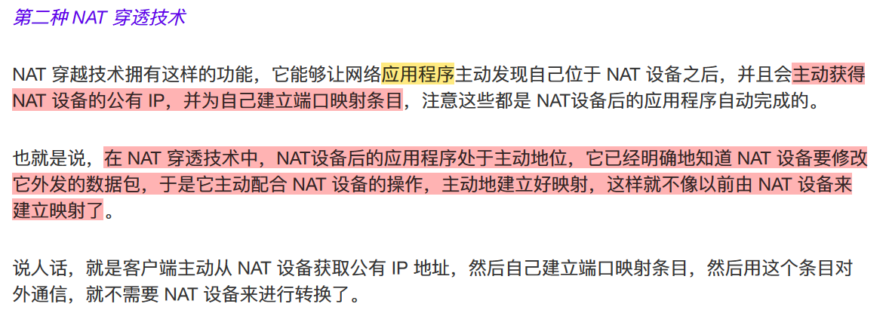

# 计算机网络笔记

- [计算机网络笔记](#计算机网络笔记)
  - [一、基础](#一基础)
    - [分层](#分层)
    - [输入URL到页面展示发生了什么](#输入url到页面展示发生了什么)
    - [详解DNS解析](#详解dns解析)
    - [Socket网络通信流程](#socket网络通信流程)
    - [MAC \& ARP](#mac--arp)
    - [常见Port](#常见port)
  - [二、HTTP](#二http)
    - [常见状态码及字段](#常见状态码及字段)
    - [常见请求方式](#常见请求方式)
      - [GET vs. POST](#get-vs-post)
    - [HTTP缓存：强缓存 \& 协商缓存](#http缓存强缓存--协商缓存)
    - [HTTP1.0 vs HTTP1.1](#http10-vs-http11)
    - [HTTP1.1 vs HTTP2.0](#http11-vs-http20)
    - [HTTP特性](#http特性)
    - [HTTPS](#https)
    - [基础](#基础)
    - [HTTPS工作流程](#https工作流程)
    - [HTTPS vs. HTTP](#https-vs-http)
    - [通关 Cookie, Session, Token (JWT)](#通关-cookie-session-token-jwt)
      - [详解JWT](#详解jwt)
        - [服务端如何校验客户端发来的JWT](#服务端如何校验客户端发来的jwt)
      - [Cookie vs. Session](#cookie-vs-session)
      - [Cookie vs. LocalStorage](#cookie-vs-localstorage)
  - [三、TCP](#三tcp)
    - [TCP vs. UDP](#tcp-vs-udp)
      - [为什么DNS基于UDP](#为什么dns基于udp)
    - [TCP头部](#tcp头部)
    - [三次握手](#三次握手)
      - [为什么不是两次握手？](#为什么不是两次握手)
      - [为什么不是四次握手？](#为什么不是四次握手)
    - [四次挥手](#四次挥手)
      - [为什么是四次挥手？](#为什么是四次挥手)
      - [为什么客户端要等2MSL才进入closed状态](#为什么客户端要等2msl才进入closed状态)
    - [TCP如何保证可靠性](#tcp如何保证可靠性)
    - [TCP流量控制](#tcp流量控制)
    - [TCP拥塞控制](#tcp拥塞控制)

TODO: 按**二哥** or xiaolin增补一下

核心：

* 七层结构，简单介绍一下每一层。
* 输入 URL 后，将发生什么？这个问题会涉及到很大一部分的计算机网络基础。
* HTTP 和 HTTPS，DNS 解析
* TCP、UDP、拥塞控制、三次握手、四次挥手、滑动窗口
* IP 和 ARP 协议

## 一、基础

### 分层

OSI七层结构
TCP/IP四层参考模型：应用层（上三层），传输层，网络层，网络接口层（下两层）

{width=70%}  

七层协议详解（可以直接忽略表示层、会话层，然后合并下两层）

1. **应用层Application Layer** ：**应用层直接与用户交互**，提供各种网络服务，比如`HTTP, FTP, Telnet, DNS, SMTP, SSH`等。数据单位为报文。
    1. 会话层及以上在os用户态，传输层及以下工作在内核态。Socket在传输层，可以使用TCP和UDP，作为桥梁
2. **表示层** ：**设备固有数据格式和网络标准数据格式的转换**（压缩、加密和解密），接受不同形式的信息，文字图像声音等。`JPEG, GIF, SSL/TLS`
3. **会话层** ：通信管理，负责**建立和断开通信连接**；`RPC, NFS`
4. **传输层Transport Layer** ：负责不同主机中两个**进程**之间的通信（通过**端口**），保证数据的**完整性和顺序**。`TCP, UDP`
5. **网络层Internet Layer** ：负责两台**主机**之间的通信，负责数据包的**路由选择**，找到源到目的地的最佳路径。`IP, ICMP, IGMP, 路由器router/三层交换机` 
6. **数据链路层(MAC层)** ：负责物理层面上的**直连**的设备之间的通信。数据链路层把网络层传下来的分组封装成帧; `ARP, Ethernet, FDDI, PPP, 网桥bridge/二层交换机` (ARP也可以算到上一层)
    1. 网络层是source address -> target address，数据链路层仅负责其中的一个个区间内的通信。
7. **物理层** ：负责数据的物理传输，包括物理接口、传输介质等; `RJ-45水晶头, 中继器repeater, 集线器hub`


> MAC地址：网卡(NIC)设备出厂会烧一个唯一MAC，其层次性对寻址没用，可以不算有层次性；MAC寻址参考地址转发表；
> IP地址：网络号+主机号；具有层次性；IP寻址参考路由控制表；

{width=80%}

### 输入URL到页面展示发生了什么

> URL是web服务器中的一个文件资源
> URL = http(s): + // + web服务器 + / + 目录名 + / +文件名
> 也即HTTP请求与响应过程

1. 浏览器接收用户请求，**先检查浏览器缓存**中是否缓存该资源，如有直接返回，如无进入下一步网络请求。
2. **网络请求前，进行DNS解析**，以获取请求域名domain的IP地址。**DNS解析时会按照本地浏览器缓存 -> 操作系统缓存 -> 本地Hosts文件 -> 路由器缓存/IPS互联网服务商DNS缓存 -> 本地DNS服务器 -> 根DNS服务器 -> 顶级域名服务器 -> 权威域名服务器的顺序查询域名对应IP，直到找到为止**。
3. **浏览器和服务器通过三次握手建立TCP连接（由os网络协议栈调用socket完成）**。连接建立后，浏览器端会构建请求行、消息头和消息体，向服务器发送请求报文。
4. 服务器接收到**请求**信息（解析请求，根据请求路径和参数，调用相应的后端逻辑(eg 数据库查询、文件读取等)），生成**响应数据**。
5. 浏览器解析响应头。先根据状态码决定后续操作（如状态码为301、302，会重定向到新地址）；再根据Content-Type决定如何处理响应体（若是二进制字节流类型，提交给下载管理器；若是HTML类型，进入**页面渲染流程**）。
6. 浏览器解析HTML文件，构建DOM树，解析CSS文件，执行JS代码，最终完成页面渲染和展示。

```java
// HTTP请求报文: 请求行 + 请求头 + 请求数据
POST /user HTTP/1.1 // 请求行: 请求方法 请求URL(不含域名) HTTP版本
Host: www.user.com // 请求数据: KV数据
Content-Type: application/x-www-form-urlencoded
User-Agent: Mozilla/5.0

name=xiaoming // 请求体


// HTTP响应报文: 状态行 + 响应头 + 响应数据
HTTP/1.1 200 OK // 状态行: HTTP版本 状态码 状态描述
Date: Sat, 31 Dec 2005 23:59:59 GMT // 响应头
Content-Type: text/html;charset=ISO-8859-1
Content-Length: 122

<html> // 响应数据
<head>
...
</html>
```

### 详解DNS解析

DNS(Domain Name System)服务器专门保存了web服务器域名与其ip之间的映射，是一种服务器。
> 域名用·分隔，越靠右层级越高(老外总喜欢反着来)
> DNS基于UDP

实际上www.google.com完整形式是www.google.com.; 域名层级关系为:

1. **根域名**DNS服务器(.): Root DNS Servers
2. **顶级域名**DNS服务器(.com): Top-Level Domain(TLD) Servers
3. **权威域名**DNS服务器(google.com): Authoritative DNS Servers
4. **递归域名**服务器(**本地域名**服务器)：Recursive DNS Servers，负责向其他DNS服务器查询映射信息，给到用户。

> 根域的DNS服务器信息存在互联网的所有DNS服务器中。故而所有DNS服务器都可找到根域DNS服务器，一路向下顺藤摸瓜就找到了目标DNS服务器。

迭代查询方式：
{width=80%}

> 以上为迭代查询，还有一种递归查询（不常用吧）
> 本地DNS服务器就是递归DNS服务器，一般可能在运营商那。
> DNS解析中**缓存查询**：先查询浏览器缓存 -> 查询操作系统缓存 -> 查询Hosts文件 -> (路由器缓存、ISP缓存) -> 都没有才去问本地DNS服务器

### Socket网络通信流程

**服务端socket流程：**

1. `socket()`创建**监听**套接字（唯一），指定通信协议(TCP/UDP)，该套接字是一个fd
2. `bind()`将监听socket与本地IP和port绑定
3. `listen()`使服务器进入监听状态，等待客户端发起连接请求
4. `accept()`接收客户端的连接请求，会返回一个新的**通信套接字**，专门用于与该客户端的通信
5. `send()/recv()`发送和接收数据
6. `close()`关闭与客户端的链接

**客户端socket流程：**

1. `socket()`创建一个**通信套接字**，指定通信协议(TCP/UDP)
2. `connect()`连接服务端，需要指定服务端IP和指定port
3. `send()/recv()`发送和接收数据
4. `close()`关闭与客户端的链接

### MAC & ARP

**Q: 有了IP为什么还要MAC / 有了MAC为什么还要IP**
A: IP地址负责跨网络的数据传输和路由，而MAC地址则用于局域网内设备的直接通信和识别...TODO

所以一个主机向另一个主机发送数据需要物理的mac地址，而我们一般只知道逻辑的ip地址，所以需要一个 IP->MAC，所以ARP诞生。

ARP工作流程： 

1. ARP请求：当源主机A需要与目标主机B通信时，它首先检查自己的**ARP缓存** `arp -a`，查看是否**已存储有目标IP->MAC**。如果没有，**主机A广播ARP请求分组到局域网** `(目标MAC地址: FF-FF-FF-FF-FF-FF)`，内容包括目标IP地址。这个请求会被同一局域网内所有设备接收。
2. ARP应答：**只有**目标主机B会响应这个请求。它会**单播一个ARP应答分组**给主机A，其中包含自己的**MAC地址**
3. **更新ARP缓存**：A收到后，存下这对mapping到自个儿的arp缓存
4. 数据传输：主机A把mac封装到数据包并通过**链路层**发送给B


> 知道了目标ip对应的MAC之后，就确定了下一站地址（**二层交换机内部维持一张mac->物理端口的映射表**，也即**以太网内的传输是基于mac的**。

### 常见Port

FTP: 21
SSH: 22
DNS: 53
HTTP: 80
HTTPS: 443
MySQL: 3306
Redis: 6379
tomcat: 8080, 8443

## 二、HTTP

HTTP (HyperText Transfer Protocol)超文本传输协议

> HTTP是一个应用层协议,通常基于TCP实现;TCP是传输层协议;而**Socket是对TCP/IP协议的抽象和封装**,提供了**编程接口**。在实际应用中,HTTP通常通过Socket API来使用TCP协议。

### 常见状态码及字段

HTTP报文：
请求行/状态行（方法 URL 版本） + 消息头（首部字段+字段值） + 消息体（数据）

常用字段

- Host字段：客户端发送请求时，用来指定服务器的域名
- User-Agent: 客户端浏览器类型
- Content-Length字段：服务器在返回数据时，使用Content-Length字段表明本次回应的数据长度
- Content-Type字段：服务器回应时，告诉客户端，本次数据是什么格式，比如html/png/json/pdf
- Content-Encoding字段：表示服务器返回的数据使用了什么压缩格式
- Expires: 表示资源的过期时间（强制缓存）
- Last-Modified: 表示资源的最后修改时间（协商缓存）

{width=90%}
> `401: unauthorized`: 请求需要用户认证

### 常见请求方式

* GET：**请求指定的资源**。应该只用于获取数据，并且是幂等的，即多次执行相同的GET请求应该返回相同的结果，并且不会改变资源的状态。
* POST：**向指定资源提交数据**，请求服务器进行处理（如提交表单或上传文件）。数据被包含在请求体中。可能会创建新的资源或修改现有资源
* DELETE：**删除指定的资源**
* PUT：**替换指定的资源**。如果指定的资源不存在，创建一个新资源

#### GET vs. POST

1. 作用不同
   1. GET用于从服务端获取数据
   2. POST一般用来向服务器发送数据来创建或更新资源，通常用于提交表单数据或上传文件
2. 参数传递方式不同
   1. GET请求的参数一般写在URL中，不适合传输敏感数据；数据量较小，不超过2KB，且只接受ASCII字符
   2. POST请求参数一般放在请求体中，更加安全；理论上长度不受限；对于数据类型也没有限制
   3. > HTTP 协议没有 Body 和 URL 的⻓度限制，对 URL 限制的大多是浏览器和服务器的原因。
3. 缓存机制不同
   1. GET请求会被浏览器主动缓存，而POST一般不会，除非手动设置。
<!-- 4. 时间消耗不同
   1. GET 产生一个 TCP 数据包；
   2. POST 产生两个 TCP 数据包。
      1. 对于 GET 方式的请求，浏览器会把 header 和 data 一并发送出去，服务器响应 200（返回数据）； 而对于 POST，浏览器先发送 Header，服务器响应 100 continue，浏览器再发送 data，服务器响 应 200 ok（返回数据） -->
5. 幂等：多次执行相同的操作，返回的结果相同
   1. RFC(Request for comments)规范如下（但程序员未必遵守...）：
      1. **GET方法就是安全且幂等的**，因为它是只读操作，无论操作多少次，服务器上的数据都是安全的，且每次的结果都是相同的
      2. POST因为**提交数据**，会修改服务器上的资源，所以是不安全的，且多次提交数据就会创建多个资源，所以不是幂等的

### HTTP缓存：强缓存 & 协商缓存

对于一些重复性的HTTP请求，可以把这对「请求-响应」的数据都缓存在本地。
缓存的作用：

- 减少不必要的网络传输，节约带宽
- 更快的页面加载速度
- 减少服务器负载，避免服务器过载

HTTP缓存有两种实现方式：**强制缓存**和**协商缓存**。

- **强制缓存**：浏览器判断请求的目标资源是否有效命中强缓存，如果命中，则可以直接从内存中读取目标资源，无需与服务器做任何通讯，决定是否使用缓存的主动性在于浏览器这边。
  - 强制缓存在response header设置两个字段表示资源在客户端缓存的有效期：
    - 绝对时间Expires：存一个时间戳，然后之后使用本地时间戳判断，但有大问题：本地时间不准...遂expires废弃
  - 相对时间Cache-control：存缓存秒数
- **协商缓存**：通过服务端告知客户端是否可以使用本地缓存的资源，通过`304`状态码表示。(**很像乐观锁的版本号法了**)
  - 方式一：基于时间：`Last-modified` & `If-modified-since`：首先需要在服务器端读出文件修改时间赋给响应头的last-modified字段（并设置`Cache-control:no-cache`），然后再次请求该资源时，都会带上`If-Modified-Since(时间即为上面的Last-modified)`字段，然后服务端拿到这个时间并再次读取该资源的修改时间，对比二者来决定是读取缓存还是返回新的资源。
    - 缺点：
      - 文件内容本身不修改的情况下，依然有可能更新文件修改时间
      - 文件在极短时间内完成修改的时候（eg 几百ms），文件修改时间不会改变，因为文件修改时间记录最小单位是s
  - 方式二：基于标识，**优先级更高**：`Etag` & `If-None-Match`：将原先协商缓存的**比较时间戳的形式修改成了比较文件指纹**（服务器根据文件内容计算出的唯一**哈希值**然后返回给客户端），然后再次请求时将Etag值赋给请求头的`If-None-Match`，服务端拿到后比较两个指纹，如果一致，返回304(未修改)状态码和一个空的响应体。如不一致，返回文件+新Etag
    - 缺点
      - 计算和验证Etag耗费服务端开销；

> 有哈希值的文件设置强缓存即可。没有哈希值的文件（比如index.html）设置协商缓存
> 协商缓存这两个字段都需要配合强制缓存中 Cache-Control 字段来使用，**只有在未能命中强制缓存的时候，才能发起带有协商缓存字段的请求**。

### HTTP1.0 vs HTTP1.1

> HTTP1.0 默认短连接，HTTP 1.1 默认长连接，HTTP 2.0 采用多路复用；HTTP3.0**不了解**

1. **长连接**(底层socket默认60s)
   1. HTTP1.0默认为短连接，每次请求都需要建立一个TCP连接。
   2. HTTP1.1支持**长连接**，==每一个TCP连接上可以传送多个HTTP请求和响应==，默认开启Connection:Keep-Alive (该字段要求完成该HTTP请求后**不要断开HTTP请求使用的TCP连接**，然后下次发http请求时无需重新建立TCP连接（同时SSL的开销也可以避免了）)
<!-- 2. 缓存
   1. HTTP1.0主要使用Expires/If-Modified-Since来做为缓存判断的标准
   2. HTTP1.1则引入了更多的缓存控制策略，例如Entity tag/If-None-Match缓存策略。 -->
3. **管道传输** (Pipeline)：只要第一个请求发出去了，不必等其回来，就可以发第二个请求出去，可以减少整体的响应时间

### HTTP1.1 vs HTTP2.0

1. **首部压缩**: HTTP是无状态的，每次请求都必须带上所有信息，2.0引入了头部压缩机制，减少了头部体积，加速传输
2. **多路复用**
   1. HTTP/1.1虽然支持长连接, 但每个请求仍然要占用一个TCP连接, HTTP完成一个事务(请求与响应过程)后，才可处理下一个事务，容易造成**队头阻塞**
   2. HTTP/2.0引入了多路复用技术,允许在**同一个TCP连接**上同时发送多个请求和响应。（多个Stream复用在一条TCP连接）
3. **服务端推送**：服务器可以主动向客户端推送资源，而无需客户端明确请求
4. **二进制格式**：2.0采用二进制而非文本格式(1.1)来传输数据，解析更加高效
   1. > 在应用层(HTTP/2)和传输层(TCP)之间增加了一个**二进制分帧层**，将所有传输的信息分割为更小的消息和帧(frame)，并对它们采用**二进制格式编码**,更高效且错误率更低。

### HTTP特性

- 简单、灵活、易于扩展
  - http在应用层，下层可以任意变化
    - HTTPS：在HTTP与TCP层之间增加了SSL/TLS安全传输层
    - HTTP/1.1和HTTP/2.0传输协议使用的是TCP协议，而到了 HTTP/3.0传输协议改用了UDP协议。
- **无状态**
  - 好处：服务器不会去记忆HTTP的状态，减轻负担。
  - 坏处：每个请求都是独立的，不依赖于之前的请求。虽然这简化了服务器的设计，但在需要保持会话状态时，需要借助Cookie、Session等技术
- **明文传输**
  - HTTP默认是明文传输的，数据在传输过程中不加密。这使得数据容易被窃听和篡改，安全性较低，so HTTPS (secure)
- 支持缓存
  - HTTP支持通过头字段（如Cache-Control、ETag等）实现客户端和代理服务器的缓存机制，提高访问速度和减少服务器负载。
- **不安全**
  - 窃听风险：**通信使用明文**（不加密），内容可能会被窃听。比如，账号信息容易泄漏，那你号没了。
  - 篡改风险：**无法证明报文的完整性**，所以有可能已遭篡改。比如，网⻚上植入垃圾广告，视觉污染，眼没了。
  - 冒充风险：**不验证通信方的身份**，因此有可能遭遇伪装。比如，访问假的淘宝、拼多多，那你钱没了。

### HTTPS

### 基础

* 为了解决http传输过程中的一些安全问题（http基于明文）
* HTTPS在HTTP和TCP层之间添加`SSL/TLS`协议
* SSL/TLS协议用于加密通信内容，保证通信过程中数据不被窃取和篡改

> SSL: Secure Sockets Layer
> TLS: Transport Layer Security 

* **对称加密**：发送方和接收方用同样的钥匙对数据进行加密和解密
* **非对称加密**：用两把钥匙进行加密和解密，公钥所有人都知道，私钥仅仅持有方才有，私钥放在服务器中；**数据经过公钥加密就只能被私钥解密，公钥自己也无法破解**；数据经过私钥加密就只能被公钥解密，私钥自己也无法解密，即加解密的过程并不对称
  * 对称加密更快，非对称更安全

* 数字证书：**客户端会通过数字证书来验证服务器的身份**，数字证书由CA（证书权威机构）签发，包含了**服务器的公钥**、证书的**颁发机构**、证书的**有效期**等信息

### HTTPS工作流程

1. 客户端向服务器**发起https请求** (e.g., `GET url`)
2. 服务器接收到请求后，返回自己的**数字证书**，包含了**公钥**、颁发机构、有效期等信息
3. 客户端收到数字证书后，**验证证书合法性**，如果合法，就会生成一个**随机码(对称密钥, 会话秘钥)**，然后**用服务器的公钥加密这个会话秘钥**，发送给服务器
   1. 合法性：看看是否在有效期内，是否被吊销，CA机构是否没问题
4. 服务器收到会话密钥后，用**私钥**解密，得到会话密钥；至此客户端和服务端就有了相同的会话秘钥
5. 客户端和服务器**通过会话密码对通信内容进行加密**，然后传输

> 如果通信内容被截取，但由于没有会话密钥，所以无法解密。当通信结束后，连接会被关闭，会话密钥也会被销毁，下次通信会重新生成一个会话密钥。

上述过程中涉及到非对称加密和对称加密：

* 非对称加密：在握手阶段(建立连接)使用，用于密钥交换和身份验证。客户端使用服务器的公钥加密一个随机会话秘钥，发给服务器，服务器使用自己的私钥解密该会话秘钥，完成密钥交换；
  * 非对称加密中，其中**公钥可以公开，私钥保密**。公钥加密过的会话秘钥只能由私钥解开，故而别人拿了公钥也没用
* 对称加密：在完成握手后，所有的**数据传输都使用对称加密**。对称加密使用相同的密钥进行加密和解密，这种加密方式比非对称加密**更快**

{width=70%}


### HTTPS vs. HTTP

- HTTP是**明文传输**，而HTTPS通过在HTTP和TCP层之间加入了SSL\TLS安全协议，使得报文能够**加密传输**
- HTTP**连接建立相对简单**，TCP三次握手之后便可进行HTTP的报文传输。而**HTTPS在TCP三次握手之后，还需进行SSL/TLS的握手过程**，才可进入加密报文传输
- HTTP的默认端口号是**80**，HTTPS是**443**
- HTTPS协议需要向CA（证书权威机构）申请数字证书，来保证服务器的身份是可信的

### 通关 Cookie, Session, Token (JWT)

> 然后三者都是用来**维持状态信息**的，也即**会话跟踪技术**，登录只是一个应用

* 首先http是无状态的，每个请求都是独立的，所以服务器无法判断多次请求是否来自同一浏览器，故而我们需要**会话跟踪技术**
* 会话跟踪就是让服务器去判断多个请求是否来自同一浏览器，目的是**同一次会话的多次请求之间共享数据**(很妙)

---

* **nothing**: 以登录为例，你登录时发送账户和密码到服务端经过鉴权/校验之后，如果正确服务端返回账户和密码，然后你后续的任何请求还需要带上账户和密码，很显然，既不安全又麻烦
* **Cookie**: 同样客户端登录发送用户名和密码到服务端经过鉴权，如正确服务端返回一个cookie(通过响应头`Set-Cookie`实现，eg `Set-Cookie: username=xiaoming`)，浏览器存下，后续所有请求在请求头中都会**自动带上cookie**(`Cookie`字段)，服务端通过解析你这个cookie就可以验证身份，就可以生成与该客户端相对应的内容(即可以维持用户状态)。但也很显然，如果服务端返回的是`username`的话，我客户端是可以篡改cookie中的username字段的内容的，服务端这就能给我提供其他用户的内容了，风险很大。当然我服务端可以加密，但一旦加密规则泄漏，也没啥用
  * cookie容量限制为4KB；用户还可以禁掉cookie
  * 可能被网络窃听，在传输过程中被偷听，然后就可以伪造你构造请求了
* **Session**: 同样客户端发用户密码服务端鉴权，如正确服务端存下这个数据，即用户和密码(**亦或者是其他会话数据**)，然后通过`Set-Cookie`字段返回一个`SessionID`(Session是基于Cookie的)，浏览器存下SessionID，下次请求会自动带上(同样是`Cookie`字段)，服务端就可以根据这个id查到对应的session会话数据了
  * 存在服务端容量大很爽，可以存很多其他的会话的临时数据和上下文信息，但占用服务器资源
  * **扩展性差(分布式集群)**，你一个用户信息只会存在一个服务器节点，当你下一次请求可能负载均衡到了其他节点，那会判定你没有登陆(你就带个sessionid过来，哥们这儿也没存你的数据啊)，所以**分布式集群情况下我们一般不用session了**(即我的点评用session共享数据，商城用jwt)
  * 也可能被窃听...主要是用户不可以篡改了
* **Token (JWT / JSON Web Token)**: Token就是个秘钥字符串，我们借助JWT规范规范(RFC 7519)；同样客户端发送用户密码服务端鉴权，如认证成功服务端会创建一个jwt字符串(include Header, Payload(你的用户名和密码是被加密到这儿了), Signature)传给客户端(eg 通过`token`字段)，客户端存下jwt，后续请求带上jwt(eg 通过`Authorization`字段)，后端就会解密token，然后检查Signature发现没篡改信息后，放行
  * jwt存在客户端
  * jwt是**无状态**的，无需在服务端存会话数据
  * jwt是**自包含**的，jwt本身包含了所有必要的信息，所以便于分布式扩展
  * jwt采用秘钥进行签名，确保令牌的完整性和真实性，比cookie和session更安全

---

**Q: cookie, session长什么样呢？**
cookie以键值对形式存在客户端：
```http
Set-Cookie: sessionId=abc123; userId=45; theme=dark;
```
session以json格式存在服务端，然后客户端只会存一个sessionID：

```json
// 服务端
{
  "sessionId": "abc123",
  "userId": 45,
  "loggedIn": true,
  "preferences": {
    "theme": "dark",
    "language": "en"
  }
}
```

```http
// 客户端
Set-Cookie: sessionId=abc123;
```

**Q: 为什么cookie好篡改，session不好篡改呢？**
A: cookie存在客户端，我通过f12都可以改掉存储的kv数据，比如你可以修改用户名；而session存在服务端，你只知道一个唯一的sessionid，你是无法访问修改服务端的session数据的


#### 详解JWT

JWT = 头部Header + 载荷Payload + 签名Signature
  

##### 服务端如何校验客户端发来的JWT

* 解析JWT，分割为三部分
* 使用BASE64对header和payload**解码**，然后找到jwt指定的签名算法(header-alg)，然后**服务器选择算法相应的的秘钥对header+payload进行签名**
* 比较这俩签名，如匹配则未篡改，登录校验成功

#### Cookie vs. Session

> Cookie和Session不是应用层协议,是用于在HTTP这个应用层协议的基础上**管理用户的状态和身份**

- **存储位置**：Cookie将数据数据存在浏览器/客户端中，Session将数据存在服务端
- **数据容量**：单个Cookie大小限制一般为4KB。Session存储容量理论上不受限，取决于服务器的配置和资源
- **安全性**：由于Cookie存储在用户浏览器中，因此可以被用户读取和篡改。相比之下，Session数据存储在服务器上，更难被用户访问和修改
- **性能**：使用Cookie时，因为数据随每个请求发送到服务器，可能会**影响网络传输效率**，尤其是在Cookie数据较大时。使用Session时，因为数据存储在服务器端，每次请求都需要查询服务器上的Session数据，这可能会**增加服务器的负载**，特别是在高并发场景下。

#### Cookie vs. LocalStorage

Cookie 适合用于在**客户端和服务器之间传递数据**、跨域访问和设置过期时间，而 LocalStorage 适合用于在同一域名下的不同页面之间**共享数据、存储大量数据和永久存储数据**。

## 三、TCP

为什么需要TCP协议？
IP层不可靠，它不保证网络包的按序交付、数据完整性。
TCP提供可靠数据传输服务，确保接收端收到的网络包是无损坏、按序的、非冗余的。

### TCP vs. UDP

TCP和UDP的**区别**：

- 概念
  - TCP（传输控制协议）是一种面向连接的、可靠的、基于字节流的传输层通信协议
  - UDP（用户数据报协议）为应用程序提供了一种无需建立连接就可以发送封装的IP数据包的方法。
- 特点
  - TCP：面向连接，传输可靠，传输形式为**字节流**，传输效率慢，所需资源多。
  - UDP：无连接、传输不可靠、传输形式为**数据报文段**，传输效率快，所需资源少。
- 区别
  - 是否面向连接
  - 是否是**可靠**传输：TCP是可靠的传输服务，在传递数据之前，会有三次握手来建立连接；在数据传递时，有确认、窗口、重传、拥塞控制机制。UDP是不可靠传输(尽最大努力交付)，数据传递不需要给出任何确认，且不保证数据不丢失及到达顺序。（也可以基于QUIC协议整个可靠的UDP传输）
  - 是否有**状态**：TCP传输是有状态的，它会去记录自己发送消息的状态比如消息是否发送了、是否被接收了等等，而UDP是无状态的。
  - **传输形式**: TCP是**面向字节流**的（流式传输，没有数据边界，但保证顺序和可靠），UDP是面向报文的（一个包一个包地发送，有数据边界，但可能丢包或乱序）。
    - UDP存在数据边界，意味着read调用次数==write调用次数；
  - 传输**效率**:由于TCP传输的时候多了连接、确认重传等机制，所以TCP的传输效率要比UDP低。
  - **首部开销**:TCP首部开销(20 ~ 60字节)比UDP首部开销(8字节)要大。
  - 是否提供**广播或多播**服务: TCP只支持点对点通信UDP支持一对一、一对多、多对一、多对多。
- 应用场景
   1. TCP: 常用于要求通信数据可靠场景（如网⻚浏览(HTTP/HTTPS)、文件传输(FTP)、邮件传输、远程登录(SSH)、数据库操作等）
   2. UDP: 常用于要求通信速度高场景（如域名转换、视频直播、实时游戏等），广播。

#### 为什么DNS基于UDP

1. 速度快
2. 大多数DNS查询和相应数据包都很小
3. DNS查询时一次性的，无需维护连接状态（UDP无连接）
4. 减少服务器负载（无需连接嘛、请求响应也比较简单、易于负载均衡

### TCP头部

**讲解TCP报文头部格式**：
{width=80%}

- **序列号seq**：用于**解决网络包乱序**问题。在建立连接时由计算机生成的随机数作为其初始值，通过SYN包传给接收端主机，每发送一次数据，就累加一次该数据字节数的大小。
- **确认应答号ack**：用于**解决丢包问题**。指下一次期望收到的数据的序列号，发送端收到这个确认应答以后**可以认为在这个序号 以前的数据都已经被正常接收**。
- 控制位：
  - ACK: ACK=1时，**确认应答号字段**生效。TCP规定除了最初建立连接时的SYN包之外，该位均应设置为1.
  - RST: 为1表示TCP连接中出现异常必须强制断开连接
  - SYN: 为1表示希望建立连接，在**序列号字段**设定初始序列号。
  - FIN: 为1表示紧后不会再发送数据，希望断开链接。

### 三次握手

**三次握手建立连接**：==所谓连接，只是双方计算机内维护的一个状态机中的状态变化。==

三次握手的过程如下：

0. 首先是客户端和服务端都处于`closed`状态；先是服务端主动监听某个端口，处于`listen`状态
1. 客户端发送一个**TCP报文段**到服务器。报文段的头部，SYN位设置为1，表明是一个连接请求，并随机一个序列号`seq=x`。
   1. 目的：客户端通知服务器它希望建立连接，并告诉服务器自己的初始序列号
   2. 客户端进入`syn_sent`状态
2. 服务端收到客户端发起的请求后，如果同意连接，则发送一个**应答TCP报文段**给客户端。报文段的中，SYN和ACK都被设置为1，服务端也随机一个序列号`seq=y`，并将客户端的序列号`ack=x+1`作为确认号发送给客户端。
   1. 目的：服务端告诉客户端，它的请求被请求了，并通知客户端自己的初始序列号
   2. 服务端进入`syn_recv`状态
3. 客户端接收到服务端的应答后，还要发送一个确认。这个报文段中ACK设置为1，确认号`ack=y+1`；
   1. 目的：客户端确认收到了服务端的同步应答，完成三次握手
   2. 客户端进入`established`状态，当服务端收到该包后，也进入`established`状态

<!-- > 所以**三次握手是为了保证二者都具备收发功能**：即第一次握手**服务器知道客户端能发**，第二次握手客户端知道服务器能发能收，第三次握手**服务器知道客户端能收**（如果两次握手，服务器就不知道客户端是否能接收 -->
> `netstat -napt`: 查询tcp连接状态

{width=50%}

TCP连接就是用于保证可靠性和流量控制而维护的一些状态信息，包括**Socket**、**序列号**和**窗口大小**。
> 可以认为TCP连接三要素是：socket、序列号和窗口大小

#### 为什么不是两次握手？

三次握手才可以阻止重复历史连接的初始化（主要原因）
三次握手才可以同步双方的初始序列号
三次握手才可以避免资源浪费
（TODO：参考xiaolin

1. **确保双向通信**。没有第三次握手的话，服务端不知道客户端能否接收信息（只有客户端ack了服务端发给他的syn，服务端才可以知道客户端是具备接收能力的
4. **防止历史连接的建立**。如果只有两次握手,服务器无法确认客户端是否收到了自己的确认,可能会导致历史连接的错误建立。
   1. 客户端发送一个SYN包，但由于网络延迟，这个包在网络中滞留了很长时间，客户端认为连接失败，放弃了这次连接。一段时间后，那个延迟的SYN包终于到达了服务器。服务器不知道这是一个过期的连接请求，认为这是一个新的连接请求。服务器回复SYN-ACK。在两次握手的情况下，服务器会认为连接已经建立，开始分配资源。问题：客户端已经放弃了这个连接，不会再发送数据或确认。服务器却认为连接已经建立，白白占用资源等待数据。
5. **同步双方的序列号**。三次握手可以让双方都确认对方的初始序列号,这对于后续的可靠传输至关重要。

#### 为什么不是四次握手？

1. 三次握手就足够了。通过三次握手,双方已经能够确认各自的发送和接收能力都正常,无需再进行第四次握手。减少网络开销，提升效率
2. 可以优化为三次。在三次握手的第二步中,服务器同时发送SYN和ACK,相当于将第二次和第三次握手合并了。**如果分开发送,就会变成四次握手**。

### 四次挥手

1. 客户端打算关闭连接，发送一个TCP首部FIN标志位被置为1的报文，也即`FIN报文`，报文中会指定一个序列号(seq=x)，然后客户端进入`fin_wait_1`状态。
2. 服务端收到FIN报文后，回复`ACK报文`给客户端，且把客户端的序列号值+1(seq=x+1)，之后服务端进入`close_wait`状态，客户端进入`fin_wait_2`状态
3. **等待服务端处理完数据后**，也要断开连接，向客户端发送`FIN报文`，且指定一个序列号(seq=y+1)，之后进入`last_ack`状态。
4. 客户端收到FIN报文后，发出`ACK报文`进行应答，并把服务端的序列号值+1(seq=y+2)，之后进入`time_wait`状态。**服务端在收到客户端的ACK报文后进入CLOSE状态，至此服务端已完成连接的关闭。客户端在等待2MSL没有收到回复，才关闭连接，进入CLOSED状态，至此客户端也完成连接的关闭。**

{width=50%}

> 主动关闭连接的，才有 TIME_WAIT 状态

#### 为什么是四次挥手？

- 关闭连接时，客户端向服务端发送FIN时，**仅仅表示客户端不再发送数据了但是还能接收数据**。
- 服务器收到客户端的FIN报文时，先回一个ACK应答报文，而服务端可能还有数据需要处理和发送，**等服务端不再发送数据时，才发送FIN报文**给客户端来表示同意现在关闭连接。

> 所以服务端的ACK和FIN一般都会分开发送，从而比三次握手导致多了一次

#### 为什么客户端要等2MSL才进入closed状态

> MSL: maximum segment lifetime，即**任何报文在网络上存在的最长时间，超过这个时间报文将被丢弃**

**为了保证客户端发送的最后一个ACK报文段能够到达服务端**。该ACK报文有可能丢失，因而使处在 LAST-ACK状态的服务端就收不到确认，那服务端会超时重传该FIN报文段。而客户端就能在2MSL时间内（**超时+1MSL传输**）收到这个重传的FIN+ACK报文段。接着**客户端重传一次确认，重新启动2MSL计时器**。这就能保证客户端和服务器都正常进入到CLOSED状态。

### TCP如何保证可靠性

* **连接管理**：通过三次握手和四次挥手建立起可靠的连接
* **校验和**：TCP将保持它**首部和数据的检验和**。用于检测数据在传输过程中是否发生变化，如有变化则丢弃该报文，并不确认收到该报文
* **序列号/确认应答**：TCP给发送的每个包指定序列号，接收方会对收到的包进行应答，发送方就会知道接收方是否收到对应的包；如果指定时间后，发送端仍未收到确认应答，则启动**超时重传**
* **超时重传**：指发送出去的数据包到接收到确认包之间的时间，如果超过了这个时间会被认为是丢包了，需要重传
* **流量控制**：TCP连接的每一方都有固定大小的**缓冲空间**，TCP的 **==接收端==只允许==发送端==发送接收端缓冲区能接纳的数据**。当接收方来不及处理发送方的数据，能**提示发送方降低发送的速率**，防止包丢失。TCP使用的流量控制协议是可变大小的滑动窗口协议。（**TCP利用滑动窗口实现流量控制**）
* **拥塞控制**：如果网络非常拥堵，此时再发送数据就会加重网络负担，那么发送的数据段很可能超过了最大生存时间也没有到达接收方，就会产生丢包问题。为此 TCP 引入**慢启动机制**，**先发出少量数据，就像探路一样，先摸清当前的网络拥堵状态后，再决定按照多大的速度传送数据**。

### TCP流量控制

流量控制: **接收端让发送端根据接收端的实际接收能力**控制发送的数据量

### TCP拥塞控制


<!-- ## 四、IP

### IP address

IPv4: 32bit, max = 2^32 < 43亿, 4组8bit
IPv6: 128bit, 与ipv4不兼容，8组16bit
> 暂省ipv6知识，p697

如何解决ipv4不够用的问题？
**革新派**
1.ipv6
**守旧派**
2.无分类地址与子网划分: 充分利用ip地址
3.地址转换技术NAT: 将私有ip->公有IP

互联网诞生之初，ip看起来蛮多的，科学家设计了ip地址分类
{width=80%}

- 某网络号对应最大主机数计算：$2^{主机号位数}-2$，主机号全0表示网络本身，主机号全1表示广播地址
  - > 广播地址会给同一链路中相连的所有主机发送数据包
  - > 广播分为本地广播(广播给本网络的所有主机，**不会穿过路由器**，192.168.0.0/24的广播地址为192.168.0.255)和直接广播（在不同网络之间的广播，192.168.0.0/24向192.168.0.255/24发送数据包时，路由器会将其转发给192.168.0.1/24，从而.1网络下所有主机都可收到）（不常用）
- D类E类地址没有主机号，不可用于主机ip；D类用于多播
  - > 多播用于将数据包发送给特定组内的所有主机。由于广播不会穿过路由器，所以可以采用可以穿透路由的组播给其他网段发送同样的包。组播的28bit为组编号

ip分类的缺点：

1. 同一个网络/网段下无法组织**层次**（同一公司想要按部门划分层次） -> 子网划分
2. 不能很好地与现实网络匹配，C类地址就254个，不够用，B类6万多个又太多了，浪费。 -> CIDR

**子网划分**：通过**子网掩码**将主机地址划分为子网网络地址和子网主机地址

**无分类地址CIDR**也分为网络号和主机号，表示为`a.b.c.d/x; x属于[0,32]`，很灵活。
> 分类地址中x=7,14,21, CIDR是分类地址的泛化表示

---

公有ip和私有ip：
{width=80%}
私有ip由组织内部人员管理

---

IP地址与路由控制：
路由控制表中记录着**网络地址**与下一跳ip地址(路由器)。
在发送IP包时，首先要确定IP包首部中的目标地址，再从路由控制表中找到与该地址具有相同**网络地址**的记录，根据该记录将IP包转发给相应的下一个路由器。如果路由控制表中存在多条相同网络地址的记录，就**选择相同位数最多的网络地址**，也就是最⻓匹配。

---

ip分片与重组：
每种数据链路的最大传输单元MTU不同，eg以太网MTU1500, FDDI数据链路MTU=4352。当ip包大于MTU，就会被分片。
> 分片后的IP包只会在目标主机处重组，中间的路由器可不会重组。

---

环回地址
其实127开头的都是环回地址...不止127.0.0.1奥
一般来说，IPV4下使用`127.0.0.1`作为loopback addr，IPV4使用`::1`。

### IP related protocol

#### dns

DNS: domain name -> ip addr
refer to section 1

#### ARP

ARP: IP -> mac
refer to section 1

#### DHCP

Dynamic Host Configuration Protocol
基于UDP广播； 应用层协议
  

如果DHCP服务器和客户端不在一个局域网，路由器又不转发广播数据博，怎么进行UDP广播呢？
-> **DHCP中继代理**诞生，实现一个DHCP服务器统一管理不同网段的ip地址的分配
  

#### NAT/NAPT

抢救IPv4两大手段：无分类编址子网划分 && NAT

Network Address (Port) Translation
纯粹(愚蠢)的NAT：NAT路由器将一个私有IP映射到一个公有IP，没卵用。
改进版NAPT: NAT路由器将多个私有IP及其端口映射到一个公有IP。
{width=80%}

NAT最大的缺点：
公网主机无法主动与内网主机建立联系，因为转换变中还没有映射记录。
so **NAT穿透技术**

{width=80%}

#### ICMP/ping/traceroute

虽然ICMP和IP都是网络层协议，但ICMP是基于IP的（层内关系）

Internet Control Message Protocol
互联网控制报文协议

{width=70%}
> 目标不可达：又可分为：网络不可达、主机不可达、协议不可达、端口不可达、**需要分片但设置了不分片(traceroute)**
> 原点抑制：为了缓和网络拥堵问题
> 重定向消息：路由器发现发送端主机没使用最优路径发送数据，返回该消息包含了最合适的路径
> 超时：**当IP头部的TTL字段(time to live)减为0(traceroute)**(每路过一个路由器-1)，丢弃该ip包，路由器返回一个超时消息。

ICMP工作在网络层，封装在IP数据包内
{width=70%}

**ping**--基于查询报文类型 （**应用层**命令）
man ping: send ICMP ECHO_REQUEST to network hosts
ping基于ICMP**回送请求echo request**和(8类型)ICMP**回送应答echo reply**(0类型)这两种**查询**报文，如果可以返回ICMP echo reply，说明发送端主机(host)可以到达接收端主机。

> 翻墙后依然ping不通google的原因大概是：代理软件只代理HTTP等应用层协议，而ping是ICMP网络层协议，故而ICMP无法被代理软件代理。

ping的详细流程：

{width=80%}
> 设置**序号**是为了区分ping所发送的多个数据包，ping在发送echo request时会在报文数据本分插入发送时间戳，收到echo reply之后用当前时间戳减一手就知道**RTT**往返时间了。

ping与TCP发数据的区别：
{width=80%}
> socket中SOCK_STREAM是TCP，工作在传输层，SOCK_RAW是原始套接字，工作在网络层，构成ICMP的数据。
> 所以本质上，ping和普通程序发消息在流程上没啥区别。

ping 127.0.0.1会发生什么：
{width=70%}

{width=80%}

---

ping 本机ip又会发生什么：
ping 本机ip与ping 环回地址一样，都会走“假网卡”（`ifconfig`中的`lo`本地环回接口）
即二者一样。

---

`localhost` is a **domain name**, will be parsed to IP address `127.0.0.1`, can be modified by `vim /etc/hosts`
`0.0.0.0`表示**本机的所有IPv4地址**。(用于socket服务端的listen ip)

```c
/* Address to accept any incoming messages. */ 
#define INADDR_ANY ((unsigned long int) 0x00000000) /* 0.0.0.0   */
```

  

---

**traceroute**--基于差错报文类型
man: print the route packets trace to network host
> windows中叫做tracert

原理：**故意设置特殊的TTL**来追踪去往目的地时所经过的路由器。
specifically, 将IP包的TTL生存期限从1开始按顺序递增，发送**UDP包**，强制接收**ICMP超时**消息。
> 当然有的路由器就不会返回这个ICMP，所以对于有的公网地址，是看不到中间经过的路由的。dont know why.

最后，当差错报文类型是**端口不可达**时，说明发送方发出的UDP包到达了目的主机。（traceroute发送UDP包时会填一个不可能的目的端口号(一般认为不会使用的)）

---

traceroute还有一个作用：
原理：**故意设置不分片**，来确定路径的MTU
> 以太网的数据链路上的MTU通常是1500字节，但是非以太网的MTU值就不一样了，所以我们要知道MTU的大小，从而控制发送的包大小

specifically, 发送端主机发送IP包时将IP首部的**分片禁止标志位设为1**，途中的路由器便不会对大数据包分片，会直接将其丢弃，然后返回一个**ICMP目标不可达消息**（包含**数据链路的MTU**）。该目标不可达消息就是：**需要进行分片但设置了不分片**。

`traceroute -F host`: -F; --dont-fragment

#### IGMP

Internet Group Managemant Protocol
首先，IGMP和ICMP没有任何关系。
前面说D类ip可以组播，那么如何管理一组？因特网组管理协议上线。

IGMP工作在**主机**(组播成员)和**最后一跳路由器**之间。
IGMP报文向路由器申请加入和退出组播组，默认情况下路由器是不会转发组播包到连接中的主机；主机申请加入到组播组时，路由器就会记录IGMP路由器表，路由器后续就会转发组播包到对应的主机了。
详细见p714，暂略。

## 二、物理层

1. 通信双方按**交互方式**分类：(**信号传输**有哪几种方式)
   1. 单工通信：又称为单向通信，即只能有一个方向的通信而没有反方向的交互。例：无线电广播，电视广播
   2. 半双工通信：又称为双向交替通信，即通信的双方都可以发送信息，但不能双方同时发送（当然也就不能同时接受）
   3. 全双工通信：又称为双向同时通信，即通信的双方可以同时发送和接受信息。
2. Some Conception
   1. 信道：信号的传输媒介。分为模拟信道和数字信道
   2. 码元传输速率（波特率）：单位时间传输的码元（脉冲）个数；
   3. 信息传输速率（比特率）：单位时间传输的比特数（二进制码元个数）；
   4. 比特率=波特率*1码元携带的比特数
   5. 奈氏准则：理想低通（没有噪声、带宽有限）的信道中，极限**码元**传输速率为2W波特。
   6. 香农定理：带宽有限、有噪声时信道的极限数据传输速率为Wlog2(1+S/N)
3. 数字数据编码成数字信号：归零编码、非归零、反向非归零、曼彻斯特、差分曼彻斯特

## 三、数据链路层

1. **透明传输**：由于使用特定的字符来表示帧的开始和结束，所以传输的内容中不能出现和帧定界符相同的字符，但这显然是不可能的，为了解决这个办法，就可以在内容中和帧定界符一样的字符前边加上规定好的**转义字符**，这种方法称为**字符填充**或者是**字节填充**。
2. 流量控制：
   1. 停止-等待协议：发送一帧就要应答一帧，必须等待应答发送方才能继续发送。
   2. 滑动窗口流量控制：发送方维持一组连续的允许发送的帧的序号，叫发送窗口。接收方也维持接受窗口。由接收方对发送方进行流量控制。

3. 滑动窗口：
   1. 停等协议：发1收1（窗口尺寸）；逐个确认、逐个接收
   2. GBN后退N帧协议：发[1, 2^n - 1]，收1；累计确认，逐个接收
   3. SR选择重传协议：发=收=2^(n-1)；逐个确认，可乱序接收
4. 介质访问控制
   1. 信道划分介质访问控制：频分复用（并行）、时分复用（并发）、波分复用（光的频分复用）、码分复用（信道复用技术，为了提升传输能力和资源利用率）
   2. 随机访问介质访问控制：ALOHA、CSMA（先听再发）、CSMA/CD、CSMA/CA（CA是碰撞避免）
      1. CSMA/CD（载波监听多点接入/碰撞检测协议）：（CD是碰撞检测；先听再发、边发边听、冲突停发、随机重发)
      2. CSMA/CA（载波监听多点接入/碰撞避免技术） Carrier Sense Multiple Access with Collision Avoidance

## 四、重点

5. TCP中的流量控制和拥塞控制
    注：tcp协议如何保证传输的可靠性
    **流量控制**主要针对的是端到端传输中控制流量大小并保证传输可靠性（未收到ack就不滑动）。流量控制往往  是指**点对点**通信量的控制，所要做的是抑制发送端发送数据的速率。
    **拥塞控制**主要是一个**全局性过程**，涉及到所有主机，路由器，以及与降低网络传输性能有关的所有因素。防  止过多的数据注入到网络中。如果有发生丢包则通过拥塞控制减小窗口，确定出合适(==慢启动 拥塞避免 快重传 快恢复==)的拥塞窗口（增性加乘性减）。
    1. 慢启动：不要一开始就发送大量的数据，先探测一下网络的拥塞程度，也就是说由小到大逐渐增加拥塞窗口的大小;
    2. 拥塞避免：拥塞避免算法让拥塞窗口缓慢增长，即每经过一个往返时间RTT就把发送方的拥塞窗口cwnd加1，而不是加倍，这样拥塞窗口按线性规律缓慢增长。
    3. 快重传：快重传要求接收方在收到一个 失序的报文段 后就立即发出 重复确认（为的是使发送方及早知道有报文段没有到达对方）而不要等到自己发送数据时捎带确认。快重传算法规定，发送方只要一连收到三个重复确认就应当立即重传对方尚未收到的报文段，而不必继续等待设置的重传计时器时间到期。
    4. 快恢复：快重传配合使用的还有快恢复算法，当发送方连续收到三个重复确认时，就执行“乘法减小”算法，把ssthresh门限减半，但是接下去并不执行慢开始算法：因为如果网络出现拥塞的话就不会收到好几个重复的确认，所以发送方现在认为网络可能没有出现拥塞。所以此时不执行慢开始算法，而是将cwnd设置为ssthresh的大小，然后执行拥塞避免算法。
  

1. DHCP（Dynamic Host Configuration Protocol，动态主机配置协议）应用层协议；通常被应用在大型的局域网络环境中，主要作用是集中的管理、分配IP地址，使网络环境中的主机动态的获得IP地址，能够提升地址的使用率。DHCP协议采用客户端/服务器模型。

## 网络设备

- **网卡(NIC)/网络适配器**: network interface card/网络接口卡：将数字信号(由一系列01组成的网络包)转换为电信号或光信号，并通过网线或光纤发送出去，到达下一个集线器、路由器等设备
- **中继器(repeater)**: **物理层**面上延长网络的设备；半双工（碰撞现象）
  - 多口中继器又名中继集线器，简称**集线器**(repeater hub): ==无脑将电信号广播到所有端口==，不安全，浪费资源；
  - RJ-45 + PHY(MAU) + 中继电路
  - 广播，一次也只能转发一个包（否则碰撞）
- > 由于集线器会广播到所有端口，浪费资源且不安全。所以考虑单播，所以集线器 + MAC地址表。
- 网桥(bridge)/**二层交换机**: **数据链路层**面上连接两个网络的设备/连接不同终端；全双工
  - 多口网桥又名交换集线器，简称**交换机(switching hub)**: 高级集线器，只发送给目标MAC的端口，维持MAC地址表（MAC->物理端口）；
  - RJ-45 + PHY(MAU) + MAC模块 + 缓冲区 + 交换电路
  - (切记**交换机MAC模块不具有MAC地址**，直接接受所有的包存放到缓冲区，然后由交换电路根据MAC地址表进行包转发到相应端口)
  - 一次可以转发多个包
  - 交换机只是转发包，不会成为发送方或接收方
  - 交换机在地址表中匹配完全一致的MAC
  - 交换机中对 MAC 地址表的维护是包转发操作中的一个步骤
- > 由于交换机不具备独立MAC，当连接另一个交换机的时候需要为另一个交换机上连接的所有电脑的mac都做一个映射，映射表太大了，所以考虑给交换机 + MAC，
- **路由器(router)/三层交换机/网关(gateway)**: **网络层**面上连接两个网络的设备，每一个端口都有独立MAC
  - 端口模块(eg ADSL, FTTH, 无线局域网, 以太网) + 包转发模块(路由表)
  - 路由器的各个端口都具有MAC地址和IP地址
  - 路由器会作为发送方从相应端口发送
  - 路由器在地址表中仅匹配网络号部分，忽略主机号
  - 路由器中对路由表的维护是与包转发操作相互独立的
  - 补充：
  - 光猫/数字调制解调器/翻译(modem): 将光纤的光信号转换为网络信号，然后路由器才能联网
  - 光猫一定有光纤输入接口吧，然后现在的光猫很多有路由功能，但据说比较菜
  - 路由器wan口接光猫，lan口接电脑，还有wifi

 -->