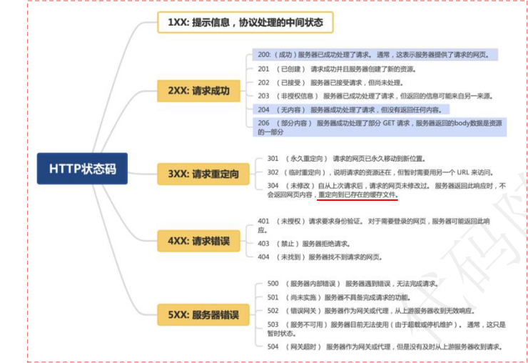
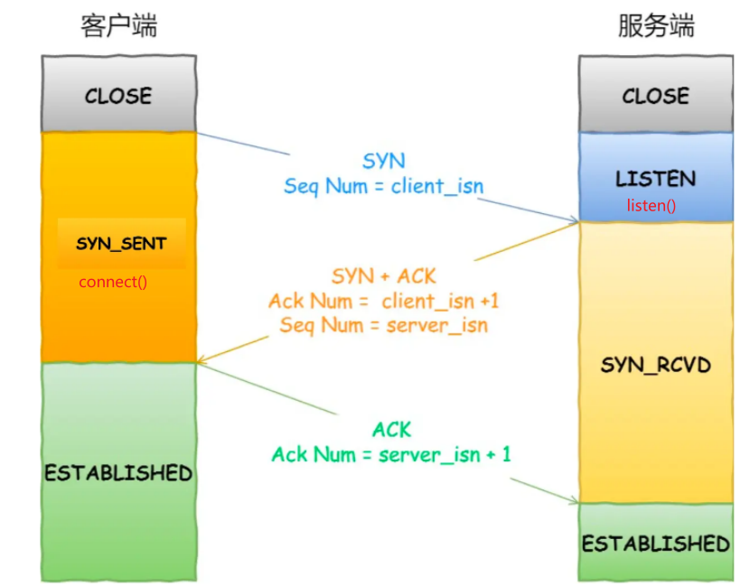
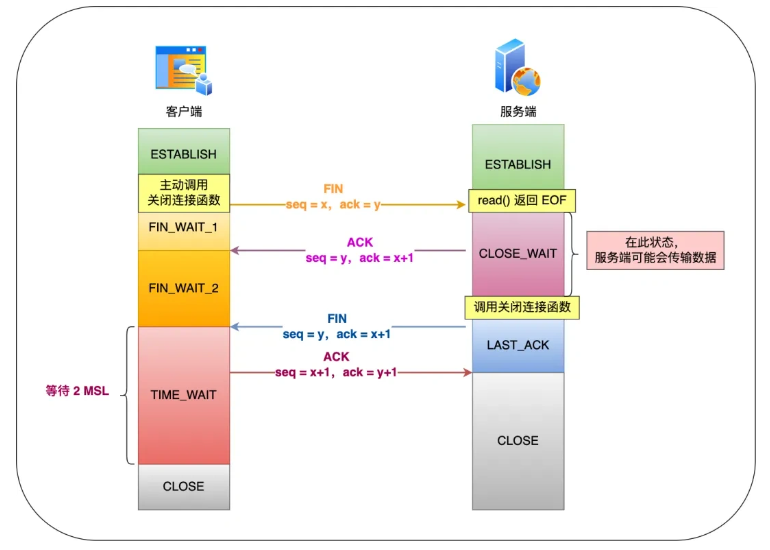

# 计算机网络

### 从输入URL到页面展示到底发生了什么？

1. 输⼊URL并解析，浏览器接收到⽤户请求，先检查浏览器缓存⾥是否有缓存该资源，如果有直接返回；如果没有进⼊下⼀
步⽹络请求
2. DNS域名解析, 将域名解析成对应的IP地址
3. 浏览器与服务器IP建⽴TCP连接。（三次握手）
4. 浏览器发送HTTP/HTTPS请求到web服务器
5. 服务器接收到请求信息，根据请求⽣成响应数据
6. 浏览器渲染⻚⾯
7. 断开连接。（四次挥手）

### DNS是什么，及其查询过程 

DNS（Domain Name System）域名管理系统，是当⽤户使⽤浏览器访问⽹址之后，使⽤的第⼀个重要协议。DNS 要解决的是**域名和 IP 地址的映射问题**。

1. ⾸先⽤户在浏览器输⼊URL地址后，会先查询浏览器缓存是否有该域名对应的IP地址。

2. 如果浏览器缓存中没有，会去计算机本地的**Host⽂件**中查询是否有对应的缓存。

3. 如果Host⽂件中也没有则会向本地的**DNS解析器**发送⼀个DNS查询请求。
4. 如果本地DNS解析器没有缓存该域名的解析记录，它会向根DNS服务器发出查询请求。（根DNS服务器并不负责解析域名，但它能告诉本地DNS解析器应该向哪个顶级域继续查询）
5. 本地DNS解析器接着向指定的顶级域DNS服务器发出查询请求。
6. 本地DNS解析器最后向**权威DNS服务器**发送查询请求。权威DNS服务器是负责存储特定域名和IP地址映射的服务器。当它收到查询请求时，它会查找域名对应的IP地址，并将结果返回给本地DNS解析器。
7. 本地DNS解析器将收到的IP地址返回给浏览器，并且还会**将域名解析结果缓存在本地**，以便下次访问时更快地响应。

## HTTP

### HTTP请求常见的状态码和字段

### 常见的请求方式？GET和POST请求的区别？

- GET：用于请求获取指定资源，通常用于获取数据。
- POST：用于向服务器提交数据，通常用于提交表单数据或进行资源的创建。
- PUT：用于向服务器更新指定资源，通常用于更新已存在的资源。
- DELETE：用于请求服务器删除指定资源。
- HEAD：类似于GET请求，但只返回资源的头部信息。

> GET和POST请求的区别

1. 作⽤不同
   + GET⽤于从服务端获取资源
   + POST⼀般⽤来向服务器端提交数据

2. 参数传递⽅式不同

   + GET请求的参数⼀般写在URL中
   + POST请求参数⼀般放在请求体中，对于数据类型也没有限制

3. 安全性不同

   + GET请求的参数直接暴露在URL中，所以更不安全

4. 参数⻓度限制不同

   + GET传送的数据量较⼩，不能⼤于2KB
   + POST传送的数据量较⼤，⼀般被默认为不受限制

5. 时间消耗不同

   + GET 产⽣⼀个 TCP 数据包
   + POST 产⽣两个 TCP 数据包

   > 对于 GET ⽅式的请求，浏览器会把 header 和 data ⼀并发送出去，服务器响应 200（返回数据）；
   >
   > ⽽对于 POST，浏览器先发送 Header，服务器响应 100 continue，浏览器再发送 data，服务器响
   >
   > 应 200 ok（返回数据）

6. 是否幂等

   > 意思是多次执⾏相同的操作，结果都是「相同」的。

   + GET ⽅法就是安全且幂等的，因为它是**「只读」**操作，⽆论操作多少次，服务器上的数据都是安全的，且每次的结果都是相同的
   + POST 因为是「新增或提交数据」的操作，会**修改服务器上的资源**，所以是不安全的，且多次提交数据就会创建多个资源，所以不是幂等的。

### HTTP缓存技术

> 对于一些具有重复性的 HTTP 请求，我们可以把这对「请求-响应」的数据都**缓存在本地**，那么下次就直接读取本地的数据。
>
> 缓存可以减少不必要的⽹络传输，节约带宽；更快的加载⻚⾯；减少服务器负载，避免服务过载的情况出现

#### 强缓存

浏览器判断请求的⽬标资源是否有效命中强缓存，如果命中，则可以直接从内存中读取⽬标资源，⽆需与服务器做任何通讯。

+ Expires强缓存 ：设置⼀个强缓存时间，此时间范围内，从内存中读取缓存并返回。

  > 判断强缓存过期的机制是获取本地时间戳，如果本地时间不准就g了，已废弃。

+ Cache-Control强缓存 ： http1.1 中增加该字段，只要在资源的响应头上写上需要缓存多久。Cache-Control:max-age=N 

#### 协商缓存

1. 基于 **last-modified** 的协商缓存

   + ⾸先需要在服务器端读出⽂件修改时间。

   + 将读出来的修改时间赋给响应头的last-modified字段。
   + 当客户端读取到last-modified的时候，会在下次的请求标头中携带⼀个字段:If-Modified-Since，⽽这个请求头中的If-Modified-Since就是服务器第⼀次修改时候给他的时间。
   + 之后每次对该资源的请求，都会带上If-Modified-Since这个字段，⽽服务端就需要拿到这个时间并再次读取该资源的修改时间，做⼀个⽐对来决定是读取缓存还是返回新的资源

   > 缺点：
   >
   > ⽂件内容本身不修改的情况下，依然有可能更新⽂件修改时间；
   >
   > ⽂件修改时间记录的最⼩单位是秒，所以，如果⽂件在⼏百毫秒内完成修改的话，⽂件修改时间不会改变这样，即使⽂件内容修改了，依然不会 返回新的⽂件。

2. 基于 **ETag** 的协商缓存 

   > 将原先协商缓存的⽐较时间戳的形式修改成了⽐较⽂件指纹（根据⽂件内容计算出的唯⼀哈希值）

   + 第⼀次请求某资源的时候，服务端读取⽂件并计算出⽂件指纹，将⽂件指纹放在响应头的Etag字段中跟资源⼀起返回给客户端。
   + 第⼆次请求某资源的时候，客户端⾃动从缓存中读取出上⼀次服务端返回的ETag也就是⽂件指纹。并赋给请求头的if-None-Match字段。
   + 服务端拿到请求头中的if-None-Match字段值（也就是上⼀次的⽂件指纹），并再次读取⽬标资源并⽣成⽂件指纹，两个指纹做对⽐。吻合则说明文件没被修改，不吻合则返回新的资源和新的文件指纹。

   > 缺点：
   >
   > ETag需要计算⽂件指纹这样意味着，服务端需要更多的计算开销。
   >
   > ETag有强验证和弱验证，所谓将强验证，ETag⽣成的哈希码深⼊到每个字节。弱验证是提取⽂件的部分属性来⽣成哈希值。 强验证非常消耗计算量，弱验证整体速度快，但准确率可能不高。

### HTTP1.0和HTTP1.1的区别

1. ⻓连接
   + HTTP1.1 ⽀持⻓连接，每⼀个TCP连接上可以传送多个HTTP请求和响应，默认开启 Connection:Keep-Alive
   + HTTP1.0 默认为短连接，每次请求都需要建⽴⼀个TCP连接。
2. 缓存
   + HTTP1.0 主要使⽤ If-Modified-Since/Expires 来做为缓存判断的标准
   + HTTP1.1 则引⼊了更多的缓存控制策略例如 Entity tag / If-None-Match 

3. 管道化
   + HTTP1.1支持管道（pipeline）网络传输，只要第一个请求发出去了，不必等其回来，就可以发第二个请求出去，可以减少整体的响应时间。
4. 带宽优化
   + HTTP1.1 在请求头引⼊了 range 头域，它允许只请求资源的某个部分，即返回码是206（Partial Content）

### HTTP2.0与HTTP1.1的区别

1. 二进制格式
   + HTTP2.0 不再像 HTTP1.1 里的纯文本形式的报文，而是全面采用了**二进制格式**，头信息和数据体都是二进制，并且统称为帧。
2. ⾸部压缩
   + HTTP2.0 使⽤ HPACK 算法对 header的数据进⾏压缩，这样数据体积⼩了，在⽹络上传输就会更快。
3. 多路复⽤
   + HTTP1.1 同一个连接中，HTTP 完成一个事务（请求与响应），才能处理下一个事务。
   +  HTTP2.0 可以在同一个连接中并发的发起多重的请求-响应消息。
4. 服务器推送
   + HTTP2.0 中，服务器可以对客户端的⼀个请求发送多个响应，即服务器可以额外的向客户端推送资源，⽽⽆需客户端明确的请求。

> HTTP2.0的缺陷：
>
> HTTP/2 还是存在“队头阻塞”的问题，只不过问题不是在 HTTP 这一层面，而是在 TCP 这一层。
>
> TCP 层必须保证收到的字节数据是完整且连续的，当「前 1 个字节数据」没有到达时，后收到的字节数据只能存放在内核缓冲区里，只有等到这 1 个字节数据到达时，HTTP/2 应用层才能从内核中拿到数据。

### HTTPS和HTTP的区别

+ HTTP 是超文本传输协议，信息是明文传输，存在安全风险的问题。HTTPS **在 TCP 和 HTTP 网络层之间加入了 SSL/TLS 安全协议**，能够加密传输。
+ HTTP 的端⼝号是 80，HTTPS 是 443
+ HTTPS 协议需要向 CA（证书权威机构）申请数字证书
+ HTTP 连接建立相对简单， TCP 三次握手之后便可进行 HTTP 的报文传输。而 HTTPS 在 TCP 三次握手之后，**还需进行 SSL/TLS 的握手过程**，才可进入加密报文传输。

### HTTPS 是如何建立连接的？（TLS）

1. ⾸先，客户端向服务器端发送请求报⽂，请求与服务端建⽴连接。ClientHello

2. 服务端产⽣⼀对公私钥，然后将⾃⼰的公钥发送给CA机构，CA机构也有⼀对公私钥，然后CA机构使⽤⾃⼰的私钥将服务端发送过来的公钥进⾏加密，产⽣⼀个CA数字证书。

3. 服务端响应客户端的请求，将CA机构⽣成的数字证书发送给客户端。SeverHello

4. 客户端将服务端发送过来的数字证书进⾏解析(浏览器中已经保存了⼤部分CA机构的密钥，⽤于对服务端发送过来的数字证书进⾏解密)，验证这个数字证书是否合法，如果不合法，会发送⼀个警告。如果合法，取出服务端⽣成的公钥。

5. 客户端取出公钥并⽣成⼀个随机码key（其实就是对称加密中的密钥）

6. 客户端将加密后的随机码key发送给服务端，作为接下来的对称加密的密钥

7. 服务端接收到随机码key后，使⽤⾃⼰的私钥对它进⾏解密，然后获得到随机码key。

8. 服务端使⽤随机码key对传输的数据进⾏加密，在传输加密后的内容给客户端

9. 客户端使⽤⾃⼰⽣成的随机码key解密服务端发送过来的数据，之后，客户端和服务端通过对称加密传输数据，随机码Key作为传输的密钥。

### HTTP多个TCP连接怎么实现

多个tcp连接是靠某些服务器对 Connection: keep-alive 的 Header 进⾏了⽀持。这样的好处是连接可以被重新使⽤，之后发送 HTTP 请求的时候不需要重新建⽴ TCP 连接。

### Cookie和Session是什么？有什么区别？

> Cookie 和 Session 都⽤于管理⽤户的状态和身份, Cookie 通过在客户端记录信息确定⽤户身份， Session 通过在服务器端记录信息确定⽤户身份。

1. Cookie
   + Cookie 是存储在⽤户浏览器中的⼩型⽂本⽂件，⽤于在⽤户和服务器之间传递数据。
   + 服务器在接收到来⾃客户端浏览器的请求之后，就能够通过分析**存放于请求头的Cookie**得到客户端特有的信息，从⽽动态⽣成与该客户端相对应的内容。

2. Session
   + 客户端浏览器访问服务器的时候，服务器把客户端信息以某种形式**记录在服务器上**。这就是 Session 。Session 主要⽤于维护⽤户登录状态、存储⽤户的临时数据和上下⽂信息等。

+ 存储位置：Cookie 数据存储在⽤户的浏览器中，⽽ Session 数据存储在服务器上。

+ 数据容量：Cookie 存储容量较⼩，⼀般为⼏ KB。Session 存储容量较⼤，通常没有固定限制。

+ 安全性：Cookie 存储在⽤户浏览器中，可以被⽤户读取和篡改。Session 数据存储在服务器上，更难被⽤户访问和修改。

+ 传输⽅式：Cookie 在每次 HTTP 请求中都会被⾃动发送到服务器，⽽ Session ID 通常通过 Cookie 或 URL 参数传递。

> session存储于服务器。拥有一个唯一识别符号sessionId，通常存放于cookie中。服务器收到cookie后解析出sessionId，再去session列表中查找。
>
> cookie类似一个令牌，装有sessionId，存储在客户端。

## TCP

### 三次握手的过程

三次握手的过程如下：

1. 首先是客户端和服务端都处于CLOSED状态；先是服务端主动监听某个端口，处理LISTEN状态
2. 客户端主动发起连接(发送SYN报文、初始化序列号ISN（seq=x）)，然后客户端进入SYN_SEND状态，等待服务器确认。
3. 服务端收到客户端发起的链接，发送ACK确认客户端的SYN报文(ack=x+1），同时发出一个SYN报文，带上自己的初始化序列号（seq=y），然后服务端进入SYN_RECV状态。
4. 客户端接收到服务端的SYN，ACK报文后，发送ACK确认服务端的SYN报文（ACK=y+1），然后处于ESTABLISHED状态，因为客户端一发一收成功了。
5. 服务端收到ACK后，也处于ESTABLISHED状态，因为它也一发一收了。

{width=50%}
<!-- 
 -->

 为什么不能两次握⼿？

+ 因为三次握⼿才能保证双⽅具有接收和发送的能⼒。 而两次握手只能确保从客户端到服务器的单向通信是可靠的。由于没有第三次握⼿，服务端就⽆法确认客户端是否收到了⾃⼰的回复。
+ 如果只有两次握手，可能会导致历史连接的错误建立。每收到⼀个 SYN ，服务器都会主动去建⽴⼀个连接。
+ 三次握手才可以让双方都确认对方的初始序列号。

为什么不能四次握⼿？

+ 三次握手就足够了。通过三次握手,双方已经能够确认各自的发送和接收能力都正常,无需再进行第四次握手。减少网络开销，提升效率。

### 四次挥手的过程

四次挥手的过程如下：

1. 客户端打算关闭连接，发送⼀个 FIN 报⽂给服务端，报文中会指定一个序列号(seq=x)，然后客户端进入FIN_WAIT_1状态。
2. 服务端收到FIN报文后，回复ACK报文给客户端，且把客户端的序列号值 +1 ，作为ACK报⽂的序列号 (seq=x+1)，之后服务端进入CLOSE_WAIT状态，客户端进入FIN_WAIT_2状态。
3. **等待服务端处理完数据后**，也要断开连接，向客户端发送FIN报文，且指定一个序列号(seq=y+1)，之后进入LAST_ACK状态。
4. 客户端收到FIN报文后，发出ACK报文进行应答，并把服务端的序列号值 +1，作为 ACK 报⽂序列号(seq=y+2)，之后进入TIME_WAIT状态。**服务端在收到客户端的ACK报文后进入CLOSE状态，至此服务端已完成连接的关闭。客户端在等待2MSL没有收到回复，才关闭连接，进入CLOSED状态，至此客户端也完成连接的关闭。**

<!--  -->

{width=75%}

> 主动关闭连接的，才有 TIME_WAIT 状态

为什么是四次挥手？

- 关闭连接时，客户端向服务端发送FIN时，**仅仅表示客户端不再发送数据了但是还能接收数据**。

- 服务器收到客户端的FIN报文时，先回一个ACK应答报文，而服务端**可能还有数据需要处理**和发送，**等服务端不再发送数据时，才发送FIN报文**给客户端来表示同意现在关闭连接。

### TCP 和 UDP的区别

*1. 连接*

- TCP 是面向连接的传输层协议，传输数据前先要建立连接。
- UDP 是不需要连接，即刻传输数据。

*2. 服务对象*

- TCP 是一对一的两点服务，即一条连接只有两个端点。
- UDP 支持一对一、一对多、多对多的交互通信

*3. 可靠性*

- TCP 是可靠交付数据的，数据可以无差错、不丢失、不重复、按序到达。
- UDP 是尽最大努力交付，不保证可靠交付数据。

*4. 拥塞控制、流量控制*

- TCP 有拥塞控制和流量控制机制，保证数据传输的安全性。
- UDP 则没有，即使网络非常拥堵了，也不会影响 UDP 的发送速率。

*5. 首部开销*

- TCP 首部长度较长，会有一定的开销，首部在没有使用「选项」字段时是 `20` 个字节，如果使用了「选项」字段则会变长的。
- UDP 首部只有 8 个字节，并且是固定不变的，开销较小。

*6. 传输方式*

- TCP 是流式传输，没有边界，但保证顺序和可靠。
- UDP 是一个包一个包的发送，是有边界的，但可能会丢包和乱序。

*7. 适用场景*

+ TCP常⽤于要求通信数据可靠场景（如⽹⻚浏览、⽂件传输等）
+ UDP常⽤于要求通信速度⾼场景（实时游戏等）

### TCP 的 Keepalive 和 HTTP 的 Keep-Alive 是⼀个东⻄吗？

HTTP 的 Keep-Alive，是由应⽤层（⽤户态） 实现的，称为 HTTP ⻓连接。主要是实现了使⽤同⼀个TCP 连接来发送和接收多个 HTTP 请求/应答，避免了连接建⽴和释放的开销。

TCP 的 Keepalive，是由 TCP 层（内核态） 实现的，称为 TCP 保活机制；TCP有⼀个定时任务做倒计时，超时后会触发任务，内容是发送⼀个探测报⽂给对端，⽤来判断对端是否存活。

### TCP连接如何确保可靠性

- **连接管理**：通过三次握手和四次挥手建立起可靠的连接，这是保证传输可靠性的前提。
- **序列号**： TCP给每个数据包指定序列号，接收⽅根据序列号对数据包进⾏排序，并根据序列号对数据包去重。
- **确认应答**：接收方接收数据之后，会回传ACK报文，报文中带有此次确认的序列号，用于告知发送方此次接收数据的情况。在指定时间后，若发送端仍未收到确认应答，就会启动超时重传。
- **超时重传**：超时重传主要有两种场景：**数据包丢失**：在指定时间后，若发送端仍未收到确认应答，就会启动超时重传，向接收端重新发送数据包。**确认包丢失**：当接收端收到重复数据时将其丢弃，并重新回传ACK报文。
- **流量控制**：接收端处理数据的速度是有限的，如果发送方发送数据的速度过快，就会导致接收端的缓冲区溢出，进而导致丢包。为了避免上述情况的发生，TCP支持根据接收端的处理能力，来决定发送端的发送速度。这就是流量控制。TCP利⽤滑动窗⼝实现流量控制。
- **拥塞控制**：当网络拥堵严重时，发送端减少数据发送。

### 既然提到了拥塞控制，那你能说说说拥塞控制是怎么实现的

**拥塞窗口 cwnd**是发送方维护的一个的状态变量，它会根据**网络的拥塞程度动态变化的**。

拥塞控制算法主要有以下⼏种：

1. 慢启动

   + 在连接刚开始时，发送⽅会逐渐增加发送窗⼝⼤⼩，从⽽以指数增⻓的速度增加发送的数据量。

   > 当发送方每收到一个 ACK，拥塞窗口 cwnd 的大小就会加 1。

2. 拥塞避免

   + ⼀旦慢启动阶段过去（当`cwnd` >= `ssthresh`），发送⽅进⼊「拥塞避免阶段」。在这个阶段，发送⽅逐渐增加发送窗⼝的⼤⼩，但增加速率较慢，避免过快增加导致⽹络拥塞。

   > 每当收到一个 ACK 时，cwnd 增加 1/cwnd。
   >
   > 拥塞避免算法就是将原本慢启动算法的指数增长变成了线性增长，还是增长阶段，但是增长速度缓慢了一些。

3. 拥塞发生

   + 当网络出现拥塞，也就是会发生数据包重传，也就进入了「拥塞发生算法」。重传机制主要有两种：超时重传、快速重传。

   > 发生超时重传的拥塞发生算法：`ssthresh` 设为 `cwnd/2`，`cwnd` 重置为 `1`
   >
   > 发生快速重传的拥塞发生算法：`cwnd = cwnd/2` ，`ssthresh = cwnd`;

4. 快速恢复

   + 快速重传和快速恢复算法一般同时使用。

   > `cwnd = ssthresh + 3` （ 3 的意思是确认有 3 个重复确认的数据包被收到了）
   >
   > 重传丢失的数据包；如果再收到重复的 ACK，那么 cwnd 增加 1；（目的是为了尽快将丢失的数据包发给目标）
   >
   > 如果收到新数据的 ACK 后，把 cwnd 设置为第一步中的 ssthresh 的值（意味着恢复过程已经结束，再次进入拥塞避免状态）
